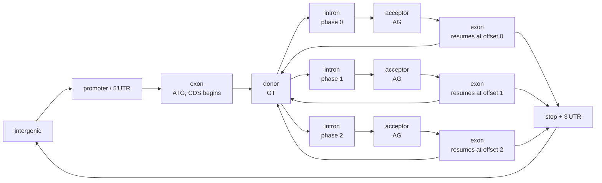
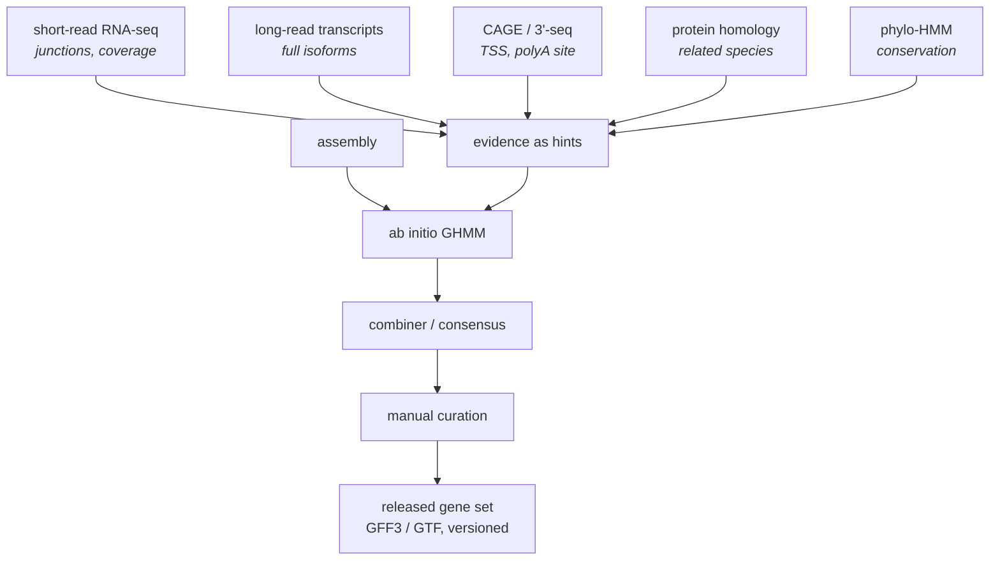

# 44 — Annotation

> **Before this:** [Ch 43](43-genome-assembly.md) · [Ch 06](../part-01-molecular-foundations/06-rna-processing.md) · [Ch 42](42-read-alignment.md) · **Time:** ~40 min

Assembly gives you a string. Annotation is the attempt to turn that string into a set of
claims about what is where and what it does — and every one of those claims is an inference,
not an observation.

## What you'll be able to do

- Separate **structural** from **functional** annotation and say which questions each answers
- Formulate eukaryotic gene finding as decoding a (generalised) hidden Markov model, and explain quantitatively why ORF-finding and motif-matching both fail on their own
- Rank evidence types for structural annotation, and explain why RNA-seq and long-read transcript data displaced pure prediction
- Explain why GENCODE and RefSeq disagree, what that costs you downstream, and why a change of annotation version alone can move a result on unchanged data
- Predict how a variant's annotated consequence changes with the transcript it is evaluated against, and say what MANE Select fixes
- Distinguish a chromatin-state label from a claim about function, and explain why a regulatory annotation holds for one cell type only and an lncRNA gene model only provisionally
- Name the biases in homology transfer and GO enrichment, and explain why they inflate confidence rather than just adding noise

## The core idea

Annotation splits cleanly into two questions, and conflating them is the source of most
confusion about it.

| | Question | Output | Kind of claim |
|---|---|---|---|
| **Structural** | *Where are the features?* | Intervals: genes, transcripts, exons, CDS, UTRs, regulatory elements | Coordinates on a build |
| **Functional** | *What do they do?* | Labels: protein names, domains, ontology terms, pathway membership | Assertions about biology |

Structural annotation is a **parsing problem**: given a 3.1-Gb string and a probabilistic
grammar of what a gene looks like, find the highest-scoring parse. Functional annotation is
an **inference-by-analogy problem**: this thing resembles that thing, whose function someone
once measured, therefore.

Both are models fitted to evidence. Neither is ground truth. And critically: **annotation is
versioned software, and your results are downstream of the version you used.** A gene
expression result, a variant consequence, an enrichment p-value — each can change because
somebody re-ran the annotation pipeline, with no new biology involved at all.

---

## 1. Open reading frames, and why they nearly solve bacteria and fail on you

An **open reading frame** is a stretch of sequence in one of the six frames (three per
strand) running from a start codon to the first in-frame stop. Under a null model of random
sequence with uniform base composition, stop codons occur at rate 3/64, so ORF lengths are
geometric with mean ≈ 21 codons. The probability of a chance ORF of 300 codons is
(61/64)³⁰⁰ ≈ 6 × 10⁻⁷. In a bacterial genome, where genes are contiguous and dense, "long
ORF" is therefore a near-sufficient detector. Bacterial gene finding is close to solved.

In eukaryotes it collapses, and the reason is introns ([Ch 06](../part-01-molecular-foundations/06-rna-processing.md)).
The coding sequence is fragmented across exons that are individually short — a typical
internal coding exon is on the order of 120–150 bp, i.e. 40–50 codons, which is well inside
the noise floor of the chance calculation above. The signal only exists after the introns
are removed, and removing them correctly is the entire problem.

```
genomic DNA (+ strand)
   ══════╤═════════╤══════════════╤═════════╤═══════════════╤═════════╤══════
         │ exon 1  │   intron 1   │ exon 2  │   intron 2    │ exon 3  │
         └─5'UTR─▶ATG────────┐    └─────────┘               └────┐TAA─┘ 3'UTR
                             │  splice: the codon interrupted here
                             ▼  may be split 0, 1 or 2 bases in — its "phase"
mRNA after splicing
   ─────5'UTR──▶ATG · GCT · TTA · CGT ······ TAA──3'UTR───
```

Worse, the search space is combinatorial. A locus with *d* candidate donor sites and *a*
candidate acceptor sites admits an enormous number of consistent splice parses. You cannot
enumerate; you need a scoring model over parses and a dynamic program to maximise over them.
Which is exactly what an HMM gives you.

## 2. Ab initio gene finding as HMM decoding

Model the genome as a sequence of hidden states emitting observed bases. The parse *is* the
state path.



The three intron branches are *alternatives*, not a sequence. Which one the donor enters is
fixed by where in the codon the intron cut; from there only the matching acceptor and exon
are reachable, because a phase-*k* intron must be followed by an exon resuming at offset *k*.
Transitions are phase-preserving, and that is the whole trick.

Three design decisions carry the whole model.

**Phase-aware states.** The reading frame must be preserved across an intron. An intron can
interrupt a codon after 0, 1 or 2 bases, so you need three intron states, and exon states
tagged with the frame offset at which they begin. This is what makes the state graph enforce
a *global* frame constraint using only local transitions — the constraint is encoded in the
topology, so Viterbi respects it for free. Separate states are also needed for initial,
internal, terminal and single-exon genes, and for both strands (or you run the model twice).

**Two kinds of emission.** *Content sensors* score composition over long stretches: coding
regions get an inhomogeneous three-periodic Markov model of order ~5 — that is, the
probability of a base depends on the previous five bases *and* on its position within the
codon. This captures codon usage and hexamer statistics simultaneously, and it is by far the
strongest discriminator between coding and non-coding sequence. Introns and intergenic
regions get a homogeneous model of the same order. *Signal sensors* score short motifs at
state boundaries — splice sites, start, stop — usually as position weight matrices, or as
first-order weight-array models when neighbouring positions are correlated (they are, at
splice sites).

**Decoding.** Viterbi gives the maximum-probability parse in O(L·|S|) time with the sparse
transition matrix the topology provides. Posterior decoding via forward–backward gives
per-base and per-exon confidence, which is more useful than the single best path: an exon
with posterior 0.51 and one with posterior 0.999 should not be reported identically.
Sampling suboptimal paths from the posterior is one principled way to propose alternative
isoforms.

### Why GHMMs, not plain HMMs

A plain HMM implies a geometric length distribution for any state: P(run of length ℓ) =
(1−p)^(ℓ−1)·p, monotonically decreasing, with the mean fixed by the self-transition
probability. Real internal exons are not geometric — their length distribution is unimodal
with a mode around 120–150 bp and very few exons under 30 bp. Introns are the opposite:
heavy-tailed over four orders of magnitude.

A **generalised HMM** replaces self-transitions with an explicit duration distribution: the
model enters a state, draws a length ℓ from a fitted d(ℓ), and emits a whole segment. Exon
length becomes a modelled quantity rather than an artefact of the transition matrix, which
measurably improves exon-boundary accuracy. The cost is complexity: decoding becomes
O(L·D·|S|) where D is the maximum modelled duration, so implementations cap D for exon
states and fall back to geometric tails for introns. AUGUSTUS is the best-known
implementation of this idea; the idea, not the program, is what transfers.

Training needs labelled genes. For a new genome you often have none, so gene finders
bootstrap: predict with a generic model, take the highest-confidence predictions as a
training set, refit, iterate. This is self-training, with the usual self-training failure
mode — confident, systematic, self-reinforcing error.

## 3. The signals, and why signal alone is hopeless

| Signal | Consensus (DNA, human) | Where |
|---|---|---|
| Donor (5′ splice site) | `MAG↓GTRAGT` | exon→intron boundary |
| Branch point | loose `ytnAy`, the bold A is the branching adenine | ~18–40 nt upstream of acceptor |
| Polypyrimidine tract | run of C/T | between branch point and acceptor |
| Acceptor (3′ splice site) | `(Y)n NCAG↓G` | intron→exon boundary |
| Start | `gccRccATGG` (Kozak); −3 purine and +4 G matter most | first CDS codon |
| Stop | `TAA`, `TAG`, `TGA` | last CDS codon |
| Polyadenylation signal | `AATAAA`, or `ATTAAA` | 10–30 nt upstream of cleavage |
| Promoter | CpG island (majority of human promoters); TATA box (a minority) | around the TSS |

```
        ...exon...              intron (removed by splicing)              ...exon...
  5'  N N N  M A G | G T R A G T ..... y t n A y ..... (Y)n N C A G | G  N N N  3'
                   ^^^^^^^^^^^^^                ^          ^^^^^^^^^^^
                   donor                    branch A       acceptor
```

Now the calculation that explains why gene finding needs a grammar. Treat the donor site as
a motif of about **8 bits** of information content (an approximate teaching figure; the
region from −3 to +6 is the informative part, and most positions are far from fixed). A
random position matches a motif of *I* bits with probability 2^(−I), so in a 3.1-Gb genome
you expect

    3.1 × 10⁹ / 2⁸  ≈  1.2 × 10⁷

chance matches. The annotation contains on the order of a few hundred thousand distinct real
donor sites. **Roughly fifty spurious motif matches for every genuine splice site** — and the
acceptor is no easier. It carries slightly *more* total information (~9–10 bits), but spread
over roughly 28 positions dominated by a degenerate polypyrimidine tract, so the boundary
itself is far less sharply localised than the donor's: two fixed bases, `AG`, and a haze.

Motif matching cannot find genes. What rescues it is context: a donor site is only credible
if it terminates a stretch whose hexamer statistics look coding, is preceded upstream by a
plausible acceptor and a start codon in a consistent frame, and produces an exon of
plausible length. The HMM is precisely the machinery for combining a weak local signal with
long-range consistency constraints. Signal sensors alone have terrible precision; content
sensors alone have terrible boundary resolution; the joint model has neither problem.

## 4. Evidence-based annotation: stop guessing, start observing

Ab initio prediction is what you do when you have nothing else. Since RNA-seq, you almost
always have something else, and modern annotation is evidence-driven with prediction as the
fallback.

**RNA-seq is decisive because it observes exon structure directly.** A spliced aligner
([Ch 42](42-read-alignment.md)) reports a read crossing a junction with an `N` operator in
its CIGAR:

```
read:    ...GGCTACTTGAC          ACGTTCAGGTA...
ref:     ...GGCTACTTGAC[--- 1203 bp intron ---]ACGTTCAGGTA...
CIGAR:   42M1203N59M
                ^^^^^^ this is an observation of a splice junction,
                       not an inference from a motif
```

Count reads supporting each junction and you have an empirical, quantitative catalogue of
introns. This single fact is why annotation quality jumped discontinuously in the 2010s.

Its limits are real. Coverage is expression-dependent — a gene silent in your tissue is
invisible, so annotation completeness tracks the breadth of your tissue panel. And short
reads give you *junctions* but not *connectivity*: knowing junctions A, B, C exist does not
tell you which transcript contains which combination. Reconstructing isoforms from junction
counts is a graph problem with the same degeneracy that makes assembly hard
([Ch 43](43-genome-assembly.md)).

**Long-read transcript sequencing solves connectivity by brute force.** One read spanning a
full-length cDNA (Iso-Seq) or a native RNA molecule end to end (direct RNA sequencing) *is*
one isoform observation — no reconstruction required. Direct RNA additionally reads
poly(A) tail length and base modifications on the original molecule. This is now the main
driver of transcript-model revision, and it consistently finds that loci have more isoforms
than short-read annotation credited.

**CAGE and 3′-end sequencing pin the ends.** Capturing the 5′ cap and sequencing from there
gives transcription start sites at base resolution — and reveals that a TSS is usually a
*distribution* over tens of base pairs rather than a point. Polyadenylation-site sequencing
does the same at the other end. Both matter because ends are what ab initio models predict
worst and what UTR-dependent variant annotation depends on.

**Protein homology.** Spliced protein-to-genome alignment from a related species is strong
evidence for conserved coding exons and forces frame consistency. It is blind to
lineage-specific genes, UTRs and everything non-coding.

**Comparative evidence.** Conservation is not function, but it is a prior. A phylo-HMM makes
this precise: the emission model at each state is a substitution model on a phylogeny
([Ch 34](../part-07-molecular-evolution/34-phylogenetics.md)) with state-specific rates, so
"conserved" and "conserved with three-periodic, nonsynonymous-depleted structure" become
distinguishable states rather than a single conservation score. For a newly assembled genome
or an alternative haplotype in a pangenome, annotation is often *projected* through a
whole-genome alignment from an already-annotated assembly and then repaired locally
([Ch 45](45-reference-genomes-and-pangenomes.md)).

**Combiners** reconcile all of it. Two architectures: score candidate models from multiple
sources and pick a weighted consensus per locus; or fold the evidence into the gene finder
as *hints* that modify emission and transition probabilities in specific intervals. The
second is the principled one — evidence becomes a prior, and Viterbi still returns a single
coherent parse rather than a stitched-together chimera.



Manual curation is still in that diagram, and still matters: the hard cases — readthrough
transcripts, nested genes, pseudogene versus paralogue, whether a two-exon transcript with
one supporting read is a gene — are editorial judgements.

## 5. The reference annotations, and why two of them disagree

Two human gene sets are in general use, and they are not the same.

| | **GENCODE / Ensembl** | **RefSeq (NCBI)** |
|---|---|---|
| Produced by | EMBL-EBI + manual Havana curation | NCBI, curated + Gnomon automated pipeline |
| Transcript IDs | `ENST…` (versioned) | `NM_…` curated, `XM_…` predicted |
| Philosophy | inclusive — admits models with weaker support, extensive lncRNA and pseudogene annotation | more conservative on transcript models; curated/predicted status made explicit |
| Coordinates | GRCh38 primary; also T2T-CHM13 | GRCh38 primary; also T2T-CHM13 |
| Used by | Ensembl VEP, most research RNA-seq pipelines | clinical reporting in much of the US, HGVS `NM_` conventions |

They disagree because the underlying decisions are judgement calls: what evidence threshold
admits a transcript, whether a readthrough between neighbouring genes is a gene, whether a
locus with an ORF and no protein evidence is coding or a pseudogene, where a UTR ends. Same
evidence, different editorial policy, different gene set.

The consequence is not academic. **Gene counts are a property of the annotation, not of the
genome.** From the pinned numbers ([verified-facts](../reference/verified-facts.md), GENCODE
Human Release 50):

| Category | Genes |
|---|---|
| Protein-coding | 19,442 |
| Long non-coding RNA | 35,885 |
| Small non-coding RNA | 7,608 |
| Pseudogenes | 14,702 |
| IG/TR protein-coding segments | 412 |
| Readthrough genes (protein-coding, not in the 19,442) | 665 |
| Artifact biotype | 19 |
| **Total genes** | **78,733** |
| **Total transcripts** | **644,292** |

Those three small rows are the ones everybody skips. They sum to 1,096, and 1,077 of the
1,096 — the immunoglobulin and T-cell-receptor gene segments plus the readthrough genes —
are **protein-coding**, but GENCODE tabulates them separately, so they appear in the total
and in neither the protein-coding nor the non-coding tally. There is a trap in the other
direction too: GENCODE also lists **237 IG/TR pseudogenes**, and those are already inside the
14,702, not additional to it — `10,634 processed + 3,535 unprocessed + 296 unitary + 237
IG/TR = 14,702` exactly. Add them again and the total stops closing.

Two derivations worth making explicit. Non-coding and pseudogene loci outnumber
protein-coding loci by (35,885 + 7,608 + 14,702) / 19,442 = 58,195 / 19,442 ≈ **3.0**, which
is what kills the "the genome is 2% gene and 98% junk" framing
([Ch 39](39-genome-landscapes.md)). Note that the non-coding total must be *summed* — never
obtained as 78,733 − 19,442 = 59,291, which quietly reclassifies those 1,096 separately
tabulated entries — 1,077 of them protein-coding — as non-coding. And
644,292 / 78,733 ≈ **8.2 transcripts per annotated gene** on average — a reminder that "the"
transcript of a gene is a fiction you choose, which is the subject of §8.

**Annotation is a moving target.** Releases ship several times a year; transcripts are added,
merged, reclassified and retired. A differential-expression result, a splice-variant call, a
GO enrichment can change between two runs where the only difference is the GTF. Treat the
annotation version like a dependency lockfile: pin it, record it in the methods, and never
compare counts computed against different versions.

## 6. Functional annotation, and how it goes wrong

**Homology transfer** is the workhorse: find the best-matching characterised protein, copy
its description. This inherits the **ortholog conjecture** — that orthologues retain
ancestral function while paralogues diverge ([Ch 35](../part-07-molecular-evolution/35-genome-evolution.md)).
The conjecture holds on average and fails often enough to matter, and the classic error is
transferring through a paralogue: your best hit is the most similar *sequence*, which after
a duplication need not be the functional counterpart.

Worse, transfer compounds. Descriptions are copied from databases whose entries were
themselves copied, usually with no provenance recorded, so a single early mistake propagates
into thousands of genomes and becomes unfalsifiable by consensus. Every functional label
should be read as *someone's inference, of unknown depth*.

**Domains are the more robust unit.** Proteins are modular; a protein family is represented
as a profile HMM over a multiple alignment, with match/insert/delete states and
position-specific emission probabilities — the same formalism as §2, applied to amino acids
instead of a genome. Pfam is the family-level collection; InterPro integrates multiple
signature databases and reconciles their overlapping calls. Domain annotation is better
behaved than whole-protein best-hit because it is local (it annotates the part that actually
matches) and explicitly probabilistic (it reports a score and an E-value, not a name).

**Gene Ontology** is a controlled vocabulary organised as a DAG — not a tree, because terms
have multiple parents — with three disjoint aspects: *molecular function* (what the product
does biochemically), *biological process* (what larger process it participates in), and
*cellular component* (where it is). Annotations obey the true-path rule: annotating to a term
implies all its ancestors. Each annotation carries an **evidence code**, and the majority of
annotations in most organisms are `IEA` — inferred electronically, never experimentally
verified.

GO enrichment tests — hypergeometric or Fisher on foreground versus background — carry three
biases a statistician should refuse to ignore:

- **The DAG makes the tests dependent.** Nested terms share genes, so p-values across terms
  are heavily correlated. FDR control that assumes independence is not doing what you think.
- **The universe is a choice.** Results move substantially depending on whether the background
  is all genes, all annotated genes, or all genes expressed in your assay. The last is
  usually correct and rarely used.
- **Study bias dominates.** Well-studied genes have more annotations. Long, highly-expressed,
  disease-associated genes are better studied, and they are also more likely to appear in
  any experimentally derived gene list. Your foreground and background are not exchangeable
  with respect to annotation depth, so a list enriched for well-studied genes is "enriched"
  for almost every term. The literature is extraordinarily skewed: a minority of
  protein-coding genes accounts for the great majority of publications, and thousands have
  essentially no dedicated literature at all.

**Pathway databases** (KEGG, Reactome and relatives) are curated graphs of reactions and
regulatory relationships. They are more structured than GO and correspondingly more
editorial: pathway boundaries are drawn by curators, and "in the pathway" is not a
measurement.

## 7. The non-coding frontier

Coding annotation is mature. Everything else is not.

**Regulatory elements** are annotated from chromatin data rather than sequence: accessibility,
histone modifications, transcription-factor occupancy, methylation
([Ch 49](../part-10-functional-genomics/49-epigenome-profiling.md)). The standard method is,
again, an HMM — bin the genome (typically 200 bp), observe a binary vector of marks per bin,
learn a small number of multivariate emission states unsupervised, then label the states post
hoc as "active promoter", "strong enhancer", "heterochromatin". Two caveats that are
routinely dropped:

- The labels describe **mark patterns, not function**. "Strong enhancer" means the chromatin
  resembles that of known enhancers. It does not mean deleting the element does anything.
- The annotation is **per cell type**, not per genome. There is no single regulatory
  annotation of the human genome, and using one from the wrong tissue is a category error
  ([Ch 52](../part-11-human-and-statistical-genomics/52-association-to-mechanism.md)).

**lncRNA annotation** is the least settled part of the gene set, and note from the table above
that lncRNA genes are the *largest* category in GENCODE. Transcription is pervasive, so
detecting a transcript is weak evidence that it matters. Coding-potential classifiers (ORF
length, codon bias, conservation, ribosome occupancy) separate coding from non-coding
imperfectly, and ribosome profiling keeps finding small ORFs inside annotated "non-coding"
transcripts that are genuinely translated. Some loci also act through the *process* of
transcription rather than through the transcript, in which case "the gene product" is the
wrong abstraction entirely ([Ch 24](../part-04-gene-regulation/24-rna-based-regulation.md)).
Treat lncRNA gene models as provisional.

## 8. Variant annotation: consequence is a function of two arguments

Here is the practical trap, and it catches people constantly.

**A variant does not have a consequence. A (variant, transcript) pair has a consequence.**

The same substitution can be missense on one isoform, intronic on another and 3′UTR on a
third, because the isoforms disagree about what that position is. Consequence predictors
(VEP, SnpEff and relatives) are correct about this: they emit one row per overlapping
transcript. What varies is what your pipeline does with those rows.

Two aggregation conventions dominate, and they give different answers:

- **Most severe consequence** across all transcripts, ranked by a fixed severity ordering of
  Sequence Ontology terms. Note that this ordering is a *convention*, not a biological fact —
  a stop-gain in a transcript expressed nowhere outranks a missense in the dominant isoform.
- **A designated transcript.** Ensembl canonical, RefSeq Select, or — the one to prefer —
  **MANE Select**: a single transcript per gene on which RefSeq and Ensembl agree exactly,
  matched in exon coordinates and CDS on GRCh38, with paired `NM_`/`ENST` accessions. MANE
  v1.5 (updated March 2026) reports near-total coverage of protein-coding genes annotated in
  both gene sets. **MANE Plus Clinical** adds further transcripts for genes where MANE Select
  alone would fail to represent reported pathogenic and likely-pathogenic variants.

MANE matters because clinical variant nomenclature is transcript-relative. HGVS `c.` numbering
counts from the CDS start *of a named transcript*, so `c.650G>A` is meaningless without an
accession *and version* — which is why clinical reports write `NM_012345.4:c.650G>A` and why
one agreed transcript per gene removes an entire class of reporting error
([Ch 55](../part-11-human-and-statistical-genomics/55-clinical-variant-interpretation.md)).

Transcript dependence extends to downstream predictions. Whether a premature stop triggers
nonsense-mediated decay depends on the exon–junction map: a stop more than roughly 50 nt
upstream of the final exon–exon junction is predicted to trigger NMD, one downstream of it is
not ([Ch 06](../part-01-molecular-foundations/06-rna-processing.md)). Change the transcript
model and the NMD call flips with it.

## 9. Quality, and how errors propagate

Annotation error is not noise. It is systematic, silent, and it enters every downstream
analysis in a form that looks like a result.

| Annotation error | What it produces downstream |
|---|---|
| Gene missing from the GTF | Zero counts in RNA-seq — indistinguishable from "not expressed". Invisible to enrichment. No consequence annotation for its variants |
| Wrong exon boundary | Wrong CDS, wrong frame, wrong protein consequence for every variant in the exon |
| UTR truncated | 3′UTR variants annotated as intergenic; regulatory variants lost |
| Two genes merged / readthrough admitted | Artificially correlated expression, spurious co-expression modules |
| Pseudogene annotated as coding | Multi-mapping reads assigned confidently, false variant calls at the parent locus |
| Isoform set incomplete | "Novel" splice junctions that are simply unannotated; inflated splicing-aberration counts |

Standard quality measures are all comparisons against an external expectation: completeness
against a set of near-universal single-copy orthologues (reported as complete / duplicated /
fragmented / missing — duplication excess is a strong hint that the *assembly* is unmerged,
not that the annotation is wrong); splice-junction precision and recall against RNA-seq; and
transcript-level recall against long-read data.

The discipline that follows is one line: **the annotation version is a parameter of your
result, so report it next to the genome build.**

---

## Common misconceptions

| What people think | What's actually true |
|---|---|
| The human genome has ~20,000 genes, full stop | It has 19,442 protein-coding genes *in GENCODE 50*, and 78,733 total annotated genes. The count is a property of the annotation and moves with each release |
| Finding genes means finding ORFs | True in bacteria. In eukaryotes the CDS is fragmented into exons too short to be detectable as ORFs; the problem is finding the splice structure |
| GENCODE and RefSeq are two copies of the same thing | Independent projects with different inclusion policies. They disagree on transcript models, gene boundaries and coding status, and the disagreements reach clinical reports |
| A variant has a consequence | A variant has one consequence *per transcript*. "The" consequence is an aggregation rule you chose, and different rules disagree on the same VCF row |
| Conservation proves function | Conservation is evidence of past constraint, and useful as a prior. It misses lineage-specific function and mislabels recently degraded sequence |
| A "strong enhancer" annotation means the element regulates something | It means the chromatin marks resemble known enhancers, in one cell type. Function requires perturbation, not correlation |
| GO enrichment tells you what your gene list does | It tells you which terms are over-represented given a background you chose, in a vocabulary whose coverage tracks how much each gene has been studied |
| Re-running the pipeline reproduces the result | Not if the annotation was updated. Same reads, same code, different GTF, different numbers |

## Worked example: one variant, three transcripts, two reports

A constructed locus — call the gene *EXMP1*, on the plus strand of chr7 (GRCh38), with
coordinates chosen for arithmetic clarity rather than copied from a real gene.

**The locus.** Exon 3 spans chr7:100,004,201–100,004,500. Transcripts A and B share exons 1
and 2, which together contribute CDS positions 1–600.

**The variant.** `chr7:g.100,004,250G>A` (GRCh38).

**Step 1 — locate it within exon 3.** 100,004,250 − 100,004,201 + 1 = **base 50 of exon 3**.

**Step 2 — transcript A (exon 3 is coding).** Exon 3 begins at CDS position 601, so the
variant is at CDS position 600 + 50 = **650**. In GFF3 terms the CDS feature for exon 3
carries phase 0, because 600 is a multiple of 3 and the exon opens on a codon boundary:

```
chr7  HAVANA  exon  100004201  100004500  .  +  .  Parent=T-A
chr7  HAVANA  CDS   100004201  100004500  .  +  0  Parent=T-A
```

Codon number = ⌈650 / 3⌉ = **217**; position within the codon = 650 − 3 × 216 = **2**. The
reference codon 217 is `CGT` = arginine; changing its second base G→A gives `CAT` =
histidine. Consequence: **missense**, `c.650G>A`, `p.(Arg217His)`.

**Step 3 — transcript B (alternative acceptor).** Transcript B uses an acceptor 100 bp
downstream, so its exon 3 starts at 100,004,301 and the variant lies inside the retained
intron, 100,004,301 − 100,004,250 = **51 bases upstream of that exon's first base**, which is
CDS position 601 in B. HGVS: `c.601-51G>A`. That offset is well outside the ±8 bp
splice-region window. Consequence: **intron_variant**.

**Step 4 — transcript C (earlier stop).** Transcript C uses an alternative first exon that
starts translation in a different frame; its CDS terminates at a stop codon ending at
100,002,900, so all of exon 3 is 3′UTR. The 3′UTR begins at 100,004,201 = `c.*1`, so the
variant is `c.*50G>A`. Consequence: **3_prime_UTR_variant**.

**Step 5 — the annotator's output.**

| Transcript | Position is… | HGVS | Consequence |
|---|---|---|---|
| T-A | CDS exon 3 | `c.650G>A`, `p.(Arg217His)` | `missense_variant` |
| **T-B** *(MANE Select)* | intron 2 | `c.601-51G>A` | `intron_variant` |
| T-C | 3′UTR | `c.*50G>A` | `3_prime_UTR_variant` |

**Step 6 — two pipelines, two reports, same VCF row.** A research pipeline taking the *most
severe* consequence reports **missense, p.(Arg217His)** and passes the variant to a
pathogenicity predictor. A clinical pipeline restricted to **MANE Select** reports
**intronic, 51 bp from the acceptor** and filters it out. Neither is a bug. They answer
different questions, and only one of them states which question it answered.

**Step 7 — and it moves.** Suppose the previous annotation release designated T-A as
canonical and the current one designates T-B. The variant changes from missense to intronic
between two runs of an unchanged pipeline on unchanged data. This is the concrete form of
"annotation is a moving target", and it is why the annotation version belongs in the report
alongside the genome build.

## Connections

- **Back to:** [Ch 06](../part-01-molecular-foundations/06-rna-processing.md) (splicing, the
  reason eukaryotic gene finding is hard) · [Ch 42](42-read-alignment.md) (spliced alignment
  and the `N` CIGAR operator) · [Ch 43](43-genome-assembly.md) (the string being annotated) ·
  [Ch 41](41-data-formats.md) (GFF3/GTF, and the 0-based/1-based trap) ·
  [Ch 35](../part-07-molecular-evolution/35-genome-evolution.md) (orthology, paralogy and the
  ortholog conjecture)
- **Forward to:** [Ch 45](45-reference-genomes-and-pangenomes.md) (annotating many haplotypes
  by projection) · [Ch 47](../part-10-functional-genomics/47-rna-seq.md) (counts are counts
  *per annotated feature*) · [Ch 46](../part-10-functional-genomics/46-variant-calling.md) and
  [Ch 55](../part-11-human-and-statistical-genomics/55-clinical-variant-interpretation.md)
  (transcript-dependent consequences, MANE, HGVS) ·
  [Ch 49](../part-10-functional-genomics/49-epigenome-profiling.md) (chromatin-state
  segmentation) · [Ch 52](../part-11-human-and-statistical-genomics/52-association-to-mechanism.md)
  (why regulatory annotation is the bottleneck)

## Check yourself

**1. ORF-finding nearly solves bacterial gene finding and fails badly in humans. Give the quantitative reason.**

<details><summary>Answer</summary>

Under a random-sequence null, stop codons appear at rate 3/64, so ORF lengths are geometric
with mean ≈ 21 codons and a 300-codon ORF has probability (61/64)³⁰⁰ ≈ 6 × 10⁻⁷. Bacterial
genes are contiguous and long, so "long ORF" has enormous discriminative power.

Human coding sequence is split across exons of roughly 120–150 bp — about 40–50 codons —
which is within the range you expect by chance many times over in 3.1 Gb. The ORF signal
only exists in the spliced transcript, and recovering the splice structure is the actual
problem. Long ORFs are a consequence of correct annotation, not a route to it.

</details>

**2. Why does a gene-finding HMM need separate exon states for each phase, rather than one exon state?**

<details><summary>Answer</summary>

Because reading frame is a global constraint and HMM transitions are local. An intron can
interrupt a codon after 0, 1 or 2 bases, and the next exon must resume at exactly that
offset. Tagging exon and intron states with phase and permitting only phase-consistent
transitions encodes the frame constraint in the graph topology, so Viterbi cannot return a
frame-inconsistent parse. With a single exon state the model could emit an exon chain whose
concatenated length is not a multiple of three and whose CDS is nonsense.

</details>

**3. A colleague scans the genome for the splice donor consensus and reports millions of hits. What went wrong, and what fixes it?**

<details><summary>Answer</summary>

Nothing went wrong — that is the correct behaviour of a low-information motif. At roughly
8 bits, chance matches occur about every 2⁸ = 256 bp, giving ~1.2 × 10⁷ hits in 3.1 Gb
against a few hundred thousand real donor sites: roughly fifty false positives per true one.

The fix is not a stricter motif (that loses real sites, which are themselves degenerate) but
context. A donor site is credible only if it ends a region whose hexamer/codon statistics
look coding, is reachable from an upstream acceptor or start in a consistent frame, and
yields an exon of plausible length. That joint scoring is exactly what the GHMM performs, and
adding observed RNA-seq junctions collapses the problem further by supplying direct evidence.

</details>

**4. Two labs analyse the same VCF for the same patient and report different consequences for the same variant. Give two distinct mechanisms.**

<details><summary>Answer</summary>

(i) **Different aggregation convention.** One takes the most severe consequence across all
overlapping transcripts; the other restricts to MANE Select. A variant that is missense on a
minor isoform and intronic on MANE gets reported two different ways from identical input.

(ii) **Different annotation source or version.** GENCODE and RefSeq disagree on transcript
models, gene boundaries and coding status; and within either, a newer release can add, retire
or re-designate transcripts. The same variant can move between missense, intronic and UTR
without a single base changing.

A third: different genome build, or `c.` coordinates quoted against an unversioned transcript
accession, so the numbering itself refers to a different sequence.

</details>

**5. A GO enrichment on your 300-gene hit list returns dozens of significant terms, mostly generic ones like "signal transduction" and "regulation of transcription". Why is that the expected result even under a true null?**

<details><summary>Answer</summary>

Because the annotation is not uniformly deep across genes. Long, highly-expressed,
disease-associated, historically-studied genes carry far more GO annotations than the rest,
and they are also over-represented in almost any experimentally derived gene list — through
detection power, gene length, and expression. Foreground and background are therefore not
exchangeable with respect to annotation depth, so a list enriched for well-annotated genes is
enriched for nearly every broad term.

Three further problems compound it: most annotations are `IEA`, never experimentally verified;
the ontology is a DAG, so nested terms share genes and the tests are strongly dependent,
breaking independence-based FDR control; and the background universe is a free parameter that
materially changes the answer — it should be the set of genes your assay could have detected,
not all genes.

The honest reading of a generic enrichment result is that your list is biased toward
well-studied genes, not that your biology is about signal transduction.

</details>
