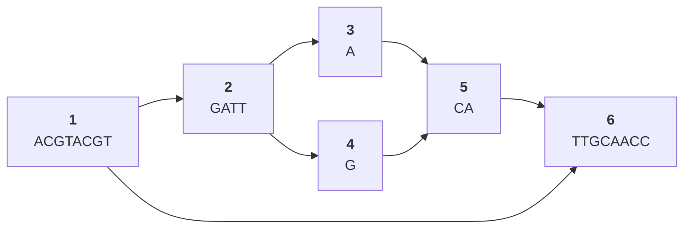
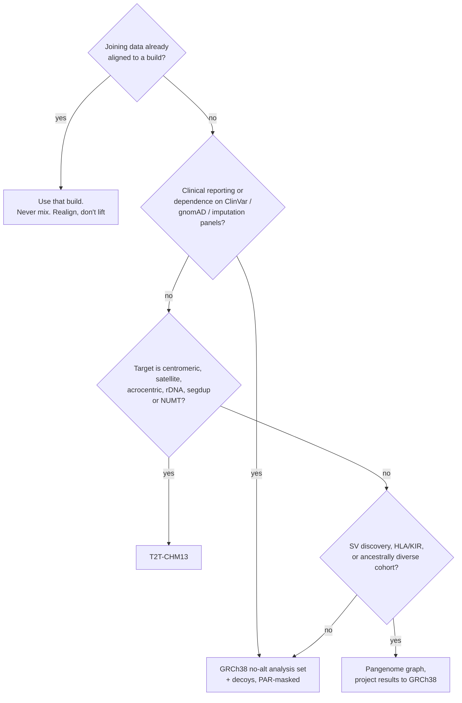

# 45 — Reference genomes and pangenomes

> **Before this:** [Ch 42](42-read-alignment.md) · [Ch 43](43-genome-assembly.md) · [Ch 44](44-annotation.md) · **Time:** ~45 min

## What you'll be able to do

- Explain what the human reference genome is as an object, and why "reference" does not mean "normal"
- Predict, from alignment scoring arithmetic, which classes of variation reference bias destroys and which it merely dents, and why the loss scales with a genome's distance from the reference's donors
- Describe what T2T-CHM13 added, and say precisely why a hydatidiform mole made it tractable
- Read and write a small pangenome graph in GFA — segments, links, paths, walks — and count the paths through it
- Explain why a graph admits no total order on positions, and distinguish node-ID, path-offset and reference-projected coordinates by what each one breaks
- Explain why indexing a graph is not the same problem as indexing a string, and what practical indexes do instead
- Choose a reference for a given project and enumerate what breaks if you switch mid-study

## The core idea

A reference genome is a **coordinate system with a sequence attached**. Its value is almost entirely in being *shared*: `chr7:117,559,590` (GRCh38) means the same thing in your VCF, in ClinVar, in a browser track, and in a paper from 2019. That shared addressability is what makes genomics composable at all.

The cost is that a coordinate system built from one sequence can only describe things that exist in that sequence. Everything else — an insertion you carry that the reference lacks, a satellite array with a different copy number, a divergent HLA haplotype — has no address. And because alignment is scored against that one sequence, reads carrying such variation align worse or not at all. **The reference is simultaneously the thing that makes variation measurable and the thing that systematically hides some of it.**

A pangenome resolves the tension by making the reference a *graph* whose paths are many real haplotypes rather than a single string. The sequence problem gets much better. The coordinate problem gets much worse — and coordinates were the point.

---

## 1. What the reference actually is

GRCh38 is not anybody's genome. It is a **mosaic composite** assembled from tiled bacterial-artificial-chromosome clones drawn from a small number of anonymous donors — on the order of a dozen or two — recruited in Buffalo, New York in the 1990s. One donor's library, RP11, supplies the majority of it; the commonly quoted share is around 70%. So a typical megabase of the reference is one person's haplotype, the next megabase may be someone else's, and the junction between them corresponds to nothing biological.

Three consequences follow immediately, and all three are routinely forgotten:

- **The reference is not a healthy or typical sequence.** At millions of positions it carries the *minor* allele of a common polymorphism, and at a nontrivial number of positions it carries an allele that has been reported as disease-associated. "Reference" and "wild type" are different concepts.
- **The reference is haploid.** Real humans are diploid. A single string cannot represent two haplotypes, so heterozygosity is expressed as annotation on top of the reference rather than as structure within it.
- **The mosaic is not a haplotype.** Because adjacent segments come from different donors, the reference sequence as a whole is a combination that has never existed in a person. This matters for anything that reasons about haplotypes — imputation panels, phasing, HLA typing.

### Naming, and the gratuitous pain of it

| | NCBI/GRC/Ensembl | UCSC |
|---|---|---|
| 2009 assembly | GRCh37 | hg19 |
| 2013 assembly | GRCh38 | hg38 |
| Chromosome names | `1`, `2`, … `X`, `MT` | `chr1`, `chr2`, … `chrX`, `chrM` |
| Mitochondrion | rCRS (`MT`) | `chrM` in hg19 is **a different sequence** from GRCh37's `MT` |
| Unplaced contigs | `GL000220.1` | `chrUn_gl000220` |

The chromosome-prefix mismatch is the single most common cause of "0 reads aligned" in a pipeline that looked correct. The hg19 mitochondrial discrepancy is worse, because it fails silently: every chrM coordinate shifts and every chrM variant call is wrong without any error being raised. Always record the **assembly accession** (`GCA_000001405.29`), not the nickname, and put it in the VCF `##reference` header. Better still, record the MD5 of the FASTA — several distinct files legitimately call themselves "GRCh38".

### GRCh37 → GRCh38, and why the transition took a decade

GRCh38 fixed thousands of base-level errors, closed hundreds of gaps, and replaced the megabases of `N` standing in for centromeres with modelled alpha-satellite sequence. It also moved essentially every coordinate. The migration was slow not because the new assembly was worse but because the *ecosystem* — capture-kit BED files, imputation reference panels, published summary statistics, clinical variant databases, QC blacklists, in-house cohorts already jointly called — is keyed to coordinates. Reference migration is a schema migration across a federation of databases nobody controls.

The escape hatch worth knowing: **HGVS `c.` notation is transcript-relative and therefore build-independent**. `NM_000546.6:c.743G>A` survives an assembly change; `chr17:7,674,220 C>T` (GRCh38) does not. The base flip is not a typo — *TP53* is transcribed from the minus strand, so the same substitution is `G>A` in transcript coordinates and `C>T` in genomic ones — and it is itself part of the argument: the transcript-relative form is the one that stays put while everything around it, including the strand you happen to be reading, changes. This is why clinical reporting is transcript-centric, and why the MANE Select set — one matched RefSeq/Ensembl transcript per gene — is quietly load-bearing infrastructure ([Ch 44](44-annotation.md)).

### Patches, alt loci, and why pipelines throw them away

The GRC ships **patches** between major releases, in two kinds:

| Kind | Meaning | Fate |
|---|---|---|
| **FIX** | A correction to the primary assembly | Replaces primary sequence at the next major release |
| **NOVEL** | An alternative representation of a region too divergent to collapse | Becomes an alternate locus |

The design constraint is that **a patch never changes an existing coordinate**. Patches are additive scaffolds; that is the whole reason the mechanism exists. GRCh38 patch releases have run to p14 (2022).

**Alternate loci** (ALT contigs) are the reference's partial admission that one string is not enough. A few hundred alt scaffolds represent regions where population haplotypes diverge too much for a single consensus — most famously the MHC, which ships as eight full-length haplotypes (the primary plus seven alts).

Most production pipelines ignore them, and for a defensible reason. A read from an MHC region now matches the primary assembly *and* an alt equally well. Multi-mapping drives MAPQ to 0, and every downstream variant caller discards MAPQ-0 reads. Naive alt inclusion therefore **loses** calls in exactly the regions the alts were added to help. Handling alts correctly requires the aligner to know the alt-to-primary relationship and to post-process alt hits back onto the primary — extra machinery most pipelines skip. The common compromise is a **no-alt analysis set** plus **decoy** sequence: contigs of known-real-but-unplaced sequence added as a sink, so reads that belong nowhere in the primary assembly land on the decoy instead of being forced into the nearest paralogue.

### The pseudoautosomal regions

X and Y are not fully differentiated. Two blocks of sequence are **identical** between them and recombine in male meiosis ([Ch 13](../part-02-transmission-genetics/13-sex-linkage.md)): PAR1 (~2.78 Mb, `chrX:10,001–2,781,479`, GRCh38) and PAR2 (~330 kb at the distal q arms).

Identical sequence in two places is a mapping catastrophe: every PAR read multi-maps, MAPQ collapses, and PAR variants vanish. The standard fix is a **hard mask** — replace the Y copies with `N` so all PAR reads pile onto X. That is why GRCh38 "analysis sets" exist and why they are not interchangeable with the plain assembly:

- Reads mapped to the unmasked assembly lose PAR variants entirely.
- Reads mapped to the masked assembly produce `chrY` PAR coordinates that are all `N` — any tool that expects reference bases there will misbehave.
- Outside the PARs, a male sample is **haploid** for X and Y, so the caller must be told the ploidy or it will genotype hemizygous sites as homozygous diploid and mis-calibrate quality.

## 2. T2T-CHM13: finishing the linear reference

The 2022 telomere-to-telomere assembly closed the remaining gaps. Per [verified-facts](../reference/verified-facts.md) it resolved **~8% of the genome that was previously missing or unreliable** — including every centromeric satellite array, the entire short arms of the five acrocentric chromosomes (13, 14, 15, 21, 22) with their ribosomal DNA arrays, and the large segmental duplications that GRCh38 had collapsed. On the order of 200 Mb of sequence had never been assembled at all; it contributed close to 2,000 new gene predictions, roughly a hundred of them protein-coding.

### Why it was possible, in graph terms

Assembly is graph traversal ([Ch 43](43-genome-assembly.md)), and repeats are what make the graph ambiguous. Human centromeric alpha satellite is a ~171 bp monomer organised into higher-order repeats, tiled into arrays of megabases. In an assembly graph such an array collapses into a single tangled subgraph unless something distinguishes one traversal from another. Two things can distinguish them: **reads longer than the repeat period**, and **sequence differences between repeat copies**.

One technology supplied each. Oxford Nanopore ultra-long reads, spanning hundreds of kilobases, supplied the first: reads that outrun the repeat period. PacBio HiFi reads supplied the second: at ~15–25 kb they are far too short to span an array, but they are accurate enough that a single-base difference between two copies of the repeat reads as signal rather than as sequencing error ([Ch 40](40-sequencing-technologies.md)).

The sample supplied something neither technology could: it removed the confounder — and this is the underappreciated part. **CHM13 is a complete hydatidiform mole cell line** — a conceptus that developed with two copies of a single paternal genome and no maternal contribution. It is therefore effectively **haploid**: essentially no heterozygosity anywhere. That removes an entire class of bubble from the assembly graph. In a diploid sample, every heterozygous site inside a repeat array creates ambiguity that is indistinguishable from repeat-copy ambiguity — you cannot tell "different copy of the repeat" from "other haplotype". Deleting heterozygosity turns an intractable problem into a merely hard one. (CHM13 is 46,XX, so T2T-CHM13v2.0 borrows its Y from a different individual, HG002.)

### What it also did: correct GRCh38

The complete assembly exposed **false duplications** in GRCh38 — regions erroneously represented twice, which drove MAPQ to zero and made the affected genes uncallable. *U2AF1* is the flagship case: a recurrent somatic hotspot in myeloid cancers sat in falsely duplicated sequence, so short-read pipelines systematically failed to call a driver mutation. Later patches corrected some of these; the general lesson is that assembly errors do not present as errors, they present as *missing data*, which is far harder to notice.

### What T2T-CHM13 is not

It is one complete sequence of one effectively haploid, non-representative genome. It removes the *gaps* in the reference. It does not remove **reference bias**, because bias is a property of representing many genomes with one string, not of that string being incomplete.

## 3. Reference bias, stated as arithmetic

Take a local aligner with typical affine-gap parameters — match `+1`, mismatch `−4`, gap open `−6`, gap extend `−1`, minimum reported score `30`. These are BWA-MEM's defaults and the exact values do not matter; the shape of the conclusion does.

A **SNV**: a 100 bp read carrying one non-reference base scores 99 − 4 = 95 against 100 for a reference-allele read. It aligns fine. Bias exists — at a heterozygous site the reference-allele reads score slightly higher and are marginally more likely to win a contested placement — but it is a nudge.

A **60 bp insertion** the reference lacks, in a 100 bp read straddling the breakpoint with 20 bp of flank on each side:

```
read      ....20bp flank....[........60 bp not in the reference........]....20bp flank....
reference ....20bp flank....                                             ....20bp flank....

gapped alignment   20M 60I 20M   score = (20+20)·1 − (6 + 60·1) = 40 − 66 = −26
clipped alignment  20M 80S       score = 20
clipped alignment  80S 20M       score = 20
```

The best available alignment scores 20, below the reporting threshold of 30. The read is unmapped, or worse, mapped somewhere else entirely at low quality. **The variant is not called with low confidence; it is invisible.**

That is the gradient:

| Variant class | Effect on alignment | Discovery consequence |
|---|---|---|
| SNV | one mismatch | mild allelic imbalance at het sites |
| Short indel | gap penalty, often survivable | measurable bias, worse with indel length |
| Insertion > ~50 bp | clipping beats gapping | reads soft-clip or fail to map; variant near-invisible |
| Divergent haplotype (HLA, KIR, immunoglobulin) | many mismatches at once | reads scatter or drop; region effectively unassayable |
| Copy-number-variable array | maps, wrongly | copy number collapses onto reference copy number |

Now the part that is not merely technical. **The magnitude of the bias scales with divergence from the reference**, and the reference is a composite of a handful of donors from one place. Genomes from ancestries poorly represented in it carry more non-reference sequence, so they lose more reads, get more no-calls, and yield fewer confident variant calls per genome. The measurement instrument is less sensitive for exactly the people it was least built from — which propagates into allele-frequency databases, into variant-interpretation thresholds ([Ch 55](../part-11-human-and-statistical-genomics/55-clinical-variant-interpretation.md)), into diagnostic yield, and into polygenic score portability ([Ch 53](../part-11-human-and-statistical-genomics/53-polygenic-scores.md)). This is a fairness property of a data structure, and it is the main reason pangenomes are being built ([Ch 58](../part-12-applications-and-ethics/58-ethics-and-society.md)).

## 4. Pangenomes: from one string to a graph

The pangenome move is to stop choosing. Represent many haplotypes at once, collapsing what they share and branching where they differ.

**A variation graph** is a directed graph in which nodes carry sequence, edges carry adjacency, and **paths (or walks) are haplotypes**. A position is not an integer but an address: `(node, offset, orientation)`.



Two nested **bubbles**: an outer one for a 7 bp deletion (`1 → 6` bypasses the middle) and an inner one for a SNV (`3` vs `4`). Bubble decomposition — "snarls" in the literature — is how graph tools recover the notion of a discrete variant site from a structure that has no such notion natively.

The interchange format is **GFA**: `S` segments, `L` links, `P` paths, and `W` walks (GFA 1.1) which carry sample/haplotype identity explicitly:

```
H  VN:Z:1.1
S  1  ACGTACGT
S  2  GATT
S  3  A
S  4  G
S  5  CA
S  6  TTGCAACC
L  1  +  2  +  0M
L  1  +  6  +  0M
L  2  +  3  +  0M
L  2  +  4  +  0M
L  3  +  5  +  0M
L  4  +  5  +  0M
L  5  +  6  +  0M
W  HG002  1  chr1  0  23  >1>2>3>5>6
W  HG002  2  chr1  0  16  >1>6
W  HG005  1  chr1  0  23  >1>2>4>5>6
```

Two conventions make this usable at scale. **PanSN naming** addresses sequences as `sample#haplotype#contig`, so haplotype identity is in the name rather than in a side file. **rGFA** tags each segment with a stable origin (`SN` source name, `SO` source offset, `SR` rank), where rank 0 marks a designated linear backbone — a deliberate compromise that keeps one path addressable in the old way.

### The current human pangenome

Per [verified-facts](../reference/verified-facts.md), the Human Pangenome Reference Consortium's **Release 2 (May 2025)** comprises **200+ individuals and 460 haplotypes** — roughly a fivefold expansion over Release 1's 47 individuals and 94 haplotypes — and captures **over 99% of common variation observed in All of Us v8**. It contributes thousands of telomere-to-telomere chromosomes and roughly halves the structurally unreliable sequence per haplotype relative to Release 1. Descriptions of the 2023 draft as "the pangenome" are two years and a fivefold expansion out of date.

Graphs get built two ways, and the distinction is conceptual rather than a matter of tooling. **Reference-anchored** construction aligns each added haplotype to a designated backbone, producing an asymmetric graph with a privileged path and clean fallback coordinates. **All-to-all** construction aligns every haplotype against every other, producing a symmetric graph with no privileged path — better representation, harder addressing. The choice is exactly the trade between fidelity and interoperability that runs through this whole chapter.

## 5. Coordinates on a graph: the genuinely hard part

On a linear reference a coordinate is an integer in a total order. That single property is assumed by every BED file, every VCF `POS`, every GTF row, every browser track, every liftover chain, and every `samtools view chr7:1000-2000`. A graph has no total order. There is no fact of the matter about whether a node inside one branch of a bubble comes "before" a node inside the other.

Four approaches are in use, and none is free:

| Approach | Coordinate | Strength | Failure |
|---|---|---|---|
| **Project onto a reference path** | GRCh38 offset | Full interoperability; `surject` a graph alignment to BAM | Anything absent from the backbone has no coordinate — reinstates the bias you built the graph to remove |
| **Node ID + offset** | `(node 4127, +3)` | Exact, native, unambiguous | IDs are artefacts of one build. Rebuild the graph and every annotation is dangling |
| **Content-derived node IDs** | hash of node sequence + context | Stable across rebuilds; reproducible | Long, opaque, non-orderable; no notion of "the next 10 kb" |
| **Path + offset (PanSN)** | `HG002#1#chr1:14,203` | Human-readable, per-haplotype, stable | Only addresses positions on that haplotype; comparisons across samples need the graph anyway |

For a programmer the shape is familiar: the linear reference is **line numbers in a file** — ordered, sliceable, and invalidated by any edit above them. Native graph coordinates are **content addresses in a DAG** — stable identity, no ordering, no ranges. Genomics has thirty years of infrastructure written against line numbers.

The pragmatic consequence is that pangenome pipelines currently do their work on the graph and then **project results back onto GRCh38 for reporting**: align to the graph, surject to BAM, emit VCF against a reference path. You get most of the mapping benefit while remaining legible to every existing database. You also, inevitably, lose the variants that have no linear representation — which were part of the point.

### Liftover is a partial function, not a bijection

Moving coordinates between builds (chain files, `liftOver`, `CrossMap`, `bcftools +liftover`) is not translation. It is a partial, non-invertible map:

- Some regions have **no image** — GRCh38 sequence with no CHM13 counterpart and, far more often, CHM13 sequence with no GRCh38 counterpart, because that is precisely the ~8% that was missing.
- Some regions map to **multiple** places, particularly the segmental duplications GRCh38 had collapsed.
- The **reference allele can flip**: a variant that was `A>G` on one build is `G>A` on the other. Lift a VCF naively and allele frequencies invert. Any liftover that does not re-check `REF` against the target FASTA is producing wrong data quietly.
- Round-tripping is not the identity. `A → B → A` loses records.

Lifted data is acceptable for exploration and unacceptable as the basis for joint calling. If two cohorts must be analysed together, **realign** the reads.

## 6. Mapping to a graph

Read alignment to a string is seed-and-extend over an FM-index ([Ch 42](42-read-alignment.md)): the BWT plus a suffix-array sample gives you occurrence counts for any substring in time proportional to the pattern length, because a string of length *n* has exactly *n* suffixes to sort.

Generalising this to a graph runs into a wall that is worth stating precisely. The analogue of "all suffixes" is "all substrings of all paths", and **the number of distinct paths through a graph grows exponentially in the number of bubbles**. Ten independent biallelic bubbles in a window give 2¹⁰ = 1,024 paths. Thirty give over a billion. A prefix-sorted index over all path-strings is therefore not merely expensive; it is the wrong object, because almost every one of those paths is a recombinant that no human carries.

Two ideas make it tractable, and they are the ones to remember:

**Bound the path length and prune.** Index only path-substrings up to some *k* (256 bp is a typical choice), and simplify the graph in complex regions before indexing so the enumeration stays finite. This is the GCSA2 approach — a generalised compressed suffix array over a graph. It works, and its cost is that the index is approximate in exactly the regions you care about most.

**Index the haplotypes, not the paths.** Store the observed walks — 460 of them, each a linear string — in a compressed representation built for many similar sequences (the GBWT, and its GBZ packaging), then seed with minimizers drawn from those haplotypes, cluster seeds using a distance index that knows the graph's snarl structure, and finish with dynamic programming restricted to a small extracted subgraph. This is what Giraffe-style mappers do.

The second idea is better on both axes at once, which is rare and worth pausing on. It is **computationally** better because 460 linear strings is a tiny index compared with 2^k paths. It is **biologically** better because arbitrary recombinant paths through nearby variants mostly do not exist in real people — linkage disequilibrium ([Ch 29](../part-05-population-genetics/29-linkage-disequilibrium.md)) means the observed haplotypes are a vanishingly small, highly structured subset of the combinatorial space. The data structure and the population genetics agree.

**Does it work?** The Release 1 pangenome paper reported a **34% reduction in small-variant genotyping errors** and a **104% increase in structural variants detected per haplotype** relative to a linear-reference pipeline on the same reads. Roughly: small-variant calling gets meaningfully better, and structural-variant discovery roughly doubles — which is what the arithmetic in §3 predicts, since SVs are where linear alignment fails outright.

## 7. Where adoption actually stands

Honestly: **most production pipelines are still linear GRCh38**, and this is not inertia alone.

| Blocker | Why it bites |
|---|---|
| Coordinate interoperability | ClinVar, gnomAD (v4, GRCh38), capture kits, imputation panels, PRS weights, published summary statistics are all keyed to a linear build |
| Tooling maturity | Annotation, visualisation, QC and interval arithmetic on graphs are far behind their linear equivalents |
| Graph reproducibility | Two graphs built from the same haplotypes with different alignment parameters differ in node structure — so node-based coordinates are not portable between builds |
| Clinical validation | A diagnostic laboratory validates a pipeline end to end; changing the reference means revalidating |
| Compute | Graph indexes and alignment cost more memory and more engineering than a BWT over 3 Gb |

Where graphs have already won: **structural-variant genotyping**, **highly polymorphic loci** (HLA, KIR, immunoglobulin), and cohorts with substantial ancestral diversity. Vendor and cloud pipelines have begun shipping graph-augmented alignment modes that keep GRCh38 output coordinates — the projection strategy from §5, productised. The realistic near-term picture is not "graphs replace the linear reference" but "graphs improve alignment beneath a linear reporting layer", with the reporting layer eroding as coordinate standards mature.

## 8. Everything else that has been sequenced

Every species has this problem, usually worse. A typical non-human reference is **one individual**, often an inbred line or a single cultivar, and the bias is correspondingly severe: maize and tomato pangenome projects found genes present in many accessions and simply absent from the reference cultivar — genes that association studies keyed to that reference could never have found.

The large biodiversity efforts state their scope as targets rather than counts, because counts move monthly:

| Project | Scope |
|---|---|
| **Earth BioGenome Project** | all ~1.8 million described eukaryotic species, as an umbrella for affiliated projects |
| **Darwin Tree of Life** | ~70,000 species of Britain and Ireland |
| **Vertebrate Genomes Project** | all ~70,000 vertebrate species, at reference quality |
| **Zoonomia** | 240 placental mammals aligned for comparative analysis of constraint |

There is an instructive inversion here. These projects began after long reads and Hi-C scaffolding were mature, so their standard output is a **phased, near-complete diploid assembly from the start** — better, in several respects, than the human reference was for its first twenty years. Comparative genomics also supplies something no single-species reference can: alignment across hundreds of mammals identifies which human bases are evolutionarily constrained, which is direct evidence of function and feeds straight back into variant interpretation ([Ch 33](../part-07-molecular-evolution/33-neutral-theory-and-selection-tests.md), [Ch 55](../part-11-human-and-statistical-genomics/55-clinical-variant-interpretation.md)).

## 9. Choosing a reference



**What breaks when you switch builds**, as a checklist:

- **Liftover is lossy and can flip `REF`.** Realign rather than lift anything that will be jointly called.
- **Annotation availability differs.** GENCODE and RefSeq are released on CHM13, but niche tracks, blacklists, mappability masks and conservation scores often are not.
- **Variant databases are keyed to GRCh38.** ClinVar and gnomAD frequencies are the backbone of interpretation; losing direct lookup is a real cost.
- **Interval files silently mismatch.** Capture-kit BEDs, panel definitions and blacklists are build-specific and will not error — they will just cover the wrong bases.
- **Quality distributions shift.** T2T-CHM13 recovers reads that GRCh38 dropped, so coverage, MAPQ and call-rate thresholds tuned on GRCh38 need re-tuning.
- **Population resources lag.** Imputation panels and PRS weights are strand- and build-specific ([Ch 51](../part-11-human-and-statistical-genomics/51-gwas.md)).

Operational hygiene, which costs nothing: put the accession in every filename, the `##reference` line in every VCF, and the FASTA MD5 in your run metadata.

---

## Common misconceptions

| What people think | What's actually true |
|---|---|
| The reference genome is a normal, healthy human sequence | It is a mosaic of a handful of anonymous donors, dominated by one. At millions of positions it carries the minor allele, and it contains alleles reported as disease-associated |
| "GRCh38" identifies a file | It identifies a family: primary, with or without alts, with or without decoys and HLA contigs, PAR-masked or not. Two "GRCh38" BAMs can be mutually incompatible |
| Adding ALT contigs improves calling | Without alt-aware post-processing it makes it worse: reads multi-map, MAPQ drops to 0, and callers discard them |
| T2T-CHM13 eliminates reference bias | It eliminates *gaps*. Bias comes from representing many genomes with one string, and CHM13 is still one string — of an effectively haploid, non-representative genome |
| CHM13 is a person's genome | It is a complete hydatidiform mole cell line: two copies of one paternal genome, no maternal contribution, effectively haploid. That is exactly why it was assemblable |
| A pangenome is a collection of genomes in one FASTA | It is a graph carrying an explicit alignment. Collapsing shared sequence and making the branches addressable is the entire content |
| Graph mapping means considering every path | All-paths grows exponentially with the number of bubbles. Practical indexes bound path length or index the observed haplotypes — the latter is both cheaper and biologically correct |
| Liftover converts coordinates between builds | It is a partial, non-invertible function: regions with no image, regions with several, and `REF`/`ALT` flips. Round-tripping is not the identity |
| Reference bias is a small technical correction | It removes whole variant classes and does so unequally across ancestries. It is a measurement-sensitivity problem with an equity consequence |

## Worked example: one read, three references

A sample carries a 60 bp insertion absent from GRCh38, present on 12 of the 460 HPRC Release 2 haplotypes. A 100 bp read straddles the breakpoint with 20 bp of reference flank on each side. Scoring: match `+1`, mismatch `−4`, gap open `−6`, gap extend `−1`, minimum reported score `30`.

**Against GRCh38 (linear).** The candidate alignments:

```
20M 60I 20M   (20 + 20)·1 − (6 + 60·1)  =  40 − 66  =  −26
20M 80S       20·1                       =   20
80S 20M       20·1                       =   20
```

Best score 20, below the threshold of 30. The read is not reported, or is reported at a distant paralogous locus with MAPQ 0. **The insertion produces no evidence at all** — not a low-confidence call, no call. Every read wholly inside the insertion is likewise unmappable.

**Against T2T-CHM13.** CHM13 does not carry this insertion either, so the arithmetic is identical. Completing the reference did not help, because the problem was never a gap.

**Against the pangenome graph.** The insertion is a node on 12 haplotype walks. The read's minimizers hit seeds on those walks; the distance index clusters them within one snarl; extension along the path `>flank >INS >flank` yields a full-length exact match, score **100**, unambiguously better than the 20 available on the backbone path. The read maps, the walk is recorded, and the insertion is genotyped.

**Reporting.** Surjecting that alignment onto the GRCh38 backbone gives a BAM entry at the breakpoint with 60 bp soft-clipped — the linear coordinate space cannot express the inserted bases. The VCF must represent it as an insertion at the breakpoint with the full 60 bp in `ALT`. This is the compromise in §5 made concrete: **the graph found it, and the linear coordinate system can only just describe it.**

**Now scale the argument.** A typical human genome carries thousands of insertions of ≥50 bp relative to GRCh38, and the count rises with genetic distance from the reference's donors. Each one destroys the reads that overlap it. That is the mechanism behind the reported doubling of structural-variant detection per haplotype, and behind the observation that the deficit is largest for the ancestries least represented in the reference.

## Connections

- **Back to:** [Ch 42](42-read-alignment.md) — the FM-index this chapter generalises · [Ch 43](43-genome-assembly.md) — why repeats and heterozygosity make graphs tangle · [Ch 44](44-annotation.md) — annotation is keyed to a build · [Ch 40](40-sequencing-technologies.md) — the read lengths that made T2T possible · [Ch 41](41-data-formats.md) — coordinate conventions and file formats
- **Forward to:** [Ch 46](../part-10-functional-genomics/46-variant-calling.md) — where reference bias becomes a genotype error · [Ch 51](../part-11-human-and-statistical-genomics/51-gwas.md) and [Ch 53](../part-11-human-and-statistical-genomics/53-polygenic-scores.md) — build-keyed panels and portability · [Ch 55](../part-11-human-and-statistical-genomics/55-clinical-variant-interpretation.md) — why interpretation is transcript-centric · [Ch 58](../part-12-applications-and-ethics/58-ethics-and-society.md) — representation as an equity question
- **Sideways to:** [Ch 29](../part-05-population-genetics/29-linkage-disequilibrium.md) — why indexing observed haplotypes is the biologically right move

## Check yourself

**1. A 150 bp read straddles an insertion of length *L*, centred, so each reference flank is (150 − *L*)/2 bp. With match +1, gap open −6, gap extend −1, at what *L* does clipping beat gapped alignment?**

<details><summary>Answer</summary>

Gapped: (150 − *L*) matches minus the gap cost, = (150 − *L*) − (6 + *L*) = 144 − 2*L*.
Clipped: one flank only, = (150 − *L*)/2.

Set them equal: 144 − 2*L* = (150 − *L*)/2 → 288 − 4*L* = 150 − *L* → 138 = 3*L* → **_L_ = 46**.

Above roughly 46 bp, clipping scores higher and the aligner stops representing the insertion. Adding a 5-point end-clipping penalty (aligners prefer end-to-end unless local beats it by that margin) moves the crossover to about 50 bp. That is not a coincidence: the ~50 bp convention separating "indel" from "structural variant" is, in practice, an artefact of where short-read alignment stops being able to represent the event.

</details>

**2. Why was a hydatidiform mole the right sample for the first complete human assembly?**

<details><summary>Answer</summary>

It is effectively haploid — two copies of a single paternal genome, essentially no heterozygosity. In an assembly graph, heterozygous sites inside a repeat array produce bubbles that are indistinguishable from repeat-copy ambiguity: you cannot tell "the other haplotype" from "another copy of the repeat". Removing heterozygosity means every remaining ambiguity is repeat structure, which ultra-long reads plus HiFi accuracy can resolve. In a diploid sample the two ambiguity sources are confounded.

The cost is that the resulting reference represents no diploid individual and carries no allelic variation — which is precisely the gap a pangenome fills.

</details>

**3. You have 5,000 genomes called on GRCh38 and 500 new ones aligned to T2T-CHM13, and you want one joint call set. What do you do, and why not liftover?**

<details><summary>Answer</summary>

Realign the 500 to GRCh38 (or all 5,500 to whichever build you choose) and re-run joint calling from reads.

Liftover fails because it is a partial, non-invertible map. CHM13 sequence in the ~8% GRCh38 lacks has no target coordinate at all, so those variants are silently dropped. Regions GRCh38 falsely duplicated map to multiple places. `REF` alleles flip at some sites, inverting allele frequencies unless the lifted `REF` is re-checked against the target FASTA. And joint calling needs per-sample likelihoods at shared sites, which a lifted VCF cannot supply where a sample has no call — you would confound "reference homozygote" with "not assessable", which biases every downstream frequency.

</details>

**4. Why is a node ID a poor long-term coordinate, and what would a good pangenome coordinate need?**

<details><summary>Answer</summary>

Node IDs are artefacts of one graph build. Rebuild with more haplotypes or different alignment parameters and node boundaries and numbering change, so every annotation keyed to node IDs dangles — like line numbers after an edit above them.

A durable scheme needs: **stability** across rebuilds (content-derived identifiers, so a node's name follows from its sequence and context rather than its build order); **projectability** onto linear coordinates for interoperability with the existing ecosystem; and some notion of **locality**, so "the next 10 kb" and interval queries remain expressible — which content addressing alone does not give you. Current practice combines a designated reference path (interoperable, biased) with PanSN `sample#haplotype#contig` offsets (stable per haplotype, not comparable across samples without the graph). No scheme yet satisfies all three.

</details>

**5. A pangenome reduces average genotyping error. Why is that not the same claim as reducing a disparity?**

<details><summary>Answer</summary>

Because the error it removes is not distributed uniformly. Reference bias scales with how much non-reference sequence a genome carries, which scales with genetic distance from the reference's donors. Individuals whose ancestry is well represented lose few reads; individuals whose ancestry is poorly represented lose many. Removing that error therefore improves the worst-served groups most, which is a change in *variance across groups*, not only in the mean.

The corollary sets the standard for a pangenome: it is only equity-improving to the extent that the haplotypes in it are drawn broadly. A graph of 460 haplotypes from one population would lower average error and leave the disparity untouched.

</details>
