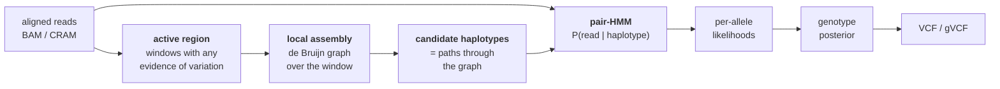

# 46 — Variant calling

> **Before this:** [Ch 41](../part-09-genomics/41-data-formats.md) · [Ch 42](../part-09-genomics/42-read-alignment.md) · **Time:** ~50 min
>
> **Statistics needed:** [S1 Probability](../part-S-statistics/S1-probability.md) ·
> [S6 Likelihood and Bayes](../part-S-statistics/S6-likelihood-and-bayes.md)

## What you'll be able to do

- Derive the posterior over genotypes at a biallelic site from base qualities and a prior, say precisely why it beats counting alleles and thresholding, and name the assumption it makes that a learned pileup classifier repairs
- Explain why haplotype-based local reassembly fixes indel calls that column-wise callers get wrong, and what latent variable changed
- Say what a gVCF stores, why joint genotyping raises sensitivity at low coverage, and what is and is not pooled
- Diagnose an artefactual call from strand bias, mapping-quality rank-sum, and allele balance; contrast hard filters with trained recalibration
- Interpret Ti/Tv, contamination, sex and relatedness checks as sample-level QC, and state what each is blind to
- Explain why structural variant calling is a different problem, why short reads fail at it, and why somatic calling needs a different statistical framing
- State why a benchmark F1 of 0.999 overstates real accuracy, and why "no variant called" is not "no variant"

## The core idea

You have noisy observations. You want a posterior over an unobserved discrete latent variable. That is the entire problem, and the machinery for it — conditional probability and Bayes in [S1](../part-S-statistics/S1-probability.md) §5, likelihoods and posteriors in [S6](../part-S-statistics/S6-likelihood-and-bayes.md) — is assumed here rather than developed.

The complications are three, and they are what the chapter is actually about. First, the observations are not independent — the errors are correlated in ways the obvious model assumes away. Second, the observations are not raw data: each base call arrives already committed to a position by an aligner that made its own decision, and that decision can be wrong. Third, the latent variable you want is not always "the base at position *p*" — for indels and rearrangements it is a *haplotype*, and forcing it into a column of a pileup is what causes most of the damage.

Everything else — filtering, joint calling, QC, benchmarking — is the machinery for admitting that your model is wrong in specific, characterisable ways.

---

## 1. The pileup

A BAM file is read-major: each record is one read and its alignment. Calling needs the transpose — for each reference position, every base observed there, with its quality, its read's mapping quality, its strand, and its offset within the read. That column-major view is the **pileup**, and it is the only data structure in this chapter.

A constructed example (coordinates illustrative, GRCh38):

```
                        999,996                     1,000,000                    1,000,005
reference          5'-    G     A     T     C     [ C ]    T     G     A     C     A    -3'

r01  + MQ60               G     A     T     C       C      T     G     A     C     A
r02  + MQ60               G     A     T     C       T      T     G     A     C     A
r03  - MQ60               G     A     T     C       C      T     G     A     C     ·
r04  + MQ60               ·     A     T     C       C      T     G     A     C     A
r05  - MQ60               G     A     T     C       T      T     G     A     C     A
r06  - MQ60               G     A     T     C       C      T     G     A     C     A
r07  + MQ60               G     A     T     C       T      T     G     A     C     A
r08  - MQ60               G     A     T     C       C      T     G     A     C     A

column at 1,000,000:   ref C  ×5   r01(+,BQ30) r03(-,BQ30) r04(+,BQ30) r06(-,BQ30) r08(-,BQ30)
                       alt T  ×3   r02(+,BQ30) r05(-,BQ30) r07(+,BQ10)
```

Eight observations. Three say T. The naive answer is "37.5% alt, call it heterozygous." Hold that thought — one of those three is a Q10 base, and the whole point of the next section is that this matters.

## 2. The genotype likelihood

Fix a biallelic site with reference allele **R** and candidate alternate **A**. The latent variable is the genotype *G* ∈ {RR, RA, AA}. The data are *D* = {(*b*ᵢ, *q*ᵢ)}, base calls and Phred qualities.

The quality score *is* an error probability: εᵢ = 10^(−*q*ᵢ/10). Q30 means ε = 0.001; Q10 means ε = 0.1. That single fact is what makes this a probabilistic problem rather than a counting one.

For a **haploid template allele** *X*, the emission model is as simple as it gets:

```
P(b | X, ε)  =  1 − ε        if b == X
             =  ε / 3        otherwise      (error goes to one of the three other bases)
```

A diploid sample has two haplotypes. Each read is a sample from one of them, and — absent allelic bias — with probability ½ from each. So the per-read likelihood marginalises over which haplotype the read came from:

```
P(bᵢ | G = (X₁, X₂))  =  ½ · P(bᵢ | X₁, εᵢ)  +  ½ · P(bᵢ | X₂, εᵢ)
```

Assume reads are conditionally independent given the genotype, and the site likelihood is a product:

```
P(D | G)  =  ∏ᵢ  [ ½ P(bᵢ | X₁, εᵢ)  +  ½ P(bᵢ | X₂, εᵢ) ]
```

Then Bayes, with a prior over the three genotypes:

```
P(G | D)  ∝  P(G) · P(D | G)
```

> **Statistics:** why a likelihood is a function of the genotype rather than a probability of it, and what a prior buys you when you convert one into the other, are covered in [S6](../part-S-statistics/S6-likelihood-and-bayes.md) §1 and §5 — which computes this exact genotype posterior on real reads in §7.1.

The prior comes from population genetics. At a site with no other information, use the per-site heterozygosity: P(het) ≈ θ ≈ 10⁻³ for humans, P(hom-nonref) ≈ θ/2, remainder hom-ref. At a site with a known population allele frequency *f*, use Hardy–Weinberg ([Ch 26](../part-05-population-genetics/26-hardy-weinberg.md)): (1−*f*)², 2*f*(1−*f*), *f*².

### What the VCF actually records

Three fields, routinely conflated:

| Field | Definition | Includes the prior? |
|---|---|---|
| **PL** | Phred-scaled genotype **likelihoods**, normalised so the best is 0 | No |
| **GQ** | Difference between the two smallest PLs — confidence in the called genotype | No |
| **QUAL** | −10 log₁₀ P(site is hom-ref \| D), from the **posterior** | Yes |

Keeping PL prior-free is not fussiness. It makes the likelihood a *sufficient summary of the site's data*, so a downstream step can substitute a better prior without going back to the reads. That is precisely what joint genotyping (§6) and imputation do.

### Why this beats counting and thresholding

A rule like "≥3 alt reads and ≥20% allele fraction" is a decision procedure with no model behind it, and it fails in three separable ways.

**It discards the confidence of each observation.** Three alt reads at Q40 and three at Q10 are the same count and wildly different evidence. The likelihood knows; the counter cannot.

**Its operating point drifts with depth.** At 5× coverage "≥3 alt reads" is a stringent test; at 200× it is satisfied by pure error. The posterior is depth-calibrated automatically, because depth enters the likelihood rather than the threshold.

**It emits a decision instead of a distribution.** Everything downstream — joint calling, phasing, association testing, clinical review — benefits from propagating uncertainty rather than a hard call made at an arbitrary cut. A PL triple is composable. A genotype string is not.

## 3. Where conditional independence breaks

The product over reads is a lie, and a productive one to examine.

Errors are correlated by sequencing cycle, by strand, by local sequence context (homopolymers, above all, for indels), by PCR duplication, and — worst — by shared misalignment. Twenty reads that were all placed wrongly for the same reason produce twenty "independent" mismatches and a spectacular false positive with a QUAL in the thousands.

Two standard mitigations, both worth understanding as what they are:

**Duplicate marking** removes the correlation from PCR: reads with identical alignment start positions and orientation are presumed copies of one original molecule, and all but one are excluded from the likelihood. This restores independence by deleting the dependent observations.

**Base quality score recalibration** attacks the miscalibration of ε itself. Instrument-reported qualities are systematically off, and the error depends on covariates — machine cycle, preceding dinucleotide, read group. Fit an empirical model: at sites *not* in a known-variant catalogue, treat every mismatch as an error, and regress observed error rate on those covariates. Replace the reported quality with the fitted one. This is ordinary calibration of a probabilistic classifier, applied to several billion predictions, and it exploits the fact that true variation is rare enough that mismatches are mostly errors.

Neither fixes misalignment. That needs §4.

## 4. Haplotype-based calling and local reassembly

Here is the failure mode that motivated the redesign of every serious germline caller.

```
true sample haplotype:   ...ACGT  CACACACACA        TTGA...      (2 CA units deleted)
reference:               ...ACGT  CACACACACACACA    TTGA...

read 1 aligned:          ...ACGT  CACACA--CACA      TTGA...      deletion placed here
read 2 aligned:          ...ACGT  CACA--CACACA      TTGA...      and here
read 3 aligned:          ...ACGT  CACACACACA--CA    TTGA...      and here
read 4 aligned:          ...ACGT  CTCACACACACACA    TTGA...      aligner preferred a mismatch
```

Every read is individually a defensible alignment — in a tandem repeat the placement is genuinely ambiguous, and the aligner breaks ties per-read without knowing what the other reads did. Column-wise, the evidence for one real 4 bp deletion is smeared across four different positions plus a spurious SNV, and no single column reaches significance. Position-wise callers miss it, and often emit the SNV instead.

The fix is to stop treating alignment as given:



Three things are happening, and the middle one is the conceptual move.

**Active region detection** is a cheap triage: scan for windows with mismatches, soft-clips or indel evidence above a low bar, and do expensive work only there. Most of the genome is discarded in a linear pass.

**The latent variable changes.** It is no longer "the base at position *p*". It is "the pair of haplotypes spanning window *W*". Candidate haplotypes are enumerated by assembling the window's reads into a de Bruijn graph and taking paths through it — the same construction as genome assembly ([Ch 43](../part-09-genomics/43-genome-assembly.md)), applied to a few hundred base pairs where the graph is small enough to enumerate exhaustively. Reference-only haplotypes are always included.

**The observation model becomes generative.** Every read is realigned to every candidate haplotype with a **pair-HMM**: states {Match, Insert, Delete}, emissions governed by base qualities, transitions by per-base insertion/deletion qualities. The forward algorithm gives P(read | haplotype) — a *sum over all alignments*, where Needleman–Wunsch takes the *max*. That replacement is the whole difference: you never commit to one alignment, you marginalise over the ambiguity you were previously forced to resolve arbitrarily.

Marginalising the read-by-haplotype likelihood matrix over haplotype pairs gives per-allele likelihoods, and §2's machinery finishes the job. Indel sensitivity improves dramatically, and the phantom SNVs adjacent to indels — a large share of false positives in the position-wise era — largely disappear, because the haplotype that explains the reads has one deletion, not a deletion and a substitution.

## 5. Calling as image classification

A different attack: encode the pileup around a candidate site as a tensor and hand it to a convolutional network.

Rows are reads, columns are reference positions, and the channels carry base identity, base quality, mapping quality, strand, whether the base matches the reference, and whether it matches the candidate alternate. The network outputs a three-way classification over {hom-ref, het, hom-alt}. Training data are pileups from benchmark samples labelled by a truth set (§13).

This routinely outperforms hand-built models, and the reason is specific and not "bigger model". **The analytic model assumes conditional independence given the genotype and imposes a particular error model; the network learns the joint.** Correlated error structure — homopolymer length, cycle position, strand asymmetry, local context, the signature of a collapsed repeat — is exactly what the product-over-reads likelihood cannot represent and what a convolution over the read × position grid can. The hand-built pipeline patches these back in as annotations and downstream filters, one human insight at a time. The network absorbs them into the likelihood where they belong.

It also transfers. A new chemistry with a new error profile requires retraining, not a person noticing what changed. DeepVariant is the best-known implementation of the idea; the idea is what matters, and it has been reimplemented for every read technology since.

The costs are real. Accuracy is bounded by the truth set, and inherits its biases (§13). The model has no principled behaviour in contexts absent from training. And the softmax output is a classifier score, not a calibrated likelihood, unless it is explicitly calibrated — which matters if anything downstream wants to substitute a prior.

## 6. gVCF and joint genotyping

At 4× coverage a single sample is nearly uninformative: a het site yields 0 alt reads about 6% of the time, and 1 alt read out of 4 is barely distinguishable from error. The genome-wide prior (θ ≈ 10⁻³) then dominates, and marginal true variants are called hom-ref.

But the prior is only genome-wide because you refused to look at the cohort. If 500 other samples show the site segregating at 20% frequency, the correct prior at that site is P(het) ≈ 2(0.2)(0.8) = 0.32 — more than two orders of magnitude higher. Weak per-sample evidence that would have been discarded now crosses the line. **Joint calling improves sensitivity by improving the prior, not by pooling reads.** Every sample's likelihood is still computed from its own reads alone; what is shared is the estimate of which sites are polymorphic and at what frequency.

The engineering problem is the **N+1 problem**: naive joint calling re-runs the expensive per-sample step over the whole cohort whenever a sample is added, which is quadratic in total work over the life of a growing project.

**gVCF** solves it by separating sufficient statistics from inference. Run the expensive step once per sample, and emit likelihoods for *every* position — variant sites explicitly, and homozygous-reference stretches compressed into blocks with a banded likelihood summary. The symbolic `<NON_REF>` allele carries the likelihood of "some allele other than those listed", which is what lets a later step evaluate an alternate allele this sample never showed:

```
#CHROM  POS      REF  ALT          QUAL  INFO         FORMAT               SAMPLE
chr1    999500   A    <NON_REF>    .     END=999999   GT:DP:GQ:MIN_DP:PL   0/0:31:90:28:0,90,1350
chr1    1000000  C    T,<NON_REF>  30    DP=8         GT:AD:DP:GQ:PL       0/1:5,3,0:8:60:60,0,150,...
```

The first record says: positions 999,500–999,999 are homozygous reference, minimum depth 28, and the confidence in that is GQ 90. It is 500 positions in one line, and it is *not* silence — it is an assertion, which is the entire difference (§14).

Joint genotyping is then a merge over pre-computed likelihoods: estimate allele frequencies across the cohort, form the per-site prior, recompute posteriors. Linear in samples, and a new sample costs one per-sample run plus one re-merge.

## 7. Filtering

Raw callsets contain artefacts the genotype model cannot see, because the model conditions on the reads being correctly placed and independently erroneous. Filtering is where you test that conditioning.

| Signal | Statistic | What an artefact looks like | Mechanism |
|---|---|---|---|
| **Strand bias** | Fisher exact / symmetric odds ratio on the 2×2 of (ref, alt) × (fwd, rev) | Alt allele almost only on one strand | A true het is sampled from both strands in proportion to coverage. One-sided support means a strand-specific chemistry error or a mismapped strand-asymmetric structure |
| **Mapping quality** | Mean MQ; MQRankSum | Low mean MQ, or alt-supporting reads with systematically lower MQ than ref-supporting reads | The classic signature of a paralogue collapsed into the reference: reads from the unrepresented copy pile onto the represented one, carrying their real differences as fake variants |
| **Position in read** | ReadPosRankSum | Alt allele clustered near read ends | Unremoved adapter, mis-clipped alignment, or the tail-end error ramp |
| **Allele balance** | Alt fraction vs Binomial(*n*, ½) | Het at 0.30 or 0.75 | A duplicated region (2 ref copies + 1 alt → 0.33), contamination, or genuine somatic mosaicism |
| **Quality per depth** | QD = QUAL / depth | High QUAL purely from high depth | Depth inflates QUAL linearly, so QUAL alone is not evidence. Normalising is what makes the number comparable across sites |

**Hard filters** are univariate thresholds on these annotations. They are interpretable, portable to tiny callsets, and wrong in a specific way: each cut is a marginal decision on a jointly distributed vector, so a variant that is mildly unusual on four axes passes every individual test.

**Trained recalibration** models the joint distribution instead. The classical form (VQSR) is semi-supervised: fit a Gaussian mixture in annotation space to variants overlapping a high-confidence known catalogue (assumed mostly true), fit a second model to everything else, and score each variant by the likelihood ratio. Choose the cut by target sensitivity to the known set. This fails where hard filters do not — it needs enough variants to fit a mixture, so it breaks on single exomes and small panels, and it assumes the known catalogue is representative of the true variants you are trying to recover, which is false for anything novel or population-specific.

The trajectory is toward supervised classifiers trained on benchmark truth, and — in end-to-end deep-learning callers — toward abolishing the separate filtering stage entirely, since a network trained on labelled pileups is already outputting a calibrated-ish probability that the call is real.

## 8. Sample-level QC

Per-variant filtering cannot detect a swapped sample, and no amount of it will save a contaminated one. These checks operate on the whole callset.

| Check | Method | Detects |
|---|---|---|
| **Coverage and uniformity** | Mean depth, fraction of target ≥10×/≥20×, GC–depth curve | Failed library, poor capture, degraded input |
| **Contamination** | Fit mixture fraction α to allele fractions at common SNPs | Cross-sample contamination — a few percent is enough to inflate het calls and destroy somatic calling |
| **Sex** | X heterozygosity outside the pseudoautosomal regions **and** Y depth | Sample swap, sex-chromosome aneuploidy ([Ch 20](../part-03-genome-instability/20-chromosome-abnormalities.md)) |
| **Relatedness** | Kinship coefficient from genotype sharing on an LD-pruned marker set | Duplicates, swaps, cryptic relatedness that inflates GWAS test statistics ([Ch 51](../part-11-human-and-statistical-genomics/51-gwas.md)) |
| **Heterozygosity** | Genome-wide het rate vs ancestry-matched distribution | High: contamination or mismapping. Low: inbreeding, or over-aggressive filtering ([Ch 28](../part-05-population-genetics/28-structure-and-inbreeding.md)) |
| **Ti/Tv** | Transition:transversion ratio of the callset | Bulk false-positive load (§9) |

**Contamination** deserves the detail because the estimator is elegant. In a pure sample, allele fractions at biallelic SNPs cluster at 0, ½ and 1. Contaminating DNA at fraction α from an unrelated individual pushes hom-ref sites up toward α·*f* and hom-alt sites down, and shifts hets off ½ — with the displacement predicted by the population allele frequency *f* at each site. Fit α by maximum likelihood over thousands of common SNPs. It is a one-parameter mixture model and it is sensitive well below 1%.

> **Statistics:** fitting a parameter by maximising a likelihood numerically, and getting an interval out of the curvature or a profile, are covered in [S6](../part-S-statistics/S6-likelihood-and-bayes.md) §3.

**Sex checks** need both signals, because each alone is ambiguous: X heterozygosity distinguishes one X from two, Y depth distinguishes presence from absence, and karyotypes exist that separate them. Disagreement between the two is informative rather than an error to be suppressed — and, since it can reveal something the participant does not know about themselves, it is a consent question as much as a QC question ([Ch 58](../part-12-applications-and-ethics/58-ethics-and-society.md)).

## 9. Ti/Tv, and why one number is worth computing

Of the 12 possible base substitutions, 4 are **transitions** — purine↔purine (A↔G) or pyrimidine↔pyrimidine (C↔T) — and 8 are **transversions**, crossing the two classes. A uniformly random error process therefore gives Ti/Tv = 4/8 = **0.5**.

Real human germline variation is strongly transition-enriched, approximately **2.0–2.1 genome-wide**. The dominant mechanism is chemical: spontaneous deamination of 5-methylcytosine yields thymine, producing C>T (and G>A read from the other strand) at CpG dinucleotides — both transitions, and CpG sites mutate roughly an order of magnitude faster than average ([Ch 16](../part-03-genome-instability/16-mutation.md)). Deamination of unmethylated cytosine and transition-favouring mispairing geometry add to it.

In exome callsets the ratio is higher, approximately **3.0–3.3**, for two compounding reasons. Coding sequence is under purifying selection, and transitions at third codon positions are disproportionately synonymous, so they survive selection at a higher rate than transversions do. And CpG dinucleotides are enriched in coding exons and the CpG islands around promoters, amplifying the deamination signal in exactly the captured territory.

Why it is a useful QC signal: **false positives dilute the ratio toward 0.5**, and the effect is quantifiable. Writing the transition *fraction* of a set with ratio *r* as *r*/(1+*r*), a callset that is a mixture of a fraction *p* of true variants (*r* = 2.05) and (1−*p*) random false positives (*r* = 0.5) with observed ratio 1.85 satisfies

```
p · (2.05/3.05)  +  (1 − p) · (0.5/1.5)   =   1.85/2.85
p · 0.6721       +  (1 − p) · 0.3333      =   0.6491
                                        p  ≈   0.932
```

— about **7% false positives**, inferred from one summary statistic with no truth set at all. That is the value: it is orthogonal to every per-variant quality score, costs nothing, and is sensitive to exactly the failure mode (bulk false positives) that per-variant scores are least trustworthy about.

Its limits are equally sharp. It says nothing about *which* calls are wrong, and nothing at all about false negatives. It depends on the region definition, so exome and genome numbers are not comparable. Artefacts with a *non-random* spectrum break the arithmetic in both directions: oxidative damage during library prep produces G>T transversions and drives the ratio down harder than the model predicts, while formalin-induced cytosine deamination produces C>T transitions and can push a badly contaminated callset's Ti/Tv *up*. And any filter correlated with transition status will improve the number without improving the callset.

## 10. Structural variants

By convention an SV is a rearrangement of >50 bp: deletion, duplication, insertion, inversion, translocation, and combinations thereof. They are a different problem, not a harder version of the same one, for one structural reason: **the variant is larger than the read.** You never observe it; you infer it from indirect signatures.

```
DELETION
reference   ═══════════[░░░░░░░░░░░░░░░]═══════════
sample      ═══════════                 ═══════════

  discordant pair    >>>>..................<<<<     insert size ≫ expected
  split read              >>>>|<<<<                 one read, two distant alignments
  read depth         ▇▇▇▇▇▇▇▁▁▁▁▁▁▁▁▁▁▁▁▁▁▇▇▇▇▇▇▇   depth drops toward zero

INSERTION  (sequence absent from the reference)
reference   ═══════════                 ═══════════
sample      ═══════════[▓▓▓▓▓▓▓▓▓▓▓▓▓▓▓]═══════════

  discordant pair    >>>>.........<<<<              insert size < expected
  split read         soft-clipped ends — the clipped sequence has nowhere to align
  read depth         unchanged — no signal whatsoever
  long read          ─────────────▓▓▓▓▓▓▓▓─────     one alignment, CIGAR ...M 5000I ...M
```

| Signature | Resolution | Blind to |
|---|---|---|
| Discordant pairs | Approximate breakpoints (± insert-size spread) | Events smaller than the insert-size noise |
| Split reads | Base-pair breakpoints | Breakpoints that don't fall inside a read; repetitive flanks |
| Read depth | Coarse, but works over megabases | **Balanced** events — inversions and reciprocal translocations change no copy number |
| Local assembly | Best; recovers inserted sequence | Expensive; still limited by what short reads can assemble |

**Why short reads fail.** SVs are overwhelmingly *created in and by* repetitive sequence — tandem-repeat (VNTR/STR) length variation and mobile-element insertion account for most events genome-wide, with non-allelic homologous recombination between dispersed repeat copies dominating the recurrent, disease-associated class ([Ch 18](../part-03-genome-instability/18-recombination-mechanisms.md)). So SV breakpoints sit, by construction, in exactly the sequence where short reads cannot be placed uniquely. Sensitivity is poor, breakpoint precision is poor, and different callers on the same BAM disagree substantially — which is itself diagnostic of a poorly determined inference rather than of buggy software.

Insertions are the worst case, and asymmetrically so. A deletion leaves a gap in the reference-aligned data; an insertion of sequence that *is not in the reference* leaves nothing to align to. Short-read catalogues consequently report far more deletions than insertions, which is not a property of genomes — it is reference bias, plainly visible ([Ch 45](../part-09-genomics/45-reference-genomes-and-pangenomes.md)).

**Long reads change the problem back into an easy one.** A 20 kb read spans a 5 kb insertion and both flanks, so the variant appears directly in a single alignment as a CIGAR `I` operation with the inserted sequence attached. Short-read studies historically reported a few thousand SVs per genome; long-read and assembly-based analyses find roughly 20,000–25,000, with insertions and deletions in near balance. That gap is not a refinement — it is most of the SVs in a human genome, and short reads never saw them. (These are approximate teaching figures; the counts depend heavily on the size threshold and the repeat classes included.)

## 11. Copy number from depth

For large events, depth is the signal of last resort and often the only one. Expected read depth is proportional to copy number, so: bin the genome, count reads per bin, normalise, segment, and assign integer copy number.

The normalisation is where the difficulty lives. Depth varies with **GC content** (amplification and cluster-generation bias, a smooth unimodal curve fitted per-sample) and with **mappability** (bins where reads cannot be uniquely placed lose depth for reasons unrelated to copy number). Segmentation of the normalised log-ratio is a change-point problem — circular binary segmentation, or an HMM whose hidden states are copy numbers, which additionally gives you a principled state prior and transition penalty.

Exome data behaves badly here because capture efficiency varies per probe by orders of magnitude and is not a smooth function of anything. The fix is to normalise against a **panel of samples processed identically** rather than against a model: the reference for bin *j* is the distribution of bin *j* across other libraries from the same protocol. The reference is the cohort, not the genome.

## 12. Somatic calling

A tumour is not a genotype. It is a mixture of normal cells and one or more tumour subclones, at unknown proportions, with unknown local copy number. The standard design sequences **tumour and matched normal from the same individual**, so the normal defines the germline background and the contrast identifies what is somatic.

Why the germline framework does not transfer:

**Variant allele fraction is continuous.** For a heterozygous mutation in a diploid region, VAF = ρ · φ · ½, where ρ is tumour purity and φ the fraction of tumour cells carrying it. A subclonal mutation with φ = 0.15 in a sample with ρ = 0.6 sits at VAF ≈ 0.045 — five reads at 100×, and by count alone indistinguishable from error.

**So the inference is a different one.** There is no three-way choice among discrete genotypes. You test a composite hypothesis — "the somatic allele fraction *f* is greater than zero in the tumour, given that it is zero in the normal" — against "all alt observations are errors", by likelihood ratio, with *f* a nuisance parameter you maximise or integrate over. Somatic callers therefore emit a log-odds score, not a genotype.

> **Statistics:** the likelihood ratio as a unit of evidence, and what it does and does not license, is covered in [S6](../part-S-statistics/S6-likelihood-and-bayes.md) §4.

**Depth becomes the binding constraint.** Detecting f = 0.01 requires depth at which the true alt count is separable from the error count, which pushes targeted cancer panels to many hundreds of × and motivates **unique molecular identifiers**: tag each original DNA molecule with a random barcode before amplification, then require the variant to appear in independent barcode families. A PCR or sequencing error arises *after* tagging and so is not shared across the family — this collapses the two dominant error sources without touching the biology.

**Purity and ploidy must be estimated jointly**, typically from the joint distribution of B-allele frequencies at heterozygous germline SNPs and depth ratios. Getting ploidy wrong rescales every copy-number call and reassigns clonal mutations to the wrong clone, so the error propagates into every downstream evolutionary claim ([Ch 56](../part-11-human-and-statistical-genomics/56-cancer-genomics.md)).

**A panel of normals beats any per-site statistic** for recurrent artefacts. Systematic mismapping and chemistry-specific errors reproduce across unrelated samples; a site that produces "somatic" calls in 30 normals is an artefact, and no amount of modelling the reads at that site will tell you so.

Tumour-only calling, without a matched normal, must subtract germline variation using population databases — which fails precisely for rare private variants that the databases do not contain, so those leak through as false somatic calls at a rate that scales with how under-represented the individual's ancestry is in the database.

## 13. Benchmarking honestly

The **Genome in a Bottle** consortium, coordinated by NIST, provides the reference truth. It characterises a small number of consented, openly redistributable samples — including the Ashkenazi and Han Chinese trios — and distributes each benchmark as two files: a VCF of high-confidence variant calls, and a **BED of high-confidence regions**. Early benchmarks were built by integrating many technologies and pipelines and keeping what they agreed on; the current HG002 benchmark (v5.0q) instead derives from a telomere-to-telomere diploid assembly of the sample, which removes the circularity of defining truth by consensus of the methods being tested.

Metrics are the usual ones: precision = TP/(TP+FP), recall = TP/(TP+FN), F1 the harmonic mean. One technical trap: **comparison must be representation-aware.** The same indel can be written many valid ways in VCF — different left-alignment, different anchor base, an MNP versus two adjacent SNVs — so record-level string matching manufactures paired false positives and false negatives out of nothing. Correct comparison asks whether the two callsets imply the same *sequence* over a window, not whether the records match.

Now the caveat that matters more than the metrics:

> **The high-confidence regions are the easy regions, by construction.** The BED excludes segmental duplications, centromeric and satellite sequence, many large tandem repeats and VNTRs, and anywhere the constituent technologies disagreed — which is to say, it excludes precisely the regions where variant calling is unreliable, *because truth could not be established there either*. An F1 of 0.9995 is a statement about the fraction of the genome that was already easy.

Real performance in the excluded fraction is far lower and is not measured by that number. This is why GIAB publishes **stratifications** — the benchmark subset by difficulty class (homopolymers, tandem repeats, segmental duplications, low-mappability, low-GC and high-GC) — and why a reported accuracy without stratified numbers tells you almost nothing about the hard variants you are usually looking for. Two callers with identical overall F1 can differ severalfold in the homopolymer stratum.

A second caveat: the benchmark samples are a handful of individuals from a few ancestries, sequenced by particular chemistries. A caller trained and tuned on them — as deep-learning callers explicitly are — can be tuned to *their* variants and *their* error profiles, and the degree to which this happens is not measurable using the same samples.

## 14. Callable regions: absence of evidence

A VCF is not a description of a genome. It is a list of positions at which a caller decided something. A position missing from a VCF may be missing because it is:

- confidently homozygous reference
- covered by zero reads
- covered only by reads with mapping quality 0
- called and then removed by a filter
- inside a region excluded from the analysis before calling began
- present in the sample but absent from the reference, so there was nothing to align against

These are radically different states and a plain VCF cannot distinguish them. This is why clinical pipelines report **callable-region coverage per gene per sample** — "100% of the coding bases of this gene were covered at ≥20× with MQ ≥ 20" — and why a negative diagnostic result without that statement is uninterpretable rather than reassuring ([Ch 54](../part-11-human-and-statistical-genomics/54-rare-variants-and-mendelian-disease.md)). It is also the deeper justification for gVCF: a reference-confidence record asserts hom-ref *with a stated confidence*, which makes "we looked and found nothing" formally distinct from "we did not look".

---

## Common misconceptions

| What people think | What's actually true |
|---|---|
| A variant is either present or not, and the caller detects it | The caller computes a posterior. Every call is a decision under uncertainty at some operating point; moving the threshold moves the callset. "The variants in this sample" is not well defined without stating the threshold |
| More depth always means better calls | Depth helps only if the reads are independent and correctly placed. 200× of PCR duplicates, or 200× in a collapsed segmental duplication, buys confident wrong answers. QD exists precisely because QUAL rises with depth regardless of truth |
| Joint calling works by pooling reads across samples | No reads are shared. What the cohort supplies is the site-specific prior — which sites are polymorphic and at what frequency. Each sample's likelihood still comes from its own reads |
| Deep-learning callers win because they are bigger models | They win because they learn the *joint* error structure that the product-over-reads likelihood assumes away. It is a correction to the conditional independence assumption, not extra capacity |
| Ti/Tv ≈ 2.0 means the callset is clean | Ti/Tv is sensitive to bulk false positives with a near-random spectrum, and blind to everything else. Spectrum-biased artefacts move it predictably — FFPE C>T damage can raise it — and it says nothing at all about false negatives |
| Structural variants are a minor category because there are so few of them | Short-read catalogues undercount them severalfold, especially insertions. Even at the true count they affect far more base pairs than SNVs do, and are enriched for large-effect consequences |
| An F1 of 0.999 on GIAB means 1 error per 1,000 variants in my data | It means that within regions where truth could be established, on those samples, with that chemistry. The hard regions are excluded from the denominator by construction |
| A gene absent from the VCF has no variants | It may have no coverage, no mappable reads, or an excluded region. Without a callable-region report, absence carries no information |

## Worked example: one site, computed two ways

Take the pileup from §1: reference C, candidate T, 5 ref reads at Q30, 2 alt at Q30, 1 alt at Q10. Q30 → ε = 0.001, so ε/3 = 3.333 × 10⁻⁴. Q10 → ε = 0.1, so ε/3 = 3.333 × 10⁻².

**Step 1 — per-read likelihoods.**

| Genotype | ref read (b = C) | alt read (b = T) |
|---|---|---|
| CC | 1 − ε | ε/3 |
| CT | ½(1−ε) + ½(ε/3) | ½(ε/3) + ½(1−ε) — identical |
| TT | ε/3 | 1 − ε |

At Q30 the heterozygous term is ½(0.999) + ½(0.000333) = 0.499667; at Q10 it is ½(0.9) + ½(0.033333) = 0.466667.

**Step 2 — site likelihoods, in log₁₀.**

```
CC :  5·log(0.999)  + 2·log(3.333e-4) + 1·log(3.333e-2)
   =  5(-0.000435)  + 2(-3.47712)     + (-1.47712)        =  -8.43353

CT :  7·log(0.499667)                 + 1·log(0.466667)
   =  7(-0.301320)                    + (-0.330993)       =  -2.44023

TT :  5·log(3.333e-4) + 2·log(0.999)  + 1·log(0.9)
   =  5(-3.47712)     + 2(-0.000435)  + (-0.045757)       = -17.43223
```

**Step 3 — PL and GQ.** Normalise to the best (CT) and multiply by 10:

```
PL = 60, 0, 150          GQ = 60 − 0 = 60
```

**Step 4 — apply the prior.** With P(het) = 10⁻³, P(hom-alt) = 5 × 10⁻⁴, P(hom-ref) = 0.9985, add log₁₀ priors:

```
CC :  -8.43353 - 0.00065  =  -8.43418
CT :  -2.44023 - 3.00000  =  -5.44023      ← best
TT : -17.43223 - 3.30103  = -20.73326
```

CT still wins, now by 2.994 log₁₀ units. P(hom-ref | D) ≈ 1.01 × 10⁻³, so **QUAL ≈ 30**. Note that GQ = 60 and QUAL = 30: the 30-point gap is the price of the prior, and confusing the two fields is a standard error. The VCF record:

```
chr1  1000000  .  C  T  30  PASS  AC=1;AN=2;DP=8;MQ=60;QD=3.75  GT:AD:DP:GQ:PL  0/1:5,3:8:60:60,0,150
```

QD = 30/8 = 3.75 — passing, but not comfortably.

**Step 5 — now change one thing.** Make all three alt reads Q10 instead of two at Q30. Allele counts are identical: 5 ref, 3 alt, VAF 37.5%. Recomputing:

```
CC :  5(-0.000435) + 3(-1.47712)   =  -4.43354     → with prior  -4.43419   ← best
CT :  5(-0.301320) + 3(-0.330993)  =  -2.49958     → with prior  -5.49958
TT :  5(-3.47712)  + 3(-0.045757)  = -17.52288     → with prior -20.82391
```

The *posterior* maximum **flips to homozygous reference**, by 1.065 log₁₀ units — a margin so thin the call is barely a call. The *likelihood* has not flipped: CT is still the best fit, now by 1.934 log₁₀ units where before it was 5.993. Both facts belong in the record, and §2 already said which field carries which:

```
PL = 19, 0, 150          GQ = 19          posterior margin ≈ 11
```

PL and GQ are prior-free, so GQ collapses from 60 to **19** — the same three alt reads, a third of the confidence. The ≈ 11 is a *posterior* quantity; GATK writes that as PP and only recomputes GQ from it if you explicitly run genotype refinement. Calling it GQ is precisely the confusion Step 4 warned about. And which genotype gets emitted depends on which quantity the caller assigns from: from PLs it is still 0/1, from posteriors it is 0/0.

Same allele counts, same allele fraction, opposite conclusion under the prior — and, without it, GQ 60 → 19. A "≥3 alt reads and ≥20% VAF" rule calls a confident het in both cases and cannot express the difference between them. That is the argument for the model in a single pair of calculations.

## Connections

- **Back to:** [Ch 12](../part-02-transmission-genetics/12-probability-and-testing.md) supplies the inference machinery · [Ch 16](../part-03-genome-instability/16-mutation.md) explains the CpG deamination behind Ti/Tv · [Ch 26](../part-05-population-genetics/26-hardy-weinberg.md) supplies the genotype prior · [Ch 40](../part-09-genomics/40-sequencing-technologies.md) sets the error models · [Ch 41](../part-09-genomics/41-data-formats.md) defines VCF and CIGAR · [Ch 42](../part-09-genomics/42-read-alignment.md) produces the input and its failure modes · [Ch 43](../part-09-genomics/43-genome-assembly.md) is the de Bruijn machinery reused for local reassembly
- **Forward to:** [Ch 45](../part-09-genomics/45-reference-genomes-and-pangenomes.md) — graph references turn SV discovery into SV genotyping · [Ch 51](../part-11-human-and-statistical-genomics/51-gwas.md) — genotype uncertainty and relatedness propagate directly into association statistics · [Ch 54](../part-11-human-and-statistical-genomics/54-rare-variants-and-mendelian-disease.md) and [Ch 55](../part-11-human-and-statistical-genomics/55-clinical-variant-interpretation.md) — callable regions and filtering decide what a diagnostic test can find · [Ch 56](../part-11-human-and-statistical-genomics/56-cancer-genomics.md) — somatic calling in full

## Check yourself

**1. Why does the PL field deliberately exclude the prior, when the prior is what you need for a posterior?**

<details><summary>Answer</summary>

Because the likelihood is a sufficient summary of that site's *data*, and the prior is not a property of the data. Keeping them separate lets a downstream step substitute a better prior — one estimated from a cohort, or from a population allele frequency, or from a pedigree — without returning to the reads. That is exactly the mechanism of joint genotyping from gVCFs, and of imputation. Baking the prior into PL would destroy the composability and force reprocessing whenever the prior improved.

</details>

**2. A het call has depth 60, allele balance 0.50, base qualities all high, and QUAL in the thousands — but MQRankSum is −6.2. What is going on, and why do the other statistics look fine?**

<details><summary>Answer</summary>

The alt-supporting reads have systematically lower mapping quality than the ref-supporting reads. The classic cause is a paralogous sequence — a segmental duplication or a repeat copy — that is missing or diverged in the reference. Reads from the unrepresented copy have nowhere correct to go, so they pile onto the represented copy, carrying the real differences between the two paralogues as apparent heterozygous variants.

The other statistics look fine because the artefact is *well-behaved*: it produces a genuine roughly-50/50 mixture of two real sequences, on both strands, at high base quality, at high depth. Every within-column statistic is satisfied. Only the statistic that asks where the reads *came from* detects it — which is the general lesson that filtering must test the assumptions the genotype model conditions on, not re-examine the same column.

</details>

**3. Why can't a position-wise caller find a 4 bp deletion in a CA tandem repeat, no matter how much depth you give it?**

<details><summary>Answer</summary>

Because the placement of the deletion within the repeat is genuinely ambiguous, and the aligner resolves that ambiguity per-read without coordination. Different reads get the gap at different offsets, and some get a mismatch instead. Column-wise, the evidence is smeared across several positions, none reaching significance — and adding depth adds more smear, not more signal, because the ambiguity is systematic rather than random.

The fix is not more data but a different latent variable: assemble candidate *haplotypes* over the window, and score each read against each haplotype with a pair-HMM that sums over alignments rather than committing to one. Under the correct haplotype every read is well explained, and the aggregated likelihood is decisive.

</details>

**4. Your caller reports F1 = 0.9995 for SNVs against the GIAB benchmark. A clinician asks whether it will find the variant causing their patient's disease. What do you say?**

<details><summary>Answer</summary>

That the number does not answer the question. The benchmark's confident regions exclude segmental duplications, satellite and centromeric sequence, and many large tandem repeats — because truth could not be established there either — so F1 was computed over the fraction of the genome that is easy by construction. If the causal variant is in a homopolymer, a repeat expansion, a recently duplicated gene family, or a region with a paralogue that confuses mapping, performance is much worse and is not measured by that figure.

What to report instead: stratified precision/recall by difficulty class, and — for this specific patient — the callable-region coverage of the genes of interest. And note that a benchmark F1 says nothing about structural variants, which are a separate call type with far worse short-read performance.

</details>

**5. A tumour sample has purity ρ = 0.4. A heterozygous driver mutation sits in a diploid region in a subclone comprising 30% of tumour cells. What VAF do you expect, what depth do you need to expect 10 supporting reads, and is sequencing error the binding constraint?**

<details><summary>Answer</summary>

VAF = ρ · φ · ½ = 0.4 × 0.30 × 0.5 = **0.06**. For an expected 10 alt reads you need depth ≈ 10 / 0.06 ≈ **167×**.

Error is *not* the binding constraint here. At Q30, the per-base probability of erroring to one specific alternate base is ε/3 ≈ 3.3 × 10⁻⁴, so at 167× the expected error-derived alt count is ≈ 0.06 reads. Ten real reads against a background of 0.06 is an easy discrimination. What limits you is **sampling**: 10 expected reads has a standard deviation of about 3, so a meaningful fraction of such sites will yield 5 or 6 reads and sit near any threshold.

The constraint tightens at low VAF, but not in the obvious way. At f = 0.005 you would need 2,000× to expect 10 true reads, and at that depth the expected error count is ≈ 0.7. The signal:error ratio is f/(ε/3) ≈ 15 — worse than before, but note that it does not depend on depth at all: both counts grow linearly, while the Poisson noise on them grows only as √. Against a *random, well-calibrated* Q30 error floor, more depth does keep improving the discrimination.

What actually caps detection near 0.5–1% VAF is that the error floor is not random. Substitutions introduced in early PCR cycles are copied into many reads, oxidative damage during library prep produces a context-specific G>T signature, and particular sequence contexts miscall reproducibly — errors that are shared across reads and therefore do not average away with depth. That is the regime where unique molecular identifiers become necessary: requiring the variant in multiple independent barcode families removes errors introduced after tagging, which is nearly all of them.

</details>
