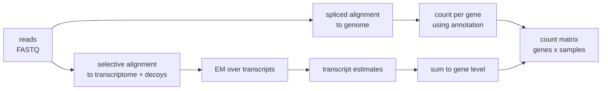

# 47 — RNA-seq

> **Before this:** [Ch 06](../part-01-molecular-foundations/06-rna-processing.md) ·
> [Ch 42](../part-09-genomics/42-read-alignment.md) ·
> [Ch 44](../part-09-genomics/44-annotation.md) · **Time:** ~55 min
>
> **Statistics needed:** [S2 Distributions](../part-S-statistics/S2-distributions.md) ·
> [S4 Hypothesis testing](../part-S-statistics/S4-hypothesis-testing.md) ·
> [S5 Variance and regression](../part-S-statistics/S5-variance-and-regression.md) ·
> [S7 High-dimensional data](../part-S-statistics/S7-high-dimensional-data.md)

Chapter 46 asked what sequence a genome contains. This chapter asks a different question:
**which parts of it are being read, and how much.** The answer is a matrix of counts, and
almost every mistake made with that matrix comes from forgetting what the counts actually are.

## What you'll be able to do

- Design an RNA-seq experiment whose batch structure does not make the biological question
  unanswerable, and say why replicates beat depth using the variance of a log fold change
- Choose between poly-A selection and rRNA depletion, and say what strandedness and UMIs buy
- Explain transcript quantification as expectation–maximisation over read-to-transcript
  assignments, and compute the fixed point of a two-isoform example
- Derive why total-count scaling is wrong from the compositional structure of the data, compute
  median-of-ratios size factors by hand, and define CPM, TPM and FPKM precisely enough to say why
  none of them belongs in a DE test
- Fit the negative binomial DE model conceptually: overdispersion, shrunken dispersions,
  a GLM design matrix, LFC shrinkage, BH with independent filtering
- Decompose a bulk expression change into a shift in cell-type proportions and a shift in per-cell
  regulation, and say what data settles which one it was
- Recognise 3' bias, rRNA carryover, gDNA carryover and global-shift artefacts from QC alone

## The core idea

A sequencer does not measure concentration. It draws a fixed-size sample of fragments from a
pool and tells you what it drew. If you sequence 30 million fragments, you get 30 million
fragments — whether the library came from a cell containing 200,000 mRNA molecules or 800,000.

So the count for gene *i* in sample *j* is, to a first approximation, a multinomial draw:

```
K_ij  ~  Multinomial( N_j ,  p_·j )        with   p_ij  =  l̃_i θ_ij / Σ_k l̃_k θ_kj
```

where θ is the *relative molar abundance*, l̃ the effective length (a longer molecule breaks
into more fragments, so it is over-sampled), and N_j the library size — a machine parameter,
not a biological one.

Everything in this chapter follows from one property of that expression: **the p's sum to
one.** RNA-seq data are *compositional*. They live on a simplex, they carry no information
about absolute scale, and a change in one gene mechanically changes the measured value of
every other gene. Fail to correct for that and you will read the arithmetic of the simplex as
biology. That is the single most common error in the field, and it is not subtle: it can
produce thousands of confidently "downregulated" genes that did not change at all.

---

## 1. Design decides what is answerable

No analysis recovers information the design threw away. Two distinctions come first.

**Biological replicates** are independent biological units — different animals, different
donors, independently treated cultures. They capture the variance you want to generalise over.
**Technical replicates** are the same RNA sequenced twice, or the same library split across
lanes. They capture only machine noise, which in RNA-seq is close to Poisson and therefore
almost negligible. Sequencing one sample five times gives you *n* = 1, no matter how the
software labels the columns.

**n = 3 is a convention, not a justification.** Two is the bare minimum for any within-group
variance estimate at all; three is the smallest group size that gives more than a single
residual degree of freedom after fitting a mean, and it is what fits a budget. It is not the
output of a power calculation, and for a typical biological coefficient of variation it detects
only large fold changes.

### Replicates beat depth, and you can prove it

For a gene with mean count μ and dispersion α (defined in §6, with Var(K) = μ + αμ²), the
delta method gives Var(log K) ≈ Var(K)/μ² = **1/μ + α**. Average over *n* replicates and the
variance of the group mean on the log scale is (1/μ + α)/n, so

```
Var( log2 FC )  ≈  (1/ln2)² · (1/n₁ + 1/n₂) · ( 1/μ + α )
                                              └────┬────┘
                          depth shrinks this term only, and only toward α
```

Depth raises μ, which attacks the 1/μ term and nothing else. That term has a floor of zero;
the dispersion α does not move. Replication divides the *whole* expression by *n*, with no
floor.

> **Statistics:** the mean–variance relation Var = μ + αμ², and why counts across biological
> replicates need it, are covered in [S2](../part-S-statistics/S2-distributions.md) §5.

Concretely, at α = 0.04 (a 20% biological CV — typical of cell lines or inbred animals; human
donor tissue more often runs at a BCV near 0.4, i.e. α ≈ 0.16, which only strengthens the
conclusion by moving the crossover down to μ ≈ 6): at μ = 25 the two terms are equal.
Quadrupling depth to μ = 100 cuts the variance by 37%. Quadrupling it
again, and again forever, buys you the remaining 20%. Going from *n* = 3 to *n* = 6 halves it
outright. Once the mean count per sample is comfortably above ~100 — which is where most
expressed genes sit at conventional depths of roughly 20–30 million reads per sample —
**spend the next dollar on another biological replicate.** The exception is isoform-level or
low-expression work, where many genes are still in the 1/μ-dominated regime.

### Batch must not be confounded with condition

If every control was prepared on Monday and every treated sample on Tuesday, the design matrix
has two collinear columns and the condition coefficient is not identifiable. This is not a
statistical subtlety to be handled with a clever correction; it is a rank deficiency, and no
amount of downstream software repairs it.

```
CONFOUNDED (unfixable)              BLOCKED (fixable)
sample cond batch                   sample cond batch
S1     ctrl  1                      S1     ctrl  1
S2     ctrl  1                      S2     trt   1
S3     ctrl  1                      S3     ctrl  2
S4     trt   2                      S4     trt   2
S5     trt   2                      S5     ctrl  3
S6     trt   2                      S6     trt   3
                                    → ~ batch + condition estimates both
```

Batch effects in RNA-seq are large — often larger than the biology. Extraction day, kit lot,
technician, flow cell and RIN all leave signatures. Two remedies, in order of preference:
**block** (every batch contains every condition, so batch enters the model as a factor and its
effect is absorbed), or **randomise** (assign samples to batches at random, so the confound
becomes noise rather than bias). Randomisation is the fallback for nuisance variables you did
not think of. Blocking is better for the ones you did.

## 2. Library preparation is a measurement choice

Total RNA is >80% ribosomal RNA. Sequencing it directly wastes almost all your depth, so every
protocol begins by choosing what to keep — and that choice defines what the experiment can see.

| | **Poly-A selection** | **rRNA depletion** |
|---|---|---|
| Captures | Polyadenylated RNA — mostly mature mRNA | Everything except rRNA: mRNA, lncRNA, pre-mRNA, circRNA, histone mRNAs |
| Depth efficiency | High; most reads are exonic mRNA | Lower; a large intronic and non-coding fraction |
| RNA quality needed | High — degradation truncates from the 5' end | Tolerant; works on FFPE and degraded input |
| Blind to | Non-polyadenylated transcripts, most nascent RNA, bacterial RNA | Little, but at a cost in mRNA reads |
| Choose when | Standard mRNA differential expression, good-quality input | Degraded/clinical material, lncRNA or nascent transcription, prokaryotes |

**Strandedness.** In an unstranded library the read gives you a locus but not which strand the
original RNA came from. That is fine until two genes overlap on opposite strands — which
happens thousands of times in a mammalian genome — at which point every read in the overlap is
ambiguous and either discarded or misassigned. It is fatal for antisense transcripts, whose
entire identity is "the same locus, other strand". Stranded protocols mark the original strand
chemically. There is no reason to generate unstranded data.

**UMIs.** A unique molecular identifier is a random barcode attached to each cDNA molecule
*before* amplification. Two reads sharing a UMI and a position came from one original molecule.
This matters more than in DNA sequencing, because in RNA-seq coordinate duplicates are
*expected*: a short, highly expressed transcript will be covered by identical fragments
legitimately. **Deduplicating RNA-seq by coordinate alone, the DNA convention, removes real
signal.** The UMI must be long enough that same-position collisions are rare given the number
of molecules there — a birthday-problem calculation, not a guess.

**3'-biased protocols** sequence only the 3' end of each molecule. One read then approximates
one molecule: no length normalisation is needed, and applying it is actively wrong. The price
is losing all isoform information and becoming sensitive to alternative polyadenylation and to
the accuracy of annotated 3' ends. This is the design used by most droplet single-cell assays
([Ch 48](48-single-cell-and-spatial.md)).

## 3. From reads to counts



**Alignment-based counting** maps reads to the genome with a *spliced* aligner — one that can
place a gap of tens of kilobases and score it as an intron rather than a deletion
([Ch 42](../part-09-genomics/42-read-alignment.md)) — then counts reads overlapping each gene's
exons under a stated rule for ambiguity. Its virtue is that reads from unannotated regions
remain visible, which is what you want if the annotation is incomplete or you care about
intronic signal.

**Lightweight / selective alignment** skips base-level alignment for most reads by matching
*k*-mers against a transcriptome index, then scores the surviving candidates well enough to
reject spurious matches. The two failure modes it must defend against are instructive: pure
*k*-mer compatibility over-calls, so a score is still required; and reads originating from
sequence not in the transcriptome (introns, unannotated loci, genomic DNA) get force-assigned
to whatever transcript they least badly resemble. The fix is **decoy sequence** — include the
genome in the index so the model has a "none of the above" option. Both points are the same
point: a model with no null class will explain everything.

### Multi-mapping and EM

Most reads are compatible with several transcripts of the same gene, because those transcripts
share exons. The assignment is latent; the abundances are the parameters. That is the structure
of expectation–maximisation, and it is spelled out below.

```
       exon1        exon2        exon3
tx A   ▓▓▓▓▓▓▓▓ ─── ▓▓▓▓▓▓▓▓ ─── ▓▓▓▓▓▓▓▓
tx B   ▓▓▓▓▓▓▓▓ ─────────────────▓▓▓▓▓▓▓▓     (skips exon2)

read classes:   unique to A  (spans e1–e2 junction, or lies in e2)
                unique to B  (spans e1–e3 junction)
                shared       (lies inside e1 or e3)
```

With θ_t the abundance of transcript *t* and P(r | t) the probability of generating read *r*
from it (∝ 1/l̃_t for a uniform fragment model, times alignment and fragment-length terms):

```
E-step   γ_rt  =  θ_t P(r|t)  /  Σ_u θ_u P(r|u)          responsibility
M-step   c_t   =  Σ_r γ_rt ,      θ_t  ∝  c_t / l̃_t      re-estimate
```

The unique reads identify the mixture; the shared reads are then allocated in proportion to it.
Take equal effective lengths, 80 reads unique to A, 20 unique to B, 100 shared. At the fixed
point, let *f* be A's share: c_A = 80 + 100*f* and the total is 200, so *f* = (80 + 100*f*)/200,
giving *f* = 0.8, **c_A = 160, c_B = 40**. The shared reads split 80:20 because that is what the
unique reads said the mixture was.

Because the assignments are inferred, transcript-level estimates carry inferential uncertainty
on top of sampling noise — which is why quantifiers report bootstrap or Gibbs replicates. Two
isoforms differing by one short exon are nearly unidentifiable, and their estimates are strongly
anticorrelated.

**Gene level versus transcript level.** GENCODE Release 50 annotates 644,292 transcripts across
78,733 genes ([verified-facts](../reference/verified-facts.md)) — over eight per gene, many
differing by a cassette exon or an alternate 3' end. Summing transcript estimates to the gene
cancels most of that anticorrelated error, so **gene-level counts are markedly more robust for
differential expression.** Go to transcript level when the question is genuinely about isoforms
(§8), not by default.

## 4. Normalisation: the conceptual heart

Three distinct problems get conflated under one word.

**Depth.** Sample A got 40M reads, sample B got 20M. Trivially fixable by scaling — and this is
the only part most people think normalisation is.

**Length.** A 10 kb transcript yields ~10× the fragments of a 1 kb transcript at equal molar
abundance. This matters when comparing *different genes within one sample*. It does **not**
matter when comparing *the same gene across samples*, because the length cancels. Length
correction is a within-sample operation, and applying it before a between-sample test adds
noise for nothing.

**Composition.** The hard one. Since Σp = 1, one gene rising *must* push every other measured
fraction down. Total-count scaling assumes the total is a stable reference — which is exactly
the assumption composition violates.

### Why total-count scaling fails

Five genes, equal lengths. In the control each is at 1,000 molecules per cell (total 5,000). In
the treated sample, gene E rises 6-fold to 6,000 and *nothing else changes* (total 10,000).
Sequence 10,000 reads from each:

```
gene    ctrl     treat        truth
A       2000     1000         unchanged
B       2000     1000         unchanged
C       2000     1000         unchanged
D       2000     1000         unchanged
E       2000     6000         6x up
total  10000    10000
```

Divide by the total and you conclude that four of five genes halved and E rose 3-fold. Every one
of those five conclusions is wrong. The library size was never a measurement of anything; it was
a setting on the machine.

### Robust size factors

The fix is to estimate the scale from the *typical* gene rather than the sum, under the
assumption that most genes are not differentially expressed. Two constructions dominate.

**Median-of-ratios.** Build a reference pseudo-sample as the per-gene geometric mean across
samples; take each sample's ratio to it gene by gene; the size factor is the **median** ratio.
The median is what makes it robust — a minority of genes moving hard cannot drag it.

**Trimmed mean of M-values (TMM).** Against a reference sample, compute per-gene log ratios (M)
and average log intensities (A), trim the extremes of both, and take a precision-weighted mean
of the surviving M values. Same logic, different estimator: discard the tails and read the
scale off the bulk.

Both estimate a single scalar per sample, fed to the model as an **offset** — not as a divisor
applied to the counts, because the count must stay an integer for the likelihood to be a count
likelihood.

Both rest on the same assumption: **most genes do not change, and those that do are not all in
the same direction.** When that fails — a global transcriptional amplification, a transcription
inhibitor, a MYC-amplified tumour compared to normal tissue — no computational normalisation can
save you, because the data are genuinely non-identifiable. The only fix is external: spike-in RNA
added per cell or per unit mass, or an independent cell count.

### CPM, TPM, FPKM — and where they belong

| Unit | Definition | Corrects for | Sums to |
|---|---|---|---|
| **CPM** | Kᵢ / N × 10⁶ | depth | 10⁶ |
| **FPKM/RPKM** | Kᵢ / (l̃ᵢ/10³ · N/10⁶) | depth, length | a sample-specific constant |
| **TPM** | rᵢ / Σrⱼ × 10⁶, where rᵢ = Kᵢ / l̃ᵢ | length **then** depth | 10⁶ always |

The difference between TPM and FPKM is the order of operations. FPKM divides by depth first,
then by length; TPM converts to rates first, then normalises those rates to sum to a million.
Because TPM's denominator is the sum of rates in that sample, **TPM has the same unit in every
sample — a share of a million transcripts — whereas FPKM's normalising constant is
sample-specific, so only TPM values are even on a common scale.** Note the word *scale*:
neither unit is composition-corrected. TPMs sum to 10⁶ by construction, so a global shift
distorts every TPM exactly as it distorts counts-over-total — run the five-gene example above
through TPM and it reports the four unchanged genes as halved, the same error.

Three genes in one sample:

```
gene   count   eff.len   rate = count/len     TPM              FPKM
A       1000     2000       0.5              185,185         294,118
B        500      250       2.0              740,741       1,176,471
C        200     1000       0.2               74,074         117,647
                       Σ = 2.7      Σ = 1,000,000      Σ = 1,588,235
```

(Three genes, so the values are absurdly large; with ~20,000 expressed genes TPMs run from
below 1 to a few thousand.) Note that gene A has twice B's reads but a quarter of its molar
abundance — that is the length correction doing its job. And note the FPKM column sums to
1,588,235, a number specific to this sample: change the expression profile and the unit changes
underneath you.

> **None of these belongs in a differential expression test.** They are per-sample rescalings
> designed for human reading and cross-gene comparison. Feeding them to a DE model destroys the
> information the model needs — the counts themselves, whose magnitude encodes precision. A gene
> at TPM 50 measured from 5 reads and the same gene measured from 5,000 reads are the same
> number with wildly different reliability, and the model can no longer tell. **Test on raw
> counts with size factors as offsets. Report TPM.**

## 5. Differential expression

### Why not Poisson

Technical resampling of a fixed library is close to Poisson: Var = mean. Biological replicates
are not, because the underlying relative abundance θ *itself* varies between individuals. Mixing
a Poisson rate over a gamma distribution gives exactly a **negative binomial**:

```
K_ij ~ NB( mean = s_j μ_i ,  Var = s_jμ_i + α_i (s_jμ_i)² )
```

The dispersion α is the squared coefficient of variation of the true abundance across
replicates. The NB is not a fudge factor for "extra noise" — it is the precise consequence of
Poisson sampling of a randomly varying rate. Using Poisson understates the variance of every
gene and produces p-values that are wrong by orders of magnitude.

### Dispersion estimation is where the statistics happens

With *n* = 3 you have about two degrees of freedom per gene. A per-gene dispersion estimate from
that is nearly worthless, and the errors are asymmetric: genes that happen to look quiet get a
tiny α and become spurious hits. The solution is **information sharing across genes** — fit a
smooth mean–dispersion trend across all 20,000 genes, then shrink each gene's noisy estimate
toward the trend, empirical-Bayes style. Genes with genuinely, robustly high dispersion are
detected as outliers and *not* shrunk, so real variability is preserved. This is the step that
makes small-*n* RNA-seq work at all.

> **Statistics:** shrinking a noisy per-gene estimate toward a trend fitted across all genes is
> the shrinkage of [S7](../part-S-statistics/S7-high-dimensional-data.md) §6; §7 works this exact
> case on real counts.

### The GLM

```
log( E[K_ij] )  =  log s_j  +  x_j'β_i
```

A log-link NB GLM, with log size factor as an **offset** (coefficient fixed at 1, not
estimated). Design matrices, and what a coefficient means once other terms are in the model, are
covered in [S5](../part-S-statistics/S5-variance-and-regression.md) §6; the same structure
transfers here: `~ batch + condition` for a blocked design, `~ subject + timepoint` for paired samples, `~ genotype * treatment` when the
question is whether the treatment effect differs by genotype, contrasts for specific
comparisons. Significance comes from a Wald test on β or a likelihood-ratio test between nested
designs; the LRT is the right tool when the alternative involves several coefficients at once,
such as "any difference across four timepoints".

### Shrink the fold changes too

The raw log fold change for a gene with counts 3 versus 0 is enormous and meaningless. Its
sampling variance is huge, and if you rank by raw LFC the top of your list is entirely such
genes. Applying a zero-centred prior and reporting the MAP estimate shrinks low-information
LFCs toward zero while leaving well-measured ones essentially untouched. **Shrunken LFCs are
the ones to rank, plot and threshold.**

### Multiple testing

Benjamini–Hochberg on ~20,000 genes, controlling FDR rather than FWER, because the goal is a
list worth following up, not a guarantee of zero errors.

> **Statistics:** the false discovery rate, the Benjamini–Hochberg procedure, and why FDR rather
> than FWER is the right target for a screen are covered in
> [S7](../part-S-statistics/S7-high-dimensional-data.md) §3.

**Independent filtering** removes genes with no chance of detection — typically those with very
low mean normalised count — *before* BH. This is not p-hacking, and the reason it is legitimate
is precise: the filter statistic (mean count across *all* samples, ignoring the condition
labels) is independent of the p-value **under the null**, so filtering on it does not distort
the null distribution of the survivors. It does reduce the number of tests, which reduces the BH
penalty, which increases power for everything that remains. The independence condition is the
whole justification — filter on something correlated with the test statistic under the null and
you have simply cheated.

### Significance is not effect size

A gene expressed at 50,000 counts is measured so precisely that a fold change too small to care
about can still clear significance; a gene at 40 counts with a genuine 4-fold change may not
clear FDR at all. Precision scales with count — the 1/μ term in Var(log2 FC) is negligible for
the first gene and not for the second, and low-count genes sit higher on the mean–dispersion
trend besides. **Ranking by p-value ranks partly by expression level.** Report both, threshold
on both, and if a minimum effect size actually matters, put it in the null hypothesis — test
H₀: |LFC| ≤ τ rather than filtering the results of a point-null test afterwards, which does not
control anything.

## 6. Looking at the matrix before believing it

**Transform before you project.** Raw counts have mean-dependent variance, so a PCA on them is
dominated by the most highly expressed genes. log(x + 1) overcorrects: low counts become
enormously noisy on the log scale. Use a variance-stabilising or regularised-log transform,
which makes variance roughly constant across the mean range, then do PCA, correlation heatmaps
and hierarchical clustering on that.

**PCA is the batch detector.** If PC1 separates by extraction day rather than by condition, you
have learned something crucial before running a single test. Sample–sample distance matrices
catch swapped labels and outlier libraries the same way.

> **Statistics:** PCA — the eigenvectors of a sample–sample matrix, and how much variance each
> axis carries — is covered in [S7](../part-S-statistics/S7-high-dimensional-data.md) §5.

**Enrichment analysis** turns a gene list into a sentence about biology, and it has known biases.

| | **Over-representation (ORA)** | **Gene set enrichment (GSEA)** |
|---|---|---|
| Input | A thresholded list of significant genes | All genes, ranked by a statistic |
| Test | Hypergeometric / Fisher against a background universe | Running-sum enrichment statistic, permutation null |
| Strength | Simple, interpretable | Detects coordinated small shifts; no arbitrary cutoff |
| Weakness | Threshold-sensitive; discards the ranking | Sensitive to the ranking metric |

Shared biases, which matter more than the choice between them: **detection power scales with
expression and gene length**, so sets full of long, highly expressed genes (ribosomal, mitochondrial,
extracellular matrix) come up over and over; the **background universe** must be the set of genes
actually testable in your experiment, not all annotated genes; **gene sets overlap heavily**, so
the tests are correlated and the FDR is optimistic; and **annotation is biased toward well-studied
genes**, so enrichment analysis partly rediscovers the history of the literature.

## 7. Beyond one number per gene

**Alternative splicing.** Three different questions, often confused: differential *gene*
expression (total output changed), differential *transcript* expression (one isoform's absolute
level changed), and differential *transcript usage* (the isoform *proportions* changed with total
output constant). DTU is usually the biologically interesting one and is invisible to gene-level
analysis. Event-level methods sidestep isoform reconstruction by quantifying a local ratio —
percent spliced in, PSI = inclusion / (inclusion + exclusion) — from junction-spanning reads,
which is well-determined even when the full isoform set is not. With short reads, reconstructing
full-length isoforms from fragments is genuinely underdetermined; long reads
([Ch 40](../part-09-genomics/40-sequencing-technologies.md)) sequence whole molecules and largely
dissolve the problem.

**Allele-specific expression.** Within one heterozygous individual, count reads carrying each
allele at a het site. The two alleles share a nucleus, a trans environment and a cell — so a
consistent imbalance isolates a *cis*-acting effect with a perfect internal control. The trap is
**reference bias**: reads carrying the alternate allele align slightly worse, so the reference
allele is systematically over-counted. Mitigate with a personalised diploid reference, masked
sites, or a pangenome graph
([Ch 45](../part-09-genomics/45-reference-genomes-and-pangenomes.md)).

**eQTLs.** Treat normalised expression of each gene as a quantitative trait and regress it on
genotype dosage across individuals — the same machinery as
[Ch 51](../part-11-human-and-statistical-genomics/51-gwas.md), applied to a molecular phenotype.
Test variants in a *cis* window around the gene, correct within gene then across genes, and
include genotype PCs plus latent factors estimated from the expression matrix itself as
covariates, because unmodelled batch structure inflates eQTL discovery spectacularly.
[Ch 52](../part-11-human-and-statistical-genomics/52-association-to-mechanism.md) uses this to
connect GWAS signals to genes.

**Deconvolution.** A bulk profile is a mixture: y ≈ Σ_c w_c · x_c, with w the cell-type
proportions and x a reference signature matrix — a non-negative, sum-to-one constrained
regression. This is not a niche technique but a correction for a fundamental confound: **a gene
"upregulated" in bulk tissue may simply reflect more of a cell type that always expressed it.**
Inflammation changes cell composition; so does development, so does treatment. Bulk DE cannot
distinguish composition from per-cell regulation without either deconvolution or single-cell data
([Ch 48](48-single-cell-and-spatial.md)).

## 8. Failure modes, and how each announces itself

| Failure | Signature in QC | Consequence |
|---|---|---|
| **Degraded RNA (3' bias)** | Gene-body coverage sloped toward the 3' end; low RIN/DV200; long genes lose coverage first | Length normalisation becomes wrong; long genes look down; isoform assignment corrupted |
| **rRNA carryover** | High fraction of reads on rRNA loci | Effective depth is only the non-rRNA depth; a 50% rRNA library is half the experiment you paid for |
| **Genomic DNA carryover** | Elevated intergenic and uniform intronic coverage; in a stranded library, reads with no strand preference | Inflates counts for long genes, since gDNA reads scale with genomic span |
| **Global shift read as biology** | Half the genome "significantly down" at similar fold changes | A composition artefact from a genuine change in total RNA per cell — see §4 |

```
gene-body coverage, 5' → 3'
intact RNA    ▁▃▅▆▇▇▇▇▇▇▇▆▅▃▁       roughly uniform
degraded      ▁▁▁▂▂▃▄▅▆▇▇▇▇▇       3' end retained (poly-A capture pulls from the tail)
```

---

## Common misconceptions

| What people think | What's actually true |
|---|---|
| Normalisation means dividing by library size | Library size is the easy part. Composition is the hard part, and total-count scaling gets it exactly wrong when a few genes dominate |
| More sequencing depth means a better DE experiment | Var(log FC) ≈ (1/n₁ + 1/n₂)(1/μ + α) — 2/n with equal groups. Depth attacks only 1/μ and saturates at α; replicates divide everything by n. Past ~100 counts per gene, buy replicates |
| TPM is the normalised value, so it's what you test on | TPM is a per-sample rescaling for reading and cross-gene comparison. It discards the count magnitude that encodes precision. Test on counts with size-factor offsets |
| Counts are Poisson, so a Poisson test is right | Poisson covers technical resampling only. Biological replicates vary in the underlying rate, giving a gamma–Poisson mixture — a negative binomial. Poisson p-values are wrong by orders of magnitude |
| Batch effects can be removed after the fact | Only if batch and condition are not confounded. If they are, the design matrix is rank-deficient and the effect is not identifiable — no correction exists |
| PCR duplicates should be removed, as in DNA-seq | In RNA-seq, coordinate duplicates are expected for short, highly expressed transcripts. Without UMIs, coordinate deduplication deletes real signal |
| The top of a p-value-sorted list is the most changed genes | It is partly a list of the most highly expressed genes. Significance and effect size are different quantities; report and threshold both |
| Half the genome went down, so the treatment is a global repressor | More often the treatment raised total RNA per cell and the simplex did the rest. Distinguishing the two requires spike-ins or cell counts, not more analysis |
| A gene up in bulk tissue is up in the cells | It may be the same per-cell expression in more cells of that type. Composition and regulation are confounded in bulk by construction |

## Worked example: recovering the truth from §4's data

The five-gene example again, worked all the way through with median-of-ratios.

**Observed counts** (equal effective lengths, so length drops out):

```
gene    ctrl    treat
A       2000    1000
B       2000    1000
C       2000    1000
D       2000    1000
E       2000    6000
```

**Step 1 — reference pseudo-sample.** Per-gene geometric mean across the two samples:

```
A–D:  √(2000 × 1000) = √2,000,000  = 1414.21
E:    √(2000 × 6000) = √12,000,000 = 3464.10
```

**Step 2 — ratio of each count to its gene's reference:**

```
          A       B       C       D       E
ctrl    1.4142  1.4142  1.4142  1.4142  0.5774      (2000/1414.21 ; 2000/3464.10)
treat   0.7071  0.7071  0.7071  0.7071  1.7321      (1000/1414.21 ; 6000/3464.10)
```

**Step 3 — size factor = median ratio within each sample.**

```
ctrl  sorted: 0.5774, 1.4142, 1.4142, 1.4142, 1.4142  → median = 1.4142
treat sorted: 0.7071, 0.7071, 0.7071, 0.7071, 1.7321  → median = 0.7071
```

The single outlying ratio — gene E, the only gene that actually changed — sits at an end of each
sorted list and cannot move the median. That is the entire robustness argument.

**Step 4 — normalise (K / s):**

```
gene    ctrl                   treat                 log2 FC
A–D     2000/1.4142 = 1414.2   1000/0.7071 = 1414.2  log2(1.000) =  0.000  ✓ unchanged
E       2000/1.4142 = 1414.2   6000/0.7071 = 8485.3  log2(6.000) =  2.585  ✓ 6-fold up
```

The truth is recovered exactly. Compare with total-count scaling, which reported −1.000 for four
unchanged genes and +1.585 for a gene that rose 6-fold.

**Step 5 — read the size factors themselves.** s_treat / s_ctrl = 0.7071 / 1.4142 = 0.5, and
because the counts are divided by s, the smaller size factor scales the treated counts *up*. The
method has inferred that a treated read represents twice as much per-cell material as a control
read — which is correct, since the same 10,000 reads are drawn from a treated cell containing
10,000 molecules against the control's 5,000: one molecule per read against half a molecule per
read. The scale information was never in the data; it was reconstructed from the assumption that
most genes did not change.

**Step 6 — know when this breaks.** Had genes A–D *also* risen 6-fold, every ratio would shift
together, the median would absorb the shift, and the normalised output would be identical: all
five genes flat. The data cannot distinguish "nothing changed" from "everything changed by the
same factor". This is non-identifiability, not estimator error, and the only remedy is an
external scale — spike-ins or a cell count.

## Connections

- **Back to:** [Ch 05](../part-01-molecular-foundations/05-transcription.md) and
  [Ch 06](../part-01-molecular-foundations/06-rna-processing.md) — what is being counted, and why
  isoforms exist at all · [Ch 42](../part-09-genomics/42-read-alignment.md) — spliced alignment ·
  [Ch 44](../part-09-genomics/44-annotation.md) — the annotation is part of the instrument ·
  [Ch 46](46-variant-calling.md) — the same reads, a different question ·
  [Ch 12](../part-02-transmission-genetics/12-probability-and-testing.md) — multiple testing
- **Forward to:** [Ch 48](48-single-cell-and-spatial.md) — the composition confound resolved by
  measuring cells individually · [Ch 49](49-epigenome-profiling.md) — the same count-model
  machinery applied to chromatin ·
  [Ch 52](../part-11-human-and-statistical-genomics/52-association-to-mechanism.md) — eQTLs as the
  bridge from GWAS signal to gene ·
  [Ch 56](../part-11-human-and-statistical-genomics/56-cancer-genomics.md) — where global
  transcriptional shifts are the rule, not the exception

## Check yourself

**1. A drug doubles total RNA per cell and changes nothing else. What do median-of-ratios and TMM report, and why?**

<details><summary>Answer</summary>

They report no differential expression at all. Every gene's ratio to the reference shifts by the
same factor, the median (or trimmed mean) absorbs it entirely into the size factor, and the
normalised counts are identical between conditions. This is correct behaviour given the data: a
uniform doubling and no change whatsoever produce *identical* compositions, so the two hypotheses
are not distinguishable from sequencing alone. It is non-identifiability, not a flaw in the
estimator. To measure absolute scale you must add information from outside the composition —
spike-in RNA added per cell or per unit mass, or an independent cell count.

</details>

**2. You have budget for 180 million reads. Six samples (n = 3 per group) at 30M each, or eight samples (n = 4 per group) at 22.5M each? Justify with the variance expression.**

<details><summary>Answer</summary>

Var(log2 FC) ≈ (1/ln2)²(1/n₁ + 1/n₂)(1/μ + α). At 30M reads a typical expressed gene already has
μ in the hundreds, so 1/μ ≈ 0.005 against a dispersion α of perhaps 0.04 — the depth term is
already only an eighth of the bracket, so nothing you do to depth can touch the other seven
eighths. Replication divides the entire bracket by n, with no floor. Going from n = 3 to n = 4 per
group cuts the leading factor from 2/3 to 1/2, a 25% reduction; paying for it by dropping 30M to
22.5M raises the bracket from 0.045 to about 0.0467, giving back under 4%. Net, the eight-sample
design wins by more than 20% on variance at the same cost. Take the extra samples. The answer
flips only if your target genes are lowly expressed (μ of order 10 or less, where 1/μ dominates)
or you are doing isoform-level work, where the effective per-transcript count is much smaller
than the per-gene count.

</details>

**3. Why is testing on TPM worse than testing on counts, even though TPM is "properly normalised"?**

<details><summary>Answer</summary>

TPM is a point estimate with the precision information stripped out. The count model knows that a
gene measured from 5,000 reads is far better determined than the same gene measured from 5 reads;
the mean–variance relationship Var = μ + αμ² is exactly how it knows. Convert to TPM and both
become the same number with no record of how it was obtained, so the model must assume a single
noise level across five orders of magnitude of expression. Length division also injects the
uncertainty of the effective-length estimate into a comparison where length cancels anyway. Correct
practice: test on raw counts with log size factors as offsets, and report TPM for humans.

</details>

**4. Independent filtering removes 40% of genes before BH correction, and the number of significant hits rises. Why isn't this cheating?**

<details><summary>Answer</summary>

Because the filter statistic — mean normalised count across *all* samples, computed without
reference to the condition labels — is independent of the p-value under the null hypothesis.
Filtering on it therefore removes tests without distorting the null distribution of the survivors:
the remaining p-values are still uniform under H₀, so BH still controls FDR at the stated level.
The gain is arithmetic: BH's threshold is (rank/m)·q, so shrinking m raises the threshold for every
test that remains. It becomes cheating the moment the filter statistic is correlated with the test
statistic under the null — filtering on the fold change itself, for example, which would
preferentially retain tests that look significant by chance.

</details>

**5. A bulk RNA-seq comparison of inflamed and healthy tissue shows 300 immune genes strongly up, with tight FDR. What is the most likely explanation, and how would you distinguish it?**

<details><summary>Answer</summary>

Cell composition, not regulation: inflamed tissue contains more immune cells, each expressing the
same genes at the same per-cell level as before. A bulk profile is a proportion-weighted mixture of
cell-type profiles, so a shift in proportions produces coordinated, highly significant "differential
expression" of entire cell-type marker programmes — which is exactly the signature described.
Distinguish it by deconvolving the bulk profiles against a reference signature matrix and testing
whether the estimated proportions differ, by including estimated proportions as covariates in the
GLM and asking whether the effect survives, or definitively by single-cell profiling, which measures
per-cell expression and cell-type abundance as separate quantities
([Ch 48](48-single-cell-and-spatial.md)). Note that the tight FDR is not reassurance — the effect is
real and reproducible; it is the *interpretation* as changed regulation that is wrong.

</details>
