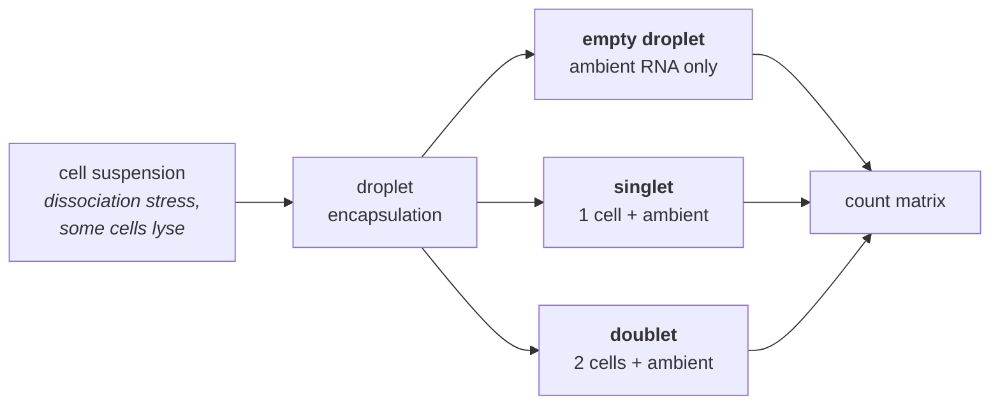

# 48 — Single-cell and spatial genomics

> **Before this:** [Ch 47](47-rna-seq.md) · [Ch 41](../part-09-genomics/41-data-formats.md) · [Ch 01 §5](../part-00-orientation/01-chemistry-and-cell-primer.md) · **Time:** ~50 min
>
> **Statistics needed:** [S2 Distributions](../part-S-statistics/S2-distributions.md) ·
> [S4 Hypothesis testing](../part-S-statistics/S4-hypothesis-testing.md) ·
> [S7 High-dimensional data](../part-S-statistics/S7-high-dimensional-data.md)

## What you'll be able to do

- State the composition/state confound precisely, and show with arithmetic why two entirely different biological stories can produce an identical bulk measurement
- Trace a molecule from droplet to count matrix through the cell-barcode + UMI scheme, say what doublets, ambient RNA and empty droplets each do to that matrix, and predict which real cell types a fixed QC threshold deletes from it
- Explain why a 90%-zero count matrix is what a plain sampling model *predicts*, and why the "zero-inflation" framing has been largely retired for UMI data
- Read a UMAP correctly — name exactly which features of the plot carry information and which are artefacts of the layout algorithm — and say why the cluster count is a resolution setting rather than a result
- Explain why marker-gene p-values computed on clusters defined from the same matrix are invalid, describe the two fixes that work, and say why a condition comparison replicates over donors rather than cells
- Explain why batch integration can delete a real condition effect and why an RNA-velocity arrow can point backwards, and name the experiment that settles each
- Compare imaging-based and capture-based spatial assays, and set up spot deconvolution as the inverse of the problem in §1

## The core idea

A bulk measurement of a tissue is a **weighted mean over a mixture whose weights you did not observe**:

```
b_g = Σ_k π_k · μ_gk          π = cell-type proportions (unknown)
                              μ = per-cell-type expression (unknown)
```

You observe the left-hand side. Both factors on the right are free. So when `b_g` changes
between two conditions, **π changed, μ changed, or both** — and bulk data cannot tell you
which. This is not a subtle statistical caveat; it is a non-identifiability, and it silently
invalidates a large fraction of the mechanistic conclusions ever drawn from tissue expression
data.

Single-cell methods fix it by measuring the mixture components instead of the mixture. The
price is exact and unavoidable: a fixed sequencing budget divided across many more units
means each unit is measured shallowly. Every difficulty in this chapter — the sparsity, the
zeros, the fragile clustering, the abused embeddings — descends from that one trade.

---

## 1. The confound, with numbers

A tissue containing proliferating cells (type A) and quiescent stroma (type B). Gene *MKI67*
sits at 100 units per cell in A and 20 in B.

| | Composition | Bulk value |
|---|---|---|
| Control | 60% A / 40% B | 0.6(100) + 0.4(20) = **68** |
| Treated, *story 1*: composition shifts, no cell changes | 30% A / 70% B | 0.3(100) + 0.7(20) = **44** |
| Treated, *story 2*: composition fixed, A downregulates to 60 | 60% A / 40% B | 0.6(60) + 0.4(20) = **44** |

Story 1 says the drug killed proliferating cells. Story 2 says it stopped cells proliferating
without killing them. These are different mechanisms with different clinical implications,
and **the bulk measurement is 44 in both cases.** No amount of replication, no better
statistical model, no deeper sequencing separates them. The information is not in the data.

The same non-identifiability produces gene–gene correlations that exist only in the mixture.
Two genes each marking cell type A correlate perfectly across bulk samples that vary in A
content, with no regulatory relationship whatsoever — a Simpson's paradox at the level of the
tissue. Bulk co-expression networks are, to a first approximation, cell-composition networks.

## 2. Measuring one cell at a time

Three isolation strategies, each a different point on the same trade-off.

**Plate-based (full-length).** Sort one cell per well, build a full-length library per well.
Hundreds to low thousands of cells; hundreds of thousands of reads each; coverage across the
whole transcript body, so isoforms, allele-specific expression and receptor sequences are
readable. Expensive per cell.

**Droplet-based (3′ or 5′ counting).** A microfluidic junction co-encapsulates a cell and a
barcoded bead in an oil droplet. Cells are loaded at low concentration so most droplets are
empty. Tens of thousands to millions of cells, at ~10²–10⁴ reads each. Only the transcript
end near the capture primer is sequenced, so you get a count per gene and almost no isoform
information.

**Combinatorial indexing (split-pool).** No physical isolation at all. Fixed cells or nuclei
are distributed across a plate, tagged with a well-specific barcode, pooled, redistributed,
tagged again — repeat *r* times. A cell's identity is the *concatenation* of the barcodes it
collected. With *W* wells and *r* rounds there are *Wʳ* combinations; the collision rate (two
cells sharing the full barcode) is a birthday problem you tune by keeping the number of cells
far below *Wʳ*. Cheap per cell and scales to millions, at the cost of shallow depth.

### The barcoding scheme

Droplet and split-pool methods both encode identity in the read itself:

```
Read 1  ┌────────────────┬────────────┐
        │  cell barcode  │    UMI     │        e.g. 16 bp CB + 12 bp UMI
        │    16 bp       │   12 bp    │
        └────────────────┴────────────┘

Read 2  ┌──────────────────────────────────────────────┐
        │  cDNA — aligned to the transcriptome          │
        └──────────────────────────────────────────────┘

count[cell, gene] = number of DISTINCT UMIs observed for that (cell, gene)
```

The two barcodes do different jobs and confusing them is a common error.

- The **cell barcode** identifies the partition — a droplet, a well-path, a plate position.
  It is shared by every molecule from that cell. Barcodes are drawn from a fixed known
  whitelist so sequencing errors can be corrected by Hamming-distance-1 rescue.
- The **UMI** (unique molecular identifier) is a random tag attached to each *individual mRNA
  molecule before PCR*. After amplification, a molecule present once may be represented by
  400 reads — but all 400 carry the same UMI. Collapsing reads by UMI converts an
  amplification-distorted read count into a **molecule count**. This is the single most
  important design feature of modern single-cell protocols: it removes PCR bias from the
  measurement rather than modelling it afterwards.

UMIs collide. With a 12 bp UMI there are 4¹² ≈ 1.68 × 10⁷ tags; if *m* molecules of one gene
in one cell are tagged, the expected number of *distinct* UMIs seen is
`N(1 − e^{−m/N})`, which for *m* ≪ *N* is essentially *m*. For typical counts (tens per gene
per cell) collisions are negligible; for a very highly expressed gene with a short UMI they
are not, and the occupancy formula above is the correction.

**Sequencing saturation** makes the depth trade-off concrete: as you add reads, the fraction
that are duplicates of an already-observed UMI rises. Past saturation, extra reads buy almost
no new molecules, and the budget is better spent on more cells. Below it, extra cells buy you
noisier cells.

| | Plate, full-length | Droplet, 3′ counting | Combinatorial indexing |
|---|---|---|---|
| Cells per experiment | 10²–10³ | 10³–10⁶ | 10⁴–10⁷ |
| Reads per cell | 10⁵–10⁶ | 10³–10⁴ | 10²–10³ |
| Transcript coverage | full body | 3′ (or 5′) end only | end only |
| Isoforms / allele-specific | yes | essentially no | no |
| Best for | mechanism in a known population | discovery, composition | atlas-scale surveys |

Choose by question. Finding a cell type that is 0.1% of the tissue is a *cell-number* problem
(you need ≥ ~10⁴ cells to see 10 of them); quantifying a splice-isoform switch is a *depth*
problem. The two are in direct competition for the same budget.

## 3. The three characteristic artefacts



**Doublets.** Two cells in one partition share a barcode and appear as one cell with a summed
profile. Cells load into droplets approximately Poisson with mean λ, so among occupied
droplets the multiplet fraction is `P(≥2)/P(≥1) ≈ λ/2` — **linear in loading concentration,
and therefore linear in the number of cells you recover.** The vendor rule of thumb on the
current droplet chemistry sits around 0.4% multiplets per 1,000 cells recovered — roughly
half the ~0.8–1% of the preceding generation, and a fast-moving specification: check current
figures rather than inheriting a number from an old protocol. At 0.4% a 10,000-cell run
carries roughly 4% doublets; on the older chemistry the same run carried 8–10%, so a rate
copied forward from a 2023 methods section is off by a factor of two. Detection exploits
the fact that a doublet is a *sum*: simulate synthetic doublets by adding randomly chosen
pairs of observed profiles, embed real and simulated cells together, and score each real cell
by how many simulated doublets are in its neighbourhood. When several donors are pooled in one run,
cross-donor doublets are found directly from genotype — a barcode showing heterozygous reads
at sites where both donors are homozygous for different alleles is two cells
([Ch 46](46-variant-calling.md)). Same-type doublets remain nearly undetectable, which is why
a "cluster" sitting exactly between two real clusters and co-expressing both marker sets
should be treated as an artefact until proven otherwise.

**Ambient RNA.** Cells lysed during dissociation release mRNA into the suspension. Every
droplet — occupied or not — receives a draw from this shared "soup" whose composition is the
tissue average, dominated by whatever cell type is most abundant and most fragile. The effect
on the matrix is a low-level, systematic false signal: haemoglobin transcripts in every cell
of a blood-rich tissue, insulin in every cell of a pancreas islet prep. Correction estimates
the soup profile from the empty barcodes and subtracts a per-cell contamination fraction,
either by a simple ratio estimator using genes known to be off in a given cell type, or by an
explicit generative model that decomposes each cell's counts into endogenous plus ambient.
The failure mode this creates — apparent co-expression of markers from different lineages —
is indistinguishable at the level of a single cell from real biology, which is why it must be
addressed by design and correction rather than by interpretation.

**Empty droplets.** Barcodes with only ambient RNA vastly outnumber real cells. The naive
filter is a hard threshold on total counts, found from the knee of the barcode-rank curve:

```
 total
 counts   ┤ ▓▓▓▓▓▓▓▓
 (log)    ┤         ▓▓▓▓                     real cells
          ┤             ▓▓▓
          ┤                ▓▓  ← knee
          ┤                  ▓▓▓▓▓
          ┤                       ▓▓▓▓▓▓▓▓▓▓ ambient-only barcodes
          └────────────────────────────────────────────
                    barcode rank (log)
```

A hard threshold discards every small, RNA-poor real cell — and RNA content varies by an
order of magnitude between cell types. The better test asks a different question: *is this
barcode's expression profile distinguishable from the ambient profile?* Model the ambient
composition as a Dirichlet-multinomial estimated from the deep tail, and test each low-count
barcode's profile against it. A barcode with 300 counts that look nothing like the soup is a
cell; one with 800 counts that look exactly like the soup is not.

## 4. The count matrix and the zeros

The output is an integer matrix, cells × genes, typically 90–95% zero, stored sparse and
usually backed by a chunked on-disk format because it will not fit in memory at atlas scale.

The zeros have three distinct causes, and conflating them has generated a lot of bad method:

| Cause | What it is | What to do |
|---|---|---|
| **Biological absence** | the gene is not transcribed in this cell | nothing — this is signal |
| **Sampling** | transcribed, but no molecule was captured and sequenced | model it; it is ordinary count noise |
| **Technical failure** | the cell/droplet failed (poor lysis, degraded RNA) | QC, per-cell |

The sampling contribution is much larger than intuition suggests. Capture efficiency in
droplet protocols is on the order of 10–30% of a cell's mRNA molecules, and the surviving
molecules are then subsampled by sequencing. Take a cell yielding *n* = 5,000 UMIs total and
a gene at relative abundance *p* = 2 × 10⁻⁴ in that cell. Expected count = *np* = 1, and

```
P(count = 0) = (1 − p)^n ≈ e^(−np) = e^(−1) = 0.37
```

**37% of cells that genuinely express this gene, at the same level, record zero.** For
*p* = 2 × 10⁻⁵, `e^(−0.1)` = 0.90. Nine in ten zeros, from a gene expressed in every single
cell, with no special process at all.

> **Statistics:** the Poisson limit of the binomial that turns `(1 − p)^n` into `e^(−np)` is
> [S2](../part-S-statistics/S2-distributions.md) §2; the negative binomial that appears below —
> a Poisson whose rate itself varies — is [S2](../part-S-statistics/S2-distributions.md) §5, and
> why a plain Poisson is not enough for count data is
> [S7](../part-S-statistics/S7-high-dimensional-data.md) §7.

That calculation is the reason the field's earlier framing has been substantially revised.
Around 2015–2017 scRNA-seq was routinely modelled with **zero-inflated** distributions — a
negative binomial plus an extra point mass at zero representing "dropout" — and a small
industry of imputation methods grew up to fill those zeros back in. Careful re-examination of
UMI-based data showed the extra component is largely unnecessary: once you account for the
distribution of per-cell depths and per-gene means, the observed zero fractions are close to
what a plain multinomial/Poisson–gamma (i.e. negative binomial) model predicts. The
consensus position now:

- **UMI count data** is reasonably described by Poisson or negative-binomial sampling with a
  cell-size offset. No separate zero-inflation component is needed for most genes.
- **Full-length, read-count (non-UMI) data** does show genuine excess zeros — amplification
  dropout is real when you are counting reads rather than molecules.
- **Imputation is dangerous.** Replacing zeros with model-based estimates borrows information
  across cells and genes, which manufactures smooth correlation structure. Downstream
  co-expression and network analyses then recover the imputation model rather than the
  biology.

The practical upshot, once you have [S2](../part-S-statistics/S2-distributions.md) §5 in hand:
use a count model with an offset. Do
not transform-and-pretend-Gaussian if you can avoid it, and do not add machinery for a
phenomenon that the sampling model already explains.

## 5. Quality control, and the cell type it deletes

Three per-cell statistics carry most of the signal: total UMIs, number of detected genes, and
the **fraction of counts from mitochondrial genes**. The last is a leakage indicator: when the
plasma membrane is compromised, cytoplasmic mRNA escapes while mitochondria — which have
their own membranes ([Ch 01](../part-00-orientation/01-chemistry-and-cell-primer.md)) — are
retained, so the mitochondrial *proportion* rises even though nothing about the mitochondria
changed.

The danger is that all three statistics are genuine biological properties of cell types.

| Threshold | What it is meant to remove | What it actually removes |
|---|---|---|
| `min_genes > 500` | failed droplets | platelets, erythrocytes, neutrophils, small resting lymphocytes — all genuinely RNA-poor |
| `mito_pct < 5%` | dying cells | cardiomyocytes, hepatocytes, kidney proximal tubule, skeletal muscle — mitochondria-rich by function |
| `max_counts` cap | doublets | large secretory and polyploid cells |

A fixed threshold applied globally is a filter on biology wearing the costume of a filter on
quality, and it fails silently: the missing cell type simply never appears in any figure. Two
disciplines fix most of it. Set thresholds adaptively per sample (e.g. median ± *k*·MAD on the
log statistic) rather than as universal constants. And **inspect what you removed**: cluster
the discarded cells and look for markers. Debris clusters incoherently; a deleted cell type
clusters tightly and expresses a coherent programme.

## 6. Normalisation, features, and the neighbour graph

Total counts per cell vary by an order of magnitude, driven by *both* capture efficiency
(technical) and cell size and RNA content (biological) — and those two are not separable from
the data alone. Every normalisation choice therefore takes a position on how much of the
size factor is nuisance. This is the compositional problem from [Ch 47](47-rna-seq.md),
sharpened: a single-cell library is a small multinomial draw, so only *relative* abundances
are measured, and a genuine global change in transcriptional output is invisible without a
spike-in.

Two workable approaches:

1. **Scale and log.** Divide by total counts, multiply by a constant, `log(x + 1)`. Cheap and
   ubiquitous. The pseudocount interacts with depth, and low-count genes end up with
   depth-dependent variance, so downstream PCA is partly ordering cells by library size.
2. **Model, then take residuals.** Fit a per-gene GLM with the cell's total count as an
   offset and use Pearson or deviance residuals as the normalised values. Variance
   stabilisation comes from the model rather than from a fixed transform, and the residual
   scale is comparable across genes of very different means.

Then **feature selection**: rank genes by variance in excess of the fitted mean–variance
trend and keep ~1,000–5,000 highly variable genes. This is not merely a speed optimisation —
carrying 20,000 mostly-noise genes into PCA is a signal-to-noise decision, not a completeness
decision.

Then **PCA** to 10–50 components. This is the real dimensionality reduction; everything
downstream — the neighbour graph, the clustering, the embedding, the trajectory — operates in
PC space, not in the 2-D picture you eventually publish.

> **Statistics:** PCA as eigenvectors of a covariance matrix, and the measured extent to which
> t-SNE and UMAP distort the PC-space distances they are built from, are covered in
> [S7](../part-S-statistics/S7-high-dimensional-data.md) §5 — the quantitative backing for §7 below.

Then a **k-nearest-neighbour graph** in PC space (k ≈ 10–50), built with approximate NN search
at scale, with edges usually reweighted by shared-neighbour overlap so that spurious long
edges are down-weighted. This graph is the substrate for the next two sections.

## 7. UMAP: what it preserves and what it does not

UMAP and t-SNE lay that neighbour graph out in two dimensions by minimising a loss that
rewards keeping neighbours close and pushing non-neighbours apart. They are neighbourhood
layout algorithms. They are not projections, they are not distance-preserving, and they have
no metric interpretation.

| Read from a UMAP | Do **not** read from a UMAP |
|---|---|
| Which cells are near which cells (locally) | The **distance between two clusters** — set by the repulsion term and the initialisation, not by expression divergence |
| Whether a population is connected or discrete-ish | The **size or area of a cluster** — a function of local density and repulsion, not of cell number or heterogeneity |
| That a labelling is coherent in neighbour space | The **relative arrangement** of clusters — left/right, above/below, angles between arms |
| Continuity worth investigating properly | **Density** — UMAP does not preserve it, and t-SNE actively distorts it |

Three facts that should end any quantitative argument made from an embedding:

- The layout changes with `n_neighbors`, `min_dist`, the number of PCs, and the random seed.
  Two defensible parameter choices give two visually different stories from identical data.
- A cluster drawn twice as far away is not twice as different. Between-cluster distance in a
  UMAP is **not a monotone function** of any expression-space distance.
- Discreteness in the picture is partly manufactured: the algorithm's repulsion opens gaps in
  data that is continuous in PC space, and closes them where the graph happens to be dense.

The correct role: an embedding is a **legend for a clustering**, a way of showing that a
labelling is spatially coherent. Every quantitative claim — how distinct, how many, how
related — must be made in PC space, on the graph, or on expression itself, and only
*illustrated* on the embedding.

## 8. Clustering and annotation

Community detection on the kNN graph — Louvain, or Leiden, which adds a refinement step
guaranteeing the communities it returns are internally connected (Louvain can return
disconnected "communities", which is a real bug, not a technicality).

The thing to internalise: **the number of clusters is a parameter, not a discovery.** Both
algorithms optimise modularity at a chosen resolution γ, and the number of communities is
monotone in γ. There is no data-driven optimum, and modularity has a *resolution limit* —
below a size scale set by the total edge count, genuinely separate communities merge
regardless of how distinct they are. So no single resolution can be correct for both an
abundant cell type and a rare one in the same dataset.

What to do instead of hunting for the right γ: sweep it, build the tree of how clusters split
and merge across the sweep, and justify each split independently — does it have markers that
are not ambient or doublet artefacts, does it survive bootstrapping cells or genes, does it
reproduce in a second sample? Granularity is then a per-branch decision.

**Annotation** maps clusters to known biology, two ways. Manually, from marker genes and prior
knowledge (*PTPRC* for leukocytes, *EPCAM* for epithelium, *CD3E* for T cells). Or by
**reference-based label transfer**: given an annotated reference, project query cells into a
shared space, find each query cell's nearest reference neighbours, and transfer labels with a
confidence weight. Fast, reproducible, and dangerous in one specific way — a classifier can
only emit labels the reference contains, so a genuinely novel cell type is assigned to its
nearest reference relative, often with high confidence. Always keep and inspect the
uncertainty, and treat a cluster with uniformly low transfer confidence as interesting rather
than as a failure.

Note also that a cluster is not an ontological category. It is a density feature at one
resolution. The distinction between a cell **type** (stable, heritable identity) and a cell
**state** (transient — cycling, stressed, activated, interferon-responding) is biological, and
clustering does not respect it: a strong state signature will split every type in the dataset
along the same axis.

## 9. Testing on the data you clustered

Two statistical errors are near-universal in this field, and both matter more than the choice
of test.

> **Statistics:** what a p-value's null distribution is, and how choosing an analysis after
> seeing the data destroys it, are [S4](../part-S-statistics/S4-hypothesis-testing.md) §3 and §8;
> the donor-level random effect behind the pseudobulk and mixed-model fixes is
> [S7](../part-S-statistics/S7-high-dimensional-data.md) §8.

**Double-dipping (post-selection inference).** The standard marker workflow clusters cells to
maximise separation in expression space, then tests each gene for a difference between
clusters using that same expression matrix. The null hypothesis "gene *g* has equal mean in
group 1 and group 2" was used to *construct* the groups. The resulting p-values are wildly
anticonservative: take a single homogeneous population with no structure whatsoever, force
*k* = 2 clusters, and you will obtain markers at p < 10⁻¹⁰. This is not a small correction
factor — it is a test whose null distribution is wrong by construction.

Two classes of fix actually work:

- **Selective inference.** Condition on the selection event: compute the p-value under the
  null *given that the clustering algorithm returned these clusters*. Exact conditional tests
  exist for some clustering procedures (hierarchical clustering with certain linkages,
  k-means). Rigorous, but tied to a specific algorithm.
- **Count splitting / data thinning.** Exploit a closure property of the count model. If
  `X ~ Poisson(λ)`, draw `X₁ ~ Binomial(X, ε)` and set `X₂ = X − X₁`; then
  `X₁ ~ Poisson(ελ)`, `X₂ ~ Poisson((1−ε)λ)`, and **X₁ ⊥ X₂**. Cluster on X₁, test on X₂. The
  independence is exact, so ordinary tests regain their nominal level. It generalises to the
  negative binomial when the overdispersion is known, and to other convolution-closed
  families. This is the cleanest available answer and it costs one line of code.

Note why the obvious fix fails: splitting *cells* into train and test does not work, because
assigning cluster labels to held-out cells uses those cells' own expression, which
reintroduces exactly the dependence you were trying to break. You have to split the counts,
not the cells.

**Pseudoreplication.** When comparing conditions — disease vs control, treated vs untreated —
the independent unit is the **donor**, not the cell. Ten thousand cells from three patients
are three replicates, not ten thousand. A cell-level test treats them as independent, so the
standard error shrinks by roughly √(cells per donor): with 2,000 cells per donor, the
reported standard error is ~45× too small, and the false-positive rate approaches one. The
fix is **pseudobulk**: sum counts within each (cell type, donor) pair, then run the ordinary
bulk differential-expression pipeline from [Ch 47](47-rna-seq.md) on a matrix with one column
per donor per cell type. Cell-level mixed models with a donor random effect are the other
defensible option. Naive Wilcoxon across cells is not.

## 10. Integration, and the biology it can erase

Cells from different donors, chemistries, sites or days separate by batch before they
separate by cell type. Integration methods align them, in three broad families: removing
batch as a linear factor in PC space with iterative centroid correction; matching cells
between batches by mutual nearest neighbours and using the matched pairs to define correction
vectors; or fitting a latent-variable model (typically a variational autoencoder) with batch
as a covariate and using the latent space as the corrected representation.

Every one of them is instructed that batches ought to look alike. So if a batch genuinely
contains a cell type the others lack, or a real condition-driven shift in state, they will
remove it — and **the usual diagnostic rewards exactly that failure**, because batch-mixing
entropy is maximised by destroying the difference. Evaluate with paired metrics that score
biological conservation against batch mixing, and test explicitly that two populations known
to be distinct are not merged.

The real fix is experimental. Multiplex donors within a run — antibody hashing, or genetic
demultiplexing from the donors' own SNPs — so that donor is not confounded with batch, and
the correction has something to hold constant.

## 11. Trajectories, pseudotime, and RNA velocity

Some processes are asynchronous and continuous: differentiation, activation, cell cycle. A
single snapshot then contains cells at every stage, and the ordering can be recovered from
geometry. **Pseudotime** fits a graph or principal curve through the cells in PC space,
designates a root, and orders cells by distance along it.

Three honest caveats. Pseudotime is defined only up to a monotone reparametrisation: it has
no units and no calibration to wall-clock time. Cell density along the trajectory reflects
both dwell time in a state *and* sampling and survival biases, so "cells accumulate at stage
X" is confounded. And the root is supplied by you, not by the data — the geometry is
symmetric.

**RNA velocity** attempts to break that symmetry. Reads mapping to introns report unspliced
pre-mRNA; reads spanning exon junctions report mature mRNA. A minimal kinetic model:

```
du/dt = α(t) − β·u        u = unspliced,  α = transcription
ds/dt = β·u   − γ·s        s = spliced,    β = splicing, γ = degradation
```

Under a steady-state assumption, `s* = (β/γ)u`, so fitting a line through the (u, s) cloud
across cells estimates β/γ; a cell above the line has ds/dt < 0 (gene switching off), below
it ds/dt > 0 (switching on). Pooling the sign across genes gives each cell a displacement
vector, drawn as an arrow on an embedding.

Treat the arrows as a hypothesis, for reasons that are structural rather than incidental:

- Only the **ratio** of rates is identifiable from a snapshot, so velocity has arbitrary time
  units and only its *direction* is meaningful.
- The steady-state fit assumes cells reach steady state and that kinetic rates are constant
  across cells. Transcriptional boosts, multiple kinetic regimes, and cell-type-specific
  splicing rates each violate this, and each can **flip the arrow's sign**. Documented cases
  exist where velocity confidently points backwards in developmental systems whose true
  direction is known.
- The unspliced/spliced split depends on intron annotation and on how ambiguous reads are
  assigned — and is systematically different between whole-cell and single-nucleus data,
  where nuclear pre-mRNA is enriched by construction.
- Arrows are drawn on a UMAP, and §7 applies: the projection of a high-dimensional
  displacement into a non-metric 2-D layout is itself a strong transformation.

The confirmatory experiments are lineage tracing with heritable barcodes, metabolic labelling
that marks newly transcribed RNA directly, and actual time courses.

## 12. Multi-modal single cell

Once a cell is barcoded, anything you can convert into a barcoded sequencing library can be
measured alongside its RNA.

| Assay | Second modality | Statistical character |
|---|---|---|
| **CITE-seq** | surface protein, via antibodies carrying oligo tags | counts are dense, not sparse; high background from unbound antibody; needs its own normalisation, often using empty droplets to estimate the background level |
| **single-cell ATAC** | open chromatin ([Ch 49](49-epigenome-profiling.md)) | near-binary: a diploid cell has at most 2 copies of a locus, so per-peak counts are 0/1/2. ~10⁵ features, extremely sparse. TF-IDF weighting plus truncated SVD replaces PCA |
| **Multiome** | ATAC and RNA in the *same* nucleus | lets you link a peak to a gene by covariation across cells, rather than by proximity — the data-driven route to enhancer–gene assignment used in [Ch 52](../part-11-human-and-statistical-genomics/52-association-to-mechanism.md) |

A practical note that affects every tissue study: for frozen material, fibrous tissue, or
large cells that do not survive dissociation, the assay operates on **nuclei** rather than
cells. Single-nucleus data has a higher intronic fraction, loses cytoplasmic and mitochondrial
transcripts, and recovers a *different* cell-type composition than single-cell data from the
same tissue. Neither composition is the truth; both are protocol-dependent.

## 13. Spatial genomics

Dissociation destroys position. It also biases composition — cell types differ enormously in
how well they survive being pulled out of a tissue — so the loss is not only of coordinates
but of the denominator. Spatial methods keep the tissue intact and split into two families
that make opposite trade-offs.

**Imaging / in situ.** Fluorescent probes are hybridised to chosen transcripts over multiple
rounds, each transcript species assigned an error-correcting binary code across rounds
(Hamming distance ≥ 4 between codewords, so single-round errors are correctable). Imaging
after each round reads the code out. Alternatively, sequencing chemistry is run directly on
the tissue section.

- Resolution: **subcellular** — individual molecules localised, so you see nuclear vs
  cytoplasmic distribution.
- Breadth: a **fixed panel**, historically 10²–10³ genes and expanding toward whole
  transcriptomes; panel size is a fast-moving specification and should be checked, not
  quoted from memory.
- Characteristic artefact: **cell segmentation**. Molecules must be assigned to cells, and
  boundaries are inferred from a nuclear stain plus membrane markers. Misassignment produces
  exactly the false co-expression that ambient RNA produces in droplet data, but spatially
  structured — so it survives every non-spatial correction. Probabilistic assignment that
  uses expression coherence as well as geometry is the current answer.

**Capture / sequencing-based.** A slide carries an array of spatially barcoded capture
features. Tissue is placed on it, permeabilised, and released mRNA binds the feature beneath
it; the barcode encodes (x, y).

- Breadth: **whole transcriptome**, unbiased — you can discover genes you did not think to
  probe.
- Resolution: set by feature size and pitch, ranging from features of tens of micrometres
  (containing several cells) down to sub-micrometre beads and arrays binned to a chosen
  scale. Coarse features mix cell types.

```
capture spot (≈50 µm)              what the counts actually are
 ┌───────────────┐
 │  ◍  ◍   ◍     │   3 tumour     y_g = depth · Σ_k π_k μ_gk
 │    ◍   ●  ●   │   2 T cells                └── the §1 problem, again
 │  ◍   ●        │   1 fibroblast
 └───────────────┘
```

**Deconvolution** is therefore §1 run deliberately in reverse: given a single-cell reference
of per-cell-type profiles μ, estimate the proportions π in each spot — non-negative
regression, or a topic model, with a count likelihood and a sum-to-one constraint. The
inverse-problem warnings all apply: the reference must contain every type actually present
(anything missing is absorbed into the nearest available profile), and cell types with
collinear expression profiles are poorly identified no matter how deep the data.

| | Imaging / in situ | Capture / sequencing |
|---|---|---|
| Resolution | subcellular | feature-limited: sub-µm to tens of µm |
| Genes | fixed panel | whole transcriptome |
| Key artefact | segmentation error | multi-cell mixing → needs deconvolution |
| Detection sensitivity | high per targeted gene | lower, capture-limited |
| Best for | testing a hypothesis about known genes | discovery, tissue-domain mapping |

What spatial data buys, once you have it: **neighbourhood analysis** (which cell types abut
which, tested against a null of random placement), **spatially variable genes** (spatial
autocorrelation — Moran's I, or a Gaussian process with a spatial kernel against a
no-structure null), **tissue domain segmentation** (clustering that uses coordinates as well
as expression), and candidate cell–cell signalling from ligand–receptor colocalisation —
where colocalisation is a necessary and very far from sufficient condition for signalling.

## 14. Atlases

A cell atlas is a large, annotated, harmonised reference: many donors, many tissues, common
ontology terms, standardised processing. Its value is not that it contains an answer, but
that it is the reference object several other analyses require — a shared vocabulary and
coordinate system, a target for label transfer (§8), a reference for spot deconvolution
(§13), and the denominator that lets you ask which cell type expresses the gene at a GWAS
locus ([Ch 51](../part-11-human-and-statistical-genomics/51-gwas.md),
[Ch 52](../part-11-human-and-statistical-genomics/52-association-to-mechanism.md)).

Consortium efforts have assembled data on the order of tens of millions of cells across
dozens of human tissues, with integrated draft releases appearing through the mid-2020s;
cell counts and tissue coverage move quickly enough that a current figure should be taken
from the consortium's own release page rather than from a textbook.

The caveat is structural and easy to forget: an atlas inherits every bias of its donors,
dissociation protocols, and QC thresholds. A cell type that does not survive dissociation, or
that falls below a gene-count threshold, is absent from the atlas — and therefore absent from
every label transfer and every deconvolution that uses it, in a way that produces no error
message and no warning.

---

## Common misconceptions

| What people think | What's actually true |
|---|---|
| A bulk expression change means cells changed their expression | It is equally consistent with a change in cell-type proportions. The two are not separable from bulk data — see §1 |
| Zeros in scRNA-seq are "dropout" needing imputation | For UMI data most zeros are ordinary sampling and are predicted by a plain count model. The zero-inflation framing has been substantially retired, and imputation manufactures correlation structure |
| Clusters far apart on a UMAP are more different than clusters close together | Between-cluster distance in a UMAP carries no information. Neither does cluster size, density, or relative arrangement |
| The clustering found the right number of cell types | The number of clusters is set by the resolution parameter. There is no data-driven optimum, and modularity's resolution limit means one setting cannot suit both abundant and rare populations |
| A marker gene with p = 10⁻³⁰⁰ is definitively a marker | The clusters were defined using that gene's expression. Uncorrected post-clustering p-values are anticonservative by construction, even on data with no structure at all |
| More cells means more statistical power for a condition comparison | Only if the cells are independent. Across conditions the unit is the donor; cell-level tests pseudoreplicate and inflate significance by roughly the square root of cells per donor |
| Batch correction removes technical variation | It removes *between-batch* variation, technical or biological. When batch is confounded with condition or donor, it removes the finding |
| RNA velocity arrows show the direction of differentiation | They show the sign of a steady-state residual under strong kinetic assumptions, projected onto a non-metric embedding. Documented cases point backwards |
| Spatial transcriptomics gives per-cell expression with coordinates | Capture-based methods give per-*spot* mixtures needing deconvolution; imaging-based methods give per-molecule positions needing segmentation. Neither hands you clean single-cell profiles |

## Worked example: one gene, three errors avoided

A trial biopsy, before and after treatment. Bulk RNA-seq shows *MKI67* falling from 68 to 44
normalised units, p = 0.001 across replicates.

**Step 1 — what bulk can support.** Using the model of §1 with two cell types:

- Composition-only story: A drops 60% → 30%, per-cell expression unchanged.
  0.3(100) + 0.7(20) = 44. ✓
- State-only story: composition unchanged, A drops 100 → *x*.
  0.6*x* + 0.4(20) = 44 → 0.6*x* = 36 → *x* = **60**. ✓

Both fit the observation exactly. The bulk result supports "*MKI67* signal fell" and nothing
more. Any mechanistic sentence beyond that is unsupported.

**Step 2 — single-cell, and expecting the zeros.** Run droplet scRNA-seq, recover 12,000
cells across 3 donors per arm. Type A cells yield a median 5,000 UMIs; *MKI67* is 2 × 10⁻⁴ of
transcripts in a proliferating cell. Expected count = 5,000 × 2 × 10⁻⁴ = 1.0, so

```
P(zero | genuinely expressing, type A) = e^(−1.0)  = 0.37
P(zero | genuinely expressing, type B) = e^(−0.2)  = 0.82     (p = 4×10⁻⁵)
```

37% of A cells and 82% of B cells record zero. If you had reached for a zero-inflated model
or an imputation step you would have been correcting a phenomenon that is fully explained by
`np` being small. Note also what this does to a per-cell "expressed/not expressed" call: it is
mostly a readout of sequencing depth.

**Step 3 — doublet budget.** The multiplet rate in §3 is linear in the cells recovered *per
run*, so budget per arm, not on the pooled total: 6,000 cells recovered at ~0.4% multiplets
per 1,000 recovered implies roughly 2.4% doublets, ~144 cells per arm — ~290 across the
study. An A/B doublet has ≈ (100 + 20)/2 = 60 units of *MKI67* and expresses both lineages'
markers — it will form its own small cluster sitting
between A and B, and if annotated naively it becomes a spurious "intermediate transitional
state". Remove it by simulation-based scoring, and by genotype demultiplexing since donors
were pooled.

**Step 4 — the answer, computed correctly.** Cluster (on split counts, §9), annotate, then:

| | Control | Treated |
|---|---|---|
| Fraction type A | 0.61 | 0.29 |
| Pseudobulk *MKI67* in A, per donor | 98, 103, 99 | 101, 97, 104 |

Two separate tests, on two separate quantities. A **composition test** on the proportions
(3 vs 3 donors, on a logit or a Dirichlet-multinomial to respect the constraint) is
significant. A **pseudobulk state test** within type A — 3 values vs 3 values, mean 100.0 vs
100.7 — is not. Story 1 is right: the drug depleted proliferating cells and did not slow the
survivors.

Had you instead run a Wilcoxon test across all type-A cells (≈3,700 vs ≈1,700 cells), the
standard error would be understated by roughly √(1,200 cells per donor) ≈ 35×, and that 0.7%
difference would have returned a small p-value and the opposite mechanistic conclusion.

## Connections

- **Back to:** [Ch 47](47-rna-seq.md) — the compositional normalisation problem and the
  bulk DE machinery that pseudobulk reuses · [Ch 46](46-variant-calling.md) — genotype-based
  demultiplexing and doublet detection · [Ch 41](../part-09-genomics/41-data-formats.md) —
  where barcodes and UMIs live in the file formats ·
  [Ch 01 §5](../part-00-orientation/01-chemistry-and-cell-primer.md) — expression noise
  between genetically identical cells is the biological reason single-cell distributions are
  broad · [Ch 25](../part-04-gene-regulation/25-networks-and-development.md) — what a
  differentiation trajectory is made of ·
  [Ch 25A §7](../part-04-gene-regulation/25A-developmental-genetics.md) — Cre-driven lineage
  tracing, the engineered ground truth these methods reconstruct statistically; the comparison
  is the honest way to judge a trajectory, because a pseudotime ordering is an inference and a
  heritable label is an observation
- **Forward to:** [Ch 49](49-epigenome-profiling.md) — single-cell ATAC and the assays behind
  the second modality · [Ch 50](50-3d-genome.md) — single-cell contact maps, with the same
  sparsity problem in a different geometry ·
  [Ch 52](../part-11-human-and-statistical-genomics/52-association-to-mechanism.md) — using
  cell-type-resolved expression to assign a GWAS locus to a cell type ·
  [Ch 56](../part-11-human-and-statistical-genomics/56-cancer-genomics.md) — tumour
  heterogeneity, where the composition/state confound is the entire subject ·
  [D4](../part-D-sca12/D4-sca12-from-repeat-to-phenotype.md) and
  [lab 12](../labs/lab-12-expression-and-isoforms.md) — a clinical use of cell-type resolution:
  whether *PPP2R2B*'s bulk cerebellar signal survives the granule-cell dilution this chapter
  warns about is a question only single-nucleus data can answer

## Check yourself

**1. Bulk RNA-seq of liver shows albumin transcripts up 1.8-fold in disease. Name two distinct mechanisms consistent with this, and the measurement that separates them.**

<details><summary>Answer</summary>

(a) Hepatocytes are transcribing more albumin per cell; (b) hepatocytes make up a larger
share of the sampled tissue because another population (immune infiltrate, fibrotic stroma)
shrank. Both give the same bulk number since `b_g = Σ_k π_k μ_gk` and only the product is
observed. One subtlety specific to bulk: the tissue is homogenised, not dissociated, so the
weights are *RNA-content* weights rather than cell-number fractions — RNA-rich hepatocytes
count for more than their numerical share, and a change in another compartment's RNA output
alone moves `b_g`. Separating (a) from (b) requires measuring π and μ independently:
single-cell or single-nucleus RNA-seq, or spatial data with deconvolution against a
reference. Note that the resolving experiment brings a compositional artefact of its own —
differential dissociation survival (§13), which single-cell data does *not* fix and spatial
data does.

</details>

**2. A gene is expressed in every cell of a population, and 90% of cells show a count of zero. Is this evidence of zero inflation?**

<details><summary>Answer</summary>

No. With a per-cell library of *n* molecules and the gene at relative abundance *p*,
`P(0) = (1−p)ⁿ ≈ e^(−np)`. A 90% zero rate corresponds to `np ≈ 0.105` — for *n* = 5,000
that is *p* ≈ 2 × 10⁻⁵, an entirely ordinary abundance for a lowly expressed gene. Plain
multinomial sampling predicts it. Zero inflation would mean *more* zeros than this model
predicts after accounting for the distribution of *n* and *p*, and for UMI data that excess
is largely absent. Non-UMI read-count protocols are a different matter.

</details>

**3. Two clusters sit at opposite corners of a UMAP, with a third squeezed between them. What can you legitimately conclude?**

<details><summary>Answer</summary>

Almost nothing from the positions. Between-cluster distance is not a monotone function of
expression divergence; cluster area reflects local density and the layout's repulsion term,
not cell count or heterogeneity; and the whole arrangement changes with `n_neighbors`,
`min_dist`, the PC count and the random seed. You may conclude that the three labellings are
locally coherent in neighbour space. To claim the corner clusters are the most different, or
that the middle one is transitional, you must work in PC/expression space: compute
centroid distances or correlations there, and check the "intermediate" cluster is not simply
doublets — co-expression of both flanking marker sets plus elevated total counts is the
signature.

</details>

**4. You cluster cells, find *GZMB* differentially expressed between cluster 1 and cluster 2 at p = 10⁻⁸⁰, and report it as a marker. What is wrong, and what fixes it?**

<details><summary>Answer</summary>

The clusters were constructed by an algorithm maximising separation on the same expression
matrix that includes *GZMB*, so the null hypothesis being tested was already used to define
the groups. The p-value's null distribution is wrong by construction — a homogeneous
population forced into two clusters yields extreme "significance". Two fixes: selective
inference, which computes the p-value conditional on the clustering event; or count splitting
/ data thinning, which uses Poisson thinning (`X₁ ~ Binom(X, ε)`, `X₂ = X − X₁`, independent)
to cluster on one half of each count and test on the other, restoring exact independence. A
weaker but common practice is to treat marker p-values purely as a ranking and validate on an
independent sample.

</details>

**5. A 50 µm capture spot shows both *CD3E* (T cell) and *EPCAM* (epithelium). Give three explanations and how to distinguish them.**

<details><summary>Answer</summary>

(a) The spot genuinely contains both a T cell and an epithelial cell — the default at this
feature size, since 50 µm covers several cells. Resolve by deconvolution against a single-cell
reference: the estimate should give non-trivial proportions for both. (b) Diffusion or
lateral spread of transcripts from an adjacent region during permeabilisation, producing
spatial bleed. Check whether the co-signal decays with distance from a pure epithelial region
in a way that looks like a smooth kernel rather than like cell placement. (c) An intraepithelial
lymphocyte genuinely embedded in epithelium — biologically real and interesting. Distinguishing
(a) from (c) needs subcellular resolution, i.e. an imaging-based assay on a serial section —
where the corresponding artefact becomes segmentation error rather than mixing.

</details>
