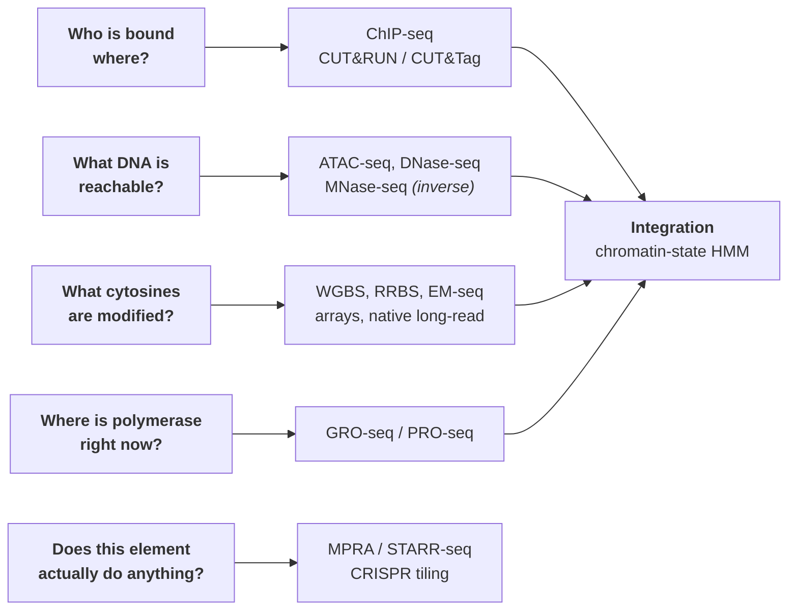

# 49 — Chromatin and epigenome profiling

> **Before this:** [Ch 03](../part-01-molecular-foundations/03-genomes-chromosomes-chromatin.md) · [Ch 22](../part-04-gene-regulation/22-eukaryotic-transcriptional-regulation.md) · [Ch 23](../part-04-gene-regulation/23-chromatin-and-epigenetics.md) · [Ch 42](../part-09-genomics/42-read-alignment.md) · **Time:** ~55 min
>
> **Statistics needed:** [S2 Distributions](../part-S-statistics/S2-distributions.md) ·
> [S4 Hypothesis testing](../part-S-statistics/S4-hypothesis-testing.md) ·
> [S7 High-dimensional data](../part-S-statistics/S7-high-dimensional-data.md)

## What you'll be able to do

- Pick the right assay for a stated question, and say what its characteristic artefact is
- Derive the ChIP-seq peak-calling model, explain why the control library is not optional, read FRiP / NSC / RSC / IDR as the statistics they are, and say mechanistically why tethering a nuclease to the antibody beats immunoprecipitating sheared chromatin
- Explain why accessibility is a necessary and not a sufficient condition for regulation, why the absence of a footprint is not evidence of absent binding, and how cleavage bias manufactures one
- Explain why bisulfite conversion wrecks read mapping, and what the conversion-free alternatives buy
- Diagnose cell-composition confounding in a differential-methylation result, correct it by deconvolution, and say why an epigenetic clock fitted on bulk tissue inherits the same confounder
- Distinguish a sufficiency claim (MPRA, STARR-seq) from a necessity claim (CRISPR tiling), and name the failure mode of each
- Describe chromatin-state segmentation as a multivariate HMM and say what the fitted states do and don't mean

## The core idea

Every cell in you has the same sequence ([Ch 00](../part-00-orientation/00-the-whole-story.md)). What differs is an annotation layer written on top of it: which proteins are bound where, which DNA is wrapped on a nucleosome, which histone tails carry which chemical marks, which cytosines are methylated, where polymerase is currently sitting. This chapter is about reading that layer.

Every assay here has the same shape:

> **Convert a physical property of chromatin into a population of DNA fragments whose positional density encodes that property. Sequence them. Ask, per position, whether coverage exceeds what a background model predicts.**

The enrichment step differs; everything downstream is the same coverage-and-null-model problem. That single observation collapses a bewildering assay zoo into three questions you ask of any new method: **what makes a fragment, what is the background, and what null am I testing against?** Hold those and you can evaluate a method you have never seen.



---

## 1. Protein–DNA binding: ChIP-seq

**Chromatin immunoprecipitation.** Formaldehyde crosslinks proteins to the DNA they are touching (a short reaction — minutes — because formaldehyde keeps going). Cells are lysed, chromatin sheared by sonication to a few hundred base pairs, and an antibody against your protein or histone mark pulls down the fragments carrying it. Crosslinks are reversed, DNA purified, sequenced.

Reads pile up around the true site in a characteristic, exploitable way. Because you sequence from the 5' end of each fragment and fragments straddle the site, forward-strand reads cluster upstream and reverse-strand reads downstream, separated by roughly the fragment length *d*:

```
                        true binding site
                               |
  + strand reads   ▸▸▸ ▸▸▸▸ ▸▸▸|
  - strand reads               |◂◂◂ ◂◂◂◂ ◂◂◂
                    <----- d ----->
  combined (naive)  ▁▂▄▆█▆▄▂▁▁▁▁▁▂▄▆█▆▄▂▁      bimodal — two "peaks", one site
  after shifting
  each read by d/2  ▁▁▁▂▄▆████████▆▄▂▁▁▁▁      one peak, correct centre
```

That shift is why callers estimate *d* first (from the strand cross-correlation, §3) and then either shift reads by *d*/2 or extend them to length *d* before building the pileup.

### What actually goes wrong

ChIP-seq is a mature method with well-characterised failure modes, and you should assume every one of them is present until shown otherwise.

| Problem | Why it happens | Consequence |
|---|---|---|
| **Antibody quality** | Polyclonal antisera against a small modified peptide; specificity varies between vendors, between lots of the same catalogue number, and between applications (a good western antibody is not necessarily a good ChIP antibody) | **The dominant source of variance in the whole assay.** Two antibodies nominally against the same mark routinely yield peak sets whose overlap is well under half. This is a major, still-unresolved reproducibility problem in the field |
| **Crosslinking artefacts** | Formaldehyde captures protein–protein as well as protein–DNA contacts, so a factor tethered to DNA *through* another protein is recovered as if it bound directly. Over-crosslinking also masks epitopes and resists shearing | Indirect and "phantom" occupancy; peaks that no motif explains |
| **Cell number** | Losses at every wash; the target is a tiny fraction of chromatin | Classically 10⁶–10⁷ cells per experiment. Rules out most primary and clinical material |
| **Hyper-ChIPable regions** | Highly expressed genes, very open promoters, and high-copy repeats are recovered in excess **with any antibody, including none at all** | Reproducible false positives that look convincing, and that recur across experiments, which makes them look like biology |

### The control library is not optional

Sequence the sheared chromatin *without* the immunoprecipitation ("input"), or with a non-specific antibody ("IgG mock"). This is not a formality. The input carries, at matched scale, every non-uniformity that has nothing to do with your protein: sonication bias (open chromatin fragments more readily), copy-number variation (a tumour with 8 copies of a region gives 8× coverage there), mappability, GC bias in library prep, and the hyper-ChIPable regions above. The peak caller uses it to set a **local** expected rate. Without it you are testing against a uniform genome, and a uniform genome does not exist.

## 2. Tethered nucleases: CUT&RUN and CUT&Tag

The successor idea inverts the logic. Instead of fragmenting everything and then selecting 0.1% of it, **only fragment near the target in the first place.**

Permeabilised, unfixed nuclei are immobilised on beads. The primary antibody diffuses in and binds its target *in situ*. Then a fusion protein — protein A (or A/G) joined to micrococcal nuclease in **CUT&RUN**, or to hyperactive Tn5 transposase in **CUT&Tag** — is added; protein A binds the antibody's constant region, parking the enzyme beside the target. The enzyme is held inactive until you supply its cofactor (Ca²⁺ for MNase, Mg²⁺ for Tn5), so cutting happens only where the antibody is, and only within a short tether radius.

```
 ChIP-seq                              CUT&RUN / CUT&Tag
 ─────────────────────────────         ──────────────────────────────
 shear the whole genome        →       leave the genome intact
 ~3×10⁹ bp of background               antibody binds target in situ
 pull down with antibody       →       enzyme tethered to antibody
 wash away 99.9%                       activate → cut ONLY near target
 background = what you failed          background = what the untethered
   to remove  (SUBTRACTIVE,              enzyme happens to hit
   floored by non-specific binding)      (ADDITIVE, and small)
```

That distinction — **selection versus generation** — is the whole mechanistic reason for the improvement. In ChIP, background is a subtraction problem with a hard floor set by non-specific adsorption to beads and antibody. In a tethered-nuclease assay, background fragments have to be *created*, and creating them requires the enzyme to be somewhere it was never recruited to. In CUT&RUN the cleaved fragments then diffuse out of the permeabilised nucleus and are recovered from the supernatant, discarding the uncut bulk genome entirely — a second enrichment for free.

| | ChIP-seq | CUT&RUN | CUT&Tag |
|---|---|---|---|
| Cells needed | 10⁶–10⁷ | 10³–10⁵ | 10²–10⁴; single-cell versions exist |
| Reads for equivalent power | tens of millions | a few million | a few million |
| Library prep | separate, after IP | separate | **none** — Tn5 inserts adapters as it cuts |
| Fixation | required | usually none | usually none |
| Characteristic weakness | antibody + background | needs intact nuclei | Tn5 has an accessibility bias; open chromatin leaks into every track |

CUT&Tag's one-step tagmentation is what makes it single-cell-compatible. Its cost is that Tn5 prefers accessible DNA whether or not it was recruited, so its background is *structured* — it looks like an ATAC track — which matters most when profiling repressive marks in compacted chromatin.

## 3. Peak calling and quality control

### The model

Bin the genome. Let $n_i$ be the read count in bin *i*. The null is Poisson, but the rate must be **local**: take the control library, scale it to the treatment's library size, and estimate

```
λ_local(i) = max( λ_BG , λ_1kb(i) , λ_5kb(i) , λ_10kb(i) )
```

— the maximum of the genome-wide background rate and control-derived rates in nested windows around *i*. Taking the maximum is deliberately conservative: it means a bin must beat the worst-case local explanation before it is called. Then `p_i = P(X ≥ n_i | X ~ Poisson(λ_local(i)))`, and FDR control across bins. With replicates you can estimate overdispersion and use a negative binomial instead, which is the honest model — read counts are not Poisson, because chromatin varies between cells and between preparations.

> **Statistics:** the Poisson null is [S2](../part-S-statistics/S2-distributions.md) §2 and the negative binomial — why replicated counts overdisperse past Poisson — is [S2](../part-S-statistics/S2-distributions.md) §5 and [S7](../part-S-statistics/S7-high-dimensional-data.md) §7; FDR control across millions of bins is [S7](../part-S-statistics/S7-high-dimensional-data.md) §3.

Take the reported *q*-values with salt. The null is not exactly Poisson, adjacent bins are heavily correlated, and the fragment-shift step introduces its own dependence. Nominal FDR is optimistic by an amount nobody can quantify, which is why **reproducibility across independent replicates, not the q-value, is the operative criterion.**

### Narrow versus broad

| | Point-source | Domain |
|---|---|---|
| Examples | transcription factors, CTCF, H3K4me3, H3K27ac | H3K27me3, H3K9me3, H3K36me3, DNA-replication timing |
| Signal shape | sharp, hundreds of bp, a defined summit | plateaus of modest enrichment, kb to Mb |
| Right statistical question | spike detection against local background | **change-point detection** — where does the level shift? |
| Method | fragment-shift model + local Poisson | HMM or segmentation over windows; or stitch adjacent enriched windows |
| Failure if you use the other one | — | a broad domain called with a narrow caller shatters into hundreds of "peaks" at the noisiest points inside it |

The local-λ trick does not rescue broad marks either. A domain's per-bin fold-enrichment is modest, and a conservative `max()` over nested windows tested against a spike-detection null shatters or misses it whatever λ was built from. And when no control is available, so that λ_local has to be estimated from the ChIP library itself, a megabase-scale domain elevates its own local window estimate and partly subtracts itself.

### IDR — reproducibility as a mixture model

Rank the peaks in each of two replicates by significance. If a peak is real, its ranks in the two replicates are correlated; if spurious, its ranks are independent. **Irreproducible Discovery Rate** models the joint rank distribution as a two-component copula mixture — a reproducible component with positively correlated ranks, a spurious component with independent ranks — fits the mixing proportion and correlation by EM, and returns for each peak the posterior probability that it came from the spurious component. Threshold that (0.05 is the usual consortium setting, applied to true replicates and to pseudo-replicates from pooled reads). It is a latent-variable mixture model — the null-versus-non-null mixture view of a screen is [S7](../part-S-statistics/S7-high-dimensional-data.md) §3 — and it does something the per-peak *q*-value cannot: it uses agreement between experiments rather than a within-experiment null.

### The metrics worth understanding

| Metric | Definition | What it tells you |
|---|---|---|
| **FRiP** | Fraction of reads in called peaks | Signal-to-background as a *ratio*. Guideline floors are around 1% for TF experiments; good ones reach tens of percent. Broad marks do score lower in practice, but not because their "peaks" cover a lot of genome — a larger footprint puts *more* reads inside peaks. Their enrichment is weak and diffuse, so much genuine signal never gets called into a region at all, while the called regions cover enough genome that the number stops behaving like a signal-to-background ratio. Compare FRiP only within a mark type. **Sequencing deeper does not improve it** — you buy background at the same rate as signal |
| **NSC** | max strand cross-correlation (at shift = fragment length) ÷ minimum cross-correlation | Enrichment strength, computed **without calling any peaks** |
| **RSC** | (CC at fragment length − CC_min) ÷ (CC at read length − CC_min) | Ratio of real signal to the mappability artefact. RSC < 1 means the artefact dominates: the experiment failed |
| **NRF / PCR bottleneck** | distinct fragment positions ÷ total reads | Library complexity. A low value means you sequenced the same few molecules repeatedly and your "coverage" is fictitious |
| **Blacklist** | regions of anomalous signal in *every* experiment, of any type | Exclude before calling. High-copy repeats and unresolved assembly regions ([Ch 45](../part-09-genomics/45-reference-genomes-and-pangenomes.md)) generate reproducible nonsense |

The cross-correlation curve deserves a picture, because it has two peaks and only one of them is signal:

```
 CC(shift)
   │        ╭─╮  ← "phantom peak" at shift = READ length
   │        │ │     (mappability artefact — present even in failed experiments)
   │   ╭────╯ ╰──╮
   │  ╱           ╰──╮  ← true peak at shift = FRAGMENT length
   │ ╱                ╰────────────  (this is the signal)
   └──────────────────────────────── shift
        50bp        ~200bp
```

## 4. Accessibility

The question: which DNA is *not* wrapped on a nucleosome or otherwise occluded — a cheap, antibody-free proxy for "something regulatory is here". About three-quarters of the genome is on an octamer at any moment ([Ch 03](../part-01-molecular-foundations/03-genomes-chromosomes-chromatin.md)). The remainder is overwhelmingly linker, which is *not* accessible either — nucleosome-depleted regions at active promoters and enhancers are only ~1–3% of the genome, and those are what ATAC-seq and DNase-seq actually report. That 1–3% is where the interesting minority lives.

| Assay | Mechanism | Readout | Note |
|---|---|---|---|
| **DNase-seq** | DNase I cleaves protein-free DNA | Cut density = accessibility | The original. Needs enzyme titration and large inputs; DNase I has real sequence bias |
| **MNase-seq** | MNase chews linker DNA and stalls at nucleosomes | **The inverse readout** — you sequence what is *protected*, ~147 bp mononucleosomal fragments | Gives nucleosome positions and occupancy. Digestion extent is the critical parameter: over-digest and you erode nucleosomes and lose fragile ones; under-digest and you get poly-nucleosome ladders. Always run a titration |
| **FAIRE** | Crosslink, sonicate, phenol–chloroform extract: nucleosomal DNA partitions away, free DNA stays aqueous | Enrichment of nucleosome-depleted DNA | No enzyme, no antibody, no bias from either — but poor resolution and poor signal-to-noise. Historically important |
| **ATAC-seq** | Hyperactive Tn5 preloaded with sequencing adapters cuts and ligates in one step ("tagmentation"), and can only reach accessible DNA | Insertion density | Two enzymatic steps, ~30 min, 500–50,000 nuclei, no antibody, no crosslinking. This is why it took over, and why single-cell ATAC exists ([Ch 48](48-single-cell-and-spatial.md)) |

ATAC's fragment-size distribution is a free QC readout, and a nice piece of physics:

```
 count
   │█                        sub-nucleosomal (<100 bp): TF-bound and open DNA
   │██▄                      ...with a ~10.5 bp sub-periodicity — the helical
   │███▄  ╷                     pitch, because Tn5 can only reach the face of
   │████▄ │╷                    the DNA pointing away from the surface below
   │█████▄││   ╷
   │██████╵╵╵ ╷│╷
   └──────────────────────────── insert size
     0    ~180   ~360   ~540
          mono-  di-    tri-nucleosome
```

Absence of the nucleosomal ladder means the transposition was over-digested or the nuclei were degraded.

### The characteristic artefact: mitochondria

Mitochondrial DNA has **no histones** ([Ch 03](../part-01-molecular-foundations/03-genomes-chromosomes-chromatin.md)) and sits at hundreds to thousands of copies per cell. It is therefore the most accessible DNA in the cell, and Tn5 attacks it enthusiastically. Early ATAC protocols routinely wasted 20–80% of reads on chrM. Fixes: detergent washes that strip mitochondria before transposition (the "Omni-ATAC" idea), targeted degradation of chrM fragments with Cas9 guides, or simply sequencing deeper and discarding. The general lesson is worth more than the fix: **the assay is selective for accessible DNA, and the most accessible DNA in a cell is not in the nucleus.**

### Footprinting, and why to distrust it

Inside a broad accessible region, a protein bound long enough protects its own binding site from the enzyme, producing a dip in insertion density flanked by hyper-accessible shoulders:

```
 insertions
   │      ▂▄▆█                    █▆▄▂
   │   ▁▂▄████                    ████▄▂▁
   │ ▁▄███████ ▁ ▁  ▁  ▁ ▁ ▁ ▁▁  ███████▄▁
   └──────────────┬──────────────────────── position
                  └── 15–20 bp protected: the "footprint"
```

Three cautions, in order of how often they are ignored:

1. **Detectability scales with residence time.** A factor bound for minutes (CTCF is the textbook case) footprints beautifully. A factor with a residence time of seconds is off the DNA for most of the digestion window and leaves nothing. **Absence of a footprint is not evidence of absence of binding**, and the assay is systematically biased toward one biophysical class of factor.
2. **Cleavage bias mimics footprints.** Both Tn5 and DNase I have sequence preferences. A sequence-dependent dip in cut density is exactly what a footprint looks like — and because motifs are sequences, the bias-driven dips are *enriched at motifs*. Without a well-fitted cleavage-bias model, footprinting rediscovers its own enzyme's preferences and reports them as biology.
3. Footprint depth does not cleanly translate to occupancy, so quantitative comparisons across factors are unsafe.

## 5. DNA methylation

Biology in [Ch 23](../part-04-gene-regulation/23-chromatin-and-epigenetics.md); measurement here. Roughly 28 million CpG dinucleotides per haploid human genome (an approximate teaching figure), the large majority methylated in a somatic cell.

### Bisulfite conversion, and the computational damage it does

Sodium bisulfite deaminates unmethylated cytosine to uracil, which reads as **T** after amplification. 5-methylcytosine is protected and stays **C**. So an epigenetic state becomes a sequence difference, and per CpG you get a count of C (methylated) versus T (unmethylated) reads — a binomial, whose proportion is β.

```
 genomic     5'- A C G T A C G A A C G T -3'
 methylation      ●         ○       ●          ● = 5mC   ○ = unmethylated C
 after bisulfite  A C G T A T G A A C G T      unmethylated C → T; 5mC unchanged
                    ^         ^       ^
                  kept      lost    kept
```

Three consequences a programmer should feel immediately:

**Reduced sequence complexity.** Most cytosines in the library are now thymines. The effective alphabet shrinks toward three letters, per-base entropy drops, and the number of genomic positions a read matches equally well rises sharply. Unique mapping rates fall substantially relative to a matched unconverted library, and multi-mapping rises — a direct hit to the information-theoretic argument that makes short-read alignment work at all ([Ch 42](../part-09-genomics/42-read-alignment.md)).

**The two strands stop being complements.** Converting the top strand's Cs and the bottom strand's Cs produces two sequences that are no longer reverse complements of each other. You must therefore align against *both* a C→T-converted reference and a G→A-converted reference, in both read orientations — four combinations — or use an aligner with asymmetric scoring that lets a reference C match a read T but not vice versa. Either way, alignment costs several times what an ordinary alignment costs.

**The chemistry is destructive.** Bisulfite treatment is hot and acidic and degrades the large majority of input DNA, fragmenting it, raising input requirements and producing uneven, GC-biased coverage. It also **cannot distinguish 5mC from 5hmC** — both survive conversion — so "methylation" from a bisulfite assay is really 5mC + 5hmC unless an oxidative variant is used to separate them. Always include conversion controls (unmethylated λ DNA and a fully methylated spike-in) and report the measured conversion rate: incomplete conversion masquerades exactly as methylation.

Depth matters more than people expect. β is a binomial proportion, so at true β = 0.5 the standard error at *n* covering reads is `0.5/√n` — 0.16 at 10× and 0.05 at 100×. A 30× WGBS gives noisy per-site estimates. This is why real analyses aggregate over regions.

### The alternatives, and what each trades

| Method | How it works | Buys you | Costs you |
|---|---|---|---|
| **RRBS** | MspI cuts `C^CGG` irrespective of methylation; size-select the fragments | Deep coverage of ~1–2 million CpGs for a small fraction of WGBS cost | Biased by construction toward CpG islands — which is largely *not* where dynamic regulatory methylation is (enhancers, partially methylated domains) |
| **Enzymatic conversion (EM-seq style)** | TET2 + a glucosyltransferase protect 5mC/5hmC by oxidising/glucosylating them; APOBEC then deaminates the unprotected C→U | Same three-letter output with none of the DNA destruction: less input, longer inserts, far more even coverage | The reduced-complexity mapping problem is inherent to *conversion*, not to the chemistry — it does not go away |
| **Methylation arrays** | Hybridise converted DNA to a fixed probe set; on the order of 10⁵–10⁶ CpGs on current human arrays | Cost per sample an order of magnitude below WGBS, no alignment at all, identical features across every cohort ever run | Only what is on the chip (a few percent of CpGs); probes that overlap common SNPs report genotype as methylation and must be filtered; two probe chemistries need normalising against each other |
| **Native long-read detection** | Modified bases perturb the nanopore ionic-current trace (or polymerase kinetics); a basecaller trained on modified-base ground truth emits a per-base modification probability | **No conversion at all**: full complexity, no degradation, methylation phased directly onto haplotypes (allele-specific methylation and imprinting read straight off), repeats accessible, 5mC and 5hmC distinguished. Carried as `MM`/`ML` tags in the BAM ([Ch 41](../part-09-genomics/41-data-formats.md)) | Per-call accuracy and cost per sample; ranges here move fast ([Ch 40](../part-09-genomics/40-sequencing-technologies.md)) |

This is one of nanopore's genuinely decisive advantages: it obtains methylation as a free by-product of sequencing the DNA you were sequencing anyway.

### Differential methylation

Per-site: beta-binomial regression on the (methylated, unmethylated) counts, which handles both the binomial sampling noise from finite depth *and* biological overdispersion between individuals. Then aggregate to **DMRs**, exploiting the strong spatial autocorrelation of methylation over a few hundred bp — by smoothing, or by an HMM/change-point model over adjacent CpGs. On arrays you have β directly; note that β ∈ [0,1] is heteroscedastic, with variance maximal near 0.5 and near zero at the extremes, so a linear model on β is misspecified. Test on the logit, `M = log₂(β/(1−β))`, and report β for interpretation.

> **Statistics:** binomial proportions are [S2](../part-S-statistics/S2-distributions.md) §1; the beta-binomial is to a proportion what the negative binomial is to a count — the same overdispersion argument, made in [S7](../part-S-statistics/S7-high-dimensional-data.md) §7.

### The confounder that invalidates most of the literature

**Read this twice.** Bulk methylation at a CpG is a composition-weighted average over the cell types in the sample:

$$\beta_{\text{bulk}} = \sum_k w_k \beta_k$$

Now the empirical fact that makes this lethal: **methylation is far more cell-type-specific than it is condition-responsive.** The difference in β at a discriminating CpG between a neutrophil and a T cell is routinely 0.5–0.9. A genuine within-cell-type regulatory change is typically 0.01–0.05. So a change in the *mixture weights* of a few percent produces a bulk difference that dwarfs anything a real per-cell change could plausibly do — and disease, age, smoking, infection, stress, medication and time of blood draw all shift leukocyte proportions.

> **Consequently: a differentially methylated site in a bulk tissue is, by default, a cell-composition difference until proven otherwise. This is the single most common error in the methylation literature, and an epigenome-wide association study without composition adjustment is uninterpretable.**

The fixes, in descending order of preference: measure composition directly (differential blood counts, flow cytometry) and adjust; **reference-based deconvolution** — solve a constrained regression `min_w ‖β_obs − Bw‖²` subject to `w ≥ 0, Σw = 1`, where **B** is a reference matrix of cell-type-specific β at a few hundred discriminating CpGs, and include the estimated ŵ as covariates; **reference-free** latent-factor methods (surrogate-variable or PCA-style) when no reference panel exists for your tissue; or eliminate the problem at source by sorting cells or going single-cell. The same confounder afflicts bulk RNA-seq and bulk ATAC — it is general — but it bites hardest here because the between-cell-type signal is so enormous relative to the within-cell-type signal.

### Epigenetic clocks, briefly

Take array β at hundreds of thousands of CpGs, run an elastic-net regression onto chronological age across tens of thousands of samples, and the L1 penalty selects a few hundred CpGs that predict age to a few years' mean absolute error. The original multi-tissue clock used 353 CpGs. The residual — predicted minus actual age, "age acceleration" — associates with mortality and morbidity. Later generations regress onto mortality-linked biomarker composites, or onto longitudinally measured rates of physiological decline, and predict outcomes better than the age-trained versions.

> **Statistics:** penalised regression, and why L1 picks an essentially arbitrary member of a correlated set of predictors, are covered in [S7](../part-S-statistics/S7-high-dimensional-data.md) §6.

Three cautions. A clock is a **predictive model, not a mechanism**. Its CpG set is arbitrary among correlated predictors — that is what L1 does — so the selected sites are a poor target for mechanistic follow-up. And a clock fitted on bulk tissue inherits §5's confounder wholesale: part of the age signal in blood is immune-cell composition drifting with age, which is real biology but not epigenetic biology.

## 6. Transcription dynamics: nascent transcription

Steady-state RNA abundance is production rate × stability. RNA-seq ([Ch 47](47-rna-seq.md)) measures the product and cannot factor it. Two conditions with identical mRNA levels can differ several-fold in transcription rate if half-lives compensate; a real promoter change can be invisible.

**GRO-seq** isolates nuclei and runs a "run-on": in the presence of sarkosyl, which blocks new initiation, only polymerases already engaged extend, and they do so incorporating a tagged nucleotide (BrU). Immunoprecipitate the tagged RNA and sequence. You get the position and density of transcriptionally engaged Pol II, genome-wide and strand-specific. **PRO-seq** substitutes a biotinylated chain-terminating nucleotide, so each polymerase incorporates exactly one and stops — sequencing the 3' end then reports the polymerase active site at **single-nucleotide resolution**.

What that buys:

- **Rate, separated from stability.** Combine with RNA-seq and you can infer degradation rates per gene.
- **Promoter-proximal pausing becomes visible** — a sharp Pol II peak 20–60 nt downstream of the TSS on most active human genes ([Ch 05](../part-01-molecular-foundations/05-transcription.md)). The pausing index (paused density ÷ gene-body density) is itself a regulatory readout: many genes are controlled at pause release rather than initiation, and no steady-state assay can see that.
- **Enhancer RNAs.** Active enhancers are transcribed bidirectionally into short, unstable RNAs that the exosome destroys before RNA-seq can see them. Nascent assays catch them, and eRNA production is among the better available correlates of enhancer activity ([Ch 22](../part-04-gene-regulation/22-eukaryotic-transcriptional-regulation.md)).
- Readthrough, upstream antisense transcription, and unstable lncRNAs generally — everything whose steady-state level is near zero because it is degraded, not because it is not made.

Metabolic-labelling variants (4-thiouridine pulses read out as a chemically induced T→C mismatch) get at the same production/decay decomposition in living cells rather than isolated nuclei, without the run-on step.

## 7. Testing elements: sufficiency versus necessity

Every assay so far is correlative. To claim an element *does* something you must perturb it, and there are two families of perturbation that answer two different questions.

**MPRA** — massively parallel reporter assay. Synthesise 10⁴–10⁶ candidate sequences on an oligo array, clone each upstream of a minimal promoter driving a reporter whose transcript carries a unique barcode. Transfect the whole library at once. Sequence the plasmid DNA (input abundance) and the reporter RNA (output). Per barcode, **activity = RNA count / DNA count** — which makes the statistics a differential-abundance problem on a barcode count matrix, structurally identical to RNA-seq testing, with the bonus that each element carries many independent barcodes and so has built-in within-element replication. Saturation-mutagenesis MPRA — every single-base variant of one enhancer — produces an effect map that is currently the best available functional evidence for non-coding variants ([Ch 55](../part-11-human-and-statistical-genomics/55-clinical-variant-interpretation.md)).

**STARR-seq** puts the candidate element **inside the reporter transcript**, in its 3' UTR, so an active enhancer transcribes its own sequence. No barcodes, no barcode-to-element association mapping, and the input can be sheared genomic DNA rather than designed oligos — which turns it from a designed-library assay into a genome-scale one.

**CRISPR tiling screens** go the other way. Deliver a library of guides tiling a locus with CRISPRi (dCas9–KRAB, repressing), CRISPRa (activating), or Cas9 (cutting and scarring) ([Ch 38](../part-08-methods/38-genome-editing.md)); sort or select cells on a phenotype; sequence guide abundance in selected versus unselected pools. Guides that shift the phenotype mark positions where the **endogenous** element is required. CRISPRi's resolution is limited by how far the KRAB-nucleated repressive chromatin spreads (order of a kilobase), so it is an element-scale assay, not a base-scale one.

### The epistemological point

| | MPRA / STARR-seq | CRISPR tiling |
|---|---|---|
| Question answered | Is this sequence **sufficient**, out of context, to activate transcription? | Is this element **necessary**, in its native context, for this gene in this cell type? |
| Context | Episomal plasmid, minimal promoter, no native chromatin, no native distance, one transfected cell type | Native locus, native chromatin, native distance, one chosen cell type |
| Characteristic false negative | Element needs native chromatin, native spacing, or a partner element → scores dead | **Redundancy.** Shadow enhancers: several elements each individually capable of driving the gene, so removing any one changes nothing |
| Characteristic false positive | Sequence activates a minimal promoter it never meets in vivo | Guide has off-target effects; cutting triggers a DNA-damage response confounded with the element's function |

Sufficiency and necessity are **different claims and they dissociate in both directions**. Neither assay is "the truth"; a properly characterised regulatory element has a sufficiency result, a necessity result, an endogenous edit of the specific variant, and a phenotype. Reporting one and implying the others is the commonest overclaim in the functional-genomics literature ([Ch 52](../part-11-human-and-statistical-genomics/52-association-to-mechanism.md)).

## 8. Integration: chromatin-state segmentation

You now have ten correlated marks over three billion positions. Interpreting each mark independently is hopeless. What you want is a small vocabulary of recurring **combinatorial states**.

The ChromHMM-style formulation is a multivariate HMM you can write down in five lines. Binarise each mark in 200 bp bins (Poisson threshold against local background), so the observation at bin *t* is a binary vector **y**ₜ ∈ {0,1}^M. Posit a hidden state sₜ ∈ {1…K} with transition matrix **A**, and emissions that are **independent Bernoulli per mark given the state**:

$$P(\mathbf{y}_t \mid s_t = k) = \prod_{m=1}^{M} p_{km}^{y_{tm}} (1-p_{km})^{1-y_{tm}}$$

Fit **A** and **p** by Baum–Welch over the concatenated genome; assign states by Viterbi or posterior decoding. The fitted emission matrix is the entire interpretation:

```
 state   H3K4me3  H3K4me1  H3K27ac  H3K36me3  H3K27me3  H3K9me3   → human label
 ─────────────────────────────────────────────────────────────────────────────
   1       0.94     0.61     0.88      0.03      0.01      0.00     Active TSS
   2       0.08     0.87     0.79      0.04      0.02      0.00     Active enhancer
   3       0.05     0.81     0.09      0.02      0.11      0.01     Primed enhancer
   4       0.02     0.06     0.02      0.79      0.01      0.00     Transcribed body
   5       0.01     0.03     0.01      0.02      0.88      0.02     Polycomb repressed
   6       0.00     0.01     0.00      0.01      0.03      0.71     Heterochromatin
   7       0.01     0.02     0.01      0.02      0.04      0.03     Quiescent / low
```

Four things worth noticing, and that the field's own language obscures:

- **The labels are applied by humans afterwards.** The model has never heard of a promoter. It fits emission vectors; someone reads row 1 and writes "Active TSS". The labels are hypotheses about the states, not outputs of the model.
- **K is a user choice with no clean criterion.** In practice it is chosen by interpretability and by the point at which additional states stop being distinguishable from existing ones — a model-selection problem solved by taste.
- **The conditional-independence emission is plainly false** (marks co-occur beyond what a single state explains) and works anyway, in the same way naive Bayes works: the decision boundary survives the wrong likelihood.
- **Fit once across all cell types, not per sample.** Otherwise state 4 in one sample is not state 4 in another — ordinary label switching — and nothing is comparable. Higher-resolution formulations replace the binarised emissions with continuous ones in a dynamic Bayesian network.

Uniformly processed consortium compendia exist precisely because of the last point: their value is not the data volume but the fact that hundreds of cell types went through **one** pipeline, one QC threshold, one reference build. Cross-study comparison of epigenomic data otherwise measures batch. Their derived products — registries of candidate cis-regulatory elements, chromatin-state maps — are what most people actually consume, with one caveat that is constantly forgotten: **a cCRE registry is a union across cell types.** Membership means "active somewhere", not "active in your cells".

## 9. The caution that governs everything above

H3K4me3 marks active promoters. H3K27ac marks active enhancers. H3K36me3 covers transcribed gene bodies. Promoter methylation anticorrelates with expression. All four are strong, reproducible correlations. **None of them, by itself, establishes that the mark causes anything.**

There are specific reasons to doubt the causal reading. Much of the machinery that writes these marks is recruited **by** the transcription apparatus, so the mark is downstream: H3K36me3 is deposited co-transcriptionally by an enzyme travelling with elongating Pol II, making it a *record* of transcription rather than a cause of it. Direct tests are equivocal by design: targeting a catalytically active writer to a locus with a dCas9 fusion sometimes changes expression and sometimes does not, and organisms in which the histone genes themselves can be replaced show that some tail residues are required for the transcription they correlate with while others are dispensable. Promoter methylation is the sharpest case — the textbook story is that methylation silences, but in many loci methylation *follows* silencing and locks in a decision already made by transcription factors. Both directions genuinely occur, and which one applies is locus- and context-dependent.

The working rule: **treat a chromatin mark as a measurement of state — an excellent annotation and a good predictor — and require a perturbation before calling it a mechanism.** Which is §7's sufficiency/necessity discipline, applied to marks instead of sequences.

---

## Common misconceptions

| What people think | What's actually true |
|---|---|
| A ChIP-seq peak is a binding site | It is a region of enrichment. Crosslinking captures indirectly tethered proteins, hyper-ChIPable regions enrich with any antibody or none, and antibody specificity is usually unvalidated. A peak is a hypothesis about binding |
| Sequencing deeper will rescue a poor ChIP | FRiP is a ratio. More depth buys background at exactly the same rate as signal. Depth reduces sampling noise; it cannot change signal-to-background |
| "Open" chromatin means "active gene" | Accessibility means not-nucleosome-occluded and reachable by the enzyme. That includes poised and primed elements, insulators, CTCF sites and repressed-but-accessible regions. It is a necessary condition for most regulation, not a sufficient one |
| Bisulfite sequencing measures 5-methylcytosine | It measures **non-conversion**, which is 5mC + 5hmC together, plus whatever failed to convert. Without spike-in conversion controls you cannot tell the difference, and incomplete conversion looks exactly like methylation |
| A DMR between cases and controls is a regulatory change | Far more often it is a shift in cell-type proportions. Between-cell-type methylation differences are an order of magnitude larger than within-cell-type regulatory ones |
| A false-discovery-controlled peak list is 95% real at q = 0.05 | The null is not Poisson, adjacent bins are correlated, and the fragment model adds dependence. Nominal FDR is optimistic by an unquantified amount; replicate reproducibility (IDR) is the real evidence |
| An MPRA-positive sequence is an enhancer | It is a sequence that can autonomously activate a minimal promoter on a plasmid in one cell type. Whether the endogenous element is used, or needed, are separate experiments |
| An epigenetic clock measures biological ageing | It is a penalised regression fitted to predict a label. It predicts well; its selected CpGs are arbitrary among correlated ones, and in bulk tissue part of its signal is cell-composition drift |

## Worked example: a whole-blood EWAS hit that isn't

**Setup.** 500 cases, 500 controls, methylation array on whole blood. At CpG `cg_X` the mean β is 0.646 in cases and 0.598 in controls — a difference of **0.048**, p = 3 × 10⁻¹¹ after adjusting for age, sex, and batch. The manuscript says "hypermethylation of the *GENE* promoter in disease". Is it?

**Step 1 — get the cell-type reference values.** From a sorted-cell reference panel, β at `cg_X` per leukocyte type, together with the control-group composition:

| Cell type | β_k | control w_k | case w_k |
|---|---|---|---|
| Neutrophil | 0.82 | 0.600 | 0.680 |
| CD4⁺ T | 0.21 | 0.150 | 0.116 |
| CD8⁺ T | 0.24 | 0.090 | 0.069 |
| B | 0.19 | 0.060 | 0.046 |
| NK | 0.28 | 0.050 | 0.039 |
| Monocyte | 0.55 | 0.050 | 0.050 |

The case column is the control column with the neutrophil fraction raised from 0.60 to 0.68 and the difference taken proportionally from the lymphocytes. **No cell's methylation has changed.**

**Step 2 — compute the bulk β each composition predicts.** β_bulk = Σ w_k β_k.

```
controls:  0.600(0.82) + 0.150(0.21) + 0.090(0.24) + 0.060(0.19) + 0.050(0.28) + 0.050(0.55)
        =  0.4920 + 0.0315 + 0.0216 + 0.0114 + 0.0140 + 0.0275
        =  0.5980

cases:     0.680(0.82) + 0.116(0.21) + 0.069(0.24) + 0.046(0.19) + 0.039(0.28) + 0.050(0.55)
        =  0.5576 + 0.0243 + 0.0167 + 0.0088 + 0.0108 + 0.0275
        =  0.6457
```

**Δβ = 0.6457 − 0.5980 = 0.0477 ≈ 0.048.** The observed effect is reproduced *exactly*, from an 8-percentage-point neutrophil shift and nothing else. An 8-point neutrophil shift is unremarkable — chronic inflammation, corticosteroids, smoking, or an intercurrent infection all produce it, and cases differ from controls in all of those.

**Step 3 — ask what a genuine per-cell effect would have to be.** Hold composition fixed and let only neutrophils change: 0.048 = w_neut × Δβ_neut = 0.60 × Δβ_neut, so Δβ_neut = **0.080**. Every neutrophil in every case would need an 8-point methylation change at this site — roughly two to eight times larger than the 0.01–0.05 typical of cell-intrinsic regulatory responses (§5), and a large effect by the standards of that literature. The composition explanation is not merely available; it is far more parsimonious.

**Step 4 — the diagnostic that distinguishes them.** Across all significant CpGs, regress the observed Δβ on the cell-type contrast (β_neutrophil − mean β_lymphocyte) at those same CpGs. If composition drives the result, the correlation is high and the fitted slope estimates the implied proportion shift — one number explaining every hit. A genuine cell-intrinsic effect shows no such relationship. Confirm by checking whether the top hits are enriched among CpGs with high between-cell-type variance; they will be, because those are the only CpGs where a mixture shift has leverage.

**Step 5 — the correction.** Estimate ŵ per sample by constrained deconvolution against the reference matrix **B** restricted to a few hundred discriminating CpGs: `min_w ‖β_obs − Bw‖²` s.t. `w ≥ 0, Σ w = 1`. Include five of the six ŵ as covariates (the sixth is determined by the simplex constraint — including all six is collinear with the intercept). Re-run the association.

**Verdict.** In this example the association vanishes on adjustment. Note what has *not* happened: the finding is not fake. Cases really do have more neutrophils, and that is a real and possibly important observation about the disease. It is simply not an epigenetic one, and calling it "hypermethylation of *GENE*" attributes a composition difference to a regulatory mechanism that was never measured.

## Connections

- **Back to:** [Ch 03](../part-01-molecular-foundations/03-genomes-chromosomes-chromatin.md) — nucleosomes, the ~75% occupancy — whose complement is mostly linker, not the ~1–3% of the genome that accessibility assays actually report — and why mtDNA has no histones · [Ch 05](../part-01-molecular-foundations/05-transcription.md) — pausing, which PRO-seq makes visible · [Ch 22](../part-04-gene-regulation/22-eukaryotic-transcriptional-regulation.md) and [Ch 23](../part-04-gene-regulation/23-chromatin-and-epigenetics.md) — the biology every assay here is trying to measure · [Ch 40](../part-09-genomics/40-sequencing-technologies.md) — why nanopore reads modifications natively · [Ch 42](../part-09-genomics/42-read-alignment.md) — the uniqueness argument that bisulfite conversion breaks · [Ch 44](../part-09-genomics/44-annotation.md) — the HMM that segmentation reuses
- **Forward to:** [Ch 48](48-single-cell-and-spatial.md) — single-cell ATAC and CUT&Tag, which dissolve §5's composition problem at source · [Ch 50](50-3d-genome.md) — the contact assays that tell you which promoter an enhancer reaches · [Ch 51](../part-11-human-and-statistical-genomics/51-gwas.md) and [Ch 52](../part-11-human-and-statistical-genomics/52-association-to-mechanism.md) — where these maps are used to interpret non-coding association signals · [Ch 55](../part-11-human-and-statistical-genomics/55-clinical-variant-interpretation.md) — saturation-mutagenesis MPRA as functional evidence · [Ch 56](../part-11-human-and-statistical-genomics/56-cancer-genomics.md) — methylation as a tumour classifier and a liquid-biopsy readout

## Check yourself

**1. Your ChIP-seq library has FRiP = 0.4% and RSC = 0.6. A collaborator suggests sequencing it four times deeper. What do you say?**

<details><summary>Answer</summary>

That it will not help. RSC < 1 means the read-length mappability artefact in the strand cross-correlation is larger than the fragment-length signal — there is essentially no enrichment to detect, and RSC is computed without calling peaks so it is not a thresholding problem. FRiP is a *ratio*: quadrupling depth quadruples both in-peak and background reads and leaves signal-to-background exactly where it was. Extra depth only reduces sampling noise, which is not the limiting factor here. The experiment failed at the enrichment step — most likely the antibody — and must be repeated, ideally with a validated antibody or by switching to a tethered-nuclease assay.

</details>

**2. Explain mechanistically why CUT&RUN needs ~1% of the cells and ~10% of the reads that ChIP-seq needs.**

<details><summary>Answer</summary>

Because it generates background rather than failing to remove it. ChIP shears the entire genome and then tries to select the ~0.1% that carries the target; the background is everything that survived the washes, and it has a hard floor set by non-specific adsorption to beads and antibody. Reducing input cells makes that ratio worse, and most sequencing reads are spent on background.

CUT&RUN leaves the genome intact and only ever cuts where the antibody has recruited the tethered nuclease. A background fragment must be actively created by an untethered enzyme cutting somewhere it was never recruited, which is rare. In CUT&RUN the fragments also diffuse out of the permeabilised nucleus and are recovered from the supernatant, discarding the uncut bulk genome. High signal fraction means few reads are wasted, and few reads needed means few cells needed.

</details>

**3. Why is bisulfite-converted DNA harder to align than ordinary DNA, and why does enzymatic conversion not solve that particular problem?**

<details><summary>Answer</summary>

Conversion turns most cytosines into thymines, shrinking the effective alphabet toward three letters. Per-base entropy falls, so the expected number of genomic positions matching a read of given length rises — unique mapping rates drop and multi-mapping rises. Worse, the two strands are no longer reverse complements after conversion, so you must align against both a C→T- and a G→A-converted reference in both orientations (or use asymmetric scoring), multiplying the work.

Enzymatic conversion (EM-seq style) fixes the *chemical* problem — no hot acidic treatment, so far less DNA destruction, longer inserts, lower input, more even coverage. But its output is the same three-letter sequence, so the reduced-complexity mapping penalty is unchanged. Only conversion-free detection (native long-read modification calling) escapes it, because the base is never altered.

</details>

**4. An ATAC-seq footprinting analysis reports strong footprints at CTCF motifs and none at your factor's motif, despite a clear ChIP-seq peak. Give two distinct explanations that do not involve the factor being absent.**

<details><summary>Answer</summary>

**Residence time.** Footprint depth depends on the fraction of the digestion window during which the site is occupied. CTCF binds for minutes and protects reliably. A factor with a residence time of seconds is off the DNA most of the time, and the site is cut at nearly the ambient accessible rate — no footprint, despite genuine, functionally sufficient binding. The assay is systematically biased toward long-residence factors, so absence of a footprint is not evidence of absence of binding.

**Cleavage bias.** Tn5 has sequence preferences. If the factor's motif happens to be a *preferred* insertion sequence, bias-driven excess cutting can cancel the protection; conversely, apparent footprints at other motifs can be pure bias, since motifs are sequences and sequence-dependent cut-rate dips look exactly like protection. Without a well-fitted bias model, footprinting partly reports the enzyme's preferences rather than the proteome's.

(Also acceptable: the ChIP peak is indirect — crosslink-captured tethering through a partner protein — so there is no direct DNA contact to protect.)

</details>

**5. A tiling CRISPRi screen finds no guide that reduces expression of your gene, yet an MPRA scores three sequences in the locus as strong enhancers. Is one of the experiments wrong?**

<details><summary>Answer</summary>

Not necessarily — they answer different questions. MPRA tests **sufficiency**: can this sequence, on a plasmid, out of chromatin context, activate a minimal promoter? CRISPRi tests **necessity**: is this element required, in its native context, for this gene in this cell type?

The classic reconciliation is redundancy — shadow enhancers. If three elements can each independently drive the gene, silencing any one changes nothing, so every single-element perturbation reads negative while every sequence reads positive in isolation. Combinatorial perturbation of all three would be needed. Other consistent explanations: CRISPRi's KRAB spread did not cover the elements or the guides were poorly positioned; the elements are used in a different cell type or condition than the one screened; or the MPRA positives are activating a minimal promoter they never contact endogenously.

The general point: sufficiency and necessity dissociate in both directions, and a claim about one is not evidence about the other.

</details>
