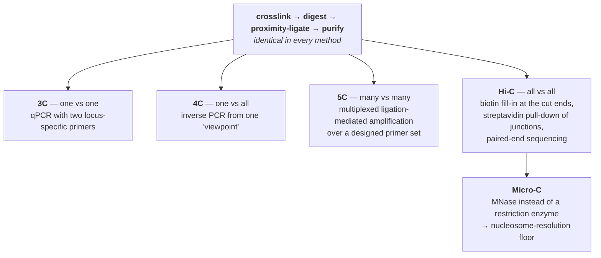

# 50 — The 3D genome

> **Before this:** [Ch 03](../part-01-molecular-foundations/03-genomes-chromosomes-chromatin.md) · [Ch 22](../part-04-gene-regulation/22-eukaryotic-transcriptional-regulation.md) · [Ch 49](49-epigenome-profiling.md) · **Time:** ~55 min

## What you'll be able to do

- Explain why linear genomic distance is the wrong coordinate system for regulation, and state what replaces it
- Derive what a proximity-ligation experiment measures, say what 3C, 4C, 5C, Hi-C and Micro-C each trade against each other, and compute why halving the bin size costs four times the sequencing
- Normalise a contact matrix — matrix balancing and distance-decay expectation — and say why neither step is optional
- Call A/B compartments as the leading eigenvector of a correlation matrix, and say what the sign of that eigenvector does and does not mean
- State the loop-extrusion model precisely enough to predict the outcome of inverting a single CTCF site, and report accurately what acute depletion of cohesin, CTCF, WAPL and NIPBL did to structure *and* to transcription, including the parts that embarrass the textbook story
- Explain why an ensemble contact map is a marginal distribution rather than a structure — reconciling a crisp population TAD boundary with single-cell boundaries scattered across every position, and a bright loop pixel with a loop that exists a few per cent of the time
- Explain enhancer hijacking, and why most boundary disruptions are nevertheless harmless

## The core idea

[Chapter 22](../part-04-gene-regulation/22-eukaryotic-transcriptional-regulation.md) left you with an absurdity. An enhancer can control a gene a megabase away, in either orientation, from either side — and it routinely skips genes that sit closer. One megabase of B-form DNA has a contour length of 340 μm; the nucleus is about 6 μm across. The molecule is not a line in there, so **linear coordinate distance cannot be the variable that regulation responds to.**

The variable that does the work is **contact probability**: how often, across a population of cells and across time, two loci find themselves within touching distance. That number decays with genomic separation — which is why most enhancers sit near their targets — but it is not *determined* by separation. It is shaped, at every scale from the whole chromosome down to the individual nucleosome, by a small number of physical mechanisms. This chapter is about measuring contact probability, about the structure that measurement reveals, and about a persistent gap between what the maps show and what they are usually claimed to prove.

The measurement rests on one trick, and everything else is engineering around it:

> **Freeze the nucleus with a chemical crosslinker, cut the DNA up, then ligate the loose ends under conditions where a fragment is far more likely to be joined to something that was physically beside it than to something chosen at random. Sequence the resulting junctions. A junction between two distant genomic positions is one observation of a contact.**

That gives you counts. Counts over pairs of genomic bins give you a matrix. And here is the reframe that governs the rest of the chapter, because nearly every overstatement in this field is a failure to hold it:

> **A contact map is not a structure.** It is a matrix of pairwise contact *frequencies*, averaged over millions of cells and over the whole crosslinking window. The average has a shape; there is no requirement that any individual cell ever adopts that shape. For one of the four levels of organisation below, no individual cell does.

---

## 1. The ligation trick, and the assay family

The protocol is fixed for the first four steps and differs only in the last:

1. **Crosslink.** Formaldehyde, on living cells, typically 10 minutes. It forms methylene bridges between amine groups on proteins and, less efficiently, between protein and DNA. The bridge itself spans about 2 Å, but crosslinks chain through protein–protein networks, so the effective capture radius is on the order of tens of nanometres and is not precisely known. This is the first thing that makes "contact" a fuzzy word.
2. **Digest.** A restriction enzyme cuts the crosslinked chromatin. A 6-cutter such as HindIII gives ~4 kb fragments; a 4-cutter such as DpnII/MboI gives a few hundred bp. Micro-C replaces the enzyme with MNase, which chews to nucleosomes.
3. **Ligate under dilute conditions**, or — better — **inside the intact nucleus**. Either way the intent is that ligation reports proximity rather than concentration. *In situ* ligation, which keeps nuclei intact rather than lysing them into solution, cut the random-ligation background substantially and is now standard.
4. **Reverse the crosslinks, purify DNA.** You now have a library of chimeric molecules, each carrying a junction between two genomic positions.
5. **Read out the junctions.** *This* is where the methods diverge.



The elegant piece is Hi-C's step 5. Before ligation, the digested overhangs are filled in with nucleotides including a **biotinylated** one. The biotin therefore ends up *inside* the ligation junction and nowhere else. Shear the library, pull down on streptavidin beads, and you have selected for exactly the molecules that carry a chimeric junction — turning "sequence everything and hope" into a targeted assay. Each paired-end read then reports two genomic positions and the strands they came from.

**What a "contact" is not.** It is not a bond, not a stable association, and not a measurement on a single cell. A Hi-C count is the number of times, across millions of nuclei, a particular pair of loci happened to be crosslinkable *and* happened to survive digestion, ligation, pull-down, PCR and alignment. The controls that matter are the ones that estimate how much of your signal is none of that: religation of a fragment to itself (self-circles), unligated dangling ends, and — the big one — random ligation of two fragments that were never near each other, estimated from the trans-chromosomal background or from a spike-in of a foreign genome.

## 2. The contact matrix, and its dominant nuisance

Bin the genome at some size *L* and count junctions per pair of bins. The result is a symmetric, extremely sparse, non-negative integer matrix **C**, indexed by genomic position — for the human genome at 10 kb, 310,000 × 310,000.

The first thing you see, and the only thing you see if you plot the raw matrix, is that contact frequency collapses with genomic separation. Here is a representative decay for balanced counts at 100 kb bins:

| separation *s* | mean contacts | local log–log slope |
|---:|---:|---:|
| 100 kb | 5,000 | — |
| 200 kb | 2,400 | −1.06 |
| 500 kb | 900 | −1.07 |
| 1 Mb | 420 | −1.10 |
| 2 Mb | 190 | −1.14 |
| 5 Mb | 68 | −1.12 |
| 10 Mb | 30 | −1.18 |

A 167-fold range across two decades of separation, and a clean power law, *P*(*s*) ∝ *s*^−1.1. The consequence for analysis is not subtle: **a threefold focal enrichment at 500 kb — 2,700 counts — still produces fewer counts than a completely ordinary pixel at 100 kb, which sits at 5,000 exactly as expected.** Any statistic computed on raw counts — clustering, correlation, "top interactions" — measures the decay and nothing else. It must be divided out before anything downstream is interpretable.

### The polymer physics, briefly

The exponent is informative. An ideal (Gaussian) chain gives *P*(*s*) ∝ *s*^−3/2; the observed ~*s*^−1 over roughly 500 kb–7 Mb was the original evidence for a **fractal ("crumpled") globule** — a dense, knot-free, self-similar packing in which each subchain keeps to its own territory and is therefore both compact and locally easy to unfold. That inference is now known to be at best incomplete: loop extrusion (§5) and compartmentalisation (§4.2) together reproduce the same exponent with no fractal globule anywhere, and a single exponent is weak evidence for a mechanism. What survives is the *shape* of the curve rather than its slope. The log-derivative of *P*(*s*) carries a shoulder whose position and depth are set by the average size of extruded loops and by what fraction of the polymer sits inside one — so fitting that shoulder reads cohesin processivity and density straight off a contact map. That is polymer theory doing predictive work rather than decorative work.

### Matrix balancing

The second nuisance is per-bin **visibility**. Bins differ in restriction-site density, GC content, mappability ([Ch 42](../part-09-genomics/42-read-alignment.md)), copy number, and how well they crosslink. All of these multiply the counts for a bin in every one of its pairings.

The fix is a modelling assumption of exactly one line: **every bin should have the same total contact frequency.** Under that assumption, the observed matrix is

$$C_{ij} = b_i\, b_j\, T_{ij}$$

with **T** the "true" matrix having equal row sums, and you want the diagonal matrix of biases *b*. This is matrix balancing — Sinkhorn–Knopp for a symmetric matrix — and in this field it is called **ICE** (iterative correction and eigenvector decomposition) when solved by iterative proportional fitting, or **KR** when solved by the faster Knight–Ruiz algorithm. The update is one line: divide every row and column by the square root of its current marginal relative to the target, repeat.

The point is that it is *non-parametric*. You do not need to know which bias is mappability and which is GC; you assume all of them factorise into a per-bin scalar and let the marginals sort it out. On a toy 6-bin matrix with one bin at half visibility, the raw marginals are

```
raw row sums     920  1100  1120   660  1000   880     ← bin 4 is obviously sick
after ICE        941   941   941   941   941   941
```

Two honest caveats a statistically literate reader should demand. First, **balancing cannot distinguish technical invisibility from genuine biology.** A bin that really does make fewer contacts — heterochromatin at the lamina, say — will be scaled up, and its distinctive behaviour partly erased. Second, in that toy the terminal bins were also rescaled, because at the edge of a window a bin genuinely has fewer near neighbours; the equal-visibility assumption is only defensible genome-wide, which is why balancing is applied to whole genomes with unmappable and low-coverage bins **masked out first** rather than passed to the solver. A single unmasked pathological bin can distort the whole solution.

### Observed over expected

With balancing done, remove the decay. Estimate the expected value at each separation genome-wide,

$$E_{ij} = \hat{f}(|i-j|), \qquad \text{O/E}_{ij} = C^{\text{bal}}_{ij} \big/ E_{ij}$$

and now a pixel's value means "relative to two loci this far apart, anywhere in the genome". Everything from here on — compartment calling, TAD calling, loop calling — operates on O/E or on a local variant of it. Trans (inter-chromosomal) pairs have no separation, so their expectation is a single genome-wide constant, which is why cis and trans analyses are always done separately.

## 3. Resolution costs the square

The reason 3D genomics is expensive is arithmetic, not biology.

A contact is a *pair*. At bin size *L*, the genome has *N* = 3.1 Gb / *L* bins and the matrix has *N*² cells. Halving *L* doubles *N* and **quadruples** the number of cells among which a fixed number of contacts must be shared. Equivalently, and more usefully: a pixel at a fixed genomic separation covers *L* × *L* base pairs of contact space, so the counts landing in it scale as *L*². **Every halving of bin size costs four times the sequencing.**

Concretely: a loop pixel carrying 180 contacts in a 10 kb map from a 2-billion-contact library carries about 45 at 5 kb, and about 1.8 at 1 kb. To hold the pixel count constant from 10 kb to 1 kb you need 100× the library — hundreds of billions of contacts, which is why whole-genome maps at kilobase resolution exist only for a handful of deeply sequenced cell lines, and even there only in the best-covered regions.

Three escapes from the arithmetic, and all three are in routine use:

| Escape | Mechanism | What you give up |
|---|---|---|
| **Better fragmentation** (Micro-C) | MNase digests to mononucleosomes, so the resolution floor is ~150 bp rather than one restriction fragment. Also improves near-diagonal signal-to-noise dramatically | Nothing structural — but MNase digestion extent is a finicky parameter, exactly as in MNase-seq ([Ch 49](49-epigenome-profiling.md)) |
| **Capture** (Capture-C, promoter capture Hi-C, Micro-Capture-C, Region Capture Micro-C) | Hybridise the library to oligos tiling chosen regions. Restrict to 1% of the genome and every read is spent there | Genome-wide view. You see only what you chose to look at |
| **Protein-directed enrichment** (ChIA-PET, HiChIP, PLAC-seq) | Add an immunoprecipitation step so only contacts involving a chosen protein survive | Contacts not involving that protein, plus all of ChIP's antibody problems ([Ch 49](49-epigenome-profiling.md)) |

Region Capture Micro-C, which stacks the first two, reaches nucleosome resolution over megabase windows and revealed a layer of small, highly nested focal interactions — "microcompartments" — that connect enhancers and promoters and that whole-genome Hi-C at ordinary depth simply cannot see. That is worth holding onto: **several structural claims in this field are claims about the resolution people could afford.**

### The data formats, in one breath

The junctions themselves live in the 4DN **`.pairs`** format — a sorted, tabix-indexable text format that is a close cousin of everything in [Ch 41](../part-09-genomics/41-data-formats.md):

```
## pairs format v1.0
#chromsize: chr7 159345973
#columns: readID chr1 pos1 chr2 pos2 strand1 strand2
r0001  chr7  1002481  chr7  1548903  +  -
r0002  chr7  1119004  chr12 4419551  +  +      ← trans
```

Binned matrices live in **`.cool`/`.mcool`** (HDF5, sparse upper-triangular COO) or **`.hic`**. An `.mcool` is a *resolution pyramid*: the same data stored at 1 kb, 2 kb, 5 kb, 10 kb… so a browser can zoom without recomputing — mipmaps, for a genome.

## 4. Four levels, largest to smallest

| Level | Scale | How it shows up in the matrix | What makes it |
|---|---|---|---|
| **Chromosome territories** | whole chromosomes | cis contacts overwhelmingly exceed trans | polymer confinement + limited mixing after mitosis |
| **A/B compartments** | ~1–10 Mb, alternating | plaid/checkerboard pattern far from the diagonal | affinity between chromatin of like type; self-association |
| **TADs** | ~10² kb | squares of elevated contact along the diagonal | cohesin loop extrusion, bounded by CTCF |
| **Loops** | 10 kb–1 Mb | isolated bright pixels, often at TAD corners | a stalled cohesin bridging two CTCF sites |

These are produced by **different mechanisms**, which is the single most useful thing to know about them, and §6 is where that pays off.

### 4.1 Chromosome territories

Each chromosome occupies a limited, roughly contiguous sub-volume of the interphase nucleus rather than threading through the whole thing. Hi-C shows this as an enormous cis/trans asymmetry. Painting whole chromosomes by FISH shows it directly, and it was proposed on cytological grounds a century before either.

Positioning is non-random and correlates with content rather than size: gene-rich chromosome 19 sits toward the nuclear interior, gene-poor chromosome 18 — nearly the same size — toward the periphery. That is your first hint that the organising variable is activity, not sequence length.

### 4.2 A/B compartments — a PCA, in the sense of [S7](../part-S-statistics/S7-high-dimensional-data.md)

Far from the diagonal, the O/E matrix is not smooth. It is **plaid**: locus *i* contacts some distant loci far more than others, and the pattern is consistent — the set of loci that *i* prefers is the same set that *j* prefers, for every *j* in the same class. That is a rank-one structure hiding in a matrix, and there is one obvious tool.

The procedure is exactly what you would do:

1. Take the O/E matrix for one chromosome (better, one arm — the centromere otherwise dominates the first component).
2. Compute the **Pearson correlation matrix** between rows. Row *i* is bin *i*'s whole contact profile; correlating rows asks "do these two bins have the same contact preferences?"
3. Take the leading eigenvector. It is bimodal, and its sign partitions the chromosome into two interleaved sets.

Call them **A** and **B**. A is gene-rich, expressed, accessible, DNase-sensitive, H3K27ac-marked and early-replicating; B is gene-poor, repressed, H3K9me2/3-marked, late-replicating ([Ch 04](../part-01-molecular-foundations/04-dna-replication.md)), and physically associated with the nuclear lamina (lamina-associated domains) or the nucleolar periphery. Roughly half the genome each. Across chromosomes, A contacts A and B contacts B — compartmentalisation is a global preference, not a local one.

Two things the reader should be alert to, because both are routinely botched:

- **The sign of an eigenvector is arbitrary.** Nothing in the linear algebra says positive means active. You must orient it against an external track — GC content or gene density is standard — per chromosome, per sample. Skipping this silently inverts A and B for some chromosomes and not others, which is the most common error in compartment analysis.
- **PC1 is not always the compartment.** On acrocentric chromosomes, on chromosomes with large heterochromatic blocks, and in aneuploid cancer genomes, the leading component often captures the arm split or a copy-number step, and the compartment signal is in PC2. Look at what the component correlates with rather than assuming.

At higher depth, A and B each resolve into subcompartments (A1, A2, B1–B4) with distinct histone-mark and replication-timing signatures — B1 tracks Polycomb domains, B2/B3 track lamina and nucleolar association. The two-state view is a resolution artefact, not a fact about chromatin.

### 4.3 TADs

Near the diagonal the map breaks into squares: contiguous regions of a few hundred kilobases within which contacts are elevated and across whose edges they drop. These are **topologically associating domains**.

Detection is a one-dimensional change-point problem. The **insulation score** slides a square window along the diagonal and sums the contacts crossing the window's centre; boundaries are local minima. The **directionality index** asks, per bin, whether its contacts are biased upstream or downstream, and a boundary is where the bias flips sign. Both work; both have a window-size parameter; and callers disagree substantially about how many TADs there are and where they end. Published median sizes across the founding studies span from under 200 kb to nearly 1 Mb, almost entirely because of resolution and caller choice. **Treat a TAD boundary as an estimate with a confidence interval, not as a coordinate.**

What is robust: boundaries are strongly enriched for CTCF binding, for cohesin, for housekeeping gene promoters and for tRNA genes; and TAD organisation is substantially conserved between cell types and between mouse and human, far more so than the enhancer landscape inside the domains.

### 4.4 Loops

At sufficient resolution, individual bright pixels appear — a pair of loci contacting each other far more than either contacts the sequence between them. In deeply sequenced human cells there are on the order of ten thousand. They sit preferentially at the *corners* of TADs, which is the geometric signature of a domain held shut at both ends. And the anchors carry CTCF: in roughly 90% of loops where both anchors have a single unambiguous CTCF motif, **the two motifs point toward one another.**

That convergence rule is the observation the next section exists to explain, and it is a strange one. A binding site is a sequence; a protein binding it has no obvious reason to care which way the other copy 500 kb away is facing.

Calling loops is a local-enrichment test, and the local part is what matters. Naive O/E flags the corner of every TAD, because everything inside a TAD is elevated. The standard fix (HiCCUPS) compares each pixel to a **donut** of surrounding pixels — plus separate horizontal, vertical and lower-left neighbourhoods — and requires the pixel to beat all of them. It is peak calling with a local background, structurally identical to the ChIP-seq local-λ argument in [Ch 49](49-epigenome-profiling.md), and for the same reason: a uniform null is a null that does not exist.

## 5. Loop extrusion

The mechanism that explains TADs, loops and the convergence rule at once.

**Cohesin** is a ring-shaped SMC complex (SMC1, SMC3, RAD21, and a STAG/SA subunit) with ATPase activity. Loaded onto chromatin by **NIPBL** and removed by **WAPL**, it engages the fibre and reels it through, progressively enlarging a loop:

```
 t0   ═══════════════════════════════════════      cohesin loads (NIPBL)
 t1   ══════════════(◦)══════════════════════      small loop
 t2   ═══════════(     ◦     )═══════════════      grows, ~1 kb/s in vitro
 t3   ══════(               ◦              )═      until blocked, or WAPL
                                                    unloads it and it collapses
```

This was proposed on theoretical grounds long before it was seen, then confirmed directly: single-molecule imaging of DNA in a flow cell shows condensin, and then cohesin in the presence of NIPBL, physically pulling loops at of order a kilobase per second. Polymer simulations in which extruders load, translocate, stall at oriented barriers and unload reproduce real Hi-C maps — TAD squares, corner peaks, the *P*(*s*) shoulder — with a handful of parameters.

A back-of-envelope check that the model is even the right size: extrusion at ~1 kb/s, with cohesin resident on chromatin for order 10–20 minutes before WAPL removes it, gives loops of order 10⁵–10⁶ bp. That is the observed TAD scale. The agreement is order-of-magnitude and in-vivo rates are probably slower, but a mechanism that came out a hundredfold wrong would be dead on arrival.

### Why orientation matters

**CTCF** is an 11-zinc-finger protein whose fingers read an asymmetric ~19 bp motif — so a bound CTCF molecule has a *direction* on the DNA. Blocking cohesin is not the job of the zinc fingers; it is the job of CTCF's **N-terminal region**, which contacts the SA–RAD21 interface of the cohesin complex. Because the zinc fingers fix the protein's orientation, the N-terminus faces one way along the chromosome. Cohesin arriving from that side meets the blocking surface and stalls; cohesin arriving from the other side meets the far end of the protein and passes.

Everything follows:

```
 convergent  ──▶CTCF ══════════════════ CTCF◀──     both block → stable loop,
                    └── cohesin stalls ──┘           a corner peak in Hi-C

 divergent   ◀──CTCF ══════════════════ CTCF──▶     neither blocks → no loop

 tandem      ──▶CTCF ══════════════════ CTCF──▶     one blocks, one does not
```

### The experiment that made it causal

Correlations between motif orientation and loop identity are suggestive. What settles it is editing. Using CRISPR ([Ch 38](../part-08-methods/38-genome-editing.md)) to **invert a single CTCF site in place** — same sequence, same position, same binding affinity, opposite direction — flips which partner it loops to. The site stops anchoring the loop it used to anchor and starts anchoring a loop in the other direction, and the transcription of genes in the rearranged domain changes with it. Nothing about the site changed except a direction, which is only meaningful to a machine that arrives with a direction of travel. That is as close to a mechanistic proof as chromosome biology gets.

### The two knobs

| Perturbation | Effect on cohesin | Effect on the map |
|---|---|---|
| **NIPBL** loss | no loading | extrusion stops. TADs and loops vanish |
| **WAPL** loss | no unloading; residence time grows | loops get **longer**, extend past normal boundaries, and cohesin accumulates on an axial core ("vermicelli" chromosomes). Compartmentalisation *weakens* |
| **CTCF** loss | extrusion continues, unimpeded | boundaries and corner peaks vanish; extrusion itself does not |
| **RAD21** (cohesin) loss | no extrusion | TADs and loops vanish |

The WAPL row is the one worth pausing on. More extrusion **weakens** compartments. Extrusion is a mixing process: it drags chromatin through loops and prevents like-with-like segregation from reaching equilibrium. Extrusion and compartmentalisation are not two levels of one hierarchy — they are two mechanisms in **competition**.

## 6. What acute depletion actually showed

The experiments that define the modern view all use **degron** systems: tag the endogenous protein so that adding a small molecule destroys the existing pool within tens of minutes. This matters enormously. A conventional knockout gives cells days to compensate, to change identity, or to be selected; by the time you assay it, you are measuring adaptation. A degron gives you hours, and hours is faster than the transcriptome can reorganise itself.

Run the panel, and this is the result:

| Depleted | Loops | TADs / insulation | A/B compartments | Genome-wide transcription |
|---|---|---|---|---|
| **RAD21** (cohesin) | eliminated | eliminated | **preserved, and often finer** | a few hundred genes change substantially |
| **CTCF** | CTCF-anchored loops lost | insulation lost at most boundaries; a minority (<20%) persist | preserved | a few hundred genes change |
| **NIPBL** | eliminated | eliminated | **strengthened**, with finer structure | modest |
| **WAPL** | lengthened, boundaries overrun | blurred | **weakened** | modest |

Read the last two columns again, because between them they demolish two comfortable beliefs.

**Compartments are not made by cohesin or CTCF.** Remove the extrusion machinery entirely and the plaid pattern does not merely survive — it sharpens, because the mixing that was blurring it has stopped. Compartments must arise from a separate mechanism: affinity between chromatin regions of like state, mediated by the proteins that read those states. That is a segregation process, not a motor process.

**And TADs are not the switch that sets gene expression.** Dissolving every TAD and every loop in the genome, acutely, changes a few hundred genes — a low single-digit percentage — and does *not* produce widespread ectopic activation of genes across the boundaries that just disappeared. On washout, loops re-form within about an hour and the cells carry on. This is the finding that reviews and talks most consistently soften, and you should not soften it:

> **Acute, complete loss of TADs and loops has a surprisingly modest effect on steady-state transcription.** Any claim of the form "TADs control gene expression" has to be reconciled with that, and most are not.

What the honest reading looks like:

- **Constraint, not instruction.** Loop extrusion determines which contacts are *possible*. It does not choose which enhancer drives which promoter within the space it leaves. A gene whose enhancers are already nearby and already correct loses nothing when the scaffolding goes.
- **The affected minority is not random.** Genes that depend on *long-range* enhancers are hit hardest; genes with proximal regulation are barely touched. If contact must be created across a large separation, extrusion is how it is created.
- **Inducible responses are far more cohesin-dependent than steady states.** Cells acutely depleted of cohesin maintain their existing programme but fail to mount rapid transcriptional responses to stimulus. A steady-state RNA-seq snapshot is close to the least sensitive assay you could have chosen.
- **"Modest" is measured in hours.** Over days, loss of CTCF or cohesin is catastrophic — cells cannot differentiate, cannot maintain identity, and die. The architecture matters on developmental timescales even where it barely registers on transcriptional ones.
- **Bulk RNA-seq hides kinetics.** Enhancers set transcriptional burst *frequency* ([Ch 22](../part-04-gene-regulation/22-eukaryotic-transcriptional-regulation.md)); a change in cell-to-cell variability with an unchanged mean is invisible to a bulk mean ([Ch 48](48-single-cell-and-spatial.md)).
- **Degrons leak.** Residual protein at a few percent of normal is enough to do a lot of work, and negative results are correspondingly weaker than positive ones.

## 7. Single cells: the average is nobody's structure

A single-cell Hi-C library recovers, at best, of order 10⁴–10⁵ contacts from one nucleus — against ~10⁹ possible bin pairs at any useful resolution. The matrix is essentially all zeros. You cannot compute an insulation profile from it. What you can do is ask whether the *ensemble* features are present in individuals, and the answers are not the same for each level:

| Feature | In a single cell? |
|---|---|
| Chromosome territories | yes, obviously |
| A/B compartments | yes — the plaid is visible per cell, and per-cell compartment identity matches the ensemble |
| **TADs** | **there are domain-like blocks, but their boundaries sit at different places in every cell** |
| Loops | present a small fraction of the time; mostly absent |

The third row is the important one, and imaging nails it more cleanly than ligation does. Super-resolution chromatin tracing — label consecutive 30 kb segments with Oligopaint probes and read them out one at a time, recovering the actual 3D coordinates of a chromosome region in thousands of individual cells — shows globular domains with sharp boundaries in single cells, but with the boundary occurring at essentially every genomic position with non-zero probability, merely *preferentially* at CTCF/cohesin sites. Deplete cohesin and the single-cell domains do not go away; what goes away is the preference for particular boundary positions. Averaging over cells with a shared preferred boundary produces a crisp population TAD; averaging over cells with random boundaries produces a smooth gradient. **The ensemble TAD is a statement about the distribution of boundary positions, not about a box.**

Live imaging closes the argument for loops. Tag both anchors of a well-characterised mouse TAD, watch them in living cells, and infer the looped state: the fully CTCF–CTCF looped configuration exists roughly **3–6.5% of the time**, with a median lifetime of order **10–30 minutes**. About 92% of the time there is a partially extruded loop that does not bridge both boundaries. A structure drawn as a persistent circle in every textbook figure is, in any given cell at any given moment, almost certainly not there.

None of this makes the ensemble map wrong. It makes it a *marginal distribution*, and the mistake is the one a statistician would name instantly: reading the mean of a mixture as a description of its components.

## 8. Enhancer–promoter communication: what is actually settled

Everything above is architecture. The reason anyone funds it is the question in [Ch 22](../part-04-gene-regulation/22-eukaryotic-transcriptional-regulation.md): how does a distal enhancer reach its promoter, and does it have to touch it?

What is agreed:

- Enhancers and their targets are **overwhelmingly in the same TAD**. Cross-boundary regulation is rare enough that "same TAD" is the single most useful prior when assigning a non-coding variant to a gene ([Ch 52](../part-11-human-and-statistical-genomics/52-association-to-mechanism.md)).
- Contact frequency between an enhancer and a promoter **predicts** regulatory effect, well enough that contact-times-activity models substantially outperform nearest-gene assignment.
- **Extrusion helps.** Genes with long-range enhancers are the ones that suffer when cohesin goes.

What is contested, actively and in print:

- **Whether a stable loop is required at all.** Live imaging of enhancer–promoter pairs has repeatedly found weak or absent instantaneous correlation between physical proximity and transcriptional output. Some loci show clear proximity-then-transcription ordering; others show none.
- **Whether contact causes transcription or transcription causes contact.** Active loci cluster; clustering is also what you would see if shared machinery recruited them together.
- **Whether the right object is a pairwise loop at all.** Ligation-free methods that read out *multi-way* associations — split-pool barcoding of crosslinked complexes, or sequencing thin cryosections and inferring co-segregation — see hubs of several elements rather than dyads, and Region Capture Micro-C's nested microcompartments look more like small coalescing clusters than like discrete loops.

The reconciliation currently gaining ground is **time-gating**: extrusion produces encounters that are individually rare but, when they happen, unusually long-lived, and only long-lived encounters are productive. In that model the relationship between contact frequency and transcription is deliberately non-linear, and a short-window imaging correlation between distance and output can be near zero while contact remains causally necessary. It is a good model. It is not yet the settled answer.

The honest statement for 2026: **contact is a strong predictor and a plausible cause; the requirement for a stable, persistent enhancer–promoter loop is not established, and the field's own imaging data argue against the picture in most figures.**

## 9. Broken boundaries: hijacking, disease, and why most disruptions are harmless

If a boundary constrains which enhancers can reach which promoters, deleting one should let an enhancer reach a gene it was never meant to touch. It does, and the consequences can be severe.

**The classic case is limb malformation.** Around human *EPHA4* sits a TAD containing limb enhancers. Structural variants — deletions, inversions and duplications — that remove the domain boundary put those enhancers in contact with neighbouring genes they normally cannot reach: *PAX3*, *WNT6*, *IHH*. Which gene gets captured determines which malformation results, and the same enhancer set produces brachydactyly (*PAX3*), F-syndrome (*WNT6*) or polydactyly (*IHH*) depending on the receiver. No coding sequence is altered in any of them. Duplications can go further and build a **neo-TAD** — a new self-contained domain, complete with its own boundaries, that packages an enhancer together with a gene that has no business being regulated by it, as in duplications at the *SOX9*/*KCNJ2* locus.

**Cancer supplies the somatic version**, and three flavours are worth distinguishing because they break the same thing in three different ways:

| Mechanism | Example | What breaks |
|---|---|---|
| Structural variant relocates an enhancer | inv(3)/t(3;3) acute myeloid leukaemia moves a *GATA2* enhancer next to *MECOM* — activating the oncogene while leaving *GATA2* haploinsufficient, two hits from one rearrangement | genome sequence |
| Structural variant deletes a boundary | boundary deletions in T-cell leukaemia releasing enhancers onto *TAL1*/*LMO2*; medulloblastoma rearrangements driving *GFI1*/*GFI1B* | genome sequence |
| **Epigenetic** boundary loss | IDH-mutant glioma: the oncometabolite blocks TET enzymes, CpG methylation accumulates, **CTCF cannot bind methylated sites**, insulation fails, and a constitutive enhancer activates *PDGFRA* | boundary function, with sequence intact |

That last row deserves attention. CTCF binding is methylation-sensitive, so a boundary can be destroyed by DNA methylation alone ([Ch 23](../part-04-gene-regulation/23-chromatin-and-epigenetics.md)) — invisible to any sequencing assay that looks only at sequence.

### The correction that keeps this honest

Read those cases and you will conclude that TAD boundaries are load-bearing everywhere. They are not.

Deliberate deletions of the CTCF sites at the boundaries of well-studied domains — including around *Shh* and *Sox9* — frequently produce **no detectable change** in the expression of the genes inside. *Drosophila* balancer chromosomes, which shatter domain organisation at scale across the genome, produce far less misexpression than the disease cases would predict. And structural variants that delete annotated TAD boundaries are found, in numbers, in apparently healthy people in population variant databases.

The synthesis: boundary disruption is **necessary but nowhere near sufficient**. A pathogenic hijacking event needs all of — a boundary broken, a strong enhancer with the right tissue specificity on one side, a dosage-sensitive gene capable of causing a phenotype on the other, and a developmental window in which both are active. Remove any one and nothing happens.

The clinical consequence is direct and uncomfortable ([Ch 54](../part-11-human-and-statistical-genomics/54-rare-variants-and-mendelian-disease.md), [Ch 55](../part-11-human-and-statistical-genomics/55-clinical-variant-interpretation.md)): a non-coding structural variant that disrupts a TAD boundary is a *hypothesis*, not a diagnosis. Prioritise it if a dosage-sensitive disease gene and a matching tissue-specific enhancer land in the same new neighbourhood; otherwise it belongs with the rest of the variants of uncertain significance.

## 10. Phase separation, with the caution it requires

Compartments are a segregation phenomenon, and segregation of like-with-like in a polymer solution is the kind of thing physics has a name for. The proposal is that chromatin of a given state self-associates through the multivalent proteins that read it — HP1 on H3K9me3 heterochromatin, Polycomb complexes on H3K27me3 — and that this produces **microphase separation**: domains that coalesce but cannot grow without bound, because they are tethered along a single polymer.

The evidence is real and the enthusiasm has run ahead of it. HP1 and several Polycomb components form liquid-like droplets in vitro; nuclear bodies round up, fuse and recover after photobleaching. But:

- Behaving like a liquid in a test tube at micromolar concentration does not establish that the same protein forms a liquid phase in a nucleus at its endogenous concentration and valency.
- The standard in-cell test — dissolving foci with 1,6-hexanediol — is notoriously non-specific; it perturbs the cytoskeleton, chromatin and kinase activity along with any condensate.
- The main alternative, **polymer–polymer phase separation** (bridging proteins crosslinking chromatin into a network), predicts many of the same images without a liquid phase at all, and distinguishing the two requires measurements — of the dilute-phase concentration, of exchange kinetics, of whether a threshold concentration exists — that most papers do not make.
- Foci selected for being visible are the tail of a size distribution, which biases every microscopy-based estimate in the same direction.

Where this leaves you is the position [Ch 22](../part-04-gene-regulation/22-eukaryotic-transcriptional-regulation.md) took on transcriptional condensates: **"phase separation" is a hypothesis about a mechanism, not an observation, and it is currently doing more explanatory work than its evidence supports.** That does not make it wrong. Compartments plainly *are* produced by some affinity-driven segregation, and it plainly is not extrusion. Whether the right physical description involves a genuine liquid phase is open.

## 11. Beyond Hi-C: what else measures the same thing

| Method | Family | What it adds | What it costs |
|---|---|---|---|
| **ChIA-PET** | ligation + ChIP | contacts anchored on a chosen protein (CTCF, Pol II) | inefficient; large input; antibody-limited |
| **HiChIP / PLAC-seq** | in situ contacts, then IP | the same, at a fraction of the cells and reads | the enrichment is a filter — absence of a contact means absence *for that protein* |
| **Capture-C / promoter capture Hi-C / Micro-Capture-C** | oligo capture | very deep coverage of chosen viewpoints; MCC reaches base-pair precision at the viewpoint | you must choose the viewpoints in advance |
| **Region Capture Micro-C** | capture + MNase | the deepest maps yet, nucleosome resolution over Mb windows; revealed nested microcompartments | one region at a time |
| **SPRITE, ChIA-Drop** | **ligation-free**, split-pool or droplet barcoding | **multi-way** contacts — hubs of many loci at once, which ligation can never report | lower resolution; complex analysis |
| **GAM** | **ligation-free**, sequencing thin nuclear cryosections | co-segregation as a proximity estimate; works on tissue; no ligation bias at all | indirect; statistically demanding |
| **Oligopaint / chromatin tracing / ORCA / DNA seqFISH+** | **imaging** | actual 3D coordinates in nanometres, per cell, with nuclear-landmark context | tens to thousands of loci, not the genome; low throughput |
| **Live imaging** (CRISPR-tagged or ANCHOR arrays) | **imaging, in time** | dynamics — lifetimes, rates, and whether contact precedes transcription | two or three loci at a time |

The last three rows are not competitors to Hi-C; they are the only way to check it. Ligation methods report a **frequency of pairwise crosslinkable proximity in a population**. Imaging reports a **distance distribution in single cells**, in physical units, with no ligation step to bias it. Where they disagree — and they do, notably on how sharply defined a TAD is — the disagreement is informative, because the two methods fail in unrelated ways. Every major correction to the field's picture in the last decade (single-cell boundary variability, loop rarity, the decoupling of contact from transcription) came from imaging checking ligation.

---

## Common misconceptions

| What people think | What's actually true |
|---|---|
| A Hi-C map shows the 3D structure of the genome | It is a matrix of pairwise contact frequencies averaged over millions of cells. It has no phase information and no third dimension. The average shape need not exist in any cell |
| A TAD is a physical box that chromatin sits inside | Single-cell tracing finds domain-like blocks whose boundaries fall at different genomic positions in every cell. The population TAD is a *preference* for certain boundary positions, and cohesin loss removes the preference, not the domains |
| A loop is a persistent structure | At a well-measured mammalian TAD the fully looped state exists ~3–6.5% of the time with a lifetime of ~10–30 min. Most of the time there is a partial loop and no bridge |
| TADs control gene expression | Acute, complete removal of every TAD and loop changes a low single-digit percentage of genes and causes no widespread ectopic activation. Architecture constrains which contacts are possible; it does not choose targets |
| Cohesin and CTCF build the compartments | Compartments **persist and sharpen** when either is destroyed. They come from affinity-driven segregation; extrusion actively mixes and *antagonises* them. Different levels, different mechanisms |
| More cohesin activity means more structure | WAPL loss extends cohesin residence, lengthens loops — and *weakens* compartmentalisation, because extrusion mixes what segregation is trying to separate |
| Deleting a TAD boundary causes disease | Most boundary deletions do nothing, including engineered ones at famous loci, and healthy people carry them. Pathogenicity needs a boundary break *plus* a strong tissue-matched enhancer *plus* a dosage-sensitive receiver gene |
| Sequencing twice as deep doubles the resolution | Counts in a pixel scale with the square of the bin size. Halving bin size costs 4× the reads; going from 10 kb to 1 kb costs 100× |
| Raw contact counts can be compared across the matrix | Contact probability falls ~167-fold from 100 kb to 10 Mb. Without balancing and an observed/expected step, every statistic you compute measures the distance decay |
| PC1 of the correlation matrix is the A compartment, with positive = active | The sign of an eigenvector is arbitrary and must be oriented against gene density or GC per chromosome. And PC1 often captures the arm split or a copy-number step instead — check what it correlates with |

## Worked example: one locus, three scales

A single region, analysed the way you actually would: coarse first, then finer, then a formal test — and finally the arithmetic that says how far down you can afford to go. All coordinates GRCh38.

### Stage 1 — 1 Mb bins: which compartment?

Eight bins spanning chr7:1,000,000–9,000,000, after balancing and observed/expected:

```
        b1    b2    b3    b4    b5    b6    b7    b8
 b1   1.00  1.40  1.36  0.66  0.51  0.63  1.42  1.34
 b2   1.40  1.00  1.45  0.50  0.60  0.51  1.34  1.43
 b3   1.36  1.45  1.00  0.70  0.52  0.55  1.48  1.57
 b4   0.66  0.50  0.70  1.00  1.47  1.42  0.74  0.50
 b5   0.51  0.60  0.52  1.47  1.00  1.54  0.57  0.53
 b6   0.63  0.51  0.55  1.42  1.54  1.00  0.52  0.57
 b7   1.42  1.34  1.48  0.74  0.57  0.52  1.00  1.53
 b8   1.34  1.43  1.57  0.50  0.53  0.57  1.53  1.00
```

The plaid is visible by eye here, which it never is at genome scale. Correlate the rows — row *i* is bin *i*'s full contact profile, so `corr(row_i, row_j)` asks whether two bins have the same preferences:

```
        b1    b2    b3    b4    b5    b6    b7    b8
 b1   1.00  0.84  0.88 -0.89 -0.82 -0.92  0.82  0.89
 b2   0.84  1.00  0.82 -0.80 -0.92 -0.85  0.89  0.85
 b3   0.88  0.82  1.00 -0.92 -0.82 -0.85  0.82  0.76
 b4  -0.89 -0.80 -0.92  1.00  0.78  0.82 -0.92 -0.78
 b5  -0.82 -0.92 -0.82  0.78  1.00  0.77 -0.86 -0.86
 b6  -0.92 -0.85 -0.85  0.82  0.77  1.00 -0.81 -0.89
 b7   0.82  0.89  0.82 -0.92 -0.86 -0.81  1.00  0.77
 b8   0.89  0.85  0.76 -0.78 -0.86 -0.89  0.77  1.00
```

Leading eigenvector (eigenvalue 6.90, **86.3%** of the variance — a genuinely rank-one structure):

```
 PC1   +0.362  +0.357  +0.352  -0.354  -0.349  -0.353  +0.353  +0.348
 bin      b1      b2      b3      b4      b5      b6      b7      b8
```

Two clean sets: {b1, b2, b3, b7, b8} and {b4, b5, b6}. **Now orient the sign.** Suppose gene density is 14, 11, 17, 2, 1, 3, 12, 15 genes/Mb. Correlate that with PC1: it is strongly positive, so positive PC1 is **A** and b4–b6 are **B**. Had the eigensolver returned the negated vector — equally valid linear algebra — and had you skipped this step, you would have labelled a gene desert as active euchromatin and never seen an error.

### Stage 2 — 100 kb bins: remove the decay before looking

Zoom to chr7:1,000,000–1,600,000. Using the genome-wide decay table from §2, the expected balanced count at 500 kb separation is **900** at 100 kb bins. The pixel joining bin 1 to bin 6 carries **2,700**.

```
 O/E = 2700 / 900 = 3.0
```

Threefold. Note what would have happened without the O/E step: the pixels one bin off the diagonal, at 100 kb separation, carry about **5,000** counts each — nearly twice the loop pixel — while sitting at exactly their expectation and meaning nothing. Ranked on raw counts, the loop is unremarkable and the diagonal wins everything. **This is why the normalisation is not tidiness.**

### Stage 3 — 10 kb bins: is it a loop?

Re-bin at 10 kb and take the 5 × 5 patch of balanced counts centred on the candidate pixel (separation 500 kb = 50 bins):

```
    24   26   27   25   24
    25   31   33   30   25
    27   35  [180]  36   26          ← candidate pixel
    25   31   34   30   25
    23   25   26   25   22
```

The genome-wide expectation at 500 kb, at 10 kb bins, is **9.0** — the 100 kb pixel of Stage 2 is exactly the sum of 100 of these, and 900/100 = 9.0. (It varies by ±2 bins = ±20 kb across the patch, a ~4% change in expectation — negligible here, and the reason a real caller uses the per-pixel expectation.)

**Naive O/E:** 180 / 9.0 = **20**.

**Donut background.** Take the 16 pixels of the outer ring, excluding the inner 3 × 3:

```
 Σ observed (16 px) = 126 + 121 + 77 + 76 = 400        mean 25.0
 Σ expected (16 px) = 16 × 9.0            = 144
 local enrichment ratio                   = 400/144 = 2.778
 λ_donut = 9.0 × 2.778 = 25.0
```

**Enrichment over local background** = 180 / 25.0 = **7.2**, and a Poisson tail test gives

```
 P(X ≥ 180 | λ = 25.0) ≈ 10^-88.5
```

At 10 kb bins there are ~310,000 bins and, restricting to pairs within 2 Mb of the diagonal, ~6.2 × 10⁷ candidate pixels. A Bonferroni threshold is therefore ~8 × 10⁻¹⁰. The pixel clears it by seventy-nine orders of magnitude. **It is a loop.**

**Now the pixel the donut saves you from.** A second candidate elsewhere carries 120 counts against the same expectation of 9.0 — naive O/E = **13.3**, which looks convincing. But it sits at a TAD corner, and its donut mean is 100:

```
 enrichment over local background = 120 / 100 = 1.2
 P(X ≥ 120 | λ = 100) = 0.028
```

Against 6.2 × 10⁷ tests, 0.028 is nothing at all. The elevation is the TAD, not a loop, and only the local background distinguishes them. This is the same lesson as ChIP-seq's local λ ([Ch 49](49-epigenome-profiling.md)) in different clothes: **the enemy is never the genome-wide null, it is the locally structured background.**

### Stage 4 — why you stop at 10 kb

Suppose that map came from a 2-billion-contact library. Counts in a fixed-separation pixel scale as *L*²:

| bin size | relative pixel counts | contacts needed for the same 180 |
|---:|---:|---:|
| 10 kb | 1 | 2 × 10⁹ |
| 5 kb | 1/4 | 8 × 10⁹ |
| 2 kb | 1/25 | 5 × 10¹⁰ |
| 1 kb | 1/100 | 2 × 10¹¹ |

Two hundred billion contacts for a whole-genome 1 kb map is not a budget decision, it is a different research programme. The alternative is to stop asking for the whole genome: capture the 5 Mb you care about — 0.16% of it — and the same 2 billion contacts are concentrated there instead of spread across everything. That is the entire argument for Capture-C and Region Capture Micro-C, and it is why the finest structures known — nested microcompartments linking individual enhancers to individual promoters — were found in captured regions rather than in genome-wide maps.

## Connections

- **Back to:** [Ch 03](../part-01-molecular-foundations/03-genomes-chromosomes-chromatin.md) — nucleosomes, chromatin hierarchy, and the first mention of extrusion · [Ch 04](../part-01-molecular-foundations/04-dna-replication.md) — replication timing, which is essentially the A/B compartment read a second way · [Ch 09](../part-02-transmission-genetics/09-mitosis-and-meiosis.md) — condensin doing the mitotic version of §5 · [Ch 20](../part-03-genome-instability/20-chromosome-abnormalities.md) — the structural variants that break boundaries in §9 · [Ch 22](../part-04-gene-regulation/22-eukaryotic-transcriptional-regulation.md) — the megabase-enhancer puzzle this chapter answers, and the condensate caution it shares · [Ch 23](../part-04-gene-regulation/23-chromatin-and-epigenetics.md) — CTCF's methylation sensitivity, which §9 turns into an oncogenic mechanism · [Ch 25](../part-04-gene-regulation/25-networks-and-development.md) — Hox colinearity as a chromatin domain opening from one end · [Ch 41](../part-09-genomics/41-data-formats.md) — `.pairs`, indexing, and the coordinate conventions every contact matrix inherits · [Ch 49](49-epigenome-profiling.md) — the local-background peak-calling logic reused wholesale in §4.4
- **Forward to:** [Ch 43](../part-09-genomics/43-genome-assembly.md) — Hi-C as a scaffolding signal, which is this measurement used for a completely different purpose · [Ch 48](48-single-cell-and-spatial.md) — single-cell contact maps and the sparsity problem they share with every single-cell assay · [Ch 52](../part-11-human-and-statistical-genomics/52-association-to-mechanism.md) — contact maps as the evidence that assigns a GWAS variant to a gene · [Ch 54](../part-11-human-and-statistical-genomics/54-rare-variants-and-mendelian-disease.md) and [Ch 55](../part-11-human-and-statistical-genomics/55-clinical-variant-interpretation.md) — how a boundary-disrupting structural variant is actually weighed · [Ch 56](../part-11-human-and-statistical-genomics/56-cancer-genomics.md) — enhancer hijacking and insulator loss as oncogenic mechanisms

## Check yourself

**1. You cluster the rows of a raw Hi-C matrix and get beautiful, highly significant clusters that turn out to correspond to position along the chromosome. What did you measure?**

<details><summary>Answer</summary>

The distance decay, and nothing else. Contact frequency falls roughly as *s*^−1.1 — about 167-fold between 100 kb and 10 Mb — so a bin's raw contact profile is dominated by *where it is*: bins near each other share near neighbours and therefore have similar profiles. Any similarity metric on raw counts recovers the diagonal.

Two corrections are needed before the matrix means anything. **Matrix balancing** (ICE or KR) removes per-bin visibility differences by forcing equal marginals — the assumption being that every bin should make the same total number of contacts. **Observed/expected** divides each pixel by the genome-wide mean at its separation, so a value means "relative to typical loci this far apart". Compartment calling then correlates *O/E* rows, not raw rows, and the leading eigenvector separates A from B rather than left from right.

</details>

**2. Acute degron depletion of cohesin removes every TAD and every loop in the genome, yet only a few hundred genes change expression and compartments get sharper. State exactly what this does and does not license you to conclude.**

<details><summary>Answer</summary>

**It licenses:** that cohesin-driven loop extrusion is what makes TADs and loops, and that it is *not* what makes compartments — compartments must arise from a separate affinity-driven segregation of like chromatin, and extrusion actively opposes it by mixing (which is why WAPL loss, which lengthens loops, *weakens* compartments). It also licenses the conclusion that steady-state transcription of most genes does not require TAD architecture: dissolving every boundary does not cause widespread ectopic activation.

**It does not license** "TADs don't matter". The affected minority is precisely the genes that depend on long-range enhancers, which is what the model predicts. Inducible responses are far more cohesin-dependent than steady states, so a resting-state RNA-seq snapshot is close to the least sensitive readout available. "Acute" means hours; over days, loss of cohesin or CTCF is lethal to cell identity and differentiation. Bulk RNA-seq cannot see changes in burst kinetics or in cell-to-cell variance at constant mean. And degrons leave residual protein.

The defensible summary: architecture is a **constraint on which contacts are possible**, not an instruction about which enhancer drives which gene.

</details>

**3. You invert a single CTCF site — same sequence, same position, same affinity, opposite orientation. Predict the result, and explain why orientation can matter at all to a protein bound at one spot.**

<details><summary>Answer</summary>

The site stops anchoring the loop it used to anchor and begins anchoring a loop in the opposite direction, to whatever convergently-oriented site it now faces. The domain structure around it rearranges, and genes whose enhancer access changes shift expression.

Orientation matters because the blocking element is not the DNA-binding surface. CTCF's zinc fingers read an asymmetric motif and therefore fix the protein's direction on the fibre; the **N-terminal region** — which faces one way as a consequence — is what contacts the SA–RAD21 interface of cohesin and halts extrusion. Cohesin arriving from the side the N-terminus faces stalls; cohesin arriving from the other side passes. Direction is only meaningful to a machine that arrives with a direction of travel, which is exactly what a loop extruder is. This is why ~90% of loops with unambiguous anchor motifs have those motifs pointing at each other, and why the inversion experiment is treated as the causal proof of the model.

</details>

**4. Ensemble Hi-C shows a crisp TAD boundary. Single-cell chromatin tracing at the same locus shows domain boundaries scattered across every position, only *preferentially* at that site. Reconcile these, and say what cohesin depletion does to each measurement.**

<details><summary>Answer</summary>

They are consistent, and the reconciliation is a statement about a mixture. Each cell has a globular domain with a sharp boundary somewhere; the boundary's genomic position is a random variable whose distribution is peaked at CTCF/cohesin sites. Averaging thousands of cells whose boundaries share a mode produces a crisp population boundary — the mode of the distribution, not a structure present in any cell.

Cohesin depletion removes the *peak in the distribution*, not the domains. Ensemble Hi-C, which sees only the mode, reports that TADs have vanished. Single-cell tracing reports that domain-like blocks are still there, now with boundaries at essentially uniform random positions. Averaging uniformly distributed boundaries gives a smooth gradient with no boundary at all — which is exactly the ensemble result, arrived at without anything physical disappearing.

The general lesson: the ensemble map is a marginal distribution, and reading the mean of a mixture as a description of its components is the standing error in this field.

</details>

**5. A patient has a de novo 40 kb deletion that removes an annotated TAD boundary. The referring clinician asks whether this explains the phenotype. How do you reason about it?**

<details><summary>Answer</summary>

Boundary disruption alone is weak evidence. Engineered deletions of the CTCF sites bounding well-studied domains — around *Shh* and *Sox9*, among others — frequently produce no detectable expression change; large-scale domain shattering in *Drosophila* balancer chromosomes causes far less misexpression than the disease literature implies; and structural variants deleting annotated boundaries are present in apparently healthy people in population databases. A boundary is a constraint, and removing a constraint only matters if something was being constrained.

What would raise it to a real hypothesis is a conjunction, all four parts required: (i) the deletion genuinely removes the CTCF sites that insulate, not merely an annotation whose coordinates are caller-dependent; (ii) a strong enhancer with the right **tissue** specificity now sits in the same domain as (iii) a **dosage-sensitive** gene whose overexpression plausibly produces this phenotype; and (iv) both are active in the right developmental window. The *EPHA4* limb malformations satisfy all four — which is why they are the textbook case and not the typical one.

Absent that conjunction, it is a variant of uncertain significance. The route to evidence is patient-derived cells: allele-specific expression of the candidate receiver gene, or a contact assay showing the new enhancer–promoter connection actually forms.

</details>
