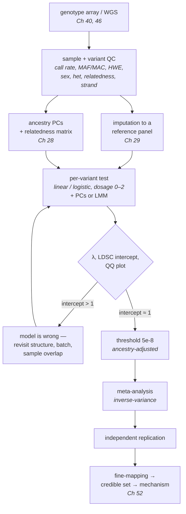

# 51 — GWAS

> **Before this:** [Ch 29 — Linkage disequilibrium](../part-05-population-genetics/29-linkage-disequilibrium.md) ·
> [Ch 28 — Population structure](../part-05-population-genetics/28-structure-and-inbreeding.md) ·
> [Ch 32 — Mapping quantitative traits](../part-06-quantitative-genetics/32-mapping-quantitative-traits.md) ·
> [Ch 30 — Quantitative traits](../part-06-quantitative-genetics/30-quantitative-traits.md) ·
> **Time:** ~55 min
>
> **Statistics needed:** [S2 Distributions](../part-S-statistics/S2-distributions.md) ·
> [S4 Hypothesis testing](../part-S-statistics/S4-hypothesis-testing.md) ·
> [S5 Variance and regression](../part-S-statistics/S5-variance-and-regression.md) ·
> [S7 High-dimensional data](../part-S-statistics/S7-high-dimensional-data.md)

## What you'll be able to do

- Write down the GWAS model, justify the 0/1/2 dosage coding, and quantify what it costs when the true genotype–phenotype map is not additive
- Explain the exact mechanism by which population structure manufactures association without causation, and rank principal components, mixed models and sibling designs by how much of it they remove
- Distinguish genomic inflation λ from the LD-score-regression intercept, and say why λ > 1 in a large study is expected rather than alarming
- Derive 5 × 10⁻⁸ from first principles, say when it is the wrong number, and explain why replication is judged at a nominal threshold instead
- Justify every step of a QC pipeline by naming the artefact it prevents, and diagnose confounding versus polygenicity from a QQ plot
- Correct a discovery effect size for winner's curse, and explain why the index variant is usually not causal and the nearest gene often not the mediator
- Trace how European-ancestry over-representation degrades fine-mapping, discovery, score portability and clinical classification, and distinguish genetic ancestry from race as the covariate you meant to control

## The core idea

Fitting and reading a regression is covered in [S5](../part-S-statistics/S5-variance-and-regression.md); this chapter assumes it. A genome-wide association study runs about ten million of them: one per variant, phenotype on genotype, with covariates. Stated that way it is a first-year exercise inside a large `for` loop.

It is not, and the reasons are all biological.

**Nobody ran this experiment.** In a designed cross ([Ch 32](../part-06-quantitative-genetics/32-mapping-quantitative-traits.md)) you make the recombinants yourself, and genotype at every marker is randomised by construction. A GWAS instead uses recombination events accumulated over tens of thousands of generations of ordinary human ancestry: the mapping population is *history*, and history randomised nothing. It sorted people by geography, and geography sorts both allele frequencies and phenotypes. Every association is a sum of a causal contribution and an ancestry contribution, and nothing in the data labels which is which.

**The rows are not independent.** A biobank contains undeclared full siblings, third cousins nobody knows about, and a continuous gradient of relatedness underneath the whole sample. That correlation structure is not noise to shrug at; it is the dominant term in the error model.

**The predictor is a proxy.** You are almost never testing the variant that does anything, but a marker correlated with it at some *r*² set by population history ([Ch 29](../part-05-population-genetics/29-linkage-disequilibrium.md)).

> **A GWAS does not find genes that cause disease. It finds positions in a genome where a marker correlates with a trait in one population.** Every hard problem in the field — confounding, fine-mapping, portability, drug-target validation — lives in the gap between those two sentences. The regression is the easy part; the covariates matter more than the model.

---

## 1. The design: association mapping over inherited recombination

Two ways to break the genome into pieces small enough to localise a signal.

[Chapter 32 §13](../part-06-quantitative-genetics/32-mapping-quantitative-traits.md) tabulates the mechanical differences — attenuation (1 − 2*r*)² against *r*²<sub>LD</sub>, 10²–10³ markers against 10⁵–10⁷, 5–30 cM resolution against 10–100 kb. Three differences it does not tabulate matter more here:

| | Designed cross | GWAS |
|---|---|---|
| Randomisation of genotype | By construction | **None**, between individuals |
| Alleles surveyed | The two the founders carried | Everything segregating in the population |
| Dominant threat | Small sample | **Confounding** |

The trade is exact. Historical recombination is dense enough to resolve a signal to a haplotype block, which is why GWAS localises to kilobases where linkage localises to megabases. The price is that the assignment of genotype to person was performed by demography.

One residue of randomisation survives, and it returns in §3 and again in [Ch 52](52-association-to-mechanism.md): **conditional on their parents' genotypes, two siblings' genotypes differ only by which alleles segregated at meiosis** — a fair coin, independent of everything about the world. That coin flip is the only genuine randomisation in human genetics, and every design robust to confounding is ultimately exploiting it.

## 2. The model, and why dosage 0/1/2

For a quantitative trait, with genotype dosage $g_i \in \{0,1,2\}$ counting copies of a chosen allele:

$$y_i = \mu + \beta g_i + \mathbf{c}_i^{\top}\boldsymbol{\gamma} + \varepsilon_i$$

For a binary trait, the same linear predictor inside a logit:

$$\log\frac{\Pr(y_i = 1)}{1 - \Pr(y_i = 1)} = \mu + \beta g_i + \mathbf{c}_i^{\top}\boldsymbol{\gamma}$$

so $e^{\beta}$ is the per-allele odds ratio. Test $H_0: \beta = 0$, repeat, sort by *p*-value. The score test for $\beta$ in the linear model is exactly the **Cochran–Armitage trend test**; the older "allelic" 2×2 χ² test on allele counts is *not* the same thing, because it treats a person's two alleles as independent observations and is anti-conservative whenever Hardy–Weinberg fails ([Ch 26](../part-05-population-genetics/26-hardy-weinberg.md)).

### Additive coding is a modelling decision, not a biological claim

Dosage coding forces the heterozygote exactly halfway between the homozygotes, and real genotype–phenotype maps are frequently not like that. Why is it the default anyway?

Use the Falconer parameterisation from [Ch 30](../part-06-quantitative-genetics/30-quantitative-traits.md): alleles $A_1$ (frequency *p*) and $A_2$ (frequency *q*), genotypic values $A_1A_1 = +a$, $A_1A_2 = d$, $A_2A_2 = -a$. The average effect of an allele substitution is

$$\alpha = a + d(q-p), \qquad V_A = 2pq\,\alpha^2, \qquad V_D = (2pq\,d)^2$$

The additive test has non-centrality proportional to $V_A$ and is blind to $V_D$. So the question "how much power does the wrong coding cost?" is the question "what fraction of the genetic variance at this locus is additive?"

> **Statistics:** power and the non-centrality parameter that drives it are covered in
> [S4 §4](../part-S-statistics/S4-hypothesis-testing.md), and the χ² distribution itself in
> [S2 §4](../part-S-statistics/S2-distributions.md).

Take a **fully recessive** allele $A_1$ — only $A_1A_1$ differs, so $d = -a$:

$$\alpha = a - a(q-p) = a(1 - q + p) = 2ap, \qquad \frac{V_A}{V_A + V_D} = \frac{8a^2p^3q}{8a^2p^3q + 4a^2p^2q^2} = \frac{2p}{2p+q}$$

| MAF of the recessive allele | Fraction of locus variance that is additive |
|---:|---:|
| 0.05 | 9.5% |
| 0.10 | 18% |
| 0.25 | 40% |
| 0.50 | 67% |

For a **common** allele the additive test sees most of the signal even under strictly recessive inheritance, which is why the default is defensible. For a **rare** recessive allele it sees almost nothing — one reason rare-variant analysis needs a different apparatus ([Ch 54](54-rare-variants-and-mendelian-disease.md)).

The one case the additive test cannot see at all is exact overdominance at equal frequencies: $a = 0$ and $p = q = 0.5$ give $\alpha = d(q-p) = 0$, and the heterozygote advantage is invisible. Balancing selection produces exactly that configuration, but rarely enough that the field accepts the blind spot rather than pay a multiple-testing tax for fitting three models at every site.

### Binary traits break the asymptotics where it matters most

With 5,000 cases, 400,000 controls, a variant with 30 minor-allele carriers, and a threshold out at 5 × 10⁻⁸, every assumption behind the χ² approximation strains at once: the score statistic's null is skewed, and the skew lives precisely in the tail you are thresholding, so standard logistic regression manufactures genome-wide-significant *p*-values from nothing. The fixes are a **saddlepoint approximation** to the true null and **Firth's penalised likelihood** when a genotype cell is empty (`SAIGE`, `REGENIE`). Unbalanced case–control ratios plus rare variants invalidate the asymptotics: either fix the null or threshold on minor-allele *count*.

### The covariates matter more than the model

Age, sex, array, batch, assessment centre, and the top principal components of the genotype matrix — and one genetics-specific hazard beyond the obvious ones. **Do not adjust for heritable mediators.** Collider bias and the hazard of adjusting for a mediator are covered in [S5 §6](../part-S-statistics/S5-variance-and-regression.md); what is specific to genetics is how many plausible covariates are themselves heritable. Adjusting a type 2 diabetes GWAS for BMI conditions on a variable that both genotype and disease influence, and the adjusted scan then reports associations that exist only in the conditioned population, sometimes with inverted signs — a failure that has a clinical name, **index-event bias**, when a study is restricted to people who already had a first event. The dominant covariate, ancestry, gets its own section.

## 3. Population stratification

This is the central validity threat, and mechanically it is an omitted-variable problem in biological clothing.

Let *Z* index subpopulation, *g* be dosage, *y* be phenotype. [Chapter 28](../part-05-population-genetics/28-structure-and-inbreeding.md) derived: for a variant with genuinely **zero** effect inside every subpopulation, two groups in proportions *w* and 1−*w*,

$$\mathrm{Cov}(g, y) = 2\,w(1-w)\,(p_1 - p_2)(\mu_1 - \mu_2)$$

Non-zero whenever *both* the allele frequency and the mean phenotype differ between groups. Ancestry is a common cause of genotype and phenotype: a confounder in the strict sense.

> **Statistics:** omitted-variable bias, and why adjusting for a covariate removes only the part of
> the confounder that covariate measures, are covered in
> [S5 §6](../part-S-statistics/S5-variance-and-regression.md) — worked on this same ancestry example.

Three consequences the derivation makes unavoidable.

**It is bias, not variance.** The estimate does not shrink with *n*; the standard error does. The non-centrality therefore grows linearly in *n* and the *p*-value marches toward zero: **a bigger study makes a stratification artefact more significant, not less.** Every other error in genomics improves with data. This one worsens.

**It is genome-wide**, since any variant whose frequency differs between strata is affected — so the signature is diffuse inflation rather than a spike, which is unhelpfully also the signature of real polygenicity (§4).

**It bites hardest on traits with geographic gradients.** Campbell and colleagues (2005) assembled a European-American panel selected for height, genotyped 178 markers, found no evidence of stratification by the standard tests of the day, and reported a *p* < 10⁻⁶ association between a SNP at *LCT* and height. *LCT* is the lactase-persistence locus, whose frequency varies steeply across Europe, and so does height. The association was an ancestry gradient wearing a *p*-value.

### The three defences, in ascending order of strength

> **Statistics:** principal components are covered in
> [S7 §5](../part-S-statistics/S7-high-dimensional-data.md) and mixed models with a relatedness
> covariance in [S7 §8](../part-S-statistics/S7-high-dimensional-data.md); both are assumed here.

**Principal components as covariates.** Build the normalised genotype matrix **X** as in [Ch 28 §10](../part-05-population-genetics/28-structure-and-inbreeding.md), take the top *k* eigenvectors of **XX**ᵀ/*m*, and include them as fixed covariates. They are not arbitrary axes of variance but the dominant axes of relatedness in the sample, so regressing them out removes the ancestry component of both *g* and *y*. They miss structure below the top *k* eigenvalues, and fine-scale recent relatedness, which is spread thinly across many small eigenvalues. They over-remove causal variants whose frequency happens to track a PC — which is why ancestry-differentiated loci under selection are systematically hard to detect. And a trap: PCs computed without LD-pruning and without masking long-range LD regions (the 17q21 *MAPT* inversion, HLA, *LCT*) will faithfully report an inversion polymorphism as if it were continental ancestry.

**Linear mixed models with a genetic relationship matrix.** Replace *k* fixed covariates with a random effect whose covariance *is* the relatedness:

$$\mathbf{y} = \mathbf{X}\boldsymbol{\gamma} + \mathbf{g}\beta + \mathbf{u} + \boldsymbol{\varepsilon}, \qquad \mathbf{u} \sim \mathcal{N}(0,\ \sigma_g^2\mathbf{K})$$

with **K** the GRM. The GRM contains the *entire* spectrum of relatedness — continental ancestry in the leading eigenvectors, sibships and cousinships in the small ones — so one model handles structure and cryptic relatedness together. That matters because recruiting half a million people from one country turns up over a hundred thousand undeclared pairs at third-degree or closer — in UK Biobank, 107,162 such pairs, involving 30% of participants. Two consequences: if the tested variant is in the GRM, the random effect partly absorbs its own effect (**proximal contamination**, fixed by building **K** from every chromosome except the one being tested); and the naive likelihood is O(*n*³) per variant, which is why the methods literature here (`BOLT-LMM`, `fastGWA`, `REGENIE`) is essentially a sequence of tricks for never forming or inverting **K**.

**Within-family designs.** Regress the *difference* between siblings' phenotypes on the difference in their dosages. Conditional on the parents, segregation is a fair coin, so a sibling's deviation from the sibship mean is independent of ancestry, of parental environment, and of everything else the family shares: confounding is removed **by construction rather than adjusted for**. The costs are power (only within-family genotypic variance is used, and sibling pairs are scarce) and scope (nothing constant within families is estimable).

The estimand also changes, which is a feature. A population GWAS estimate mixes the **direct effect** of the inherited allele on its carrier; **demographic confounding** (stratification, plus assortative mating, which correlates alleles genome-wide); and **indirect genetic effects** — parents' and siblings' alleles acting through the environment they create, sometimes called genetic nurture. Within-sibship analysis isolates the first. Howe and colleagues (2022) ran both designs on 178,086 siblings from 19 cohorts across 25 phenotypes; within-sibship estimates were smaller for height, educational attainment, age at first birth, number of children, cognitive ability, depressive symptoms and smoking, with the educational-attainment attenuation around **47%** (95% CI 41–52%) against **10%** (8–12%) for height.

The discount is therefore **trait-specific**, not a universal correction factor, and it bites hardest on exactly the socially loaded traits. A polygenic score for a behavioural or social outcome measures a mixture whose composition you cannot read off the *p*-value — the caveat carried into [Ch 53](53-polygenic-scores.md) and [Ch 58](../part-12-applications-and-ethics/58-ethics-and-society.md).

## 4. λ versus the LD-score intercept

This distinction is frequently muddled and it matters, because the two statistics answer different questions.

### Genomic inflation, λ

Under the global null each statistic is $\chi^2_1$, whose median is $\Phi^{-1}(0.75)^2 = 0.4549$. So define

$$\lambda_{\mathrm{GC}} = \frac{\mathrm{median}(\chi^2_{\text{observed}})}{0.4549}$$

**Genomic control** (Devlin & Roeder 1999) then divides every statistic by λ. Sound, *if* the only thing inflating statistics is a uniform confounding factor.

It is not sound under polygenicity, and that is the whole problem. If a trait is influenced by tens of thousands of variants ([Ch 32 §11](../part-06-quantitative-genetics/32-mapping-quantitative-traits.md)), most of the genome carries a small true signal, the median statistic is genuinely above the null, and λ exceeds 1 *legitimately*. Worse, that polygenic contribution scales with *N*, so **λ grows without bound as a study grows even when the study is perfectly clean.** λ = 1.3 in a 20,000-person study is worrying; in a 500,000-person height GWAS it is expected. Dividing by it discards real discoveries.

### LD-score regression separates them

The insight (Bulik-Sullivan et al. 2015) is that confounding and polygenicity leave *different fingerprints in LD space*.

Write the marginal effect of SNP *j* in standardised units as the sum of the true effects of everything it tags: $\hat\beta_j^{\text{marg}} = \sum_k r_{jk}\beta_k$. Under a polygenic model with $\beta_k$ independent of variance $h^2/M$,

$$\mathrm{Var}\!\left(\hat\beta_j^{\text{marg}}\right) = \frac{h^2}{M}\sum_k r_{jk}^2 = \frac{h^2}{M}\,\ell_j, \qquad \ell_j \equiv \sum_k r_{jk}^2$$

where $\ell_j$ is SNP *j*'s **LD score**: how many variants it tags, weighted by how well. Since $\mathbb{E}[\chi^2_j] \approx 1 + N\,\mathrm{Var}(\hat\beta_j^{\text{marg}})$, and stratification or cryptic relatedness inflates every statistic by roughly the same amount irrespective of its LD,

$$\mathbb{E}[\chi^2_j] \;=\; \underbrace{\frac{N h^2}{M}\,\ell_j}_{\text{polygenic signal}} \;+\; \underbrace{Na}_{\text{confounding}} \;+\; 1$$

Regress observed χ² on LD score across millions of variants. LD scores vary by more than an order of magnitude along the genome, which gives the regression leverage to separate slope from intercept.

- **Slope** → SNP heritability, estimated from summary statistics alone. This is `LDSC`'s more famous use.
- **Intercept** → everything inflating statistics without respect to LD. Under a clean analysis, ≈ 1.

The scale-free diagnostic is the **attenuation ratio**, $(\text{intercept} - 1)/(\overline{\chi^2} - 1)$: the share of mean inflation not attributable to polygenic signal. Below ~0.1–0.2 is routinely treated as acceptable.

| Observation | λ ≈ 1 | λ ≫ 1 |
|---|---|---|
| **Intercept ≈ 1** | Underpowered or non-heritable trait | Polygenic architecture; inflation is real signal. **Do not apply genomic control** |
| **Intercept > 1** | Unusual — check for a small confounded subgroup | Confounding on top of polygenicity; fix the model before believing any hit |

The intercept is not a confounding oracle. It rises with **sample overlap** between cohorts in a meta-analysis even when no component study is confounded; it is biased when the LD reference panel does not match the study ancestry; and the constant-effect-variance assumption is false in detail, since effects are enriched in low-LD, functionally constrained regions — which is what stratified LD-score regression exists to model.

> **λ measures how inflated the statistics are. The intercept measures how much of that inflation is not genetics.** Reporting λ alone in a modern study says almost nothing.

## 5. Multiple testing: where 5 × 10⁻⁸ comes from

Bonferroni over *M* independent tests at family-wise error 0.05 gives α = 0.05/*M*, so the whole question is *M* — and the naive answer, the number of variants on the array, is wrong in both directions. Too large, because adjacent variants are near-duplicates and a block of 40 markers in tight LD is not 40 tests. Too small, because the array proxies for everything it tags, including variants you did not genotype. The right quantity is the number of **effectively independent tests** in the genome's common-variant space, $M_{\text{eff}}$ — a property of the population's LD structure, not of your chip.

> **Statistics:** the family-wise error rate, and why Bonferroni's guarantee survives arbitrary
> dependence between tests, are covered in
> [S7 §2](../part-S-statistics/S7-high-dimensional-data.md).

There is no clean closed form, so it was estimated empirically: permute phenotypes, or simulate null statistics under the observed LD, and ask what threshold holds the family-wise rate at 0.05. Several groups converged around 2008 on $M_{\text{eff}} \approx 1 \times 10^6$ for common variants (MAF ≥ 0.05) in European-ancestry samples. Then

$$\alpha = \frac{0.05}{10^6} = 5\times 10^{-8}, \qquad |Z| > 5.4513$$

Two consequences, both counter-intuitive coming from ordinary multiple testing:

- **Adding markers barely changes the threshold.** Denser arrays and imputation to 20 million variants do not push it to 2.5 × 10⁻⁹, because the extra variants are mostly redundant. The threshold prices the *genome*, not the *file*.
- **You cannot buy power by testing fewer variants.** A candidate-gene panel of 50 SNPs does not license α = 0.001; had you scanned the genome you would have needed 5 × 10⁻⁸. A laxer threshold is earned only by a prior good enough to justify picking those 50 in advance — stated and defended, not smuggled in through the denominator ([S7 §2](../part-S-statistics/S7-high-dimensional-data.md)). Historically that prior did not exist, which is the statistical core of why the candidate-gene literature almost entirely failed to replicate.

### When 5 × 10⁻⁸ is the wrong number

$M_{\text{eff}}$ is a property of LD, and LD differs.

| Setting | Why $M_{\text{eff}}$ changes | Direction |
|---|---|---|
| African-ancestry samples | Shorter haplotype blocks (~11 kb vs ~22 kb, [Ch 29](../part-05-population-genetics/29-linkage-disequilibrium.md)) → more independent tests | Roughly 2× more tests; threshold nearer 1–2 × 10⁻⁸ |
| Founder populations (Finnish, Ashkenazi, Icelandic) | Long haplotypes, fewer independent tests | Threshold can be relaxed |
| Whole-genome sequencing | Rare variants are in weak LD with everything, so each adds nearly a whole test | Proposals cluster around 5 × 10⁻⁹ to 1 × 10⁻⁸ |
| Multi-ancestry meta-analysis | Union of LD structures | More stringent than any single component |

Using 5 × 10⁻⁸ regardless of ancestry therefore has a quiet equity consequence: it is *conservative* for most non-African samples and *anti-conservative* for African-ancestry samples, so the group with most to gain from discovery is the one where a fixed threshold controls error least well.

And be honest about what the threshold is not. It controls the family-wise error of *one scan*, and nothing at all across the thousands of scans a field runs on the same biobank. What does that work is §10, replication.

## 6. QC, and the artefact each step prevents

Every filter below exists because something specific went wrong once, expensively.

| Step | Typical rule | The artefact it prevents |
|---|---|---|
| **Sample call rate** | drop < 95–98% | Degraded DNA gives biased, not just missing, calls — heterozygotes drop out preferentially |
| **Variant call rate** | drop < 95–99% | Poorly clustering assays |
| **Differential missingness** | test case vs control | **The classic false positive.** If cases and controls were plated, extracted or arrayed separately, missingness correlates with phenotype and so does the genotype among those called |
| **MAF / MAC** | MAC ≥ 20 (not MAF ≥ 0.01) | χ² asymptotics fail when a handful of carriers drive the statistic. The right threshold is a *count*, so it scales with study size |
| **Hardy–Weinberg** | drop *p* < 1 × 10⁻⁶ **in controls** | A genotyping-error detector ([Ch 26](../part-05-population-genetics/26-hardy-weinberg.md)): allele-dropout and mis-clustering produce heterozygote deficits far larger than any biological force. Filter in controls only, because a true recessive association makes cases genuinely depart. Keep the threshold loose: with *N* = 500,000 the test detects trivially small departures caused by structure, and a strict filter would delete real variants |
| **Sex check** | X heterozygosity + Y call rate vs record | Catches sample swaps and plate rotations, which are otherwise invisible and corrupt everything downstream. Also flags real sex-chromosome aneuploidy ([Ch 20](../part-03-genome-instability/20-chromosome-abnormalities.md)) |
| **Heterozygosity rate** | ±3 SD | Excess → contamination or a mixed sample; deficit → inbreeding ([Ch 28](../part-05-population-genetics/28-structure-and-inbreeding.md)) or poor DNA |
| **Relatedness** | kinship / IBD estimation | Duplicates and cryptic relatives violate independence. **Remove one of each pair for a fixed-effects model; keep them for an LMM**, which models them |
| **Ancestry outliers** | project onto reference-panel PCs | A handful of individuals far from the sample's ancestry distribution can dominate a per-variant test at a differentiated locus |
| **Strand / allele alignment** | see below | Silent allele swaps that invert effect signs |

### Strand ambiguity, which deserves more than a table row

Genotypes are reported relative to a strand, and different arrays and consortia chose differently. Usually the alleles themselves resolve it:

```
forward strand   ... G  [C/T]  A ...      allele set {C, T}
reverse strand   ... T  [G/A]  C ...      allele set {G, A}
                                          {C,T} ∩ {G,A} = ∅   →  unambiguous

forward strand   ... G  [A/T]  A ...      allele set {A, T}
reverse strand   ... T  [T/A]  C ...      allele set {T, A}
                                          {A,T} = {T,A}       →  AMBIGUOUS
```

A/T and C/G variants — **palindromic** or **strand-ambiguous** SNPs — cannot be resolved from alleles alone. The only remaining evidence is allele frequency: if allele A sits at 0.18 in both datasets they share a strand; at 0.18 and 0.82 they are flipped. That works when the MAF is far from 0.5 and says nothing when it is close. Hence the practice of dropping palindromic variants with MAF above roughly 0.4 before any cross-study merge, meta-analysis or polygenic score. Skip it and you silently flip the sign of some effect sizes, which is worse than dropping them, because a sign-flipped variant actively subtracts. The same failure arrives by another route in liftover, where the reference allele itself can change between builds ([Ch 41 §8](../part-09-genomics/41-data-formats.md)).

Finally, array genotypes come from clustering fluorescence intensities into three groups, and a variant whose clusters are smeared or shifted yields calls that are systematically wrong in a way nothing in the genotype file reveals. Manual inspection of intensity clusters for the top hits caught a large share of the early false positives and remains the last QC step of a well-run study. **Look at the raw signal underneath your top results, whatever the assay.**

## 7. Imputation

Arrays measure a few hundred thousand tag positions. Imputation converts them into tens of millions of dosages by modelling each target chromosome as a mosaic copied from a sequenced reference panel — a hidden Markov model whose hidden state is *which reference haplotype am I copying now*, derived in [Ch 29 §10](../part-05-population-genetics/29-linkage-disequilibrium.md). Three things matter here that did not matter there.

**Output dosages, not hard calls.** The posterior mean dosage in [0, 2] carries uncertainty into the regression, where it belongs; rounding to a best guess biases effects toward zero.

**Filter on imputation quality.** The standard metric (`INFO`, or `r²`) compares the observed variance of imputed dosages to the variance expected under Hardy–Weinberg at that allele frequency, and behaves like the squared correlation between imputed and true genotype — so it plugs straight into the attenuation result of [Ch 29 §5](../part-05-population-genetics/29-linkage-disequilibrium.md): INFO 0.4 costs a factor of 2.5 in effective sample size. Stratifying the QQ plot by INFO band (§9) catches what a fixed threshold misses.

**Imputation is what makes meta-analysis possible.** Two cohorts on different array versions share almost no markers directly; imputed to a common panel they share tens of millions. The panel is then the constraint: a variant absent from it cannot be imputed at all, and a target haplotype unlike anything in the panel forces constant switching, flattening the posterior. Both failures hit under-represented ancestries hardest, compounding §12 rather than relieving it.

## 8. Meta-analysis and consortium scale

No single cohort is large enough, and the field's structure follows from that.

**Fixed-effect inverse-variance weighting.** For study *k* with estimate $\hat\beta_k$ and standard error $s_k$, set $w_k = 1/s_k^2$:

$$\hat\beta_{\text{meta}} = \frac{\sum_k w_k \hat\beta_k}{\sum_k w_k}, \qquad \mathrm{SE} = \frac{1}{\sqrt{\sum_k w_k}}$$

Under homogeneous effects and no sample overlap, this is *identical* to the estimate you would get by pooling individual-level data. That equivalence is the load-bearing fact of the consortium model: summary statistics suffice, so individual genotypes never have to leave the jurisdiction or the institution that consented the participants. When effect scales differ, the sample-size-weighted Z-score version $Z_{\text{meta}} = \sum_k \sqrt{N_k}\,Z_k / \sqrt{\sum_k N_k}$ trades interpretability for robustness. For case-control studies the right weight is the effective sample size $N_{\text{eff}} = 4/(1/N_{\text{cases}} + 1/N_{\text{controls}})$ — a study with 1,000 cases and 500,000 controls is worth about 4,000, not 501,000.

**Heterogeneity is data, not nuisance.** Cochran's *Q* and *I*² quantify it, and between ancestries the leading explanations are informative: the tag's *r*² with the causal variant differs (§11), the causal allele frequency differs, or a genuine gene–environment interaction exists ([Ch 32 §12](../part-06-quantitative-genetics/32-mapping-quantitative-traits.md)). Trans-ancestry methods model heterogeneity as a function of genetic distance between cohorts rather than as noise, converting sample diversity from a complication into resolution.

**Overlap contaminates.** The same participants entering two contributing studies violates independence, inflates the statistic, and surfaces as an LDSC intercept above 1 (§4) even when every component study is clean. Biobanks everybody uses make this endemic.

The result is a scaling law rather than a discovery: for a polygenic trait the number of genome-wide-significant loci grows roughly linearly with *N* past an initial threshold, because a near-continuous distribution of ever-smaller effects waits below the line. Height went from a handful of loci in 2007 studies of ~15,000 people to thousands in meta-analyses of millions. **Running out of loci is not what happens.** As of mid-2026 the NHGRI-EBI GWAS Catalog holds on the order of 7,800 curated publications and more than 1.1 million lead associations across more than 20,000 traits — approximate figures that will be larger by the time you read this.



## 9. Reading the two plots

**The Manhattan plot** puts −log₁₀ *p* against genomic position. What you are looking for is not height but *shape*. A real association is a **tower with shoulders**: the index variant flanked by dozens of correlated variants whose significance decays with their *r*² to it, across the tens of kilobases LD extends over. A lone spike with no supporting neighbours is almost always an artefact — a mis-clustering assay, a badly imputed variant — because a real causal effect must, by construction, be visible through everything in LD with it. That heuristic will save you more time than any statistic in this chapter.

**The QQ plot** puts observed −log₁₀ *p* order statistics against their expectation under the uniform null. Its diagnostic value is entirely in *where* the curve leaves the diagonal.

```
   A. late departure            B. uniform lift              C. early departure
   ^                            ^                            ^
   |            .               |          .                 |        .
   |           .                |        . /                 |      . /
   |         . /                |      . /                   |    . /
   |       . /                  |    . /                     |  . /
   |     ./                     |  ./                        | ./
   |   ./                       | ./                         |/
   | ./                         |/                           /
   +/___________ expected       +/___________ expected       /____________ expected

   bulk sits on y = x;          leaves the diagonal          leaves the diagonal
   lifts only in the            gently near the origin       immediately — even
   extreme tail                 and stays above it           p ≈ 0.5 is inflated

   → a small number of          → polygenicity, OR mild      → confounding: structure,
     real loci; analysis          confounding. λ cannot        relatedness, batch, or a
     is clean                     tell them apart.             miscalibrated test.
                                  Check the intercept.         Nothing here is safe.
```

Panel **C** means "stop". Panel **B** is the one everyone argues about, and §4 resolves the argument: for a well-powered polygenic trait, *B is what a correct analysis looks like*, and only the LDSC intercept distinguishes it from mild confounding. Two refinements: **deflation** — the curve below the diagonal — signals over-correction (genomic control on top of polygenic signal, too many PCs, a conservative test); and **stratified QQ plots** by MAF band and INFO band localise the problem, since inflation confined to the rare and poorly imputed strata is a QC failure rather than biology.

## 10. Effect sizes, winner's curse, replication

Common-variant effects are small. Per-allele odds ratios for genome-wide-significant common variants typically run **1.05 to 1.3**, the larger values confined to a handful of unusual loci (*APOE* in Alzheimer's disease, the MHC in autoimmune disease, *CFH* in macular degeneration). For quantitative traits, 0.01–0.05 phenotypic standard deviations per allele is the norm. A variant at MAF 0.3 with β = 0.02 SD explains $2pq\beta^2 \approx 1.7\times10^{-4}$ — 0.017% of the variance. Thousands of such variants are how a trait becomes 60% heritable.

### Winner's curse, derived

Effects that small clear a threshold that stringent only when noise helps. Formally: $\hat\beta \sim \mathcal{N}(\beta, s^2)$, reported only when $\hat\beta/s > c$. Conditioning on a truncated normal,

$$\mathbb{E}\!\left[\frac{\hat\beta}{s} \;\middle|\; \frac{\hat\beta}{s} > c\right] = \mu + \frac{\phi(c - \mu)}{1 - \Phi(c-\mu)}, \qquad \mu \equiv \beta/s$$

The second term is the inverse Mills ratio, and its size depends on how far *inside* the threshold the truth sits: for a variant with true non-centrality μ = 5 against *c* = 5.45 the inflation is minor, and for μ = 2 the reported effect is more than doubled. **Every discovery study overstates the effects it discovers, and overstates the marginal ones most.** Because variance explained goes as β², the bias on variance explained is the *square* of the bias on the effect.

Downstream: replication effect sizes are routinely smaller than discovery ones, and that is not a failure to replicate; scores built from raw discovery betas are over-weighted at their weakest loci, one reason [Ch 53](53-polygenic-scores.md) shrinks them; and the first GWAS of any trait is the most over-optimistic one that will ever be published. Fix it with conditional-likelihood or bootstrap de-biasing, or preferably by quoting the effect from an independent sample.

### Replication as the evidence standard

The standard is an **independent sample**, prespecified variant, prespecified direction, nominal significance. Not genome-wide significance again: you are testing one variant, so the burden is one test. The worked example shows a variant with 9% power to reach 5 × 10⁻⁸ carrying 99% power to replicate at nominal *p* < 0.05 in an identically sized sample; demanding genome-wide significance twice would reject nearly every true finding.

What replication buys is protection against the failure modes no *p*-value detects: batch artefacts, sample swaps, a processing bug, residual stratification specific to one cohort. None of those transfer to a differently collected sample; a real biological effect does. This is why GWAS replicates at a rate the candidate-gene literature did not — not better statistics on the same data, but a prespecified genome-wide scan, a threshold that prices the search, and an independent test.

## 11. The crucial point: the hit is a tag

Everything above tells you where a signal is. Almost nothing tells you what it *is*. Three inferential gaps sit between an index variant and a mechanism, and they compound.

**The index variant is usually not causal.** It is the marker with the largest test statistic among dozens in the same LD block, all correlated with the true causal site at similar *r*². Which one tops the list is close to a coin flip resolved by sampling noise ([Ch 29 §10](../part-05-population-genetics/29-linkage-disequilibrium.md)); re-running the same study on a fresh sample from the same population routinely promotes a different block member.

**The causal variant is usually not in a protein-coding exon.** Roughly 90% of index variants fall outside coding sequence — the widely cited early tally was 88% intronic or intergenic — and the fraction has held as samples grew. Not an ascertainment accident: coding changes with real consequences are under stronger purifying selection and so sit at lower frequency, where common-variant GWAS has no power, and most of the mutational target for quantitative variation is regulatory to begin with ([Ch 22](../part-04-gene-regulation/22-eukaryotic-transcriptional-regulation.md)). GWAS signals are correspondingly enriched in enhancers and open chromatin of trait-relevant cell types ([Ch 49](../part-10-functional-genomics/49-epigenome-profiling.md)) — a mechanistic clue, not a nuisance.

**The nearest gene is frequently not the mediating gene.** Regulatory elements act at a distance through chromatin looping ([Ch 50](../part-10-functional-genomics/50-3d-genome.md)), and linear proximity in base pairs is a poor proxy for contact in three dimensions. The canonical case is *FTO*: variants in intron 1 are among the strongest and most replicated common-variant associations with body mass index, and "the *FTO* obesity gene" was standard usage for years. The causal variant turns out to disrupt a repressor-binding site in an enhancer that loops to and regulates *IRX3* and *IRX5*, several hundred kilobases away; perturbing that circuit changes adipocyte biology, and perturbing *FTO* does not reproduce it. A real, replicated association, attributed to the wrong gene for most of a decade.

Machine-learned locus-to-gene models integrating fine-mapping, molecular QTLs, chromatin contacts and coding evidence find that **distance is the single most informative feature and still not sufficient** — a trained model reliably beats nearest-gene, which is only worth saying because nearest-gene is wrong often enough for the improvement to matter. Sometimes the naive answer is right (*TCF7L2* and type 2 diabetes), and nothing but evidence tells you which case you are in.

> **"Variant *X* is associated with trait *T*" is a statement about a correlation in one sampled population. "Gene *G* causes trait *T*" is a claim about biology.** Nothing in a GWAS gets you from the first to the second. [Chapter 52](52-association-to-mechanism.md) is about the machinery that does.

## 12. Diversity: an equity problem that is also a scientific one

GWAS participants have been overwhelmingly of European genetic ancestry from the beginning, and the imbalance is stubborn. Published tallies differ by denominator — participants versus studies, and how multi-ancestry cohorts are counted — but all land high: roughly 81% of participants in 2016, about 86% by mid-2021, recent counts near 90%, against a European-ancestry share of the world's population well under a fifth.

First, the distinction everything else depends on.

> **Genetic ancestry is not race.** Ancestry is a continuous, measurable statement about which historical populations your genome was inherited from, estimated as coordinates on continuous axes or as admixture proportions, with individuals routinely sitting between labelled clusters. Race is a social classification whose categories differ between countries and change within a century. The two correlate imperfectly, and differently in different places. Substituting a race or ethnicity label for a measured ancestry covariate is a *measurement-error* problem before it is anything else: you proxy the confounder you meant to control with a noisy social variable, and residual stratification survives.

### The scientific costs

**Fine-mapping is worse.** Credible sets narrow on *differences* in *r*² between candidate variants and the causal site. European-ancestry LD blocks are long, so dozens of variants have near-identical *r*², the likelihood surface is flat, and the credible set does not shrink however many more European samples you add. African-ancestry blocks are roughly half as long with sharper contrasts, narrowing credible sets far faster per person added ([Ch 29](../part-05-population-genetics/29-linkage-disequilibrium.md)).

**Discovery is foregone.** A variant common in one population and rare or absent in another is invisible in the second sample. Several of the most consequential findings in human genetics exist only because someone studied a non-European population:

| Finding | Population | Why it was invisible elsewhere |
|---|---|---|
| *APOL1* G1/G2 and kidney disease | West African ancestry | Essentially absent outside it; at high frequency under trypanosome selection |
| *PCSK9* loss-of-function variants | African-American participants (ARIC) | Nonsense alleles at low frequency — the finding that launched a drug class |
| *SLC16A11* and type 2 diabetes | Mexican and Latin American | Common there, rare in Europeans, absent in Africans; archaic-introgressed haplotype |
| *CREBRF* and BMI | Samoan | Frequency near 0.25 there, essentially absent elsewhere |

No amount of European sample size would have found any of them.

**Scores do not transfer.** Accuracy degrades roughly with genetic distance from the training sample, for three reasons all located in the training data: the weight on a tag is $\beta_{\text{causal}}$ times a function of tag–cause LD **in the discovery population**, so where LD differs the weight is wrong and where the sign of *r* flips the variant actively subtracts; a variant common in discovery and rare in the target contributes almost nothing there; and imputation is worse for under-represented ancestries (§7), adding measurement error on top.

> **Portability failure is a property of the training data, not of the people being predicted.** It is caused by whose genomes were sampled and by the LD and allele-frequency structure of the discovery cohort — not by the trait's biology differing between groups. The demonstration is direct: train the score in a cohort of the ancestry that previously predicted badly and it predicts well there, then transfers poorly in the other direction. The asymmetry follows the data. [Chapter 53](53-polygenic-scores.md) develops this quantitatively.

**Clinical interpretation is distorted.** Classification leans on population allele frequencies: a variant seen commonly in healthy adults is not causing a severe disease ([Ch 55](55-clinical-variant-interpretation.md)). When the frequency reference is European-dominated, variants common and benign in African or Asian populations look rare and therefore suspicious. Several were reported as pathogenic for hypertrophic cardiomyopathy on exactly this basis, disproportionately affecting Black patients, and reclassified benign once adequately diverse frequency data existed. The harm is individual and concrete: a wrong diagnosis, plus family members tested on the strength of it.

### Progress, and the right frame

Reference resources have improved — gnomAD v4/v4.1 aggregates 807,162 individuals, the 1000 Genomes high-coverage release covers 3,202 samples across 26 populations, and HPRC Release 2 (May 2025) provides 460 haplotypes from 200+ individuals ([reference/verified-facts.md](../reference/verified-facts.md), [Ch 45](../part-09-genomics/45-reference-genomes-and-pangenomes.md)) — and cohort-building has broadened into *All of Us*, H3Africa, the Million Veteran Program, Biobank Japan, Genes & Health, the Mexico City Prospective Study, and founder-population biobanks such as FinnGen that turn unusual LD structure into an analytic advantage.

The right frame is not "collect more diverse samples so that existing users of these methods get better portability". It is that cohorts should be built with the communities they recruit from, under governance those communities control, with local scientific leadership and local benefit — both the defensible ethical position and, empirically, the one that produces cohorts that last. [Chapter 58](../part-12-applications-and-ethics/58-ethics-and-society.md) takes up governance directly.

---

## Common misconceptions

| What people think | What's actually true |
|---|---|
| A GWAS hit is the causal variant | It is the best-correlated *measured* marker in an LD block. Which member wins is largely sampling noise, and the causal site may not have been genotyped at all |
| The gene at the hit is the gene involved | ~90% of hits are non-coding, regulatory elements act over hundreds of kilobases in 3D, and the nearest gene is frequently not the mediator. *FTO* variants act on *IRX3*/*IRX5* |
| A bigger sample fixes confounding | Stratification is bias, not variance. It does not shrink with *n*; the *p*-value falls while the estimate stays wrong |
| λ > 1 means the study is confounded | For a polygenic trait λ grows with *N* under a perfectly clean analysis. Only the LD-score-regression intercept separates confounding from real signal |
| Genomic control is a safe default | Dividing by λ removes genuine polygenic signal along with confounding, and gets worse as studies grow — a 1999 solution to a pre-biobank problem |
| 5 × 10⁻⁸ is a law of nature | It is 0.05 Bonferroni-corrected for ~10⁶ effectively independent common-variant tests *in European-ancestry LD*. African-ancestry samples need roughly twice the correction; WGS more. And testing fewer variants earns no laxer threshold — the burden is the genome's independent information content, not your file's column count |
| HWE filtering should be applied to the whole sample | Apply it in controls. A true recessive association makes cases depart from HWE, so filtering on it deletes the discovery |
| Failing to replicate at 5 × 10⁻⁸ means the hit was false | Replication tests one prespecified variant, so the burden is one test. Demanding genome-wide significance twice would discard nearly every true finding |
| Discovery effect sizes are unbiased | Winner's curse inflates estimates that cleared a stringent threshold, most severely the marginal ones, and squares that bias on variance explained |
| Polygenic scores transfer poorly because populations differ biologically | They transfer poorly because LD and allele frequencies in the *training* sample differ from the target. The direction of failure follows the training data |
| Genetic ancestry and race are two words for the same thing | Ancestry is continuous and measurable; race is a social classification varying by country and era. Using one to proxy the other injects measurement error into the confounder you meant to control |

## Worked example

A quantitative trait, standardised to mean 0 and SD 1. *N* = 50,000 unrelated individuals. One variant, MAF *p* = 0.25, true additive effect β = 0.03 SD per minor allele. GRCh38 throughout.

**Step 1 — the genotype column.** Under Hardy–Weinberg ([Ch 26](../part-05-population-genetics/26-hardy-weinberg.md)):

```
  genotype   frequency        count       dosage
  hom minor   p²  = 0.0625     3,125         2
  het        2pq  = 0.375     18,750         1
  hom major   q²  = 0.5625    28,125         0
                              ------
                              50,000
```

Minor-allele count = 2(3,125) + 18,750 = 25,000 = 2*Np*. ✓ Dosage variance = 2*pq* = **0.375**.

**Step 2 — variance explained, non-centrality, threshold.**

$$R^2 = \beta^2\mathrm{Var}(g) = (0.03)^2(0.375) = 3.375\times10^{-4} \quad (0.034\%\text{, typical})$$
$$\lambda_{\text{ncp}} = \frac{NR^2}{1-R^2} \approx 16.875, \qquad \mathbb{E}[Z] = \sqrt{16.875} = 4.108$$

Two-sided α = 5 × 10⁻⁸ requires $\Pr(Z > c) = 2.5\times10^{-8}$, so *c* = **5.4513**.

**Step 3 — power.** $\Pr(Z > 5.4513 \mid \mathbb{E}[Z] = 4.108) = \Pr(\mathcal{N}(0,1) > 1.3433) = 1 - 0.9104 =$ **0.090**. A variant of entirely typical effect, in a study of fifty thousand people, is found less than one time in ten.

**Step 4 — what would be enough.** For 80% power, $\mathbb{E}[Z] = 5.4513 + 0.8416 = 6.2929$, so ncp = 39.60 and $N = 39.60/(3.375\times10^{-4}) \approx$ **117,000** — two and a third times the sample, for one ordinary variant. Multiply across a polygenic architecture and the consortium model of §8 stops being a sociological curiosity and becomes an arithmetic necessity.

**Step 5 — winner's curse, on the 9% of occasions it is found.** Truncating at *c* = 5.4513 with true mean μ = 4.108, so $c - \mu = 1.3433$:

$$\phi(1.3433) = 0.16183,\quad 1 - \Phi(1.3433) = 0.08959,\quad \frac{\phi}{1-\Phi} = 1.8064, \quad \mathbb{E}[Z \mid \text{detected}] = 5.914$$

Inflation factor 5.914/4.108 = **1.44**. The published effect will be about 0.0432 instead of 0.030, and the published variance explained 1.44² = **2.07× too large**.

**Step 6 — replication.** In an independent sample of the same size, $\mathbb{E}[Z] = 4.108$ again — the curse does not travel. At a one-sided nominal 0.05 with the prespecified direction, $\Pr(Z > 1.645 \mid \mathbb{E}[Z] = 4.108) = \Pr(\mathcal{N}(0,1) > -2.463) = $ **0.993**. Ninety-nine percent power to replicate against nine percent to discover — exactly why replication uses a nominal threshold and a prespecified direction rather than 5 × 10⁻⁸ again.

**Step 7 — it is a tag.** Suppose the tested variant correlates at *r*² = 0.8 with the causal site, whose allele frequency matches. From [Ch 29 §5](../part-05-population-genetics/29-linkage-disequilibrium.md), $R^2_{\text{tag}} = r^2 R^2_{\text{causal}}$:

$$R^2_{\text{causal}} = \frac{3.375\times10^{-4}}{0.8} = 4.219\times10^{-4}, \qquad \beta_{\text{causal}} = \frac{0.030}{\sqrt{0.8}} = 0.0335$$

Testing the causal variant directly gives ncp = 21.09, $\mathbb{E}[Z] = 4.593$, power 0.195 — **more than double**, for the same 50,000 people. The tag understates the causal effect by a factor of *r* while winner's curse overstates it: two biases in opposite directions, neither cancelling the other.

**Step 8 — genome-wide diagnostics.** Across 8 million tested variants, suppose the median χ² is 0.541, the mean 1.25, and LD-score regression returns an intercept of 1.02.

$$\lambda_{\mathrm{GC}} = \frac{0.541}{0.4549} = 1.19, \qquad \text{attenuation ratio} = \frac{1.02 - 1}{1.25 - 1} = 0.08$$

λ = 1.19 looks alarming until you read the intercept: 92% of the mean inflation is polygenic signal. Apply genomic control anyway. The hit was reported at *Z* = 5.914, so χ² = 34.98; dividing by λ gives 29.39 and *Z* = 5.421 — below 5.4513. **Genomic control deletes the discovery.** That one calculation is why the field moved from λ to the intercept.

## Connections

- **Back to:** [Ch 29](../part-05-population-genetics/29-linkage-disequilibrium.md) supplies *r*², the tag/causal attenuation and imputation · [Ch 28](../part-05-population-genetics/28-structure-and-inbreeding.md) the stratification algebra, the GRM and PCA · [Ch 32](../part-06-quantitative-genetics/32-mapping-quantitative-traits.md) is the same estimator over designed rather than historical recombination, plus polygenicity and the Beavis effect (winner's curse under another name) · [Ch 30](../part-06-quantitative-genetics/30-quantitative-traits.md) defines α and the additive/dominance decomposition of §2 · [Ch 26](../part-05-population-genetics/26-hardy-weinberg.md) is why HWE is a genotyping-error filter · [Ch 41](../part-09-genomics/41-data-formats.md) for liftover allele-swap failures
- **Forward to:** [Ch 52](52-association-to-mechanism.md) — fine-mapping, colocalisation and the locus-to-gene problem of §11 · [Ch 53](53-polygenic-scores.md) — aggregating these effects, and what §10 and §12 do to the result · [Ch 54](54-rare-variants-and-mendelian-disease.md) — what to do when the additive common-variant test has no power · [Ch 55](55-clinical-variant-interpretation.md) — why diverse frequency data is a clinical safety issue · [Ch 58](../part-12-applications-and-ethics/58-ethics-and-society.md) — governance and the politics of the diversity gap

## Check yourself

**1. A height GWAS in 450,000 people reports λ = 1.35. A colleague says the analysis is confounded and should be genomic-control corrected. What do you check, and what would each result mean?**

<details><summary>Answer</summary>

Check the LD-score-regression intercept and the attenuation ratio $(\text{intercept}-1)/(\overline{\chi^2}-1)$.

λ measures total inflation. Under a polygenic architecture most of the genome carries small true effects, so the median χ² is genuinely above the null, and that contribution scales with *N*. For height at *N* = 450,000, λ = 1.35 is roughly what a clean analysis should produce.

- Intercept ≈ 1.00–1.05, low attenuation ratio → the inflation is real signal, and genomic control would divide every statistic by 1.35 and delete genuine loci, exactly as in Step 8 of the worked example.
- Intercept clearly above 1 → inflation that does not track LD. Rule out sample overlap between contributing cohorts (which inflates the intercept without confounding any component study), an LD reference panel mismatched to the sample's ancestry, residual structure, and batch effects. Fix the model; do not rescale the output.

</details>

**2. A causal allele at MAF 0.05 acts strictly recessively. What fraction of the locus's genetic variance can the standard additive test see, and what does that imply for sample size?**

<details><summary>Answer</summary>

With $d = -a$, $\alpha = a + d(q-p) = a(1-q+p) = 2ap$, so

$$V_A = 2pq\,\alpha^2 = 8a^2p^3q, \quad V_D = (2pq\,d)^2 = 4a^2p^2q^2, \quad \frac{V_A}{V_A + V_D} = \frac{2p}{2p+q} = \frac{0.10}{1.05} = 0.095$$

About **9.5%**. The additive test's non-centrality is proportional to $V_A$, so against a correctly specified recessive test you need roughly an order of magnitude more samples. The frequency dependence is what matters: 40% at MAF 0.25, 67% at 0.5. Additive coding is a reasonable default for common variants and a poor one for rare ones, which is part of why rare-variant analysis uses a different framework ([Ch 54](54-rare-variants-and-mendelian-disease.md)).

</details>

**3. Meta-analysing two cohorts, one reports a C/G variant with the C allele at frequency 0.47 and the other the same rsID with C at 0.53. What is the problem, why can't you resolve it, and what happens if you ignore it?**

<details><summary>Answer</summary>

C/G is **palindromic**: the reverse-complement allele set {G, C} equals the forward set {C, G}, so allele labels alone cannot say which strand each cohort reported. The usual fallback is frequency — matched implies same strand, mirrored implies a flip — but 0.47 against 0.53 sits well within sampling noise, so the check has no discriminating power here.

If the strands do differ, you have silently swapped effect and non-effect alleles in one cohort. The two estimates then carry opposite signs for the same biological effect and partly cancel in the meta-analysis; the same error in a polygenic score makes the variant subtract where it should add. Standard practice is to drop palindromic variants with MAF above roughly 0.4 before merging: losing a few percent of variants is cheap, a sign error is not, and the error produces no warning and no malformed data.

</details>

**4. An index variant sits in intron 2 of gene *X* at *p* = 3 × 10⁻¹⁴, and *X* has a plausible biological connection to the trait. Why is "*X* mediates this association" still a leap, and what evidence would move it?**

<details><summary>Answer</summary>

Three independent gaps.

*Which variant?* The index SNP is the marker with the largest statistic among everything in LD with the causal site. Dozens in the block may have near-identical *r*² with it, and which one tops the list is close to sampling noise. Fine-mapping produces a credible set, not a variant.

*Which mechanism?* Around 90% of index variants are non-coding, so the likely mechanism is regulatory. Being intronic in *X* says nothing about which gene the element regulates — enhancers routinely skip intervening genes and act across hundreds of kilobases through chromatin looping.

*Which gene?* *FTO* is the standing warning: the strongest common-variant BMI signal sits in its intron 1 and acts on *IRX3* and *IRX5* several hundred kilobases away. Plausibility of the nearest gene is a weak prior and a documented source of error, because a plausible story can be constructed for most genes.

What would move it: a fine-mapped credible set; colocalisation with an expression or splicing QTL in a trait-relevant tissue; physical contact evidence between element and promoter; an experimental perturbation of the element (base editing, CRISPRi) changing both the gene and a cellular phenotype; and independent coding or rare-variant evidence implicating the same gene. [Chapter 52](52-association-to-mechanism.md) is that toolkit.

</details>

**5. A polygenic score trained in a European-ancestry cohort predicts about a third as well in a West-African-ancestry cohort. Explain the mechanism, and say why "the genetic basis of the trait differs between groups" is the wrong explanation.**

<details><summary>Answer</summary>

Three properties of the *training data*.

**LD differs.** The score weights markers, not causal variants, and each weight is the causal effect scaled by the tag–cause relationship *in the discovery population*. Where that correlation is weaker the weight is too large; where the sign of *r* flips, the variant subtracts. African-ancestry LD blocks are roughly half as long ([Ch 29](../part-05-population-genetics/29-linkage-disequilibrium.md)), so tags chosen in Europeans systematically mis-tag there.

**Allele frequencies differ.** A heavily weighted variant that is near-monomorphic in the target contributes almost nothing to the score's variance.

**Imputation is worse**, because reference panels match less well, adding measurement error to the dosages.

Why "different biology" is wrong: the failure is directional and follows the data. Train the same score in a West-African-ancestry cohort of comparable size and it predicts well there — and then transfers poorly into Europeans. A score built on known causal variants would transfer far better than a tag-based one. Degradation tracks genetic *distance from the training sample*, a fact about sampling rather than about the populations. The practical consequence is serious: deploying such a score clinically without ancestry-appropriate training and validation distributes its benefits unequally. [Chapter 53](53-polygenic-scores.md) quantifies it.

</details>
