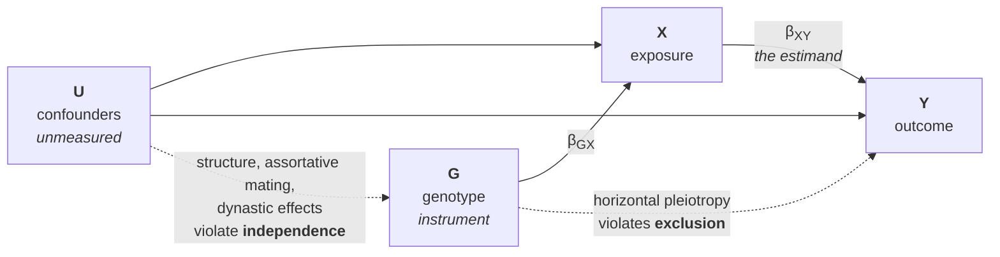
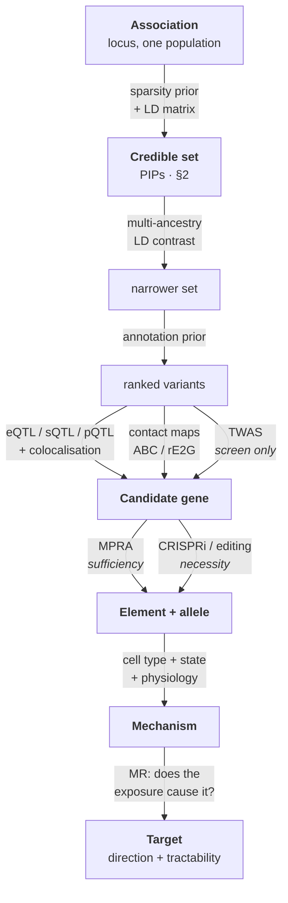

# 52 — From association to mechanism

> **Before this:** [Ch 51 — GWAS](51-gwas.md) ·
> [Ch 29 — Linkage disequilibrium](../part-05-population-genetics/29-linkage-disequilibrium.md) ·
> [Ch 22 — Eukaryotic transcriptional regulation](../part-04-gene-regulation/22-eukaryotic-transcriptional-regulation.md) ·
> **Time:** ~55 min
>
> **Statistics needed:** [S1 Probability](../part-S-statistics/S1-probability.md) ·
> [S4 Hypothesis testing](../part-S-statistics/S4-hypothesis-testing.md) ·
> [S5 Variance and regression](../part-S-statistics/S5-variance-and-regression.md) ·
> [S6 Likelihood and Bayes](../part-S-statistics/S6-likelihood-and-bayes.md)

The GWAS Catalog holds over a million reported associations. The number for which we can name the
causal variant, the gene, the cell type and the direction of effect is a very small fraction of
that. This chapter is about the gap, which is where the last two decades of human genetics went.

## What you'll be able to do

- Formulate fine-mapping as Bayesian variable selection under near-perfect collinearity, and state
  what a 95% credible set asserts and what it does not
- Derive the sample size needed to separate two candidate variants from their LD, and use it to
  explain why multi-ancestry data buys resolution that more of the same ancestry cannot
- Rank nearest-gene, eQTL, colocalisation, TWAS and chromatin evidence by what each establishes, and
  read `coloc` output without the standard misinterpretation
- Distinguish the sufficiency claim an MPRA tests from the necessity claim a CRISPR perturbation
  tests, and say which a clinical interpretation needs
- Give the current explanations for why eQTLs fail to account for most disease loci, including the
  selection argument
- State the three instrumental-variable assumptions behind Mendelian randomisation, name the
  untestable one, and read a sensitivity analysis

## The core idea

A Manhattan-plot peak is a claim about a *region*, in *one population*, at *one moment in that
population's history*. Which base, which gene, which cell, which direction — all of it is recovered
afterwards, and each recovery is a separate inference with its own assumptions.

The difficulty is structural. Recombination has shattered chromosomes into haplotype blocks
([Ch 29](../part-05-population-genetics/29-linkage-disequilibrium.md)), and within a block every
variant is a near-copy of every other: a design matrix whose columns correlate at 0.95 and above,
from which you must pick the column carrying the effect. Then work out which of the ten or thirty
genes within a megabase it acts on — and roughly 90% of lead variants lie outside protein-coding
sequence, so the answer is almost never in the codon table.

> **An association identifies a set of variants that are statistically indistinguishable given the
> recombination history of your sample. Localisation is not a measurement you can improve by
> collecting more of the same data; it is bounded by how much recombination occurred, in the
> population you sampled, since the causal allele arose.**

Everything below imports information from *outside* the association: from populations with different
recombination histories, from annotation, from expression, from contact maps, and finally from
experiments that perturb the genome and watch.

---

## 1. The shape of the problem

One genome-wide-significant peak gives you 50–500 variants whose p-values lie within a few orders of
magnitude of each other over 20–200 kb, and three distinct questions:

| Question | What it asks | Where the information comes from |
|---|---|---|
| **Which variant?** | Which correlated variant carries the effect | Recombination history: sample size, and above all LD contrast |
| **Which gene?** | Whose activity the variant alters | Expression, chromatin, contact, perturbation |
| **Which context?** | Which cell type, state and developmental window | Cell-type- and stimulus-resolved assays |

Solving one does not solve the others: you can pin the variant to a single base and have no idea
what it does. The third question is the one most analyses skip, because the affordable assay is a
bulk tissue from an adult post-mortem donor while the answer may live in a stimulated immune cell or
a fetal neuron.

## 2. Fine-mapping is variable selection under near-perfect collinearity

Write the additive model over the *m* variants in the region, on standardised genotypes:

$$y = \mathbf{X}\boldsymbol{\beta} + \epsilon, \qquad \mathbf{X}^\top\mathbf{X}/n = \mathbf{R}$$

**R** is the LD matrix from [Ch 29](../part-05-population-genetics/29-linkage-disequilibrium.md), and
it is near-singular, so the OLS solution is numerically meaningless. The marginal statistics you
actually have — a GWAS reports one regression per variant, not a joint fit — relate to the joint
effects by

$$\hat{\mathbf{z}}_{\text{marginal}} \approx \mathbf{R}\,\mathbf{z}_{\text{joint}}$$

and inverting that means inverting the ill-conditioned object. Better linear algebra does not help.
A **sparsity prior** does — the assumption that only a handful of variants in the region have
non-zero effects.

Put a prior on configurations $\gamma$ (which subset is causal) and on effect sizes, compute each
configuration's marginal likelihood, and get a posterior over configurations. Two summaries fall out:
the **posterior inclusion probability** (PIP) of variant *j*, the total posterior mass of
configurations containing *j*; and the **credible set**, the smallest set whose PIPs sum to ≥ 0.95.

> **Statistics:** priors, marginal likelihoods and Bayes factors — the machinery this section
> assumes — are in [S6](../part-S-statistics/S6-likelihood-and-bayes.md) §5, with §6 on why a
> credible set is not a confidence interval and §7.4 running this exact PIP calculation on real LD.

The simplest version assumes exactly **one** causal variant, collapsing the space from $2^m$ to $m$.
With Wakefield's approximate Bayes factor, prior effect variance *W* and squared standard error *V*:

$$\mathrm{ABF}_j = \sqrt{\frac{V}{V+W}}\;\exp\!\left(\frac{z_j^2}{2}\cdot\frac{W}{V+W}\right), \qquad \mathrm{PIP}_j = \frac{\mathrm{ABF}_j}{\sum_k \mathrm{ABF}_k}$$

Since *V* and *W* barely vary within a region, **the PIPs are a softmax over $z_j^2/2$** — a
temperature-scaled softmax of the chi-square statistics, and nothing more.

Relaxing the one-variant assumption matters, because allelic heterogeneity is common and a two-signal
locus fitted with a one-signal model returns a credible set centred on a compromise variant causal
for neither. **Stochastic search** (FINEMAP and relatives) explores the $2^m$ space with a shotgun
search allowing up to *L* causal variants, paying for its generality in compute. **Sum of single
effects** (SuSiE) instead decomposes $\boldsymbol{\beta} = \sum_{l=1}^{L}\boldsymbol{b}_l$ with each
$\boldsymbol{b}_l$ holding one non-zero entry, fitted variationally as *L* single-variant fits on
residuals. Its pay-off is representational: **one credible set per signal**, so independent signals
appear as separate sets rather than blended, and the number of sets estimates how many there are.

Both have summary-statistics versions taking marginal *z*-scores plus a reference-panel LD matrix,
and that convenience introduces the commonest practical failure: **LD mismatch.** If the reference
**R** does not match the study sample — wrong population, wrong panel, a meta-analysis of cohorts
with different structure — the implied system is inconsistent, and the method resolves the
inconsistency by confidently nominating whichever variant explains the discrepancy. PIP 0.99 on the
wrong base, no warning. Diagnostics comparing each observed *z* against the value its neighbours
predict exist, and should be run every time.

### What a 95% credible set actually asserts

**Conditional on the model being right, there is 0.95 posterior probability that this set contains
the causal variant.** The conditions are load-bearing and all fail sometimes:

1. The causal variant is *in the analysed data*. A structural variant, or one absent from the
   imputation panel, cannot receive posterior mass; the mass lands on its best tag instead.
2. The effect is additive, and the true number of causal variants is within *L*.
3. The LD matrix is correct for this sample, and the prior over which variants are causal (§4) is
   correct.

Note what it does not say. A variant with PIP 0.2 is not "20% causal", it holds a fifth of the
posterior. It is not a frequentist confidence set and carries no coverage guarantee. A singleton set
at PIP 0.99 is a statement about a model, not a demonstration; the demonstration is §10.

## 3. Resolution is a property of LD, not of your method

> **Statistics:** the non-centrality parameter λ, and why power is a function of λ rather than of
> effect size alone, are covered in [S4](../part-S-statistics/S4-hypothesis-testing.md) §4.

Let the causal variant *c* explain fraction $R^2_c$ of trait variance, so its non-centrality is
$\lambda_c = N R^2_c$
([Ch 32](../part-06-quantitative-genetics/32-mapping-quantitative-traits.md)). A candidate *t*
correlated with it at $r$ has $\mathbb{E}[z_t^2] = r^2\lambda_c$
([Ch 29](../part-05-population-genetics/29-linkage-disequilibrium.md) §5). From the softmax above,

$$\mathbb{E}\!\left[\log \frac{\mathrm{BF}_c}{\mathrm{BF}_t}\right] \approx \frac{z_c^2 - z_t^2}{2} = \frac{(1-r^2)\,N R^2_c}{2}$$

Demand a Bayes factor of at least *B* and solve for *N*:

$$\boxed{\;N \;\ge\; \frac{2\ln B}{(1-r^2)\,R^2_c}\;}$$

Take $B = 20$ (so $2\ln B \approx 6$) and a strong locus explaining 0.34% of trait variance:

| $r^2$ with the causal variant | *N* required to separate |
|---:|---:|
| 0.90 | 17,500 |
| 0.99 | 175,000 |
| 0.999 | 1,750,000 |
| 1.000 | **impossible at any *N*** |

For a *median* locus explaining 0.02% of variance, multiply every row by 17. The last row is not
hyperbole: two variants in perfect LD produce identical genotype columns, and no amount of data
distinguishes identical columns. **Sample size buys resolution linearly; LD costs it as
$1/(1-r^2)$** — which is why GWAS sample sizes grew by two orders of magnitude over the last decade
while credible-set sizes shrank by far less.

### Why multi-ancestry samples are the efficient fix

$r$ is a population parameter. Two variants in perfect LD in one population may sit at $r^2 = 0.6$ in
another, because the populations have different recombination and demographic histories. Populations
of African ancestry have larger long-term effective size and did not pass through the out-of-Africa
bottleneck, so their LD blocks are roughly half as long — about 11 kb against 22 kb
([Ch 29](../part-05-population-genetics/29-linkage-disequilibrium.md) §8). Shorter blocks mean
sharper $r^2$ contrasts between neighbours, which is exactly the denominator in the boxed formula.
Combining ancestries adds a second constraint: the causal variant is associated in *all* of them, a
tag only where it happens to be correlated. SuSiEx, MESuSiE and MultiSuSiE model per-population
effect sizes with shared causal status, differing in how much they let magnitudes vary — a real
choice, since the shared-causal-variant assumption fails where a locus has population-specific
causal alleles.

Three things must be said plainly. **Genetic ancestry is not race:** ancestry is a continuous,
measurable property of a genome, estimated from data and varying within any social category, while
race is a social classification that varies between countries and over time. The argument above
concerns recombination histories and does not transfer to social categories. **The advantage is
demographic, not qualitative** — African-ancestry haplotypes are more finely shattered because more
generations of recombination have acted on a larger population. And **the under-representation of
non-European samples is a sampling failure with consequences**, costing the field resolution it could
have had on top of producing polygenic scores that transfer badly
([Ch 53](53-polygenic-scores.md)). Fixing it means building cohorts *with* the communities involved,
with governance and benefit-sharing attached, not extracting samples because the LD is convenient
([Ch 58](../part-12-applications-and-ethics/58-ethics-and-society.md)).

## 4. Functional annotation as a prior

The uniform prior over variants is obviously wrong: open chromatin in a trait-relevant cell type
beats a closed heterochromatic desert. So replace it with

$$\pi_j \;\propto\; \exp\!\left(\sum_k a_k \, A_{jk}\right)$$

where $A_{jk}$ are annotations of variant *j* and the weights $a_k$ are estimated **genome-wide**
from the enrichment of association signal in each annotation, then applied locally. PAINTOR, fgwas
and PolyFun-style approaches do this, and credible sets shrink, because the prior breaks ties the
likelihood cannot.

Three cautions, all consequences of it being a prior. It **cannot create information** about which
variant is causal, only reweight the survivors — a flat likelihood plus a confident prior returns the
prior. It is **circular if the annotation came from the same trait**. And every PIP is now
**conditional on the annotation model**, so two groups with different annotation stacks report
different credible sets from identical summary statistics, both correctly.

## 5. Variant to gene: the nearest gene is a weak default

The nearest gene is used because it is free and right often enough to feel safe. Estimates of how
often range from about a third to about two thirds depending on the benchmark — and the benchmarks
are themselves biased, since a gold-standard set is assembled from loci where somebody already found
the answer, which over-samples loci where the answer was findable, which over-samples coding and
proximal mechanisms. The honest summary: **nearest-gene is a strong baseline that good models beat,
and it is wrong often enough that building on it unchecked will mislead you at a large minority of
loci.** The reasons are mechanistic, from
[Ch 22](../part-04-gene-regulation/22-eukaryotic-transcriptional-regulation.md):

- Enhancers act over distances up to ~1 Mb and routinely **skip** intervening genes.
- Their reach is shaped by TAD boundaries as much as by linear distance
  ([Ch 50](../part-10-functional-genomics/50-3d-genome.md)): boundaries reduce cross-boundary
  regulation without abolishing it — acute cohesin or CTCF depletion blurs TADs while changing
  transcription only modestly and selectively — so contact frequency is a better metric than distance,
  not a sufficient one.
- Gene density varies by an order of magnitude. At a dense locus "nearest" is near a coin flip; in a
  gene desert the answer may be 800 kb away.
- A variant can sit *inside* one gene — intron, 3′ UTR, even a neighbour's coding sequence — and
  regulate another, which makes the linear annotation actively misleading.
- The effect may not be on expression level at all: splicing, transcript stability, translation and
  protein-level effects can leave the transcript count untouched.

Machine-learning integrations — Open Targets' locus-to-gene model is the reference implementation —
take distance, fine-mapping output, QTL colocalisation, chromatin interaction and functional
predictions as features and train against a curated gold standard. The output is a calibrated score,
which is the right format: **a locus-to-gene score is a prioritisation, and prioritisation is what
you do before an experiment, not instead of one.**

## 6. eQTLs, and what they can and cannot see

An **eQTL** is a variant whose genotype associates with a gene's expression level. Run
[Ch 47](../part-10-functional-genomics/47-rna-seq.md)'s pipeline on a few hundred people, normalise,
correct for hidden confounders (PEER/PCA factors, which absorb batch and cell composition), and
regress expression on genotype gene by gene.

The operational definition of *cis* is "within some window of the transcription start site",
conventionally 1 Mb; the mechanistic definition is "acting on the same physical chromosome copy",
testable as allele-specific expression in heterozygotes and the cleaner claim. *Trans* is everything
else, necessarily through a diffusible intermediate. The asymmetry is structural:

| | *cis*-eQTL | *trans*-eQTL |
|---|---|---|
| Tests per gene | ~10⁴ variants in the window | ~10⁷ genome-wide |
| Total tests | ~10⁸ | ~10¹¹ |
| Effect size | Often large — one enhancer allele on one promoter | Small: mediated through a chain, each step lossy |
| Detected in | A few hundred samples | Tens of thousands |
| Main artefact | Reference bias in allele-specific reads | **Cell composition** — a variant shifting blood cell proportions creates thousands of apparent trans effects |

GTEx is the reference *cis* resource: on the order of 50 tissue sites from close to a thousand
post-mortem donors, the v10 release adding roughly a quarter more samples to the QTL analyses than
v8. For *trans* you need depth in one tissue — a meta-analysis of 31,684 blood samples (eQTLGen phase 1,
Võsa *et al.* 2021) reports cis-eQTLs for about 88% of tested genes, and, for the ~10,000
trait-associated variants it could afford to test in *trans*, trans-eQTLs for roughly a third of them —
invisible at GTEx sample sizes. Phase 2 extends this to a genome-wide *trans* scan in a larger sample
and is not yet published.

Two things to carry. **Tissue specificity is oversold as an explanation:** many cis-eQTLs are shared
across most tissues, and finding one only in liver may mean it acts only in liver, or that liver had
the sample size. **Bulk tissue dilutes:** a variant acting in 2% of the cells produces roughly 2% of
the true effect in bulk, and non-centrality falls by the square of that. Single-cell eQTL studies
([Ch 48](../part-10-functional-genomics/48-single-cell-and-spatial.md)) attack this directly.

## 7. Colocalisation: state the question precisely

You have a GWAS signal and an eQTL signal in the same 200 kb. The question people *ask* is "do they
overlap?" The question that matters is:

> Do the two traits share a **causal variant**, or do they have **different causal variants** that
> both happen to sit inside the same LD block?

Naive checks cannot separate these. Testing whether the GWAS lead SNP is a nominally significant eQTL
is anti-conservative: LD blocks hold hundreds of correlated variants, expression is a heavily tested
phenotype, and the chance that *some* eQTL signal spans the block is not small. You will confidently
assign genes that have nothing to do with the trait.

The `coloc` framework makes the hypotheses explicit, enumerating five mutually exclusive
possibilities under a one-causal-variant-per-trait assumption. Posteriors come from summing
approximate Bayes factors over single-variant configurations, with priors $p_1$, $p_2$ and $p_{12}$
for a variant being causal for trait 1 only, trait 2 only, or both:

| | Hypothesis | Interpretation |
|---|---|---|
| **H₀** | No causal variant for either | Region null for both |
| **H₁** | Trait 1 only | GWAS signal, no eQTL |
| **H₂** | Trait 2 only | eQTL, no GWAS signal |
| **H₃** | **Distinct** causal variants | Both signals real, mechanistically unrelated — LD coincidence |
| **H₄** | **Shared** causal variant | The evidence you wanted |

Reading the output is most of the skill:

- **PP4 is the quantity of interest**, and PP4/(PP3+PP4) is the conditional statement "given both
  traits have a signal here, they share it".
- **Low PP3 *and* low PP4 means underpowered, not "no colocalisation".** If PP0/PP1/PP2 dominates,
  one trait has no detectable signal. This is the commonest misreading in the literature.
- **$p_{12}$ drives the answer.** The default $10^{-5}$ is a guess; report sensitivity to it.
- **The one-variant assumption breaks both ways.** A locus with two independent GWAS signals, one
  colocalising, can be pushed toward H3 by the other. Colocalising per SuSiE credible set (coloc +
  SuSiE), or combining both traits' fine-mapping posteriors (eCAVIAR's CLPP), handles it.

**SMR** reaches the same question from the other side, estimating the effect of expression on the
trait using the eQTL as an instrument (§12) and applying the **HEIDI** test, which asks whether the
GWAS/eQTL effect-size ratio is heterogeneous across the region. It should not be if one variant
drives both, so heterogeneity argues for two distinct causal variants.

## 8. TWAS: a gene-level test that is not a causal test

Train a predictor of a gene's expression from its cis variants in a reference panel, apply the
weights to a GWAS cohort to get *genetically predicted expression*, and test that against the trait.
With summary statistics only, this reduces to a weighted sum of marginal GWAS *z*-scores:

$$z_{\text{TWAS}} = \frac{\mathbf{w}^\top \mathbf{z}_{\text{GWAS}}}{\sqrt{\mathbf{w}^\top \mathbf{R}\, \mathbf{w}}}$$

The appeal is obvious: it aggregates signal across the window, cuts the testing burden from millions
of variants to tens of thousands of genes, and reports in the currency of genes. So is the problem —
**it is a linear combination of the same GWAS statistics.** Two failure modes follow directly.
**LD confounding:** a hit arises whenever the causal variant correlates with variants that happen to
receive weight, whether or not the gene mediates anything. **Co-regulation:** neighbouring genes
share regulatory variants, so their weight vectors are correlated and hits arrive in blocks of
adjacent genes, with the top-ranked one determined by which prediction model put more weight near the
causal variant — a property of the reference panel's size and the gene's cis-heritability, not of
biology.

The empirical work is unambiguous: TWAS significance does not imply causality, and at loci with a
known answer TWAS frequently ranks a bystander first. Treat it as a **screen that must be followed by
colocalisation and then by perturbation**. The same caveat applies to any method imputing a molecular
intermediate — the imputation inherits the LD structure it was built on.

## 9. Physical evidence: contacts, and activity-by-contact

Conformation assays ([Ch 50](../part-10-functional-genomics/50-3d-genome.md)) tell you which regions
are near each other in three dimensions. The evidence is weak on its own: contact maps average over
millions of cells, resolution is typically coarser than an enhancer, and proximity is nearer a
necessary condition than a sufficient one — TAD-mates contact each other constantly without
regulating each other.

The **activity-by-contact** model is the idea that makes contact data predictive:

```
                       A_E  ×  C_{E,G}
ABC(E, G)  =  ─────────────────────────────────
               Σ over all elements e near G of
                       A_e  ×  C_{e,G}
```

`A` is element activity — in practice the geometric mean of an accessibility signal and H3K27ac
([Ch 49](../part-10-functional-genomics/49-epigenome-profiling.md)) — and `C` is contact frequency.
Two measurements, one product, one normalisation, essentially no parameters fitted to the target, and
it substantially outperforms distance- and correlation-based predictors when benchmarked against
CRISPR perturbations.

The normalisation is the part worth understanding. Dividing by the sum over *competing* elements
encodes that a promoter has finite capacity and enhancers compete for it: a moderate element in a
quiet neighbourhood can matter more than a strong one among stronger rivals. That is a mechanistic
hypothesis embedded in a scoring function, and it is why the model generalises better than a purely
statistical one. Supervised successors — the ENCODE-rE2G family — add features and train directly on
CRISPR perturbation outcomes, producing element-to-gene maps across more than a thousand biosamples.
The pattern is worth noting: **mechanistic prior, then perturbation data, then supervised
refinement.**

## 10. Sufficiency and necessity are different experiments

At some point you stop scoring and start perturbing. Two families dominate, and confusing their
logical claims is the commonest interpretive error in functional follow-up.

**MPRAs test sufficiency.** Synthesise both alleles of each candidate element as a short
oligonucleotide (150–250 bp), clone each upstream of a minimal promoter and a barcoded reporter,
transfect the pool, sequence barcodes in RNA and in input DNA, take the ratio. Thousands to millions
of allele pairs at once; variants with reproducible allelic differences are *expression-modulating
variants*. **STARR-seq** is the same logic with the candidate in the reporter's 3′ UTR so the element
is its own barcode. The claim tested is: *this 200 bp, removed from chromatin and placed on an
episome, drives transcription differently depending on which allele it carries, in this cell type.*
Real and useful — and not a claim about the endogenous locus.

**CRISPR perturbation of the endogenous element tests necessity.** Tile guides across the region and
silence it with dCas9–KRAB (CRISPRi), delete it with Cas9, or install the specific allele by base or
prime editing ([Ch 38](../part-08-methods/38-genome-editing.md)). Read out by FlowFISH, by
whole-transcriptome single-cell sequencing (Perturb-seq, CROP-seq), or by a selectable phenotype.

| | MPRA / STARR-seq | CRISPRi / deletion | Base or prime editing |
|---|---|---|---|
| Logical claim | Sufficiency of the sequence | Necessity of the element | Necessity of the **allele** |
| Context | Episomal, out of chromatin | Endogenous | Endogenous |
| Resolution | The exact variant | ~1 kb (KRAB spreads) | Single base |
| Throughput | 10⁴–10⁶ variants | 10³–10⁴ elements | 10¹–10³ edits |
| Main failure | Chromatin-dependent elements score null | Redundant enhancers score null | Low efficiency, bystander edits |

The two dissociate constantly, informatively. **Sufficient but not necessary:** enhancers are
frequently redundant, so deleting one changes little. **Necessary but not sufficient:** an element
requiring specific nucleosome positioning, a pioneer factor, or a long-range contact is inert on a
plasmid and essential in situ. Only an experiment installing **the specific allele in the correct
cell type and state** tests the claim a clinical interpretation relies on, which is why prime editing
at scale is the direction of travel despite being the lowest-throughput row.

**And the context choice is the hard part.** A regulatory variant may act only in a stimulated
macrophage, only in a beta cell at high glucose, only in a state that exists for three weeks in the
second trimester. Screening in an immortalised line expressing none of the relevant transcription
factors is not a negative result; it is a non-experiment. Response-eQTL designs — genotyped cells
profiled before and after stimulation — exist for exactly this reason, and routinely find variants
with no baseline effect and a large post-stimulus one.

## 11. The missing-regulation problem

Across studies, only about **5–40% of trait associations colocalise with an eQTL**, depending on
trait, tissue panel and threshold. In the most careful test — taking gene–trait pairs where a
*coding* variant already proves which gene is involved, then asking whether the non-coding
associations at the same gene are explained by expression — colocalisation, TWAS and regulatory
annotation together nominated a candidate target for **fewer than 10%** of the non-coding variants,
and baseline expression explained the association for roughly 8% of the genes.

The regulatory hypothesis for complex traits is almost certainly correct
([Ch 00](../part-00-orientation/00-the-whole-story.md) §3). The eQTL catalogues we have do not
demonstrate it. The current explanations, none excluding the others:

| Explanation | The argument | What would fix it |
|---|---|---|
| **Wrong cell type** | The effect occurs in a minority population within a bulk tissue and is diluted | Single-cell eQTL at donor scale |
| **Wrong state** | The variant acts only after stimulus, infection, drug or metabolic challenge | Response-eQTL designs |
| **Wrong time** | The effect is developmental; the trait is set before the sampleable tissue exists | Organoids, fetal atlases, cross-species models |
| **Wrong molecular phenotype** | The effect is on splicing, stability, translation or protein level, not steady-state mRNA | sQTLs, ribosome profiling, pQTLs |
| **Trans and network effects** | Effects propagate through networks; each link is tiny ([Ch 32](../part-06-quantitative-genetics/32-mapping-quantitative-traits.md) §11) | Very large single-tissue cohorts |
| **Selection** | See below | Rare-variant and burden approaches; better-powered eQTLs in constrained genes |

The selection argument says the mismatch is *expected* rather than technical. Genes whose dosage
matters for a trait are, by that fact, under purifying selection on expression, so a common variant
with a large effect on such a gene would have been removed; what survives at common frequency near
constrained genes is small-effect regulatory variation. eQTL studies, meanwhile, most easily find
large expression effects, concentrated near the transcription start sites of genes whose expression
is *not* constrained. Comparisons of the two hit sets bear this out: eQTL hits cluster tightly at
TSSs and GWAS hits do not; genes near GWAS hits are constrained with complex cell-type-specific
regulatory landscapes, and genes near eQTLs are the opposite.

**The property that makes a gene matter for disease is the property that makes its expression
variation rare.** eQTL discovery power and complex-trait relevance are anticorrelated by
construction — so the gap will narrow with better-resolved eQTL studies, but slowly, and not merely
by adding donors to bulk tissue panels.

## 12. Mendelian randomisation

A different use of the same variants: not "what does this locus do" but "does exposure *X* cause
outcome *Y*". Observational epidemiology cannot answer that, because of confounding and reverse
causation. MR uses genotype as an **instrumental variable**.

> **Statistics:** confounding, what "controlling for" a covariate actually removes, and the
> chance / confounding / reverse-causation trichotomy this design exploits are covered in
> [S5](../part-S-statistics/S5-variance-and-regression.md) §6 and §8.



With one instrument the estimate is the **Wald ratio** $\hat\beta_{XY} = \hat\beta_{GY}/
\hat\beta_{GX}$. With many, the standard estimator is inverse-variance weighting, algebraically a
regression of SNP–outcome effects on SNP–exposure effects **through the origin**. Hold that picture:
each point is a variant, the slope is the causal estimate, and every diagnostic question is about the
scatter.

| | Assumption | Testable? | How it breaks |
|---|---|---|---|
| **IV1** | **Relevance** — *G* associated with *X* | Yes | Weak instruments. In two-sample MR the bias is toward the null; in one-sample MR toward the confounded observational estimate — opposite directions, which is why the designs are not interchangeable |
| **IV2** | **Independence** — *G* ⫫ confounders of *X*–*Y* | Partly | Population structure; assortative mating; **dynastic effects**, where the parent's genotype acts through the environment they provide. "Alleles are randomised at meiosis" holds *within families* and only approximately between them |
| **IV3** | **Exclusion** — *G* affects *Y* only through *X* | **No** | **Horizontal pleiotropy**: the variant affects *Y* by another route |

Pleiotropy is not exotic. Genes are pleiotropic as a rule
([Ch 08](../part-01-molecular-foundations/08-proteins-and-gene-function.md)), and a variant selected
for strongly moving a biomarker is exactly the kind likely to move other things. The sensitivity
analyses seek robustness under *different* assumptions: **MR-Egger** fits a free intercept estimating
average directional pleiotropy (valid under the unverifiable InSIDE condition, and underpowered); the
**weighted median** is consistent if half the weight comes from valid instruments, the **weighted
mode** if the largest cluster is; **MR-PRESSO** detects and removes outlying instruments, which is
data-driven and post hoc: it assumes most instruments are valid, and because it selects on the
residuals it can manufacture apparent consistency and delete instruments that are valid but merely
imprecise — pre-specify the removal rule and report the estimate with and without it;
**Steiger filtering** drops instruments more
associated with the outcome than the exposure; and colocalising each instrument with the exposure
catches instruments tagging something else.

None of these tests IV3 — each checks that a *specific class* of violation is absent. The honest
reading of an MR paper is: do estimators with different, non-nested assumptions agree? Agreement is
the evidence; a single point estimate is not.

Two limits get skipped. **MR estimates a lifelong effect** — the instrument shifts the exposure from
conception, a drug shifts it for five years at 60, and these can differ in magnitude and occasionally
in sign. And **MR is an observational design**, without a trial's warrant. Its record is nonetheless
good, and includes its most valuable use: predicting failure. MR of LDL cholesterol on coronary
disease predicted benefit, and statin, ezetimibe and PCSK9 trials delivered it with broadly
consistent slopes; MR of HDL cholesterol predicted no benefit from raising it, against strong
observational evidence, and the trials that raised HDL failed. That asymmetry — MR overturning an
observational association, correctly — is what a good instrument is for.

## 13. What this is all for: genetically supported targets

Drug development is dominated by failure — roughly one in ten programmes entering clinical
development reaches approval, and most failures are efficacy failures, which is to say failures of
the causal hypothesis. Genetics offers a way to test that hypothesis before spending a decade.

Mechanisms with human genetic support are about **2.6 times more likely** to progress from phase I to
approval than those without (Minikel et al., *Nature*, 2024), refining an earlier estimate of roughly
twofold. Two details matter more than the headline. The advantage **grows with confidence in the
causal gene** — it is not "there is a GWAS hit nearby", it is "we know which gene", so sections 5–10
are, in commercial terms, how the multiplier is earned. And it is **largely unaffected by the
variant's effect size or allele frequency**: surprising, then obvious, since a drug perturbs a target
far harder than any common allele does, so a variant with an odds ratio of 1.03 can nominate a target
worth hitting. Genetics supplies the target's *identity* and the *direction* of the desired
perturbation, not a dose–response curve — and no molecule, modality, delivery route or safety
profile. It raises a prior. Where the prior is 10%, that is worth a great deal.



---

## Common misconceptions

| What people think | What's actually true |
|---|---|
| The lead SNP is the causal variant | It is the best-correlated genotyped marker. Which block member tops the list is close to sampling noise ([Ch 29](../part-05-population-genetics/29-linkage-disequilibrium.md)) |
| A 95% credible set gives each variant a 95% chance of being causal, and fine-mapping is assumption-free because it is data-driven | The *set* holds 0.95 posterior mass, conditional on a sparsity prior, an effect-size prior, a maximum number of causal variants, and an LD matrix matching the sample. Mismatched reference LD gives confident wrong answers with no error |
| Bigger GWAS will eventually resolve loci to single variants | Resolution scales as $N(1-r^2)$. Perfect proxies are indistinguishable at any *N*. LD contrast, not sample size, is the binding constraint |
| The nearest gene is usually the right gene | Right somewhere between a third and two thirds of the time depending on the benchmark — and benchmarks over-sample loci where the answer was easy to find |
| An eQTL at the locus identifies the gene | Only if the two signals share a *causal variant*. Overlap within an LD block is expected by chance; colocalisation is the test that distinguishes them |
| Low PP4 means the signals do not colocalise | Only if PP3 is high. Low PP3 *and* low PP4 means the region is underpowered for one trait — the commonest misreading of coloc output |
| A significant TWAS gene is the causal gene | TWAS is a weighted sum of the same GWAS z-scores. LD and co-regulation of neighbouring genes routinely make bystanders significant |
| An MPRA-positive variant is validated | MPRA tests whether the sequence is *sufficient* on an episome. Necessity in native chromatin is a separate experiment, and the two dissociate in both directions |
| No colocalising eQTL means the locus is not regulatory | Most loci have no colocalising eQTL. Wrong cell type, state, time and molecular phenotype all cause this — and selection makes the mismatch expected, not merely technical |
| MR is a natural randomised trial, and its sensitivity analyses check the exclusion restriction | MR is observational, rests on three assumptions of which one is untestable, and estimates a lifelong exposure effect. Sensitivity analyses test robustness to particular *classes* of violation under further assumptions; agreement across non-nested estimators is the evidence |

## Worked example: the 1p13.3 LDL-cholesterol locus

One locus, end to end. All coordinates **GRCh38**.

**Step 0 — the association.** A GWAS of plasma LDL cholesterol in *N* = 200,000 finds one of its
strongest peaks at 1p13.3. Take the lead variant's effect as 0.10 SD per allele at MAF 0.22 — a round
number chosen to keep the arithmetic legible, not the published figure, which is larger (Step 4).

$$\operatorname{Var}(G) = 2pq = 2(0.22)(0.78) = 0.3432, \qquad R^2_c = \frac{(0.10)^2(0.3432)}{1} = 0.003432$$

$$\lambda = N R^2_c = 200{,}000 \times 0.003432 = 686.4, \qquad z = \sqrt{686.4} = 26.2$$

A *p*-value near 10⁻¹⁵¹ and 0.34% of trait variance — an unusually strong locus, which makes the
fine-mapping *easy* by GWAS standards.

**Step 1 — fine-mapping.** Five candidates survive. Under the single-causal-variant model the PIPs
are a softmax over $z^2/2$ (§2):

```
variant   z       z²/2      Δ = z²/2 − max      exp(Δ)        PIP
v1      26.20   343.22        0.000            1.000000     0.827
v2      26.14   341.65       −1.570            0.208100     0.172
v3      25.95   336.70       −6.519            0.001473     0.001
v4      24.90   310.01      −33.215            3.7e−15      0.000
v5      22.40   250.88      −92.340            9e−41        0.000
                                        Σ =    1.209573
```

95% credible set = **{v1, v2}**, cumulative PIP 0.999.

Cross-check against §3. From $z_2/z_1 = 26.14/26.20$ the implied correlation is $r = 0.9977$, so
$r^2 = 0.9954$ and

$$\mathbb{E}\!\left[\log\frac{\mathrm{BF}_1}{\mathrm{BF}_2}\right] = \frac{(1-r^2)\lambda}{2} = \frac{0.0046 \times 686.4}{2} = 1.58$$

matching the 1.570 in the table. ✓ Settling it — a Bayes factor of 20 between v1 and v2 — requires

$$N \ge \frac{2\ln 20}{(1-r^2)R^2_c} = \frac{5.991}{0.0046 \times 0.003432} = 379{,}000$$

nearly double the cohort, for one of the strongest loci in the trait. Run the same locus at
*N* = 50,000, quartering every $z^2$, and the credible set becomes **{v1, v2, v3}** with PIPs 0.534,
0.361, 0.105 — quadrupling the sample removed exactly one variant. Whereas if $r^2$ between v1 and v2
is 0.72 in an African-ancestry sample, the same separation needs
$5.991/(0.28 \times 0.003432) \approx 6{,}200$ samples' worth of that contrast.

**Step 2 — variant to gene.** The fine-mapped variant is **rs12740374** (G>T) at
**chr1:109,274,968 (GRCh38)**:

```
chr1 (GRCh38)      109.25 Mb        109.28 Mb              109.31 Mb        109.40 Mb
                       │                │                       │                │
  CELSR2  ────────────────────────────► │                       │                │
  109,249,539 – 109,275,751  (+)        │                       │                │
                                ▲       │                       │                │
                       rs12740374       │                       │                │
                       109,274,968      │                       │                │
                       (in CELSR2 3′UTR)│                       │                │
                                        │◄──── PSRC1 ────┤      │                │
                                        109,284,107 – 109,279,053  (−)           │
                                                                │◄───── SORT1 ───────────┤
                                                                109,397,967 – 109,309,568  (−)
```

| Gene | Distance to the gene body | Distance to the TSS | Nearest-gene verdict |
|---|---:|---:|---|
| *CELSR2* | **0 bp** — the variant is **inside** its 3′ UTR | 109,274,968 − 109,249,539 = **25,429 bp** | winner by gene body |
| *PSRC1* | 109,279,053 − 109,274,968 = **4,085 bp** | 109,284,107 − 109,274,968 = **9,139 bp** | winner by TSS |
| *SORT1* | 109,309,568 − 109,274,968 = **34,600 bp** | 109,397,967 − 109,274,968 = **122,999 bp** | ignored by both |

Note that the two conventions disagree. *CELSR2* runs left to right on the + strand, so its TSS sits at
the far end from the 3′ UTR the variant lands in: nearest gene *body* says *CELSR2* at distance zero,
nearest *TSS* says *PSRC1*. This is the textbook case where "the nearest gene" is not one rule but two,
and picking between them decides the answer. Both are wrong.

**Step 3 — expression evidence, and why it was not enough.** Liver eQTL data show the variant
associated with expression of *CELSR2*, *PSRC1* **and** *SORT1*, and colocalisation confirms a shared
causal variant with the LDL-C signal — for all three. This is §8's co-regulation problem in its
purest form: three genes sharing a regulatory landscape, no ranking available from expression alone.
The eQTL layer narrows twenty candidates to three, then stops. Note also which tissue was needed: run
in whole blood — the default because blood is easy to collect — this is one of the strongest cis-eQTLs
on record, and it points hard at *CELSR2* and *PSRC1*, the two genes that turn out not to matter, while
the hepatic *SORT1* regulation that drives the trait is not what blood hands you. **The wrong tissue
does not return a null. It returns a confident nomination of the wrong gene.**

**Step 4 — the experiments that decided it.** *Sufficiency:* reporter assays carrying the two alleles
show allele-specific activity in hepatocyte lines, and binding experiments show why — the minor (T)
allele **creates a C/EBP transcription-factor binding site** that the major allele lacks. A single
base creating a binding site is the textbook mechanism from
[Ch 22](../part-04-gene-regulation/22-eukaryotic-transcriptional-regulation.md) §6, and no motif scan
would have been trusted alone. *Necessity:* over-express and knock down each of the three candidates
in mouse liver and measure plasma lipids — only *Sort1* moves LDL cholesterol. That experiment, not a
statistic, eliminated *CELSR2* and *PSRC1*. *Physiology:* hepatic sortilin alters VLDL secretion and
thereby plasma LDL. The minor allele creates the site, raises hepatic *SORT1*, and lowers LDL-C by
roughly 5.6 mg/dl per copy (≈0.17 SD; rs629301, Teslovich *et al.* 2010) — direction consistent at
every step.

**Step 5 — the chain, and its weakest link.**

```
association (1p13.3, LDL-C)
   → credible set {v1, v2}                      LD-bounded, model-dependent
   → rs12740374, chr1:109,274,968 (GRCh38)      reporter + binding evidence
   → hepatic enhancer, C/EBP site created       sufficiency, episomal
   → SORT1, TSS 123 kb away                     necessity, mouse liver
   → VLDL secretion → plasma LDL-C              physiology
   → LDL-C → coronary disease                   Mendelian randomisation + trials
```

Each arrow is a different kind of claim, and the chain is exactly as strong as its weakest link.
Every link here has direct experimental support, which is why this locus appears in every review —
and why it is *not* typical. For most of the million-plus catalogued associations, the chain stops at
the first or second arrow.

## Connections

- **Back to:** [Ch 51](51-gwas.md) supplies the association ·
  [Ch 29](../part-05-population-genetics/29-linkage-disequilibrium.md) supplies $r^2$, the quantity
  that bounds resolution ·
  [Ch 32](../part-06-quantitative-genetics/32-mapping-quantitative-traits.md) for non-centrality and
  polygenicity · [Ch 22](../part-04-gene-regulation/22-eukaryotic-transcriptional-regulation.md) for
  what a regulatory variant does mechanistically ·
  [Ch 47](../part-10-functional-genomics/47-rna-seq.md),
  [Ch 49](../part-10-functional-genomics/49-epigenome-profiling.md) and
  [Ch 50](../part-10-functional-genomics/50-3d-genome.md) for the measurements ·
  [Ch 38](../part-08-methods/38-genome-editing.md) for CRISPRi, base and prime editing
- **Forward to:** [Ch 53](53-polygenic-scores.md), where fine-mapped effects improve portability and
  the same LD structure causes the failure ·
  [Ch 54](54-rare-variants-and-mendelian-disease.md), where the variant-to-gene problem is usually
  solved by the coding sequence instead · [Ch 55](55-clinical-variant-interpretation.md), where
  functional evidence enters a formal framework and "the evidence is insufficient" becomes a
  reportable classification ·
  [Ch 57](../part-12-applications-and-ethics/57-genomics-in-practice.md) for target discovery
  downstream · [Ch 58](../part-12-applications-and-ethics/58-ethics-and-society.md) for the
  governance of the diverse cohorts §3 depends on

## Check yourself

**1. A locus has 40 variants; the lead has PIP 0.31 and the 95% credible set holds 9 variants over 14 kb. Your collaborator proposes quadrupling the GWAS. When does that work, and when is it wasted money?**

<details><summary>Answer</summary>

Quadrupling *N* quadruples $\lambda$, and the expected log Bayes factor separating the causal variant
from a competitor is $(1-r^2)\lambda/2$ — so the gain depends entirely on $1-r^2$ among credible-set
members.

It works when the set holds variants at $r^2 \approx 0.9$–0.98 with each other: those gaps sit just
below the resolving threshold, and 4× more $\lambda$ pushes several over. It is wasted when the set
is dominated by variants at $r^2 > 0.999$ with the lead, and strictly futile for any pair at
$r^2 = 1$ — identical genotype columns cannot be distinguished at any sample size. Then the money
belongs in a population with shorter LD here, or in functional experiments. Compute the pairwise
$r^2$ matrix among credible-set variants before deciding; it is cheap.

</details>

**2. A GWAS signal and a liver eQTL for gene *X* peak at the same variant, and the eQTL p-value at the GWAS lead SNP is 2 × 10⁻⁹. A colleague concludes the GWAS acts through *X*. What is wrong, and what test would you run?**

<details><summary>Answer</summary>

Sharing a lead SNP is not sharing a causal variant. Inside a block of 100+ correlated variants, two
independent causal variants — one for the trait, one for expression — each produce a signal across
the whole block, and their leads coincide often. The eQTL p-value at the GWAS lead tests "is there an
eQTL somewhere in this block", not "is it the same variant".

Run colocalisation and read PP3 (distinct) against PP4 (shared); report PP4/(PP3+PP4) and check
sensitivity to $p_{12}$. If the region plausibly holds more than one signal for either trait,
colocalise per credible set (coloc+SuSiE) or use a fine-mapping statistic such as CLPP — plain
coloc's single-variant assumption will otherwise push a genuinely colocalising secondary signal into
H3. And if PP3 and PP4 are both low, the answer is "underpowered", not "does not colocalise".

</details>

**3. An MPRA shows a strong allelic effect for a candidate variant; a CRISPRi tiling screen shows no effect of silencing that element on the nearby gene. Give two mutually exclusive explanations and an experiment that distinguishes them.**

<details><summary>Answer</summary>

MPRA tests sufficiency of 200 bp on an episome; CRISPRi tests necessity of the element in native
chromatin. They disagree for opposite reasons.

*Redundancy.* The element is a real enhancer of that gene, but other enhancers drive the same
promoter, so silencing one changes little. Distinguish by combinatorial perturbation — silence the
candidate together with the gene's other predicted elements and look for a super-additive drop.

*The reporter is reporting on something else.* The sequence is active out of context but does nothing
at this locus; it may regulate a different gene, or be inert in chromatin. Distinguish by reading out
the whole transcriptome under perturbation (Perturb-seq / CROP-seq) rather than one gene, and by
checking whether the element contacts the assumed promoter at all.

A warning rather than an explanation: if the assays used different cell types or states, they were
never testing the same claim.

</details>

**4. Two MR analyses of the same exposure–outcome pair report IVW estimates of 0.42 and 0.38. In the first, MR-Egger's intercept is 0.001 (p = 0.8) and the weighted median is 0.40. In the second, the intercept is 0.09 (p = 0.002) and the weighted median is 0.11. Which do you believe, and what does the second pattern indicate?**

<details><summary>Answer</summary>

Believe the first. IVW, Egger and weighted median agree, and they are consistent under different,
non-nested assumptions — IVW needs all instruments valid (or balanced pleiotropy), Egger allows
directional pleiotropy under InSIDE, the median needs half the weight valid. Agreement is the
evidence.

The second is a signature of directional horizontal pleiotropy. A non-zero Egger intercept says the
SNP–outcome effects do not pass through the origin: instruments affect the outcome in ways that do
not scale with their effect on the exposure. The median collapsing to 0.11 says that once a minority
of extreme instruments stop dominating the weighting, most of the apparent effect disappears — so the
IVW estimate of 0.38 is largely pleiotropic contamination.

This does not establish that the truth is 0.11; the median has its own assumption. The conclusion is
that IV3 is violated and no causal claim is supported as it stands. Next: colocalise each instrument
with the exposure, drop instruments in genes of known pleiotropic function, and if possible use only
instruments in the gene encoding the exposure (cis-MR).

</details>

**5. Only a minority of GWAS loci colocalise with an eQTL. Why does the selection argument make this expected rather than a technical shortfall — and what does it predict about which loci *will* colocalise?**

<details><summary>Answer</summary>

The two discovery processes ascertain different variants. eQTL studies detect large effects on
steady-state expression — but a variant with a large effect on a dosage-sensitive gene is under
purifying selection, so it is kept rare or removed. What stays common near constrained genes is
small-effect regulatory variation, undetectable in a few hundred donors, and the variants eQTL
studies do find concentrate near the TSSs of genes whose expression is *not* constrained. GWAS
meanwhile finds variants affecting the trait, and traits are affected by dosage-sensitive genes. The
two hit sets come from systematically different parts of the genome.

The prediction: colocalisation succeeds preferentially at loci acting through *less-constrained*
genes with simple regulatory architecture, and fails at exactly the loci with the largest biology. It
also predicts the fix is not more donors in bulk tissue — it is better resolution (cell type, state,
developmental stage), molecular phenotypes closer to the mechanism, and rare-variant and burden
evidence, which escapes the same ascertainment
([Ch 54](54-rare-variants-and-mendelian-disease.md)).

</details>
