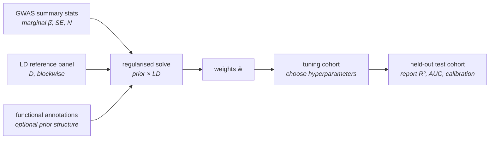

# 53 — Polygenic scores

> **Before this:** [Ch 51 — GWAS](51-gwas.md) ·
> [Ch 30 — Quantitative traits and variance](../part-06-quantitative-genetics/30-quantitative-traits.md) ·
> [Ch 29 — Linkage disequilibrium](../part-05-population-genetics/29-linkage-disequilibrium.md) ·
> **Time:** ~55 min
>
> **Statistics needed:** [S3 Estimation and error](../part-S-statistics/S3-sampling-and-estimation.md) ·
> [S5 Variance and regression](../part-S-statistics/S5-variance-and-regression.md) ·
> [S7 High-dimensional data](../part-S-statistics/S7-high-dimensional-data.md)

## What you'll be able to do

- Write a polygenic score as a weighted allele-dosage sum, and say precisely what each weight estimates
- Explain the two distinct reasons a naive sum over GWAS hits fails — LD double-counting and estimation noise — and read clumping+thresholding, LDpred, lassosum and PRS-CS as different priors on the effect-size distribution
- Convert a top-decile relative risk into an absolute risk given a prevalence, and explain why extreme-percentile odds ratios are a rhetorically inflated presentation of the same model
- Distinguish discrimination from calibration, and compute the AUC ceiling that a given liability-scale $R^2$ implies
- Name each mechanism of cross-ancestry portability failure, explain why it follows from *who was sampled* rather than from biology differing between groups, and say why accuracy decays with measured genetic distance rather than with a race label
- Say why the same estimator works far better for dairy cattle than for people

## The core idea

[Chapter 30](../part-06-quantitative-genetics/30-quantitative-traits.md) defined an
individual's **breeding value** as the sum of the average effects of the alleles it carries:
$A = \sum_j \alpha_j (X_j - 2p_j)$. That quantity was a theoretical device — you could
estimate its *variance* from relatives, but not its *value* for a person, because you could
not see the $\alpha_j$.

GWAS ([Ch 51](51-gwas.md)) estimates millions of $\alpha_j$ at once. A **polygenic score** is
the obvious next move: plug the estimates in and evaluate the sum.

The functional form is therefore not a modelling choice. Under an additive model the genetic
value *is* a weighted dosage sum, and there is nothing to design. Everything difficult lives
in the weights, and two features of genetics make them hard in a way that ordinary prediction
problems are not. The estimates are individually terrible — most are pure noise, and the
signal-to-noise ratio per variant is often below 10⁻³. And the predictors are strongly
correlated with each other by linkage disequilibrium, while each estimate was obtained from a
*separate univariate regression* that ignored the others. Add them up and you count the same
underlying signal once for every marker that tags it.

> **A polygenic score is not a measurement of a person. It is a prediction from a fitted
> model, and its accuracy is a property of the training data rather than of the person being
> scored.** The same DNA, scored with weights from two different cohorts, yields two
> differently reliable predictions. Nothing about the individual changed.

---

## 1. The estimator

$$\mathrm{PRS}_i \;=\; \sum_{j=1}^{M} \hat{w}_j\, x_{ij}$$

$x_{ij}$ is the **dosage** of the effect allele of variant $j$ in individual $i$: 0, 1 or 2
for a hard genotype call, or a real number in $[0,2]$ — the posterior expected dosage — when
the genotype was imputed ([Ch 29](../part-05-population-genetics/29-linkage-disequilibrium.md)).
$\hat{w}_j$ is a weight derived from GWAS: a regression coefficient for a quantitative trait,
a log odds ratio for a disease. Summing log odds ratios rather than odds ratios is what makes
the score additive on the scale the logistic model is linear in.

> **Statistics:** logistic regression, the logit scale, and why a coefficient there is a log
> odds ratio are covered in [S5](../part-S-statistics/S5-variance-and-regression.md) §7.

Three implementation facts that decide whether the number means anything:

**Missing genotypes must be mean-imputed to $2\hat{p}_j$**, not to zero. Setting them to zero
makes the score a function of the assay's failure pattern, which correlates with DNA quality,
batch and sometimes ancestry.

**The raw sum has no units.** It depends on $M$, on the allele-frequency spectrum of the panel
and on the trait's scale. Scores are reported as a *z*-score or percentile against a reference
sample — which means a PRS is a **rank statistic** until somebody chooses that reference, and
the choice of reference is where most of the trouble in §7 enters.

**Allele alignment is a real failure mode.** The effect allele in the summary statistics must
be matched to the effect allele in the target genotypes, on the same strand. A/T and C/G
variants are strand-ambiguous — their allele codes are self-complementary — and cannot be
resolved from the codes alone; the usual remedies are to match on allele frequency or to drop
them. And because the join is on `(CHROM, POS, REF, ALT)`, an indel written two valid ways
silently fails to match ([Ch 41](../part-09-genomics/41-data-formats.md)). A sign error on one
large-effect variant, or the loss of a few hundred through bad matching, degrades a score with
no error message anywhere.

## 2. Two things break the naive sum

### LD double-counting

A GWAS regresses the phenotype on **one variant at a time**. The coefficient it reports is
therefore a *marginal* effect, which absorbs the causal effects of everything the variant is
correlated with. With standardised genotypes,

$$\hat{\beta}^{\text{marg}}_j \;\approx\; \sum_k r_{jk}\,\beta^{\text{joint}}_k, \qquad\text{i.e.}\qquad \hat{\boldsymbol\beta}^{\text{marg}} \approx \mathbf{D}\,\boldsymbol\beta^{\text{joint}}$$

where $\mathbf{D}$ is the LD correlation matrix. Concretely: one causal variant, twenty
markers tagging it at $r = 0.95$, and a GWAS that reports twenty near-identical hits.

```
causal variant        ●  β = 0.10
tagging markers   ○ ○ ○ ○ ○ ○ ○ ○ ○ ○ ○ ○ ○ ○ ○ ○ ○ ○ ○ ○      r ≈ 0.95 to ●

marginal estimates    each ≈ 0.95 × 0.10 = 0.095
naive sum over all    20 × 0.095 = 1.90        ← 19× the true genetic contribution
correct answer                     0.10
```

The clean statement of the problem is that the ideal weights are the **joint** effects,
$\boldsymbol\beta^{\text{joint}} = \mathbf{D}^{-1}\hat{\boldsymbol\beta}^{\text{marg}}$, and
you cannot compute that. $\mathbf{D}$ is $M \times M$ with $M \sim 10^7$; you only have an
estimate of it from a reference panel of a few thousand chromosomes, so it is rank-deficient
and appallingly conditioned; and inverting an ill-conditioned matrix against a noisy
right-hand side amplifies precisely the noise you are trying to suppress.

**Every polygenic-score method is a regularised solution to that linear system.** Regularised
regression when predictors outnumber samples is covered in
[S7](../part-S-statistics/S7-high-dimensional-data.md) §6; this chapter assumes it.
What is genetics-specific is that the regulariser has to be chosen from a
belief about biology, and that $\mathbf{D}$ is block-diagonal in a useful way — LD decays, so
the matrix is banded and can be solved chromosome-block by chromosome-block.

### Estimation noise, and selection on it

Write $\hat\beta_j = \beta_j + e_j$. Two separate problems follow.

Including a variant whose true effect is zero contributes nothing to the signal and
$\mathrm{Var}(e_j)$ to the variance of the score. Since the overwhelming majority of variants
are null, a genome-wide unshrunken sum is mostly noise. Restricting to significant hits fixes
that but discards the enormous number of true effects sitting below genome-wide significance —
this is the whole reason a *p*-value threshold is a **bias–variance tradeoff**, and the reason
the optimal threshold is not a property of the trait. It moves with GWAS sample size and with
polygenicity, and must be tuned.

And selection makes the surviving estimates biased upward. Conditioning on $p < p_T$ conditions
on $|\hat\beta|$ being large, so $\mathbb{E}[\hat\beta \mid \text{selected}] > \beta$ —
the **winner's curse** ([Ch 32](../part-06-quantitative-genetics/32-mapping-quantitative-traits.md)).
Discovery effect sizes used as weights without shrinkage are systematically too big, and
systematically too big *for the variants the score leans on hardest*.

> **Statistics:** the bias–variance tradeoff, and why a deliberately biased estimator can beat
> an unbiased one, is in [S3](../part-S-statistics/S3-sampling-and-estimation.md) §2; the
> winner's curse is quantified in [S7](../part-S-statistics/S7-high-dimensional-data.md) §6.

## 3. Methods are priors on the effect-size distribution

Once you see the problem as regularised regression on summary statistics plus an LD matrix,
the zoo collapses. The methods differ in exactly one thing: **what they assume the
distribution of true effect sizes looks like.**

> **Statistics:** priors, posteriors and posterior means are covered in
> [S6](../part-S-statistics/S6-likelihood-and-bayes.md) §5, and the sense in which a penalty
> *is* a prior in [S7](../part-S-statistics/S7-high-dimensional-data.md) §6.

| Method | Prior on $\beta_j$ | Architecture it assumes | Tuned |
|---|---|---|---|
| **Clumping + thresholding (C+T)** | point mass at 0 below $p_T$; no shrinkage above | sparse; LD handled by *deleting* correlated markers | $r^2$, window, $p_T$ |
| **Infinitesimal / genome-wide ridge** | $\beta_j \sim \mathcal{N}(0, h^2/M)$ | every variant has a tiny effect | nothing ($h^2$ from data) |
| **LDpred / LDpred2** | point–normal: $\beta_j \sim \mathcal{N}(0, h^2/Mp)$ w.p. $p$, else 0 | a fraction $p$ of variants are causal | $p$ (or auto-estimated) |
| **lassosum / penalised regression** | Laplace ($L_1$) | sparse, with data-driven selection | $\lambda$, block shrinkage |
| **PRS-CS / continuous shrinkage** | global–local scale mixture, heavy-tailed | dense, but with a few large effects | global scale $\phi$ |
| **SBayesR / SBayesRC** | finite mixture of normals; RC adds annotations | mixed scales, functionally enriched | mixture weights |

Clumping+thresholding deserves respect rather than condescension: it handles LD by keeping the
lead variant in each clump ($r^2 < 0.1$ within a few hundred kb is typical) and dropping the
rest, which is a crude but effective answer to double-counting — though the surviving weight is
still a marginal effect and still winner's-cursed, so clumping removes the multiple counting
without removing the inflation. For genuinely sparse architectures it is hard to beat.

Ridge with a normal prior is the infinitesimal model made computational: the posterior mean
solves $(\mathbf{D} + \tfrac{M}{Nh^2}\mathbf{I})^{-1}\hat{\boldsymbol\beta}$, so the penalty is
**set by genetics rather than by cross-validation** — polygenicity over sample size times
heritability. LDpred
generalises it by admitting that not every variant is causal; lassosum swaps the Gaussian prior
for a Laplace one and inherits sparsity; PRS-CS abandons hard sparsity entirely and gives each
variant its own local scale drawn from a heavy-tailed distribution, so small effects are
crushed and large ones pass through almost unshrunk.

Which prior wins is an **empirical question about genetic architecture**, and the answer differs
by trait. Lipids, with large effects at *LPA* and *APOE*, and autoimmune disease, with the MHC,
reward sparse priors. Height, schizophrenia and educational attainment are hyper-polygenic and
reward continuous shrinkage. The best current methods also let the per-variant prior variance
depend on allele frequency — recall from Ch 30 that a locus contributes $2pq\alpha^2$, so
frequency and effect size are not independent — and on functional annotation, because causal
variants concentrate in coding sequence, conserved elements and cell-type-specific open
chromatin ([Ch 49](../part-10-functional-genomics/49-epigenome-profiling.md),
[Ch 52](52-association-to-mechanism.md)).



## 4. Training, tuning, testing — and how $R^2$ gets inflated

Three **disjoint** sets of people are required, and the discipline is the ordinary one with
one genetics-specific trap in it.

1. **Discovery** — the GWAS that produced the summary statistics.
2. **Tuning** — where hyperparameters ($p_T$, $\lambda$, $p$, $\phi$) are chosen.
3. **Test** — where performance is reported, once.

| Failure | What it does | Why it is easy to miss |
|---|---|---|
| Sample overlap between discovery and target | the score partly memorises the target phenotypes | biobanks are heavily re-used; overlap is often undocumented |
| Cryptic relatedness across sets | relatives share both genotype and environment | requires an explicit kinship filter, not a name check |
| Tuning on the test set | reports a maximum over hyperparameters as if pre-specified | the tuning step is often not described as one |
| Reporting full-model $R^2$ | age, sex and PCs carry most of it | a CAD model with age and sex alone reaches a C-statistic near 0.75 |
| Observed-scale $R^2$ in a case–control sample | depends on the case fraction you chose | two studies of the same score are then incomparable |

Only the **incremental** $R^2$ or the incremental C-statistic over a covariates-only model is
interpretable, and disease results must be converted to the **liability scale** before any two
of them are compared. The transformation — and the $P(1-P)$ term in it that divides out the
study's own case fraction — is at
[Ch 30 §2](../part-06-quantitative-genetics/30-quantitative-traits.md).

## 5. Discrimination, calibration, and the ceiling

For a quantitative trait the metric is incremental $R^2$, and its ceiling is the SNP
heritability $h^2_{\text{SNP}}$ ([Ch 31](../part-06-quantitative-genetics/31-heritability-and-selection.md)):
a score built from common variants cannot explain more variance than common variants tag.
Well-powered traits now reach roughly 60–80% of that ceiling in the ancestry they were
trained in.

For a disease, use the liability-threshold model. Let $S$ be the standardised score and
$\rho^2$ the fraction of **liability** variance it explains, so $L = \rho S + \sqrt{1-\rho^2}\,U$
with $U \sim \mathcal{N}(0,1)$ independent. With prevalence $K$, threshold $T = \Phi^{-1}(1-K)$,
$i = \varphi(T)/K$ (mean score-shift in cases) and $j = \varphi(T)/(1-K)$ (in controls),

$$\mathrm{AUC} = \Phi\!\left(\frac{\rho\,(i+j)}{\sqrt{\big(1-\rho^2 i(i-T)\big)+\big(1-\rho^2 j(j+T)\big)}}\right)$$

which is just "probability a case outscores a control" for two normals with the conditional
means and variances the threshold model implies.

| $\rho^2$ (liability) | AUC at $K=1\%$ | $K=5\%$ | $K=20\%$ |
|---:|---:|---:|---:|
| 0.02 | 0.607 | 0.586 | 0.570 |
| 0.05 | 0.667 | 0.636 | 0.611 |
| 0.10 | 0.731 | 0.691 | 0.657 |
| 0.20 | 0.815 | 0.766 | 0.722 |
| 0.30 | 0.870 | 0.820 | 0.773 |

Read the table before criticising any published AUC. A score that captured the *entire* SNP
heritability of a disease with $h^2_{\text{liability}} = 0.30$ and $K = 5\%$ would top out at
AUC 0.82. "Only 0.68" is not evidence of a bad method; it is close to the ceiling the biology
allows. The interesting question is always the ratio of achieved to attainable.

And then the distinction that most reporting elides:

> **Discrimination is about the ordering of people; calibration is about the number you tell
> one person.** AUC is invariant to any monotone transformation of the score, so a model can
> rank flawlessly and still assign 40% risk to people whose true risk is 4%.

Calibration is the property a decision needs — if the model says 12%, do about 12 in 100 go on
to develop the disease? It fails independently of discrimination, and it fails *first* when a
score moves to a new setting, because both the baseline risk and the score's own mean and
variance shift: different age structure, different prevalence, different ancestry composition.
A calibration plot and a decision curve say something an AUC cannot. Absolute risks should be
produced by re-estimating the baseline in the target population, never by transporting the
discovery model's intercept.

## 6. From score to risk

The same model gives the risk for an individual directly. Affected means $L > T$, so

$$\Pr(\text{affected} \mid S = s) \;=\; \Pr\!\left(\sqrt{1-\rho^2}\,U > T - \rho s\right) \;=\; \Phi\!\left(\frac{\rho s - T}{\sqrt{1-\rho^2}}\right)$$

Everything anyone reports about a polygenic score — decile relative risks, odds ratios per
standard deviation, "3× the population average" — is a summary of this one curve. Which
summary gets chosen is a rhetorical decision, not a statistical one, and the choices differ by
more than an order of magnitude. The worked example does the arithmetic.

Note the shape in advance: $\Phi$ is very flat in the tail, so when $K$ is small, large moves
in the score buy modest moves in absolute risk while producing enormous *ratios*. Rarer disease
means bigger relative risks and smaller absolute ones — from the same $\rho^2$.

## 7. Portability: the central limitation

A score trained on one population loses accuracy when applied to another, and the loss is
large. Prediction accuracy in individuals of African ancestry from European-trained scores runs
at roughly a fifth to a half of the accuracy achieved in Europeans, with South Asian and East
Asian ancestries falling in between. More informatively, accuracy declines **continuously with
genetic distance** from the training sample — there is no cliff at a population boundary, and
measurable decay is detectable even *within* a single ancestry group, where score performance
varies with age, sex and socioeconomic position. That gradient is the signature of a sampling
problem, and it is what you would predict.

Four mechanisms, all consequences of the score being fitted to *markers* in *one* sample:

| Cause | Mechanism | Effect on the score |
|---|---|---|
| **LD differences** | the weight was fitted for the tag–causal correlation $r$ in the discovery population; in the target, $r$ differs | the weight is applied to a marker that no longer tracks the causal variant; effects attenuate, and can reverse where LD phase flips |
| **Allele frequency differences** | a tag common in the discovery sample is rare or absent in the target | its $2pq$ contribution collapses toward zero; the score's mean and variance shift, breaking calibration even where ranking survives |
| **Effect-size heterogeneity** | $G{\times}E$ and epistasis; and $\alpha = a + d(q-p)$ is frequency-dependent by construction (Ch 30) | the estimand itself differs between populations, independent of any measurement problem |
| **Environment and trait definition** | different exposure distributions, diagnostic thresholds, ascertainment, access to care | the thing being predicted is not the same trait, so even perfect weights mispredict |

A fifth, easily forgotten: residual population stratification in the discovery GWAS puts a
non-causal component into the weights ([Ch 51](51-gwas.md)). That component is a property of
the discovery cohort's structure and does not transfer — it can transfer with the wrong sign.

Now the framing, because it is routinely got wrong.

**This is caused by who was sampled, not by biology differing between groups.** African
genomes have shorter LD blocks — the effective population size has been larger and there was
no out-of-Africa bottleneck, so more independent recombination events are represented in any
sample ([Ch 29](../part-05-population-genetics/29-linkage-disequilibrium.md))
— so a marker chosen for its correlation with a causal variant in Europeans is a worse proxy
there. That is a statement about *proxies*, not about the trait, the causal alleles, or the
people. Run the identical pipeline with an African-ancestry discovery cohort and the score
works there and degrades in Europeans. The asymmetry lives entirely in the data: European-
ancestry participants remain around 90% of everyone ever included in a GWAS, against roughly
16% of the world's population.

Two things follow. Portability failure is **fixable by recruitment**, and by nothing else
completely. And because polygenic scores are being proposed to allocate screening and
surveillance, deploying them at current accuracy delivers the least reliable predictions to the
people already least well served — **compounding health inequity** rather than being merely
neutral about it. That is an argument about deployment, not about the science.

One more distinction, non-negotiable: **genetic ancestry is a continuous, measurable quantity;
race is a social classification.** They are not interchangeable, they correlate only loosely,
and a portability result reported in terms of the second when it was measured in terms of the
first is a scientific error before it is anything else
([Ch 28](../part-05-population-genetics/28-structure-and-inbreeding.md),
[Ch 58](../part-12-applications-and-ethics/58-ethics-and-society.md)).

**What helps.** Multi-ancestry GWAS, which is both the fix and the bottleneck. Cross-population
Bayesian methods that couple effects across populations under a shared prior while modelling
each population's LD separately (PRS-CSx and its relatives; ensemble penalised-regression
approaches), which typically recover a substantial fraction of the lost accuracy for
under-represented groups without any new recruitment. Statistical fine-mapping to *causal*
variants ([Ch 52](52-association-to-mechanism.md)), because a causal effect transfers better
than a tagging correlation does — this is the principled fix. Local-ancestry-aware scoring in
admixed individuals, where a single global weight is wrong at each segment. And recalibration
of the score's mean and variance as a continuous function of ancestry PCs, which is worth
doing while remembering that **recalibration fixes calibration, not discrimination**: it makes
the number honest, not more informative.

## 8. What it is actually good for

### Risk stratification for screening

The realistic clinical use is as **one more term in a model that already exists**. For breast
cancer, a 313-variant score is incorporated into the BOADICEA risk model (delivered through the
CanRisk tool) alongside family history, reproductive and hormonal factors, mammographic
density, and rare pathogenic variants in *BRCA1*, *BRCA2* and *PALB2*
([Ch 54](54-rare-variants-and-mendelian-disease.md)); it shifts a meaningful minority of women
across a screening or prevention threshold. For coronary artery disease, adding a score to an
established clinical equation improves the C-statistic by a small increment — under 0.01 to a
few hundredths, depending on model and cohort.

The clinical question is not $R^2$. It is whether the score **moves anyone across a decision
boundary where the action changes**. A score with a worse AUC that reclassifies 10% of people
into a different screening interval is more useful than one with a better AUC that reclassifies
nobody. That is what randomised trials of risk-stratified screening are set up to answer, and
why "the score is significantly associated" was never the relevant endpoint.

### The instructive contrast: genomic selection in agriculture

The same estimator — a marker-weighted sum predicting a breeding value — transformed animal and
plant breeding. In US dairy cattle, genomic evaluation became official in 2009; bulls could then
be selected before progeny testing, the generation interval fell sharply, and the annual rate of
genetic gain in Holsteins roughly doubled ([Ch 31](../part-06-quantitative-genetics/31-heritability-and-selection.md)).
Nothing about the statistics is better. Everything about the setting is.

| | Livestock / crops | Human clinical prediction |
|---|---|---|
| Training vs target population | the same closed breed, re-trained every generation | one cohort, applied to everyone |
| LD structure | small $N_e$ → long, stable LD; markers tag well and tag the same way in the target | LD varies continuously with ancestry |
| Environment | controlled, recorded, deliberately uniform | uncontrolled, unmeasured, correlated with genotype |
| What is needed | an accurate *ranking* of candidates | a calibrated *absolute risk* for one person |
| Selection | direct, and the response is measured next generation | you can only advise |
| Intensity | extreme — one bull sires enormous numbers of offspring | not applicable |

> **The method is not the problem.** Polygenic prediction is a mature, validated technology.
> What limits it in humans is that we cannot match the training population to the target, cannot
> control the environment, and need a calibrated number for an individual rather than a correct
> ordering of candidates.

### Embryo selection

Preimplantation scoring of IVF embryos is sold commercially. The scientific case against
expecting much from it is arithmetic, and it starts from a fact about siblings.

Under additivity and linkage equilibrium, the variance of a polygenic score **among full sibs**
is half its variance in the population — sibs share half their genome in expectation — so the
within-family standard deviation is $1/\sqrt{2} = 0.707$ population SDs. Selecting the best of
$n$ embryos gains $\mathbb{E}[\max_n \mathcal{N}(0,1)] \times 0.707$ population SDs: **0.82 SD
for 5 embryos, 1.09 SD for 10**. That is the entire lever, and it is short because the
comparison is within a family rather than across the population.

Take the disease of the worked example ($K = 5\%$, $\rho^2 = 0.10$) and select the
lowest-scoring of five embryos in a family of average risk. Expected risk falls from 4.15% to
**2.4%** — a 43% relative reduction, an absolute reduction of 1.8 percentage points. The
calculation is generous in three ways that all push the true figure down: it uses the
population-level $\rho^2$, whereas within-family predictive power is measurably lower (part of
a score's between-family signal is population stratification and genetic nurture, neither of
which segregates between sibs); it treats the non-score component of liability as independent
between siblings when siblings share both alleles and rearing environment; and it assumes five
viable, biopsied, genotyped embryos.

Further scientific objections stand on their own: selection is inherently pleiotropic, so moving
one score drags every genetically correlated trait with it at a rate set by $r_G$ (Ch 30) and
nobody has enumerated what those are; the portability problem applies inside admixed families;
and there is no way to evaluate the outcome for the person who results.

The ethical positions are genuinely contested and worth stating fairly. One holds that
prospective parents already choose among embryos on other grounds, so choosing on expected
health is at least permissible, and that a small expected benefit is still a benefit. Against
that: consent obtained on an overstated premise is not informed; selection embodies a judgement
about which lives are worth starting, which is the core of the disability-rights critique; the
service is private and expensive and works best for the best-represented ancestries, so it
distributes benefit regressively; and the line between disease risk and non-disease traits is
not marked anywhere in the method — the same machinery scores height and cognitive test
performance. Professional bodies have generally advised against clinical use for polygenic
traits pending evidence, and in most jurisdictions the market is lightly regulated. This
curriculum does not tell you which position to hold; it insists that the arithmetic above is
prior to holding one.

### Direct-to-consumer scores

Consumer genomics companies return polygenic reports for common conditions. These are typically
research-grade rather than regulator-reviewed as diagnostic devices; they are computed from
array genotypes plus imputation; they are usually trained on European-ancestry data and
delivered to everyone; and they are calibrated against the company's own customer base rather
than a population with a known prevalence. The defensible reading of such a report is **a
percentile within that company's reference sample**, and nothing more. The 2025 bankruptcy and
sale of 23andMe's database to a non-profit is the concrete reminder that a genomic database is
an asset that can change hands ([Ch 58](../part-12-applications-and-ethics/58-ethics-and-society.md)).

---

## Common misconceptions

| What people think | What's actually true |
|---|---|
| A high PRS means you will get the disease | It shifts a probability. In the worked example the top decile has a 12.8% lifetime risk — 87% of them never develop the disease |
| A PRS is a measurement of the person | It is a prediction from a model fitted to other people. Its accuracy is a property of the training cohort, not of the genome being scored |
| More SNPs is always better | Adding null variants adds variance and no signal. The optimal threshold is a bias–variance tradeoff that moves with GWAS sample size |
| Summing all genome-wide significant hits is the natural score | Marginal GWAS effects already contain the effects of everything they tag, so the sum counts each causal signal once per marker. Every method is a regularised fix for this |
| The best method is the most sophisticated one | The best prior is the one matching the trait's architecture. C+T beats Bayesian shrinkage on sparse traits |
| AUC 0.65 means the score is poor | The ceiling is set by heritability. At $K=5\%$ and $h^2_l = 0.3$, a perfect score reaches 0.82. Achieved-over-attainable is the meaningful ratio |
| A well-discriminating score gives correct risks | Discrimination is rank-invariant; calibration is not. Scores are validated on the first and used as if validated on the second |
| A top-decile odds ratio of 30 means a very large effect | Extreme-percentile odds ratios are chosen to maximise the number. The same model gives 2.6× against the population average |
| Portability failure means the genetics differs between groups | It means the tagging correlations differ, because the score was fitted in one population. It is a consequence of who was recruited and is fixed by recruiting differently |
| Ancestry-specific accuracy justifies reporting scores by race | Genetic ancestry is continuous and measurable; race is a social classification. Accuracy decays continuously with genetic distance, including within any named group |
| Genomic prediction failed as a technology | It transformed animal breeding. In humans the population is unmatched, the environment uncontrolled, and the required output is a calibrated individual risk |

## Worked example: turning a headline relative risk into an absolute one

A disease with **lifetime prevalence $K = 5\%$**, and a polygenic score explaining
**$\rho^2 = 0.10$ of variance in liability** — near the top of what is currently achieved for
common disease.

**Step 1 — the threshold.** $T = \Phi^{-1}(0.95) = 1.6449$.

**Step 2 — the risk curve.** $\rho = \sqrt{0.10} = 0.31623$ and $\sqrt{1-\rho^2} = \sqrt{0.9} = 0.94868$, so

$$\frac{\rho}{\sqrt{1-\rho^2}} = \sqrt{\tfrac{0.1}{0.9}} = \tfrac13, \qquad \frac{T}{\sqrt{1-\rho^2}} = \frac{1.6449}{0.94868} = 1.7338$$

$$\Pr(\text{affected}\mid S=s) = \Phi\!\left(\tfrac{s}{3} - 1.7338\right)$$

**Step 3 — check it against the prevalence.** For $S \sim \mathcal{N}(0,1)$,
$\mathbb{E}[\Phi(aS-b)] = \Phi\!\big(-b/\sqrt{1+a^2}\big)$. Here
$\sqrt{1+1/9} = 1.0541$ and $-1.7338/1.0541 = -1.6449$, so the average risk is
$\Phi(-1.6449) = 0.0500$. ✓ The curve integrates back to the prevalence.

**Step 4 — evaluate it.**

| Percentile | $s$ | $s/3 - 1.7338$ | Absolute risk | vs. median |
|---|---:|---:|---:|---:|
| 1st | −2.326 | −2.509 | **0.61%** | 0.15× |
| 5th | −1.645 | −2.282 | **1.12%** | 0.27× |
| 50th | 0 | −1.734 | **4.15%** | 1× |
| 90th | +1.282 | −1.307 | **9.57%** | 2.31× |
| 95th | +1.645 | −1.186 | **11.79%** | 2.84× |
| 99th | +2.326 | −0.958 | **16.89%** | 4.07× |

Averaging the curve over the whole top decile (not just its midpoint) gives a decile risk of
**12.75%**.

**Step 5 — the same model, five headlines.** All of these are true statements about the table
above:

| Framing | Number |
|---|---:|
| Odds ratio, 99th percentile vs 1st percentile | **33.4** |
| Relative risk, 99th percentile vs 1st percentile | 27.9 |
| Relative risk, top decile vs bottom decile | 11.9 |
| Relative risk, top decile vs the other 90% | 3.08 |
| Relative risk, top decile vs population average | **2.55** |

A press release choosing the first has multiplied the last by thirteen without adding any
information. Extreme-percentile odds ratios are the most inflated presentation available,
because the odds transformation and the extreme comparator both work in the same direction.

**Step 6 — what the decision actually needs.**

- Top-decile absolute risk **12.75%** against a population 5% — an increase of **7.8 percentage
  points**, and **87% of the top decile never develop the disease**.
- Fraction of all cases falling in the top decile: $0.1 \times 0.1275 / 0.05 = 25.5\%$. Screening
  only the top decile would **miss three quarters of cases**. High relative risk in a small
  group is compatible with most cases arising outside it — the same arithmetic that makes
  population-wide prevention outperform high-risk targeting for many conditions.
- Bottom decile absolute risk 1.07%, which is not zero, and is not a licence to skip screening.

**Step 7 — change only the prevalence.** Keep $\rho^2 = 0.10$ and set $K = 0.5\%$. Then
$T = 2.5758$, $b = 2.7152$, and the top-decile risk is **1.75%** — a *larger* relative risk
(3.50× the population average, up from 2.55×) attached to a *far smaller* absolute one. Rarer
diseases generate more impressive ratios and less consequential risks. **The relative risk is
uninterpretable without the baseline, and the conversion is a single multiplication that is
almost never printed alongside the headline.**

## Connections

- **Back to:** [Ch 30](../part-06-quantitative-genetics/30-quantitative-traits.md) — the
  breeding value a PRS estimates, and the liability-threshold model everything in §5–§6 runs
  on; [Ch 31](../part-06-quantitative-genetics/31-heritability-and-selection.md) —
  $h^2_{\text{SNP}}$ is the ceiling, and genomic selection is the agricultural sibling;
  [Ch 29](../part-05-population-genetics/29-linkage-disequilibrium.md) — LD is both what makes
  tag-based scores possible and what makes them non-portable;
  [Ch 28](../part-05-population-genetics/28-structure-and-inbreeding.md) — genetic ancestry as
  a continuous, measurable quantity; [Ch 51](51-gwas.md) — where the weights come from and what
  contaminates them; [Ch 41](../part-09-genomics/41-data-formats.md) — variant normalisation,
  without which indel weights silently fail to match
- **Forward to:** [Ch 52](52-association-to-mechanism.md) — fine-mapping to causal variants is
  the principled portability fix; [Ch 54](54-rare-variants-and-mendelian-disease.md) — the
  rare, large-effect end of the same allelic spectrum, where a single variant does what a whole
  score cannot; [Ch 55](55-clinical-variant-interpretation.md) — why polygenic risk is not
  reported as a variant classification; [Ch 57](../part-12-applications-and-ethics/57-genomics-in-practice.md)
  — implementation in health systems; [Ch 58](../part-12-applications-and-ethics/58-ethics-and-society.md)
  — equity, consent, data stewardship and the embryo-selection debate

## Check yourself

**1. A GWAS reports 40 genome-wide significant variants in one 200 kb region. Why is summing all 40 marginal effect estimates wrong, and what are the two ways methods deal with it?**

<details><summary>Answer</summary>

Because GWAS fits one variant at a time, each marginal estimate already absorbs the causal
effects of everything it is correlated with:
$\hat{\boldsymbol\beta}^{\text{marg}} \approx \mathbf{D}\boldsymbol\beta^{\text{joint}}$. If a
single causal variant is tagged by 40 markers, its effect appears 40 times in the sum. The
ideal fix, $\mathbf{D}^{-1}\hat{\boldsymbol\beta}^{\text{marg}}$, is unavailable — $\mathbf{D}$
is enormous, estimated from a small reference panel, and ill-conditioned, so inverting it
amplifies noise.

The two families of fix: **delete** the redundancy (clumping — keep the lead variant per LD
clump and drop the rest), or **model** it (Bayesian and penalised methods that solve the
regularised system blockwise using an LD reference, with the regulariser expressing a prior on
the effect-size distribution).

</details>

**2. A disease has prevalence 2%. A score explains 8% of liability variance. What is the absolute risk for someone at the 99th percentile, and what is the risk at the median?**

<details><summary>Answer</summary>

$T = \Phi^{-1}(0.98) = 2.0537$. With $\rho^2 = 0.08$: $\rho = 0.28284$,
$\sqrt{1-\rho^2} = 0.95917$, so $a = \rho/\sqrt{1-\rho^2} = 0.29489$ and
$b = T/\sqrt{1-\rho^2} = 2.14108$.

Median, $s = 0$: $\Phi(-2.141) = 0.0161$ → **1.6%**.

99th percentile, $s = 2.3263$: $0.29489 \times 2.3263 = 0.6860$, so
$\Phi(0.6860 - 2.1411) = \Phi(-1.4551) = 0.0728$ → **7.3%**.

A 4.5-fold relative risk against the median; an absolute risk of 7%, meaning 93 of every 100
people in the top percentile do not develop the disease. (Sanity check:
$\Phi(-2.1411/\sqrt{1+0.29489^2}) = \Phi(-2.0537) = 0.02$ ✓.)

</details>

**3. Two scores for the same disease are compared. Score A has AUC 0.72 and systematically overstates absolute risk by a factor of three. Score B has AUC 0.66 and is perfectly calibrated. Which would you rather deploy, and what does that tell you about AUC?**

<details><summary>Answer</summary>

For any decision that uses a risk threshold — start screening at 20% lifetime risk, offer
chemoprevention above some level — score B, because the number it produces is the number the
decision consumes. Score A ranks people better but tells each of them something false, and
would push a large number of people over a threshold they are nowhere near.

AUC is invariant to monotone transformations of the score, so it is *incapable* of detecting
miscalibration: rescale every predicted risk by three and the AUC is unchanged. Discrimination
and calibration are separate properties, they fail independently, and calibration is the one
that breaks first when a score is transported to a new population, because both the baseline
risk and the score distribution shift. Score A is also the easier one to fix — recalibration is
a cheap operation on a well-discriminating score — but until it is fixed it is the more
dangerous.

</details>

**4. A score trained in a European-ancestry biobank loses most of its accuracy in a Nigerian cohort. A commentator concludes the genetic architecture of the trait "differs between the two populations". What is wrong with that inference, and what would distinguish the explanations?**

<details><summary>Answer</summary>

The observation is fully explained by the score being built from **tag** variants rather than
causal ones. The weights were fitted to tag–causal correlations that hold in the discovery
sample; African populations have had larger effective population sizes and did not pass through
the out-of-Africa bottleneck, so more independent recombination events are represented, LD blocks
are shorter, and those same tags are poorer proxies. Add allele-frequency differences that render
some tags rare or absent, and accuracy falls with no difference in the underlying causal
biology at all. The inference also fails a basic symmetry test: run the identical pipeline with
a Nigerian discovery cohort and the resulting score works there and degrades in Europeans. A
property of the trait cannot be direction-dependent in the training data.

What would distinguish the explanations: fine-map to putatively causal variants and score on
those. If accuracy transfers, the loss was tagging. If a genuinely causal variant has a
different effect size in the two cohorts after accounting for measurement and ascertainment,
that is real effect heterogeneity — expected to some degree from $G{\times}E$ and from
$\alpha = a + d(q-p)$ being frequency-dependent, and best estimated with cross-population
methods that model each population's LD separately. Also compare within-population trait
definitions and exposure distributions before concluding anything: a different diagnostic
threshold makes it a different trait.

Finally, note the vocabulary. "Nigerian cohort" is a sampling frame; genetic ancestry is a
continuous quantity that varies within it and is measured, not assigned. Accuracy decays
smoothly with genetic distance from the training sample — including inside any named group —
which is the pattern a sampling explanation predicts and a biological-difference explanation
does not.

</details>

**5. A company advertises that its polygenic score identifies people at "up to 12 times the risk" of a disease affecting 1 in 200 people. What questions must you ask before that number means anything, and what is the most likely honest translation?**

<details><summary>Answer</summary>

Ask: 12 times **what** — the population average, the median, the bottom decile, or the bottom
percentile? Is it a risk ratio or an odds ratio? Which group is being compared, and how small
is it? Over what time horizon is the risk defined? In which ancestry was the score trained, and
in which is it being sold? Is the quoted figure a *lifetime* risk or an incidence over the
study's follow-up? Was the reference distribution the company's own customers or a population
with a known prevalence?

The most likely honest translation: with $K = 0.5\%$, an extreme-comparator odds ratio of 12
corresponds to something like a two- to three-fold relative risk against the population average,
which converts to an absolute lifetime risk somewhere in the range 1–2% — against a baseline of
0.5%. The absolute increase is one percentage point or so, and roughly 98 of every 100 people
flagged as high risk never develop the disease. That is a real signal and may be worth acting on
in a screening programme with a cheap, safe intervention; it is not the "12 times" the sentence
was engineered to convey. **The conversion needs only the prevalence and one multiplication —
which is exactly why its absence from the headline is informative.**

</details>
