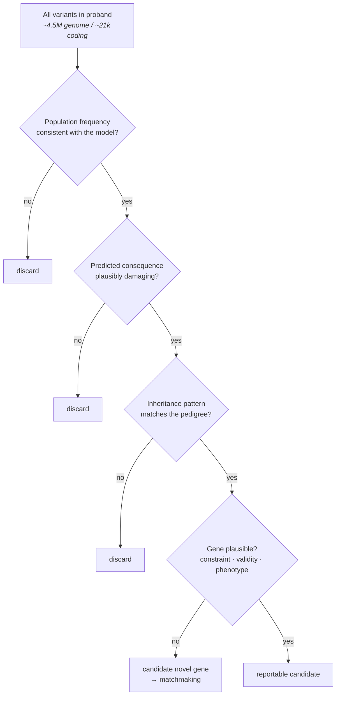

# 54 — Rare variants and Mendelian disease

> **Before this:** [Ch 51 — GWAS](51-gwas.md) ·
> [Ch 15 — Pedigrees](../part-02-transmission-genetics/15-pedigrees.md) ·
> [Ch 16 — Mutation](../part-03-genome-instability/16-mutation.md) ·
> [Ch 46 — Variant calling](../part-10-functional-genomics/46-variant-calling.md) ·
> **Time:** ~55 min
>
> **Statistics needed:** [S1 Probability](../part-S-statistics/S1-probability.md) ·
> [S4 Hypothesis testing](../part-S-statistics/S4-hypothesis-testing.md) ·
> [S6 Likelihood and Bayes](../part-S-statistics/S6-likelihood-and-bayes.md)

## What you'll be able to do

- Place any variant on the frequency × effect-size plane, and explain from mutation–selection balance why one corner of that plane is empty and what the exceptions have in common
- Show quantitatively why a GWAS cannot detect a rare variant no matter how dense the array — via the power algebra, the tagging bound, and a hard information floor on the number of carriers
- Derive the allele-frequency filter threshold for a dominant and for a recessive disease model from prevalence, penetrance and heterogeneity, and explain the thousandfold gap between them
- Run the trio filtering procedure as an explicit decision rule, and say what evidence each step is buying
- Choose between a burden test, SKAT and SKAT-O from the expected direction of effects, and predict what a badly chosen variant mask does to power
- State what a constraint metric measures, why it is powerful prior information, and the three classes of disease gene it systematically fails to flag

## The core idea

Chapters 51–53 lived at one end of the allele-frequency spectrum: variants carried by millions of people, each shifting a trait by an amount too small to notice in any individual. The statistics there is the statistics of weak signals in large samples — you win by adding people.

This chapter is the other end. The variant is carried by one family, or by one person. It changes a protein enough to cause a disease that is obvious from across a room. There is no weak signal to accumulate, and adding people does not help in the way it helped before, because the next hundred thousand people you recruit almost certainly do not carry this variant either.

> **A rare variant is not a weak signal in a big dataset; it is an unambiguous signal in a dataset of one.** Every technique in this chapter is a device for manufacturing a second observation — a second meiosis in the same family, a second allele of the same gene in the same person, a second copy of the gene knocked out in an unrelated patient, a second clinician on another continent holding the same n-of-1.

That reframing explains why the methods look nothing like GWAS. You do not scan and threshold; you filter, and filtering is a likelihood-ratio calculation dressed as a sieve. You do not test variants; you test genes, because the variant is unique and the gene is not. You do not rely on the data alone; you import strong prior information about which genes can tolerate being broken, because the data on any single variant is one observation and a prior is worth more than that.

---

## 1. The allelic architecture spectrum, and the empty corner

Every disease-associated variant sits somewhere on a plane: population frequency on one axis, effect size on the other. The plane is not uniformly populated, and its shape dictates study design.

| Frequency class | Typical effect | Mechanism of discovery | Illustrative |
|---|---|---|---|
| Common, MAF > 5% | OR 1.01–1.2, or ~0.01–0.05 SD | GWAS on arrays + imputation | the several hundred thousand loci in the GWAS Catalog |
| Low-frequency, 0.5–5% | OR 1.5–3 | Very large GWAS with sequence-based imputation panels | *TREM2* p.(Arg47His) in Alzheimer's disease |
| Rare, < 0.5% | OR 3–20 | Sequencing plus gene-level aggregation | *PCSK9* and *ANGPTL3* loss of function and blood lipids |
| Ultra-rare, private, de novo | Effectively deterministic | Trios, pedigrees, matchmaking | most Mendelian disease |

The striking feature is the corner that is missing: **there are essentially no common variants of large effect.** That is not a sampling accident — those would be the easiest of all to find. It is a prediction of [Ch 27](../part-05-population-genetics/27-the-four-forces.md).

An allele that reduces fitness sits at mutation–selection balance. For a dominant allele with selection coefficient *s* against heterozygotes,

$$q^\* \approx \frac{\mu}{hs}$$

and for a recessive, where selection only sees homozygotes,

$$q^\* \approx \sqrt{\mu/s}$$

Put numbers in. The per-gene rate of new loss-of-function mutations is on the order of μ ≈ 10⁻⁶ per allele per generation ([Ch 16](../part-03-genome-instability/16-mutation.md), applied to a gene-sized target). A condition that prevents reproduction gives *hs* ≈ 0.5 in the dominant case, so *q\** ≈ 2 × 10⁻⁶ — and that is the frequency of *all* loss-of-function alleles of that gene put together, spread across hundreds of distinct mutations, so any single allele is rarer still. In the recessive case with *s* = 1, *q\** ≈ 10⁻³.

So selection sets the frequency ceiling on a severe allele, and it is low. The exceptions are exactly the cases where the premise fails: **late onset** (selection cannot see a variant that acts after reproduction — *APOE* ε4 is common and large-effect because it costs nothing at 25); **balancing selection** (the *HBB* sickle allele `c.20A>T p.(Glu7Val)` reaches ~10% where malaria was endemic because heterozygotes are protected); and **drift or founder effects** in small populations, which can put an allele at percent-level frequency in one group and zero everywhere else ([Ch 28](../part-05-population-genetics/28-structure-and-inbreeding.md)).

Everything else sits on the diagonal: as frequency falls, the effect sizes you can find grow. That diagonal is the design constraint, and the next section shows why it is a losing race.

## 2. Why GWAS cannot reach the rare end

Three independent arguments, all quantitative, all pointing the same way.

### The power algebra

Take an additive model on a standardised quantitative trait: dosage *G* ∈ {0,1,2}, per-allele effect β in trait SD units, allele frequency *p*. Under Hardy–Weinberg ([Ch 26](../part-05-population-genetics/26-hardy-weinberg.md)), Var(*G*) = 2*p*(1−*p*), so the variance explained is

$$R^2 = 2p(1-p)\beta^2$$

and the non-centrality parameter of the 1-df association test at sample size *N* is λ ≈ *NR²*. Genome-wide significance at α = 5 × 10⁻⁸ puts the critical value at χ² = 29.7 (*z* = 5.45); 80% power needs √λ ≈ 5.45 + 0.84, so λ ≈ 40. Therefore

$$N \approx \frac{40}{2p(1-p)\beta^2} \;\xrightarrow[\;p \ll 1\;]{}\; \frac{20}{p\beta^2}$$

> **Statistics:** the non-centrality parameter, why λ ≈ 40 is what 80% power at α = 5 × 10⁻⁸ costs, and
> the α-versus-power exchange rate are covered in
> [S4](../part-S-statistics/S4-hypothesis-testing.md) §4.

| MAF *p* | β (SD) | 2*p*(1−*p*)β² | *N* for 80% power |
|---:|---:|---:|---:|
| 0.30 | 0.05 | 1.05 × 10⁻³ | 38,000 |
| 0.05 | 0.05 | 2.38 × 10⁻⁴ | 168,000 |
| 0.01 | 0.10 | 1.98 × 10⁻⁴ | 202,000 |
| 0.001 | 0.10 | 2.00 × 10⁻⁵ | 2,000,000 |
| 0.001 | 0.50 | 5.00 × 10⁻⁴ | 80,000 |
| 0.0001 | 1.00 | 2.00 × 10⁻⁴ | 200,000 |
| 0.00001 | 1.00 | 2.00 × 10⁻⁵ | 2,000,000 |

**Power scales as *p*β².** A tenfold drop in frequency must be paid for by a √10 ≈ 3.2-fold increase in effect size just to break even. Read the table's second half carefully, though, because the naive summary "GWAS cannot find rare variants" is too strong: a variant at MAF 0.1% with a *half-standard-deviation* effect is findable in 80,000 people, and biobank-scale single-variant analyses do find such things. What is unreachable is the ultra-rare end — and there the obstruction is not power arithmetic but arithmetic of a harder kind.

### The carrier floor

Suppose a variant is carried by exactly *k* people in a case-control study with equal numbers of cases and controls. Under the null, each carrier is a case with probability ½. The most extreme outcome possible is that *all* of them are cases, and its p-value is 2⁻ᵏ. So

$$p_{\min} = 2^{-k} \le 5\times10^{-8} \implies k \ge 25$$

**No test of any kind, however clever, can bring a variant carried by fewer than about 25 people to genome-wide significance.** This is an information bound, not a modelling weakness. A variant seen once in a cohort — and in gnomAD v4, with 807,162 individuals, a large fraction of all variants are singletons ([reference/verified-facts.md](../reference/verified-facts.md)) — carries at most one bit of evidence.

### The tagging bound

Arrays do not genotype most variants; they genotype tags and rely on LD ([Ch 29](../part-05-population-genetics/29-linkage-disequilibrium.md)). Testing a tag costs a factor 1/*r*² in sample size. For two loci with allele frequencies *p* < *q*, the maximum attainable *D* is *p*(1−*q*), so

$$r^2_{\max} = \frac{[p(1-q)]^2}{p(1-p)\,q(1-q)} = \frac{p(1-q)}{q(1-p)}$$

A causal variant at *p* = 0.001 tagged by a common SNP at *q* = 0.30 has *r*²ₘₐₓ = 0.0023 — a 430-fold sample-size penalty, *in the best case*, achieved only if the rare allele sits perfectly nested inside the common haplotype. **A variant can only be tagged by another variant of similar frequency.** Adding markers to an array does not fix this, and neither does imputation, which is the same LD argument executed statistically and which degrades precisely where reference haplotype sharing is thinnest.

The conclusion is structural: to study rare variants you must *observe* them, which means sequencing, and you must aggregate them, which means testing genes rather than variants.

## 3. Gene discovery: linkage, and what replaced it

For thirty years, the route to a Mendelian gene was **linkage followed by positional cloning** ([Ch 14](../part-02-transmission-genetics/14-linkage-and-mapping.md)). Collect a large family with many affected members; genotype markers across the genome; find the marker interval that co-segregates with disease; accumulate LOD score until it clears 3.3; then narrow the interval by recombinants and, inside a few megabases, examine every gene by hand. *CFTR*, *HTT*, *DMD* and roughly two to three thousand others were found this way.

It works because meioses are the unit of evidence and a big pedigree supplies many of them. It fails in four situations, which between them are most of clinical genetics:

| Failure | Why linkage breaks |
|---|---|
| De novo dominant disorders | Every case is sporadic. No family, hence no meiosis to score |
| Conditions reducing fertility | Affected individuals rarely reproduce, so multi-generation pedigrees do not exist |
| Extreme locus heterogeneity | LOD scores add across families *only under locus homogeneity*. When families map to different genes the scores cancel rather than accumulate, and you need an admixture (HLOD) model with an unknown linked fraction |
| Ultra-rare conditions | One family in the world. Even fully informative, it may never reach LOD 3.3 |

Exome sequencing inverted the design. Instead of narrowing a region and then inspecting the genes inside it, you inspect every gene at once and narrow by *filtering*. The unit of evidence stops being the meiosis and becomes the variant's implausibility under a null model of healthy human variation — so a trio replaces a four-generation pedigree, and a single proband replaces a family altogether when the filter is sharp enough.

The scoreboard: OMIM now catalogues over 7,400 phenotypes attributable to variants in more than 4,800 genes. Against 19,442 protein-coding genes ([reference/verified-facts.md](../reference/verified-facts.md)), **most human genes still have no known disease phenotype**, and the discovery curve has not flattened.

## 4. The filtering strategy, as a decision procedure

Filtering is usually taught as a recipe. Treat it instead as a sequence of likelihood ratios applied to an explicit disease model, because every threshold in it is derivable from that model and is wrong if the model is wrong.

> **Statistics:** likelihood ratios as units of evidence — including the LOD scores §6 reuses — are covered in
> [S6](../part-S-statistics/S6-likelihood-and-bayes.md) §4, and the prior-times-likelihood structure that
> makes filter 4 legitimate in [S6](../part-S-statistics/S6-likelihood-and-bayes.md) §5.



### Filter 1 — frequency, and why the threshold is derivable

The premise is stated once and does everything: **a variant causing a severe, early-onset, highly penetrant disease cannot be at appreciable frequency among adults sampled without regard to that disease.** gnomAD v4 — 730,947 exomes plus 76,215 genomes, 807,162 individuals, ~1.61 million alleles — is that adult population.

Make it quantitative. Let disease prevalence be *P*, penetrance *f*, and let *c* be the largest fraction of all cases that any single allele could plausibly explain (allelic × locus heterogeneity combined).

*Dominant.* Affected individuals are heterozygotes who manifest: fraction ≈ 2*qf*. Requiring 2*qf* ≤ *cP*,

$$q \le \frac{cP}{2f}$$

*Recessive.* Affected individuals are homozygotes or compound heterozygotes: fraction ≈ *Q²f* where *Q* is the summed frequency of all causal alleles. Requiring *Q²f* ≤ *cP*,

$$Q \le \sqrt{cP/f}$$

Take *P* = 2 × 10⁻⁵ (1 in 50,000), *f* = 1, *c* = 0.05:

| Model | Threshold | Expected copies in gnomAD v4 |
|---|---:|---:|
| Dominant | *q* ≤ 5 × 10⁻⁷ | 0.8 |
| Recessive | *Q* ≤ 1 × 10⁻³ | 1,614 |

**Three orders of magnitude apart, from the same disease, because the case frequency goes as *q* in one model and *q*² in the other.** A filter set at 0.1% is nearly useless for a de novo dominant hypothesis and nearly correct for a recessive one. Note also that both numbers reproduce the mutation–selection-balance predictions of §1 to within an order of magnitude. That is not a coincidence: the clinical filter *is* the population-genetics prediction, arrived at from the other direction.

Three refinements that matter in practice:

- **Threshold the maximum frequency across genetic-ancestry groups, not the global average.** gnomAD's groupings are continuous genetic-similarity clusters, not races or ethnicities, and the reason to use the maximum is purely statistical: an allele at 2% in one group and absent elsewhere has a small global average that sails through a global filter. gnomAD publishes a **filtering allele frequency** — the lower bound of a 95% confidence interval on the maximum group frequency — which will not discard a variant merely for having been seen a few times by chance.
- **Penetrance below 1 loosens the threshold by 1/*f*.** At 30% penetrance the dominant threshold is three times higher.
- **gnomAD is not a healthy cohort**, only one not ascertained *for your disease*. It contains adult-onset conditions, unrecognised mild presentations, and people who have not yet manifested.

### Filter 2 — predicted consequence

Annotate against a defined transcript set and keep the classes that could break the protein: nonsense, frameshift, canonical splice-site (±1, ±2), start-loss and in-frame indels, plus missense variants with computational support. Three cautions carry over from [Ch 44](../part-09-genomics/44-annotation.md):

**Consequence is a function of two arguments**, variant and transcript. A nonsense variant in a minor isoform is not a nonsense variant in the gene. Annotate against MANE Select for reporting and against all transcripts for discovery — and know which you are looking at.

**Not all predicted LoF is LoF.** Stops in the last exon or the terminal 50 bp of the penultimate exon escape nonsense-mediated decay; splice-site variants may be rescued by a nearby cryptic site; the "gene" may be a readthrough annotation. LOFTEE-style filters encode these rules and typically remove 20–30% of nominal LoF calls.

**Missense predictors are prior information, not evidence about this variant.** REVEL, CADD and AlphaMissense are trained on features — conservation, structure, paralogue constraint — that correlate with pathogenicity *across* variants; they cannot separate two variants at the same residue. That is why the 2015 ACMG text admitted them only at supporting strength — and why the ClinGen SVI calibration replaced that flat cap with score-interval thresholds that reach Moderate and Strong for PP3, and Very Strong for BP4, from a single calibrated predictor counted once ([Ch 55](55-clinical-variant-interpretation.md)).

### Filter 3 — inheritance model

Enumerate the genotype patterns each mode predicts across the trio, and keep only variants matching one:

| Model | Proband | Mother | Father |
|---|---|---|---|
| De novo dominant | het | hom ref | hom ref |
| Inherited dominant | het | het (affected) or hom ref | mirror |
| Autosomal recessive, homozygous | hom alt | het | het |
| Autosomal recessive, compound het | het at two sites | het at one | het at the other |
| X-linked recessive (male proband) | hemizygous | het | hom ref |
| Imprinted | het, on the expressed parental allele | — | — |

This is the step that does the most work, because it converts a per-variant question into a per-*trio* question and multiplies three genotype likelihoods together. It also fails loudly if the pedigree is wrong: undisclosed non-paternity, sample swaps and unrecognised consanguinity all masquerade as inheritance-model violations, which is why relatedness and sex checks run before anything else ([Ch 46](../part-10-functional-genomics/46-variant-calling.md)).

### Filter 4 — gene-level plausibility

Three independent priors, none of which is about the variant at all: is the gene intolerant of this kind of variation (§8)? Is the gene–disease relationship established, or is this a candidate (ClinGen gene–disease validity classifications exist precisely so that "reported in one paper" and "definitive" are not conflated)? Does the phenotype match — a Human Phenotype Ontology comparison between the patient's terms and the gene's known presentation?

## 5. Trios: de novo detection and its false-positive problem

For a severe dominant disorder that removes itself from the gene pool each generation, the causal variant is usually new in the affected child. Trio sequencing turns that into the sharpest filter in the chapter.

**Expected counts.** From [Ch 16](../part-03-genome-instability/16-mutation.md): μ ≈ 1.3 × 10⁻⁸ per bp per generation over 6.2 Gb diploid gives ~81 de novo SNVs, of which trio studies call ~60–70 in accessible sequence. The coding footprint is ~34 Mb haploid, ~1.1% of the genome, so

$$81 \times 0.011 \approx 0.9 \;\;\text{de novo coding SNVs per child}$$

Roughly 5% of random coding substitutions create a stop codon; adding de novo frameshift indels gives **≈0.1 de novo protein-truncating variants per exome**. Spread over 19,442 genes that is ~5 × 10⁻⁶ per gene per child for an average-length gene — a number that varies by more than an order of magnitude with gene length and sequence context, which is why per-gene mutational models (trinucleotide context, CpG methylation, coverage) exist rather than a flat rate.

That tiny per-gene expectation is the whole point. Two independent de novo truncating variants in the same gene, in two unrelated children with the same phenotype, is a Poisson tail event:

> **Statistics:** why de novo mutation counts are Poisson, and where a tail probability like
> *P*(≥2) ≈ λ²/2 comes from, are covered in [S2](../part-S-statistics/S2-distributions.md) §2.

| Cohort size *N* | λ per gene = 5×10⁻⁶ *N* | *P*(≥2) ≈ λ²/2 | Expected genes with ≥2, over 19,442 |
|---:|---:|---:|---:|
| 100 | 5 × 10⁻⁴ | 1.3 × 10⁻⁷ | 0.0024 |
| 1,000 | 5 × 10⁻³ | 1.3 × 10⁻⁵ | 0.24 |
| 10,000 | 5 × 10⁻² | 1.3 × 10⁻³ | 24 |

Read the last row. **"Two unrelated patients with de novo variants in the same gene" is not a fixed standard of evidence — it is a p-value that depends on how many patients you looked at.** In a 100-trio study it is a 1-in-400 event and near-conclusive; in a 10,000-trio study you expect two dozen such genes by chance and need five hits (*P* ≈ 5 × 10⁻⁵ genome-wide) to make the same claim. Cohort-scale de novo enrichment tests do exactly this arithmetic, per gene, against a per-gene mutational expectation.

**The false-positive problem is the operational reality.** Naively defining a de novo call as "het in child, hom-ref in both parents" produces thousands of candidates for the ~70 real ones. The dominant error term is not missed parental heterozygotes — at 30× coverage, a truly heterozygous parent yields zero alternate reads with probability ≈ 0.5³⁰ ≈ 10⁻⁹ — but systematic artefacts in the child: mismapping in segmental duplications and repeats, alignment-induced false indels, and strand-biased errors. If such an artefact occurs at even 10⁻⁶ per site, that is ~3,000 false candidates against ~70 true ones: a 98% false discovery rate *before* filtering.

The prior odds are therefore hostile, and each call needs evidence proportionate to that:

- Allele balance near 0.5 in the child (systematically lower ⇒ **post-zygotic mosaicism**, which is a real and reportable finding, not a failure)
- Zero alternate reads in both parents at good depth, evaluated on genotype likelihoods rather than hard calls
- Not in a repeat, segmental duplication, or region of anomalous coverage
- Orthogonal confirmation for anything reported clinically

And one genetic caveat that survives all filtering: **de novo does not mean recurrence risk zero.** A variant arising early in a parent's germline development makes that parent a gonadal mosaic — unaffected, negative on a blood test, and carrying the variant in a substantial share of gametes. Empirical recurrence for apparently de novo dominant conditions is ~1%.

## 6. Phase: compound heterozygosity and segregation

### Two variants are only a recessive diagnosis if they are in *trans*

A recessive disease needs both copies of the gene disabled. Two rare damaging variants in one gene are consistent with that — but only if they sit on *different* chromosomes. In *cis*, one allele is fully intact and the person is a carrier of a doubly-mutant haplotype, not a patient.

```
in trans — both alleles disabled          in cis — one allele intact
  maternal  ──────●──────────             maternal  ──────●───────●──
  paternal  ──────────────●──             paternal  ─────────────────
              disease                          carrier, unaffected
```

Nothing in a VCF distinguishes these. Genotypes are unordered; `0/1` at two sites is silent on phase ([Ch 41](../part-09-genomics/41-data-formats.md)). Four ways to resolve it, in decreasing reliability:

| Method | How it works | Limitation |
|---|---|---|
| **Trio (pedigree) phasing** | If one variant is present in the mother and the other in the father, they are in trans by descent | Fails if both come from one parent, or one is de novo |
| **Read-backed phasing** | Both variants on the same sequencing fragment | Only within read/insert length — a few hundred bp for short reads |
| **Long reads / linked reads** | Same idea, over 10–100 kb | Requires the right assay up front |
| **Statistical (population) phasing** | Infer haplotypes from shared haplotype structure in a reference panel | **Fails for exactly these variants.** It works by finding others who share the haplotype, and a rare variant has almost no LD partners ([Ch 29](../part-05-population-genetics/29-linkage-disequilibrium.md)) |

The last row is the one people get wrong. Statistical phasing is excellent for common variants and close to useless for the ultra-rare ones a Mendelian diagnosis turns on.

How often does phase actually matter? With ~300 rare coding variants scattered over ~19,000 genes, the expected number of genes carrying two of them by chance is roughly C(300,2)/19,000 ≈ 2.4 — and about half of those pairs will be in *cis*. So phasing does not merely tidy the candidate list; it typically halves it.

### Segregation

When a family is available, each additional informative relative is a coin flip under the null. If the variant is not causal, an affected relative carries it with probability ½ per meiosis, so *k* affected carriers give a likelihood ratio of 2ᵏ, i.e. LOD = *k* log₁₀2 ≈ 0.30*k*. ClinGen's calibration of the ACMG co-segregation criterion sits on this arithmetic: Jarvik and Browning's thresholds, adopted by expert panels, are odds of 8, 16 and 32 against the null in a single family — LOD ≈ 0.90, 1.20 and 1.51, which is three, four and five informative meioses — for supporting, moderate and strong evidence.

Two constraints on how far that can be pushed. **Segregation evidence is about the locus, not the variant** — it cannot distinguish the candidate from anything else on the co-segregating haplotype, which in a small family may be several megabases. And *non*-segregation (an affected relative without the variant, or an unaffected elderly carrier) is evidence *against* only if you are confident about penetrance and phenocopies, which §10 argues you usually should not be.

## 7. Gene-level aggregation: burden, SKAT, and the mask

Single rare variants are untestable (§2). The fix is to aggregate across a gene and test the *set*. This buys two things: carriers, and a far gentler multiple-testing burden — roughly 20,000 gene tests at α ≈ 2.5 × 10⁻⁶ instead of a million variant tests at 5 × 10⁻⁸.

### Burden tests

Collapse the gene to one number per individual, *C*ᵢ = Σⱼ *w*ⱼ*G*ᵢⱼ, and regress phenotype on *C*. This is a 1-df test. Because rare variants are essentially independent (two rare variants rarely co-occur), the non-centrality parameter is

$$\lambda_{\text{burden}} \;\propto\; N\,\frac{\left(\sum_j \beta_j v_j\right)^2}{\sum_j v_j}, \qquad v_j = 2p_j(1-p_j)$$

With *m* variants of equal frequency and identical effect β this grows linearly in *m* — aggregation works. With half the effects +β and half −β, the numerator is **zero**. Burden tests do not merely lose power against mixed-direction effects; they cancel.

### Variance-component tests (SKAT)

Model the effects as random, βⱼ ~ (0, τ*w*ⱼ²), and test H₀: τ = 0. The statistic is a sum of *squared* per-variant scores, *Q* = Σⱼ *w*ⱼ²*S*ⱼ², whose null distribution is a mixture of χ²₁ terms evaluated by Davies' method. Signs cannot cancel, because they are squared away. The price is degrees of freedom: *Q* spreads its mass over *m* directions, so when the effects really are homogeneous, burden's single degree of freedom concentrates the signal better.

The comparison is Cauchy–Schwarz:

$$\lambda_{\text{burden}} \propto \Big(\sum_j \beta_j\Big)^2 \le m \sum_j \beta_j^2 \propto m\,\lambda_{\text{SKAT}}$$

with equality exactly when all βⱼ are equal. **Burden extracts the maximum available signal precisely when effects are homogeneous in direction and magnitude, and none of it when they cancel.**

The biology tells you which to expect. Predicted loss-of-function variants in a haploinsufficient gene all do the same thing — reduce dosage — so burden is the right test. Missense variants in a gene with both loss- and gain-of-function mechanisms do not: in *SCN1A*, loss of function causes Dravet syndrome while gain-of-function missense variants cause a different epilepsy phenotype, and the two push any quantitative endophenotype in opposite directions. That is a SKAT gene.

**SKAT-O** interpolates: *Q*ᵨ = ρ*Q*_burden + (1−ρ)*Q*_SKAT, which corresponds to assuming pairwise correlation ρ among the effects. Minimise the p-value over a grid of ρ and correct for the minimisation. It loses a little to whichever pure test was correct and wins enormously against the wrong one — the usual price of not knowing the answer in advance.

### The mask is the hypothesis

The variant inclusion set — the **mask** — is chosen, not given, and results are more sensitive to it than to the choice of test. A mask is a hypothesis about which variants share a mechanism.

| Mask dimension | Choices | What it assumes |
|---|---|---|
| Consequence | pLoF only; pLoF + missense; pLoF + missense above a predictor threshold; synonymous | Which classes break the protein the same way |
| Frequency | MAF < 1%, < 0.1%, singletons only | How strongly selection has filtered the causal class |
| Weighting | flat; Beta(MAF; 1, 25) upweighting rarer alleles | That rarer ⇒ more deleterious |
| Transcript | MANE Select; all transcripts | Which isoform matters |
| LoF confidence | LOFTEE high-confidence only | Whether NMD escape and rescue are modelled |

Dilution is quantifiable. If only a fraction π of the included variants are causal, λ_burden's numerator scales as (π*mβv*)² while its denominator scales as *mv*, so λ falls by a factor of π relative to a perfect mask of the same causal variants. **A mask that is 20% causal needs five times the cohort.** That is the whole argument for restrictive, mechanism-motivated masks and against throwing in every missense variant "to be safe". Testing many masks per gene then inflates multiplicity and invites a garden of forking paths: pre-specify a small set and account for it.

Two genetics-specific traps close the section. **A synonymous-variant mask is the standard negative control**, because the most common artefact in rare-variant association is not statistical: differential coverage or capture between cases and controls manufactures burden differences out of nothing. Joint calling in one batch, coverage-matched filtering and mixed models are the defences. And **population stratification hits rare variants harder than common ones** — rare alleles are young, therefore geographically clustered in a way common alleles are not, and principal components computed on common variants do not capture that structure and so do not adjust for it. Rare-variant PCs, a rare-variant relatedness matrix, or within-family designs are the fixes ([Ch 51](51-gwas.md), [Ch 28](../part-05-population-genetics/28-structure-and-inbreeding.md)).

## 8. Constraint as prior information

Constraint metrics answer a question you cannot answer from your patient's data: *does this gene tolerate being broken?*

The construction is a within-species analogue of d_N/d_S ([Ch 33](../part-07-molecular-evolution/33-neutral-theory-and-selection-tests.md)). For each gene, compute the **expected** number of variants of a class under a mutational model — trinucleotide-context substitution rates, corrected for CpG methylation and for sequencing coverage — then compare to the **observed** number in a large population sample. A deficit means selection has been removing those variants from living people. Unlike d_N/d_S it needs no outgroup and no divergence time, and it measures selection acting *now*, on standing human variation.

| Metric | What it is | Use |
|---|---|---|
| **pLI** | Posterior probability of belonging to a "haploinsufficient" class, from a three-state mixture (null / recessive / haploinsufficient) fitted by EM over observed/expected pLoF | pLI ≥ 0.9 flags LoF intolerance. Being a probability, it saturates: it cannot rank genes once they are past the threshold |
| **LOEUF** | Upper bound of the 90% CI on the observed/expected pLoF ratio | Continuous and honest about uncertainty. gnomAD recommends **LOEUF < 0.6 for v4**; the widely quoted < 0.35 was the v2 threshold and does not transfer |
| **Missense z / regional missense constraint** | Standardised depletion of missense variation, computed genome-wide or in sub-gene windows | Catches genes tolerant of missense overall but constrained in one domain — often exactly the domain where pathogenic variants cluster |

Constraint is powerful evidence because it is *independent* of the patient — computed from hundreds of thousands of other people before your case existed, so combining it with the patient's data multiplies likelihoods rather than double-counting one. Now the caveats, which matter as much as the metric.

**Power scales with gene length.** LOEUF's confidence interval is set by the expected pLoF count, which is proportional to target size. Short genes get wide intervals, hence high LOEUF, hence a default verdict of "unconstrained" regardless of the truth. When LOEUF was introduced on 141,456 people, ~28% of genes had fewer than 10 expected pLoF variants — too few to call — and the paper either filtered them out of its own downstream analyses or adjusted for coding-sequence length; gnomAD v4's five-fold larger exome set cuts that fraction to ~12%, though the shortest quartile of genes still returns a median LOEUF near 1.5. The canonical illustration is *DCX*: 366 residues (MANE Select `NM_001195553.2`), and in gnomAD v2 three observed pLoF variants against 12.6 expected, giving LOEUF 0.62 and pLI 0.30 — constrained by neither criterion, despite 56 pathogenic pLoF variants in ClinVar for X-linked lissencephaly. In v4 the same gene has four observed against 20.9 expected, LOEUF 0.44 and pLI 0.99, and is now called constrained. That reversal is the demonstration: the failure was power, not biology, and the fix was more people. **A high LOEUF on a short gene is an absence of evidence, not evidence of absence.**

**Constraint is blind to recessive and to late-onset genes.** Where only biallelic loss is harmful, heterozygous pLoF is never depleted and LOEUF looks unremarkable — *CFTR* and *HBB* are "unconstrained" and are two of the most important disease genes in medicine. Where the effect arrives at 50 the fitness cost is small, so *BRCA2* and *LDLR* score modestly. That is the same asymmetry that put *APOE* ε4 in §1's exception list.

**Constraint measures fitness, not disease.** A gene whose heterozygous loss reduces fertility and one whose heterozygous loss causes childhood epilepsy are indistinguishable by LOEUF. And it is a statement about the *gene*, never about your *variant*: it raises the prior that a disruptive variant here matters, and says nothing about whether this change is disruptive.

## 9. Yield, and where the undiagnosed cases go

Exome sequencing in a well-phenotyped rare-disease cohort yields a diagnosis in roughly 25–35% of probands. Genome sequencing does better, but by less than the "we sequence everything" intuition predicts: a 2025 meta-analysis of 108 studies and 24,631 pediatric probands found pooled within-cohort yields of ~31% for genome against ~23% for exome, about 1.7× the odds. The 100,000 Genomes Project pilot diagnosed 25% of 2,183 probands overall — 35% for disorders judged likely monogenic, 11% for likely complex, and 40–55% for intellectual disability, hearing and vision disorders — with 14% of diagnoses depending on research pipelines beyond the standard clinical route.

The gap between "sequenced" and "diagnosed" is the field's real workload, and it is not one problem:

| Where the answer is hiding | Why the standard pipeline misses it | What finds it |
|---|---|---|
| Non-coding regulatory variants | Not captured by exome; in a genome, sequenced but not interpretable | Functional readouts; large control sets; increasingly, RNA-seq |
| Deep intronic variants creating cryptic splice sites | Annotated as "intronic, benign" | Splice predictors (SpliceAI-class) plus RNA-seq of an accessible tissue, which adds ~8–15% yield in muscle and blood cohorts ([Ch 47](../part-10-functional-genomics/47-rna-seq.md)) |
| Structural variants | Short reads see breakpoints badly; exome capture destroys copy-number signal | Genome sequencing, long reads, optical mapping ([Ch 20](../part-03-genome-instability/20-chromosome-abnormalities.md)) |
| Repeat expansions | Invisible by construction — the read is shorter than the repeat | Targeted repeat genotypers, long reads |
| Mosaicism | Allele fraction below caller thresholds; absent from blood if tissue-restricted | Deep sequencing of the affected tissue |
| Epigenetic causes | Sequence is normal | Methylation arrays, imprinting studies, episignatures ([Ch 23](../part-04-gene-regulation/23-chromatin-and-epigenetics.md)) |
| Mitochondrial heteroplasmy | Low-level heteroplasmy needs high depth and heteroplasmy-aware calling | Dedicated mtDNA analysis |
| Novel genes | The gene has no disease association to match against | §10 |
| Oligogenic architecture, or no genetic cause | There is no single answer to find | Re-examining the phenotype |

The repeat-expansion row has a whole optional track behind it: [D3](../part-D-sca12/D3-repeat-expansion-disorders.md) develops the disorder class this table compresses into one line, and [lab 11](../labs/lab-11-repeat-genotyping.md) runs a targeted repeat genotyper on real 30× data — and shows exactly why the standard pipeline is blind by construction.

Two structural points. Reanalysis of old data against new knowledge yields an extra ~5–15% within a few years, purely from the literature moving — which makes "negative" a timestamped result rather than a conclusion. And exome-vs-genome is not only about coverage: genome sequencing is PCR-free and gives uniform depth, so it also recovers coding variants that capture-based exomes miss in GC-rich first exons.

## 10. The n-of-1 problem, and matchmaking

Suppose the filter leaves one de novo LoF variant in a gene with no disease association. You have a hypothesis and no way to test it: with one family, no statistic can reach significance, because §5's arithmetic needs a second independent observation and there is not one *in your cohort*.

The second observation almost certainly exists — in someone else's cohort. The fix is therefore not statistical but infrastructural: a federated index over candidate genes so that two clinicians holding the same n-of-1 can find each other. **Matchmaker Exchange** connects GeneMatcher, DECIPHER, PhenomeCentral and others through a common API, matching on gene symbol and phenotype terms; scale is now upwards of 14,900 candidate genes from more than 13,000 submitters, with hundreds of resulting publications.

The evidence that a match provides is precisely the Poisson calculation of §5, run across the union of everyone's cohorts. Two unrelated probands with overlapping phenotypes and de novo LoF variants in the same never-before-implicated gene is a genuinely small-probability event; three is usually decisive; functional follow-up in a model system ([Ch 37](../part-08-methods/37-model-organisms-and-screens.md)) or a cell assay converts it into mechanism.

## 11. Penetrance at population scale, and what screening must assume

Sequencing large unselected cohorts made a measurement possible that had never been made: take everyone carrying a variant classified as pathogenic and ask what fraction actually has the disease. The answer has been consistently, sometimes dramatically, lower than the textbook figure.

Across two large biobanks, 89% of ~5,360 pathogenic or loss-of-function variants studied carried a risk difference of ≤5%, with mean observed penetrance around 7%. Even *BRCA1* and *BRCA2* pathogenic variants averaged near 38%. For *HNF4A*-related MODY, family-based estimates of ≥90% become 20–30% measured genotype-first in a population cohort.

The explanation is ascertainment, and it is worth stating precisely. Classical penetrance was estimated from families that reached clinical attention *because* they contained multiple affected members. That estimate is

$$\mathbb{E}\big[\text{penetrance} \mid \text{family ascertained through affected relatives}\big]$$

which conditions on exactly the things — high polygenic background, shared environment, modifier alleles — that raise penetrance. Population cohorts estimate the unconditional quantity. The two differ by construction, not by contradiction, and neither is "the" penetrance: the family figure is the right one for a member of such a family, the population figure the right one for someone who found the variant incidentally.

Three consequences:

- **"Pathogenic" is a claim about the variant's causal role, not a prediction about a person.** It says this variant, in this gene, causes this disease by this mechanism. It does not say the carrier will be affected — the same category distinction as [Ch 55](55-clinical-variant-interpretation.md)'s point that **a VUS is a statement about the state of the evidence, not about the variant.**
- **Risk is conditional.** The honest output is a probability conditioned on family history, sex, age and increasingly polygenic background ([Ch 53](53-polygenic-scores.md)) — never binary, never deterministic.
- **Returning a finding to an unselected person is a different act from returning it to an affected family.** Same variant, different prior, different conversation.

### Screening design

Screening is where these numbers become policy, and the arithmetic is unforgiving.

**PPV is dominated by prevalence, not by specificity.** For a condition at 1 in 50,000 screened with 99.9% specificity, 100,000 newborns give ~2 true positives against ~100 false ones: PPV ≈ 2%. That one calculation drives every design decision — restrict the gene list, restrict to variants with strong pre-existing evidence rather than "any LoF in the gene", and require orthogonal confirmation before anything is called a diagnosis. The cost of a false positive is a healthy child medicalised.

> **Statistics:** positive predictive value, and why improving specificity moves it while improving
> sensitivity barely does, are covered in [S1](../part-S-statistics/S1-probability.md) §8.

**Actionability, not detectability.** Wilson–Jungner logic still governs: screen only where presymptomatic identification changes management within the screening window. Technology has expanded what is detectable far more than what is actionable. And screening an unselected population draws variants from the low-penetrance end of the distribution — precisely the regime the biobank studies exposed — so a gene list calibrated on clinically ascertained families will over-predict in newborns.

The empirical answer is being generated rather than assumed. The **Generation Study** (Genomics England with the NHS, launched October 2024, running to about March 2027) is sequencing up to 100,000 newborn genomes against more than 200 treatable childhood-onset conditions, with the programme expecting a condition to be suspected in about 1 in 100 babies (Genomics England, as of August 2026); GUARDIAN, BabySeq and ScreenPlus run parallel designs with different gene lists and consent models. Treat all of them as experiments in progress.

**Carrier screening** inverts the target: testing prospective parents for recessive alleles they will never manifest. ACMG's 2021 practice resource recommends a **universal panel of 113 genes** — 97 autosomal recessive, 16 X-linked — offered to everyone pregnant or planning pregnancy, selected on carrier frequency ≥1/200 in at least one population plus disease severity. The move from ancestry-targeted to universal panels rests on two separable arguments. The technical one: self-reported ethnicity predicts genetic ancestry poorly, and people of admixed ancestry are systematically underserved by panels keyed to a single group. The equity one: offering different tests by social category produces unequal care. **Genetic ancestry is a continuous, measurable property of a genome; race and ethnicity are social classifications.** A screening programme designed around the second will fail everyone whose first does not match it.

Finally, the residual-risk arithmetic a negative carrier result requires. With detection rate *d* and prior carrier frequency *c*,

$$\Pr(\text{carrier} \mid \text{negative}) = \frac{c(1-d)}{1-cd}$$

With *c* = 1/25 and *d* = 0.90: 0.04 × 0.10 / (1 − 0.036) = 0.00415 ≈ **1 in 241**. A negative result reduces risk tenfold; it does not eliminate it, and any counselling that treats it as elimination is wrong. Note also that a **cascade** test in the relatives of an identified carrier is a completely different problem — the prior in a sibling is 1/2, not 1/25, and the PPV problem evaporates. Testing relatives of a known case is the highest-yield genetic test in medicine, and the most under-used.

---

## Common misconceptions

| What people think | What's actually true |
|---|---|
| GWAS just needs a denser array to find rare variants | Genotyping density is irrelevant. Max *r*² between a variant at 0.1% and a tag at 30% is 0.0023 — a 430× sample-size penalty in the best case. A variant can only be tagged by one of similar frequency |
| Rare variants are undetectable in any design | A rare variant with a *large* effect is detectable at biobank scale (MAF 0.1%, β = 0.5 SD needs ~80,000). What is unreachable is the ultra-rare end, where fewer than ~25 carriers exist |
| The filtering thresholds are conventions | They are derivable. Prevalence, penetrance and heterogeneity give *q* ≤ *cP*/2*f* for dominant and *Q* ≤ √(*cP*/*f*) for recessive — thresholds three orders of magnitude apart |
| A variant absent from gnomAD is probably pathogenic | Most variants in any genome are absent from gnomAD. Absence is a weak, near-universal property; ClinGen accordingly applies the ACMG rarity criterion at supporting strength |
| Two rare damaging variants in a recessive gene means a diagnosis | Only in *trans*. In *cis* the other allele is intact. Roughly half of by-chance pairs are in cis, and statistical phasing — which works for common variants — fails precisely for these |
| A de novo call from a trio pipeline is a de novo variant | Before filtering, ~98% of naive de novo calls are artefacts. The prior is ~70 true events against thousands of candidate positions |
| Two unrelated patients with de novo variants in the same gene proves the gene | It is a p-value that depends on cohort size. Conclusive in 100 trios; expected 24 times by chance in 10,000 trios |
| A high LOEUF means the gene tolerates loss of function | For a short gene it means there was never enough expected variation to tell. ~12% of genes still have fewer than 10 expected pLoF variants at gnomAD v4 scale, down from ~28% at v2 — where *DCX*, with 56 pathogenic pLoF variants in ClinVar, was called constrained by neither metric until the larger v4 sample flipped it. Constraint is also blind to recessive genes (*CFTR*, *HBB*) and to late-onset ones |
| Choosing the right statistical test is the main analytic decision | The variant mask matters more. A mask that is 20% causal costs a factor of five in effective sample size — and burden tests cancel to exactly zero when effects are bidirectional, which is a fact about the biology, not the software |
| A "pathogenic" variant means the carrier will develop the disease | Population-scale genotype-first studies find penetrance far below family-based estimates — ~7% mean across thousands of P/LoF variants. Classification describes the variant's causal role, not an individual's fate |

## Worked example: one trio, filtered end to end

A constructed but realistic case. Male proband, 8 months, seizures from three months of age with developmental regression. Parents unaffected, unrelated, no family history. Trio exome, GRCh38.

**Step 0 — state the model before touching the data.** Severe, early-onset, neurodevelopmental. The dominant de novo hypothesis is the leading one; autosomal recessive and X-linked recessive stay in play because the proband is male and mild consanguinity cannot be excluded from history alone. Prevalence of any single causative gene: assume ~1 in 50,000.

**Step 1 — derive the thresholds.** With *P* = 2 × 10⁻⁵, *f* = 1, *c* = 0.05:

- dominant: *q* ≤ 0.05 × 2 × 10⁻⁵ / 2 = **5 × 10⁻⁷** → expected 1,614,324 × 5 × 10⁻⁷ = **0.8 copies in gnomAD v4**
- recessive: *Q* ≤ √(0.05 × 2 × 10⁻⁵) = **1 × 10⁻³**

Run the pipeline at the looser recessive threshold so the recessive hypothesis survives, and apply the dominant threshold only inside the de novo branch.

**Step 2 — the funnel.**

| Step | Filter applied | Remaining |
|---|---|---:|
| 0 | Coding + splice-region SNVs and indels in the proband | 21,400 |
| 1 | gnomAD v4 filtering allele frequency ≤ 0.1% (max across ancestry groups) | 310 |
| 2 | pLoF (LOFTEE high-confidence) or missense | 168 |
| 3a | de novo: absent in both parents, parental DP ≥ 20, child allele balance 0.35–0.65 | 1 |
| 3b | homozygous alt, both parents het | 0 |
| 3c | ≥2 in one gene, phase confirmed in trans by parental genotypes | 2 genes |
| 3d | hemizygous X, maternally inherited | 6 |
| 4 | LOEUF < 0.6, established gene–disease validity, HPO overlap with the presentation | **1** |

**Step 3 — the surviving candidate.** A de novo nonsense variant in *SCN1A*: `c.4933C>T`, `p.(Arg1645Ter)`. (A c. description is meaningless without its transcript accession — numbering shifts between *SCN1A* isoforms, which is the practical face of [Ch 44](../part-09-genomics/44-annotation.md)'s "consequence is a function of two arguments".)

**Step 4 — score the evidence.**

- *Frequency*: 0 alleles in 1,614,324. Consistent with the dominant model, which predicted ≤ 1.
- *Consequence*: nonsense. Check NMD escape explicitly — the stop lies neither in the final exon nor within the terminal 50 bp of the penultimate one, so the transcript is predicted to be degraded and this is a true null allele.
- *De novo*: child allele balance 0.48 (24 alt / 50 total); parents 0/38 and 0/44 alt reads. Confirmed on a second platform.
- *Gene*: *SCN1A* LOEUF ≈ 0.1 — among the most constrained genes in the genome — and haploinsufficiency is the established Dravet syndrome mechanism.
- *Phenotype*: onset in infancy with febrile seizures and regression matches.

**Step 5 — how much evidence is this, quantitatively?** Under the null of a healthy trio, the expected number of de novo pLoF variants in *SCN1A* is ≈ 5 × 10⁻⁶ (§5, adjusted upward for this gene's length). The probability of seeing one *at all* in this one child is therefore ~5 × 10⁻⁶; even multiplying by 19,442 genes to account for having looked everywhere, the genome-wide expectation is ~0.1 de novo pLoF anywhere, and the conditional probability that it landed in a gene whose known phenotype matches this child's is what makes the case. That is the entire logic of trio filtering compressed to one line: **a single observation becomes decisive when its expectation under the null is small enough to survive the multiple-testing correction for having examined the whole genome.**

**Step 6 — what the answer does not settle.** Recurrence risk is ~1%, not 0, because of possible parental gonadal mosaicism. And had the surviving candidate instead been a missense variant in a gene with no established disease association, the correct output would not be a diagnosis but a submission to Matchmaker Exchange and an honest "no diagnosis; reanalyse in 12 months".

## Connections

- **Back to:** [Ch 14 — Linkage and mapping](../part-02-transmission-genetics/14-linkage-and-mapping.md) supplies the LOD arithmetic that segregation analysis reuses · [Ch 15 — Pedigrees](../part-02-transmission-genetics/15-pedigrees.md) supplies the inheritance models filter 3 enumerates · [Ch 16 — Mutation](../part-03-genome-instability/16-mutation.md) supplies the de novo expectation the whole trio design rests on · [Ch 26](../part-05-population-genetics/26-hardy-weinberg.md) and [Ch 27](../part-05-population-genetics/27-the-four-forces.md) supply the mutation–selection balance that makes the frequency filter more than a convention · [Ch 25A §5](../part-04-gene-regulation/25A-developmental-genetics.md) supplies the embryology behind the phenotype: a malformation syndrome is usually a lineage — the three germ layers and the neural crest are what make an apparently unrelated set of affected tissues into one diagnosis, and hence one candidate gene list · [Ch 29 — Linkage disequilibrium](../part-05-population-genetics/29-linkage-disequilibrium.md) supplies the tagging bound · [Ch 46 — Variant calling](../part-10-functional-genomics/46-variant-calling.md) supplies the genotype likelihoods every filter here consumes · [Ch 51 — GWAS](51-gwas.md) is the other end of the spectrum
- **Forward to:** [Ch 55 — Clinical variant interpretation](55-clinical-variant-interpretation.md) formalises everything in §4 as the ACMG evidence framework, where each filter becomes a weighted criterion · [Ch 52 — From association to mechanism](52-association-to-mechanism.md) shares the problem of turning a statistical hit into a gene · [Ch 56 — Cancer genomics](56-cancer-genomics.md) reuses burden testing against somatic mutation rates · [Ch 57 — Genomics in practice](../part-12-applications-and-ethics/57-genomics-in-practice.md) and [Ch 58 — Ethics, privacy and society](../part-12-applications-and-ethics/58-ethics-and-society.md) take up screening, secondary findings and consent

## Check yourself

**1. A collaborator proposes finding a rare disease variant by designing a custom array with 20 million markers, including the rare variant's neighbours. Explain quantitatively why this cannot work, and what would.**

<details><summary>Answer</summary>

Two separate failures.

*Tagging.* For loci at frequencies *p* < *q*, the maximum LD is *r*²ₘₐₓ = *p*(1−*q*)/[*q*(1−*p*)]. A causal variant at MAF 0.1% tagged by a common SNP at 30% has *r*²ₘₐₓ = 0.001 × 0.70/(0.30 × 0.999) = 0.0023 — and that is the best case, requiring the rare allele to be perfectly nested inside the common haplotype. Since sample size scales as 1/*r*², that is a 430-fold penalty. Density does not help: the bound depends only on the frequency mismatch, so you would need tags of comparable rarity, and there is no array design that anticipates a private variant.

*The carrier floor.* Even if you genotyped the variant directly, a variant carried by *k* people in a balanced case-control study has a minimum attainable p-value of 2⁻ᵏ. Genome-wide significance needs *k* ≥ 25 carriers, all cases.

What works: sequence (so the variant is observed rather than tagged), and aggregate across the gene so that the *gene* has ≥ 25 carriers even though no variant does — or, for a Mendelian presentation, abandon the population design entirely and sequence a trio.

</details>

**2. The same disease — prevalence 1 in 50,000, full penetrance — is being investigated under a dominant and a recessive hypothesis. Why is the allele-frequency filter a thousand times looser for the recessive model, and what would change if penetrance were 25%?**

<details><summary>Answer</summary>

Because the case frequency is linear in *q* under a dominant model and quadratic under a recessive one. Requiring the allele to explain at most a fraction *c* of cases:

- dominant: 2*qf* ≤ *cP* ⇒ *q* ≤ *cP*/2*f* = 0.05 × 2 × 10⁻⁵/2 = 5 × 10⁻⁷
- recessive: *Q*²*f* ≤ *cP* ⇒ *Q* ≤ √(*cP*/*f*) = √(10⁻⁶) = 10⁻³

The square root is the entire difference: it pulls a number near 10⁻⁶ up to near 10⁻³. This also reproduces mutation–selection balance, where *q\** ≈ μ/*hs* for a dominant and √(μ/*s*) for a recessive — the same square root, from the other direction.

At 25% penetrance both thresholds relax by 1/*f* = 4 inside the square root or outside it: dominant becomes 2 × 10⁻⁶, recessive becomes √(4 × 10⁻⁶) = 2 × 10⁻³. Note the asymmetry — dividing by *f* costs the dominant filter a factor of 4 and the recessive filter only a factor of 2.

</details>

**3. A gene contains 40 rare variants: 12 pLoF, all reducing protein dosage, and 28 missense, of which some are loss-of-function and some gain-of-function with the opposite phenotypic effect. Which test should you run on which mask, and what happens if you run the wrong one?**

<details><summary>Answer</summary>

Run a **burden test on a pLoF-only mask**. All 12 act in the same direction, so the burden statistic's numerator (Σβⱼ*v*ⱼ)² accumulates them, and its single degree of freedom concentrates the evidence.

Run **SKAT (or SKAT-O) on the missense mask**, because the burden numerator is (Σβⱼ)² and mixed signs cancel — with balanced opposing effects, exactly to zero. SKAT sums *squared* scores, so direction is irrelevant; the price is that its null is a χ²₁ mixture over ~28 directions, so the critical value is higher.

Running burden on the combined 40-variant mask is the worst option: it both dilutes (only 12 of 40 are same-direction, costing a factor ≈ 12/40 in the non-centrality parameter relative to the clean mask) and partially cancels. SKAT-O on each mask separately is the defensible default when you are unsure — it costs a little against the correct pure test and protects against the catastrophic case.

</details>

**4. A gene has LOEUF 1.4 and pLI 0.01. Under what three distinct circumstances would you still take a candidate variant in it seriously?**

<details><summary>Answer</summary>

LOEUF 1.4 means the upper bound on the observed/expected pLoF ratio sits near 1 — no detectable depletion. "No detectable depletion" has three innocent explanations.

*The gene is short.* LOEUF's precision is driven by the expected pLoF count, which scales with target size. About 12% of genes have fewer than 10 expected pLoF variants even at gnomAD v4 scale, and the shortest quarter still default to "unconstrained". *DCX* is the standard example: 366 residues, and in gnomAD v2 three observed pLoF against 12.6 expected, 56 pathogenic pLoF variants in ClinVar, unconstrained by both metrics — until v4's larger sample raised the expectation to 20.9 and flipped it to LOEUF 0.44 and pLI 0.99, which is the point rather than a counterexample to it.

*The disease is recessive.* Heterozygous loss is harmless, so selection never removes heterozygous pLoF and no depletion appears — *CFTR* and *HBB* look unconstrained.

*The disease is late-onset.* A variant acting after reproduction has minimal fitness cost, so constraint is weak in *BRCA2*, *LDLR* and their kind.

A fourth reason to keep going regardless: constraint is prior information about the gene, not evidence about the variant, and segregation, de novo status, functional data and phenotype specificity are all independent of it.

</details>

**5. A 62-year-old with no relevant symptoms and no family history is found, incidentally, to carry a variant classified Pathogenic for an autosomal dominant condition with a textbook penetrance of 80%. What is wrong with quoting 80%, and how should the result be framed?**

<details><summary>Answer</summary>

The 80% figure was almost certainly estimated from families ascertained *because* multiple members were affected. That estimate is E[penetrance | family came to attention through affected relatives], and the conditioning event is correlated with everything that raises penetrance — polygenic background, modifier alleles, shared environment. It is the right number for a member of such a family and the wrong number for someone found by population sequencing. Genotype-first biobank studies find systematically lower figures: across thousands of pathogenic and LoF variants, mean observed penetrance around 7%, and even *BRCA1*/*BRCA2* nearer 38% than the classical clinical estimates.

Two further updates specific to this person. Being unaffected at 62 is itself informative — for a condition that usually manifests earlier, surviving unaffected to that age substantially lowers the posterior. And the absence of family history removes the ascertainment condition under which 80% was estimated.

The framing: "Pathogenic" is a classification of the variant's causal role in the disease, not a prediction about this individual — the same distinction as a VUS being a statement about the state of the evidence rather than about the variant. The output should be an age- and history-conditioned probability, offered with surveillance options and cascade testing for relatives (where the prior is 50% and the test is genuinely high-yield), not a number lifted from a clinical cohort.

</details>
