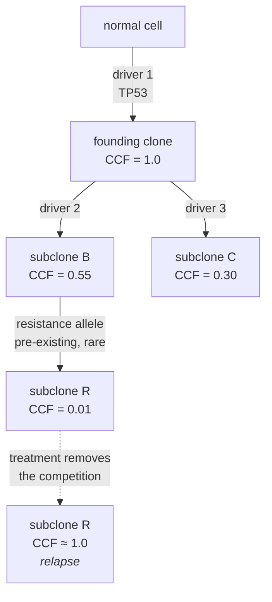
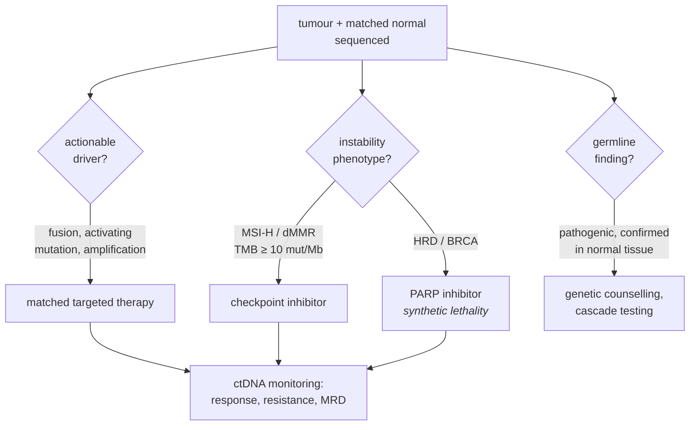

# 56 — Cancer genomics

> **Before this:** [Ch 16 — Mutation](../part-03-genome-instability/16-mutation.md) ·
> [Ch 17 — DNA repair](../part-03-genome-instability/17-dna-repair.md) ·
> [Ch 27 — The four forces](../part-05-population-genetics/27-the-four-forces.md) ·
> [Ch 46 — Variant calling](../part-10-functional-genomics/46-variant-calling.md) ·
> **Time:** ~60 min
>
> **Statistics needed:** [S2 Distributions](../part-S-statistics/S2-distributions.md) ·
> [S4 Hypothesis testing](../part-S-statistics/S4-hypothesis-testing.md) ·
> [S7 High-dimensional data](../part-S-statistics/S7-high-dimensional-data.md)

## What you'll be able to do

- Describe a tumour as a population under somatic evolution, and name what plays the role of mutation, selection, drift and effective population size
- Explain why a naive recurrence test manufactures false driver genes, why more samples makes it worse, and what a background model must condition on
- Read "oncogene" or "tumour suppressor" directly off the shape of a mutation diagram, derive Knudson's two hits from age-of-onset data, and explain why loss of heterozygosity is the usual second hit
- Classify a variant found in a tumour as germline, somatic or clonal-haematopoietic from its allele fractions, and explain why a hereditary syndrome is a head start rather than a cause
- Decompose a tumour's 96-channel mutation spectrum into signatures and read a repair defect or an exposure back out of the exposures
- Compute a cancer cell fraction from variant allele fraction, purity, copy number and mutant multiplicity, and use it to order events in a tumour's history
- Distinguish established biomarker-directed practice from investigational use, for targeted therapy, PARP inhibitors, immunotherapy biomarkers and ctDNA

## The core idea

Cancer is the clearest worked example of everything in Parts 3, 5 and 7, running inside one body over a few decades.

Take the definition of evolution from [Ch 27](../part-05-population-genetics/27-the-four-forces.md) — change in allele frequencies in a population over time — and change what the population is. It is no longer a species. It is the cells of a tissue. They divide, they inherit their parent cell's genome with occasional error, they compete for space and nutrients, and lineages that divide faster or die less become a larger share of the tissue. Every ingredient is present: heritable variation, differential reproduction, finite population size, and time.

Three parameters differ from the organismal case, and all three consequences matter.

**Generation time collapses.** Cell divisions take hours to days, not decades. A lineage inside you has more generations available than the entire history of your species.

**Recombination is absent.** Somatic lineages are strictly clonal. There is no sex, no crossing over, no way to separate a beneficial allele from the deleterious ones sitting next to it. Linkage is total, and hitchhiking is complete: **every mutation present in the founding cell of the winning clone rides to fixation with it, whether it contributed anything or not.** This single fact is why a cancer genome is mostly noise, and why separating signal from noise is the central computational problem of the field.

**The fitness function is local and orthogonal to yours.** A cell that proliferates faster than its neighbours wins the tissue, regardless of what that does to the organism. Selection has no foresight and no objective ([Ch 00](../part-00-orientation/00-the-whole-story.md)); it does not know the host will die. Cancer is what happens when the level at which selection acts drops from the organism to the cell.

> **A tumour is not a broken cell — it is a population that outcompeted its neighbours, and its genome is the fossil record of that competition.** Everything you can read off a cancer genome is one of three things: a cause of the expansion, a consequence of it, or a passenger that happened to be aboard the winning cell. Almost all of it is the third.

---

## 1. Somatic and germline: the distinction that organises the clinic

[Ch 16](../part-03-genome-instability/16-mutation.md) established that you are a mosaic. Cancer genomics turns that into an operational rule: every variant found in a tumour belongs to one of three categories, and the category determines who else is affected and what happens next.

| | Where it is | Expected VAF in tumour | Expected VAF in blood | Heritable? | Found by |
|---|---|---|---|---|---|
| **Germline** | every cell, including gametes | ~0.5 or ~1.0 | ~0.5 or ~1.0 | yes | any tissue |
| **Somatic (tumour)** | one clonal lineage in the tumour | continuous, 0 to ~1 | absent | no | tumour vs matched normal |
| **Clonal haematopoiesis** | one expanded blood clone | absent (unless blood-derived) | 2–20%, drifting upward with age | no | blood, and it contaminates the "normal" |

The third row is the trap. Blood is the standard matched normal, and blood in an older adult is not clonal-free: expanded haematopoietic clones carrying *DNMT3A*, *TET2*, *ASXL1* or *PPM1D* mutations are common past 60. Such a variant appears in the "normal" at 5% and gets subtracted as germline, or appears in plasma and gets called as tumour. Good assay design sequences white cells deeply and separately for exactly this reason.

The clinical stakes of the germline/somatic split are large. A somatic *BRCA1* mutation in an ovarian tumour is a property of that tumour. A germline one is a property of the patient and, with probability ½ per first-degree relative, of the family — which triggers a completely different conversation about cascade testing and surveillance. Tumour-only sequencing cannot tell them apart reliably, and returns incidental germline findings at a rate on the order of 10–15% in unselected advanced-cancer patients, most of them unsuspected from family history. That is a consent problem before it is a technical one ([Ch 58](../part-12-applications-and-ethics/58-ethics-and-society.md)).

## 2. The tissue as a population

Normal tissue is not a passive background. A colonic crypt is maintained by a handful of stem cells competing neutrally for niche positions; drift alone converts a crypt to monoclonality within years. Normal oesophagus and skin in middle-aged people are patchworks of clones carrying *NOTCH1* and *TP53* mutations, some covering square centimetres. **Positively selected somatic mutations in cancer genes are the normal state of normal tissue.**

That reframes the question. Cancer is not "a cell acquired a driver". Drivers are acquired constantly and almost never produce a tumour. Cancer is the rare trajectory in which enough capabilities accumulate in one lineage, in an order that works, for the clone to escape the constraints that hold ordinary clones in place.

The **hallmarks** framework (Hanahan and Weinberg 2000, extended 2011, revisited as *Hallmarks of Cancer: New Dimensions*, 2022) enumerates those capabilities: sustained proliferative signalling, evasion of growth suppressors, resistance to cell death, replicative immortality, angiogenesis, invasion and metastasis, metabolic reprogramming and immune evasion, with genome instability and tumour-promoting inflammation as *enabling* characteristics, and phenotypic plasticity, non-mutational epigenetic reprogramming, polymorphic microbiomes and senescent cells added in 2022.

Read it correctly: the hallmarks are **phenotypic solutions selection can reach, not a list of causes.** Many genotypes reach the same hallmark — which is why one tumour type recurs with different driver combinations across patients, and why some hallmarks are reached with no mutation at all, by chromatin state ([Ch 23](../part-04-gene-regulation/23-chromatin-and-epigenetics.md)) rather than sequence.

## 3. Drivers, passengers, and a statistical trap

A **driver** mutation confers a selective advantage on the clone carrying it. A **passenger** does not. Note carefully what this is a statement about: a fitness effect, not a function. A mutation that destroys an important protein is a passenger if it does not change the clone's growth rate.

The ratio is brutal. Across 2,658 whole cancer genomes and 38 tumour types in the PCAWG analysis, tumours carried on average **4–5 driver mutations**, with no driver identified at all in about 5% of cases — against a total burden ranging from a few hundred to several hundred thousand somatic mutations. You are looking for four needles in a haystack whose size varies a thousandfold between patients.

### The naive test, and why it fails

The obvious approach: for gene *g* of coding length *L*, count non-synonymous mutations across *N* tumours, compare to the expectation under a background rate μ, and reject.

$$\text{observed} \sim \text{Poisson}(\mu L N), \qquad z = \frac{O - \mu L N}{\sqrt{\mu L N}}$$

> **Statistics:** the Poisson count model, and why its standard deviation is the square root of its mean — which is where that denominator comes from — is covered in [S2](../part-S-statistics/S2-distributions.md) §2.

This is correct, and it produces garbage, because μ is not a constant. From [Ch 16](../part-03-genome-instability/16-mutation.md) §7, the local somatic mutation rate varies severalfold with **replication timing** (late-replicating regions higher), **chromatin state** (closed heterochromatin higher), **transcription** (transcription-coupled repair lowers the rate on the transcribed strand of expressed genes), and **sequence context**. It also varies more than a thousandfold in overall burden between tumours of the same type.

Now watch what a modest, uniform misspecification does. Suppose the tumour type has a median burden of 2 mutations per Mb, so the naive μ₀ = 2 × 10⁻⁶ per bp per tumour. Gene *G* has 100 kb of coding sequence, is late-replicating, heterochromatic and unexpressed in this tissue, and its true local rate is 3μ₀.

```
expected per tumour, naive     = 2e-6 × 1e5           = 0.2
expected over N = 1,000        = 200
observed  (true rate = 3 μ0)   = 600
excess                         = 400
z = 400 / sqrt(200)            = 28.3
```

> **Statistics:** the Bonferroni correction behind the threshold below — α/*m* for *m* ≈ 20,000 genes, which is exactly 2.5 × 10⁻⁶ — is covered in [S7](../part-S-statistics/S7-high-dimensional-data.md) §2.

Genome-wide significance over ~20,000 genes at α = 0.05 needs *p* < 2.5 × 10⁻⁶, i.e. |z| ≳ 4.6. This gene clears it by a factor of six. And the general form is the problem:

$$z \;=\; \frac{(r-1)\,\mu_0 L N}{\sqrt{\mu_0 L N}} \;=\; (r-1)\sqrt{\mu_0 L N} \;\propto\; \sqrt{N}$$

where *r* is the ratio of true to assumed rate. **The false positive becomes more significant as the study grows.** This is not a power problem that more data solves — it is a bias problem, and bias multiplied by sample size beats noise. Running the numbers backwards, this gene falls below the significance threshold only for *N* < 26, which is smaller than any study that could find a real driver.

This is not hypothetical. Early exome-scale driver scans confidently reported olfactory receptor genes and *TTN* — a 100 kb-coding-sequence muscle protein — as recurrently mutated across cancers. The excess was entirely local background rate. Lawrence et al. (*Nature*, 2013) diagnosed it and gave the fix.

### Two fixes

**Condition on the covariates.** Model the background rate per gene per patient as a function of replication timing, expression and chromatin state, using the patient's own 96-channel mutation spectrum to compute the rate expected for that gene's specific sequence composition, and borrow strength across genes with similar covariates. This is a covariate model plus empirical-Bayes shrinkage, covered in [S7](../part-S-statistics/S7-high-dimensional-data.md) §6; the biology is in knowing *which* covariates are load-bearing. `MutSigCV` is the canonical implementation.

**Use an internal control instead: somatic dN/dS.** Synonymous mutations in gene *g* experience the *same* replication timing, the *same* chromatin, the *same* trinucleotide contexts and the *same* patient-specific spectrum as the non-synonymous ones. So the synonymous count within the gene is a per-gene control for every covariate you failed to model. This is exactly the [Ch 33](../part-07-molecular-evolution/33-neutral-theory-and-selection-tests.md) statistic, applied within a body rather than between species, with the context correction made explicit (`dNdScv`). Its virtue is an interpretable effect size: dN/dS = 2 for missense in a gene says half the observed missense mutations there are attributable to selection, which converts directly into an estimate of how many driver mutations a tumour actually carries. Its limitation is that synonymous sites are not perfectly neutral — splice enhancers and codon usage put a floor under the denominator.

### Three families of driver-discovery method

| Family | Signal it exploits | Detects | Blind to |
|---|---|---|---|
| **Recurrence above background** | more mutations than the local rate predicts | genes hit often in a cohort | genes with few but potent mutations; anything the background model gets wrong |
| **Functional impact** | mutations skewed toward damaging predictions | genes whose mutations are non-randomly severe | inherits every bias of the pathogenicity predictor ([Ch 55](55-clinical-variant-interpretation.md)) |
| **Positional clustering** | mutations concentrated in 1D sequence or 3D protein structure far more than uniform | oncogene-style hotspots, including ones too rare to reach recurrence significance | tumour suppressors, whose mutations are deliberately dispersed |

The three are complementary because they key on different consequences of selection, and consensus calls across them are more robust than any one. Non-coding driver discovery is much harder — there is no synonymous control, no codon structure to exploit, and the background model problem is worse. The great success is the *TERT* promoter: two recurrent substitutions, c.-124C>T at chr5:1,295,113 and c.-146C>T at chr5:1,295,135 (GRCh38; 1,295,228 and 1,295,250 in GRCh37), each creating a new ETS-family transcription factor binding site and reactivating telomerase. PCAWG's systematic non-coding scan found remarkably few others.

## 4. Oncogenes and tumour suppressors — readable off a picture

Two classes, distinguished by the *direction* of the functional change, with a mechanical consequence that is visible in a mutation diagram at a glance.

| | Oncogene | Tumour suppressor |
|---|---|---|
| Change | gain of function | loss of function |
| Cellular genetics | dominant — one allele suffices | recessive — both copies must go |
| Analogy | accelerator stuck down | brake cut |
| How many sequence changes achieve it | very few | almost any |
| Point-mutation pattern | **clustered at hotspot residues**, missense | **dispersed**, enriched for nonsense, frameshift, splice |
| Other routes | amplification, fusion, enhancer hijacking | deletion, LOH, promoter hypermethylation |
| Therapeutic handle | inhibit the product — druggable | nothing to inhibit; only synthetic lethality |

The pattern falls straight out of the mechanism. To *create* a new activity you must make a specific change — lock a GTPase in its GTP-bound state, or a kinase in its active conformation. Only a handful of amino acid substitutions do that, so selection can only reward those, and the mutations pile up on a few codons. To *destroy* an activity, anything works. Every truncating mutation in the first two-thirds of the coding sequence is equivalent, so selection rewards a broad, flat distribution.

```
KRAS — oncogene, 189 aa
                 G12 G13                Q61
                  ▼▼▼                    ▼
      ├───────────●●●────────────────────●────────────────────┤
      1       ▓▓▓▓▓▓▓ P-loop        ▓▓▓▓▓ switch II         189
      >95% of KRAS mutations in cancer fall on three codons


APC — tumour suppressor, 2,843 aa
       ✕  ✕✕   ✕  ✕ ✕✕✕✕✕✕✕✕✕✕✕✕✕✕✕✕ ✕✕  ✕   ✕    ✕      ✕
      ├──────────────────────────────────────────────────────┤
      1   ▓▓▓ oligomerisation    ▓▓▓▓▓▓ β-catenin binding   2843
      ✕ = nonsense or frameshift, anywhere in the 5' two-thirds
```

*APC* carries a caveat worth stating, because it cuts against the diagram. The mutations are dispersed in the sense that *any* truncation destroys the function — but somatic *APC* mutations nonetheless concentrate in the **mutation cluster region**, codons 1286–1513, under 10% of the coding sequence carrying over 60% of the somatic hits. Truncating there removes the AXIN-binding SAMP repeats while retaining some β-catenin-binding repeats, leaving Wnt output high but not maximal — the "just-right" level for tumour growth. That is dosage tuning *within* the truncating class, not hotspot gain of function, and it is why real suppressor lollipops are rarely as flat as the selective logic alone predicts.

The same distinction has a quantitative form. For a gene under no selection, roughly 5–8% of coding point mutations are nonsense, set by the genetic code and the local base composition. A tumour suppressor shows 30–60% truncating; an oncogene shows near zero, often *below* neutral, because a truncated oncoprotein is useless to the clone. In dN/dS terms: an oncogene has *w*<sub>missense</sub> ≫ 1 with *w*<sub>nonsense</sub> ≈ 1; a tumour suppressor has *w*<sub>nonsense</sub> ≫ 1.

*TP53* is the instructive exception. It is a tumour suppressor whose missense mutations cluster hard at a handful of DNA-binding-domain residues — p.(Arg175His), p.(Arg248Gln), p.(Arg273His), p.(Arg282Trp). The reason is that p53 works as a tetramer, so a mutant subunit poisons complexes containing wild-type subunits: a **dominant-negative** effect, plus neomorphic gain-of-function activity for some alleles. The lollipop looks like an oncogene's because the *selective* logic is an oncogene's, even though the gene is a suppressor. When the picture and the classification disagree, the picture is telling you about the mechanism.

Two routes bypass point mutation entirely. **Amplification** raises oncogene dosage (*ERBB2* in breast and gastric cancer, *MYCN* in neuroblastoma, *EGFR* in glioblastoma). **Structural rearrangement** creates **gene fusions**, of two kinds: a chimeric protein with constitutive activity (*BCR::ABL1* in chronic myeloid leukaemia, *EML4::ALK* in lung adenocarcinoma), or an intact oncogene relocated under someone else's strong regulatory element (*IGH::MYC* in Burkitt lymphoma, *TMPRSS2::ERG* in prostate cancer). The second kind is a purely regulatory driver with no change to any protein sequence.

## 5. Knudson's two hits, derived rather than asserted

In 1971 Knudson had no sequence data. He had ages at diagnosis for retinoblastoma, and two clinical forms:

| | Hereditary form | Sporadic form |
|---|---|---|
| Laterality | bilateral, multifocal | unilateral, one tumour |
| Mean age at diagnosis | ~15 months | ~30 months |
| Family history | often present | absent |

The derivation is a hazard argument. Suppose a tumour requires *k* independent rate-limiting events in one cell, each occurring at constant rate per cell per unit time. The probability a given cell has accumulated all *k* by age *t* goes as *t*<sup>k</sup>, so the **incidence** — the hazard, the derivative — goes as *t*<sup>k−1</sup>.

- **Sporadic retinoblastoma incidence rises linearly with age** over the susceptible window: *t*<sup>1</sup>, so *k* = 2. **Two hits.**
- **Hereditary retinoblastoma incidence is roughly flat**: *t*<sup>0</sup>, so *k* = 1. One hit — because the other was inherited and is already in every retinal cell.

That single-parameter difference explains both clinical observations at once. If a carrier needs one hit in any of millions of retinoblasts, the number of tumours per carrier is Poisson with mean λ ≈ 3, which is what Knudson observed. Poisson also predicts a small fraction of carriers with *zero* tumours — e<sup>−3</sup> ≈ 5% — which is why an autosomal dominant predisposition shows incomplete penetrance without anything else going on. And bilaterality is automatic: independent hits in two eyes are two independent Poisson draws.

The gene is *RB1* at 13q14, and the two hits are its two alleles. But the second hit is usually not an independent point mutation, because there is a much faster way to lose one allele: **loss of heterozygosity (LOH)** — losing the entire chromosomal region containing the wild-type copy.

| LOH mechanism | Copy number after | Detectable as |
|---|---|---|
| Mitotic recombination between homologues | 2 (copy-neutral) | allelic imbalance with no coverage change |
| Chromosome loss | 1 | allelic imbalance plus coverage loss |
| Chromosome loss then reduplication | 2 (copy-neutral) | as mitotic recombination |
| Interstitial deletion | 1 or 0 | focal coverage loss |
| Gene conversion | 2 (copy-neutral) | short tract of allelic imbalance |
| Promoter hypermethylation ("epi-hit") | 2 | no genomic change at all — needs methylation data |

The asymmetry is the point: **the first hit is a base, the second is an arm.** Mitotic recombination and chromosome missegregation happen per cell division at rates vastly higher than the per-base mutation rate, so once the first allele is gone the second follows quickly. That is why two-hit inactivation is achievable at all within a human lifetime.

LOH is read straight off germline heterozygous SNPs. At a purity of ρ = 0.65 with copy-neutral LOH, a het site where the tumour retained the B allele sits at B-allele fraction (0.65 × 2 + 0.35 × 1)/2 = 0.825, and one where it retained A sits at 0.175:

```
                          B-allele fraction across 17q
                     0.0    0.25    0.5    0.75    1.0
normal tissue         ·      ·     ▓▓▓▓▓    ·      ·
tumour, het retained  ·      ·     ▓▓▓▓▓    ·      ·
tumour, LOH, ρ=0.65   ·   ▓▓▓▓      ·      ▓▓▓▓    ·
                          0.175           0.825
```

Coverage separates the mechanisms: copy-neutral LOH leaves the log₂ coverage ratio at 0, hemizygous deletion drops it (to log₂(1.35/2) = −0.57 at this purity).

Three modern refinements to "two hits". **Haploinsufficiency**: some suppressors are dosage-sensitive and one hit is enough. **Dominant-negative and gain-of-function**: *TP53* again. And the hazard exponent for common adult carcinomas is not 1 — the Armitage–Doll multistage analysis of age-incidence curves gives *k* ≈ 6–7 rate-limiting steps, consistent with the 4–5 drivers plus additional epigenetic and microenvironmental events that whole-genome sequencing now counts directly.

## 6. Hereditary cancer syndromes: germline plus somatic

| Syndrome | Gene(s) | Pathway | Spectrum | Genomic consequence in the tumour |
|---|---|---|---|---|
| Hereditary breast and ovarian cancer | *BRCA1*, *BRCA2*, *PALB2* | homologous recombination | breast, ovarian, prostate, pancreatic | HRD signatures; PARP-inhibitor sensitivity |
| Lynch syndrome | *MLH1*, *MSH2*, *MSH6*, *PMS2*, *EPCAM* | mismatch repair | colorectal, endometrial, urothelial, others | MSI, high indel burden, immunotherapy sensitivity |
| Li–Fraumeni | *TP53* | DNA damage response | sarcoma, breast, brain, adrenocortical, very early onset | widespread instability; no targeted therapy |
| Familial adenomatous polyposis | *APC* | Wnt signalling | hundreds of colorectal adenomas | early *APC* biallelic loss |
| Retinoblastoma | *RB1* | cell-cycle restriction point | retinoblastoma, later sarcomas | LOH at 13q14 |
| MEN2 | *RET* | receptor tyrosine kinase | medullary thyroid, phaeochromocytoma | germline **activating** — the rare germline oncogene |

Note the last row. Germline predisposition genes are overwhelmingly tumour suppressors, because a constitutively activated oncogene in every cell of an embryo is usually lethal or produces a developmental syndrome rather than a cancer syndrome. *RET* in MEN2 is the exception that shows the rule.

The unifying model: **the germline variant is not the cause of the cancer — it is a head start.** A carrier's cells begin one step along a path everyone's cells are on. Three predictions follow, and all three hold: earlier onset, multiple primary tumours, and — crucially — the tumour still requires somatic events, so sequencing a carrier's tumour shows **biallelic** inactivation, with the wild-type allele lost somatically. That observation is itself used as evidence in variant classification ([Ch 55](55-clinical-variant-interpretation.md)).

Penetrance is high but not complete and not a constant. Prospective cohort estimates put cumulative breast cancer risk to age 80 at about 72% for *BRCA1* and 69% for *BRCA2* carriers, and ovarian cancer risk at about 44% and 17% respectively — but these are cohort averages, and individual risk is modified by variant position, family history and common polygenic background ([Ch 53](53-polygenic-scores.md)). Professionals reason about a *distribution* of risk, not a number, and translate it into surveillance intensity and risk-reducing options; this chapter describes that reasoning and does not substitute for it.

## 7. Mutational signatures: reading causes off the genome

[Ch 16](../part-03-genome-instability/16-mutation.md) §10 set up the encoding: each somatic single-base substitution is assigned to one of **96 channels** — 6 substitution classes referenced to the pyrimidine of the pair (C>A, C>G, C>T, T>A, T>C, T>G) × 4 possible 5′ neighbours × 4 possible 3′ neighbours. Pyrimidine referencing is not cosmetic: in an unstranded assay you cannot tell which strand carried the lesion, so C>T and G>A are the same observation.

Stack *G* tumours into a 96 × *G* count matrix **M** and factorise:

$$\mathbf{M} \;\approx\; \mathbf{W}\mathbf{H}, \qquad \mathbf{W} \in \mathbb{R}^{96 \times K}_{\ge 0},\;\; \mathbf{H} \in \mathbb{R}^{K \times G}_{\ge 0}$$

Columns of **W** are **signatures** — the characteristic 96-channel profile of one mutational process. Rows of **H** are **exposures** — how much of each process ran in each tumour.

Take NMF itself as given — PCA, the decomposition it gets contrasted with, is in [S7](../part-S-statistics/S7-high-dimensional-data.md) §5. Spend the attention on why *this* decomposition and what breaks:

- **Non-negativity is physics, not regularisation.** A mutational process cannot remove mutations, and a tumour cannot have negative exposure to one. PCA is simply the wrong tool: a component with negative loadings has no mechanistic reading.
- **Choosing *K* is the hard part**, and it is done by stability rather than fit. Bootstrap-resample the cohort, refit, and keep the *K* at which the recovered signatures reproduce across replicates while reconstruction error is still acceptable. Too large a *K* splits one real process into two correlated halves; too small merges two.
- **Identifiability fails for co-occurring processes.** NMF recovers a unique factorisation only when the exposures are sufficiently spread out. Two processes that always fire together at a fixed ratio are recovered as their sum, not separately. This is real: the two APOBEC signatures SBS2 and SBS13 co-occur so tightly that they are interpreted as a pair.
- **Refitting is a different, easier problem.** For a single new tumour you fix **W** to the reference catalogue and solve for one exposure vector by non-negative least squares. With 96 equations and dozens of candidate signatures the system is over-determined but badly ill-conditioned — the reference signatures are close to collinear, so many different exposure vectors reconstruct the data almost equally well. You must therefore sparsify, or restrict the candidate set to signatures known to occur in that tissue. Fit all of them freely and you can reconstruct anything, including noise.

The reference catalogue is **COSMIC**, currently version 3.6 (released in COSMIC v104, May 2026), with separate catalogues for single-base substitutions (SBS), doublet substitutions (DBS), small insertions and deletions (ID), and copy-number and rearrangement classes. Signature numbers are identifiers, not ranks.

| Signature | Profile | Underlying process | What it tells you |
|---|---|---|---|
| SBS1 | C>T at CpG | spontaneous deamination of 5-methylcytosine | a clock — accumulates with divisions and age |
| SBS5 | flat, all channels | ubiquitous, mechanism unclear | a second, slower clock |
| SBS4 | C>A, broad context | bulky guanine adducts from tobacco smoke | tobacco exposure |
| SBS7a/b | C>T at dipyrimidines, CC>TT doublets | UV photoproducts | sun exposure |
| SBS2 + SBS13 | C>T and C>G at T**C**W | APOBEC3 cytidine deaminases | often episodic and clustered |
| SBS6/15/20/21/26 + ID1/ID2 | C>T plus indels at homopolymers | mismatch-repair deficiency | MSI, Lynch or somatic *MLH1* silencing |
| SBS10a/b | huge excess at TCT and TCG | *POLE* exonuclease-domain loss | ultra-hypermutation |
| SBS3 (+ ID6, rearrangement signatures) | flat SBS profile; deletions with microhomology | homologous-recombination deficiency | *BRCA1/2*, *PALB2*, "BRCAness" |
| SBS31, SBS35 | platinum adduct spectra | prior chemotherapy | iatrogenic — the treatment left a record |

Two disciplines of interpretation. First, **a signature is evidence about a process, not proof of an exposure**: SBS4 in a never-smoker means something produced that chemistry, and the inference to a cause runs through everything else you know about the patient. Second, the flattest signatures are the least specific. SBS3 alone is a weak call, which is why clinical HRD assessment combines the substitution signature with **ID6** (deletions bearing microhomology at the junction — the fingerprint of microhomology-mediated end joining substituting for HR, [Ch 17](../part-03-genome-instability/17-dna-repair.md)) and with genomic-scar scores built from LOH extent, telomeric allelic imbalance and large-scale state transitions.

The data also carries its own internal check. Bulky adducts are removed preferentially from the transcribed strand by transcription-coupled repair, so a genuine adduct signature shows **transcriptional strand bias**; replication-associated processes show **replicative strand bias** flipping at replication origins. A signature without the expected asymmetry deserves suspicion.

## 8. Instability phenotypes: mutations in the mutation rate

Most drivers change a growth rate. A smaller class changes the **mutation rate**, and the evolutionary consequence is different — it does not increase fitness directly, it increases the supply of variation on which selection acts. Because linkage is total in a clonal population, a mutator allele hitchhikes with the beneficial mutations it generates.

| Phenotype | Mechanism | Genomic signature | Clinical hook |
|---|---|---|---|
| **MSI / MMR deficiency** | loss of *MLH1*, *MSH2*, *MSH6*, *PMS2* — germline in Lynch, somatic *MLH1* promoter hypermethylation in sporadic cases | indels at mono- and dinucleotide repeats; high burden dominated by indels; SBS6/15/20/21/26 | checkpoint inhibitors (established) |
| ***POLE* / *POLD1*** | proofreading exonuclease domain lost | ultra-hypermutation, often >100 mut/Mb, SBS10 | checkpoint inhibitors |
| **Chromosomal instability (CIN)** | mitotic checkpoint and cohesion defects, telomere crisis, centrosome amplification | aneuploidy, arm-level copy-number change, subclonal copy number | poor prognosis; drug tolerance |
| **HRD** | *BRCA1/2*, *PALB2*, *RAD51C/D* loss or *BRCA1* methylation | SBS3, ID6, large deletions with microhomology, high scar score | PARP inhibitors (established) |
| **Chromothripsis** | chromosome pulverised in a micronucleus, religated at random ([Ch 20](../part-03-genome-instability/20-chromosome-abnormalities.md)) | copy number oscillating between two states, tightly clustered breakpoints, uniform join orientations | can create an oncogene amplification in one event |
| **Kataegis** | APOBEC acting on single-stranded DNA at resected break ends | tight clusters of C>T and C>G at TCW within a few kb, colocalised with rearrangement breakpoints | mechanistic marker linking APOBEC to repair |
| **Whole-genome doubling** | cytokinesis failure or mitotic slippage | genome-wide ploidy > 2; ~30% of primary tumours (818 of 2,778 tumour samples in PCAWG), higher in metastases | poor prognosis |

Whole-genome doubling deserves its own sentence, because *why it is selected* is not obvious. Doubling buffers: with four copies of everything, a subsequent deleterious mutation or chromosome loss is less likely to be lethal. It therefore **raises the tolerable rate of LOH and aneuploidy**, licensing the instability that follows. It also confounds every downstream inference — a mutation that occurred before doubling is duplicated with the genome and appears at higher multiplicity than one that occurred after, which is exactly how you *date* the doubling event against the tumour's own mutational clock.

**Extrachromosomal DNA (ecDNA)** is the sharpest violation of everything in Part 2. Circular megabase-scale elements carrying amplified oncogenes, with no centromere, they segregate randomly rather than equally at mitosis. Copy number therefore changes fast and non-Mendelianly within a tumour, generating extreme heterogeneity in oncogene dosage and a rapid, reversible route to drug resistance. Inheritance inside a body does not have to obey the rules inheritance between bodies obeys.

## 9. Heterogeneity, clonal architecture, and resistance as selection

A biopsy is a mixture: normal cells, and one or more tumour subclones, at unknown proportions, on unknown local copy number. [Ch 46](../part-10-functional-genomics/46-variant-calling.md) gave the simple diploid case; here is the general relation between the observable and the quantity you want.

$$\text{VAF} \;=\; \frac{\rho\,\varphi\,m}{\rho\,\text{CN}_t + (1-\rho)\,\text{CN}_n} \qquad\Longleftrightarrow\qquad \varphi \;=\; \text{VAF}\cdot\frac{\rho\,\text{CN}_t + (1-\rho)\,\text{CN}_n}{\rho\,m}$$

with ρ the tumour purity, φ the **cancer cell fraction** (CCF) — the fraction of tumour cells carrying the mutation — *m* the number of mutant copies per carrying cell, CN<sub>t</sub> the local tumour copy number and CN<sub>n</sub> the normal copy number (2 on autosomes).

VAF is not interpretable. CCF is. A mutation at φ ≈ 1 is **clonal** — present in the founding cell, therefore in every tumour cell, therefore a valid target. A mutation at φ = 0.3 is **subclonal** — present in one branch.

Cluster the CCFs across thousands of mutations and the clusters are the tumour's population structure. Reconstructing the tree from them is a phylogenetics problem ([Ch 34](../part-07-molecular-evolution/34-phylogenetics.md)) with one extra constraint that does most of the work:

> **The pigeonhole rule.** Cancer cell fractions of sibling clones must sum to at most 1, because they occupy disjoint sets of cells. If cluster B is at 0.7 and cluster C at 0.5, they cannot be siblings — 1.2 > 1 — so one must be *nested inside* the other, and the larger is ancestral. Frequencies alone force the topology.

The reconstruction rests on the **infinite sites assumption** — each genomic position mutates at most once, so shared mutations imply shared ancestry. It fails at CpG hotspots, under very high mutation rates, and whenever LOH deletes a mutated allele and erases the evidence.



**Bulk sequencing has a hard floor and a spatial blind spot.** Subclones below roughly 5–10% CCF are indistinguishable from noise at standard depth, and one biopsy samples one region: multi-region studies (TRACERx and its successors) showed that mutations called clonal from a single biopsy are frequently subclonal in the whole tumour. Single-cell methods trade one limitation for another — scDNA-seq gives per-cell genotypes but suffers severe allelic dropout; scRNA-seq ([Ch 48](../part-10-functional-genomics/48-single-cell-and-spatial.md)) resolves expression state and large-scale copy number inferred from expression averaged along chromosomes, but calls individual SNVs poorly.

> **Statistics:** a detection floor is a statement about the power of the test, not about what is present in the tumour; computing the power of the test you just ran is [S4](../part-S-statistics/S4-hypothesis-testing.md) §5.

### Resistance is selection on standing variation

This is the cleanest evolutionary argument in clinical medicine, and it is the [Ch 16](../part-03-genome-instability/16-mutation.md) fluctuation-test logic transplanted into a patient.

Two hypotheses for how a resistant tumour arises. **Induction**: the drug causes the resistance mutation. **Selection**: the resistance mutation was already present in a rare subclone, and the drug removed its competitors.

They make different predictions. Under induction, resistance should arise as a single lineage, and its timing should depend on the post-treatment mutation supply. Under selection, resistance should be present *before* treatment at low frequency, should appear as a sweep, and — the decisive prediction — should frequently be **polyclonal**: several *independent* resistant lineages, each with a different mutation achieving the same functional escape, expanding in parallel in the same patient.

Polyclonal resistance is what is observed. Colorectal cancers treated with anti-EGFR antibodies relapse with multiple distinct *KRAS* and *NRAS* mutant clones detectable simultaneously in plasma. *EGFR*-mutant lung cancers on osimertinib relapse through several independent routes at once. Chronic lymphocytic leukaemia on ibrutinib relapses with independent *BTK* p.(Cys481Ser) clones. Convergent evolution on the same functional target, from independent mutational origins, is the fingerprint of selection acting on pre-existing variation.

One honest complication: some cytotoxic drugs are themselves mutagens and do raise the supply — platinum agents leave SBS31 and SBS35 behind. The drug can be both a mutagen and a selective agent. But the resistance allele that actually sweeps is usually one that was already there.

The therapeutic implication is uncomfortable. Maximum-tolerated-dose treatment maximises the selection differential and therefore the speed of the sweep. **Adaptive therapy** — dosing to *contain* the tumour and deliberately preserve drug-sensitive cells so they competitively suppress resistant ones — follows directly from the population genetics and is in clinical trials. It is investigational, not standard care.

## 10. From genome to treatment



**Targeted therapy matched to a driver** is the oldest and most solid part: *BCR::ABL1* in chronic myeloid leukaemia; *EGFR* exon 19 deletions and p.(Leu858Arg) and *ALK* fusions in lung adenocarcinoma; *ERBB2* amplification in breast and gastric cancer. Tissue-agnostic approvals now exist for *NTRK* and *RET* fusions — the alteration, not the organ, defines the indication. Even *KRAS*, undruggable for forty years, has covalent inhibitors against the p.(Gly12Cys) allele specifically, with responses that are real, modest and short-lived.

The instructive failure is *BRAF* p.(Val600Glu). In melanoma, BRAF plus MEK inhibition works well. In colorectal cancer the identical variant responds poorly to the identical drug, because colorectal cells answer BRAF inhibition with rapid EGFR-mediated reactivation of the pathway and melanoma cells do not. Same variant, same protein, different tissue, different result. **Genotype to therapy is not a lookup table; the driver is necessary and the cellular context is decisive.**

**Synthetic lethality** is the only handle on a *lost* function — you cannot pharmacologically restore a deleted tumour suppressor. The full derivation is in [Ch 17](../part-03-genome-instability/17-dna-repair.md) §7; the summary is that PARP inhibition is tolerable in HR-proficient normal cells and lethal in HR-deficient tumour cells, and the therapeutic window *is* the difference between the patient's germline genotype and the tumour's somatic one. Olaparib was approved in 2014 for *BRCA*-mutated ovarian cancer; the class now covers breast, pancreatic and prostate indications, and HRD-positive ovarian maintenance beyond *BRCA* with a companion diagnostic. Resistance comes largely through *BRCA* **reversion** mutations that restore the reading frame — and reversions are detectable in plasma, which links this section to the next.

**Immunotherapy biomarkers** work through neoantigens. A non-synonymous somatic mutation can produce a peptide absent from the self-repertoire against which T cells were tolerised; presented on MHC class I, it is a target. Checkpoint blockade does not create those T cells — it removes the inhibitory brake on ones that already exist. More mutations means more chances that some peptide is both presented and recognised, which is the mechanistic reason tumour mutational burden predicts response *on average*.

Two established, tissue-agnostic approvals encode this. Pembrolizumab for **MSI-H / mismatch-repair-deficient** solid tumours (May 2017, the first tissue-agnostic oncology approval), and for **TMB-high** solid tumours at ≥10 mutations/Mb (June 2020, on a 29% objective response rate in KEYNOTE-158).

Be precise about what those approvals do and do not license as understanding:

- **MSI outperforms raw TMB, and the reason is mechanistic.** MMR deficiency generates indels in coding repeat tracts, and a frameshift produces a long stretch of *entirely novel* peptide rather than a single altered residue. It is not the count that matters most, it is the kind.
- **TMB is assay-dependent and not portable.** Panel size, whether synonymous mutations are counted, and whether germline variants are subtracted all shift the number. At low burden a panel estimate rests on a handful of counts with a very wide Poisson interval.
- **Clonality matters.** A clonal neoantigen is present in every tumour cell; a subclonal one is a target on a minority. High heterogeneity is itself an immunotherapy resistance mechanism — §9 feeding back into treatment.
- The 10 mut/Mb threshold is a regulatory line, not a biological one, and its predictive value varies substantially across tumour types and with immune infiltration.

**Liquid biopsy.** Dying cells shed fragmented DNA into plasma. Cell-free DNA is mostly haematopoietic, peaks at ~166 bp (the nucleosome-protected length), and clears with a half-life of a couple of hours — so it is a near-real-time sample of the whole tumour burden, including metastases a needle would never reach. Circulating tumour DNA (ctDNA) fraction ranges from >10% in advanced disease to below 0.01% in residual disease. Four uses, at four levels of maturity:

| Use | Maturity as of 2026 |
|---|---|
| **Genotyping in advanced disease** — find the actionable driver without a biopsy | **Established.** FDA-approved plasma companion diagnostics exist. A positive result is actionable; a negative one requires tissue, because low shedding produces false negatives |
| **Monitoring and resistance detection** — *KRAS* clones on anti-EGFR therapy, *ESR1* p.(Asp538Gly) on aromatase inhibitors, *BRCA* reversions on PARP inhibitors | **Established for specific indications**, with matched drugs and approved plasma assays |
| **Minimal residual disease** after curative-intent surgery — tumour-informed personalised panels tracking the resected tumour's own mutations at extreme depth | **Strongly prognostic and widely used.** Most tumour-informed MRD assays are still laboratory-developed tests, but the first randomised evidence that *acting* on an MRD-positive result improves survival arrived with IMvigor011 (*NEJM*, October 2025): ctDNA-guided adjuvant atezolizumab in muscle-invasive bladder cancer improved disease-free and overall survival, while persistently ctDNA-negative patients did well on no adjuvant therapy. The FDA approved Signatera CDx as a companion diagnostic on that basis in May 2026 — the first for blood-based MRD. Whether it generalises to other tumour types is still open; further interventional trials are running |
| **Early detection / screening** | **Most contested.** A blood-based colorectal screening test was FDA-approved in July 2024 with 83% sensitivity for cancer, 90% specificity — and only 13% sensitivity for advanced precancerous lesions, which is where screening's benefit mostly comes from. Multi-cancer early detection tests remain in large trials |

Two constraints on the last row that no assay improvement removes. Against a low prior — cancer prevalence in a screened population is well under 1% — specificity, not sensitivity, sets the positive predictive value and thus the downstream burden of investigating false positives. And a test that detects cancers earlier necessarily detects some that would never have caused harm; **overdiagnosis is a property of the disease's natural history, not of the assay**. Clonal haematopoiesis reappears here too: a "tumour" mutation in plasma may be from an expanded blood clone, which is why serious MRD assays sequence white cells in parallel.

---

## Common misconceptions

| What people think | What's actually true |
|---|---|
| Cancer is a genetic disease, so it runs in families | Nearly all cancer driver mutations are somatic and unheritable. Strong hereditary predisposition accounts for roughly 5–10% of cases |
| A driver mutation causes cancer | A driver confers a *selective advantage*. Drivers are acquired constantly in normal tissue and almost never produce a tumour; on average 4–5 are needed together, in a workable order |
| The most frequently mutated gene is the most important driver | Frequency confounds selection with background mutation rate. *TTN* and olfactory receptors were reported as pan-cancer drivers for exactly this reason |
| More tumours sequenced will fix the false-driver problem | The false-positive z-score grows as √N. Bias times sample size beats noise; only a correct background model helps |
| A mutational signature identifies an exposure | It identifies a *process*. Different causes can generate similar chemistry, and the flatter the signature the weaker the inference. SBS3 alone is a weak HRD call |
| Tumour suppressors always need two hits | Haploinsufficiency, dominant-negative alleles like mutant p53, and epigenetic silencing all break the strict model. "Two hits" is a statement about rate-limiting steps, and the number for adult carcinomas is closer to 6 |
| Resistance mutations are caused by the drug | The drug selects; the allele is usually pre-existing. Polyclonal resistance — several independent clones converging on the same escape — is the evidence. (Some chemotherapies *are* mutagenic and raise the supply as well, leaving their own signatures) |
| A VAF of 0.5 means half the cells carry it | VAF confounds purity, local copy number, mutant multiplicity and cancer cell fraction. Only CCF is interpretable, and computing it requires all four |
| High TMB means immunotherapy will work | The tissue-agnostic approval rests on a 29% response rate. TMB is a weak, assay-dependent prior; neoantigen quality, clonality and immune infiltration all matter more than the count |
| ctDNA-negative means cancer-free | It means below the assay's limit of detection, which depends on shedding, tumour site and depth. Absence of evidence |
| Tumour sequencing says nothing about the family | Incidental pathogenic germline findings turn up in the order of 10–15% of unselected advanced-cancer patients, most without suggestive family history |

## Worked example: one ovarian tumour, read end to end

Whole-genome sequencing of a high-grade serous ovarian carcinoma with matched blood. Purity ρ = **0.65**, ploidy ≈ 2.2, 4,320 somatic SNVs over 2.86 Gb of callable sequence.

**1 — Burden.** 4,320 / 2,860 Mb = **1.51 mutations per Mb**, genome-wide. A 1.1 Mb targeted panel would be expected to capture ~2 qualifying mutations, giving a panel TMB of 1.8/Mb — with an exact Poisson 95% interval on a count of 2 running from 0.24 to 7.22 events, i.e. **0.2 to 6.6 mutations/Mb**. Far below the ≥10 threshold, but note how little a panel count constrains the estimate near the boundary. Microsatellite status: stable. **No immunotherapy indication.**

**2 — Signature refit.** Fixing **W** to COSMIC SBS and solving for a sparse exposure vector:

```
SBS1  0.18  →   778 mutations    clock, CpG deamination
SBS5  0.44  → 1,901              clock, flat
SBS3  0.33  → 1,426              homologous-recombination deficiency
SBS8  0.05  →   216
                -----
                4,321  (rounding)
```

Corroborating evidence, which SBS3 alone would not justify: of 88 deletions longer than 10 bp, **61 carry ≥2 bp of microhomology at the junction** — the ID6 pattern, i.e. microhomology-mediated end joining substituting for HR. Genomic scar score elevated. **Call: HRD.**

**3 — The mechanism, and the two hits.** Blood carries a germline *BRCA1* variant, NM_007294.4:c.5266dup, p.(Gln1756Profs*74) — pathogenic. Its VAF in blood is 0.49, as expected for a heterozygote. In the tumour it reads **0.83**. Which is diagnostic, because the three hypotheses predict different numbers at ρ = 0.65:

```
germline het VAF  =  [ ρ·m_t + (1-ρ)·1 ] / [ ρ·CN_t + (1-ρ)·2 ]      ρ = 0.65

het retained           CN_t = 2, m_t = 1 : (0.65 + 0.35) / (1.30 + 0.70) = 1.00/2.00 = 0.500
copy-neutral LOH       CN_t = 2, m_t = 2 : (1.30 + 0.35) / (1.30 + 0.70) = 1.65/2.00 = 0.825
wild-type allele lost  CN_t = 1, m_t = 1 : (0.65 + 0.35) / (0.65 + 0.70) = 1.00/1.35 = 0.741
```

Observed 0.83 → **copy-neutral LOH**. The log₂ coverage ratio across 17q is 0.0, confirming two copies retained; a hemizygous deletion would have given log₂(1.35/2) = −0.57. Knudson's second hit, made visible: germline frameshift on one allele, mitotic recombination removing the wild-type allele on the other.

**4 — Somatic drivers, and their timing.** *TP53* p.(Arg273His) at VAF 0.61, local CN<sub>t</sub> = 2. Assume one mutant copy:

$$\varphi = 0.61 \times \frac{0.65 \times 2 + 0.35 \times 2}{0.65 \times 1} = 0.61 \times \frac{2.00}{0.65} = 1.88$$

Impossible — a CCF above 1 has no meaning. **The multiplicity assumption was wrong.** With *m* = 2 (mutation followed by LOH, so both retained copies are mutant):

$$\varphi = 0.61 \times \frac{2.00}{0.65 \times 2} = \frac{1.22}{1.30} = \mathbf{0.94}$$

Clonal. A CCF exceeding 1 is not an error to clamp — it is the estimator telling you the copy state.

*RB1* p.(Arg320Ter), VAF 0.11, CN<sub>t</sub> = 2, *m* = 1:

$$\varphi = 0.11 \times \frac{2.00}{0.65} = \mathbf{0.34}$$

**Subclonal** — about a third of tumour cells. So the history is ordered: *BRCA1* germline (present from conception) → *TP53* and *BRCA1* LOH in the founding clone → *RB1* loss in one branch.

**5 — The treatment decision.** Germline *BRCA1* pathogenic variant with biallelic somatic inactivation, HRD-positive by signature and scar score: **PARP-inhibitor maintenance is established practice in this setting**. The germline result also triggers an offer of genetic counselling and cascade testing to first-degree relatives — an entirely separate decision, about people who are not the patient.

**6 — Eighteen months later.** Progression on maintenance. Plasma ctDNA, sequenced deeply, finds the germline *BRCA1* c.5266dup plus **two different somatic deletions in the same region**: a 4 bp deletion removing the duplicated cytosine and three neighbours (net −3 relative to wild type, in frame) at VAF 0.9%, and a separate 7 bp deletion (net −6, in frame) at VAF 0.4%. Both restore the reading frame; both restore enough BRCA1 function to rescue HR and abolish the synthetic-lethal relationship.

Two independent reversions, in one patient, converging on the same functional escape. That is not the drug creating mutations. That is a selective sweep on standing variation — Luria and Delbrück's argument, run in a human being, and readable from a tube of blood.

## Connections

- **Back to:** [Ch 16 — Mutation](../part-03-genome-instability/16-mutation.md) supplies the somatic/germline split, the 96-channel encoding and the background-rate heterogeneity this chapter turns into a statistical trap · [Ch 17 — DNA repair](../part-03-genome-instability/17-dna-repair.md) derives synthetic lethality and the BRCA1/BRCA2 asymmetry · [Ch 20 — Chromosome abnormalities](../part-03-genome-instability/20-chromosome-abnormalities.md) gives chromothripsis and aneuploidy their mechanisms · [Ch 27 — The four forces](../part-05-population-genetics/27-the-four-forces.md) is the framework, with the population redefined · [Ch 33 — Neutral theory and tests of selection](../part-07-molecular-evolution/33-neutral-theory-and-selection-tests.md) is where dN/dS comes from · [Ch 25A §§4–5](../part-04-gene-regulation/25A-developmental-genetics.md) supplies the RAS–MAPK pathway as an ordered genetic object rather than a diagram — the worked example there orders it from double mutants — and the neural crest lineage that makes neuroblastoma and melanoma developmental tumours · [Ch 34 — Phylogenetics](../part-07-molecular-evolution/34-phylogenetics.md) is clonal reconstruction · [Ch 46 — Variant calling](../part-10-functional-genomics/46-variant-calling.md) explains why somatic calling needs a matched normal and a composite hypothesis test
- **Forward to:** [Ch 55 — Clinical variant interpretation](55-clinical-variant-interpretation.md) — somatic variant classification uses a separate tiering framework from germline ACMG/AMP, and confusing the two is a recurring error · [Ch 57 — Genomics in practice](../part-12-applications-and-ethics/57-genomics-in-practice.md) — how tumour panels, reports and molecular tumour boards actually run · [Ch 58 — Ethics, privacy and society](../part-12-applications-and-ethics/58-ethics-and-society.md) — incidental germline findings, consent for tumour sequencing, and screening's overdiagnosis problem

## Check yourself

**1. A pan-cancer scan of 5,000 exomes reports a 4,000-codon gene as significantly mutated at *p* = 10⁻¹². The gene has no known function in the tissue, is late-replicating and is not expressed. What is your prior, and what would change your mind?**

<details><summary>Answer</summary>

Strong prior that it is a false positive from an unmodelled background rate. Large, late-replicating, unexpressed genes accumulate more mutations for reasons that have nothing to do with selection, and the naive z-score grows as √N — so a very small *p*-value in a very large cohort is weak evidence, not strong evidence. This is the *TTN* / olfactory-receptor failure mode.

What would change your mind: (a) a dN/dS analysis using the gene's *own* synonymous mutations as the control, which absorbs replication timing, chromatin and context automatically, still showing dN/dS ≫ 1; (b) positional clustering — mutations concentrated at a few residues or in 3D on one protein surface, which a uniform elevated background rate cannot produce; (c) recurrent biallelic loss with LOH of the second allele, if the hypothesis is a tumour suppressor; (d) the gene surviving in a model that explicitly conditions on replication timing and expression.

</details>

**2. Gene X: 340 mutations across a cohort, 97% missense, 88% falling on three codons. Gene Y: 210 mutations, 46% nonsense or frameshift, spread evenly across 2,000 codons. Classify each and state the therapeutic implication.**

<details><summary>Answer</summary>

**X is an oncogene.** Gain of function requires a specific structural change, so only a few substitutions confer an advantage and mutations pile up on hotspot codons. The product exists and is hyperactive — it is a direct drug target.

**Y is a tumour suppressor.** Loss of function is achieved by any mutation that destroys the protein, so selection rewards a flat distribution enriched for truncating alleles. The neutral expectation for nonsense among coding point mutations is roughly 5–8%; 46% is a large excess.

Implication: nothing to inhibit for Y. The only pharmacological handle on a lost function is **synthetic lethality** — find a second gene whose product the Y-deficient cell now depends on, and inhibit that. PARP inhibition in HR-deficient tumours is the worked case.

</details>

**3. Hereditary retinoblastoma has roughly flat age-specific incidence in infancy; sporadic retinoblastoma has incidence rising linearly with age. Derive the number of rate-limiting events in each, and explain both the bilaterality and the ~90% penetrance.**

<details><summary>Answer</summary>

If *k* independent events at constant rate are required, the probability a cell has all *k* by age *t* goes as *t*<sup>k</sup> and the incidence (hazard) as *t*<sup>k−1</sup>.

Sporadic: incidence ∝ *t*<sup>1</sup> ⟹ *k* − 1 = 1 ⟹ **two hits**. Hereditary: incidence ∝ *t*<sup>0</sup> ⟹ *k* = **one hit**, because the other was inherited and is present in every retinal cell from conception.

Bilaterality: a carrier needs one hit in any of millions of retinoblasts in each eye. The number of tumours is Poisson with mean λ ≈ 3 across both eyes, so multiple tumours and involvement of both eyes are the expectation, not a coincidence.

Penetrance: Poisson also assigns probability e<sup>−λ</sup> to *zero* tumours. An unaffected obligate carrier is therefore predicted by the model, not an anomaly — incomplete penetrance falls out of the same arithmetic that predicts bilaterality.

Watch the arithmetic rather than reciting it. λ = 3 gives e<sup>−3</sup> ≈ 5% escaping, i.e. 95% penetrance; the observed ~90% requires λ = −ln(0.10) ≈ 2.3. The two observations are not independent — one parameter is doing both jobs — so λ must be *fitted* to the penetrance rather than asserted alongside it. Quoting λ ≈ 3 and ~90% penetrance in the same breath is a factor-of-two error in the escape probability.

</details>

**4. A mutation is observed at VAF 0.30. Purity is 0.50, local tumour copy number is 3, normal copy number 2. Compute the CCF for multiplicity 1 and 2. Which is right, and what does the answer say about event order?**

<details><summary>Answer</summary>

$$\varphi = \text{VAF}\cdot\frac{\rho\,\text{CN}_t + (1-\rho)\,\text{CN}_n}{\rho\,m}, \qquad \rho\,\text{CN}_t + (1-\rho)\,\text{CN}_n = 0.5(3) + 0.5(2) = 2.5$$

*m* = 1: φ = 0.30 × 2.5 / 0.5 = **1.50** — impossible, above 1.
*m* = 2: φ = 0.30 × 2.5 / 1.0 = **0.75**.

So *m* = 2 and the mutation is at CCF 0.75. Two mutant copies out of three means the mutation was present on the allele that was subsequently duplicated — i.e. **the point mutation preceded the copy gain** in that lineage. Had it arisen after the gain, it would sit on one of the three copies and read *m* = 1.

The general lesson: multiplicity is a nuisance parameter you must infer, not assume, and a CCF above 1 is the estimator reporting that you assumed wrong rather than a number to clamp.

</details>

**5. A colorectal cancer progresses on anti-EGFR antibody therapy. Plasma sequencing finds four different *KRAS* mutations and one *NRAS* mutation, at VAFs between 0.2% and 3%, none detectable in the pre-treatment tumour at 500× depth. Distinguish induction from selection, and say what the multiplicity of clones proves.**

<details><summary>Answer</summary>

Under **induction**, the drug would have to cause the mutations. Under **selection**, the mutations pre-existed in rare subclones below the pre-treatment detection limit, and the drug removed their competitors.

Five distinct alterations in five independent lineages, all converging on reactivation of the same RAS–MAPK pathway, is decisive for selection. Induction gives no reason to expect *parallel* independent origins; a mutagenic mechanism producing five specific gain-of-function alleles in one patient simultaneously requires a coincidence that selection makes unnecessary. Convergent evolution on one functional target from multiple mutational origins is the fingerprint of selection on standing variation.

Not detecting them pre-treatment at 500× is expected, not contradictory: a subclone at 0.1% CCF in a sample of moderate purity sits well below what 500× can distinguish from sequencing error. Absence of evidence at that depth is not evidence of absence — which is exactly why the argument has to be made from the *pattern* of resistance rather than from a pre-treatment observation.

This is Luria and Delbrück's fluctuation test ([Ch 16](../part-03-genome-instability/16-mutation.md)) run in a patient. Its therapeutic corollary is that treating harder selects harder, which is the reasoning behind adaptive-therapy trials — still investigational.

</details>
