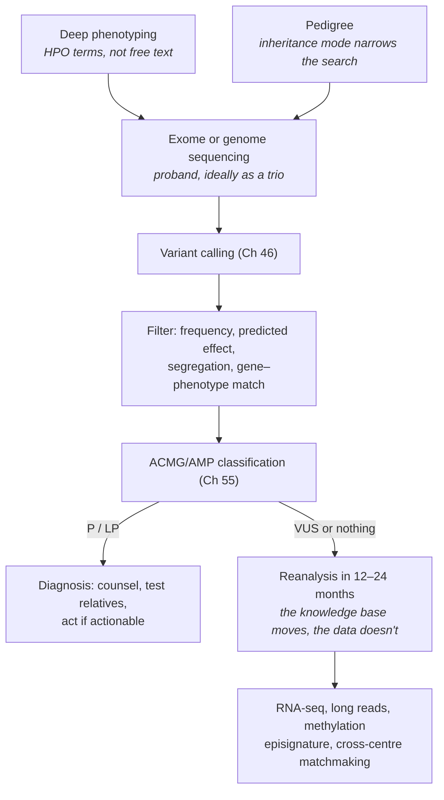

# 57 — Genomics in practice

> **Before this:** [Ch 46 — Variant calling](../part-10-functional-genomics/46-variant-calling.md) ·
> [Ch 53 — Polygenic scores](../part-11-human-and-statistical-genomics/53-polygenic-scores.md) ·
> [Ch 55 — Clinical variant interpretation](../part-11-human-and-statistical-genomics/55-clinical-variant-interpretation.md) ·
> **Time:** ~55 min
>
> **Statistics needed:** [S1 Probability](../part-S-statistics/S1-probability.md) ·
> [S6 Likelihood and Bayes](../part-S-statistics/S6-likelihood-and-bayes.md)

## What you'll be able to do

- Trace a rare-disease case from phenotype to report with its realistic yield, and compute the positive predictive value of a prenatal cell-free DNA screen — saying which of prevalence, sensitivity and specificity dominates it
- Explain the mechanistic basis of the five best-established gene–drug pairs, and give an honest account of why adoption lagged the science by two decades
- Reconstruct an outbreak from pathogen sequence, and say where a phylogeny stops being a transmission chain
- Explain why genomic prediction transformed breeding while polygenic scores remain marginal in the clinic — in terms of study design, not biology
- Read a forensic likelihood ratio without committing the prosecutor's fallacy, and say what genetic genealogy does to people who never consented
- Recognise the authentication signature of ancient DNA and the compositional trap in microbiome data
- Say what a consumer genotyping array can and cannot see, and why an ancestry percentage is an estimate against a chosen reference panel rather than a fact about a person

## The core idea

Every application in this chapter runs the same machine. A measurement — a genotype, a read count, a set of allele lengths — changes a belief about a state of the world. The measurement supplies a **likelihood ratio**: how much more probable is this observation if the state holds than if it does not. It does not supply the belief.

> **A genomic test never returns a fact about the individual in front of you. It returns a likelihood ratio, and the answer you actually want is that ratio multiplied by a prior the assay cannot see.**

> **Statistics:** turning a prior and a likelihood into a posterior is [S1](../part-S-statistics/S1-probability.md) §5, and why the answer swings on a base rate the assay knows nothing about is [S1](../part-S-statistics/S1-probability.md) §8 — assumed here, not re-derived.

That sentence explains the whole success-and-failure pattern. Where the prior is high — a critically ill infant with an unexplained syndrome, an isolate from a suspected outbreak, a family with a known pathogenic variant — modest evidence is decisive and the technology looks miraculous. Where the prior is low — population screening for a rare condition, predicting one person's complex-disease risk — even excellent evidence leaves you deeply uncertain, and the technology looks like it is over-promising. It isn't lying; the arithmetic is not what people expect.

The second half of the pattern is **whether the population a model was trained on matches the population it is applied to**. Agriculture gets this right by construction; human polygenic scores get it wrong by historical accident. The contrast in §7 is the most instructive thing here, because the estimator is identical and only the design differs.

---

## 1. The rare-disease diagnostic path

Most rare diseases are genetic, and most are individually so rare that no clinician sees two cases. The historical result was the **diagnostic odyssey**: years of specialists and single-gene tests ending in no answer. Sequencing inverted the search — instead of asking "does this patient have disease *X*?" one gene at a time, sequence everything and ask which of ~19,442 protein-coding genes ([verified facts](../reference/verified-facts.md)) carries a variant that explains this phenotype.



**Trio sequencing** — proband plus both parents — is the largest single design improvement. It identifies *de novo* variants directly rather than inferring them, and *de novo* dominant variants are the commonest cause of severe paediatric disease ([Ch 54](../part-11-human-and-statistical-genomics/54-rare-variants-and-mendelian-disease.md)). It also collapses the candidate list: a variant carried by a healthy parent is rarely causing the child's severe early-onset condition.

**Realistic yield** is **30–40%** for exome or genome in rare paediatric disease, with genome plausibly ahead — though read the comparison the way this chapter asks you to read everything else. The current meta-analysis (Pandey et al., *Genet Med* 2025) pools just **three** within-cohort studies for the head-to-head: 30.6% for genome against 23.2% for exome, an odds ratio of 1.7 with a 95% interval of **0.94–2.92**, *P* = .13. The intervals overlap heavily and the difference is not statistically significant; three of the authors are Illumina employees or stockholders. An eight-point gap quoted without those three facts is exactly the kind of number this chapter exists to teach you to interrogate. Yield in any case depends far more on who was selected than on the platform: a well-phenotyped syndromic paediatric cohort exceeds 50%, an adult neuropathy cohort may not reach 15%.

So **the majority of tests are negative, and a negative is not a null result.** It excludes a large class of explanations and deposits a dataset that can be reanalysed — reanalysis after 12–24 months adds several points of yield with no new sample, because what changed was the literature, not the patient. Genome over exome buys structural variants, deep-intronic splice variants and repeat expansions; long reads add the segmental-duplication genes short reads cannot map or phase ([Ch 40](../part-09-genomics/40-sequencing-technologies.md)). What a targeted repeat genotyper actually does with a "negative" genome is [lab 11](../labs/lab-11-repeat-genotyping.md), run on real 1000 Genomes data.

## 2. When the clock is the constraint

In intensive care, a diagnosis arriving in six weeks is often useless — the decision it would have informed has been made. So the same test is re-engineered around latency: expedited consent, courier transport, a prioritised flow cell, automated phenotype-driven prioritisation, and a clinician on call to interpret. Published turnaround runs from a median around **7 days** in routine rapid programmes to demonstration cases under 24 hours, with diagnostic yield in critically ill infants around **35–40%** — higher than the general figure, because admission to a NICU with an unexplained presentation is itself a strong prior.

The metric that matters is not diagnosis but **change in management**: in published series roughly three-quarters of diagnosed infants had care altered — a drug started or stopped, surgery avoided, a metabolic diet begun, or a redirection to palliative care because a lethal diagnosis was now certain rather than suspected. That last outcome is a real benefit and is routinely miscounted as a failure.

## 3. Screening is not diagnosis: NIPT and the arithmetic

### The mechanism

Maternal plasma contains **cell-free DNA** — short, nucleosome-length (~150–200 bp) fragments from dying cells. In pregnancy a portion, the **fetal fraction** *f*, comes from apoptotic **placental trophoblast**; typically *f* ≈ 4–20%, median around 10% at 10–13 weeks. Note what that says: the assay measures the placenta, not the fetus.

Non-invasive prenatal testing is then a counting experiment. Sequence millions of cfDNA fragments, map them, and count how many land on chromosome 21 — about 1.5% of mappable fragments. If the fetus is trisomic, the fetal portion carries three copies instead of two, so the expected chr21 share becomes

$$(1-f)\cdot 1 \;+\; f\cdot \tfrac{3}{2} \;=\; 1 + \tfrac{f}{2}$$

times its euploid value: at *f* = 0.10, a **5% excess** in a category holding 1.5% of reads. With *N* mapped fragments and chr21 share *p*, the count is binomial and the excess has

$$z \;=\; \frac{p\,f/2}{\sqrt{p(1-p)/N}} \;=\; \frac{f}{2}\sqrt{\frac{Np}{1-p}}$$

> **Statistics:** the binomial count and its variance *p*(1−*p*)/*N*, and the normal approximation that lets you read the excess as a *z*, are covered in [S2](../part-S-statistics/S2-distributions.md) §1 and §3.

Put *f* = 0.10, *p* = 0.015, demand *z* = 4: *N* ≈ 4.2 × 10⁵ mapped fragments — a rounding error of a genome, which is why NIPT is cheap. But *N* scales as **1/*f*²**: at *f* = 0.04 you need ~2.6 × 10⁶, and by *f* = 0.02 counting noise is no longer the limit — GC bias and library variance are. Hence the industry floor: below ~4% fetal fraction, labs decline to call.

One consequence is easy to miss. Fetal fraction falls with maternal weight (more maternal cfDNA diluting the same signal) and is lower in trisomy 13 and 18 (smaller placentas), so **"no-call" results are enriched for aneuploidy** — a failed test is weak positive evidence, not a neutral outcome.

### The arithmetic

NIPT for trisomy 21 has pooled sensitivity around **99.7%** and a false-positive rate around **0.04%**. Marketing calls this "over 99% accurate"; patients hear "if it says positive, it is". Take 10,000 pregnancies at a prior of 1 in 1,000:

```
                    trisomy 21     euploid      total
  screen positive        9.97          4.00      13.97
  screen negative        0.03      9,986.00   9,986.03
  ------------------------------------------------------
  total                 10.00      9,990.00  10,000.00

  PPV = 9.97 / 13.97 = 71.4%     NPV = 9986.00 / 9986.03 = 99.9997%
```

A 99.7%-sensitive, 99.96%-specific test returns a positive that is wrong **28% of the time**. Nothing is broken: the false positives are drawn from a pool 999 times larger. Move the prior to 1 in 100 and the same assay gives TP 99.7, FP 3.96, **PPV = 96%** — identical laboratory, 25 points of difference. Quoting NIPT performance without a population is therefore meaningless, and one result letter means different things to two patients.

The negative predictive value is extraordinary in both cases. **A negative NIPT is genuinely informative; a positive NIPT is a reason to do a different test.** That asymmetry is the definition of a screen.

### Where the false positives come from

Some are statistical. The interesting ones are not — the assay measured something real that was not the fetus.

| Source | What is actually true |
|---|---|
| **Confined placental mosaicism** | The placenta genuinely carries the trisomy; the fetus does not. The measurement is correct about the tissue it sampled |
| **Vanishing twin** | A demised co-twin's placenta is still shedding cfDNA |
| **Maternal CNV or mosaicism** | The duplication, deletion, or age-related X loss is the mother's — and most cfDNA is hers |
| **Occult maternal malignancy** | Tumour cfDNA is aneuploid; multiple discordant aneuploidies are a recognised rare cancer presentation |

Confirmation is by a **diagnostic** procedure: chorionic villus sampling (~10–13 weeks) or amniocentesis (~15 weeks on), with karyotype, QF-PCR or chromosomal microarray; procedure-related loss is on the order of 1 in 500 or better in contemporary series. CVS samples villi — placenta again — so confined placental mosaicism survives into it; amniocentesis samples fetal-origin amniocytes and does not. Hence the rule professional bodies restate constantly: **no irreversible decision on a screening result alone.**

## 4. Screening across the lifespan

**Newborn screening** is mostly not genomic: a dried blood spot, tandem mass spectrometry, 35–60 conditions chosen on Wilson–Jungner logic — serious, detectable presymptomatically, and *treatable*, with earlier treatment better. Replacing biochemistry with sequencing breaks that logic in a specific way. Biochemistry measures the disease process; sequencing measures a genotype whose **penetrance in an unselected population is unknown**, because every published penetrance estimate came from families ascertained *because* someone was affected ([Ch 55](../part-11-human-and-statistical-genomics/55-clinical-variant-interpretation.md)). Screen a million well babies and some number are labelled with a condition they will never develop.

Current programmes make that trade-off explicit rather than pretending it away. The UK **Generation Study** (Genomics England with the NHS) is sequencing 100,000 newborns for **more than 500 genes covering 200+ conditions** (the list grew by 97 genes and 48 conditions in April 2026), restricted to conditions treatable in childhood, returning no adult-onset findings and no carrier status; recruitment began in October 2024 and runs to the end of 2026, with results returned into 2027 and **about 1 in 100** babies expected to be suspected of carrying a detectable treatable condition — a suspicion, not a diagnosis, which the NHS then has to confirm. BabySeq and GUARDIAN in the US explore adjacent design points. The open questions are not technical: which conditions qualify, who consents for someone who cannot, what happens to the data for eighty years, and whether a healthy child labelled at risk has been harmed.

**Carrier screening** asks whether a couple could have an affected child, and it has quietly executed this curriculum's ancestry lesson. Panels were historically ancestry-targeted — specific founder variants offered to specific groups — which fails because **self-reported ancestry is a poor proxy for which founder variants someone carries**, and fails completely for people of admixed background. Guidance has moved to pan-ethnic panels defined by carrier-frequency thresholds. Genetic ancestry is continuous and measurable; the social categories people report are a different object, and building a clinical protocol on the second is a design error with a predictable failure mode.

**Preimplantation genetic testing** applies these tests to a five-cell trophectoderm biopsy after whole-genome amplification. Amplification causes allele dropout, so PGT-M does not simply genotype the variant — it genotypes **linked markers** and calls the haplotype, robust to losing any single locus, which is why the family's phase must be established in advance ([Ch 14](../part-02-transmission-genetics/14-linkage-and-mapping.md)). PGT-A uses low-pass sequencing for copy number and is genuinely contested: the biopsy samples trophectoderm rather than inner cell mass, embryos reported as mosaic have produced healthy children, and randomised evidence for improved live birth per cycle started is equivocal. Selecting embryos on **polygenic scores** is the live controversy — the relevant quantity is variance *among siblings*, which is small, so the expected gain from choosing among a handful of embryos is a fraction of a standard deviation, on an uncertain causal model, with unknown correlated effects. Professional societies say it is not ready ([Ch 53](../part-11-human-and-statistical-genomics/53-polygenic-scores.md), [Ch 58](58-ethics-and-society.md)).

## 5. Pharmacogenomics: the part that should have been easy

Most drugs are cleared by hepatic enzymes, dominated by the cytochrome P450 family; activity varies between people, much of that variation is genetic, and exposure is roughly inversely proportional to clearance. Three mechanisms produce three different failures: **prodrug activation** (loss of function → no drug effect; gain of function → overdose), **active-drug clearance** (loss of function → accumulation and toxicity), and **immune recognition**, which is not metabolism at all — a specific HLA allele presents the drug or a drug-modified peptide to T cells.

| Gene | Drug | Mechanism | What the variant does |
|---|---|---|---|
| *CYP2C19* | clopidogrel | prodrug activation | Poor metabolisers make little active metabolite; antiplatelet effect fails and stent thrombosis risk rises. Alternatives (prasugrel, ticagrelor) are not *CYP2C19*-dependent |
| *CYP2D6* | codeine, tramadol | prodrug → morphine | Poor metabolisers get no analgesia. **Ultrarapid** metabolisers (gene duplication) generate morphine fast enough to cause respiratory depression — deaths in children after tonsillectomy and in breastfed infants drove contraindications |
| *TPMT*, *NUDT15* | azathioprine, mercaptopurine | inactivation of active metabolites | Loss of function → thiopurine accumulation → life-threatening myelosuppression at standard doses. Poor metabolisers need roughly a tenth of the dose |
| *DPYD* | 5-fluorouracil, capecitabine | catabolism of the active drug | Deficient patients suffer severe, sometimes fatal toxicity from a first standard dose. The EMA has recommended pre-treatment testing since 2020 and NHS England requires it; US uptake has been slower |
| *HLA-B* | abacavir | immune (peptide–HLA–TCR) | *HLA-B*\*57:01 carriers develop hypersensitivity that can be fatal on re-challenge. Prospective randomised evidence; screening is standard of care worldwide. (*HLA-B*\*15:02 and carbamazepine is the same mechanism) |

Three structural points. **Allele definitions are haplotypes, not single variants** — the star-allele system names combinations (\*1 is reference, *CYP2D6* \*4 is a splice-disrupting haplotype), a diplotype maps to an activity score, and the score maps to a phenotype class. **Genotyping *CYP2D6* is genuinely hard**: whole-gene deletions, duplications up to a dozen copies, and hybrid genes with the neighbouring pseudogene *CYP2D7* — a real application for copy-number-aware calling and long reads ([Ch 46](../part-10-functional-genomics/46-variant-calling.md)). And **genotype is not phenotype**: a genotypic normal metaboliser on a strong inhibitor behaves as a poor metaboliser — *phenoconversion*.

**Pre-emptive versus reactive.** Reactive testing orders the genotype when the prescription is written and pays in days of delay. Pre-emptive testing genotypes a panel once, stores it, and fires decision support at the moment of prescribing. Pre-emptive wins on arithmetic — most people are eventually prescribed a drug with pharmacogenomic guidance, and a genotype never expires. **CPIC** exists because the bottleneck was never the science: its guidelines do not argue about whether an association is real, they specify what to *do* with a given diplotype in a form that can be encoded. That is the artefact missing from most translational genomics.

The honest account of the twenty-year lag has five parts and none of them is biology:

1. **Evidence-hierarchy mismatch.** The evidence was pharmacokinetic and observational; payers wanted randomised trials with hard clinical endpoints — slow, costly, and awkward when the mechanism is not in dispute. A large European randomised implementation study eventually reported roughly a 30% reduction in clinically relevant adverse drug reactions from a 12-gene pre-emptive panel, but not until the 2020s.
2. **Workflow, not knowledge.** A PDF in a chart does nothing. The result must be discrete, machine-readable, present *before* the prescription, and attached to an alert that fires once and correctly — competing for attention against every other interruptive alert, and losing.
3. **A result whose interpretation mutates.** The genotype is fixed for life; its clinical meaning is not, and health systems are not built to re-issue old results under new rules.
4. **Reimbursement.** Coverage for pre-emptive panels has been patchy and inconsistent between systems, because the cost lands years before the benefit and often in a different budget.
5. **Population representation.** Star-allele panels were largely defined in European-ancestry samples. *CYP2D6* and *CYP2C19* allele spectra differ substantially across ancestries, and the *NUDT15* variants that dominate thiopurine risk in East and South Asian populations were characterised long after *TPMT*. A panel genotyping only common European alleles has genuinely lower sensitivity elsewhere — a technical, fixable, long-unfixed inequity.

## 6. Pathogen genomics

Bacterial genomes are megabases and viral genomes kilobases, so sequencing an isolate costs almost nothing. The substrate is a phylogeny of thousands of near-identical genomes ([Ch 34](../part-07-molecular-evolution/34-phylogenetics.md)), and the clock runs fast enough relative to transmission that a transmission chain leaves resolvable structure.

**Outbreak reconstruction.** Isolates from a genuine recent chain differ by a handful of substitutions; isolates merely sharing a species differ by hundreds. The underrated use is the *negative* one: a suspected ward outbreak whose isolates prove phylogenetically unrelated was never an outbreak, and the response can be stood down. The positive use — near-identical isolates across wards, hospitals or months — finds transmission nobody suspected, often via an environmental reservoir. The caveat is structural: **a pathogen phylogeny is not a transmission tree.** Within-host diversity means a donor transmits a sample of their own population; unsampled intermediates make A→B look direct when it was A→X→B; and pathogen coalescence predates the transmission events. Genomic evidence bounds a transmission hypothesis, it does not adjudicate one.

**Resistance prediction from sequence.** For some organisms this is nearly a lookup — acquired resistance sits on discrete genes (*mecA* in MRSA, carbapenemase genes in Enterobacterales) and presence/absence is the prediction. For others it is point mutations in the target, such as *rpoB* for rifampicin in *Mycobacterium tuberculosis*. TB is the flagship, because culture-based susceptibility testing takes weeks for an organism that doubles in a day: the WHO catalogue of resistance-associated mutations (2nd edition, 2023) was built from more than 52,000 isolates with matched sequence and phenotype across 67 countries and lists over 30,000 variants for 13 drugs. It also shows the method's boundary. The first edition contained **zero** variants associated with bedaquiline resistance; the second contains 86. The biology did not change — the evidence base caught up. A catalogue encodes only what has been observed, which makes predicting *resistance* far safer than predicting *susceptibility*: absence of a known resistance mutation is not evidence of absence of an unknown one.

**Wastewater surveillance** changes the sampling unit from patient to population. One influent sample integrates a whole sewershed, removing test-seeking bias and capturing asymptomatic infection with no clinical encounter. It yields a quantitative signal (copies per capita over time) and a compositional one: sequence the mixture, read allele frequencies at lineage-defining sites, and solve a constrained least-squares problem for lineage proportions. Limits are real — shedding varies enormously between people, nucleic acid decays in transit, sewersheds rarely match administrative boundaries, and there is no denominator.

**SARS-CoV-2** was the largest real-time demonstration the field has had: more than fifteen million genomes deposited within a few years, feeding variant designation, vaccine strain selection and continuous tracking of lineage displacement. It also exposed the failure mode. Sequencing capacity was distributed extremely unevenly, so the "global" phylogeny was a biased sample of who could afford to sequence. Genomic surveillance measures the surveillance system as much as the pathogen.

## 7. Agriculture, and why genomic prediction works there

**Marker-assisted selection** came first: find a marker in linkage with a large-effect QTL and select on it. It works for oligogenic traits — a single disease-resistance locus is exactly this — and fails for yield, milk or growth, which are polygenic in the sense Part 6 describes.

**Genomic selection** (Meuwissen, Hayes and Goddard, 2001) drops the mapping step. Genotype a reference population with phenotypes and markers, fit *all* markers simultaneously with shrinkage — ridge regression, equivalently a mixed model on a genomic relationship matrix, or a Bayesian variable-selection prior when large-effect loci exist — and predict a **genomic estimated breeding value** for candidates never phenotyped. Shrinkage when markers outnumber animals, and its mixed-model equivalent, are covered in [S7](../part-S-statistics/S7-high-dimensional-data.md) §6 and §8; this chapter assumes them. What deserves your attention is why it works so much better here than the identical machinery does in human genetics.

| | Genomic selection in breeding | Human polygenic scores |
|---|---|---|
| **Training vs target** | Same breed, often the same herd book; the reference is re-estimated annually as new progeny are phenotyped | Training overwhelmingly European-ancestry biobanks, target frequently not; accuracy decays with genetic distance from the training sample |
| **LD structure** | Small *N*ₑ → long, consistent LD; marker–QTL phase is stable across the population | Large *N*ₑ → short LD blocks whose extent and phase differ between populations, so a tag SNP stops tagging ([Ch 29](../part-05-population-genetics/29-linkage-disequilibrium.md)) |
| **Environment** | Designed, measured, replicated — ration, photoperiod, randomised plots. G×E is estimated on purpose | Uncontrolled, unmeasured, entangled with ancestry, geography and socioeconomic position |
| **Phenotype** | Precise and repeated, often across many progeny of one sire | Self-report, EHR codes, or one clinic measurement |
| **What is predicted** | A *breeding value* — additive merit transmitted to progeny, realised as an average over hundreds of offspring | One person's trait or risk, where residual variance is the entire problem |
| **Feedback** | Realised gain is measured each generation and the model refit | No comparable closed loop |

The dairy result is the cleanest demonstration in applied quantitative genetics. Because a bull can be genotyped at birth rather than waiting years for daughters to be milked, the sire generation interval in US Holsteins fell from roughly seven years to under two and a half, and annual genetic gain for several traits roughly doubled after genomic selection was adopted in 2009. Response to selection is *R* = *h*²*S* per generation, where *S* is the selection differential ([Ch 31](../part-06-quantitative-genetics/31-heritability-and-selection.md)); the breeder's form Δ*G* = *i*·*r*·σ<sub>A</sub> / *L* is the one to reason with here, with *i* = *S*/σ<sub>P</sub> the standardised intensity, *r* the accuracy of the estimated breeding value and *L* the generation interval. Genomic selection did not raise heritability. It raised *r* — the accuracy with which a young, unphenotyped animal's breeding value can be estimated, which under parent average alone is poor — allowed higher intensity *i* among candidates now cheap to screen, and slashed *L*. All three enter the annual rate directly.

> The lesson for human genetics is the opposite of the one usually drawn. Genomic prediction working spectacularly in cattle and poorly across human populations is **not** evidence that populations differ biologically in any relevant way. Prediction accuracy is a property of the *study design* — matched training and target populations, controlled environments, measured phenotypes, short generations. Portability failure in human polygenic scores is caused by whom we sampled, and it is fixed by sampling differently.

**Gene editing** ([Ch 38](../part-08-methods/38-genome-editing.md)) is now entering these programmes, and the regulatory question everywhere is whether regulation attaches to the *product* or the *process*. The US Coordinated Framework splits oversight between USDA, FDA and EPA and largely exempts plant edits achievable by conventional breeding; in April 2025 the FDA approved the gene edit behind PIC's PRRS-resistant pig, among the first gene-edited livestock approvals in the US. The UK's Genetic Technology (Precision Breeding) Act 2023 became operational through secondary legislation and the first crops have come through: Rothamsted drilled a precision-bred *Camelina sativa* under a release notice in May 2026, and its low-asparagine, low-acrylamide wheat was granted precision bred status in July 2026. Application to animals is paused pending welfare evidence. The EU regulated such organisms under its 2001 GMO directive for two decades, a position the CJEU confirmed for mutagenesis techniques in 2018 — and then moved. On **17 June 2026** the European Parliament gave final approval to a New Genomic Techniques regulation splitting NGT plants into two categories: category 1, edits judged equivalent to what conventional breeding could have produced, which follow a verification procedure instead of the full GMO authorisation and risk-assessment regime, and category 2, which stay inside that regime. It enters into force twenty days after publication in the Official Journal and applies two years later.

So the framing to retire is "one technique, three philosophies". All three systems now key, at least in part, on **the edit rather than the process** — and the EU's two-tier structure closely parallels the UK's Precision Breeding Act. What still differs is institutional and temporal: three US agencies under a coordinated framework against a single statute either side of the Channel, and a UK regime already issuing release notices against an EU one that does not bite until 2028. The interesting question is no longer which philosophy each jurisdiction holds, but how fast a technology forces convergence on the product-versus-process question — and what happens to trade in the years while they are out of step.

## 8. Forensics: likelihood ratios and non-consenting relatives

**STR profiling** uses loci where a short motif is repeated a variable number of times, so alleles differ in *length* and can be sized by capillary electrophoresis after multiplex PCR. STRs beat SNPs here for three reasons that still hold: high polymorphism (many alleles per locus, so each contributes large exclusion power), short amplicons that survive degraded samples, and thirty years of legacy database. CODIS expanded from 13 to **20 core loci** in 2017.

The **random match probability** is computed exactly as Part 5 would have you do it: per-locus genotype frequencies under Hardy–Weinberg ([Ch 26](../part-05-population-genetics/26-hardy-weinberg.md)), multiplied across loci under approximate linkage equilibrium, with a *θ* (*F*ST) correction because a suspect and the true source are likelier to share a subpopulation than the naive product assumes ([Ch 28](../part-05-population-genetics/28-structure-and-inbreeding.md)). At 20 loci, RMPs of 10⁻²⁰ or smaller are routine for a complete single-source profile, reported as a likelihood ratio:

$$LR = \frac{P(\text{profile} \mid H_p:\ \text{the suspect is the source})}{P(\text{profile} \mid H_d:\ \text{someone else is the source})}$$

> **Statistics:** reading a likelihood ratio as a unit of evidence, and the odds form that multiplies it by a prior, are covered in [S6](../part-S-statistics/S6-likelihood-and-bayes.md) §4.

For a clean single-source match the numerator is essentially 1 and *LR* = 1/RMP. And here the core idea reappears in a courtroom: the LR is not the probability the defendant is guilty. **Posterior odds = prior odds × LR.** Asserting that a 10⁻²⁰ match probability means a 10⁻²⁰ chance of innocence swaps the conditionals — the **prosecutor's fallacy**. Two corrections follow: relatives are not "unrelated persons" (a full sibling's match probability is many orders of magnitude higher, so *H*d must name a relative when one is plausible), and a database trawl has a different prior structure than a match to a suspect identified independently.

**Mixtures are the genuine difficulty.** Most casework is a mixture of two or more contributors at low template with PCR artefacts:

```
locus D3S1358 — electropherogram peak heights (RFU)

allele:      14      15      16      17      18
           ┌───┐                   ┌───┐
   3200    │   │           ┌───┐   │   │
           │   │   ┌───┐   │   │   │   │
   1100    │   │   │   │   │   │   │   │   ┌─┐
    140    │   │   │   │   │   │   │   │   │ │  ← stutter? minor contributor?
           └───┘   └───┘   └───┘   └───┘   └─┘     drop-in?
```

Deconvolution requires estimating jointly: how many contributors, in what proportions, which peaks are true alleles versus PCR **stutter**, which true alleles **dropped out** below threshold, and which are **drop-in** contamination. Continuous probabilistic genotyping (STRmix, TrueAllele) models peak heights with an explicit stochastic PCR model and computes the LR by MCMC — right in principle. What remains hard: the assumed number of contributors is an input that materially changes the output; different packages on identical data have produced LRs differing by orders of magnitude; and source-code disclosure has been repeatedly litigated, so a number presented as objective may not be independently reproducible. For low-template, high-contributor mixtures, **the LR is model-dependent and should be presented that way.**

**Familial searching** deliberately looks for a near-match in an offender database, implying a first-degree relative. It works, and it has a distributional consequence: offender databases over-represent some communities, so familial searching extends that over-representation to relatives who were never arrested.

**Forensic investigative genetic genealogy (FIGG)** is a different technique. Generate a dense SNP profile from the crime-scene sample, upload it to a consumer genealogy database that permits law-enforcement matching, and find **identity-by-descent segments** shared with distant relatives — third to fifth cousins suffice. Then build trees from birth, marriage and census records and triangulate to people in the right place at the right time. The genetics narrows millions to a few dozen families; genealogy and police work do the rest. The famous case: the Golden State Killer, unidentified since the 1970s, was linked to Joseph James DeAngelo through a GEDmatch upload, arrested in April 2018, and pleaded guilty in 2020. Hundreds of cases have followed.

The privacy problem is structural and does not dissolve with better policy hygiene. Because IBD sharing extends to distant cousins, **a database holding a small fraction of a population can identify most of it** — published analysis found ~2% coverage returns a third-cousin-or-closer match for the large majority of a population. You cannot opt out of a database your cousins joined; one uploader's consent exposes information about hundreds of people who never heard of the service. Governance has lagged: a US Department of Justice interim policy (approved September 2019, effective 1 November 2019) restricts *federal* investigative genealogy to violent crime and public-safety cases, requires other leads to be exhausted and investigators to identify themselves, and permits searching only services that notify users — but binds federal agencies and grantees, not the state and local police who are most users. GEDmatch moved to opt-in after public backlash and was later sold; a few states require judicial authorisation, most do not.

Both positions are serious. Violent crimes with no other lead have been solved and wrongly convicted people exonerated. And the method conducts, without warrant or notice, a search implicating non-consenting third parties, unevenly distributed across a population. [Ch 58](58-ethics-and-society.md) takes the argument further; this chapter insists only that you see the exposure as a **property of IBD**, not a policy choice.

## 9. Ancient DNA: damage as a signature

DNA in a dead organism degrades in chemically specific ways, and that specificity is what makes the field possible. **Depurination** breaks the backbone, so fragments shorten with age — typically tens of base pairs. **Cytosine deaminates to uracil**, preferentially in single-stranded overhangs at fragment ends, and a polymerase reads uracil as thymine. In a conventional double-stranded library this gives a diagnostic asymmetry: elevated C→T at 5′ ends and its complement G→A at 3′ ends, both decaying roughly exponentially inward.

```
misincorporation frequency vs distance from fragment end

  0.30 ┤ ●                                        ● ← G→A at 3′ end
       │  ●                                      ●
  0.20 ┤   ●                                    ●
       │    ●●                                ●●
  0.10 ┤      ●●●                          ●●●
       │         ●●●●●●●●●●●●●●●●●●●●●●●●●●
  0.00 ┼────────────────────────────────────────────
        5′ 1  3  5  7  9 ...        ... 9  7  5  3  1 3′
        ↑ C→T at 5′ end
```

This is **authentication**. A modern contaminant — excavator, curator, technician — has long fragments and no damage, so the two read populations are separable, and in hard cases you restrict analysis to damaged reads, trading depth for certainty. Enzymatic UDG treatment excises uracils and removes both the errors *and* the evidence, which is why libraries are often built both ways. Everything else is physical: positive-pressure clean rooms far from any PCR product, full-body suits, bleach and UV, and dual-indexed libraries so index hopping is detectable ([Ch 40](../part-09-genomics/40-sequencing-technologies.md)). Endogenous content is often under 1% — most reads are soil bacteria — with the petrous temporal bone and tooth cementum the exceptions.

**What it established**, none of which could have been reached another way:

- **Archaic introgression.** People outside Africa carry roughly 1–2% Neanderthal ancestry, with smaller amounts detectable in African populations through back-migration.
- **A population discovered from a genome.** Denisovans were defined by sequence from a finger bone before any diagnostic morphology existed; they contribute several percent of ancestry in Papuan and Aboriginal Australian populations from at least two admixture events. One Denisova Cave individual proved to be a first-generation hybrid with a Neanderthal mother and Denisovan father.
- **Introgressed alleles under selection.** The high-altitude adaptation at *EPAS1* in Tibetans sits on a Denisovan-derived haplotype; introgressed segments are enriched near immune and skin genes and depleted — "deserts" — around testis-expressed genes and on the X, consistent with hybrid incompatibility.
- **Migration, not just ideas.** Present-day Europeans descend from at least three streams — local hunter-gatherers, Anatolian farmers, steppe pastoralists — so major cultural transitions arrived with *people*, not solely by diffusion of practice.
- **Sediment extends the reach.** The oldest DNA analysed is not from a bone: ~2-million-year-old environmental DNA from the Kap København Formation in northern Greenland, reconstructing a whole Pliocene ecosystem. The oldest specimen genomes are ~1.2-million-year-old mammoths.

**And the humility.** Preservation favours cold, dry, high-latitude sites, so the record maps preservation as much as history — tropical Africa and South and Southeast Asia are drastically under-sampled, which is a sampling artefact, not a statement about where history happened. Sequenced individuals are few and often from selective burials. Admixture-graph models are underdetermined: several topologies fit the same summary statistics, and proportions depend on the outgroups chosen. Most importantly, **archaeological cultures are not populations and populations are not languages** — inferring a language shift from a genetic turnover is an argument, not a measurement. These results are recruited into nationalist claims about who was "originally" somewhere with depressing regularity, and naming ancient genetic clusters after modern countries invites exactly that ([Ch 58](58-ethics-and-society.md)).

## 10. Metagenomics, eDNA, and the compositional trap

Sequence a community rather than an organism and you get **metagenomics**: 16S rRNA amplicon surveys (cheap, taxonomic, PCR-biased, roughly genus-level) or shotgun sequencing (strain resolution and gene content, at the cost of depth and host-read removal).

The statistical trap is easy to state and routinely ignored. **Sequencing yields relative abundances that sum to one.** The data live on a simplex, not in ℝᴰ: if one taxon blooms, every other taxon's proportion falls whether or not anything happened to it, so pairwise correlations are spurious by construction and differential-abundance tests have inflated false-discovery rates. Remedies are log-ratio transforms (CLR/ILR, Aitchison geometry) or genuine absolute quantification — spike-ins, flow cytometry, total-load qPCR. Honestly: recent work finds the commonly recommended normalisations do not fully eliminate the artefact, and measuring total load is the only clean fix. Zeros compound it, because a zero count is *unobserved*, not *absent*.

**The state of causal claims** should be stated plainly. There are thousands of published microbiome–disease associations and very few demonstrations of causation. Cross-sectional designs are confounded by diet, medication (metformin and proton-pump inhibitors have among the largest single effects on gut composition), and stool consistency/transit time, one of the strongest covariates in the data — and reverse causation is entirely plausible, since being ill changes what you eat and what your gut does. What does support causation: gnotobiotic-animal transfer, faecal microbiota transplant for recurrent *Clostridioides difficile* infection (the one unambiguous clinical success, now with approved live biotherapeutics), and Mendelian randomisation with host-genetic instruments — which is instrument-poor, because host genotype explains little microbiome variance, with *LCT*/*Bifidobacterium* and *FUT2* among the few robust exceptions. The gap between association and causation is a study-design gap, not a mystery.

**Environmental DNA** applies the same sequencing to water, soil, sediment or air, amplifying a barcode locus (COI for invertebrates, 12S rRNA for vertebrates) and matching a reference library. It detects rare and cryptic species without capturing anything and scales beyond any field team: invasive-species early warning, fish stock assessment, and — joining this section to the last — that two-million-year-old Greenland ecosystem. Its limits mirror its strengths: detection is not presence *here, now* (DNA is transported and persists), reference libraries are incomplete, and read counts are a poor abundance estimate because PCR amplification is not uniform across templates.

## 11. Direct-to-consumer testing

**What is actually measured.** With few exceptions a consumer test is a **genotyping array**, not sequencing: roughly 600,000–1,000,000 pre-selected probe positions chosen to tag common variation via LD ([Ch 29](../part-05-population-genetics/29-linkage-disequilibrium.md)). Three consequences follow directly and explain nearly every reported problem.

1. **It cannot see what is not on the chip.** Most rare pathogenic variants are absent by design.
2. **Array calling depends on cluster separation**, which depends on having enough carriers in the calling batch. A singleton lands in no cluster and is called badly — the mechanism behind the widely cited finding that **about 40% of variants reported in consumer raw-data files, when referred for clinical confirmation, were false positives** (Tandy-Connor et al., 2018), and that some variants labelled "increased risk" by third-party services were benign and common in population databases.
3. **Coverage of a gene is not coverage of a condition.** A test genotyping three founder *BRCA1*/*BRCA2* variants common in Ashkenazi Jewish populations, out of thousands of known pathogenic variants in those genes, gives a "negative" that is close to uninformative for someone with a family history. FDA authorised such reports as class II devices with special controls — including required non-diagnostic language — precisely because they are narrow.

**Ancestry versus health.** Ancestry inference is a supervised assignment against a reference panel: global proportions (model-based clustering or PCA projection) or local ancestry (an HMM along each chromosome assigning segments to panels). The percentages are estimates *relative to a chosen panel and an implied time depth*, so they change when the company updates its panel — which users experience as "my ancestry changed" and read as unreliability. It is not unreliable; it was never measuring what they thought.

> **Genetic ancestry is a continuous, measurable statement about which reference populations the segments of your genome most resemble. Race is a social classification, historically contingent and different between societies. They are not the same object, they are not interchangeable, and no amount of precision in the first licenses a claim about the second.**

The most technically reliable feature of these products is also the most consequential: **relative matching by IBD segment sharing** works very well. It is why these databases became forensic resources (§8), and why they routinely reveal misattributed parentage, undisclosed adoption and donor conception — outcomes arriving without counselling, to people who never took a test.

**Third-party reinterpretation** stacks two independent failure modes: the **analytical** one above (the call is wrong) and an **interpretive** one (the call is right but the classification is wrong, outdated, or from a source that never applied ACMG criteria — [Ch 55](../part-11-human-and-statistical-genomics/55-clinical-variant-interpretation.md)). Hence the unambiguous clinical rule: **any consumer result with medical implications is confirmed in an accredited laboratory before it is acted on.**

**Regulation and custody.** The FDA regulates health-related DTC claims through the device pathway and has authorised a limited, specific set; ancestry and "wellness" claims sit largely outside it, and third-party interpretation services are effectively unregulated. These companies are not HIPAA covered entities, so US health-privacy law does not reach them, and GINA prohibits genetic discrimination in health insurance and employment but **not** in life, disability or long-term-care insurance. The custodial point was then demonstrated concretely: 23andMe filed for bankruptcy in March 2025, the genomic data of millions of customers became an asset in a bankruptcy estate, and it was sold with court approval in July 2025 to TTAM Research Institute, a non-profit founded by the company's co-founder, over a competing pharmaceutical bid. Whatever one thinks of the outcome, the lesson generalises: **a privacy policy is a promise made by an owner who may not be the owner tomorrow** ([Ch 58](58-ethics-and-society.md)).

---

## Common misconceptions

| What people think | What's actually true |
|---|---|
| A "99% accurate" screening test is right 99% of the time | Accuracy figures are conditional on disease status. The probability you want is conditional on the *result*, and depends on prevalence: a 99.7%/99.96% test has a 71% PPV at a prevalence of 1 in 1,000 |
| NIPT tests the fetus | It counts cell-free DNA, whose non-maternal portion comes from **placental trophoblast**. Confined placental mosaicism is a true measurement of the wrong tissue |
| A negative genome sequence means there is no genetic cause | It means no causal variant was identified with current knowledge, methods and coverage. Reanalysis of the same data adds diagnoses every year |
| Pharmacogenomics failed to translate because the science was weak | The mechanisms are among the best established in the field. It failed on workflow, reimbursement, EHR integration, evidence-hierarchy mismatch and unrepresentative allele panels — and genotype still isn't phenotype, because inhibitors cause phenoconversion |
| A pathogen phylogeny shows who infected whom | It bounds transmission hypotheses. Within-host diversity, unsampled intermediates and coalescence predating transmission all break the identity |
| Genomic selection works in cattle and not humans because human genetics is more complex | It works because training and target populations match, environments are controlled, phenotypes are precise, and the prediction is a breeding value averaged over many progeny. Same estimator, different design |
| A random match probability of 10⁻²⁰ means a 10⁻²⁰ chance of innocence | That swaps the conditionals — the prosecutor's fallacy. Posterior odds = prior odds × LR, and *H*d must name a plausible alternative source, including relatives |
| DNA mixture interpretation is objective | It requires assuming the number of contributors and modelling stutter and dropout. Different software on identical data has produced LRs differing by orders of magnitude |
| You control whether your DNA is in a searchable database | IBD sharing extends to distant cousins; ~2% database coverage returns a third-cousin-or-closer match for most of a population. Your relatives' choices set your exposure |
| Consumer tests sequence your genome | They genotype ~10⁶ pre-chosen array positions. Rare variants are mostly absent and unreliably called — hence ~40% false positives among raw-data variants sent for confirmation |
| An ancestry percentage is a fact about you | It is an estimate relative to a chosen reference panel and time depth, and it changes when the panel changes. And genetic ancestry is not race |

## Worked example: two positives, one calculation

### Part A — a screen-positive result for a rare microdeletion

A 29-year-old has an expanded cell-free DNA screen including 22q11.2 deletion syndrome. It is positive. What is the probability the fetus is affected?

**Step 1 — the three numbers.**

| Quantity | Value | Source |
|---|---|---|
| Prior (birth prevalence) | ≈ 1/4,000 = 2.5 × 10⁻⁴ | Population epidemiology — **not** the test |
| Sensitivity | 0.978 | Wapner et al. 2015 — SNP-based assay validation, mostly contrived plasma mixtures |
| False-positive rate | 0.0076 | Same source; later prospective series report different figures (Ravi et al. 2018: 0.90 and 0.0026) |

**Step 2 — likelihood ratio.**  $LR_+ = 0.978 / 0.0076 = 128.7$

**Step 3 — prior odds to posterior odds.**

$$\text{prior odds} = \frac{2.5\times10^{-4}}{1-2.5\times10^{-4}} = 2.5006\times10^{-4}$$
$$\text{posterior odds} = 128.7 \times 2.5006\times10^{-4} = 0.0322 \;\Rightarrow\; PPV = \frac{0.0322}{1.0322} = \mathbf{3.1\%}$$

**Step 4 — check by counting.** Per 100,000 pregnancies:

```
  affected        = 100,000 × 1/4000   =     25.00
  true positives  = 25.00   × 0.978    =     24.45
  unaffected      = 100,000 − 25       = 99,975.00
  false positives = 99,975  × 0.0076   =    759.81
  ----------------------------------------------------
  all positives                        =    784.26
  PPV = 24.45 / 784.26                 =      3.12%
```

About **1 positive in 32 is a true positive** — and note this test has sensitivity nearly as high as the trisomy 21 screen in §3 (97.8% against 99.7%) and a PPV more than twenty times worse, because the prior is 4× lower and the false-positive rate 19× higher. Those two factors multiply to 76, which is the ratio of the posterior odds.

**Step 5 — which number is in charge?** When the prior π is much smaller than FPR/sensitivity, the denominator is dominated by false positives:

$$PPV \;\approx\; \frac{\pi \cdot \text{sens}}{\text{FPR}}$$

PPV is **linear in prevalence, inversely proportional to the false-positive rate, and nearly indifferent to sensitivity**. Holding prevalence fixed:

| FPR | False positives per 100,000 | PPV |
|---:|---:|---:|
| 0.76% | 759.8 | 3.1% |
| 0.05% | 50.0 | 32.8% |
| 0.01% | 10.0 | 71.0% |

Raising sensitivity from 97.8% to a perfect 100% moves the first row from 3.12% to 3.19%. Cutting the false-positive rate 76-fold — a specificity of 99.24% to 99.99%, which is barely a change in specificity and an enormous one in false positives — moves it to 71%. **For rare conditions, specificity is the whole game** — which is where assay development concentrates, and why a laboratory's *observed* PPV in a clinical series is the number to ask for.

**Step 6 — the decision.** This is a reason to offer a diagnostic test, not a diagnosis: CVS or amniocentesis with chromosomal microarray. Parental testing matters here too — a substantial share of positive 22q11.2 cfDNA screens reflect a copy-number variant carried by the *mother*, whose DNA is most of the sample.

### Part B — the same arithmetic in a courtroom

A degraded sample yields a partial STR profile: 5 usable loci, random match probability 10⁻⁶. It is trawled against a database of 2 × 10⁷ profiles and returns one match. Expected coincidental matches in the database alone:

$$2\times10^{7} \times 10^{-6} = \mathbf{20}$$

You expected about twenty adventitious matches and found one hit. The *LR* of 10⁶ is arithmetically correct and, against prior odds appropriate to "one of twenty million people, no other evidence", is nowhere near identification. Had the same 5-locus profile matched a suspect identified independently by non-genetic evidence — putting perhaps a few hundred people in the frame — prior odds of ~10⁻² would give posterior odds of ~10⁴, a very different conclusion from identical genetic data.

The genetic evidence did not change. The prior did. That is the same sentence as Step 5, and it is the whole chapter.

## Connections

- **Back to:** [Ch 26 — Hardy–Weinberg](../part-05-population-genetics/26-hardy-weinberg.md) and [Ch 28 — Structure and inbreeding](../part-05-population-genetics/28-structure-and-inbreeding.md) supply the forensic match probability and its *θ* correction · [Ch 29 — Linkage disequilibrium](../part-05-population-genetics/29-linkage-disequilibrium.md) explains both array design and why genomic prediction transfers within a breed but not across human populations · [Ch 31 — Heritability and response to selection](../part-06-quantitative-genetics/31-heritability-and-selection.md) is the equation genomic selection accelerates · [Ch 34 — Phylogenetics](../part-07-molecular-evolution/34-phylogenetics.md) is the machinery behind outbreak reconstruction · [Ch 46 — Variant calling](../part-10-functional-genomics/46-variant-calling.md) and [Ch 55 — Clinical variant interpretation](../part-11-human-and-statistical-genomics/55-clinical-variant-interpretation.md) underlie every clinical pipeline in §§1–5 · [Ch 53 — Polygenic scores](../part-11-human-and-statistical-genomics/53-polygenic-scores.md) is the human half of §7
- **Forward to:** [Ch 58 — Ethics, privacy and society](58-ethics-and-society.md) takes up consent for people who never consented, genetic discrimination, data custody and the misuse of ancestry results — each of which appears here as a technical fact before it becomes an ethical question

## Check yourself

**1. A prenatal screen is advertised as "over 99% accurate" for a condition with birth prevalence 1 in 10,000. Sensitivity is 99%, specificity 99.9%. A patient tests positive. Answer her — and say which single change to the assay would most improve the answer.**

<details><summary>Answer</summary>

Per 1,000,000 pregnancies: 100 affected → 99 true positives; 999,900 unaffected → **999.9 false positives**. PPV = 99 / 1098.9 = **9.0%**. About one positive in eleven is real.

False positives outnumber true positives ten to one. Raising sensitivity to a perfect 100% moves PPV to 9.1%; cutting the false-positive rate tenfold (specificity 99.99%) moves it to 49.7%. **Specificity, by a wide margin** — for a rare condition PPV ≈ π·sens/FPR, inversely proportional to FPR and barely sensitive to sensitivity. Clinically, this is a reason for a diagnostic test, not a diagnosis.

</details>

**2. A *CYP2D6* poor metaboliser is prescribed codeine after surgery. What happens, and why is the answer different for an ultrarapid metaboliser?**

<details><summary>Answer</summary>

Codeine is a **prodrug** — weak until *CYP2D6* O-demethylates it to morphine. A poor metaboliser converts little, gets little analgesia, and risks being labelled drug-seeking when they report it isn't working. An ultrarapid metaboliser — commonly a gene duplication — converts it fast, producing morphine far above the intended exposure; this caused fatal respiratory depression in children after tonsillectomy and in breastfed infants of ultrarapid-metaboliser mothers, hence the contraindications.

Note the shape: variation in the *same* enzyme produces opposite failures depending on whether the enzyme activates or clears the drug. Contrast *DPYD*, which clears an active drug, so loss of function means accumulation and toxicity.

</details>

**3. Genomic selection roughly doubled the annual rate of genetic gain in dairy cattle; polygenic scores predict human traits poorly outside their training populations. Explain the difference without appealing to any biological difference between cattle and people.**

<details><summary>Answer</summary>

Four design differences, none biological in the relevant sense. **Training and target populations match** — same breed, reference refreshed annually — whereas human scores are trained on European-ancestry biobanks and applied elsewhere, and accuracy decays with genetic distance because tag SNPs stop tagging when LD structure differs. **Environments are controlled and measured**, so residual variance is small; human environments are uncontrolled and entangled with ancestry and socioeconomic position. **Phenotypes are precise and repeated** across many progeny of one sire. And **the prediction is a breeding value averaged over hundreds of offspring**, driving selection among thousands of candidates, so per-individual error averages out — where a polygenic score is applied to one person once, and residual variance is the whole story.

The estimator is identical. Portability failure is a consequence of **whom we sampled**, fixable by sampling differently — not evidence that genetic architecture differs between human groups.

</details>

**4. You sequence a 40,000-year-old bone and recover reads mapping to the human genome. A reviewer asks how you know they are ancient rather than contamination from the excavation team. What do you show — and what would UDG treatment have destroyed?**

<details><summary>Answer</summary>

Show the **damage profile**: elevated C→T in the first few bases of the 5′ end and G→A at the 3′ end (the same event observed from the opposite strand), decaying roughly exponentially inward. It comes from cytosine deamination to uracil in single-stranded overhangs, read as thymine. Show also the fragment-length distribution — ancient fragments are short — and a contamination estimate, for example from mitochondrial consensus discordance or X-chromosome heterozygosity in a male sample. A modern contaminant has long fragments and no terminal damage, so the two read populations are separable, and in hard cases you restrict analysis to damaged reads.

UDG excises uracils before sequencing. It removes the *errors*, improving genotype accuracy, and in doing so removes the *evidence*, because the damage signature is the authentication. Hence libraries prepared both ways, or partial UDG treatment that cleans the interior while leaving terminal damage intact.

</details>

**5. A study reports *Bacteroides* depleted and *Prevotella* enriched in a disease cohort from 16S relative-abundance data, and concludes *Prevotella* drives the disease. Give three distinct reasons to withhold assent — one statistical, two about design.**

<details><summary>Answer</summary>

**Statistical — compositionality.** Relative abundances sum to one, so the data live on a simplex. If any taxon's absolute abundance changes, every other proportion moves the other way whether or not anything happened to it; "depleted" and "enriched" may both be artefacts of a change in a third taxon or in total load. The analysis needs a log-ratio treatment at minimum and ideally absolute quantification — and even the standard normalisations do not fully remove the artefact.

**Design — confounding.** Diet, medication (metformin, PPIs) and stool consistency/transit time are among the strongest correlates of gut composition anywhere, and all differ systematically between cases and controls. An unadjusted contrast measures prescribing and lifestyle as much as biology.

**Design — reverse causation.** Illness changes appetite, diet, transit, inflammation and medication, so the observed difference is exactly what you would predict if the disease caused the microbiome change. Cross-sectional data cannot order them.

Causation would need gnotobiotic transfer, longitudinal sampling preceding onset, an intervention trial, or Mendelian randomisation with a valid host-genetic instrument — noting instruments are weak, because host genotype explains little microbiome variance.

</details>
