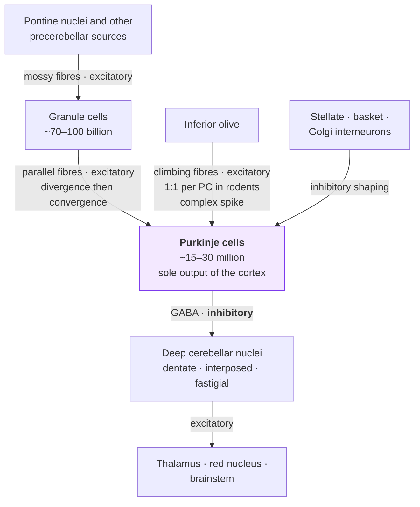

# D1 — The neuron, the cerebellum and selective vulnerability

> **Before this:** [Ch 01 Chemistry and cell primer](../part-00-orientation/01-chemistry-and-cell-primer.md) · [Ch 08 Proteins and gene function](../part-01-molecular-foundations/08-proteins-and-gene-function.md) · [Ch 16 Mutation](../part-03-genome-instability/16-mutation.md) · **Time:** ~50 min

This chapter is deliberately incomplete, in the same spirit as [Ch 01](../part-00-orientation/01-chemistry-and-cell-primer.md). The rest of this course teaches no neuroscience, yet the D-track ends at a disease of one brain structure — spinocerebellar ataxia type 12, a repeat-expansion disorder that presents as tremor and degrades the cerebellum. You cannot reason about that disease knowing only genetics, and you do not need a neuroscience degree either. This chapter covers the minimum honest neurobiology — what a neuron is as a cell, what the cerebellum's circuit looks like, why damage to it produces the clinical signs it does, and why the central puzzle of neurogenetics is not "what does the gene do?" but "why *these* neurons?" — and then stops.

## What you'll be able to do

- Explain why a postmitotic, metre-scale, continuously firing cell changes the somatic-mutation and proteostasis calculus you learned in [Ch 16](../part-03-genome-instability/16-mutation.md), and say which escape routes a neuron has given up
- Read a sentence like "Purkinje cells are intrinsic pacemakers firing at 30–150 Hz" and know what every word in it costs the cell
- Draw the cerebellar circuit from memory — mossy fibres, granule cells, parallel fibres, climbing fibres, Purkinje cells, deep nuclei — and say which arrow is the output and why it is inhibitory
- Derive ataxia, dysmetria, intention tremor and dysarthria from a single claim about what the cerebellum computes, rather than memorising them as a list — and say which tremor that derivation does *not* explain
- State the selective-vulnerability problem precisely, list the four candidate explanations, and say why none of them is established
- Classify a tremor by its activation condition using the MDS scheme, and say why "action tremor" is the flag to hold onto for SCA12
- Read a SARA score, a TETRAS score and an MRI volumetry report from an ataxia paper without being bluffed by any of them

## The core idea

Every cell type this course has met so far had two escape routes from its own accumulating damage. It could **divide** — diluting misfolded protein, replacing itself, letting a damaged clone be outcompeted. Or it could **idle** — drop to a low-energy quiescent state where insults arrive slowly. A colon crypt cell uses the first; a memory T cell uses the second.

A neuron has given up both.

It exits the cell cycle early in life and, with narrow and contested exceptions, never divides again. And far from idling, many neurons fire continuously, running one of the most expensive signalling operations in the body on a permanent basis. The brain is roughly 2% of body mass and takes roughly 20% of the body's oxygen and 25% of its glucose. A neuron is a cell that must run hot, forever, with no replacement and no dilution — an eighty-year-old Purkinje cell is eighty years old, and everything that has ever happened to it is still there.

> **Neurodegeneration is the failure catalogue of a cell denied both escape routes.** Every mechanism in §5 — aggregation, clearance failure, mitochondrial decline, calcium mishandling — is a problem that dividing cells also have, made unforgiving by the fact that a neuron cannot dilute it, cannot be replaced, and cannot afford to power down while it copes.

And one more fact sets up the whole track: the genes behind neurodegenerative diseases are almost never expressed only in the neurons that die. The gene is everywhere; the death is somewhere. That gap — selective vulnerability — is where the genetics of [Part D](D4-sca12-from-repeat-to-phenotype.md) will have to do its real work.

---

## 1. The neuron: a cell type pushed to extremes

### Postmitotic — a state, not a fate

Mature neurons in the mammalian central nervous system have exited the cell cycle and essentially never divide again. Three consequences follow immediately, and each rewrites a chapter you have already read.

**The somatic-mutation calculus changes.** [Ch 16 §1](../part-03-genome-instability/16-mutation.md) told you that you are a mosaic — that normal tissues accumulate somatic mutations continuously, and that what matters is whether a mutant clone expands. In a dividing tissue, that framing does a lot of protective work: a damaged cell can be shed, outcompeted, or diluted into irrelevance. A neuron's somatic mutations have no such demography. There is no clone; there is one cell, holding its position in a circuit, accumulating changes it will keep for the organism's whole life. Replication-driven mutagenesis largely stops when division stops — but damage from oxidation and transcription does not, and repair errors still convert lesions into permanent sequence change. Whatever a neuron's genome becomes, the circuit keeps that copy.

**The proteostasis calculus changes.** A dividing cell halves its load of damaged and aggregated protein at every division simply by arithmetic, before any chaperone lifts a finger. A neuron gets no halving, ever. Everything it cannot actively degrade, it keeps — for decades. This is why the proteostasis machinery of [Ch 08 §8](../part-01-molecular-foundations/08-proteins-and-gene-function.md) is not one housekeeping system among many in a neuron; it is load-bearing infrastructure whose age-related decline is a standing explanation for why neurodegenerative diseases are diseases of late life (§5.1).

**The cell cannot be replaced.** A lost neuron is a hole in a wiring diagram built during development, not a vacancy that recruitment fills.

Two honest qualifications, because "neurons never divide" is the kind of clean sentence that biology rarely lets stand.

First, postmitotic is an actively maintained state, not a locked door. Neurons in Alzheimer's disease and several other neurodegenerations re-express cell-cycle machinery — cyclins, CDKs, even DNA replication — and for a neuron, re-entry is followed by death, not division (Herrup & Yang 2007). The exit from the cycle is something the cell keeps enforcing, and failure of the enforcement is itself a death mechanism.

> **Genuinely unsettled — hold it as such.** Whether *any* new neurons are born in the adult human hippocampus is contested at the level of primary data. Two studies published weeks apart in 2018, using overlapping immunohistochemical markers on human tissue, reached opposite conclusions: Sorrells et al. found hippocampal neurogenesis falling to undetectable levels beyond childhood; Boldrini et al. found progenitors and immature neurons persisting into the eighth decade. The dispute is about marker specificity and tissue handling as much as biology, and it has not been resolved. Note what it does *not* touch: nobody claims adult neurogenesis in the cerebellar Purkinje layer. For the cells this track cares about, "irreplaceable" stands unqualified — but say "the adult human brain makes no new neurons" in a seminar and you have overclaimed.

### Geometry: a cell the size of a limb

A neuron's cell body may be about 20 µm across while its axon runs up to a metre — to a first approximation, the cell is its wiring, and the axon can hold the great majority of the cytoplasm. Almost every protein and organelle in that metre was synthesised in the soma and physically shipped. Kinesin-family motors walk cargo outward (anterograde) along microtubules; cytoplasmic dynein hauls it back (retrograde). The rates fall into two classes:

| Transport class | Cargo | Net rate |
|---|---|---|
| Fast axonal transport | Membranous organelles, vesicles, mitochondria | ~50–200 mm/day (some reviews quote up to 400) |
| Slow axonal transport | Cytoskeletal subunits, cytosolic proteins | ~0.2–10 mm/day |

Watch the units: the classic radiolabelling literature quotes mm/day, the live-imaging literature µm/s, and 1 mm/day ≈ 0.0116 µm/s. And resist the natural misreading of "slow": slow transport is not slow motors. It is fast motors that pause — cargo moves in short runs at close to fast-transport velocity, separated by long stalls, so the *instantaneous* speed is high while the *net* rate is a hundredfold lower. (The same average-versus-instantaneous trap runs through this course — an expression level is a time average over bursts, and a slow transport rate is a duty-cycle average over fast runs.)

At the slow-component rate, a protein dispatched down a long axon can spend months to years in transit — run the arithmetic yourself: a metre at 10 mm/day is ~100 days, and at 0.2 mm/day it is over a decade. A cell with that logistics problem is exquisitely sensitive to anything that perturbs motors, microtubules, mitochondrial distribution or local degradation capacity — a sensitivity that scales with arbour size, which becomes an argument in §4.

### The energy bill

The brain's disproportionate energy consumption — ~2% of mass, ~20% of oxygen, ~25% of glucose — is mostly spent on signalling. The classic budget (Attwell & Laughlin 2001) attributed, for grey matter: ~47% of signalling energy to action potentials, ~34% to postsynaptic glutamate effects, ~13% to maintaining resting potentials, ~3% to glutamate recycling. Treat those shares as model outputs, not measurements: the budget was *calculated* for rodent grey matter, and later work argues the action-potential share was overestimated (mammalian axonal spikes are more sodium-efficient than the original squid-axon assumption) while non-signalling housekeeping was underestimated. The qualitative conclusion survives the revisions and is the one to keep: **firing dominates the bill, and a neuron that fires continuously is a cell servicing a permanent ATP deficit.** Why firing costs ATP at all is what §2 is for.

---

## 2. Signalling, in one section

You need exactly enough electrophysiology to read a sentence like "Purkinje cells are intrinsic pacemakers with simple-spike rates of tens of hertz" — no more. Here it is.

**The resting potential.** A neuron is a bag of salty water inside a bag of differently-salty water, with the membrane holding the difference. The Na⁺/K⁺-ATPase burns ATP to pump 3 Na⁺ out for every 2 K⁺ in, building concentration gradients; K⁺ leak channels then let K⁺ trickle back out down its gradient, leaving unbalanced negative charge behind. The steady state — the **resting membrane potential** — sits near −70 mV in a typical neuron, with an honest range of −40 to −90 mV across cell types. The sign convention is load-bearing: the number is the potential of the inside relative to the outside, and a textbook that says "the resting potential is 70 mV" has dropped the minus sign that carries the physics.

**The action potential.** A neural impulse is not a signal travelling along a wire. It is a regenerative, self-propagating collapse and restoration of the resting gradient: voltage-gated Na⁺ channels open and depolarise the membrane, K⁺ channels open and repolarise it, and the disturbance renews itself as it moves. The whole event lasts about 1 ms at any given point. Nothing about it is free — every spike lets ions run downhill, and the pump must push every one of them back up at 1 ATP per 3 Na⁺. This is where §1's energy bill is paid.

**The synapse.** Where an axon terminal meets the next cell, the arriving spike triggers release of a **neurotransmitter** — a small molecule diffusing across a vanishingly narrow gap to receptors on the target. No addressing, no calling convention: molecules collide with receptors and stick, exactly the statistical specificity of [Ch 01](../part-00-orientation/01-chemistry-and-cell-primer.md). Two transmitters carry most of the traffic in the circuits we care about: **glutamate**, which depolarises the target (excitatory — pushes it toward firing), and **GABA**, which does the opposite (inhibitory). A neuron sums thousands of these small pushes and shoves across its dendrites, and fires when the total crosses threshold. That is the entire computational primitive: weighted summation, then a threshold.

**Rate, not just events.** Neurons signal with firing *rates* as much as single spikes. And some neurons do not wait for input at all: an **intrinsic pacemaker** fires rhythmically with no synaptic drive whatsoever, its own channel complement acting as an oscillator. Purkinje cells are the canonical example — driven largely by a resurgent Na⁺ current and matching K⁺ conductances (Raman & Bean 1999), they fire spontaneously at roughly 30–150 Hz, indefinitely. Hold that fact; it becomes the hinge of §4.

That is all the electrophysiology this track needs. What we have *not* covered — channel biophysics, cable theory, plasticity mechanisms, neuromodulation — is genuinely important and genuinely not needed here.

---

## 3. The cerebellum

### The headline number

The adult human brain contains about 86 billion neurons (86.1 ± 8.1 × 10⁹; Azevedo et al. 2009). Now the fact that reorganises your mental map: **about 69 billion of them — roughly 80% — are in the cerebellum**, a structure of about 154 g, roughly 10% of brain mass. The cerebral cortex, with about 82% of the mass, holds about 16 billion neurons — roughly 19%. (The same study is worth citing for a second myth it retired: non-neuronal cells total about 85 billion, so the glia:neuron ratio is about 1:1, not the 10:1 of folklore.)

Four-fifths of the brain's neurons in one-tenth of its mass, because nearly all of them are **granule cells**, the smallest neurons in the vertebrate brain, packed into a sheet folded so intensively that its unfolded area — around 1,160 cm² — comes to roughly 78–80% of the neocortex's. Whatever the cerebellum is, it is not a small side-module. "Cerebellar" does not mean "minor".

### The circuit, in the order the signal travels

The cerebellar cortex has three layers — molecular layer outermost (parallel fibres, Purkinje dendrites, stellate and basket interneurons), then a **Purkinje cell layer** exactly one cell thick, then the granular layer (granule cells, Golgi cells, mossy-fibre terminals). The wiring is famously regular; follow one signal through it.

- **Mossy fibres** arrive from the pontine nuclei (with contributions from spinal cord, vestibular and reticular sources) and excite **granule cells**.
- Each granule cell sends its axon up into the molecular layer, where it splits into a **parallel fibre** running transversely through the flat, fan-shaped dendritic trees of many Purkinje cells in series. One parallel fibre can touch tens of thousands of Purkinje cells; one Purkinje cell collects input from an enormous number of parallel fibres. This is massive divergence followed by massive convergence.
- **Climbing fibres** arrive from the **inferior olive** in the brainstem. In rodents, one climbing fibre wraps one Purkinje cell — a 1:1 relationship with hundreds of synaptic contacts — and firing it produces an all-or-nothing **complex spike**.
- **Purkinje cells are the sole output of the cerebellar cortex, and they release GABA.** Read that twice: the entire output of this 69-billion-neuron cortex is *inhibitory*.
- Purkinje axons project down to the **deep cerebellar nuclei** — dentate, emboliform and globose (the latter two together the interposed nucleus), and fastigial — which are excitatory and carry the cerebellum's verdict out to thalamus, red nucleus and brainstem.

The architecture makes sense once you see the deep nuclei as tonically active and the Purkinje layer as a vast, finely patterned brake: the cerebellar cortex computes by *sculpting inhibition* onto an excitatory output that would otherwise run unshaped. Kill Purkinje cells and you do not silence the cerebellum — you release its output from calibration. That single sentence predicts most of the clinic below.

### Counting cells honestly

How many Purkinje cells does a human have? Published unbiased-stereology estimates of total human Purkinje number span roughly **15–30 million** — one careful study counted ~15.4 million (fractionator method, counting nucleoli), another ~30.5 million (optical disector plus Cavalieri) — and granule-cell estimates span roughly **70–100 billion** depending on whether you count nuclei in sections or in homogenate. The discrepancy has never been fully reconciled, and it is a fact about the difficulty of counting, not about biology. Never quote one of these figures as settled; quote the range and, if it matters, the method. The convergence number survives any choice within the ranges: thousands of granule cells per Purkinje cell, and then — the compression is astonishing — those millions of Purkinje cells funnel down onto deep nuclei of which the largest, the dentate, holds only about 5 million neurons.

### The Purkinje cell, up close

The Purkinje cell is the most extreme integrator in the brain, and in humans more extreme than the textbook (mouse-derived) picture:

| Property | Mouse | Human |
|---|---|---|
| Total dendritic length | ~2,800 µm | ~20,000 µm (≈7×) |
| Parallel-fibre synapses (spines) | thousands | tens of thousands to a few hundred thousand — method-dependent, quote the range |
| Spine density | ~2 spines/µm | ~2 spines/µm |
| Primary dendritic trunks: 2–3 rather than 1 | ~10% of cells | ~80% of cells |

(Spine totals for human Purkinje cells differ by nearly an order of magnitude between light-microscopy and other reconstructions — ~38,000 in one primary dataset, ~360,000 in a later review from the same group — so the honest statement is the range; the undisputed claim is that a Purkinje cell integrates more excitatory inputs than almost any other neuron.)

The multiple-trunk anatomy is not a curiosity: human Purkinje cells with several primary trunks appear to receive **more than one climbing fibre**, breaking the celebrated rodent 1:1 rule. This is the standing warning of [Ch 37](../part-08-methods/37-model-organisms-and-screens.md) in anatomical form — do not teach the mouse wiring diagram as the human one.

And recall §2: Purkinje cells are intrinsic pacemakers. In vivo their **simple spikes** run at a mean around 40 Hz (range 0–200 Hz), around the clock, input or no input; **complex spikes**, gated by the climbing fibre, punctuate this at roughly 0.5–1 Hz. A cell with a ~20,000 µm dendritic arbour, on the order of 10⁵ synapses, firing tens of times per second for eighty years, with no possibility of replacement — hold that portrait through §4.

### What the cerebellum computes — and what breaks

The dominant framework — and label it as a framework, because it is a well-supported theory rather than a measured fact — is that the cerebellum learns and stores **internal models** of the body and world (Ito 2008): *forward models* that predict the sensory consequences of a motor command before the slower sensory feedback arrives, and *inverse models* that supply the command needed to achieve an intended outcome. On this view the climbing fibre carries the **error signal** — its complex spike reports "the prediction was wrong" — and drives learning at the parallel-fibre synapses. That learning is a lasting weakening of the parallel-fibre synapses that were active when the error arrived. Lasting synaptic changes generally run through phosphorylation state, which is why the neuronal-substrates section of [D2](D2-kinases-phosphatases-and-pp2a.md) asks whether a phosphatase subunit has any business here — and answers that, for B55β, nobody has shown that it does. The cerebellum, in short, is a calibrator and predictor, not a command generator.

If that is what it does, the clinic writes itself. Cerebellar damage should not cause paralysis — the commands still issue — it should cause **badly calibrated** movement. And that is exactly what it causes:

| Sign | What it is | Why a broken calibrator produces it |
|---|---|---|
| **Ataxia** | Incoordination not explained by weakness | The predictive signal that sequences and scales multi-joint movement is gone |
| **Dysmetria** | Under-/overshooting a target | The forward model that should stop the limb at the target is degraded |
| **Intention tremor** | Oscillation that appears and *worsens as the limb approaches the target* | Feedback correction without prediction: each correction arrives late, overshoots, and is itself corrected |
| **Dysarthria** ("scanning speech") | Slurred, irregularly paced, variably stressed speech | The same calibration failure applied to the articulators |
| **Nystagmus** | Involuntary rhythmic eye movement | Cerebellar control of the gaze-holding integrator fails; the eye drifts and is re-fixated |
| **Dysdiadochokinesia** | Impaired rapid alternating movements | Agonist/antagonist bursts are no longer timed and switched cleanly |

Notice what is *not* on the list: weakness, paralysis, sensory loss. A patient with pure cerebellar disease has full strength and intact sensation, and cannot touch your finger smoothly. "The cerebellum only does balance" fails the same test — balance is one output of a general calibration computation that spans limbs, eyes and speech, which is why cerebellar patients slur and overshoot as well as stagger.

### What produces a tremor, as opposed to a mis-scaled movement

The table above earns intention tremor honestly: feedback correction without prediction oscillates *at the target*, and that is where the oscillation appears. Now look at what the disease this track is heading toward actually presents with, because the derivation does not cover it. In the largest single-centre SCA12 series (Ganaraja et al. 2022, n = 49), the tremor was of *postural* type in 87.7% of patients against 57.1% with an intention component, with head tremor in 55.1% and voice tremor in 42.8%; in a second cohort (Choudhury et al. 2018, n = 21) tremor was the *first* symptom in 90%, with ataxia arriving later. Arms outstretched, holding a position, nowhere near any target — the calibrator model as stated above predicts none of that. And the order is wrong too: in SCA1, SCA2, SCA3 and SCA6 the cerebellar syndrome leads and tremor, where present, follows; SCA12 runs the sequence in reverse.

So distinguish two ways a motor circuit can fail visibly. A **mis-scaled movement** — dysmetria, ataxia — needs only a bad calibration: the command is issued with the wrong gain or timing, once. A **tremor** is a rhythmic oscillation, and rhythm needs an oscillator. The standard account of cerebellar *action* tremor supplies one from control engineering: any closed feedback loop with enough gain and enough delay can ring, and the motor system is built of closed loops that pass through the cerebellum. The deep-nuclei output you just traced runs onward through the thalamus to the motor cortex, and the cortex projects back through the pontine nuclei and mossy fibres into the cerebellar cortex — a closed **cerebello-thalamo-cortical loop**, with the dentate nucleus as the cerebellar port of departure. The **inferior olive** — source of the climbing fibres and their metronome-slow complex spikes — sits in a second, olivocerebellar loop with the cerebellum and deep nuclei. On the loop-oscillation account, cerebellar damage does not merely delete a calibration; it changes the gain and timing of loops that run through the damaged tissue, and a loop pushed toward instability oscillates whenever it is under load — holding a posture against gravity, moving a limb, steadying the head or the larynx. That is a *postural and kinetic* action tremor, with head and voice involvement, generated by cerebellar circuitry with no target anywhere in sight.

The two accounts divide the labour rather than compete: the internal-model account explains corrections that *chase the target* (intention tremor); the loop-oscillation account explains a circuit that *rings under load* (postural and kinetic tremor). The same lesion can do both — which is presumably why the Ganaraja cohort reports both types at high frequency rather than one displacing the other.

> **Not established — carry this question into D4.** The previous two paragraphs are a framework, and for SCA12 it has not been tested. No published study has localised the oscillator behind SCA12's presenting postural tremor — cerebello-thalamo-cortical loop, olivocerebellar loop, or something else — and none explains why SCA12 runs tremor-before-ataxia when SCA1, 2, 3 and 6 run the reverse. On the three-tier ladder [D4](D4-sca12-from-repeat-to-phenotype.md) will hand you — **Established / Supported / Conjectured** — the loop-oscillation reading of SCA12's tremor is **Conjectured**: argued from adjacent physiology, measured in no patient. Nothing on D4's mechanistic menu — hypotheses A, A′, A′′, B, C1–C3 and D — currently predicts a tremor-first disease rather than an ataxia-first one, and none of them would be embarrassed by the opposite sequence. That is a gap in the field, not in your reading; hold onto it, because a mechanism that cannot say why *this* sign comes *first* is not yet a mechanism of this disease.

---

## 4. Selective vulnerability: the central puzzle of neurogenetics

Here is the puzzle that organises everything downstream in this track.

Nearly every gene implicated in an inherited neurodegenerative disease is expressed broadly — often in every neuron, often in every tissue. Yet each disease kills a specific, reproducible subset of neurons. *HTT* is expressed essentially everywhere; Huntington disease destroys striatal medium spiny neurons first. And the gene this track is heading toward, *PPP2R2B*, is expressed across the whole brain — cerebral cortex included, and in bulk data *more* highly there than in cerebellum — yet SCA12 presents as a cerebellar-plus syndrome ([D4](D4-sca12-from-repeat-to-phenotype.md) takes up that specific, awkward expression story in detail).

So expression pattern does not predict the pattern of death. Something about particular neurons makes them fall first to an insult their neighbours also carry. That property is called **selective vulnerability**, and the honest position is that for most diseases — including every spinocerebellar ataxia — we do not know what it is. What exists is a set of candidate explanations (the framing here follows the two standard reviews, Saxena & Caroni 2011 and Fu, Hardy & Duff 2018), none proven, not mutually exclusive:

**1. Firing energetics.** Tonically active neurons with large arbours run near their metabolic ceiling. A Purkinje cell pacing at ~40 Hz through an arbour with on the order of 10⁵ synapses (§3) has less ATP headroom than a small, quiet interneuron; any insult that taxes energy supply — mitochondrial dysfunction, proteostatic load, pump stress — bites the expensive cell first. Plausible, widely argued, and not demonstrated as sufficient for any ataxia.

**2. Calcium handling.** Purkinje dendrites carry enormous Ca²⁺ loads from climbing- and parallel-fibre activity, buffered by high concentrations of the binding protein calbindin-D28k. The circumstantial evidence here is strong: mice lacking calbindin-D28k are ataxic with altered dendritic Ca²⁺ signalling (Airaksinen et al. 1997), and in SCA1 transgenic mice, loss of calbindin and parvalbumin immunoreactivity *precedes* ataxia onset. A cell that lives with a huge Ca²⁺ throughput is a cell for which small failures of buffering or extrusion are large events.

**3. Protein burden.** A large, long, highly branched cell synthesises, folds, ships and degrades more protein per cell than a small one, so any proteostasis defect (§5.1) is amplified there. This is §1's calculus turned into a ranking over cell types: the biggest arbours fail first.

**4. Morphology and transport length.** More metres of neurite mean more cargo in transit, more mitochondria to position, more membrane to maintain, and more exposure to any defect in the transport system (§1).

Note the shape of all four arguments: each takes a universal cellular process and claims Purkinje cells (or motor neurons, or striatal neurons) sit at the extreme of its operating range. Vulnerability, on every one of these accounts, is not a special pathway — it is *headroom*. The experiments that would separate them — cell-type-resolved measurements of energy state, Ca²⁺ dynamics, proteome turnover across vulnerable and resistant neurons in the same brain — are exactly what single-cell methods ([Ch 48](../part-10-functional-genomics/48-single-cell-and-spatial.md)) are beginning to make possible, and for the ataxias they have not yet delivered a verdict. When D4 asks "why does a ubiquitously brain-expressed phosphatase subunit produce a cerebellar disease?", this menu — not a settled answer — is what you will bring to the question.

> **A dogma correction worth carrying.** For years, textbooks stated that adult Purkinje cells lack functional NMDA receptors — and the claim was used to argue they are shielded from classical excitotoxicity (§5.4). It is wrong: mature Purkinje cells express functional NMDA receptors from about the end of the third postnatal week, activated by climbing-fibre input and contributing to the complex spike (Piochon et al. 2007). Treat any tidy "cell X is protected because it lacks Y" argument as a hypothesis with an expiry date.

---

## 5. The neurodegeneration mechanism toolbox

Neurodegeneration is not one mechanism. It is a family of interacting failure modes, and any given disease engages several. This section is a reference taxonomy: later chapters ([D3](D3-repeat-expansion-disorders.md), [D4](D4-sca12-from-repeat-to-phenotype.md)) will point back into it by number rather than re-explaining. For each entry: what it is, the key evidence, and the trap to avoid.

### 5.1 Proteostasis and aggregation

The **proteostasis network** — chaperones that fold, the ubiquitin–proteasome system that degrades single proteins, autophagy that degrades in bulk — keeps the proteome folded ([Ch 08 §8](../part-01-molecular-foundations/08-proteins-and-gene-function.md)), and its capacity declines with age (Hipp, Kasturi & Hartl 2019). That decline is the shared substrate on which late-onset neurodegenerations play out, and it is half of the answer to a question the D-track must face: why do inherited diseases whose mutation is present from conception begin in mid-life? The mutation is constant; the buffering against it is not. Misfolding-prone proteins that the young proteostasis network handled for decades escape it in the old one, and aggregates — once formed — can template further aggregation and sequester chaperones, making the failure self-amplifying.

### 5.2 The ubiquitin–proteasome system and autophagy

The decisive experiments in this area are a pair of 2006 mouse studies, and they teach a lesson that generalises far beyond their design. Deleting a single core autophagy gene in the CNS — *Atg5* in one study (Hara et al.), *Atg7* in the other (Komatsu et al.) — produced progressive motor deficits, massive neuronal loss in cerebral and cerebellar cortex, and **ubiquitin-positive cytoplasmic inclusions**, with *no disease-associated aggregating protein introduced at all*. Basal autophagy is not a stress response in neurons; it is a continuous requirement, precisely because (§1) a postmitotic cell has no other way to take out the rubbish.

> **Inclusions are a readout, not a diagnosis.** Ubiquitin-positive inclusion bodies are what neurons look like when bulk degradation fails, *for any reason*. Finding them in post-mortem tissue tells you clearance lost the race; it does not, by itself, tell you which protein started the fire, or even that the visible aggregate is the toxic species. Keep this in hand for D3, where the aggregates of the polyglutamine diseases sit at the centre of a genuinely unresolved cause-or-consequence argument.

### 5.3 Mitochondrial dysfunction, fission and fusion

Neuronal mitochondria are a dynamic population, continuously fusing (MFN1/MFN2 on the outer membrane, OPA1 on the inner) and dividing (DRP1, a dynamin-family GTPase recruited to the outer membrane). The balance sets mitochondrial size, their distribution into dendrites and axons — a logistics problem §1 sized for you — and the segregation of damaged mitochondria for disposal by mitophagy. Tip the balance toward fission and mitochondria fragment, depolarise and vanish from dendrites; tip it toward fusion and damaged material cannot be segregated.

The switch is a phosphosite, and you should file its details now: DRP1 is inhibited by phosphorylation of a conserved serine (Ser637 in human numbering; Ser656 in rat), written by PKA anchored at the mitochondrial surface and erased — promoting fission — by the phosphatases calcineurin and a mitochondrially targeted form of PP2A (Dickey & Strack 2011). In neurons, that PP2A-driven dephosphorylation fragments and depolarises mitochondria, depletes them from dendrites and stunts dendritic outgrowth. If "a phosphatase called PP2A" means nothing to you yet, that is what [D2](D2-kinases-phosphatases-and-pp2a.md) is for — and the reason this one phosphosite earns a paragraph in a neurology chapter becomes clear in [D4](D4-sca12-from-repeat-to-phenotype.md), where the gene of interest turns out to encode the subunit that aims PP2A at exactly this target.

### 5.4 Calcium and excitotoxicity

Ca²⁺ is a signalling currency held at very low cytosolic concentration, so influx is information — and overload is catastrophe. **Excitotoxicity** is death by excessive glutamate-receptor activation, chiefly NMDA receptors: the admitted Ca²⁺ activates proteases, nitric-oxide synthesis and mitochondrial permeability transition (Lau & Tymianski 2010). It is firmly established in acute injury such as stroke; its role in *slow* degenerations is contested, and you should present it that way — a candidate contributor whose chronic, low-grade form is hard to measure, not a proven engine. Its overlap with mechanism 2 of §4 is obvious: cells with the largest Ca²⁺ throughput have the least margin.

### 5.5 Apoptosis — and the time course that matters more

Neurons retain the full apoptotic machinery, used massively and normally during development. In adult neurodegeneration, actual death is often non-apoptotic or mixed — but the more important correction is temporal: **functional decline precedes death, typically by years.** Dendrites retract, spines are lost, firing degrades, synapses silence — all in still-living neurons — long before cell bodies disappear. Equating "neurodegeneration" with "neuron death" gets the time course wrong, and the stakes are practical: a sick-but-alive Purkinje cell is a therapeutic target, a dead one is not, and clinical scales (§6) may move with dysfunction while cell counts barely change.

---

## 6. Clinical vocabulary: reading the neurology you'll meet

Papers on SCA12 assume a clinical vocabulary this course has never taught. Here is the working set.

### Tremor, classified properly

The current authority is the 2018 MDS consensus classification (Bhatia et al.), which classifies tremor on two axes — Axis 1, the clinical features (topography, frequency and, crucially, **activation condition**); Axis 2, aetiology. The activation-condition vocabulary is the part a geneticist reading case reports actually needs:

| Term | Definition |
|---|---|
| **Rest tremor** | In a body part fully supported against gravity and not voluntarily activated; damps on movement. The classic Parkinsonian tremor. |
| **Action tremor** | Umbrella term: any tremor produced by voluntary contraction. Splits into the three below. |
| **Postural tremor** | Action tremor while holding a position against gravity (arms outstretched). |
| **Kinetic tremor** | Action tremor during any voluntary movement. |
| **Intention tremor** | A kinetic tremor whose amplitude **grows as the limb approaches its target**. This is the cerebellar one (§3). |

Plant this flag now: **SCA12's presenting feature is very often an action tremor of the upper limbs** — commonly enough that it is mistaken for essential tremor, a common and far more benign condition. When [D5](D5-sca12-population-clinic-therapy.md) discusses how SCA12 hides inside tremor clinics, "action tremor, later cerebellar signs" is the precise sentence, and this table is what makes it precise. The diagnostic axis is the activation condition, not the amplitude: a tremor worst at rest that damps on movement points *away* from the cerebellum.

### Hyperreflexia

**Hyperreflexia** — exaggerated deep-tendon reflexes, sometimes with clonus — is an *upper motor neuron* sign: it reports loss of descending corticospinal inhibition of the spinal reflex arc, not any problem in the cerebellum, muscle or peripheral nerve. Pure cerebellar degeneration does not produce it (if anything, cerebellar disease gives *hypo*tonia and pendular reflexes). So in an ataxic patient, hyperreflexia is a "plus" feature: it announces that the pathology extends beyond the cerebellar cortex. This is exactly why SCA12 is described as a cerebellar-*plus* syndrome, and the worked example below turns this into a method.

### The SARA scale

Ataxia trials and natural-history studies quantify severity with **SARA** (Scale for the Assessment and Rating of Ataxia): 8 examiner-rated items — gait (0–8), stance (0–6), sitting (0–4), speech (0–6), finger chase (0–4), nose–finger (0–4), fast alternating hand movements (0–4), heel–shin (0–4) — summing to 0 (no ataxia) to 40 (most severe). It takes 14.2 ± 7.5 minutes (range 5–40) to administer. Its validation (Schmitz-Hübsch et al. 2006, in spinocerebellar ataxia cohorts of 167 and 119 patients) is genuinely strong: interrater reliability ICC 0.98, test–retest 0.90, internal consistency α 0.94, correlation with functional scales around |r| ≈ 0.8–0.9 — while correlation with disease *duration* is weak (r ≈ 0.34), a reminder that progression rates differ between patients and genotypes.

Two things to hold simultaneously, and a structural caveat:

> **Reliability is not interpretability.** SARA has *no established minimal clinically important difference*. A trial reporting a 1.2-point improvement is reporting a highly reproducible number whose clinical meaning has not been independently anchored. And the items are not equally weighted: gait (8) and stance (6) contribute 35% of the maximum score between them, so the scale is most sensitive to axial deterioration — a patient whose gait fails while hand function holds moves the score far more than the reverse.

### The TETRAS scale

SARA rates ataxia. But SCA12's presenting sign is tremor (§3, and the tremor table above), so the SCA12 trial literature leans on a second instrument you must be able to read: **TETRAS**, a rating scale developed for essential tremor. The fact base behind this track carries it only as the trial used it, which is all this section will claim: two components, a **performance score (PS)** and an **activities-of-daily-living (ADL)** score, reported separately and in combination. The choice of instrument is a small irony with a sound rationale: SCA12 masquerades clinically as essential tremor (the flag planted above), so the essential-tremor field's ruler fits its presenting sign. The disease's only randomised trial to date — propranolol for tremor, taken up properly in [D5](D5-sca12-population-clinic-therapy.md) — used change in TETRAS PS, and in TETRAS ADL plus PS, as its primary outcomes, and required an upper-limb TETRAS performance score of at least 2 for entry.

> **The SARA caveat applies verbatim.** The fact base behind this track records no anchored minimal clinically important difference for TETRAS — in essential tremor or in SCA12 — so "a significant reduction in TETRAS PS" is a reproducible number whose clinical meaning has not been independently anchored, exactly as with a SARA point. And note what the choice of endpoint concedes: TETRAS measures the tremor and only the tremor; deployed alone in a cerebellar-plus disease it would be silent about the ataxia, which is why the trial carried SARA alongside it. An endpoint is a theory of what matters in a disease, and a trial that needs an essential-tremor scale *and* an ataxia scale is telling you the phenotype straddles both.

### MRI atrophy readouts

What imaging in ataxia papers actually measures: **cerebellar volumetry** (whole-cerebellum or cortex/white-matter volumes, which track ataxia scales); **pontine and brainstem volume** — in longitudinal SCA cohorts among the most change-sensitive measures, with atrophy patterns that differ by genotype; and voxelwise **tensor-based morphometry**, which in SCA2 detects progressive pontocerebellar atrophy even in *preclinical* carriers, up to a decade before expected onset (Mascalchi et al. 2014) — structural decline before symptoms, the imaging counterpart of §5.5's time-course lesson. For SCA12 specifically, file the founding observation: the disease was described from the outset as tremor with cerebellar **and cortical** atrophy (O'Hearn et al. 2001) — atrophy beyond the cerebellum, matching the "plus" in its clinical signature. No published annualised atrophy rate exists for an SCA12 cohort; treat any specific figure you meet with suspicion.

---

## Common misconceptions

| What people think | What's actually true |
|---|---|
| Neurons never divide, full stop | Postmitotic is an actively *maintained* state: degenerating neurons re-express cell-cycle machinery, and re-entry kills them rather than dividing them. Adult hippocampal neurogenesis is genuinely contested (§1) — but no one claims new Purkinje cells, so for this track "irreplaceable" stands. |
| The cerebellum is a small module that does balance | It holds ~80% of the brain's neurons in ~10% of its mass, with a cortical sheet ~80% the area of the neocortex, and it calibrates limbs, eyes and speech — balance is one output of a general predictive computation (§3). |
| Cerebellar damage weakens or paralyses | Strength is intact. The cerebellum calibrates commands generated elsewhere; damage produces mis-scaled, mis-timed movement — ataxia, dysmetria, intention tremor — not weakness. Weakness in an "ataxia" patient means the lesion is not purely cerebellar. |
| Neurodegeneration is one mechanism with many names | It is a family of interacting failure modes (§5) — proteostasis collapse, clearance failure, mitochondrial dynamics, Ca²⁺ mishandling, cell-cycle re-entry — engaged in different mixtures by different diseases, on a substrate of age-declining buffering. |
| Ubiquitin-positive inclusions prove the aggregating protein caused the disease | Deleting *Atg5* or *Atg7* alone produces neurodegeneration *with* ubiquitin-positive inclusions and no disease protein in sight. Inclusions are a readout of clearance failure, whatever its cause (§5.2). |
| Where a disease gene is expressed tells you which neurons will die | Almost never. *HTT* is ubiquitous, and striatal neurons die; *PPP2R2B* is brain-wide, and SCA12 is cerebellar-plus. Selective vulnerability — headroom, not expression — is the puzzle (§4). |
| "Slow axonal transport" uses slow motors | It uses fast motors that mostly pause: instantaneous velocity near fast-transport speed, net rate ~100-fold lower. Averages hide duty cycles (§1). |
| A tremor is a tremor; severity is what matters | The *activation condition* is the diagnostic axis: rest vs postural vs kinetic vs intention tremor point to different circuits. SCA12 typically announces itself as an action tremor easily misread as essential tremor (§6). |
| Neurodegeneration = neurons dying | Dysfunction precedes death by years — dendritic retraction, synapse loss and silencing in living neurons. Clinical decline can reflect sick cells, not absent ones; that gap is where therapy has to live (§5.5). |

---

## Worked example: from a lesion description to a circuit location

The skill this chapter should leave you with is reading a clinical description and inferring *where* the failure is. Here is the reasoning pattern, on a constructed but typical vignette.

*A 58-year-old presents with two years of worsening tremor of both hands. The tremor is absent when the hands rest in the lap. It appears when reaching, and grows violent in the last few centimetres before a target — she can no longer pour water. On examination: speech is slurred with irregular pacing; on finger–nose testing she overshoots; gait is wide-based and staggering; strength is full throughout; deep-tendon reflexes are brisk, with a few beats of clonus at the ankles.*

**Step 1 — classify the tremor by activation condition, not amplitude.** Absent at rest → not a rest tremor; the Parkinsonian direction is off the table at the first sentence. Present on voluntary movement → action tremor; worsening on target approach → specifically an **intention tremor**. One row of the §6 table, and the localisation already points cerebellar.

**Step 2 — assemble the cluster and test it for coherence.** Slurred, irregularly paced speech is dysarthria; overshoot on finger–nose is dysmetria; a wide-based staggering gait is gait ataxia. All four signs sit in the same column of §3's table — all are calibration failures, differing only in which effectors they touch. One hypothesis (a degraded cerebellar calibrator) explains four findings. Parsimony is doing real work here: four unrelated lesions producing exactly this cluster is not credible.

**Step 3 — check what should be absent, and is.** Strength is full. A calibrator lesion predicts *no weakness* — the commands are issued, badly scaled. Had the vignette said "weak grip", the pure-cerebellar hypothesis would be in trouble and you would be hunting for motor-pathway involvement. Absences carry as much localising information as findings; a lesion description is evidence about a circuit, and you should read it the way you read any dataset — predictions first, then residuals.

**Step 4 — find the residual: the sign that does not fit.** Brisk reflexes with clonus is hyperreflexia — an upper motor neuron sign. The cerebellar cortex cannot produce it; pure cerebellar disease tends toward hypotonia. So the parsimonious reading is *cerebellar degeneration plus corticospinal involvement*: a **cerebellar-plus syndrome**. The residual does not overturn the main localisation; it extends it, and in doing so it narrows the differential — degenerations that touch cerebellum and beyond, which is exactly the territory of the dominant ataxias ([D3](D3-repeat-expansion-disorders.md)).

**Step 5 — say what the signs cannot tell you.** Nothing so far distinguishes one spinocerebellar ataxia from another, or an inherited from an acquired degeneration. Signs localise; they do not identify aetiology. Imaging (§6) can corroborate — cerebellar and, notably, cortical atrophy would fit the O'Hearn description of SCA12 — but the arbiter is the family history and the genotype, which is where [D4](D4-sca12-from-repeat-to-phenotype.md) and [D5](D5-sca12-population-clinic-therapy.md) pick up this same patient-shaped problem.

The limit of the method is worth stating plainly: sign-to-circuit reasoning is probabilistic, built on lesion correlations, and it outputs a *region and a syndrome*, never a gene. The rest of this track is about the machinery that converts "cerebellar-plus syndrome with action tremor, autosomal dominant" into a molecular diagnosis.

---

## Connections

**Back to:**

- [Ch 01 — Chemistry and cell primer](../part-00-orientation/01-chemistry-and-cell-primer.md) — synaptic transmission is Ch 01's statistical specificity verbatim: no addressing, only collision and differential sticking; and the ion gradients of §2 are free energy spent against equilibrium
- [Ch 08 — Proteins and gene function](../part-01-molecular-foundations/08-proteins-and-gene-function.md) — §8's folding-failure machinery is the proteostasis network that §5.1 makes load-bearing for postmitotic cells; §6's phosphorylation switch returns as the DRP1 fission control of §5.3
- [Ch 16 — Mutation](../part-03-genome-instability/16-mutation.md) — §1's somatic-mosaicism picture is rewritten by postmitosis: no clonal dynamics, one permanent copy per neuron; §9's repeat-expansion table is the doorway this track walks through
- [Ch 11 — Beyond Mendel](../part-02-transmission-genetics/11-beyond-mendel.md) — §8's age-dependent penetrance is the transmission-genetics shadow of §5's slow mechanisms: decades of buffered dysfunction before phenotype
- [Ch 37 — Model organisms and screens](../part-08-methods/37-model-organisms-and-screens.md) — the human-vs-mouse Purkinje anatomy of §3 is the model-organism caveat made concrete: the 1:1 climbing-fibre rule is a rodent fact
- [Ch 48 — Single-cell and spatial](../part-10-functional-genomics/48-single-cell-and-spatial.md) — the measurements that could turn §4's candidate explanations into a verdict are cell-type-resolved, and bulk tissue actively misleads when one cell type in ten thousand is the one that matters

**Forward to:**

- [D2 — Kinases, phosphatases and PP2A](D2-kinases-phosphatases-and-pp2a.md) — the phosphatase named in §5.3's fission switch, built properly: holoenzymes, regulatory subunits, and why specificity lives where it does
- [D3 — Repeat-expansion disorders](D3-repeat-expansion-disorders.md) — the mutation class behind most dominant ataxias; §5's toolbox supplies its toxicity mechanisms, and §5.2's inclusion caveat frames its central controversy
- [D4 — SCA12 I: from repeat to phenotype](D4-sca12-from-repeat-to-phenotype.md) — where §4's selective-vulnerability puzzle meets a specific gene whose expression pattern refuses to explain the phenotype
- [D5 — SCA12 II: population, clinic, therapy](D5-sca12-population-clinic-therapy.md) — the action-tremor flag, SARA, TETRAS and the MRI readouts of §6, deployed on a real patient population
- [Lab 12 — PPP2R2B expression and isoforms](../labs/lab-12-expression-and-isoforms.md) — you will pull the expression data behind §4's "brain-wide, not cerebellum-enriched" claim yourself

---

## Check yourself

**1. A somatic mutation arises in one of your colon crypt cells; an identical mutation arises the same day in one of your Purkinje cells. Using Ch 16's mosaicism framing, explain why the long-run significance of these two events is governed by completely different logic — and name the one question that matters for each.**

Answer

For the crypt cell, the mutation enters a *population* under turnover. Ch 16 §1's question applies: does the clone expand? Most somatic mutations are lost when the cell is shed or outcompeted; the mutation matters only if it confers (or accompanies) a proliferative advantage, which is the road to Ch 56's territory. Selection among clones, dilution and replacement all act on it.

For the Purkinje cell there is no population and no demography. The cell will never divide, cannot be outcompeted and will not be replaced; the mutation is fixed in that cell for the organism's remaining lifetime, and its only route to phenotype is through that single cell's function — its transcriptional output, its proteome, its excitability. The question that matters is not "will the clone expand?" but "does this change degrade a cell the circuit cannot replace?"

The generalisation: the impact of a somatic mutation is set jointly by its molecular effect and by the *population dynamics of the cell it lands in*. Dividing tissues buy robustness through turnover at the price of cancer risk; postmitotic tissues buy freedom from clonal expansion at the price of permanence. Same mutation, different tissue dynamics, different disease logic.

**2. Purkinje cells fire simple spikes at a mean of roughly 40 Hz around the clock, with no synaptic input required. Chain together this chapter's facts to argue why that makes them candidates for selective vulnerability — then state honestly what standing this argument has.**

Answer

The chain: every action potential is a controlled collapse of ion gradients, and every ion that ran downhill must be pumped back at 3 Na⁺ per ATP (§2). The energy-budget calculations attribute the dominant share of grey-matter signalling cost to action potentials and postsynaptic effects (§1) — so a cell's firing rate is, to first order, its power bill. An intrinsic pacemaker never rests; a Purkinje cell also services one of the largest dendritic arbours known (~20,000 µm, on the order of 10⁵ excitatory synapses) with its attendant Ca²⁺ throughput and protein logistics. Sum: Purkinje cells plausibly run closer to their metabolic ceiling than almost any other neuron, so any systemic insult — proteostatic, mitochondrial, calcium-handling — hits them while quieter cells still have headroom.

The honest standing: this is the "firing energetics" candidate of §4 — plausible, coherent, consistent with which cell types die across several diseases, and *not demonstrated as sufficient for any ataxia*. The energy-budget shares themselves are model outputs from rodent tissue, revised since publication. What would elevate the argument: cell-type-resolved measurements showing vulnerable neurons at lower ATP margin than resistant neighbours in the same brain, and rescue of degeneration by relieving the energetic load. Neither exists for the spinocerebellar ataxias. A good candidate explanation is not a mechanism; it is a research programme.

**3. A post-mortem study of an ataxia finds abundant ubiquitin-positive inclusions in surviving Purkinje cells and concludes that "aggregation of protein X drives the degeneration". Using the *Atg5*/*Atg7* experiments, say precisely what the inclusions do and do not license you to conclude.**

Answer

What they license: bulk protein clearance in those neurons lost the race — material tagged for degradation accumulated faster than the ubiquitin–proteasome system and autophagy could remove it. Inclusions are a genuine readout of proteostatic failure.

What they do not license: any inference about *cause*. Mice with CNS-specific deletion of a single core autophagy gene — *Atg5* or *Atg7* — develop neurodegeneration with ubiquitin-positive inclusions *with no disease-associated aggregating protein introduced* (§5.2). Inclusions are what neurons look like when clearance fails for any reason; they mark the state, not the trigger. Even where a specific protein is enriched in the inclusions, the causal arrow is unresolved in general: the visible aggregate may be the toxic species, a relatively inert end-state of a toxic soluble intermediate, or even partially protective sequestration. Distinguishing those requires perturbation — change the protein's level or aggregation propensity and watch the disease — not histology.

The generalisation, which recurs throughout this track: in degenerating tissue, *correlation with the wreckage is cheap*. The polyglutamine field (D3) spent years on exactly this argument, and the SCA12 chapters will need the same discipline about mitochondria and phosphatase levels.

**4. A referral letter says: "tremor of the outstretched hands, also marked on finger–nose testing, worse near the target; no tremor at rest; reflexes brisk." Classify the tremor(s) in MDS activation-condition terms, say what the reflexes add, and explain why calling the whole picture "essential tremor" would be the consequential error this track keeps warning about.**

Answer

Tremor of the outstretched hands is a **postural tremor**; tremor during finger–nose movement is **kinetic**, and its worsening on target approach makes it specifically an **intention tremor**. All three are subtypes of **action tremor**; the absence of rest tremor argues against a Parkinsonian process. Intention tremor is the cerebellar signature (§3): it is what feedback correction without prediction looks like.

Brisk reflexes are hyperreflexia — an upper motor neuron sign that no purely cerebellar lesion produces (§6). So the letter describes action tremor with a cerebellar character *plus* corticospinal involvement: a cerebellar-plus picture, not an isolated tremor.

The consequential error: essential tremor is common, largely benign, and typically presents as postural/kinetic tremor — so an action tremor in middle age defaults to that label unless the examiner weighs the intention component and the "plus" signs. SCA12 presents, very often, as exactly such an action tremor (§6). Mislabelling it costs the patient a genetic diagnosis with familial implications — an autosomal dominant disorder with anticipation-relevant biology (D3, D5) — and costs any relatives the chance of informed decisions. The activation-condition vocabulary is what makes the distinction sayable at all: "tremor" is not a diagnosis, and severity is not the axis that matters.

**5. Estimates of human Purkinje cell number span roughly 15–30 million, from careful studies using different stereological methods. Why should this chapter's refusal to quote a single figure increase, rather than decrease, your trust in the rest of its numbers — and what is the practical rule for using contested counts?**

Answer

The two-fold spread is not carelessness; it is what happens when different unbiased methods (fractionator counts of nucleoli in sections versus optical-disector counts versus counting nuclei in homogenised tissue) are applied to a structure with 10¹⁰-scale cell numbers, few donors, and real inter-individual variation. The discrepancy is a measurement about *counting*, not about biology, and it has never been reconciled. A source that quotes "the" Purkinje number to three significant figures has either picked one study silently or averaged incompatible methods — both of which should lower your trust in everything else it says. Ranges with named methods are what honest numbers look like in a field that has not converged; this is the same discipline as Ch 16's treatment of the de novo mutation rate.

The practical rule: use contested counts only for conclusions robust across the entire range. "Granule cells outnumber Purkinje cells by roughly a thousand-fold or more" survives any choice within 15–30 million and 70–100 billion; "there are 2,000 granule cells per Purkinje cell" does not. State the range, name the method when it matters, and build arguments only on the invariants — a rule you will use again on SCA12's own fast-moving numbers (allele frequencies, penetrance ranges) in D4 and D5.

