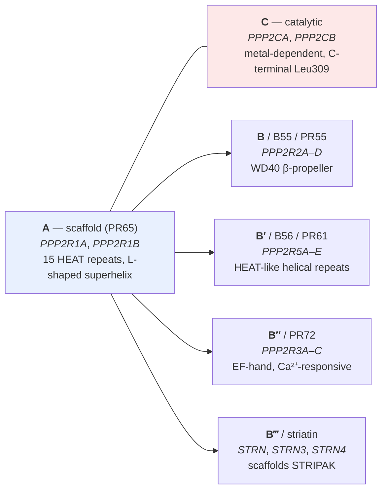
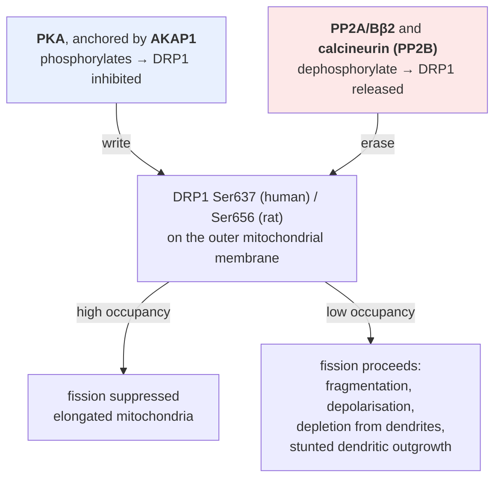

# D2 — Kinases, phosphatases and PP2A

> **Before this:** [Ch 08 Proteins and gene function](../part-01-molecular-foundations/08-proteins-and-gene-function.md) · **Time:** ~60 min

This chapter is part of the SCA12 specialisation ([D1](D1-neurons-and-the-cerebellum.md) · [D3](D3-repeat-expansion-disorders.md) · [D4](D4-sca12-from-repeat-to-phenotype.md) · [D5](D5-sca12-population-clinic-therapy.md)). It can be read at any point after Ch 08; nothing later in the main sequence is assumed.

## What you'll be able to do

- Explain why the phosphorylation state of a site is a *ratio* of two enzyme fluxes rather than a property of its kinase, and say what that implies for any experiment that manipulates only one side
- State the kinase/phosphatase gene-count asymmetry and derive from it why serine/threonine phosphatase specificity cannot live in the catalytic subunit
- Draw the PP2A holoenzyme, name its three parts and its four B families with their genes, and say which part supplies which property
- Distinguish B55β's two splice isoforms by what actually differs between them — and explain why "identical catalysis, different address" is a functional difference and not a technicality
- Predict the direction and rough size of the effect of doubling one B subunit under a competing-for-a-limited-core model, and name the assumption the whole prediction rests on
- Say what is established, what is inferred and what is simply unknown about *PPP2R2B* dosage — and name the one experiment that would settle the central question

## The core idea

A genome is not a program in the sense a programmer means. It is closer to a read-only image: a compiled artefact that the cell reads constantly, copies faithfully, and edits essentially never on the timescale of a thought or a heartbeat. But cells do the things programs do — they hold values, branch on conditions, remember what happened a second ago — and they have to do it somewhere other than in the sequence.

They do it in **covalent modification of proteins**, and overwhelmingly in one modification: attaching a phosphate to the hydroxyl of a serine, threonine or tyrosine side chain. Ch 08 introduced this as "the mutable layer" ([Ch 08 §6](../part-01-molecular-foundations/08-proteins-and-gene-function.md)) and then stopped, because Ch 08 is about what proteins *are*. This chapter is about what they *do to each other*, because you cannot understand *PPP2R2B* without it.

Here is the reframe that the rest of the chapter hangs on. A single protein molecule at a single site is genuinely binary: the phosphate is on or it is off. But nothing in a cell exists as a single molecule. A neuron holds thousands to millions of copies of any given protein, a kinase is adding phosphate to some of them at every instant, and a phosphatase is taking it off others. What the cell actually possesses at that site is not a bit but an **occupancy** — the fraction of the population currently carrying the mark — and that fraction is set jointly by two opposing enzymes.

> **Nothing in the cell is "phosphorylated".** Things are phosphorylated at a steady-state fraction determined by the ratio of kinase flux to phosphatase flux at that site. It follows immediately that removing a phosphatase raises the phospho-occupancy of its substrates exactly as surely as activating a kinase does — and that a phosphatase is therefore a regulator in its own right, not a cleaner following the kinase around with a mop.

Once you accept that, the question "how does the cell control phosphatases?" becomes as urgent as "how does it control kinases?", and PP2A — one enzyme by name, roughly sixty to a hundred possible holoenzymes in fact (§3.2 says what that number is and is not) — is the answer that matters for spinocerebellar ataxia type 12.

---

## 1. Phosphorylation as the cell's mutable state

### Why this modification and not another

A kinase transfers the γ-phosphate of ATP onto a hydroxyl-bearing side chain. A phosphatase hydrolyses it off. Ch 08 gave the chemistry: the phospho-group places **two negative charges** and a bulky hydrogen-bonding group at a defined position on the surface of a folded protein — enough to break a salt bridge, tip a conformational equilibrium, destroy a binding site, or create one a reader domain recognises.

Three properties make it the cell's default state variable. It is **fast**: both directions are enzyme-catalysed on second-to-sub-second timescales, so state changes faster than transcription can respond. It is **reversible without destroying the protein** — contrast ubiquitination and proteasomal degradation ([Ch 08 §7](../part-01-molecular-foundations/08-proteins-and-gene-function.md)), also a control mechanism but a terminal one. And it is **cheap**: one ATP per write, with the expensive object — the protein — reused.

Serine dominates the phosphoproteome heavily; the commonly quoted split across mapped human phosphosites is approximately **86% serine, 12% threonine, 2% tyrosine** ([Ch 08 §6](../part-01-molecular-foundations/08-proteins-and-gene-function.md); Olsen et al. 2006, *Cell* 127:635–48 — the figure reaches this chapter through a secondary restatement rather than the paper's own text, so treat it as approximate and do not quote it to a decimal place). Tyrosine phosphorylation gets disproportionate attention because so many oncogenes are tyrosine kinases, but numerically it is a rounding error on the serine/threonine system — which is the system *PPP2R2B* belongs to.

### Writer, eraser, and where the analogy breaks

The programming analogy that everyone reaches for is a register with a write instruction and a clear instruction. Take it, but take it precisely, because the two places it fails are the two places SCA12 lives.

**Where it holds.** A kinase writes, a phosphatase erases, and the site holds its value between operations. Signalling cascades are compositions of writes. Reader domains — SH2, 14-3-3, WD40 grooves — are the load instructions.

**Where it breaks, first: the value is analogue.** A register holds 0 or 1. A phosphosite holds a number between 0 and 1, and small shifts in that number are real biology, not noise to be rounded away. A site that sits at 50% occupancy and moves to 35% has changed the amount of downstream signal by 30% — a change no digital abstraction represents.

**Where it breaks, second: the eraser is not a `clear` instruction.** In a processor, clearing a register is a fixed operation with no state of its own. In a cell the eraser is an enzyme with an abundance, a localisation, a substrate preference, and its own regulation, all of which vary independently of the writer. This is the whole subject of §2 onwards.

Hold on to the consequence: **an experiment that changes only the kinase tells you about the numerator.** Half the biology of any phosphosite is in the denominator, and the denominator is where SCA12's candidate mechanism sits.

---

## 2. The phosphatase problem

### The gene counts, and the asymmetry they expose

Ch 08 gave you two round numbers: 518 protein kinases, "roughly 200 phosphatases". The round figures hide the structure. Split them by the residue they act on and the picture changes completely.

| Class | Human genes | Source |
|---|---|---|
| Protein kinases, total | **518** — 2.7% of the 19,442 protein-coding genes in GENCODE 50; Manning's original "≈1.7%" was computed against the ~30,000-gene estimate of 2002 | Manning et al. 2002, *Science* 298:1912–34 |
| … serine/threonine kinases | **428** | Shi 2009, *Cell* 139:468–84, restating Manning |
| … tyrosine kinases | **90** | Shi 2009 |
| Protein tyrosine phosphatases | **107** | Alonso et al. 2004, *Cell* 117:699–711; restated in Shi 2009 |
| Ser/Thr phosphatase **catalytic subunits** | **≈ 30** (PPP and PPM families) | Shi 2009 |

Read the last two rows against the middle two. On the tyrosine side, 90 kinases are opposed by 107 phosphatases — roughly matched, and specificity on both sides can plausibly be built into the enzymes themselves. On the serine/threonine side, **428 kinases are opposed by about 30 catalytic subunits**.

(That also reconciles Ch 08's "roughly 200": it lumps the two classes together and counts more permissively than the two sources above. The split is what matters here, not the total.)

Count the substrates too. Human cells carry of order 10⁵ mapped serine and threonine phosphosites — an order-of-magnitude teaching figure rather than a fixed count, since it grows with every phosphoproteomics release and moves substantially with how strictly you filter the identifications. Thirty catalytic subunits cannot each have evolved a binding surface for a thousand different substrates; there is not enough protein surface, and there is not enough evolutionary time to co-optimise a thousand independent interfaces on one fold.

> **Specificity has to be outsourced.** The arithmetic leaves exactly one architecture available: build a small number of catalytic engines with little intrinsic substrate preference, then bolt on a large, variable family of **targeting subunits** that supply substrate recognition, subcellular address and regulation. Combinatorics does the work that gene duplication cannot afford to do. This is not a curiosity of PP2A — it is the design the arithmetic forces, and PP1 solves the same problem the same way with a different family of regulators.

### What that architecture costs

Every architecture has a failure mode, and this one's is obvious the moment you name it. If specificity lives in an interchangeable part, and the interchangeable parts share a common engine, then **the parts are in competition** — and the amount of each part becomes a system-level variable rather than a local one.

That sentence is the whole of §6, and the whole of SCA12's leading hypothesis. Everything between here and there is the detail needed to make it quantitative.

---

## 3. PP2A: one name, sixty to a hundred possible holoenzymes

### 3.1 The heterotrimer

PP2A is not an enzyme. PP2A is a *family of heterotrimers* assembled from three kinds of subunit:



The **A subunit** is a spine: fifteen HEAT repeats stacked into a hooked, L-shaped superhelix, elastic enough to accommodate structurally unrelated partners on its inner face (Xu et al. 2006, *Cell* 127:1239–51). The **C subunit** is a metal-dependent PPP-family phosphoesterase whose C-terminal tail ends in **Leu309** — the residue that licenses assembly, §3.3 (Xing et al. 2006, *Cell* 127:341–53). Together they form the **core enzyme**, which has essentially no substrate selectivity on its own. The **B subunit** supplies everything that makes the complex an enzyme for something in particular.

### 3.2 The four B families

The four families are not paralogues of each other. They are structurally unrelated folds that converged on the same docking surface of the A scaffold — itself the strongest structural argument that the B slot is a *specificity socket*, not a conserved accessory.

| Family | Also called | Human genes | Subunit names | Fold and recognition | Notes |
|---|---|---|---|---|---|
| **B** | B55, PR55 | *PPP2R2A*, ***PPP2R2B***, *PPP2R2C*, *PPP2R2D* | B55α, **B55β**, B55γ, B55δ | Seven-bladed **WD40 β-propeller** with an acidic groove across its top face | The family SCA12 lives in |
| **B′** | B56, PR61 | *PPP2R5A–E* | B56α–ε | HEAT-like helical repeats; recognises an **LxxIxE** short linear motif in substrates | The best-characterised motif-based targeting in the family |
| **B″** | PR72, PR130 | *PPP2R3A*, *PPP2R3B*, *PPP2R3C* | — | **EF-hand**, Ca²⁺-responsive | Makes a subset of PP2A activity calcium-gated |
| **B‴** | striatin | *STRN*, *STRN3*, *STRN4* | — | Scaffolds the **STRIPAK** complex | PP2A embedded in a larger signalling assembly |

*Sources: Sandal et al. 2021, J Cell Sci 134:jcs248187; Haanen, O'Connor & Narla 2022, J Biol Chem 298:102656; structures from Xu et al. 2006 (B55) and Cho & Xu 2007, Nature 445:53–7 (B56).*

Across the four families there are **15 B-subunit genes** producing **at least 26 transcript and splice variants** (Haanen et al. 2022). Multiply out against 2 A genes and 2 C genes and the literature quotes the number of distinct assemblable holoenzymes as **"over 60"** (Haanen et al. 2022) or **"nearly 100"** (Sandal et al. 2021).

> **Read that range as a range.** Sixty and a hundred are both *combinatorial upper bounds computed from subunit counts*, not censuses of complexes observed in a cell. Nobody has enumerated the PP2A holoenzymes actually present in a human neuron. Not every combination assembles, and the abundances of those that do differ by orders of magnitude — §4 has a 10-fold difference between two isoforms of a single gene. Quote "roughly 60–100 possible holoenzymes" and say where the number comes from.

Two figures make PP2A's weight concrete: it accounts for **at least 50% of total cellular serine/threonine dephosphorylation** in most cell types, and in some tissues PP2A subunits together make up **as much as ~1% of total cellular protein** (Sandal et al. 2021; reviewed in Shi 2009). This is not a boutique enzyme.

### 3.3 PP2A is regulated at assembly, not at catalysis

Here is where PP2A departs from the intuition you built on kinases. A kinase is switched — phosphorylated on its activation loop, bound by a cyclin, released from an autoinhibitory segment — and its catalytic rate goes up and down. PP2A is regulated overwhelmingly by **which holoenzyme gets built**.

| Regulator | What it does |
|---|---|
| **LCMT1** | Methylates the C-terminal **Leu309** carboxylate of the C subunit. Neutralising that negative charge **permits binding of both B55 and B56 family subunits** — methylation licenses holoenzyme biogenesis |
| **PME-1** | Removes the methyl ester. The restored negative charge sterically and electrostatically disfavours B-subunit binding; PME-1 also protects the free catalytic subunit from proteasomal degradation |
| **α4 (IGBP1)**, **PTPA** | Chaperone-like biogenesis factors that sequester and mature the nascent catalytic subunit, preventing promiscuous free-C activity |
| **I₁PP2A (ANP32A)**, **I₂PP2A (SET)** | Endogenous protein inhibitors. Both are up-regulated in Alzheimer's neocortex; I₂PP2A relocates from nucleus to cytoplasm and its 39-kDa form is cleaved to a ~20-kDa fragment in AD brain (Tanimukai et al. 2005, *Am J Pathol* 166:1761–71) |
| **CIP2A** | An oncoprotein that blocks PP2A activity toward c-Myc Ser62, stabilising c-Myc; overexpressed in head-and-neck and colon cancer (Junttila et al. 2007, *Cell* 130:51–62) — PP2A as tumour suppressor ([Ch 56](../part-11-human-and-statistical-genomics/56-cancer-genomics.md)) |
| **Okadaic acid**, **microcystin-LR** | Natural-product active-site binders used pharmacologically; the co-crystal structures define the site (Xing et al. 2006) |

*Sources for the methylation and chaperone rows: Haanen et al. 2022; Sandal et al. 2021; PME-1 protection of free C from Yabe et al. 2015, PLoS ONE 10:e0145226.*

Notice what every row in the top half of that table acts on: **the assembly equilibrium**. Methylation gates which B families can dock; chaperone availability gates how much mature core exists. Nothing there dials a *k*<sub>cat</sub>. That is why a change in the *amount* of one B subunit is a credible pathogenic mechanism rather than a naive one — if PP2A were regulated by switching catalysis, changing subunit abundance would be buffered by the switch; because it is regulated by assembly, subunit abundance *is* the control variable.

It also explains why the okadaic-acid literature is less useful than it looks. Okadaic acid binds the catalytic site (Xing et al. 2006), inhibiting every PP2A holoenzyme indiscriminately — and the site it binds is the *shared* PPP-family active site, so the other PPP catalytic subunits (PP1, PP4, PP5, PP6) are inhibited by it as well. This chapter's sources do not pin the relative potencies, so treat "PP2A-selective concentrations" as a claim to be checked against a selectivity paper rather than a property of the compound. An okadaic-acid experiment cannot by itself establish that the activity in question is PP2A rather than another PPP-family phosphatase — including PP5, which §5.1 credits with 10% of brain tau-phosphatase activity — let alone say which holoenzyme, the only question that matters here.

---

## 4. *PPP2R2B* and its two isoforms

### 4.1 The gene

| Property | Value |
|---|---|
| Symbol / product | ***PPP2R2B*** → **B55β** (also Bβ, PR55β); HGNC:9305 |
| Cytogenetic location | **5q32** (mapped to 5q31–q33 in the original SCA12 report) |
| Coordinates | **chr5:146,581,146–147,084,784 (GRCh38/hg38), minus strand** |
| Entrez / Ensembl | **5521** / **ENSG00000156475** |
| SCA12 CAG tract | **133 nt upstream** of the reported transcription start site — 5′ regulatory, **not coding** |
| Functional effect of the tract | acts as a *cis* element; the leading model has it **up-regulating** *PPP2R2B* expression (Lin et al. 2010, *Hum Genet* 128:205–12), but the direction is contested — see §6.3 |

*Coordinates from the GTEx reference API, retrieved 2026-08-25; locus and repeat position from OMIM #604326 summarising Holmes et al. 1999, Nat Genet 23:391–2.*

Note the assembly on the coordinates. A coordinate without a build is meaningless — and a build without its coordinate convention is only half a coordinate: this span is 1-based inclusive, as GTEx and Ensembl report it ([Ch 41](../part-09-genomics/41-data-formats.md) owns that in full).

The "133 nt upstream" figure carries a live annotation dispute worth naming. It is measured against the *originally reported* transcription start site; current database annotation (STRchive, and ClinVar's `NM_181675.3(PPP2R2B)`) places the tract inside the **5′ UTR** instead. Both can hold at once, because *PPP2R2B* has multiple alternative first exons and therefore multiple TSSs — the repeat is promoter-proximal relative to one and transcribed 5′ UTR relative to another. That matters for §6: a transcribed repeat is an RNA-toxicity substrate as well as a regulatory element, which is [D3](D3-repeat-expansion-disorders.md)'s territory.

The single structural fact that organises the entire SCA12 track is in the fifth row. **The repeat is not in the open reading frame.** It makes no polyglutamine tract *from the canonical reading frame* — though RAN (non-ATG) translation at this locus has been shown to produce polyglutamine and polyserine peptides in cell and iPSC models, which [D3](D3-repeat-expansion-disorders.md) develops. Whatever SCA12 turns out to be, it is not a polyQ aggregation disease in the *HTT* sense ([Ch 16 §9](../part-03-genome-instability/16-mutation.md) sets up that contrast; [D3](D3-repeat-expansion-disorders.md) develops it). What it *is* remains open: the live candidates are regulatory dosage, RNA toxicity from the transcribed repeat, and RAN translation, and STRchive's curation grades the mechanism formally **"incompletely established"**. This chapter follows the dosage arm, because that is the arm that needs PP2A biochemistry — and it is why the chapter is about how much B55β a cell contains rather than what shape it folds into; [D3](D3-repeat-expansion-disorders.md) and [D4](D4-sca12-from-repeat-to-phenotype.md) weigh the others. The repeat sits where Ch 05 and Ch 22 taught you regulatory sequence lives ([Ch 05 §6](../part-01-molecular-foundations/05-transcription.md); [Ch 22 §2](../part-04-gene-regulation/22-eukaryotic-transcriptional-regulation.md)).

### 4.2 Bβ1 and Bβ2: identical enzymes at different addresses

*PPP2R2B* produces at least two neuronal isoforms by alternative splicing of the 5′ end, identical except for a **divergent N-terminal tail** ([Ch 06 §9](../part-01-molecular-foundations/06-rna-processing.md) for the splicing classes that produce this shape of variation). The result that makes them interesting, from Dagda et al. 2003 (*J Biol Chem* 278:24976–85), is a negative one: **the divergent N terminus has no effect on phosphatase activity.** It is a targeting signal, and nothing else.

| Property | Bβ1 | Bβ2 |
|---|---|---|
| Localisation | Cytosolic | **Outer mitochondrial membrane** |
| Catalytic properties of the holoenzyme | — | **Indistinguishable** from Bβ1 |
| Targeting element | — | The N-terminal tail alone is sufficient to target GFP to mitochondria |
| Relative abundance of holoenzymes | baseline | **≈ 10-fold less abundant** than Bβ1 (rat brain) |
| Regional bias in brain | — | **Predominantly forebrain** (rat brain) |
| Overexpression phenotype | no effect | **Accelerates apoptosis** on growth-factor withdrawal — and requires holoenzyme assembly |

*All rows: Dagda et al. 2003; localisation corroborated by Strack et al. 1998, J Comp Neurol 392:515–27.*

**One structural point about those two isoforms decides more than it looks — and it is an inference, not a quotation.** The 5′ ends differ because the two transcripts use *different first exons*: the repeat sits in the 5′ region of the Bβ1-encoding variants, and the Bβ2 first exon lies outside it. No single paper states this outright — it is an inference from Dagda et al. 2003 plus the current transcript annotation. If it holds, then whatever the repeat does as a *cis* element it does at the Bβ1 first exon, and any route to Bβ2 has to be indirect. Hold that until §6.2, where it turns out to be the joint the whole mitochondrial story hangs on — and note now that the joint is only as strong as the inference.

How Bβ2 gets to the outer membrane is a small mechanistic gem. It carries a **cryptic mitochondrial import signal** in roughly its first 24 residues, and immediately downstream a **structural arrest domain**. The protein engages the mitochondrial import translocase like any imported protein — and then refuses to unfold. Import stalls, and the protein is left embedded in the outer membrane rather than delivered inside (Dagda et al. 2005, *J Biol Chem* 280:27375–82). Localisation here is not an address written in a sorting code; it is an accident of biophysics that evolution kept.

And the targeting is itself phospho-regulated. Phosphorylation of **Ser20/Ser21/Ser22** neutralises the +3 charge of the import signal and holds Bβ2 in the cytosol; autodephosphorylation permits mitochondrial accumulation (Merrill, Slupe & Strack 2013, *FEBS J* 280:662–73). A phosphatase subunit whose delivery to its workplace is gated by phosphorylation of its own tail — regulation all the way down, and a clean illustration of §1's point that occupancy, not identity, carries the signal.

> **"Identical catalysis, different address" is a functional difference, not a technicality.** An enzyme's substrates are the molecules it encounters. Move the same catalytic activity from the cytosol to the outer mitochondrial membrane and you have not changed the enzyme; you have changed its entire substrate set. §5 shows what it finds when it gets there.

One more isoform fact with a consequence for [Lab 12](../labs/lab-12-expression-and-isoforms.md): Bβ2 mRNA is **dramatically induced postnatally** and on neuronal differentiation, while total Bβ protein *decreases* after birth as Bγ rises (Dagda et al. 2003; Strack et al. 1998). Any measurement of "*PPP2R2B* expression" that does not resolve isoforms is measuring a moving mixture of two things that go in different directions ([Ch 47 §7](../part-10-functional-genomics/47-rna-seq.md) on why gene-level counts hide isoform-level biology).

### 4.3 Where it is expressed — and the claim that does not survive checking

The convenient story writes itself: *PPP2R2B* is cerebellum-enriched, so a *PPP2R2B* dosage change gives a cerebellar disease. It is tidy, it is repeated, and the expression data do not support it.

GTEx v8 median gene-level TPM for *ENSG00000156475*, retrieved from the GTEx API on 2026-08-25:

| Tissue | Median TPM |
|---|---|
| Brain — Frontal Cortex (BA9) | **29.90** |
| Brain — Nucleus accumbens (basal ganglia) | 24.81 |
| Brain — Cortex | 24.66 |
| Brain — Caudate (basal ganglia) | 22.51 |
| Brain — Putamen (basal ganglia) | 17.60 |
| Brain — Hippocampus | 13.26 |
| Brain — Spinal cord (cervical c-1) | 13.04 |
| **Brain — Cerebellum** | **10.16** |
| **Brain — Cerebellar Hemisphere** | **8.76** |
| *median of all 41 non-brain tissues* | **0.50** |
| Muscle — Skeletal | 0.039 |
| Cells — Cultured fibroblasts | 0.011 |

*(Four further brain regions fall between the rows shown: anterior cingulate 20.16, amygdala 15.55, hypothalamus 14.85, substantia nigra 13.38. One neural tissue in the set sits below both cerebellar samples: pituitary at 6.56 — and tibial nerve at 9.28 falls between the two cerebellar samples.)*

Three conclusions, in this order.

**One: the brain part of the story holds, emphatically.** Brain tissues run roughly **20–60×** the median non-brain tissue and roughly **800–2,700×** cultured fibroblasts and roughly **200–800×** skeletal muscle. The Human Protein Atlas independently classifies *PPP2R2B* as **"group enriched (brain, retina, testis)"**. Strack et al. 1998 found Bβ protein detectable **only in brain**, unlike the A, Bα and C subunits which are broadly expressed. This is a brain gene.

**Two: it is not cerebellum-enriched.** Cerebellum ranks *below every cortical and basal-ganglia region GTEx samples*. Frontal cortex BA9 is about three times cerebellum. The Human Protein Atlas records **low region specificity** within brain, detected everywhere. And Dagda et al. found the Bβ2 isoform **predominantly forebrain**, which points away from an isoform-level rescue of the cerebellar story rather than toward one.

**Three: therefore the cerebellar phenotype of SCA12 is not explained by where the gene is transcribed.** It is an instance of the selective-vulnerability problem — ubiquitous or broadly expressed gene, reproducibly specific cell death — not a solution to it. [D1](D1-neurons-and-the-cerebellum.md) develops that problem properly; [D4](D4-sca12-from-repeat-to-phenotype.md) has to confront it.

> **The caveat on the caveat, stated as an unknown.** GTEx cerebellum is *bulk* RNA-seq, and bulk cerebellar RNA is dominated by granule cells, which outnumber Purkinje cells by something on the order of 10³–10⁴. A transcript expressed strongly and specifically in Purkinje cells would be diluted to invisibility in that mixture. These data rule out **cerebellum-level** enrichment. They cannot rule out **Purkinje-cell** enrichment, and no published single-nucleus analysis of *PPP2R2B* by cerebellar cell type was found for this chapter. That question is open, and it is exactly the kind of question [Ch 48](../part-10-functional-genomics/48-single-cell-and-spatial.md) exists to answer.

---

## 5. Substrates that will matter

Three substrate stories are worth knowing before D4, chosen because each teaches a different thing about how a phosphatase's abundance propagates into disease.

### 5.1 Tau — PP2A is the principal tau phosphatase, and the *K*<sub>m</sub> is the point

Liu et al. 2005 (*Eur J Neurosci* 22:1942–50) measured which phosphatases actually dephosphorylate tau in human brain extract. The split:

| Phosphatase | Share of total tau phosphatase activity |
|---|---|
| **PP2A** | **≈ 71%** |
| PP1 | ≈ 11% |
| PP5 | ≈ 10% |
| PP2B (calcineurin) | ≈ 7% |

That is a striking concentration of responsibility, and it is why PP2A shows up in every discussion of tau. In Alzheimer's disease brain, total tau-phosphatase activity and PP2A/PP5 activity are significantly **decreased** (PP2B increases), and PP2A activity correlates negatively with tau phosphorylation at most sites (Liu et al. 2005). Take that as evidence of *stakes*, not as a claim that SCA12 is a tauopathy — nothing in the SCA12 literature says it is.

The number that matters more than 71% is the *K*<sub>m</sub>. Liu et al. measured **8–12 µM** for tau dephosphorylation by PP1, PP2A and PP5 — **comparable to the intraneuronal tau concentration in human brain** (PP2B's is five-fold higher, which is part of why its share is small).

> **Why the *K*<sub>m</sub> line is load-bearing.** An enzyme working far above its *K*<sub>m</sub> is saturated: add more substrate and nothing happens, and its flux is set by *V*<sub>max</sub> alone. An enzyme working far below is in the linear regime and mostly idle. PP2A on tau sits near *K*<sub>m</sub> — neither saturated nor idle — which is the regime where **flux tracks enzyme abundance directly**. Change how much active PP2A is present and you change steady-state tau phosphorylation, with no buffering step in between. This is the enzymological reason to take a *dosage* change in a PP2A subunit seriously rather than assuming the cell absorbs it.

### 5.2 DRP1 — one residue, two enzymes, opposite morphologies

Mitochondria are not a fixed population. They fuse (MFN1/MFN2 on the outer membrane, OPA1 on the inner) and divide, and division is executed by **DRP1**, a dynamin-family GTPase recruited to the outer membrane. The balance sets mitochondrial length, how mitochondria distribute into dendrites and axons, and how damaged material is segregated for mitophagy.

DRP1 carries a conserved inhibitory phosphoserine — **Ser637** in human numbering, **Ser656** in rat — and two opposed enzymes act on it *on the same membrane*:



*Dickey & Strack 2011, J Neurosci 31:15716–26; Merrill et al. 2013, FEBS J 280:662–73; phosphosite numbering from phospho-DRP1(Ser637) reagent documentation and Merrill 2013 for the rat residue.*

This is the cleanest illustration in the chapter of §1's framing. Two enzymes, anchored on the same square metre of membrane, act on one residue on one protein with opposite sign; the cell's mitochondrial morphology is a readout of the *ratio* of their activities. In neurons, PP2A/Bβ2 driving that dephosphorylation causes mitochondria to fragment and depolarise, disappear from dendrites, and stunt dendritic outgrowth (Dickey & Strack 2011).

Note which isoform does it. **Bβ2** — the mitochondrially targeted one, the one that is ten-fold rarer. §4.2's "different address" cashes out here: Bβ1 sitting in the cytosol never meets DRP1's inhibitory serine. Note also what this does *not* yet establish for SCA12. Every result above raises Bβ2 experimentally, by overexpression; the repeat itself sits in the Bβ1 transcript, not the Bβ2 one (§4.2), so the step from the mutation to more Bβ2 is missing rather than demonstrated. §6.2 returns to it.

### 5.3 Akt and GSK-3β — the crosstalk that ruins simple predictions

PP2A also acts on the PI3K–Akt axis. A holoenzyme containing **B55α** targets **Akt** and dephosphorylates **Thr308** (Kuo et al. 2008, *J Biol Chem* 283:1882–92). Separately, PP2A regulates tau phosphorylation both directly and *indirectly by activating GSK-3β*, so inhibiting PP2A raises tau phosphorylation partly through a GSK-3β route (Qian et al. 2010, *J Alzheimers Dis* 19:1221–9; Wang et al. 2015, *Neurobiol Aging* 36:188–200).

Now trace the loop. Akt phosphorylates GSK-3β at Ser9 to inhibit it. PP2A dephosphorylates Akt Thr308 to inhibit Akt. Less active Akt means less Ser9 phosphorylation, so *more* active GSK-3β, so *more* tau phosphorylation.

> **PP2A therefore affects tau phosphorylation with opposite signs along two routes** — directly removing tau phosphate, indirectly enabling the kinase that adds it. Any prediction of the form "more PP2A → less phospho-tau" is naive, and the sign of the net effect depends on quantities nobody has measured in the relevant cell type. Note also that the Akt result belongs to B55**α** (*PPP2R2A*), not B55β (*PPP2R2B*). Do not transfer a result across paralogues because the proteins have similar names; that is the same error as assuming two isoforms behave alike because they share a gene.

### 5.4 What B55β does in a neuron — and what we do not know it does

Read §§5.1–5.3 again and notice what they are *not*. They are stories about PP2A, and B55β itself appears in exactly one of them. That absence has to be faced before §6, because §6 is about to predict that raising *PPP2R2B* costs the cell several unrelated activities — and a loss whose contents cannot be named is a prediction the reader cannot check.

So here is the candidate list for what a B55β holoenzyme does in a neuron, each item with its evidential state in the vocabulary [D4](D4-sca12-from-repeat-to-phenotype.md) uses for the whole mechanism: **Established** = demonstrated in more than one system including a patient-derived one; **Supported** = demonstrated, but in one system or one design class; **Conjectured** = argued from adjacent facts, not measured.

| Candidate process | What this chapter's sources actually show | State |
|---|---|---|
| **Mitochondrial fission.** Bβ2 dephosphorylating DRP1 Ser637/Ser656 at the outer membrane releases DRP1: mitochondria fragment and depolarise, are depleted from dendrites, dendritic outgrowth is stunted (§5.2) | Dickey & Strack 2011, in neurons — but every experiment raises Bβ2 by overexpression, and the repeat sits at the Bβ1 first exon, not Bβ2's (§4.2, §6.2) | **Supported** as an activity of Bβ2; **Conjectured** as anything SCA12 does — this is D4's Hypothesis B |
| **Apoptosis on stress.** Bβ2 overexpression accelerates death on growth-factor withdrawal, and requires holoenzyme assembly; Bβ1 and Bγ do not reproduce it (§4.2) | Dagda et al. 2003 — one laboratory, one design class | **Supported** |
| **Tau dephosphorylation** (§5.1) | PP2A *as a whole* supplies ≈71% of brain tau-phosphatase activity. Nothing in these sources identifies B55β as one of the tau-directed holoenzymes | **Conjectured** for B55β — D4's Hypothesis D, and D4 records that it has never been measured in any SCA12 system |
| **Akt Thr308 and the GSK-3β route** (§5.3) | Demonstrated for **B55α** (*PPP2R2A*; Kuo et al. 2008). Nothing for B55β | **Conjectured** for B55β, and the paralogue trap §5.3 warns about |
| **Synaptic plasticity** — the parallel-fibre learning that trains the internal models described in [D1](D1-neurons-and-the-cerebellum.md)'s cerebellar-computation section, with the climbing fibre supplying the error signal | Nothing. No plasticity role is attributed to B55β anywhere in this chapter's sources | **Conjectured**, and thinly: a process where one *expects* a phosphatase, with no B55β evidence behind the expectation |
| **Pacemaker conductances** — the resurgent Na⁺ current and matching K⁺ conductances that keep a Purkinje cell firing at a mean of about 40 Hz with no synaptic input at all | Nothing. No B55β substrate among them is named in these sources | **Conjectured** — but worth naming, because [D1](D1-neurons-and-the-cerebellum.md)'s selective-vulnerability section makes that ~40 Hz the hinge of the firing-energetics account, so this is the shortest imaginable route from a dosage change to the property vulnerability is supposed to turn on |

> **The honest summary of that table is a negative, and it should be read as one.** No B55β-specific neuronal substrate list has been published — none was found for this chapter. The substrate literature is about total PP2A activity in brain extract (tau), or about a different paralogue (Akt), or about a single substrate reached by overexpressing the isoform that reaches it (DRP1). That is why §6.2 states its displacement arm as a loss of *unnamed* activities: not as rhetorical caution, but because the names do not exist yet. Anyone who writes "SCA12 disrupts B55β's neuronal functions" is quantifying over an empty set.

**What the loss-of-function allelic series does and does not settle.** *De novo* **missense** variants in *PPP2R2B* cause a **neurodevelopmental syndrome**, and those variants impair holoenzyme incorporation, mitochondrial localisation, fission induction and DRP1 dephosphorylation (Sandal et al. 2025, *Hum Mol Genet*). Take carefully what that constrains. It establishes in human genetics — not in an overexpression construct — that B55β function is *required*, so too little is a disease as well as too much; that is why [D5](D5-sca12-population-clinic-therapy.md)'s therapy section treats it as the floor under any knockdown dose, and why the target is a dial with damage at both ends. It also corroborates that holoenzyme incorporation, mitochondrial localisation and DRP1 dephosphorylation are genuine activities of the normal protein, since those are the assays the variants failed. What it does **not** do is supply the missing substrate list. It names no further targets, it does not say which of the failed activities carries the neurodevelopmental phenotype, and a developmental syndrome is a different phenotype at a different life stage from adult-onset cerebellar degeneration. It is the cleanest available test of what B55β does in humans, and it still leaves §6's displaced activities without names.

---

## 6. Why dosage of a regulatory subunit is dangerous

This is the load-bearing section. SCA12's leading hypothesis *assumes* that an expanded CAG tract acting as a *cis* element raises *PPP2R2B* transcription, raising B55β protein, and holds that *more of a PP2A regulatory subunit is pathogenic*. Whether that is plausible depends entirely on an argument we can now build — and on two assumptions we should expose rather than smuggle: that the rise is real and in that direction (§6.3), and that the A–C core is the scarce resource (§6.3 again).

### 6.1 The argument, in four steps

1. **Substrate specificity, targeting and regulation reside in the B subunit** (§3). Structurally and functionally established.
2. **The A–C core is shared.** Fifteen B-subunit genes and at least 26 variants compete for cores assembled from two A genes and two C genes (§3). Established, by gene count.
3. **Assembly is a binding equilibrium**, gated by Leu309 methylation and chaperone availability — not a dedicated one-to-one pairing process (§3.3). Established.
4. **Therefore** raising the abundance of one B subunit shifts the equilibrium, forming more of that holoenzyme *and, by mass action on a limited core pool, fewer of the others* — producing a simultaneous **gain of one activity and loss of several unrelated ones**.

Steps 1–3 are solid. Step 4 follows from them *given one premise*: that the A–C core is the scarce resource. Make that premise explicit and the argument becomes checkable.

### 6.2 A toy model, worked

Assume:

- **(i)** cores are limiting — total B subunit exceeds total free A–C core, so every core is occupied;
- **(ii)** all B subunits bind a free core with the same affinity;
- **(iii)** binding is tight enough that free B is negligible.

Under those assumptions the cores partition in proportion to B-subunit abundance. Write *f*<sub>i</sub> for subunit *i*'s share of the total B pool, and *H*<sub>i</sub> for the number of cores carrying it, with *N* total cores:

```
f_i  = B_i / B_tot
H_i  = N * f_i
```

Now let a *cis*-element expansion raise *B*<sub>i</sub> by a factor *r*. The total B pool grows too, but only by subunit *i*'s contribution:

```
B_tot'  = B_tot + (r - 1) * B_i
        = B_tot * [1 + (r - 1) * f_i]

f_i'    = r * B_i / B_tot'
        = r * f_i / [1 + (r - 1) * f_i]
```

Divide through by the baseline and you get two clean results:

```
H_i' / H_i  =  r / [1 + (r - 1) * f_i]        (the boosted holoenzyme)
H_j' / H_j  =  1 / [1 + (r - 1) * f_i]        (EVERY other holoenzyme, j != i)
```

They differ by exactly the factor *r*, and both are governed by a single dimensionless quantity, **(*r* − 1)·*f*<sub>i</sub>** — call it the *fractional core reallocation*. Put numbers in. Take *f*<sub>i</sub> = 0.05 (B55β as 5% of the neuronal B pool — an assumption, not a measurement; nobody has published the distribution) and *r* = 2 (a doubling):

```
(r - 1) * f_i = 1.00 * 0.05 = 0.05

boosted:   2 / 1.05 = 1.905      ->  +90.5%
all others: 1 / 1.05 = 0.952     ->   -4.8%
```

Three things fall out that are not obvious before you do the arithmetic.

**A doubling does not double.** Ninety per cent, not a hundred, because the subunit competes with its own increase — and the shortfall grows with *f*<sub>i</sub>: at *f*<sub>i</sub> = 0.30, doubling gives 2/1.30 = **1.54×**.

**The loss is universal but individually small.** Every other B subunit loses 4.8% of its holoenzyme — striatins, B56 family, calcium-gated B″, the lot. No single one loses much, but the loss lands on dozens of unrelated substrate sets at once, which is a very different perturbation from a 4.8% change in one pathway, and it is invisible to any assay that looks only at the gene you perturbed. Say plainly how weak that claim currently is: §5.4 could not name B55β's *own* neuronal substrate set, let alone the sets served by the holoenzymes it displaces, so "several unrelated activities are lost" is at present a structural prediction with no list attached. Naming even one displaced activity and measuring it would convert the whole of §6 from arithmetic into biology.

**The model is gain-dominated.** +90% concentrated on one activity against −4.8% diluted over the rest. If it is right, SCA12 should look mechanistically more like a gain than a loss ([Ch 08 §10](../part-01-molecular-foundations/08-proteins-and-gene-function.md) for the loss/gain/poison framework) — a prediction, and testable in principle.

Now split by isoform — and this is where the chain is weakest, so read the next paragraph as the place it is most likely to break.

The arithmetic above treats "more *PPP2R2B*" as one quantity. It is not. The repeat sits in the 5′ region of the **Bβ1** transcript; the **Bβ2** transcript is made from a different first exon and, on the inference §4.2 sets out, does not carry it. A *cis* element at the Bβ1 first exon has **no direct route to Bβ2** — so any Bβ2-mediated mechanism, which is to say the whole mitochondrial/DRP1 arm of §5.2, has to route through *trans* effects on total *PPP2R2B* output rather than through the repeat acting on the Bβ2 message. That step is not demonstrated in patient neurons, and it, not the splice ratio, is the joint most likely to fail.

What follows if you nonetheless grant it. Suppose the whole *PPP2R2B* pool rose uniformly and the splice ratio held: Bβ1 and Bβ2 would both rise by the same 1.905×, preserving the 10:1 ratio (§4.2 — a rat-brain measurement, imported into a human-neuron calculation on the assumption that it transfers). In the units above, 5 cores carrying Bβ at baseline are 4.55 Bβ1 + 0.45 Bβ2; after the doubling, 9.52 cores are 8.66 Bβ1 + **0.87 Bβ2** — the mitochondrially targeted arm nearly doubling in absolute terms while remaining a small minority of all PP2A. Treat that as an illustration of the arithmetic, not as a prediction: it inherits the unproven *trans* step above, and whether the splice ratio itself shifts under an expanded repeat is, as far as this chapter's sources go, **unknown**. [Lab 12](../labs/lab-12-expression-and-isoforms.md) is where you would go and look ([Ch 47 §7](../part-10-functional-genomics/47-rna-seq.md) for why gene-level counts cannot answer it).

### 6.3 The assumption that carries everything

Drop assumption (i) and the conclusion evaporates. If free cores are in **excess** rather than limiting, then adding B subunit simply builds more holoenzyme out of spare parts:

```
core-limited:  H_i' / H_i = r / [1 + (r-1) f_i]   ;  H_j' / H_j < 1   (displacement)
core-excess:   H_i' / H_i = r                     ;  H_j' / H_j = 1   (no displacement)
```

So the entire "dosage is dangerous" argument reduces to one empirical question: **is the A–C core pool saturated in a neuron?**

> **State the honest position.** Reviews assert competition for a limiting A–C core routinely, and it follows straightforwardly from steps 1–3. But no clean primary study quantifying the free-core pool in a neuron, or demonstrating measured displacement of endogenous B subunits by *PPP2R2B* overexpression at disease-relevant levels, was found for this chapter. This is a **mechanistic hypothesis with its logic exposed**, not a demonstrated fact, and D4 will treat it as such.

Assumption (ii) is also doing work. If B55β binds the A subunit more tightly than the average B subunit, it takes a disproportionate share and displacement is worse than the model says; if more weakly, better. The affinity distribution across all fifteen B subunits in a neuron has not been measured either.

Three observations make the hypothesis worth taking seriously despite that:

- Bβ2's pro-apoptotic effect **requires holoenzyme assembly** — an assembly-defective Bβ2 mutant is inert, and neither Bβ1 nor Bγ reproduces it (Dagda et al. 2003). The phenotype runs through the core, not through free Bβ2. That is consistent with competition, though not proof of it.
- Bβ2 holoenzymes are **already a ~10-fold minority** at baseline (Dagda et al. 2003). A minority species can undergo a large fractional increase without anything else changing much.
- The SCA12 repeat's direction of effect is *usually reported* as **up**, not down — reporter assays put promoter activity rising with repeat length (Lin et al. 2010; O'Hearn et al. 2015), and Zhou et al. 2024 (*Mov Disord* 39:1886–91) find an expanded CAG raising the 7B7D transcript and Bβ1 protein. If that holds, the relevant question genuinely is what excess does, not what deficiency does.

> **But the direction is contested, and this is the second premise the whole section rests on.** Kumar et al. 2024 (*iScience* 27:109768), working in iPSC-derived neurons from SCA12 patients, report **most *PPP2R2B* isoforms down-regulated** in mature neurons, with a minority of isoforms up at the earlier, less differentiated stages of the same series. That is the only patient-neuron expression data available, and it runs against the overexpression model the field has used since 2010. §6 assumes the up direction throughout; the assumption is not established, and the sign may be cell-type- and maturation-stage-dependent. Alongside core-limitation, this is one of the two places the argument would fail entirely if it turned out wrong.

### 6.4 The experiment that would settle it

Name it, because a hypothesis you cannot say how to test is not yet science.

**Quantitative interaction proteomics of the A subunit across a *PPP2R2B* dosage series.** Immunoprecipitate the A subunit from neurons expressing a graded range of *PPP2R2B*, and measure the *full B-subunit occupancy distribution* by mass spectrometry — not just the subunit you overexpressed, which is the measurement everyone actually makes and which cannot distinguish the two models. The predictions separate cleanly:

| Observation | Interpretation |
|---|---|
| Total A-bound B constant; distribution reshuffles toward B55β; other subunits fall | **Core-limited.** Step 4 holds; SCA12 dosage is a redistribution |
| Total A-bound B rises with dose; other subunits unchanged | **Core-excess.** Step 4 fails; SCA12 dosage adds activity without subtracting any |

> **The general lesson, worth carrying out of this chapter.** For a gene whose product is a *specificity subunit competing for a shared catalytic core*, dosage is not a smooth dial on one activity. It is the **redistribution of a scarce resource**. Haploinsufficiency and triplosensitivity intuitions built on enzymes that act alone — one gene, one protein, one job — do not transfer, and neither does the reflex that "a bit more of a normal protein is probably fine."

---

## Common misconceptions

| What people think | What's actually true |
|---|---|
| Phosphatases are unregulated housekeeping enzymes that clean up after kinases; the kinase carries the information | Occupancy at a site is set by the *ratio* of kinase to phosphatase flux, so the phosphatase is half the signal, and an experiment perturbing only the kinase has measured the numerator (§1). Nor is it unregulated: Leu309 methylation by LCMT1 and demethylation by PME-1 gate B-subunit binding, α4 and PTPA gate core maturation, SET and ANP32A inhibit — more regulatory machinery than most kinases carry (§3.3) |
| More phosphatase means less signalling everywhere | Specificity is per-holoenzyme, so "more PP2A" is not a global statement. Worse, under a limiting-core model more of *one* B subunit means *less* of every other holoenzyme — signalling goes down in some places and up in others simultaneously (§6) |
| PP2A is an enzyme | PP2A is a family of roughly 60–100 possible heterotrimers sharing a catalytic subunit. Two holoenzymes with the same C subunit and different B subunits are functionally different enzymes. Treating "PP2A" as one thing makes the SCA12 mechanism unintelligible (§3) |
| Substrate specificity comes from the catalytic site, as it does for kinases | 428 Ser/Thr kinases are opposed by ~30 Ser/Thr phosphatase catalytic subunits. There are not enough catalytic subunits for that architecture to work; specificity is built combinatorially in the targeting subunits (§2) |
| The Bβ1 and Bβ2 isoforms must differ in activity, or why have two? | Their catalytic properties are indistinguishable. The divergent N terminus is a *pure targeting signal* — the tail alone sends GFP to mitochondria. Same enzyme, different address, and therefore a different substrate set (§4.2) |
| *PPP2R2B* must be cerebellum-enriched, since SCA12 is a cerebellar disease | GTEx v8: cerebellum 10.16 TPM, below *every* cortical and basal-ganglia region; frontal cortex BA9 is 29.90. It is strongly brain-enriched and not cerebellum-enriched. The cerebellar phenotype is an instance of the selective-vulnerability problem, not an expression-level explanation (§4.3) |
| Bulk RNA-seq showing no cerebellar enrichment rules out a Purkinje-cell mechanism | It does not. Granule cells outnumber Purkinje cells by ~10³–10⁴, so a Purkinje-specific transcript is diluted to invisibility in bulk cerebellar RNA. Bulk data rule out cerebellum-level enrichment only; the cell-type question is open (§4.3) |
| Doubling a subunit's abundance doubles the activity it confers | Under a limiting shared core, *H*<sub>i</sub>′/*H*<sub>i</sub> = *r*/[1 + (*r*−1)*f*<sub>i</sub>] — a doubling of a subunit at 5% of the pool gives 1.9×, and at 30% gives only 1.5×. The missing increment went into competing with itself (§6.2) |
| "More PP2A activity → less phospho-tau" | PP2A reaches tau along two routes with opposite signs: directly, by removing phosphate, and indirectly, by a GSK-3β-activating route. The net sign is not predictable from abundance alone. Note also that the Akt Thr308 result is B55α, not B55β — paralogues are not interchangeable (§5.3) |
| Okadaic-acid experiments tell you what PP2A does | Okadaic acid binds the catalytic site and inhibits every PP2A holoenzyme indiscriminately — and that site is the shared PPP-family active site, so PP1, PP4, PP5 and PP6 are hit too. Without a selectivity paper in hand it cannot even establish that the activity is PP2A rather than another PPP-family phosphatase, let alone identify which holoenzyme, which is the only question a dosage hypothesis cares about (§3.3) |

## Worked example: how far does a phosphosite move when you change phosphatase abundance?

§6 asked how much holoenzyme you get. This asks the downstream question: given more of a phosphatase, how much does the occupancy of its substrate site actually change? The answer is not proportional, and the non-proportionality is the interesting part.

**Step 1 — write the steady state.** Take one site on one substrate, one kinase writing it, one phosphatase erasing it. Let *S*<sub>u</sub> be the unphosphorylated pool and *S*<sub>p</sub> the phosphorylated pool. Both reactions run far below saturation for now (we will remove that assumption in step 5), so both are first-order in their substrate:

```
write rate  = k_K * S_u
erase rate  = k_P * S_p
```

At steady state the two are equal — the same shape of argument Ch 08 used for protein level from synthesis and degradation ([Ch 08 §7](../part-01-molecular-foundations/08-proteins-and-gene-function.md)):

```
k_K * S_u = k_P * S_p
```

**Step 2 — solve for occupancy.** Define φ = *S*<sub>p</sub>/(*S*<sub>p</sub> + *S*<sub>u</sub>), the fraction of molecules carrying the mark. Substituting *S*<sub>u</sub> = *S*<sub>p</sub>·*k*<sub>P</sub>/*k*<sub>K</sub>:

```
phi = S_p / (S_p + S_p * k_P/k_K)
    = 1 / (1 + k_P/k_K)
    = k_K / (k_K + k_P)
```

Occupancy depends only on the **ratio** of the two rate constants. Neither enzyme sets it alone — the sentence from the core idea, now derived.

**Step 3 — change the phosphatase.** Phosphatase flux is proportional to the amount of active enzyme present, so raising the relevant holoenzyme by a factor *r* multiplies *k*<sub>P</sub> by *r*:

```
phi' = k_K / (k_K + r * k_P)
```

Use *r* = 1.905, the number §6.2 derived for a doubled B subunit at 5% of the pool.

**Step 4 — run it at three baselines.** The result depends strongly on where the site starts.

```
Site A: baseline phi = 0.50  ->  k_K/k_P = 1
  phi' = 1 / (1 + 1.905)         = 0.344
  absolute change -0.156 ; relative change -31%

Site B: baseline phi = 0.90  ->  k_K/k_P = 9
  phi' = 9 / (9 + 1.905)         = 0.825
  absolute change -0.075 ; relative change  -8%

Site C: baseline phi = 0.10  ->  k_K/k_P = 1/9
  phi' = 0.1111 / (0.1111 + 1.905) = 0.055
  absolute change -0.045 ; relative change -45%
```

Read the three lines together. **The same change in phosphatase abundance produces a −8%, a −31% or a −45% change depending only on where the site sat beforehand** — and the *absolute* change is largest near φ = 0.5 while the *relative* change is largest at low φ. A cell raising one phosphatase 1.9-fold therefore does not shift its phosphoproteome uniformly. It barely touches sites held near-saturated by a strong kinase, and it can nearly halve the signal at sites already lightly marked. Which downstream pathways feel it is a function of their baselines, not of the perturbation.

**Now the other arm.** §6.2 produced *two* numbers, and the interesting half of its thesis is the *loss* — the −4.8% landing on every other holoenzyme at once. Run the same three baselines at *r* = 0.952 and the sites those displaced holoenzymes serve move the other way:

```
Site A (phi = 0.50):  0.5 / (0.5 + 0.952*0.5) -> phi' = 0.512   ; relative +2.5%
Site B (phi = 0.90):  9   / (9   + 0.952)     -> phi' = 0.904   ; relative +0.5%
Site C (phi = 0.10):  0.1111 / (0.1111 + 0.952) -> phi' = 0.1045 ; relative +4.5%
```

So the loss arm is real, opposite in sign, and roughly ten-fold smaller *per site* than the gain arm — but it is spread across dozens of unrelated substrate sets rather than concentrated on one. Whether a diffuse few-per-cent shift on many pathways or a large shift on one does more damage to a neuron is not something this arithmetic can settle.

This is a candidate answer, though only a candidate, to a question D4 has to face: why would a broadly expressed dosage change produce a *specific* phenotype? Because the same perturbation is not the same perturbation everywhere.

**Step 5 — take the assumptions back off, and note where the derivation stops.**

*Saturation.* The first-order treatment assumes substrate concentration well below *K*<sub>m</sub>. For tau that is false in the interesting way: Liu et al. 2005 put *K*<sub>m</sub> at **8–12 µM**, comparable to intraneuronal tau. At [S] ≈ *K*<sub>m</sub> the enzyme is about half-saturated, so flux still scales with enzyme abundance (*V*<sub>max</sub> ∝ [E]) but no longer linearly with substrate. The qualitative conclusion — occupancy tracks the enzyme ratio, and the sensitivity depends on baseline — survives; the exact numbers above do not.

*One kinase, one phosphatase.* Real sites have several of each, and the arithmetic becomes a sum of fluxes — but the consequence is not purely bookkeeping. A site served by several holoenzymes sees a *diluted* version of both arms above: raising one of them by 1.905× moves total *k*<sub>P</sub> by much less than 1.905×, and for a site served by the *displaced* holoenzymes *k*<sub>P</sub> moves down instead of up. Both the +90% and the −4.8% are upper bounds on what any individual site experiences.

*The sign.* This is the fatal one, and it is why the derivation stops here rather than predicting a phenotype. §5.3 showed PP2A reaching tau along two routes with **opposite signs** — directly removing phosphate, and indirectly activating GSK-3β, which adds it. A model with one kinase and one phosphatase cannot represent that at all. The honest output of this worked example is not "more B55β means less phospho-substrate X"; it is **"here is how much a site can move, and here is why you cannot get the sign from abundance alone."**

## Connections

**Back to:**
- [Ch 08 — Proteins and gene function](../part-01-molecular-foundations/08-proteins-and-gene-function.md) — §6 for the modification chemistry and the 518 kinases this chapter splits apart; §7 for the synthesis/degradation steady state the worked example reuses in a new setting; §10 for the loss/gain/poison framework §6 predicts against
- [Ch 05 — Transcription](../part-01-molecular-foundations/05-transcription.md) — §6 on Pol II initiation, the architecture the SCA12 repeat sits 133 nt upstream of
- [Ch 06 — RNA processing](../part-01-molecular-foundations/06-rna-processing.md) — §9 on alternative splicing, the mechanism that generates Bβ1 and Bβ2 from one gene
- [Ch 22 — Eukaryotic transcriptional regulation](../part-04-gene-regulation/22-eukaryotic-transcriptional-regulation.md) — §2's *cis*-regulatory parts list, the category the expanded repeat behaves as
- [Ch 16 — Mutation](../part-03-genome-instability/16-mutation.md) — §9 for repeat expansion, and for the polyQ mechanism this gene pointedly does *not* use; [Ch 08 §8](../part-01-molecular-foundations/08-proteins-and-gene-function.md) "When folding fails" is where the aggregation half of that contrast lives
- [Ch 24 — RNA-based regulation](../part-04-gene-regulation/24-rna-based-regulation.md) — §7 on antisense transcription and §8 on message stability, the frame for a repeat that is *transcribed* rather than merely promoter-proximal (§4.1), and the existing home for the *PPP2R2B-AS1* idea
- [Ch 36 — Core molecular methods](../part-08-methods/36-core-molecular-methods.md) — the assay designs this chapter grades evidence by. §9 on reporters, including luciferase, for what "promoter activity rises with repeat length" (§6.3) does and does not establish — sufficiency of a fragment on a plasmid, which is the whole evidential basis of §4.1's *cis*-element claim; §6 on the blot family, since every "Bβ1 protein rises" statement in §6.3 is a western and inherits the antibody-validation problem §8 states; and §8 on immunoprecipitation, the technique §6.4's settling experiment is built from — pull the A subunit down and ask what came with it, with wash stringency as the control knob

**Forward to:**
- [D1 — The neuron, the cerebellum and selective vulnerability](D1-neurons-and-the-cerebellum.md) — the selective-vulnerability problem §4.3 hands over unsolved
- [D3 — Repeat-expansion disorders](D3-repeat-expansion-disorders.md) — where a 5′-untranslated CAG tract fits among the coding, UTR and intronic repeat classes
- [D4 — SCA12 I: from repeat to phenotype](D4-sca12-from-repeat-to-phenotype.md) — the chapter that has to decide what §6's hypothesis is worth
- [Lab 12 — *PPP2R2B* expression and isoforms](../labs/lab-12-expression-and-isoforms.md) — measuring the isoform ratio §4.2 and §6.2 both depend on
- [Ch 47 — RNA-seq](../part-10-functional-genomics/47-rna-seq.md) — §7 on isoform-level quantification, and why gene-level counts hide the Bβ1/Bβ2 distinction
- [Ch 48 — Single-cell and spatial](../part-10-functional-genomics/48-single-cell-and-spatial.md) — the technology that could answer §4.3's open cell-type question
- [Ch 56 — Cancer genomics](../part-11-human-and-statistical-genomics/56-cancer-genomics.md) — PP2A as tumour suppressor, and CIP2A as a dedicated inhibitor: the same enzyme's dosage mattering in an unrelated disease family
- [Ch 37 — Model organisms and screens](../part-08-methods/37-model-organisms-and-screens.md) — the cell and rodent systems every mechanistic result in §5 was obtained in, and the limits that imposes

## Check yourself

**1. A neuron expresses a B subunit that makes up 10% of its total B-subunit pool. A regulatory variant raises that subunit's abundance 1.5-fold. Under the limiting-core model of §6.2, what happens to (a) the holoenzyme containing that subunit, and (b) every other PP2A holoenzyme in the cell? Then state what you would have to measure to know whether the model applies at all.**

<details><summary>Answer</summary>

The fractional core reallocation is (*r* − 1)·*f*<sub>i</sub> = 0.5 × 0.10 = 0.05.

```
boosted:    r / [1 + (r-1) f_i] = 1.5 / 1.05 = 1.429   -> +42.9%
all others: 1 / [1 + (r-1) f_i] = 1   / 1.05 = 0.952   ->  -4.8%
```

So (a) the boosted holoenzyme rises by 43%, not 50% — the shortfall is the subunit competing against its own increase; and (b) every other holoenzyme in the cell falls by 4.8%.

That −4.8% is the same figure §6.2 got from *f*<sub>i</sub> = 0.05 and *r* = 2, and it is not a coincidence: both give (*r* − 1)·*f*<sub>i</sub> = 0.05, and displacement depends *only* on that product. A small subunit doubled and a larger one raised by half do identical damage to everything else.

What you would have to measure is whether the A–C core is saturated, because the whole displacement conclusion rests on assumption (i). The discriminating experiment is quantitative interaction proteomics of the A subunit across a dosage series, reading out the *whole* B-subunit occupancy distribution: constant total A-bound B with a reshuffled distribution means core-limited and the arithmetic above applies; rising total A-bound B with the other subunits unmoved means cores are in excess, the boosted holoenzyme gains the full 1.5×, and nothing is displaced. As of this chapter's sources that measurement has not been published for a neuron.

</details>

**2. Bβ1 and Bβ2 holoenzymes have indistinguishable catalytic properties. How can overexpressing Bβ2 accelerate apoptosis while overexpressing Bβ1 does nothing — and what does the behaviour of an assembly-defective Bβ2 mutant add to the argument?**

<details><summary>Answer</summary>

Because an enzyme's substrates are the molecules it physically encounters, and the two isoforms are in different places. Bβ1 is cytosolic. Bβ2 carries a cryptic mitochondrial import signal in its first ~24 residues plus a structural arrest domain; it engages the import translocase, refuses to unfold, and stalls in the outer mitochondrial membrane (Dagda et al. 2005). The catalytic machinery is identical; the substrate set is not. At the outer membrane PP2A/Bβ2 has access to DRP1's inhibitory Ser637/Ser656, which cytosolic Bβ1 never meets (§5.2). "Same enzyme, different address" is therefore a functional difference of the first order — and it is why any measurement of "*PPP2R2B* expression" that does not resolve isoforms is measuring the wrong quantity.

The assembly-defective mutant sharpens it. Dagda et al. 2003 found that a Bβ2 mutant unable to form a holoenzyme does *not* accelerate apoptosis, so the phenotype does not come from free Bβ2 acting on its own — it requires Bβ2 to capture an A–C core and work as a phosphatase. That matters twice over for §6. It confirms that the functional unit is the assembled trimer, which is the premise the competition model needs. And it is *consistent with* competition for a limited core without proving it: showing assembly is necessary is not the same as showing assembly is rationed.

</details>

**3. A colleague proposes: "SCA12 raises *PPP2R2B*, PP2A is the major tau phosphatase, therefore SCA12 brains should show *less* phosphorylated tau than controls." Give two independent reasons this prediction is unsafe, and say what — if anything — the tau data do establish.**

<details><summary>Answer</summary>

**Reason one: the sign is not determined.** PP2A reaches tau along two routes with opposite signs. Directly, it removes phosphate — that is the 71%-of-tau-phosphatase-activity result (Liu et al. 2005). Indirectly, PP2A activity feeds a route that *activates* GSK-3β, which phosphorylates tau (Qian et al. 2010; Wang et al. 2015). Via Akt: PP2A dephosphorylates Akt Thr308, inhibiting Akt; less Akt means less inhibitory Ser9 phosphorylation on GSK-3β; more active GSK-3β means more phospho-tau. Which route dominates depends on quantities nobody has measured in the relevant neurons, so "more PP2A → less phospho-tau" has no derivation behind it.

**Reason two: the wrong subunit, and possibly the wrong holoenzyme.** The Akt Thr308 result is B55**α** (*PPP2R2A*), not B55β (*PPP2R2B*) — paralogues share a family and a fold, not a substrate list. More generally, "PP2A is the major tau phosphatase" is a statement about total PP2A activity in brain extract; it does not say which of the ~60–100 holoenzymes does the work, and nothing in the sources here identifies B55β as a tau-directed one. Worse, under §6's limiting-core model, raising B55β *lowers* every other holoenzyme by a few per cent — so if a different B subunit is the tau-relevant one, the net effect runs the opposite way entirely.

What the tau data *do* establish is the stakes and the enzymology, not the phenotype: PP2A abundance is a live variable for a disease-relevant substrate (71% of the activity), and the *K*<sub>m</sub> of 8–12 µM against a comparable intraneuronal tau concentration puts the enzyme in the regime where flux tracks abundance rather than being buffered by saturation. That is a reason to take PP2A dosage seriously in general. It is not evidence that SCA12 is a tauopathy, and nothing in this chapter's sources says it is.

</details>

**4. Ch 08 taught you haploinsufficiency: half the product is not enough. Explain why the intuitions you built there — and their mirror image, "a bit more of a normal protein is probably harmless" — transfer badly to a PP2A regulatory subunit.**

<details><summary>Answer</summary>

Both intuitions assume an enzyme that acts alone: one gene, one protein, one job, and a dose–response curve for that job with the rest of the cell held fixed. Under that model you change the dose, one output moves, and you reason about headroom.

A PP2A regulatory subunit breaks the model at its premise, because the subunit is not the enzyme. It is a *specificity module that must capture a shared catalytic core to do anything at all* — the assembly-defective Bβ2 mutant is inert (Dagda et al. 2003). Fifteen B-subunit genes and at least 26 variants draw on cores built from two A genes and two C genes, and assembly is a binding equilibrium gated by Leu309 methylation and chaperone availability, not a dedicated pairing.

Two consequences follow, and neither has an analogue in the single-enzyme picture. **Dosage is a redistribution, not a dial**: if cores are limiting, raising one subunit raises its holoenzyme *and lowers every other one* — *H*<sub>i</sub>′/*H*<sub>i</sub> = *r*/[1 + (*r*−1)*f*<sub>i</sub>] against *H*<sub>j</sub>′/*H*<sub>j</sub> = 1/[1 + (*r*−1)*f*<sub>i</sub>] — so the phenotype is a simultaneous gain of one activity and loss of several unrelated ones, and no assay confined to the perturbed gene sees the second half. And **the dose–response is sublinear in the thing you changed**: doubling a subunit at 5% of the pool gives 1.9×, at 30% only 1.5×, so the map from transcript level to functional output depends on the abundances of fifteen *other* genes.

The right question is therefore not "is 2× enough to matter?" but "what fraction of the shared resource does this subunit hold, and is the resource saturated?" — and the honest answer for *PPP2R2B* in a human neuron is that nobody has measured either quantity. The whole displacement argument rests on core-limitation, asserted in reviews and not demonstrated. That is where D4's mechanism is most likely to be wrong.

</details>
