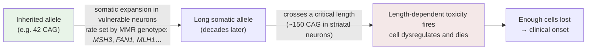

# D3 — Repeat-expansion disorders

> **Before this:** [Ch 07 The genetic code](../part-01-molecular-foundations/07-genetic-code-and-translation.md) · [Ch 11 Beyond Mendel](../part-02-transmission-genetics/11-beyond-mendel.md) · [Ch 15 Pedigrees](../part-02-transmission-genetics/15-pedigrees.md) · [Ch 16 Mutation](../part-03-genome-instability/16-mutation.md) · [Ch 54 Rare variants and Mendelian disease](../part-11-human-and-statistical-genomics/54-rare-variants-and-mendelian-disease.md) · **Time:** ~60 min
>
> **Statistics needed:** [S2 Distributions](../part-S-statistics/S2-distributions.md) ·
> [S4 Hypothesis testing](../part-S-statistics/S4-hypothesis-testing.md) ·
> [S5 Variance and regression](../part-S-statistics/S5-variance-and-regression.md)
>
> **Track note:** part of the SCA12 specialisation ([D1](D1-neurons-and-the-cerebellum.md) · [D2](D2-kinases-phosphatases-and-pp2a.md) · [D4](D4-sca12-from-repeat-to-phenotype.md) · [D5](D5-sca12-population-clinic-therapy.md)); read after D1 and D2.

## What you'll be able to do

- Classify any repeat-expansion disorder by its **mechanism class** — coding polyglutamine, silencing, transcriptional blockade, RNA gain-of-function, RAN translation, regulatory mis-setting — from nothing but the motif and its genomic location, and say which classifications that rule of thumb gets wrong.
- Explain why a repeat tract in a neuron that will never divide again can still expand, and why the bias is towards *expansion* rather than contraction.
- Reconstruct the argument of the Huntington disease onset-modifier GWAS — a genome-wide association study run on a fully Mendelian disease — and say what it means that every replicated modifier locus is a DNA-repair gene.
- Distinguish an intermediate allele, a premutation and a reduced-penetrance allele, with the canonical example of each, and say what each one means for the carrier versus for the carrier's children.
- State what anticipation is quantitatively, which disorders show a parent-of-origin asymmetry in which direction, and why the ascertainment-bias objection was methodologically correct even though it turned out to be wrong.
- Explain why this entire disease class was invisible to the short-read diagnostic pipeline of [Ch 54](../part-11-human-and-statistical-genomics/54-rare-variants-and-mendelian-disease.md) — not missed, but *invisible by construction* — and what replaced guesswork.
- Read a pedigree with molecular repeat sizes on it and infer instability, transmission bias and risk, including the risks the sizing data cannot give you.

## The core idea

[Ch 16 §9](../part-03-genome-instability/16-mutation.md) gave you the seed of this chapter in one section: slippage at a tandem repeat, a threshold beyond which the tract becomes unstable, a positive feedback in which the mutation rate is a function of the current allele length. Four diseases fitted in one table. This chapter is what that section grows into when you give it room, because the four-row table is the trailer for one of the strangest and most instructive corners of human genetics: several dozen diseases, most of them neurological, all caused by the same *kind* of mutation — a run of a short motif that got longer — and yet running on molecular mechanisms so different that calling them one class is almost a pun.

Here is the tension to hold from the start. **The mutation is the same everywhere; the disease is decided by the address.** A CAG tract inside a reading frame becomes a run of glutamines in a protein, and the disease is a poisoned protein. The same CAG tract in an untranslated region becomes a run of CUGs or CAGs in an RNA that never meets a ribosome in the normal way, and the disease is a poisoned RNA — or no RNA at all, or too much of one. One chemistry of instability, and at least six distinct molecular crimes across the class — three of them from the CAG motif alone — depending on where in the gene the tract happens to sit. Position, not motif, is destiny — and the disorder this track is heading towards, SCA12, is the awkward case that proves it: a CAG expansion that causes a dominantly inherited ataxia *without the repeat being translated as part of the* PPP2R2B *reading frame*, because it sits in the 5′ regulatory region of the gene, upstream of the transcription start site ([Ch 05 §6](../part-01-molecular-foundations/05-transcription.md) for what a transcription start site and a pre-initiation complex actually are).

The second theme is that a repeat allele is not a fixed thing you inherit and keep. It is a **process**. It changes between generations — that is anticipation, and you have met it in [Ch 11 §11](../part-02-transmission-genetics/11-beyond-mendel.md). What Ch 11 could not tell you is that it also changes *within you*, tissue by tissue, cell by cell, across your lifetime — and that the best current evidence says this ongoing somatic expansion is not a curiosity but the disease clock itself.

> **A threshold is a convention, not a constant.** Every "pathogenic threshold" in this chapter is a clinical-laboratory convention — a line drawn through messy data, revised whenever someone reports a shorter allele in a symptomatic person. Three of the thresholds below moved within the last decade and are still moving. Whenever this chapter states one, it states whose it is. A course that reports a threshold as though it were the mass of the electron is teaching a convention as a measurement.

---

## 1. The taxonomy: organising the zoo by mechanism

Do not memorise the tables that follow. Read them the way you would read a well-organised codebase: the organising principle is the content. The principle here is **mechanism class**, and there are six of them — I, II, II′, III, IV and V, where II′ is a variant on its neighbour and V is the awkward case this track is heading towards.

### 1.1 Class I — coding repeats: the polyglutamine (and polyalanine, and polyglycine) disorders

The repeat is inside an exon, in frame, and is translated. CAG reads as glutamine, so an expanded CAG tract becomes an expanded polyglutamine (polyQ) tract in the protein, which misfolds and aggregates — a gain of toxic function ([Ch 08 §10](../part-01-molecular-foundations/08-proteins-and-gene-function.md) gives the loss/gain/poison framework; [Ch 08 §8](../part-01-molecular-foundations/08-proteins-and-gene-function.md) the folding background).

All values are **repeat units, not base pairs** — a 40-repeat CAG allele is 120 bp of tract. Thresholds are from GeneReviews (fetched 2026-08-25) via [`reference/verified-facts.md`](../reference/verified-facts.md), except SCA17 (secondary read of NBK1438), SCA4 (*Nat Genet* 2024 and STRipy) and OPMD (STRipy only) — the last three are corroborated-secondary and are stated as approximate; MOI = mode of inheritance.

| Disorder | Gene | Motif | Location | Normal | Intermediate / reduced penetrance | Pathogenic | MOI |
|---|---|---|---|---|---|---|---|
| Huntington disease (HD) | *HTT* | CAG | coding, exon 1 | ≤26 | 27–35 intermediate; 36–39 reduced penetrance | ≥40 | AD |
| SBMA (Kennedy disease) | *AR* | CAG | coding | ≤34 | 35 uncertain; 36–37 reduced penetrance | ≥38 | XL |
| DRPLA | *ATN1* | CAG | coding | 6–35 | 35–47 | 48–93 | AD |
| SCA1 | *ATXN1* | CAG | coding | 6–35 uninterrupted, or 36–44 *with* CAT interruptions | 36–38 uninterrupted mutable | 39–44 uninterrupted (46–70 reported) | AD |
| SCA2 | *ATXN2* | CAG | coding | ≤31 | 32 unclassifiable; 33–34 at risk | ≥35 | AD |
| SCA3 (Machado–Joseph) | *ATXN3* | CAG | coding | 12–44 | 45–59 | ~60–87; smallest full-penetrance allele **not well defined** | AD |
| SCA6 | *CACNA1A* | CAG | coding, 3′ end | ≤18 | 19 uncertain | 20–33 | AD |
| SCA7 | *ATXN7* | CAG | coding | 7–27 | 28–33 mutable; 34–36 reduced penetrance | 37–460 | AD |
| SCA17 | *TBP* | CAG/CAA | coding | 25–40 | 41–48 reduced penetrance | ≥49 | AD |
| SCA4 (2024) | *ZFHX3* | GGC → polyglycine | coding | 14–31 | — | ≥42 | AD |
| OPMD | *PABPN1* | GCG → polyalanine | coding | 6 | — | ≥7 | AD/AR |

Three things to notice before moving on. First, the polyQ ataxias and HD are clinically different diseases attacking different neurons — HD the striatum, the SCAs the cerebellum — from what is superficially the same mutation in different genes; selective vulnerability is [D1](D1-neurons-and-the-cerebellum.md)'s subject. Second, SCA4 joined this table in 2024: a *GGC* expansion translated as poly**glycine**, a whole new chemistry, solving a locus mapped since the 1990s — the table is not closed. Third, SCA6 is the standing exception to nearly every generalisation in this chapter: its pathogenic range (20–33) overlaps the *normal* range of most other polyQ genes, and anticipation is effectively absent — GeneReviews states plainly that expansions are not commonly observed in parent-to-child transmission. Whatever makes CAG unstable, it is not the CAG alone; the flanking context of each locus matters, and SCA6 is the locus that proves it.

### 1.2 Classes II–V — non-coding repeats: the same mutation, four other crimes

When the repeat sits outside the reading frame, it cannot make a polyQ protein — but it is not thereby harmless. It simply commits different crimes.

| Class | The crime | Type specimen | How it works, in one line |
|---|---|---|---|
| II | **Loss of function via silencing** | Fragile X syndrome (*FMR1*) | The expanded CGG (>200) becomes hypermethylated; the gene is transcriptionally silenced |
| II′ | **Loss of function via transcriptional blockade** | Friedreich ataxia (*FXN*) | The expanded GAA forms triplex/R-loop structures and repressive chromatin that block elongation |
| III | **RNA gain-of-function** | Myotonic dystrophy type 1 (*DMPK*) | The expanded CUG RNA accumulates in nuclear foci and sequesters splicing factors |
| IV | **RAN translation** | C9orf72 ALS/FTD | The repeat RNA is translated *without a start codon*, in multiple frames, into aggregating dipeptide-repeat proteins |
| V | **Regulatory mis-setting** | **SCA12 (*PPP2R2B*)** | The repeat sits in the 5′ regulatory region and changes how much of the gene is expressed |

And the loci, with thresholds:

| Disorder | Gene | Motif | Location | Normal | Intermediate / premutation | Pathogenic | MOI |
|---|---|---|---|---|---|---|---|
| DM1 | *DMPK* | CTG | 3′ UTR | 5–34 | 35–49 premutation | >50; congenital usually >1,000 | AD |
| DM2 | *CNBP* | CCTG | intron 1 | ≤30 uninterrupted | ~30–54 mutable; ~55–74 uncertain | ~75–11,000 (mean ~5,000) | AD |
| Fragile X (FXS) | *FMR1* | CGG | 5′ UTR | ~5–44 | 45–54 grey zone; 55–200 premutation | >200 + methylation | XL |
| FXTAS | *FMR1* | CGG | 5′ UTR | — | **the 55–200 premutation *is* the disease allele** | the full mutation does **not** cause FXTAS | XL |
| Friedreich ataxia | *FXN* | GAA | intron 1 | 5–33 | 34–65 mutable normal | 66–~1,300 | **AR** |
| C9orf72 ALS/FTD | *C9orf72* | GGGGCC | intron 1 / promoter region | 2–24 | 25–60 uncertain | 61–>4,000, age-dependent reduced penetrance | AD |
| SCA8 | *ATXN8OS*/*ATXN8* | CTG·CAG | 3′ UTR of one gene, sense ORF of the overlapping gene | 15–50 | 51–70 unclear | 54–250 typical; 71–>1,300 in affected **and unaffected** | AD, markedly reduced penetrance |
| SCA10 | *ATXN10* | ATTCT | intron 9 | 10–32 | 280–850 reduced penetrance | 800–4,500 | AD |
| **SCA12** | ***PPP2R2B*** | CAG | **5′ region / probable promoter, ~133 nt upstream of the reported TSS (5q32)** | 4–32 | 43–50 argued pathogenic | ≥51 classical convention; **≥43 argued** — contested | AD |
| SCA27B | *FGF14* | GAA | deep intron 1 | 8–249 | 250–300 reduced penetrance | ≥300 | AD |
| SCA31 | *BEAN1* | (TGGAA)n insertion | intron | 0 TGGAA | — | insertion ≈ 2.5–3.8 kb (~500–760 pentamers) | AD |
| SCA37 | *DAB1* | (ATTTC)n inserted inside (ATTTT)n | intron | 0 ATTTC | — | (ATTTC)₃₁–₇₅ | AD |
| CANVAS | *RFC1* | AAGGG replacing reference AAAAG | intron 2 | (AAAAG)n benign at any length | — | biallelic (AAGGG)₄₀₀–₂₀₀₀₊ | **AR** |
| FAME/BAFME | *SAMD12* and 5 other genes | (TTTCA)n inserted inside (TTTTA)n | intron | 0 TTTCA | — | locus-specific | AD |

The last four rows are a different kind of mutation again: in SCA31, SCA37, CANVAS and the familial myoclonic epilepsies, the pathogenic event is not that an existing repeat got longer but that a **new motif appeared inside or in place of a benign one** — (ATTTC)n inserted inside an (ATTTT)n tract, AAGGG replacing AAAAG. The reference motif is harmless at essentially any length; the variant motif is the disease. Motif *identity*, not motif length, is the mutation. Keep that in mind when you meet the repeat callers in [lab 11](../labs/lab-11-repeat-genotyping.md) — a tool that reports only a length at these loci has missed the variable that matters.

### 1.3 Location is destiny: hold the motif fixed, vary the address

Now collapse the two tables along a single axis — hold the motif fixed and vary the address:

| Locus | Motif | Where the repeat sits | What the expansion does |
|---|---|---|---|
| *HTT* | CAG | coding exon 1 | Translated → polyQ protein gain of function, aggregation |
| *ATXN8OS*/*ATXN8* | CTG·CAG | 3′ UTR of one gene *and* sense ORF of the overlapping gene | CUG RNA gain of function *and* polyQ *and* RAN products — one repeat, three products |
| *DMPK* | CTG | 3′ UTR | Untranslated CUG RNA → nuclear foci → splicing factor sequestration |
| ***PPP2R2B*** (SCA12) | CAG | 5′ region, ~133 nt upstream of the TSS | **No polyQ from the *PPP2R2B* reading frame.** A *cis*-regulatory element that alters *PPP2R2B* expression — but see §6.6, which is less tidy than this row |
| *FXN* | GAA | intron 1 | Triplex/R-loop → transcription blocked → **loss** of frataxin |
| *FGF14* (SCA27B) | GAA | deep intron 1 | Reduced *FGF14* RNA and protein — same motif and direction as FRDA, different gene, dominant |
| *FMR1* | CGG | 5′ UTR | **Two diseases from one repeat, decided by size**: 55–200 → toxic RNA + RAN product (FXTAS); >200 → methylation and silencing (FXS) |

Note that CAG and CTG are the same repeat read from opposite strands — *HTT*'s CAG and *DMPK*'s CTG are one chemical entity in two genomic contexts. And read the *FMR1* row twice, because it makes the location principle's companion point from the other side: identical motif, identical position, different *size* — and the mechanism flips from RNA toxicity to transcriptional silencing as the tract grows past ~200. Size does not just tune severity; past a point it changes which disease you have.

**The SCA12 hook, in one sentence:** *HTT* and *PPP2R2B* both carry an expanded CAG, but *HTT*'s is inside the reading frame and *PPP2R2B*'s is ~133 nucleotides upstream of the transcription start site — so one disease is a poisoned protein and the other is a mis-set dial on a phosphatase regulatory subunit. That dial, and what it controls, is [D2](D2-kinases-phosphatases-and-pp2a.md)'s and [D4](D4-sca12-from-repeat-to-phenotype.md)'s territory. What matters here is that SCA12 does not fit cleanly into *any* of classes I–IV, and the field's uncertainty about its threshold (§4) is partly a symptom of that mechanistic homelessness.

### 1.4 Whose threshold? Where the sources disagree

Compare two curated sources for the same loci — GeneReviews chapters against the STRipy STR database, both read on the same day (2026-08-25) — and the boundaries move:

| Locus | STRipy says | GeneReviews says | What to conclude |
|---|---|---|---|
| *ATXN7* (SCA7) | pathogenic ≥36 | reduced penetrance 34–36, full ≥37 | 34–36 is a genuine grey zone |
| *ATXN3* (SCA3) | pathogenic ≥56 | "smallest full-penetrance allele is not well defined" | The floor is *unknown* — not 56, and not 60 |
| *C9orf72* | pathogenic ≥24 | normal 2–24, uncertain 25–60, pathogenic ≥61 | A 37-repeat-wide disagreement at the decisive boundary |
| *AR* (SBMA) | pathogenic ≥40 | ≥38 | Two repeats apart, exactly where a diagnosis is made |
| ***PPP2R2B*** (SCA12) | pathogenic ≥51 | *(chapter NBK1202, last updated 2011, retired 2018; while current it gave ≥51 as diagnostic — and said in the same breath that the threshold itself was "not clear")*; Srivastava et al., *Brain* 2017 argue ≥43 | **The authority withdrew; the field has not converged. This is D4's opening problem** |

This is not sloppiness to be cleaned up; it is what the underlying biology looks like. Penetrance falls off continuously with repeat length ([Ch 11 §8](../part-02-transmission-genetics/11-beyond-mendel.md)), instability rises continuously, and any line drawn through two continuous functions is a decision, not a discovery. It is also why the ACMG framework of [Ch 55](../part-11-human-and-statistical-genomics/55-clinical-variant-interpretation.md), built for variants that are present or absent, fits this disease class so awkwardly — a theme [D5](D5-sca12-population-clinic-therapy.md) returns to.

---

## 2. Instability mechanics: beyond slippage

[Ch 16 §9](../part-03-genome-instability/16-mutation.md) gave you slippage and the positive feedback; this section is what it left out. Take the slippage mechanism as read — misalignment of repetitive strands during synthesis — and ask the two questions Ch 16 could not answer: *why do some motifs expand and not others*, and *how does a repeat expand in a cell that never replicates its DNA again?*

### Why motifs differ: secondary structure

The unifying model (Pearson, Edamura & Cleary, *Nat Rev Genet* 2005) is that repeat tracts are unstable because the transiently single-stranded DNA generated during replication, repair, transcription and recombination can **misalign and fold**. A folded intermediate that survives to the next round of synthesis is copied as a length change. What differs between motifs is *what* they fold into:

| Motif | Structure formed | Consequence |
|---|---|---|
| CAG·CTG | **Hairpins** (imperfect — one mismatch per repeat unit) | Slipped-strand intermediates; substrate for MutSβ (§3); expansion-biased |
| CGG·CCG | Hairpins **and G-quadruplexes**; heavily methylatable CpG content | Replication stalling; once expanded, heterochromatin and silencing |
| GAA·TTC | **Intramolecular triplex (H-DNA)**, "sticky DNA", R-loops | Blocks *transcription elongation*, not just replication |
| GGGGCC | **DNA and RNA G-quadruplexes**, RNA·DNA hybrids | Length-dependent accumulation of abortive transcripts; nucleolar stress (Haeusler et al., *Nature* 2014) |

> **The load-bearing contrast.** CAG folds into a hairpin, which is a *replication-and-repair* problem, and the diseases that follow are mostly gain-of-function — a poisoned protein or RNA. GAA folds into a triplex and R-loop, which is a *transcription* problem, and the diseases that follow are loss-of-function — the gene cannot be read. Same "trinucleotide repeat disorder" heading; two different molecular crimes, and you can predict which from the physical chemistry of the fold. For GAA the correlation is strikingly tight: the repeat length that inhibits transcription in vivo and in vitro (>59 units) is the length at which the tract adopts the sticky-DNA conformation.

The structure column also explains the thresholds. A hairpin or triplex needs a minimum tract length to be thermodynamically stable; below it, slippage still happens (that is the ordinary microsatellite polymorphism of [Ch 16](../part-03-genome-instability/16-mutation.md)) but the fold that *protects* a slipped intermediate from correction cannot form, so changes stay at ±1 unit. The threshold in the disease tables is, to a first approximation, the length at which the escape structure becomes stable — and the positive feedback begins.

### Germline versus somatic instability: two clocks

The distinction of [Ch 16 §1](../part-03-genome-instability/16-mutation.md) — germline versus somatic — now pays off twice over, because repeat instability runs on both clocks and they answer different questions:

- **Germline instability** is measured *between generations*. It is what changes the allele your child inherits relative to yours, it is motif- and parent-of-origin-specific (§5), and it is the substrate of anticipation.
- **Somatic instability** is measured *within one person*. The repeat length in your blood, your liver and your neurons diverges over your lifetime — you are a mosaic of repeat lengths, and the mosaic is not random. In HD, the CAG tract undergoes progressive length increases over time **preferentially in the brain regions that degenerate** (Swami et al., *Hum Mol Genet* 2009) — and, in that study of human HD brain, longer somatic expansions were associated with *earlier* onset.

That last clause should stop you. It suggests somatic expansion is not a side effect of disease but a cause — a suggestion §3 will make precise.

### The postmitotic puzzle: expansion without replication

Here is the puzzle stated plainly: a striatal or cerebellar neuron ([D1](D1-neurons-and-the-cerebellum.md)) is postmitotic. It exited the cell cycle before you were born and will never pass a replication fork over its genome again. Slippage-during-replication *cannot* be how its repeats change. Yet they do — and they change in the most expansion-biased way of any tissue. The resolution is that the instability engine in neurons is **repair, not replication**. Two mechanisms are on the table, and they are not mutually exclusive:

1. **Oxidative-damage-initiated base excision repair.** Kovtun et al. (*Nature* 2007) showed that OGG1 — the glycosylase that excises the oxidised base 8-oxoguanine — initiates age-dependent CAG expansion in somatic cells. The proposed "toxic oxidation" cycle: oxidative damage lands in the repeat; OGG1 excises the lesion; the repair gap is filled by strand-displacement synthesis that captures a hairpin; the tract is now longer, and a longer tract is a bigger target for the next oxidative hit. An escalating cycle, running on nothing but ordinary metabolism and repair — which is why it runs perfectly well in a neuron, and why it accelerates with age.
2. **Mismatch repair gone wrong** — the engine of §3.

Both mechanisms are biased towards **addition**, for a structural reason worth internalising: the intermediate that gets fixed into the genome is an *extra* loop of DNA stabilised as a hairpin, not a missing one. Repair that resolves the intermediate in favour of the loop adds repeats. The neuron's repeat tract is a ratchet, and repair is the pawl.

---

## 3. The mismatch-repair engine

This section is one of modern human genetics' best stories, and it is worth telling in the order it happened, because the order is the argument.

### The strange GWAS

Huntington disease is as Mendelian as a disease gets: one gene, one mutation type, dominant, fully penetrant at ≥40 repeats. There is nothing for a genome-wide association study to find about *whether* you get it. But CAG length only partially predicts *when* — it accounts for roughly 50–70% of the variance in onset age, the exact figure depending on cohort and model (GeneReviews says "up to 70%"; the GeM-HD 2019 cohort estimate is ~57–60%), and an estimated 10–20% of the residual variability is itself heritable. Somewhere in the genome are common variants that shift the onset of a Mendelian disease. So the GeM-HD Consortium ran a GWAS — the machinery of [Ch 51](../part-11-human-and-statistical-genomics/51-gwas.md), applied not to case–control status but to *residual onset age* among people who all carry the mutation.

The 2015 result (*Cell* 2015): a locus on chromosome 15 carrying **two independent signals in opposite directions** — one hastening onset by 6.1 years, one delaying it by 1.4 — a locus on chromosome 8 hastening onset by 1.6 years, and association at *MLH1*, with pathway analysis pointing at DNA handling and repair.

The 2019 result (*Cell* 2019, 9,064 HD subjects) turned a hint into a list, and the list is the point. The replicated modifier loci carry, gene after gene: ***FAN1*** (the top locus), ***MSH3***, ***PMS1***, ***MLH1***, ***PMS2***, ***LIG1***. Look at that list with [Ch 17 §5](../part-03-genome-instability/17-dna-repair.md) open. It is not a list of neuronal genes, synaptic genes or protein-quality-control genes. **It is the mismatch-repair pathway**, plus a nuclease that regulates it. The genome, asked an open-ended question about what controls HD onset, answered: the machinery that decides whether repeat tracts grow. (Several loci carry multiple independent haplotypes acting in opposite directions — some hastening, some delaying — exactly what you would expect if repair activity is a dial that population variation turns both ways. The per-haplotype effect sizes in years are published in the 2019 paper's Table 1, but this course has not verified them line-by-line and will not quote numbers it has not checked; the 2015 figures above are the ones verified here.)

### The mechanism: MutSβ as an accomplice

Why would *mismatch repair* — the pathway that protects you from microsatellite instability in [Ch 17](../part-03-genome-instability/17-dna-repair.md) — *drive* repeat expansion? Because the CAG hairpin is a trap for it.

MutSβ is the MSH2–MSH3 heterodimer, the loop-recognising arm of MMR — the one that normally handles small insertion/deletion loops. Its failure mode on disease-length repeats, as currently understood:

- MutSβ **binds the CAG/CTG hairpin but cannot process it properly**: on (CAG)₁₃ and (CTG)₁₃ hairpins its ATP hydrolysis is reduced, so the reaction stalls at recognition instead of proceeding to excision. The hairpin is *protected* rather than removed.
- MutSβ physically recruits **DNA polymerase β** to the hairpin and stimulates its *retention*: Polβ extends from the hairpin, locking the extra repeats in (Zhao et al., *Cell Res* 2016).
- Stoichiometry sets the dial: MSH3 competes with MSH6 for MSH2, so when MSH3 is abundant the balance tips from MutSα towards MutSβ — and towards expansion. That is precisely the axis the *MSH3* modifier haplotypes from the GWAS sit on.

FAN1 is the counterweight — a nuclease that opposes expansion, reported both to control MMR complex assembly at the repeat via MLH1 retention and to process and pause on slipped-DNA structures. The top HD-modifier locus in the genome, *FAN1*, is the brake on the expansion engine. The circle closes.

> **Read the logic of this argument, not just its conclusion.** No one hypothesised MutSβ into the GWAS. The GWAS was unbiased — millions of variants, no favourites ([Ch 51](../part-11-human-and-statistical-genomics/51-gwas.md)) — and it *converged* on a pathway that mechanistic work (in mice and cells, largely done earlier and separately) had implicated. Two independent lines of evidence meeting at the same pathway is how you know you are near the machine, and it is a far stronger epistemic position than either line alone.

### The two-step model of onset

Put §2 and §3 together and a model assembles itself:



**Step 1:** the inherited allele expands somatically in vulnerable neurons — slowly, over decades, at a rate set by the person's DNA-repair genotype. **Step 2:** once a given cell's tract crosses a critical threshold, a toxic mechanism (§6) fires in that cell and it dies. Onset is then set by the *rate of somatic expansion*; the inherited length matters chiefly because it sets how far each cell has to travel.

The strongest current evidence is single-cell: Handsaker et al. (*Cell* 2025) measured repeat lengths cell-by-cell in postmortem HD brain and found that **striatal projection neurons — precisely the cells HD kills — carry frequent somatic expansions of the disease allele, while most other cell types show limited somatic variation**. The transcriptional collapse begins at around **150 CAG**: cells below it look essentially normal, cells beyond it lose their identity. On the authors' reading, neurons spend the great majority of life expanding quietly below threshold, and only a short final phase above it. Two honest caveats, because this is a fast-moving front: the ~150 figure is corroborated by multiple independent reports of the paper but the claim that crossing it is "necessary and sufficient" is the authors' claim about one cell type, not yet a field-wide consensus about the whole disease; and whether somatic expansion is the *entire* story of onset — rather than the dominant term — is exactly what is being tested now.

If the model is even approximately right, the therapeutic implication is startling: **you would not need to touch the toxic mechanism at all — slow the expansion engine, and you delay onset of every downstream event, whatever the toxic mechanism turns out to be.** *MSH3* is the obvious dial to reach for: the GWAS has already shown that naturally occurring variation in it shifts onset. That idea, and what it might mean for SCA12 specifically, is planted here and harvested in [D5](D5-sca12-population-clinic-therapy.md).

---

## 4. Thresholds, premutations, intermediate alleles and penetrance

Three different concepts hide under the word "borderline", and conflating them causes real counselling errors. Learn them as a triple with a canonical example each:

1. **Intermediate (mutable-normal) allele** — does not cause the classical disease in the carrier, but is meiotically unstable, so the carrier's **children** are at risk of inheriting an expansion. Canonical: **HD 27–35 CAG**; also DM1 35–49, SCA1 36–38 uninterrupted, *FMR1* 45–54. The risk belongs to the next generation, not the person in front of you.
2. **Premutation with its own phenotype** — not the disease allele for the classical disorder, but pathogenic in its own right, causing a *different* disease. Canonical: ***FMR1* 55–200**, which causes FXTAS (a late-onset tremor/ataxia syndrome) and FXPOI — by a toxic-RNA mechanism the full mutation *cannot* use, because the full mutation is methylated and silent (§6). "Premutation" is a historical name and a misleading one: for FXTAS it is simply the mutation.
3. **Reduced-penetrance allele** — genuinely disease-causing, but not everyone who carries it manifests within a lifetime. Canonical: **HD 36–39 CAG**.

### The HD 36–39 range, in numbers

This is the canonical reduced-penetrance range in all of human genetics, and its numbers repay staring at (all from GeneReviews NBK1305 via [`reference/verified-facts.md`](../reference/verified-facts.md)):

| Quantity | Value |
|---|---|
| Reduced-penetrance range | 36–39 CAG |
| Lifetime penetrance of a 36–38 allele | approximately **0.2%–2%** |
| Frequency of ≥36 CAG alleles, European-ancestry populations | as many as **1:400** — the majority being 36–39 |
| Clinical prevalence of HD, European ancestry | **9.71 : 100,000** (up to 17 : 100,000 with multi-source ascertainment) |
| Clinical prevalence, East Asian and African populations | 0.1–2 : 100,000 |

Now do the division. Roughly **1 in 400** people of European ancestry carries an *HTT* allele in the disease-causing range, against a disease prevalence of roughly **1 in 10,000** — a ~25-fold gap, and nearly all of it is 36–39-repeat alleles that never declare themselves. The same shape recurs in SBMA: clinical prevalence ~1:300,000 males, yet **1 in 6,887 males** carries a pathogenic *AR* expansion. Hold this against [Ch 54 §11](../part-11-human-and-statistical-genomics/54-rare-variants-and-mendelian-disease.md): penetrance estimated in clinically ascertained families is always an overestimate of penetrance in the population, and repeat disorders exhibit the gap in its purest form. If population screening ever reports "HD mutation carrier" from biobank-scale data, the majority of the people so labelled — mostly 36–39 carriers — will die of something else, never knowing.

Two more entries for your collection of penetrance shapes: ***C9orf72*** expansions show *age-dependent* reduced penetrance even at frankly pathogenic sizes; and **SCA8** shows reduced penetrance **at all sizes** — alleles from 71 to over 1,300 repeats occur in affected and unaffected people alike, which is as strong a warning as exists against reading a repeat size as a verdict.

### Interruptions: the hidden variable under every threshold

Every threshold above is really a threshold on **uninterrupted** repeat length. A repeat tract broken by occasional variant units is chemically a different object — the interruption breaks the register of the hairpin or triplex — and both stability and pathogenicity follow the pure tract, not the total:

| Locus | Interrupting unit | Effect |
|---|---|---|
| *ATXN1* | CAT | Stabilises: a 36–44 allele **with** CAT interruptions is normal; the same length **without** is mutable or pathogenic |
| *HTT* | CAA (the CAACAG) | Loss of the CAACAG → onset *earlier* than the glutamine count predicts; a CAACAG duplication — *more* glutamines — → onset **later** (GeM-HD 2019) |
| *ATXN2* | CAA | Codes glutamine too, so does not reduce pathogenicity — but may enhance meiotic stability |
| *FMR1* | AGG, normally every 9–10 CGG | Presence reduces the risk of maternal expansion to full mutation for alleles below ~100 repeats |
| *ATXN10* | ATCCT | Interrupted expansions associate with *more* seizures — and show anticipation with paradoxical repeat **contraction** |
| *RFC1* | motif substitution, not interruption | (AAAAG)n benign at any length; (AAGGG)n pathogenic — the "interruption" is the whole mutation |

The *HTT* CAA row is the most beautiful natural experiment in the field, and §6 will lean on it. For now, note the practical consequence: two alleles that an electrophoresis-based assay calls "40 repeats" can differ in interruption structure and therefore in stability and effect — one reason sequence-level genotyping, not just sizing, is where [lab 11](../labs/lab-11-repeat-genotyping.md) is headed.

---

## 5. Anticipation, quantitatively

[Ch 11 §11](../part-02-transmission-genetics/11-beyond-mendel.md) defined anticipation and [Ch 16 §9](../part-03-genome-instability/16-mutation.md) made the ascertainment-bias caution — the objection was methodologically correct, it was raised by the right instinct, and only molecular measurement of repeat length settled it. Neither is repeated here; go back if the caution is not vivid. What this section adds is the quantitative structure.

### Repeat length versus onset: regressions, and their honest scatter

The relationship that rescued anticipation from the ascertainment-bias objection is the within-locus inverse correlation between repeat length and onset age. Its canonical quantitative form is the Langbehn model for HD (Langbehn et al., *Clin Genet* 2004): a parametric survival model fitted to 2,913 individuals from 40 centres, in which the probability of diagnosis by a given age is logistic conditional on CAG count, yielding onset-probability curves for CAG 36–56. The *shape* is what to carry: steeply falling and convex — each added repeat costs more years at the short end than the long end — and flattening above ~50 repeats. (The published coefficients are not reproduced here; if you need the curve, read them out of the paper rather than reconstructing them, because a misremembered survival coefficient in a counselling context is not a rounding error.)

But the correlation's *strength* varies enormously by locus, and the variation is informative:

| Locus | Length ↔ onset relationship |
|---|---|
| HD | CAG length explains ~50–70% of onset variance, cohort-dependent (§3) |
| SCA1 | 36–70% of onset variance — wide, and honestly reported as wide |
| SBMA | ~60% of clinical variability |
| **SCA12** | Pearson *r* = **−0.65**, *P* < 10⁻⁴, *n* = 124 unrelated patients (Srivastava et al., *Brain* 2017) — so *r*² ≈ 0.42: less than half the variance |
| FRDA | The *shorter* allele (GAA1) predicts onset: <700 repeats → mean onset 18 y; >700 → mean onset 9.7 y; <500 → onset after 25; <300 → onset after 40 |
| SCA31 | insertion length inversely correlated with onset |
| **DM2** | **no significant correlation at all** between CCTG size and onset or severity — the standing counterexample |

Note FRDA's twist: it is recessive, both alleles are expanded, and it is the *shorter* one that sets the phenotype — because the shorter allele sets the residual transcription of *FXN*, and the disease is loss-of-function (§6). The regression you fit follows from the mechanism class. And keep DM2 pinned where you can see it: a repeat disorder with a pathogenic range spanning more than two orders of magnitude (75 to 11,000) and *no* length–severity correlation, with anticipation not confirmed. Any story you tell about repeat length must survive DM2 (statistical footing for these correlations: [S4](../part-S-statistics/S4-hypothesis-testing.md) for what the *P*-value does and does not license, [S5](../part-S-statistics/S5-variance-and-regression.md) for reading *r*²).

### Parent-of-origin asymmetries, and the gametogenesis logic

Anticipation is not symmetric in the transmitting parent, and the direction flips by locus:

| Disorder | Bias | The numbers |
|---|---|---|
| HD | **Paternal** | Anticipation far more common in paternal transmission; large expansions (>7 CAG) almost exclusively paternal |
| DRPLA | **Paternal ≫ maternal** | Offspring onset ~26–29 y earlier than affected fathers; ~14–15 y earlier than affected mothers |
| SCA2 | **Paternal** | Large expansions almost exclusively through the paternal germline |
| SCA7 | **Paternal**, dramatically | Infantile-onset cases at 200–400 repeats from affected fathers |
| SCA1 | **Paternal** for expansion | Contractions more typical of *maternal* transmission |
| DM1 | **Both, differently** | Congenital DM1 is most often *maternally* inherited — yet paternally transmitted expansions are *larger* (median +425 repeats, range 70–2,000, vs maternal median +200, range 57–1,400) |
| SCA8 | **Maternal** — the reversal | Expands maternally; tends to *contract* paternally, often into the reduced-penetrance range |
| *FMR1* | **Maternal only** | Expansion to full mutation occurs only through the mother |
| SCA6 | none | Anticipation not observed |
| DM2 | none confirmed | — |
| C9orf72 | **disputed** | Reported and contested; confounded by observation bias and by the difficulty of sizing the repeat in blood |

The first-order logic comes straight from [Ch 09](../part-02-transmission-genetics/09-mitosis-and-meiosis.md): spermatogenesis is continuous — spermatogonia keep dividing from puberty onwards, stacking up replication opportunities per transmitted genome — while oogenesis completes its replications before the mother's birth and the oocyte then waits, arrested, for decades. More replication, more slippage opportunity: hence the paternal expansion bias at most CAG loci, and it is the same asymmetry that makes new point mutations predominantly paternal ([Ch 16 §7](../part-03-genome-instability/16-mutation.md)).

But do not let the tidy logic own you, because the table refuses to obey it uniformly. Congenital DM1 comes through the *mother* despite paternal jumps being larger — the largest paternal alleles appear to be selected against somewhere in spermatogenesis or transmission, while the maternal germline (and possibly early embryo) permits the giant alleles. *FMR1* expands to full mutation *only* maternally. SCA8 inverts the rule entirely. And §2 told you that replication count cannot be the whole story anyway, since the most dramatic expansion environment in the body is a cell that never replicates. Parent-of-origin bias is real, quantitative and clinically decisive — a father with an *FMR1* premutation and a mother with the same allele give their children categorically different risks — but it is locus-specific empirical knowledge, not a law you can derive once and apply everywhere.

---

## 6. Toxicity mechanisms in depth: one crime per class, one type specimen each

Each mechanism class earns its place in the taxonomy through one disorder where the evidence is cleanest — the type specimen. Learn the specimen and the observation that established it, and you own the class.

### 6.1 Class I: the poisoned protein — HD

The expanded polyQ tract makes the protein aggregate: DiFiglia et al. (*Science* 1997) found huntingtin aggregated in neuronal intranuclear inclusions and dystrophic neurites in HD brain, and inclusions have been the visible signature of polyQ disease since. But the field's understanding has a sting in it. The GeM-HD 2019 CAA-interruption result (§4) showed that individuals with *more* glutamines but a shorter uninterrupted CAG tract have *later* onset than their glutamine count predicts — so **uninterrupted CAG length at the DNA level, not polyglutamine length at the protein level, determines onset timing**. The cleanest reading, via §3: the DNA tract length drives the somatic-expansion clock, and the protein's toxicity fires downstream once the clock runs out. Aggregation is real and replicated; what it *explains*, on its own, is smaller than it looks.

### 6.2 Class II: silencing — fragile X

Above ~200 CGG repeats, the *FMR1* tract and its surrounding promoter become hypermethylated and the gene is transcriptionally silenced: no mRNA, no FMRP protein, and the syndrome is a straight loss of function ([Ch 16 §9](../part-03-genome-instability/16-mutation.md) introduced this; the chromatin machinery is [Ch 22](../part-04-gene-regulation/22-eukaryotic-transcriptional-regulation.md)'s). The proof of the logic is the exception: the 55–200 premutation is *not* silenced — it is transcribed at **elevated** levels, 2–8-fold — and causes a completely different disease (FXTAS) via its RNA (§6.4) and a RAN product (§6.5). One locus, one motif; below ~200 a toxic-RNA disease, above it a silencing disease. The full mutation cannot cause FXTAS *because* it is silent. No single observation in this chapter separates "the repeat" from "what the repeat does" more sharply.

### 6.3 Class II′: transcriptional blockade — Friedreich ataxia

FRDA is loss-of-function by a different route: the expanded GAA tract does not silence *FXN* through methylation of a promoter so much as physically and epigenetically obstruct its *elongation* — repressive chromatin forms around the expanded repeat, and the triplex/sticky-DNA and R-loop structures of §2 interfere with transcription through the tract. Both mechanisms are stated side by side by GeneReviews; they are not competing so much as compounding. The consequences you can now predict rather than memorise: recessive inheritance (a partial loss needs both copies hit before the phenotype appears — and note the contrast with SCA27B, where a GAA expansion reducing *FGF14* expression is *dominant*, because different genes tolerate halving differently); and the shorter-allele regression of §5, because residual frataxin output is set by the less-blocked allele.

### 6.4 Class III: the poisoned RNA — myotonic dystrophy

DM1's expanded CUG RNA never leaves the nucleus normally; it accumulates in **foci** and recruits the muscleblind (MBNL) family of splicing regulators — Miller et al. (*EMBO J* 2000) showed MBNL proteins co-localising with the expanded-repeat transcripts. Sequestered MBNL cannot do its job, which is directing developmentally regulated alternative splicing ([Ch 06 §9](../part-01-molecular-foundations/06-rna-processing.md)); dozens of transcripts revert to fetal splice isoforms in adult tissue, and the multi-system phenotype — myotonia, cardiac conduction defects, cataracts — reads as a catalogue of mis-spliced targets. The clincher for the mechanism is DM2: a *different* motif (CCTG) in a *different* gene (*CNBP*) producing foci that sequester the *same* MBNL proteins — Miller et al. saw MBNL in DM2 foci too — and yielding an overlapping multi-system phenotype — myotonia, cataracts, cardiac conduction disease, insulin resistance — though not an identical one: DM2 is milder, proximally rather than distally weak, and has no congenital form. The shared agent is the sequestered factor, not the locus.

DM1 also supplied the observation that repeats refuse to stay in one gene's story: the CTG tract is transcribed from **both strands** — there is an antisense transcript across the repeat, with CTCF constraining it and the local heterochromatin (Cho et al., *Mol Cell* 2005). Bidirectional transcription at repeat loci turns out to be common ([Ch 24 §7](../part-04-gene-regulation/24-rna-based-regulation.md)) — *C9orf72*'s antisense transcript is also translated (§6.5), and bidirectional transcription has been reported at the SCA12 locus, a thread [D4](D4-sca12-from-repeat-to-phenotype.md) picks up. Stop thinking of a repeat as sitting inside one gene; think of it as a genomic address that several transcripts may cross.

### 6.5 Class IV: RAN translation — read honestly

In 2011, Zu, Ranum and colleagues reported something that contradicted the textbook definition of translation: expansion constructs expressed homopolymeric proteins — polyglutamine, polyalanine *and* polyserine, from the same CAG construct in different frames — **with no ATG start codon anywhere** (Zu et al., *PNAS* 2011). They named it repeat-associated non-ATG (RAN) translation. The expanded repeat's RNA structure itself appears to license initiation, in multiple frames, on sense and antisense transcripts alike.

Sit with why that was a shock, because the shock is the content. Eukaryotic initiation, as [Ch 07](../part-01-molecular-foundations/07-genetic-code-and-translation.md) sets out in its section on the ribosome and the translation cycle, is a **scanning** process: eIF4E binds the 5′ m⁷G cap, the small subunit loads at the extreme 5′ end of the message, and it travels along until it meets an AUG in good **Kozak** context — a purine at −3 and a G at +4 doing most of the work. Every part of that model makes a start site a property of *one position in one sequence*: a particular codon, plus a handful of flanking bases, met by a complex moving in one direction from one entry point. Ch 07 also gives you the model's two sanctioned ways to bend, and both are worth holding next to RAN translation. **Leaky scanning** past a weak-context AUG lets some complexes run on to a downstream AUG, yielding two N-terminal isoforms from one mRNA; **upstream ORFs** in the 5′ UTR capture scanning subunits and throttle the main ORF below them — which is also, incidentally, why a repeat tract sitting in a 5′ UTR was never expected to be translationally inert. But both of those bend only the rule about *which* AUG gets used. Neither touches the rule that initiation happens at an AUG at all, and that is the rule the 2011 constructs broke — in several frames at once, with no ATG anywhere in the construct to appeal to.

So what is the repeat doing to the scanning model? The honest answer comes first: no mechanism for RAN initiation is established, and this chapter will not manufacture one. What can be said is where the proposal comes from, and why the phrasing above — that the repeat's RNA structure *appears to license* initiation — is deliberately weak and should stay weak. §2's structural chemistry was about DNA, but the same motifs fold as RNA: CAG and CUG into hairpins, CGG and GGGGCC into G-quadruplexes. A scanning complex meeting a stable fold inside a 5′ UTR is not in the situation the clean-message model describes, and the multi-frame output is the part that no single, correctly-chosen start codon explains at all. What the fold actually does to the complex — stall it, hold it over the tract, or hand the message to a route that never scanned in the first place — is not settled. Grade the two claims separately, on the three-tier ladder this track uses ([D4](D4-sca12-from-repeat-to-phenotype.md)): that RAN products exist is **Established**; that a repeat's fold subverts cap-dependent scanning in order to make them is **Conjectured** — argued from adjacent facts, not measured. And whether any of it happens at the SCA12 locus, in which frames, and whether it happens anywhere outside a dish, is not settled in §6.6 below either — that is [D4](D4-sca12-from-repeat-to-phenotype.md)'s business, in its Hypothesis C section on RNA-level toxicity and RAN translation, where the SCA12 evidence is weighed frame by frame.

The famous case is *C9orf72*. The GGGGCC expansion — an intronic repeat, which classical logic says should produce no protein — yields **dipeptide-repeat proteins (DPRs)** from multiple frames, found as insoluble aggregates in patient CNS tissue by two independent groups in the same year (Mori et al., *Science* 2013: poly-GA most abundant, plus poly-GP and poly-GR; Ash et al., *Neuron* 2013). The antisense transcript is RAN-translated too, adding further DPR species. And FXTAS gets a RAN chapter of its own: the *FMR1* premutation's 5′ UTR yields **FMRpolyG**, toxic in cell and fly models.

Now the honest ledger, because RAN translation attracts more confidence than the evidence has yet earned:

- **Established:** RAN translation happens — in constructs, in cells, and the predicted products are physically present in patient tissue as aggregates, for *C9orf72* and FXTAS among others. The citations above are load-bearing and replicated.
- **Assumed, or still open:** how much of the *pathology* the RAN products cause. For C9orf72, GeneReviews lists three mechanisms side by side — haploinsufficiency (the expansion reduces *C9orf72* expression), RNA toxicity via sequestration (the G-quadruplex-rich transcripts and abortive products of §2), and DPR toxicity — and declines to adjudicate. That non-adjudication *is* the current state of the field, not a gap in the summary. Model systems can make each mechanism sufficient at sufficient dose; which dominates in patients, at patient doses, over patient decades, is unresolved.

A disease is allowed to run several mechanisms at once, and most of the non-coding disorders probably do. SCA8 is the compact demonstration: one locus expressing a CUG RNA from *ATXN8OS* (class III), a polyQ protein from the overlapping sense ORF of *ATXN8* (class I), and RAN products (class IV) simultaneously. The taxonomy of §1 classifies *mechanisms*, and diseases are free to subscribe to more than one.

### 6.6 Class V: the mis-set dial — where SCA12 will sit

The remaining class has one occupant, and it is ours — though "clean" is exactly the word it will not earn. In SCA12 the CAG tract sits ~133 nt upstream of the reported transcription start site of *PPP2R2B* — in cis-regulatory territory ([Ch 22 §2](../part-04-gene-regulation/22-eukaryotic-transcriptional-regulation.md)) — and the working model is that the expansion acts as a *cis* element that **alters the gene's expression** (with the evidence pointing towards *up*-regulation of at least some isoforms, plus reported bidirectional transcription at the locus). The picture is a promoter with its dial mis-set, feeding a different amount of a phosphatase regulatory subunit — B55β, the product of *PPP2R2B* — into neurons whose signalling depends on that dial ([D2](D2-kinases-phosphatases-and-pp2a.md)).

But keep the ledger honest, because "class V" is a slot in a taxonomy, not a certificate of exclusivity. What is *not* established for SCA12 is a polyQ tract from the *PPP2R2B* reading frame and methylation-driven silencing. What *is* now reported is more than the class-V label suggests: nuclear CAG RNA foci in patient iPSC-derived neural stem cells, sequestering a set of proteins that binds the expanded repeat and not the normal one; RAN translation at the locus in multiple frames, in cells and iPSC-derived neurons — polyglutamine and polyserine from the sense strand, polyalanine from the antisense *PPP2R2B-AS1* ORF, with the frames not yet reconciled between the two labs reporting them (Kumar et al., *iScience* 2024; Zhou et al., *Mov Disord* 2023). Neither has been demonstrated in SCA12 human brain, and the same iPSC work finds most *PPP2R2B* isoforms *down*-regulated in mature neurons, which cuts against the up-regulation model. So the working model is cis-regulatory mis-setting, and SCA12 may simultaneously be running class III and class IV mechanisms — which is exactly the multi-mechanism point §6.5 has just made for SCA8 and *C9orf72*, and is why this class is the one to hold most loosely. Which mechanism, if any, is the one that matters in a patient's cerebellum is precisely the business of [D4](D4-sca12-from-repeat-to-phenotype.md).

Here SCA12 completes the taxonomy in the weakest sense that is still true: the CAG motif alone has now been implicated in classes I, III (as CTG on the other strand), IV and V, which is the "location is destiny" principle with all its cards face-up — and a reminder that one address can be charged with more than one crime.

---

## 7. Why this class evaded the pipeline

[Ch 54](../part-11-human-and-statistical-genomics/54-rare-variants-and-mendelian-disease.md) walked you through the modern rare-disease pipeline — exome or genome, filter, match — and its §9 table of "where the undiagnosed cases go" contains one row that this chapter has been building towards:

> | Repeat expansions | Invisible by construction — the read is shorter than the repeat | Targeted repeat genotypers, long reads |

Sit with "invisible by construction". A 150-bp short read that starts inside a 900-repeat GAA tract contains nothing but GAA. It carries no unique sequence, aligns nowhere in particular or to the *reference-length* allele, and produces no variant call — not a wrong call, *no* call ([Ch 46 §10](../part-10-functional-genomics/46-variant-calling.md) gives the alignment logic; note also [Ch 46 §13](../part-10-functional-genomics/46-variant-calling.md): the benchmark truth sets used to validate pipelines *exclude* these regions from their confident intervals, so the pipeline's advertised accuracy was never measured where these diseases live). An expansion is not a needle in a haystack; it is a needle the detector was built not to register. A family could have exome sequencing, genome sequencing and a negative report, while carrying a mutation of a class known since 1991.

The consequences ran in both directions. Diagnostically, repeat disorders stayed on the candidate-gene treadmill — clinicians ordered locus-by-locus PCR tests guided by phenotype, which works only when the phenotype names the locus. And gene discovery stalled in the same blind spot: SCA27B — a deep-intronic GAA expansion in *FGF14*, reported in 2023 to be among the commonest causes of late-onset ataxia, found in 61% of French-Canadian index patients in the discovery cohort — and the *RFC1* expansions behind CANVAS, now implicated in 14–22% of adult-onset ataxia, both sat undiscovered through three decades of molecular ataxia genetics and fifteen years of short-read sequencing of exactly the right patients. The answer was in the DNA the whole time; the reads were too short to spell it.

What changed: long reads that span the tract entirely ([Ch 40 §3](../part-09-genomics/40-sequencing-technologies.md); [Ch 40 §10](../part-09-genomics/40-sequencing-technologies.md) is the platform-by-question logic this is a textbook case of) — sizing it directly, catching the interruption structure of §4, and even reading somatic mosaicism molecule-by-molecule — and, for the short-read archives, targeted repeat genotypers that recover expansion signal from read pairs and off-target repeat content rather than from alignment. Population-scale repeat calling is now turning the field from families to biobanks — repeat instability has recently been measured across roughly 900,000 biobank participants, including loci where inherited variants modulate somatic expansion, the §3 story at population scale. How all of these actually behave on real data — including the wet-lab methods (repeat-primed PCR, Southern blotting) that remain the clinical arbiters, and the ways each method fails — is [lab 11](../labs/lab-11-repeat-genotyping.md), which follows this chapter.

---

## Common misconceptions

| What people think | What's actually true |
|---|---|
| CAG expansion means a polyglutamine disease | Only if the tract is translated. The same motif causes RNA-mediated disease from a UTR (as CTG in *DMPK*, the same duplex read from the other strand) and expression-level disease from a promoter region (SCA12, ~133 nt upstream of the *PPP2R2B* TSS). Position, not motif, sets the mechanism (§1.3) |
| A person's repeat number is a single, fixed value | You are a mosaic. The tract expands somatically, tissue by tissue, throughout life — fastest in the vulnerable neurons themselves, where HD striatal projection neurons reach ~150 CAG from an inherited ~40. The number on a blood report is one tissue's snapshot, not *the* number (§2–3) |
| Anticipation means acquired severity is inherited | Nothing acquired is inherited. The DNA itself changes at gametogenesis — the child inherits a longer allele, which is a new (larger) mutation, not the parent's experience. [Ch 11](../part-02-transmission-genetics/11-beyond-mendel.md) made this point; the molecular sizing data settle it |
| Pathogenic thresholds are measured biological constants | They are laboratory conventions drawn through continuous penetrance data, they differ between authorities (*C9orf72*: "pathogenic" starts at 24 or at 61 depending on whom you read), and they move — SCA12's proposed floor shifted from 51 to 43 in 2017 and the field has not converged (§1.4, §4) |
| A premutation is a milder version of the disease allele | *FMR1* 55–200 causes a **different disease** (FXTAS), by a toxic-RNA and RAN mechanism the full mutation cannot use — the full mutation is silenced. "Pre-" describes the allele's future children, not its own effect (§4, §6.2) |
| Longer repeat always means earlier and worse disease | Within most loci, on average, yes — but DM2 shows *no* length–severity correlation across a 75–11,000 range, SCA8 alleles of all sizes occur in unaffected people, and SCA6 shows no anticipation. The regression is locus-specific, never universal (§5) |
| Repeats always expand through the father | HD, DRPLA, SCA2, SCA7: paternal, yes. But *FMR1* expands to full mutation only maternally, congenital DM1 is maternally transmitted, and SCA8 *contracts* paternally. The asymmetry is real but its direction is locus-specific empirical fact (§5) |
| Repeat diseases are dominant, gain-of-function conditions | FRDA and CANVAS are recessive loss-of-function; fragile X is a loss-of-function X-linked silencing disorder. The class spans every inheritance pattern and both signs of effect (§1) |
| Polyglutamine length determines HD onset | Uninterrupted **CAG length at the DNA level** does: alleles with a CAACAG duplication carry *more* glutamines yet later onset. The DNA tract drives the somatic-expansion clock; the protein is downstream (§3, §6.1) |
| A negative exome and genome rules out a Mendelian diagnosis | Repeat expansions are invisible to standard short-read calling *by construction* — the read is shorter than the repeat, and benchmark regions exclude these loci. A negative report is silent, not exculpatory, about this entire class (§7) |

## Worked example: reading a pedigree with sizing data on it

A family, written out in the house convention of [Ch 15](../part-02-transmission-genetics/15-pedigrees.md) (text, not drawn). An *HTT* CAG-repeat test has been run on blood-derived DNA for the individuals shown; allele sizes are repeat units, larger allele first.

```
Generation I
  I-1   male    onset of chorea age 63; died 71        41 / 17
  I-2   female  unaffected, died 84                    22 / 19

Generation II  (children of I-1 x I-2)
  II-1  male    onset age 45; now 58                   44 / 22
  II-2  female  unaffected at 66                       38 / 22

Generation III
  III-1 male    son of II-1; unaffected at 27          47 / 19
  III-2 female  daughter of II-2; age 40, declines
                testing; asks for risk figures         not tested
```

**Step 1 — classify every allele before interpreting anything.** Against the HD allele classes (normal ≤26; intermediate 27–35; reduced penetrance 36–39; full penetrance ≥40): the 17, 19 and 22 alleles are normal. I-1's 41 and II-1's 44 and III-1's 47 are full-penetrance HD alleles. II-2's 38 is a **reduced-penetrance** allele — disease-causing in class, with a lifetime penetrance of roughly 0.2–2%.

**Step 2 — trace the transmissions and read the instability.** The disease allele's path is I-1 → II-1 → III-1 and I-1 → II-2:

```
I-1 (41) --> II-1 (44)   +3    paternal transmission, expansion
I-1 (41) --> II-2 (38)   -3    paternal transmission, contraction
II-1 (44) --> III-1 (47) +3    paternal transmission, expansion
```

Both expansions are paternal, consistent with the HD paternal bias of §5 — but I-1 → II-2 is a paternal *contraction*, and it happened in the same germline that produced a +3 expansion. Instability is a distribution, not a rule ([S2](../part-S-statistics/S2-distributions.md)): the paternal bias shifts the mean of transmitted change upwards; it does not make every draw positive. One family is a handful of draws from that distribution, and this family happens to display both tails.

**Step 3 — the onset pattern, and what you may not conclude from it.** Onset 63 (41 repeats) → onset 45 (44 repeats) looks like textbook anticipation, and the direction matches the inverse length–onset correlation of §5. But two people are not a regression, and [Ch 16 §9](../part-03-genome-instability/16-mutation.md)'s ascertainment caution applies with full force to any single family that came to attention *because* a younger member presented early. What the molecular data add — and this is exactly what rescued anticipation historically — is the *mechanistic* observation: the repeat measurably grew, +3 and +3, along the transmissions. You may say: the substrate of anticipation is present and moving in this family. You may not say: this family demonstrates an onset trend with meaningful precision.

**Step 4 — III-1, the 27-year-old with 47 repeats.** His allele is fully penetrant; the Langbehn-type survival models of §5 (logistic in CAG, fitted on 2,913 individuals for CAG 36–56) would give his probability of onset by each age. We do not reproduce those coefficients here (§5 said why), but the qualitative shape is enough for the counselling reality: at 47 repeats he is well into the range where onset is expected in mid-adulthood, and far enough along the *length* axis that further repeats would change that expectation comparatively little (§5: the curve flattens above ~50) — and — per §3 — a somatic-expansion clock already running in his striatal neurons, its rate part-set by his DNA-repair genotype. He is also the family member for whom the D5 class of therapies-in-development (suppress the expansion engine) is most relevant; see [D5](D5-sca12-population-clinic-therapy.md).

**Step 5 — III-2's question, in a Bayes table.** III-2's mother II-2 carries the 38-repeat allele, so III-2's prior for having inherited it is 1/2 ([Ch 15 §5](../part-02-transmission-genetics/15-pedigrees.md)). She is unaffected at 40 — but for a 38-repeat allele that is almost no information, since the allele's *lifetime* penetrance is only ~0.2–2%. Take the top of that range, and (as an explicit teaching stipulation, not a published figure) assume essentially none of that small lifetime risk is spent by age 40:

| | Carries 38 allele | Does not |
|---|---|---|
| Prior | 0.5 | 0.5 |
| Conditional: unaffected at 40 | ≈ 1 (penetrance ≤ 0.02 lifetime) | 1 |
| Joint | ≈ 0.5 | 0.5 |
| Posterior | **≈ 0.5** | ≈ 0.5 |

Being unaffected moves nothing, because the allele almost never manifests anyway. Her risk of *developing HD* is therefore at most 0.5 × ~0.02 ≈ **1%**, and likely nearer 0.5 × 0.002 ≈ 0.1%. Contrast [Ch 15](../part-02-transmission-genetics/15-pedigrees.md)'s fully penetrant examples, where surviving unaffected steadily pays down the posterior: with reduced penetrance, absence of disease is weak evidence, and the prior just sits there.

**Step 6 — the risk the sizing data cannot give you, which is the real question.** III-2's own risk is small. But if she carries the 38, each of her children draws from the transmission distribution of Step 2 — and a +2 draw makes a 40, fully penetrant. This family has already shown ±3 changes in two generations. The honest counselling statement: *your own risk of HD is on the order of 1% or less; your risk of transmitting an allele that could expand into the fully penetrant range is real but not precisely quantifiable from this pedigree* — maternal expansion of intermediate-range *HTT* alleles is less likely than paternal, but this is a 38, already disease-class, and locus-specific published transmission data (not this family's three observed transmissions) would be the basis for any number offered. Note also the caveat that runs under the whole example: every genotype here is a **blood** measurement, and blood is not where *HTT* expansion runs fastest — the expansion bias sits in the brain regions that degenerate (§2–3), and the germline samples a distribution of its own. The pedigree's numbers are lower bounds on the biology, which is a limit of the method — and of every repeat report you will ever read.

## Connections

**Back to:**

- [D1 — The neuron, the cerebellum and selective vulnerability](D1-neurons-and-the-cerebellum.md) — the selective vulnerability that decides *which* postmitotic neurons bear the somatic-expansion burden of §2–3.
- [D2 — Kinases, phosphatases and PP2A](D2-kinases-phosphatases-and-pp2a.md) — the PP2A holoenzyme and the B55β dial that SCA12's class-V mechanism mis-sets.
- [Ch 05 — Transcription](../part-01-molecular-foundations/05-transcription.md) — §6's transcription start site and pre-initiation complex are the machinery SCA12's repeat sits ~133 nt upstream of (§1.3, §6.6).
- [Ch 07 — The genetic code and translation](../part-01-molecular-foundations/07-genetic-code-and-translation.md) — its section on the ribosome and the translation cycle gives the cap-dependent scanning model, Kozak context, leaky scanning and upstream ORFs that §6.5's RAN translation contradicts.
- [Ch 09 — Mitosis and meiosis](../part-02-transmission-genetics/09-mitosis-and-meiosis.md) — the continuous-spermatogenesis / arrested-oogenesis asymmetry behind parent-of-origin expansion bias (§5).
- [Ch 11 — Beyond Mendel](../part-02-transmission-genetics/11-beyond-mendel.md) — anticipation defined, age-dependent penetrance, and the misconception table this chapter's §4–5 quantify.
- [Ch 15 — Pedigrees](../part-02-transmission-genetics/15-pedigrees.md) — the Bayes table the worked example runs on reduced-penetrance alleles.
- [Ch 16 — Mutation](../part-03-genome-instability/16-mutation.md) — §9 is the seed of this whole chapter: slippage, thresholds, the four-disease table, and the ascertainment-bias history that is deliberately not repeated here.
- [Ch 17 — DNA repair](../part-03-genome-instability/17-dna-repair.md) — §5's mismatch repair and microsatellite instability are the same MutSβ machinery that §3 catches driving expansions.
- [Ch 51 — GWAS](../part-11-human-and-statistical-genomics/51-gwas.md) — the association machinery the GeM-HD consortium pointed at onset age instead of case status.
- [Ch 54 — Rare variants and Mendelian disease](../part-11-human-and-statistical-genomics/54-rare-variants-and-mendelian-disease.md) — §9's "invisible by construction" row, which §7 unpacked into a field-sized blind spot.

**Forward to:**

- [D4 — SCA12 I: from repeat to phenotype](D4-sca12-from-repeat-to-phenotype.md) — the awkward case of §1.3 and §6.6 given a full chapter: the contested threshold, the expression model and its gaps.
- [D5 — SCA12 II: population, clinic, therapy](D5-sca12-population-clinic-therapy.md) — the therapeutic implication planted in §3: target the expansion engine, not the toxic product.
- [Lab 11 — Genotyping repeat expansions](../labs/lab-11-repeat-genotyping.md) — sizing repeats for real: repeat-primed PCR, Southern blots, short-read repeat genotypers and long reads, with their failure modes on display.
- [Ch 55 — Clinical variant interpretation](../part-11-human-and-statistical-genomics/55-clinical-variant-interpretation.md) — read its SNV-shaped evidence framework against §1.4's moving thresholds and ask which criteria even apply.

## Check yourself

**1. A cerebellar Purkinje neuron has not replicated its DNA since before its owner was born, yet its repeat tract is longer at 60 than it was at 20 — and longer than in the same person's blood. Explain how, and why the change is biased towards expansion rather than contraction.**

<details><summary>Answer</summary>

Slippage-during-replication cannot operate — there is no fork. The instability engine in postmitotic cells is *repair*. Two mechanisms, probably cooperating: oxidative-damage-initiated base excision repair, in which OGG1 excises 8-oxoguanine from the tract and gap-filling synthesis captures a hairpin (Kovtun et al. 2007 — the "toxic oxidation" cycle, which escalates because a longer tract is a bigger oxidation target); and mismatch repair gone wrong, in which MutSβ (MSH2–MSH3) binds the CAG hairpin but stalls — ATP hydrolysis reduced — protecting the loop instead of excising it, and recruiting Polβ to extend and retain it.

The expansion bias is structural: the intermediate that gets fixed into the genome is an *extra* loop stabilised as a hairpin on the nascent or repaired strand, not a missing one. Repair that resolves the intermediate in the loop's favour adds repeats; the tract ratchets. The tissue bias follows from §3's evidence: the neurons that degenerate are precisely those where somatic expansion runs fastest (Swami 2009; Handsaker 2025's striatal projection neurons reaching ~150 CAG while neighbouring cell types barely move) — which is part of why *vulnerable* and *expanding* pick out the same cells, a question [D1](D1-neurons-and-the-cerebellum.md) takes further.

The generalisable lesson: "mutation rate" is not a property of a sequence alone but of a sequence *plus the machinery currently operating on it* — and repair, the thing that suppresses mutation genome-wide, is the thing that creates it here.

</details>

**2. HD is fully Mendelian: one gene, dominant, essentially fully penetrant at ≥40 CAG. Running a GWAS on it sounds like a category error. Say precisely what the GeM-HD studies measured, why that is a legitimate GWAS phenotype, and why the identity of the hits constitutes strong evidence for the two-step model of onset.**

<details><summary>Answer</summary>

The phenotype was not *disease status* — everyone in the cohort carries the mutation — but *residual age at onset*: how much earlier or later each of 9,064 subjects manifested than their CAG length predicts. That residual is a quantitative trait like any in [Ch 51](../part-11-human-and-statistical-genomics/51-gwas.md); since CAG length explains only ~50–70% of onset variance (cohort-dependent) and an estimated 10–20% of the residual variability is heritable, there is genuine polygenic signal to find.

The hits: *FAN1* (top locus), *MSH3*, *MLH1*, *PMS1*, *PMS2*, *LIG1* — the mismatch-repair pathway plus its regulating nuclease, with essentially no competing functional theme. The inference is strong for a specific reason: the GWAS was unbiased across the genome, so convergence of the top hits on one pathway is the genome answering an open question, not a hypothesis being confirmed by its own assumptions. And that answer matches, lock-and-key, the independent mechanistic work showing MutSβ stalls on CAG hairpins and promotes their retention while FAN1 opposes expansion. If onset were set purely by inherited length plus downstream protein toxicity, variation in *repair* genes would have no obvious route to shifting onset by years; if onset is set by the *rate of somatic expansion* towards a cellular threshold (~150 CAG in striatal projection neurons, per Handsaker 2025), repair-gene variation is exactly what should surface. Human genetic variation, unprompted, picked out the expansion engine — which is the two-step model's step 1.

Note also what the 2015 paper's chromosome-15 locus contributes: two independent signals in *opposite* directions (−6.1 and +1.4 years) at one locus — a dial turned both ways in the population, not a broken switch.

</details>

**3. In European-ancestry populations, as many as 1 in 400 people carries an *HTT* allele of ≥36 CAG, yet HD prevalence is about 1 in 10,000. Reconcile these numbers, and say what they predict will happen when population-scale sequencing meets this locus.**

<details><summary>Answer</summary>

The ~25-fold gap is almost entirely the 36–39-repeat reduced-penetrance range, which the ascertainment of the two numbers samples oppositely. Prevalence counts people who *manifest*; the 1:400 counts *alleles*. A 36–38 allele has a lifetime penetrance of roughly 0.2–2%, so nearly all its carriers live and die undiagnosed and uncounted — present in the allele tally, absent from the prevalence. The clinically visible disease is dominated by ≥40-repeat alleles; the population's allele pool is dominated by 36–39s nobody ever sees. SBMA repeats the pattern: ~1:300,000 males affected, 1:6,887 males carrying a pathogenic expansion.

Prediction: as biobanks and screening programmes genotype this locus at scale ([Ch 54 §11](../part-11-human-and-statistical-genomics/54-rare-variants-and-mendelian-disease.md)), they will report "HD-causing allele" findings at rates far above the disease's prevalence, and the majority of those individuals — mostly 36–39 carriers — will never develop HD. Penetrance estimated from clinically ascertained families always overstates penetrance in the population, and this locus exhibits the gap in its purest measured form. Any return-of-results policy that treats "disease-causing repeat detected" as "will develop the disease" manufactures patients out of carriers. The general lesson: an allele class's meaning depends on how the person carrying it was ascertained — the same number on the same report is a different fact in a symptomatic clinic patient and in a biobank volunteer.

</details>

**4. The GeM-HD 2019 "CAA-interruption" observation is often called the cleanest natural experiment in the field. State the observation, and spell out exactly which hypothesis it kills and which it leaves standing.**

<details><summary>Answer</summary>

The *HTT* tract's 3′ end normally contains a CAACAG unit; CAA also codes glutamine. Two rare variants pull glutamine count and uninterrupted-CAG count in *opposite* directions: alleles that have **lost** the CAACAG (fewer glutamines, but a longer *uninterrupted* CAG run) show **earlier** onset than their glutamine count predicts, while alleles with a CAACAG **duplication** (*more* glutamines, shorter uninterrupted run) show **later** onset.

The hypothesis this kills: that onset timing is determined by polyglutamine length — i.e. by the toxic protein dose alone. If it were, more glutamines could not mean later onset. The hypothesis left standing: that onset timing is determined by the uninterrupted CAG length *at the DNA level* — the quantity that sets hairpin stability and hence the somatic-expansion rate (§2's structural logic: an interruption breaks the register of the fold). It is a natural experiment in the strict sense — the two variables that normally move in lockstep were decoupled by naturally occurring alleles, with no experimenter and no model organism involved.

Precision about what survives: it does *not* show the polyQ protein is harmless — the toxicity that fires above threshold may well be protein-mediated (§6.1). It shows the *clock* is DNA-level. Two-step model, both steps intact: DNA-length-driven expansion sets *when*; downstream toxicity determines *what happens then*.

</details>

**5. Two healthy people each carry an *FMR1* allele of 50 CGG repeats — one male, one female. Say what this allele is (and is not), and why the counselling for their future children differs categorically. Then explain why the *FMR1* premutation (55–200) causes a disease the full mutation (>200) cannot cause.**

<details><summary>Answer</summary>

A 50-repeat allele sits in the 45–54 grey zone: not a disease allele for the carrier, not yet a premutation — an *intermediate/mutable-normal* allele in §4's triple. Its significance is entirely transmissional: about 14% of 45–54-repeat alleles expand into the premutation range on **maternal** transmission. Expansion to a full mutation happens *only* through the female germline — hence the categorical difference. All of his daughters, and none of his sons, inherit the allele — an X-linked male transmits *FMR1* to every daughter and no son — and in daughters it is transmitted at roughly its inherited size; his risk is deferred a generation, to grandchildren through those daughters. The female carrier's children can inherit a premutation. The AGG-interruption structure refines her figure — interruptions (normally every 9–10 CGG) reduce expansion risk for alleles below ~100 repeats — which is why sequence-level genotyping, not just sizing, is the clinically complete test ([lab 11](../labs/lab-11-repeat-genotyping.md)).

The premutation paradox is mechanism-switching by size (§6.2). At 55–200 repeats, *FMR1* is transcribed — at *elevated* levels, 2–8-fold — and the CGG-repeat RNA plus a RAN-translation product (FMRpolyG) drive FXTAS, with age-dependent penetrance in male carriers rising from 17% in their fifties to 75% at ≥80. Above ~200, the locus is hypermethylated and *silenced*: no transcript, therefore no toxic RNA, no FMRpolyG — and no FXTAS. Instead, no FMRP: fragile X syndrome, a loss-of-function disease. The full mutation cannot cause FXTAS for the same reason it causes FXS — the gene is off. One locus, one motif, two diseases, and the repeat size selects between mechanisms rather than merely scaling one. That is the sharpest single demonstration in the field that "how long is the repeat?" is meaningless until you ask "and what is the locus doing at that length?".

</details>
