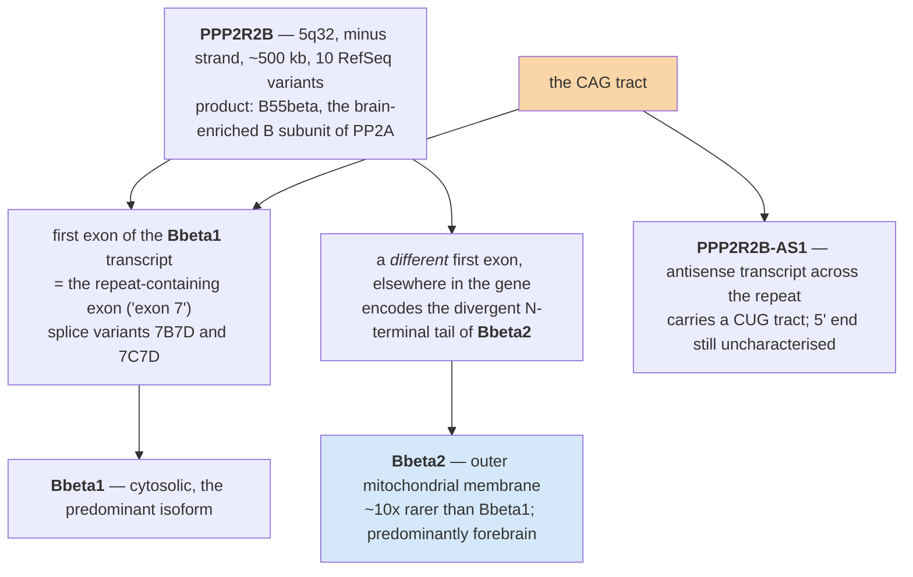
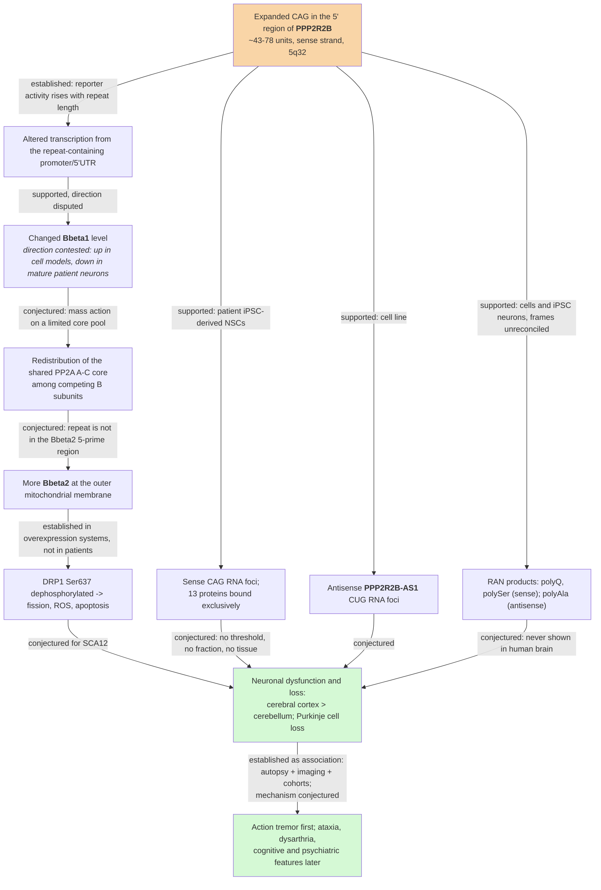

# D4 — SCA12 I: from repeat to phenotype

> **Before this:** [D1 — The neuron, the cerebellum and selective vulnerability](D1-neurons-and-the-cerebellum.md) · [D2 — Kinases, phosphatases and PP2A](D2-kinases-phosphatases-and-pp2a.md) · [D3 — Repeat-expansion disorders](D3-repeat-expansion-disorders.md) · [Ch 05 Transcription](../part-01-molecular-foundations/05-transcription.md) · [Ch 06 RNA processing](../part-01-molecular-foundations/06-rna-processing.md) · [Ch 07 The genetic code and translation](../part-01-molecular-foundations/07-genetic-code-and-translation.md) · [Ch 22 Eukaryotic transcriptional regulation](../part-04-gene-regulation/22-eukaryotic-transcriptional-regulation.md) · **Time:** ~75 min
>
> **Statistics needed:** [S3 Sampling and estimation](../part-S-statistics/S3-sampling-and-estimation.md)

## What you'll be able to do

- Describe SCA12 from discovery to clinic — the 1999 pedigree, the tremor-before-ataxia phenotype, the onset window, the imaging — and say which of those statements rests on one family and which on cohorts
- Locate the *PPP2R2B* CAG tract precisely: chromosome, strand, assembly, motif orientation, and which transcript's 5′ region it does and does not sit in
- State the normal, intermediate and pathogenic allele ranges *as a disagreement between named sources*, and report a 44-repeat allele correctly
- Run the elimination argument that removes SCA12 from every mechanism class D3 taught, and say what is left in D3's Class V, which D3 named but only half-described
- Lay out the three live mechanistic hypotheses with their discriminating predictions, their supporting experiments, and the experiment that would kill each one
- Separate what has been demonstrated *for SCA12* from what has been imported by analogy from *HTT*, *DMPK*, *FMR1* and *C9orf72* — and explain why that distinction is the whole skill
- Read a new patient-cohort expression dataset and say which hypothesis it moves, which it leaves untouched, and what it cannot decide

## The core idea

In 1999 a group in Baltimore ran an assay that detects the *presence* of a long CAG tract in genomic DNA without knowing where that tract lives. It fired. They cloned the fragment, mapped it, and found it sitting in the 5′ region of a gene nobody had a neurological hypothesis about: *PPP2R2B*, encoding the brain-enriched B55β regulatory subunit of protein phosphatase 2A. The paper is two pages long. It reports an association in one family, and it does not propose a mechanism.

Twenty-seven years later, the association is rock solid, thousands of patients have been genotyped, there is a randomised controlled trial of a symptomatic drug — and the mechanism is still argued about. Not "mostly settled with details outstanding". Argued about, with two of the strongest published results pointing in opposite directions.

> **This chapter's real subject is not SCA12. It is how to reason about a disease whose mechanism is unsolved.** Most of what you have learned so far arrives pre-digested: the mechanism is stated, the evidence is summarised, the misconceptions are corrected. That is a pedagogical convenience, and it is not what the front of any field looks like. Here you get the front. Four families of hypothesis, eight rows in the table §7 builds — most with real experimental support, one with none at all — several of them mutually incompatible, all resting on cell lines, one fly, some iPSC-derived neurons and a handful of autopsy brains. Your job is not to memorise the answer. Your job is to build the evidence table — hypotheses as rows, discriminating predictions as columns — and to know which experiment would collapse it.

The discipline is the one [Ch 55 §2](../part-11-human-and-statistical-genomics/55-clinical-variant-interpretation.md) already taught you: the strength of a claim is a property of the *design that produced it*, not of how many reviews repeat it. A mechanism supported entirely by overexpression constructs is a mechanism supported by overexpression constructs, however many figure legends it appears in.

---

## 1. The disease in one page

### Discovery

**Holmes SE, O'Hearn EE, McInnis MG, et al., "Expansion of a novel CAG trinucleotide repeat in the 5′ region of *PPP2R2B* is associated with SCA12", *Nature Genetics* 1999;23(4):391–392** (PMID 10581021). As OMIM's narrative of the letter records it: one large four-generation pedigree, referred to as family "R", of German descent, living in the USA. The family had already been reported as an unassigned autosomal dominant cerebellar ataxia before the repeat was found.

The method matters more than the result, and it is the reason this chapter exists. The group used **repeat expansion detection (RED)** — a ligation-based assay that reports the presence of a long trinucleotide tract somewhere in a genome without localising it. RED flagged an expansion in the proband. Only then — again on OMIM's summary of the letter — did they clone a **2.5-kb genomic fragment containing 93 uninterrupted CAG units** and map it to *PPP2R2B*.

Compare that with how SCA1, SCA2 and SCA3 were solved: linkage narrowed a chromosomal interval, candidate genes inside the interval were sequenced, and a repeat was found in one of them. There, the gene came with a locus, a family structure and often a hypothesis. Here the *repeat came first and the gene came second* — an "orphan repeat", found by an assay blind to gene identity, in a phosphatase regulatory subunit that no one had connected to the cerebellum.

That inverted order predicts exactly the situation we are in. When you find a repeat inside a gene you were already interested in, you inherit a mechanistic frame. When an assay hands you a tract and you look up what gene it landed in, you inherit nothing.

### Phenotype: tremor first, ataxia later

The presenting sign in the overwhelming majority of patients is an **action tremor of the upper limbs**. D1's tremor typology is what makes that sentence precise: *action* tremor is the umbrella term for tremor produced by voluntary muscle contraction, subdividing into postural (holding a position against gravity), kinetic (during any movement) and intention (amplitude growing as the limb approaches the target — the cerebellar one).

Two independent Indian cohorts:

| Feature | Ganaraja 2022 (n = 49) | Choudhury 2018 (n = 21) |
|---|---|---|
| Tremor at presentation | **95.9%** | tremor as first symptom **90%** |
| Bilateral upper-limb tremor | 85.7% | — |
| Postural-type tremor | 87.7% | — |
| Intention tremor | 57.1% | — |
| Head tremor | 55.1% | 62% |
| Voice tremor | 42.8% | — |
| Ataxia at presentation | 73.5% | gait impairment (any) 100% |
| Impaired tandem gait | 89.8% | — |
| Dysmetria | 75.5% | — |
| Dysarthria | 57.1% | — |
| Hand dystonia | — | 67% |
| Bradykinesia | — | 52% |
| Cognitive dysfunction | 22.4% | — |
| Psychiatric disturbance | 8.1% | psychiatric disorders 67% |
| Requiring a walking aid | 18.2% | — |

Two things to hold simultaneously. First, tremor is near-universal at presentation and ataxia is not — the reverse of SCA1/2/3/6, where the cerebellar syndrome leads. Second, **the two cohorts disagree by a factor of eight on psychiatric burden** (8.1% vs 67%), and a dedicated non-motor study (Basu 2024, n = 34) put cognitive impairment at **61.76%**, with depression and autonomic dysfunction present even early. Those are not measurement noise around a common truth; they are different instruments asking different questions. A cohort that records "psychiatric disturbance" as a clinical impression will find less than one that administers a battery.

Hyperreflexia is a recognised feature, and D1 explains why it is informative: it is an upper-motor-neuron sign, and pure cerebellar degeneration does not produce it. Its presence says the pathology extends beyond the cerebellar cortex — which the imaging and the autopsy both confirm.

### Onset

The sources disagree by two decades, and no paper resolves it.

| Cohort | Mean age at onset | Range |
|---|---|---|
| Index family and early reports (retired GeneReviews chapter) | **34–38 yr**, "fourth decade" | 8–62 |
| STRchive, typical onset window | **26–50 yr** | 8–62 |
| Choudhury 2018, India, n = 21 | **51.33 ± 8.98 yr** | 41–69 |
| Ganaraja 2022, India, n = 49 | **46.38 ± 11.7 yr** | — |
| Srivastava 2017, India, CAG 43–50 | **58.3 yr** | 35–72 |
| Srivastava 2017, India, CAG-51 group | **54.1 yr** | — |

The German-American index family reads as a fourth-decade disease; the Indian cohorts read as a fifth-to-sixth-decade disease. Candidate explanations — none demonstrated — are ascertainment (the index family was found *because* it was severe), repeat-length differences between founder populations, and modifier background. Note the shape of that list: it is the same list you would write for any founder-population phenotype difference, and writing it is not the same as testing it.

**Does repeat length predict onset age?** Choudhury 2018 reports a significant inverse correlation, ***r* = −0.760, *P* = 0.0001** (*n* = 21). Ganaraja 2022 reports **no significant correlation** (*n* = 49). Srivastava 2017 reports ***r* = −0.65, *P* < 10⁻⁴** at *n* = 124. All three series are Indian, and the two smaller ones are largely Agarwal.

Resist the urge to adjudicate that by counting votes. The largest series finds a moderate inverse correlation; a 49-patient series finds none; and Srivastava's own intermediate-allele subgroup, analysed separately within the same paper, does not reach significance either. The honest reading is a weak-to-moderate, population-dependent relationship that nobody has replicated outside India — not a settled dose–response. Even taken at face value, *r* = −0.65 accounts for about 42% of the variance in onset age: a partial predictor, not the near-deterministic *HTT* relationship, and not a number to counsel an individual with (D5).

### Imaging

Ganaraja 2022 imaged all 49 patients:

```
cerebellar atrophy only   34.7%
cerebral atrophy only     16.3%
both                      34.7%
normal imaging             6.1%
basal ganglia mineralisation  4%
periventricular ischaemic change  4%
```

Srivastava 2017 found variable cerebro-cerebellar degeneration with no clear correlation to phenotype, cortical atrophy exceeding cerebellar atrophy, and **two patients with short disease duration and no atrophy at all**.

> **A normal MRI does not exclude SCA12.** 6.1% of a genetically confirmed cohort had normal imaging, and short-duration patients in a second cohort had none. Imaging in SCA12 is supportive; it is never a rule-out. If you are building a diagnostic decision tree ([Ch 57 §1](../part-12-applications-and-ethics/57-genomics-in-practice.md)), an imaging gate in front of the genetic test discards one patient in sixteen.

### Course

Slowly progressive. **There is no published survival study of SCA12** — no equivalent of the EUROSCA natural-history cohorts. Patient-facing material states that lifespan is generally not shortened, and that is consistent with the late onset and slow course in every cohort, but the correct sentence is "no published survival data; lifespan is believed near-normal", not "lifespan is normal". D5 takes up the natural-history gap and what it costs a trial.

---

## 2. The locus, base by base

### Coordinates, strand and the motif that has four spellings

| Field | Value |
|---|---|
| Gene | *PPP2R2B* → B55β (also written Bβ, PR55β) |
| Cytoband | **5q32** |
| Gene span | **chr5:146,580,742–147,081,520 (GRCh38.p14)**, minus strand, ~500 kb |
| RefSeq transcript variants | **10** |
| Repeat, GRCh38 | **chr5:146,878,728–146,878,759** |
| Repeat, GRCh37/hg19 | **chr5:146,258,291–146,258,322** |
| Repeat, T2T-CHM13 | **chr5:147,414,734–147,414,765** |
| Reference copy number | **10.7** |
| Motif, reference/plus orientation | **GCT** |
| Motif, gene/sense orientation | **AGC** |
| Region annotation | **5′ UTR** |
| Inheritance | autosomal dominant |

NCBI Gene and the GTEx reference give slightly different spans for this gene (147,081,520 against 147,084,784) because they annotate different transcript sets — a gene's coordinates are a property of the annotation, not of the genome. [D2 §4.1](D2-kinases-phosphatases-and-pp2a.md) quotes the GTEx figure.

Three hazards live in that table, and all three are course themes.

**Assembly.** The same tract has three different addresses. Quoting `chr5:146,258,291` without saying GRCh37 is a coordinate without a build, which [Ch 41](../part-09-genomics/41-data-formats.md) tells you is meaningless.

**Convention.** The row above is the 1-based inclusive rendering (VCF, GFF) of a 0-based half-open interval — the same 32 bp either way, once you say which you mean. The interesting disagreement is not between conventions but between *files*: STRchive bounds the tract as chr5:146,878,727–146,878,759 (0-based half-open) — **32 bp, 10.7 units**; the ExpansionHunter catalog bounds it as chr5:146,878,727–146,878,757 — **30 bp, 10 units**. Same tract, two boundary choices, both stated in the same convention. So the question to ask of any repeat file is not only "which convention?" but "which interval does this catalogue declare?", because a caller counts what its catalogue tells it to count. Do not let this feel like pedantry: a one-base difference in a repeat boundary is a one-third-of-a-unit difference in a repeat count, and repeat counts are what the clinical threshold is written in.

**Copy number 10.7 is not a typo.** The reference tract is not a whole number of units — it ends mid-motif. This is normal for a real STR and it is why callers report fractional copies.

**Strand and motif.** *PPP2R2B* is on the **minus** strand. The tract therefore reads **CAG on the sense (mRNA) strand** and **CTG on the plus (reference) strand**. A trinucleotide repeat has no canonical phase, so databases that normalise the motif pick a rotation: `GCT` in reference orientation, `AGC` in gene orientation. So `(CAG)n` in the clinical literature, `c.27CAG[…]` in ClinVar, `(AGC)n` in STRchive and `(CTG)n` on a genome-browser track are **four descriptions of one element**. Never infer a different locus from a different spelling.

```
plus strand (reference), coordinates increasing to the right
                     chr5:146,878,728            chr5:146,878,759
                              |                          |
   5'--- ... ---------------[ CTG CTG CTG ... CTG C ]---------------- ... ---3'
                              |                          |
   3'--- ... ---------------[ GAC GAC GAC ... GAC G ]---------------- ... ---5'
                              <=========================
   minus strand = the gene: transcription runs RIGHT to LEFT
   read 5'->3' on the mRNA the tract is:  ... CAG CAG CAG ... CAG ...

   the same 32 reference bases, four legitimate spellings:
       CAG  — sense strand / mRNA / clinical literature
       CTG  — plus strand / genome browser track
       AGC  — phase-normalised, gene orientation
       GCT  — phase-normalised, reference orientation
```

### Where the repeat sits relative to transcription — the genuinely contested part

The 1999 report is summarised as placing the CAG tract **133 nucleotides upstream of the then-reported transcription start site**: in the promoter, not in the transcript. Later work from the same group argued that the true start site lies further 5′ than originally published, putting the repeat **inside the 5′ UTR**. Current annotation assigns the tract to the **5′ UTR** of NM_181675.3 (STRchive; ClinVar RCV000005966). Note that ClinVar writes that benign call as `NM_181675.3(PPP2R2B):c.27CAG[(7_28)]` — *positive* CDS numbering, where a genuine 5′ UTR position would carry a negative offset (`c.-n`). The notation is itself a symptom of how awkwardly HGVS fits a repeat whose position depends on which first exon you pick; do not read the annotation off the prefix.

Both can be true at once, and this is the point worth taking away. *PPP2R2B* has **multiple alternative first exons and therefore multiple transcription start sites** ([Ch 06 §9](../part-01-molecular-foundations/06-rna-processing.md) on alternative splicing; [Ch 05 §6](../part-01-molecular-foundations/05-transcription.md) on where a start site actually is). Relative to one TSS the repeat is promoter-proximal. Relative to another it is transcribed 5′ UTR. "Where is the repeat?" is not a well-posed question until you say *relative to which transcript*.

And the region behaves like a promoter when you test it: in reporter assays the repeat-containing fragment **has promoter activity that increases with repeat length** (O'Hearn 2015). That is a functional answer to a positional question, and it is the cleanest single result in the entire SCA12 mechanism literature.

### Which isoforms carry it



The retired GeneReviews chapter records at least seven splice variants at this locus, and [D2 §4.2](D2-kinases-phosphatases-and-pp2a.md) sets out the two that dominate the SCA12 literature: **Bβ1**, cytosolic and predominant, whose first exon *is* the repeat-containing exon (labelled exon 7 in the original *PPP2R2B* numbering, with splice variants **7B7D** and **7C7D**); and **Bβ2**, roughly 10-fold rarer and predominantly forebrain, sent to the **outer mitochondrial membrane** by a divergent N-terminal tail encoded by a **different first exon** under a phosphorylation-gated targeting switch. Same catalytic properties, different address.

> **The structural fact that constrains every hypothesis in this chapter.** The repeat is in the 5′ region of the **Bβ1** transcript. It is **not** in the 5′ region of the **Bβ2** transcript, which uses a different first exon. Any Bβ2-based mechanism therefore has to route through *trans* effects on total *PPP2R2B* output rather than through the repeat sitting in the Bβ2 message. That is the weak joint in the Bβ2 story, and §5 will lean on it.

Finally, the locus is transcribed **bidirectionally** ([Ch 24 §7](../part-04-gene-regulation/24-rna-based-regulation.md) on antisense transcription). ***PPP2R2B-AS1*** runs across the repeat on the opposite strand and therefore carries a **CUG** tract. It has been mapped as covering a region from 44 bp upstream of the CTG repeat to 145 bp downstream of it, is polyadenylated, and has SP1 sites — but its 5′ end remains uncharacterised despite repeated sequencing attempts. Hold that: an antisense transcript whose own start site nobody has pinned down is a transcript whose regulation nobody can model.

### Allele ranges, with the disagreement left in

| Source | Normal | Intermediate / uncertain | Pathogenic |
|---|---|---|---|
| GeneReviews SCA12 chapter (retired 2018) | **4–32** | threshold "not clear"; 40–62 seen with variable, late or no onset | **≥51 diagnostic** in the right clinical context |
| STRchive `SCA12_PPP2R2B` | **6–32** | **40–49** | **51–78** |
| Srivastava et al. 2017, *Brain* | **4–31** | reclassifies **43–50** as *intermediate pathogenic* | proposes **≥43** |
| ClinVar RCV000005966 | benign call anchored at **7–28** | — | — |
| Holmes et al. 2001, *Brain Res Bull* | **9–28** | — | **55–78** |
| Zahra et al. 2024, *Stem Cell Res* (methods) | **7–42** | — | **>43** |

**What is actually agreed:** an allele of **≥51 CAG** in a person with a compatible phenotype is diagnostic, and an allele **≤31** is normal. Everything from 32 to 50 is under active dispute — and the disputed floor has moved *down* three times:

| Lowest reported allele | Report |
|---|---|
| **46** | Dong, Wu & Wu 2015 — described as probably the shortest pathogenic allele; a Chinese patient presenting with action tremor |
| **43** | Srivastava et al. 2017 — 18 patients, CAG 43–50, from 16 unrelated families; proposes CAG-43 as the threshold |
| **40 and 42** | Ganaraja et al. 2022 — two patients with a consistent clinical phenotype |

Against that, in one family in Srivastava 2017 **CAG-39 carriers were unaffected**, which is the argument for a floor at 43 rather than lower.

Penetrance is length-dependent and incomplete in the lower band ([Ch 11 §8](../part-02-transmission-genetics/11-beyond-mendel.md)). Complete penetrance was documented in the index family at **66–78 repeats**. Carriers of **45–62** repeats have been observed with very-late-onset disease, or with no disease at all. The earliest direct evidence of non-penetrant carriers is Fujigasaki 2001: in a single Indian family, the expansion was present in **6 affected and 3 unaffected at-risk individuals**.

And a dosage datum with a sample size of two: Srivastava 2017 identified one homozygous **CAG-45/45** carrier and one compound **CAG-42/51** carrier. **Neither differed from heterozygous CAG-51 carriers in age at onset or severity.** No dosage effect detected — in a sample of two, which is a statement about the sample, not about the biology.

> **How to report a 44.** Not "negative". Not "positive". A 44-repeat allele sits in a range where pathogenicity has been reported but not established, at a locus with three published downward moves since 2015 (46 → 43 → symptomatic cases at 40 and 42). The report should say that, and the counselling should say that. [Ch 55](../part-11-human-and-statistical-genomics/55-clinical-variant-interpretation.md)'s five tiers were built for SNVs and indels; a length threshold with a contested floor and age-dependent penetrance fits them badly, and D5 takes up what that costs.

> **Unit warning.** Every count above is **pure CAG units on the sense strand**, as returned by repeat-primed PCR or fragment sizing (lab 11). A laboratory reporting base pairs, or reporting the plus-strand CTG count, or including flanking sequence, will give a different number for the same allele. Always ask what the lab counted.

---

## 3. Why SCA12 breaks the taxonomy

D3 gave you the mechanism classes with their type specimens. Take each in turn and ask whether SCA12 fits. This is elimination, and it is worth doing slowly, because the residue is the interesting part.

**Class I — coding repeats: polyglutamine protein gain of function + aggregation (type specimen: *HTT*).** Requires the repeat to be inside a reading frame. The SCA12 repeat is in the 5′ region: in the canonical transcript it is **not translated as polyglutamine**. Nor is there indirect evidence for a polyQ product in tissue — the one neuropathology series of record found ubiquitin-positive intranuclear inclusions that stained for **none** of expanded polyglutamine, α-synuclein, tau or TDP-43. Four negatives, four hypotheses narrowed. **Eliminated as the canonical mechanism** — with a caveat §6 will supply.

**Class II — loss of function via silencing and methylation (type specimen: *FMR1* full mutation).** Requires the expansion to shut the gene down. The reporter data say the opposite: promoter activity *increases* with repeat length. **Eliminated as stated** — though see §8, where a single brain showed increased methylation and lower expression in the cerebellum specifically, which is exactly the sort of result that stops an elimination from being clean.

**Class II′ — loss of function via transcriptional blockade (type specimen: *FXN* GAA in intron 1).** Requires a repeat that impedes elongation through the gene body. This repeat is at the 5′ end, in a region with demonstrated promoter activity, and SCA12 is dominant while Friedreich ataxia is recessive. **Eliminated.**

**Class III — RNA gain of function by foci and splicing-factor sequestration (type specimen: *DMPK* CTG in the 3′ UTR).** Requires an expanded transcript that accumulates in nuclear foci and titrates RNA-binding proteins. Foci *have* been shown for SCA12 in patient-derived cells. **Not eliminated — promoted to a live hypothesis** (§6).

**Class IV — RAN translation (type specimen: *C9orf72*; discovered at SCA8 and DM1).** Requires translation initiating without an ATG across an expanded repeat. Demonstrated at this locus in cell and iPSC models, in more than one frame. **Not eliminated** (§6).

Bidirectional transcription is not a class of its own — it is a property several classes can carry, and D3 treats it that way, inside DM1 ([D3 §6.4](D3-repeat-expansion-disorders.md)) and again inside *C9orf72* ([D3 §6.5](D3-repeat-expansion-disorders.md)). SCA12 carries it: ***PPP2R2B-AS1*** exists and bears a CUG tract, which is what keeps Classes III and IV alive on the antisense strand as well as the sense one (§6).

What survives elimination is D3's **Class V**, left deliberately half-described there — **regulatory mis-setting** — which is what the rest of this chapter unpacks: the repeat sits in promoter/5′-UTR territory and behaves as a **cis-regulatory element**, so expansion changes **how much** *PPP2R2B* the cell makes ([Ch 22 §2](../part-04-gene-regulation/22-eukaryotic-transcriptional-regulation.md), the *cis*-regulatory parts list). That is a **dosage** disease, not a poisoned-protein disease and not a silenced-gene disease. It is also the row that the standard repeat-disorder table still has no place for: [Ch 16 §9](../part-03-genome-instability/16-mutation.md) lists a 5′-UTR CGG and a coding CAG, and no 5′-UTR CAG at all.

[D3 §1.3](D3-repeat-expansion-disorders.md) already placed *PPP2R2B* on that axis, alongside *HTT*, *DMPK*, *FXN*, *FMR1* and the rest. What D4 adds to its row is not a location but the evidence attached to one:

| Locus | What D3 §1.3 says | What D4 adds |
|---|---|---|
| ***PPP2R2B*** | CAG, 5′ region ~133 nt upstream of the TSS; **no polyQ**; a *cis*-regulatory element that alters *PPP2R2B* expression | *which* 5′ region depends on which first exon you pick — promoter-proximal against one TSS, 5′ UTR against another (§2); the locus is transcribed bidirectionally; and the **direction** of the expression change is contested, not merely unmeasured (§4) |

> **Motif does not determine mechanism; position does.** *FMR1* makes that argument from the other side: identical motif, identical position, different *size* — and the mechanism flips from RNA toxicity to silencing past about 200 units. Position decides which mechanism is available; size can decide which of two you get.

---

## 4. Hypothesis A — the repeat as a dial on expression

The oldest hypothesis, and the best supported *in vitro*.

### The claim

The repeat lies in promoter/5′-UTR territory. Expansion therefore changes *PPP2R2B* transcription — specifically, upward — and too much B55β is toxic to neurons.

### The evidence

**Reporter assays.** Lin et al. 2010 (*Hum Genet* 128(2):205–212) showed the repeat itself acting as a ***cis* element that up-regulates *PPP2R2B* expression**, and mapped transcription-factor logic around it: **CREB1 and SP1** bind upstream of the repeat and up-regulate; **TFAP4** binds downstream and down-regulates. O'Hearn et al. 2015 (*Mov Disord* 30(13):1813–1824) showed that the repeat-containing region has promoter activity, that **activity increases with repeat length**, and that the effect is dependent on cell type and repeat sequence. The same paper reported that *PPP2R2B* overexpression disrupts neuronal morphology.

Read the length-dependence carefully, because it is the specific thing a reporter assay is good at. It is a dose–response with the mutation itself as the dose. That is much stronger than "the fragment has promoter activity", which any GC-rich fragment might. And if the assay vocabulary underneath this section needs refreshing, [Ch 36 — Core molecular methods](../part-08-methods/36-core-molecular-methods.md) is where to look up what each design can support before you decide how much weight it carries: §9 for reporters and luciferase, §8 for antibodies and westerns, §10 for immunoprecipitation and its error directions. Almost every result in §4 and §5 is one of those three constructs, and the differences between what they can each establish are the argument, not the background.

**A construct-level measurement of the disease transcript.** Zhou et al. 2024 (*Mov Disord* 39(10):1886–1891), in SK-N-MC cells transfected with 7B7D constructs of varying repeat length, found that the expanded CAG raises the **7B7D transcript** and **Bβ1 protein** — and, separately, produces a protein bearing a **long polyserine tract that triggers apoptosis**. The authors say both may contribute, which is the correct thing to say and also an admission that the experiment does not separate them.

**A whole-animal model.** Wang et al. 2011 (*J Biol Chem* 286(24):21742–21754): *Drosophila* overexpressing *ppp2r2b* show neurodegeneration, apoptosis, shortened lifespan, mitochondrial fragmentation and raised reactive oxygen species. **Antioxidant treatment and *SOD2* expression rescued lifespan**, which is rare and valuable — a rescue experiment that names its mediator, and therefore an argument that oxidative stress is causal rather than incidental.

### Why overexpression is mechanistically credible — D2's argument, applied

A programmer's instinct is that making more of an enzyme subunit should be, at worst, mildly wasteful. For PP2A that instinct fails, because the B subunit is a specificity subunit competing with a dozen others for a shared A–C core: raising one B subunit should not merely add its activity but redistribute the core away from the rest. [D2 §6.1–§6.4](D2-kinases-phosphatases-and-pp2a.md) builds that argument step by step, exposes its one undemonstrated premise — that the core pool is actually limiting in a neuron — and names the experiment that would settle it. Read it there rather than here; nothing about SCA12 changes it.

What is specific to SCA12 is the consequence. If the core is limiting, then a *cis* element that raises *PPP2R2B* output does not produce "more B55β activity"; it produces one gained activity and several unrelated lost ones, none of them predictable from *PPP2R2B*'s own substrate list — which is why "overexpression" is not a mild hypothesis here even at modest fold-changes. And two facts make it worth taking seriously in this locus in particular: Bβ2 requires holoenzyme *assembly* to accelerate apoptosis — an assembly-defective mutant does not — so the phenotype runs through the core rather than through free subunit; and Bβ2 holoenzymes are already about tenfold rarer than Bβ1 holoenzymes at baseline, so a minority species' fractional change under an expression-raising *cis* element could be large.

> **For a gene whose product is a specificity subunit competing for a shared catalytic core, dosage is not a smooth dial on one activity. It is the redistribution of a scarce resource.** Haploinsufficiency and triplosensitivity intuitions built on enzymes that act alone do not transfer. This is the single most important idea D2 hands to D4.

### The counter-evidence, which is not a footnote

Kumar et al. 2024 (*iScience* 27(5):109768) found that in **patient-derived mature neurons, most *PPP2R2B* isoforms were DOWN-regulated** relative to controls.

That is a direct contradiction of the tidy story, from a design (patient cells, endogenous locus, mature neurons) that is *closer to the disease* than a reporter plasmid or a fly. It does not refute the reporter result — a fragment can have length-dependent promoter activity in an assay while the endogenous locus, in a particular cell type at a particular maturation stage, does something else entirely. But it means the sentence "expansion → more B55β → toxicity" cannot be written without a qualifier naming the model system.

**Is Bβ1 up or down in SCA12 neurons? Unresolved.** Say that.

### The level nobody has measured — hypothesis A′′

There is a candidate reconciliation, and the reason it is worth naming is that it costs the field nothing to test and would let both camps be right. On the annotation that puts the tract inside the **5′ UTR** of the Bβ1 message — one of the two annotations §2 sets against each other, and true only relative to a first exon lying 5′ of the repeat — the repeat is not only a promoter-proximal *cis* element; it is also sequence that a scanning 43S complex has to get past. [Ch 07 §7](../part-01-molecular-foundations/07-genetic-code-and-translation.md) sets out that control surface in general terms: cap-dependent scanning to the first AUG in good context, upstream ORFs that capture scanning ribosomes and throttle the main ORF, leaky scanning past a weak start, and the standing warning that translation is not a simple function of mRNA level. An expanded tract in a 5′ UTR can act at any of those points — as a scanning obstruction, as folded structure ahead of the start codon, or by creating an upstream initiation site that was not there at 10 units. Call that **hypothesis A′′**: the same dosage claim as A, relocated from transcription to translation. It reconciles because the two contradicting results measure different steps — a reporter construct reports transcription from a fragment, and what a neuron lives or dies by is B55β protein per cell — so a fragment's promoter activity can rise with length while the protein output of the full-length repeat-bearing message falls, with no arithmetic to reconcile at all.

Two honesty clauses belong with it. First, A′′ in its clean form predicts a transcript that does *not* move, and Kumar 2024's patient neurons show transcript that does; so A′′ is at best a partial reconciliation, and the fuller one may need both it and the maturation-stage account the worked example generates. Second, and more to the point: **its evidential state is Conjectured, because nobody has looked.** No polysome-gradient or ribosome-profiling study of the repeat-bearing transcript, in any SCA12 system, could be found. That is not "the evidence is weak"; it is the absence of an experiment at the one level at which the repeat's own annotation says it sits.

### The tau connection, and why it is thinner than it sounds

[D2 §5.1](D2-kinases-phosphatases-and-pp2a.md) establishes the enzymology: PP2A supplies roughly **71%** of brain tau-phosphatase activity, and its *K*<sub>m</sub> for tau sits in the regime where **activity tracks abundance**. So a dosage change in a PP2A subunit is not obviously buffered, and the story writes itself: more B55β → more PP2A activity toward tau → altered tau phosphorylation → neurodegeneration. Now look at what supports it.

- The link was **proposed in a 2001 review** — a speculative list of processes an altered PP2A B subunit *could* perturb, published two years after the gene was found.
- **No study has measured tau phosphorylation in SCA12 patient tissue, SCA12 iPSC neurons, or an SCA12 animal model.** Not "a study found no effect". No study.
- The one autopsy series found intranuclear inclusions that were **tau-negative**.
- And the direction is not even predictable: PP2A affects tau phosphorylation with *opposite signs* along two routes — directly removing phosphate from tau, and indirectly enabling GSK-3β by dephosphorylating Akt. Any prediction of the form "more PP2A → less phospho-tau" is naïve. Note also that the Akt result implicates **B55α (*PPP2R2A*)**, not B55β; do not transfer a result across paralogues because the names look similar.
- A frequently confused adjacent finding: an association between *PPP2R2B* CAG length and Alzheimer disease in a Japanese population. That is a normal-range association study in a different disease. It is not SCA12 evidence.

**Verdict: a 25-year-old untested hypothesis with a good enzymological rationale and one negative stain against it.** Teach it as the example of how a plausible sentence in a review becomes, by repetition, something everyone believes was measured.

### And the expression pattern does not rescue the story either

The convenient claim is that *PPP2R2B* is cerebellum-enriched, which is why a *PPP2R2B* dosage change gives a cerebellar disease. [D2 §4.3](D2-kinases-phosphatases-and-pp2a.md) shows GTEx **v8** median TPM putting cerebellum (10.16) below every cortical and basal-ganglia region sampled, with frontal cortex BA9 at 29.90 (v10 gives 29.71 — the ranking does not move) — strongly brain-enriched, and emphatically not cerebellum-enriched — and it states the granule-cell dilution caveat that stops those bulk data from ruling out *Purkinje-cell* enrichment.

What D4 adds is the consequence. **The cerebellar component of SCA12 is not explained by where the gene is expressed.** It is an instance of D1's selective-vulnerability problem, not a solution to it — which is the honest and much more interesting position. And this is one of the few places where SCA12's odd clinical signature (cortex more atrophic than cerebellum) actually *agrees* with a molecular measurement. §8 says what would settle the cell-type question.

---

## 5. Hypothesis B — the Bβ2 mitochondrial route

### The claim

The Bβ2 isoform targets PP2A to the outer mitochondrial membrane, where it dephosphorylates the fission GTPase DRP1 and licenses mitochondrial fragmentation. More Bβ2 means more fission, more apoptotic vulnerability, and neuronal death.

### The evidence, which is genuinely good

- **Dagda et al. 2003** (*J Biol Chem* 278(27):24976–24985): Bβ2's divergent N-terminus is a mitochondrial targeting signal — the tail alone is sufficient to send GFP to mitochondria — and it does **not** change phosphatase activity, so it is a targeting device, not a catalytic modulator. Bβ2 overexpression **accelerates apoptosis** on growth-factor withdrawal, and requires holoenzyme assembly to do it.
- **Dagda et al. 2005 and Merrill et al. 2013**: Bβ2 reaches the outer membrane by an import-stall mechanism, gated by phosphorylation of **Ser20/21/22** ([D2 §4.2](D2-kinases-phosphatases-and-pp2a.md) carries the signal anatomy). A phosphatase whose own localisation is set by phosphorylation is a self-referential illustration of D2's kinase/phosphatase-ratio framing — and, for §7's purposes, it means Bβ2 can redistribute with no transcript change at all.
- **Dagda et al. 2008** (*J Biol Chem* 283(52):36241–36248): the payoff. Stressors drive Bβ2 to mitochondria; Bβ2 dephosphorylates **DRP1 at the inhibitory Ser637** that PKA–AKAP1 writes at the same membrane ([D2 §5.2](D2-kinases-phosphatases-and-pp2a.md) for the opposed pair and the residue numbering), activating fission; fragmentation is *required* for the neuronal death. And **silencing Bβ2 protects hippocampal neurons against free-radical, excitotoxic and ischaemic insults** — three unrelated stressors, one protective manipulation.
- **Li et al. 2025** (*Autophagy* 21(12):3182–3194): PP2A dephosphorylates LC3B, weakening the LC3B–OPTN interaction and phagophore recruitment, linking PINK1–Parkin mitophagy to SCA12; Bβ2 overexpression harms neuronal survival, and **deferiprone rescued it** by pharmacologically inducing mitophagy.
- **A loss-of-function contrast case.** *De novo* **missense** variants in *PPP2R2B* cause a neurodevelopmental syndrome by impairing holoenzyme incorporation, mitochondrial localisation, fission induction and DRP1 dephosphorylation (Sandal et al. 2025). An allelic series at the same gene, running the other way — arguably the cleanest available test of what B55β actually does in humans.

Note that the DRP1 story is a textbook instance of D2's central framing: two enzymes quantitatively opposed at **one serine on one protein**, with the fission state of the mitochondrion set by the ratio of their fluxes.

### What it predicts differently

This is the part to dwell on, because a hypothesis that predicts nothing distinctive is not doing any work.

- **A forebrain-weighted phenotype.** Bβ2 is predominantly forebrain, and GTEx puts *PPP2R2B* highest in frontal cortex. SCA12's autopsy signature is **cerebral cortical atrophy exceeding cerebellar atrophy** — unusual among the SCAs, and consistent. (This is an inference the reader can now make from two sourced facts; it has not been demonstrated as a causal link, and no one has shown Bβ2 protein raised in SCA12 cortex.)
- **Mitochondrial readouts should be abnormal in patients**, not just in overexpression systems. There is a hint: five mitochondrial quality-control genes — spanning biogenesis, mitophagy, dynamics and antioxidant defence — are significantly down-regulated in **PBMCs** of SCA12 patients (Ansari et al. 2026). PBMCs are not neurons. That is a hint, not a proof.
- **A druggable node.** Antioxidants and *SOD2* rescued the fly; deferiprone rescued the LC3B model. Both are mediator-naming rescues, which is more than most hypotheses in this field offer.

### The objection that will not go away

**The repeat is 5′ to the Bβ1 first exon, not the Bβ2 first exon.** Every experiment listed above **overexpresses Bβ2 artificially**. Not one demonstrates that the SCA12 expansion raises Bβ2 specifically in patient neurons.

So the chain has a missing first link:

```
CAG expansion  --> ??? --> more Bbeta2 at the outer mitochondrial membrane
                    ^
                    |
        this arrow is supplied by every paper's introduction
        and by no paper's figures
```

The hypothesis is mechanistically rich and causally under-anchored. It is entirely possible that both are true — that Bβ2 does everything Dagda's group showed, and that SCA12 has nothing to do with it. "This protein can kill neurons when you overexpress it" and "this disease works by overexpressing this protein" are different claims requiring different experiments.

---

## 6. Hypothesis C — RNA-level toxicity and RAN translation

Here the discipline of separating *shown for SCA12* from *imported by analogy* matters most, because the analogies are seductive and the imports are constant.

### What has actually been shown for SCA12

**Sense-strand RNA foci.** Kumar et al. 2024 (*iScience* 27(5):109768) found **nuclear RNA foci by RNA-FISH in SCA12 patient iPSC-derived neural stem cells**, absent from controls. The lines and their genotypes are worth knowing, because they are what "the SCA12 iPSC literature" currently means:

```
patients   IGIBi002-A   (14/59)
           IGIBi003-A   (10/67)
           IGIBi004-A   (17/65)
controls   ADBSi001-A   (10/13)
           10223        (09/16)
```

The same study ran a pull-down against a CAG-54 probe and identified **13 proteins binding exclusively to the expanded repeat**: KRT27, HSPA1B, H1-3, DYNLL2, C1QBP, S100A16, CTSA, KIAA0100, PSMA2, FN1, SNRPB, GSN, PSMA1 — enriched for protein-clearance machinery.

**The gap in that result is worth naming.** The paper does not report the fraction of cells bearing foci, nor a repeat-length threshold for foci formation. Both are exactly what you would need to argue that foci are a *disease* phenomenon rather than a detectable one. Presence is not dose–response, and dose–response is what turns a phenomenon into a mechanism.

**Antisense CUG foci.** Zhou et al. 2023 (*Mov Disord* 38(12):2230–2240) established bidirectional transcription at the locus: ***PPP2R2B-AS1*** carries a **CUG** repeat, forms **CUG RNA foci in SK-N-MC cells**, and induces apoptosis. The constructs were **(CTG)10, (CTG)73, and an interrupted (CTG)73** — note the third one, which is the right control for asking whether purity of the tract matters.

**RAN translation — yes, at this locus specifically.** This is a genuine SCA12 result, not an extrapolation from SCA8 or *C9orf72*. The two groups that have looked disagree about the frames, which is itself informative:

| Group | Frames reported translated | Frames reported silent |
|---|---|---|
| Faruq lab (CSIR-IGIB, Delhi) — Kumar 2024 | **polyglutamine** (CAG frame) and **polyserine** (AGC frame); the polyQ product appeared even with the sole ATG mutated to GGG | — |
| Margolis / Li lab (Johns Hopkins) — Zhou 2023 | **polyalanine**, from the antisense CUG/alanine ORF | **polyleucine and polycysteine: no product** |

The ATG-to-GGG control is the load-bearing experiment on the Delhi side: it is what makes the initiation genuinely repeat-associated and non-ATG rather than ordinary leaky scanning.

And note the consequence for §3. SCA12 is *not* a polyglutamine disease in the *HTT* sense — and yet a polyQ product has been reported at this locus, by RAN translation, in cells. Elimination arguments are about mechanisms, not about molecules. "There is no polyQ here" was too strong; "the canonical transcript does not encode a polyQ tract, and the autopsy inclusions are polyQ-negative" is right.

### What has been imported by analogy — and should be labelled as such

- **MBNL sequestration and splicing catastrophe.** That is DM1's mechanism, established by co-localisation of muscleblind proteins with expanded-repeat foci. Split the claim carefully. MBNL1 overexpression **diminishes alanine-frame RAN translation from the antisense transcript**, as do single-nucleotide interruptions in the CUG tract (Zhou 2023) — an effect on the phenomenon, not a demonstration that MBNL engages the tract. What has **not** been shown is DM1-style sequestration: MBNL titrated away from its normal targets, with a downstream splicing phenotype in SCA12 cells or tissue. The 13 proteins pulled down by the CAG-54 probe are enriched for protein-clearance machinery, not splicing factors — which is a *different* prediction, and one nobody has followed up in patient tissue.
- **A toxic RNA disease at a 5′ UTR repeat.** That is FXTAS, where premutation carriers show 2–8-fold elevated *FMR1* mRNA and ubiquitin-positive intranuclear inclusions. SCA12 has ubiquitin-positive intranuclear inclusions too. The resemblance is real and it is not evidence.
- **Dipeptide-repeat pathology from bidirectional transcription.** That is *C9orf72*, where DPR proteins from multiple frames form CNS inclusions detectable in patient brain. **SCA12 has no equivalent tissue demonstration.**

> **The load-bearing negative.** **Nobody has demonstrated a RAN product in SCA12 human brain tissue.** Worse: when the Hopkins group examined one formalin-fixed post-mortem brain, they could not reliably detect the expanded transcript at all. Expanded transcripts were reliably detected only in iPSCs and mouse models. Every RNA-level and RAN-level result in SCA12 currently lives in a dish.

One more caution about secondary sources. A widely used repeat database summarises the SCA12 mechanism in a single line as polyalanine gain of function associated with RAN translation. That line is a **single-citation summary** and it is considerably more confident than the literature underneath it. When a database field and a literature review disagree in confidence, the database field is usually the one that lost the caveats — someone had to fit a mechanism into a string column.

---

## 7. The evidence table: mechanism-hunting as elimination

This table is the chapter. Everything before it is input; everything after it is consequence. Read it as the object a working scientist actually maintains: hypotheses as rows, and for each one the prediction that distinguishes it, what supports it, what contradicts it or is missing, and the experiment that would settle it.

Rows are graded on the same three-tier ladder §9 applies to the arrows of the causal chain — **Established**, demonstrated in more than one system including a patient-derived one; **Supported**, demonstrated, but in one system or one design class; **Conjectured**, argued from adjacent facts, not measured. On that ladder **no row below reaches Established**, which is the chapter's summary in one word. A, A′, B, C1, C2 and C3 are **Supported**, each inside a single design class. D and A′′ are **Conjectured** — D because nobody has measured tau phosphorylation in any SCA12 system, A′′ because nobody has measured translation of the repeat-bearing transcript at all.

| Hypothesis | Discriminating prediction | Supporting data | Contradicting or missing | Experiment that would settle it |
|---|---|---|---|---|
| **A. Promoter/5′-UTR-driven *PPP2R2B* over-expression** | *PPP2R2B* transcript and B55β protein rise with repeat length, in the affected cell types, at the endogenous locus | Repeat acts as a *cis* element up-regulating expression (Lin 2010); promoter activity increases with repeat length (O'Hearn 2015); expansion raises 7B7D transcript and Bβ1 protein (Zhou 2024, SK-N-MC overexpression); *PPP2R2B* overexpression disrupts neuronal morphology | **Most *PPP2R2B* isoforms are *down* in patient-derived mature neurons (Kumar 2024)** — direct contradiction; and cerebellum showed *lower* expression with higher methylation in the one brain examined | Allele-specific, isoform-resolved quantification at the endogenous locus in isogenic neurons across a repeat-length series and a maturation time-course — the isogenic 73-CAG line makes this feasible today |
| **A′. A polyserine product from the expanded tract** | An expanded-repeat-encoded polySer protein is present, and its removal rescues toxicity | Expansion yields a long polyserine tract that triggers apoptosis (Zhou 2024); polySer also reported from the AGC frame by RAN translation (Kumar 2024) | Never demonstrated in human tissue; not separated from the expression effect in the same experiment | Frame-specific antibody or targeted proteomics in patient neurons, plus frame-blocking constructs that abolish polySer without changing transcript level |
| **A′′. Translational-level dosage change from a 5′-UTR tract** | B55β output per transcript moves with repeat length while the transcript itself does not — the expanded tract acting on scanning, on RNA structure ahead of the start codon, or by creating an upstream ORF ([Ch 07 §7](../part-01-molecular-foundations/07-genetic-code-and-translation.md)) rather than on transcription | None specific to SCA12. What licenses the row is position, not evidence: one of the two annotations §2 sets against each other places the tract in the **5′ UTR** of the Bβ1 message — true only relative to a first exon lying 5′ of the repeat — and a 5′ UTR is a translational control surface as much as a transcriptional one | **Conjectured — nobody has looked.** No polysome-gradient or ribosome-profiling study of the repeat-bearing transcript, in any SCA12 system, could be found; and the clean form of the prediction (transcript flat) is not what patient neurons show | Polysome-gradient or ribosome-profiling comparison of the repeat-bearing transcript in patient and isogenic neurons across a repeat-length series, with transcript level and B55β protein measured in the same cells — the point being to move protein without moving transcript |
| **B. Bβ2 → DRP1 → mitochondrial fission** | Bβ2 protein rises at the outer mitochondrial membrane in patient neurons; DRP1 Ser637 phosphorylation falls; mitochondria fragment | Bβ2 targets PP2A to the OMM (Dagda 2003, 2005); dephosphorylates DRP1 S637 and drives fission; silencing Bβ2 protects neurons against three insults (Dagda 2008); fly overexpression → degeneration + fragmentation + ROS, rescued by antioxidants/*SOD2* (Wang 2011); mitochondrial QC genes down in patient PBMCs (Ansari 2026) | **The repeat is not in the Bβ2 transcript's 5′ region.** Every supporting experiment overexpresses Bβ2 artificially; no one has shown the SCA12 expansion raising Bβ2 in patient neurons | Measure endogenous Bβ2 protein and DRP1 pSer637 in patient-derived and isogenic neurons; if Bβ2 is unchanged, the hypothesis is done regardless of how well Bβ2 kills neurons |
| **C1. Sense CAG RNA toxicity** | Foci scale with repeat length, appear above a threshold, and sequester an identifiable protein set whose depletion phenocopies | Nuclear RNA foci in patient iPSC-derived NSCs, absent in controls; 13 proteins bind the expanded repeat exclusively, enriched for protein-clearance machinery (Kumar 2024) | **No fraction-of-cells and no length threshold reported**; no sequestration partner validated in tissue; expanded transcript not reliably detected in post-mortem brain | Length-series FISH with per-cell quantification; then knock down the top candidate partners and ask whether the cellular phenotype reproduces |
| **C2. Antisense CUG RNA toxicity (*PPP2R2B-AS1*)** | An antisense transcript across the repeat forms CUG foci and is toxic; silencing it rescues | *PPP2R2B-AS1* mapped across the repeat, polyadenylated, SP1 sites; CUG foci in SK-N-MC cells; induces apoptosis, and its alanine-frame RAN translation is diminished by MBNL1 overexpression or by interrupting the tract (Zhou 2023) | Its **5′ end is uncharacterised**; toxicity shown in a cell line, not in neurons or tissue | Characterise the transcript properly, then strand-specific knockdown in patient neurons with the sense transcript left intact |
| **C3. RAN translation** | A non-ATG-initiated repeat product exists **in patient brain**, and blocking that frame rescues | PolyQ + polySer (sense, Delhi); polyAla (antisense, Hopkins); polyQ persists with the sole ATG mutated to GGG; antisense polyAla product diminished by MBNL1 overexpression or by interrupting the repeat, polyLeu and polyCys absent (Zhou 2023) | **Frames not reconciled between labs**; **never shown in human brain tissue** | Frame-specific immunohistochemistry across the small available autopsy series, blinded, with the interrupted-repeat construct as the specificity control |
| **D. Tau hyperphosphorylation via altered PP2A** | Tau phosphorylation is shifted in SCA12 neurons or tissue | PP2A supplies ~71% of brain tau-phosphatase activity, with *K*<sub>m</sub> in the abundance-tracking regime | **Never measured in any SCA12 system.** Autopsy inclusions are tau-negative. Direction is not even predictable given the opposing GSK-3β route | Phospho-tau panel on patient iPSC neurons and the available autopsy tissue — the cheapest untried experiment in this table |

Three lessons the table teaches that no paragraph can.

**First, the columns are not decoration.** "Supporting data" alone ranks hypotheses by how much work has been done on them, which is a measure of funding and fashion. It is the *third* column that ranks them by how much they have survived.

**Second, hypotheses here are not mutually exclusive, and the field's leading cases are the ones that stopped pretending otherwise.** *C9orf72* is described with three mechanisms side by side — haploinsufficiency, RNA sequestration, and DPR aggregation from bidirectional RAN translation — and the authoritative summaries decline to adjudicate. That non-adjudication is the state of the field, not a gap in the writing. SCA12 may well run two or three of these rows at once.

**Third, notice how many entries in the last column are cheap.** A phospho-tau panel. Per-cell foci counts. Endogenous Bβ2 quantification. These are not moon shots; they are experiments nobody has run, in a disease with a few dozen laboratories' worth of total attention. Rare-disease mechanism is not usually blocked by conceptual difficulty. It is blocked by tissue, by cohorts, and by how few people are looking.

---

## 8. What human tissue actually says

Everything in §4–§6 lives in dishes, flies and reprogrammed cells. Here is the human end, and it is thin enough to enumerate.

### Post-mortem

**O'Hearn et al. 2015** is the neuropathology paper of record: enlarged ventricles, **marked cerebral cortical atrophy**, **Purkinje cell loss**, less prominent cerebellar and pontine atrophy, and neuronal **intranuclear ubiquitin-positive inclusions consistent with Marinesco bodies** — which stained for **none** of expanded polyglutamine, α-synuclein, tau or TDP-43.

Count what that paragraph does. Four negative stains close off four hypotheses in one figure. Purkinje cell loss ties the phenotype to D1's circuit. And the cortex-before-cerebellum pattern, which is unusual among the SCAs, matches both the clinical picture and the GTEx expression ranking.

**Parthaje et al. 2025** (*Cerebellum* 24(3):60) measured CAG size, methylation and gene expression across regions of **a single SCA12 brain**. Somatic mosaicism — repeat instability across brain regions ([Ch 16 §1](../part-03-genome-instability/16-mutation.md) on the germline/somatic distinction) — was detected. And then the awkward part: **the cerebellum showed the least somatic instability**, coupled with **increased methylation** and **lower *PPP2R2B* expression**. The same study reported increased expression of DNA-maintenance genes (a candidate explanation for the low instability) and decreased expression of cell-cycle modulators.

Sit with that for a moment, because it is the most interesting single result in the field and it is uncomfortable for everyone.

- In Huntington disease, the striatum — the target tissue — shows the **most** somatic expansion, and somatic expansion is the leading explanation for why that tissue dies. SCA12's cerebellum shows the **least**. The rules learned at *HTT* and *DMPK* do not transfer automatically.
- Lower expression in the target tissue is the wrong sign for Hypothesis A as usually stated.
- **n = 1.** One brain, one set of dissections. This is a result to think with, not a result to conclude from.

Zhou 2023's examination of one formalin-fixed post-mortem brain, in which the expanded transcript could not be reliably detected, is the third data point. **The entire human neuropathology of SCA12 rests on a handful of brains.** Any sentence beginning "in the SCA12 brain" is a sentence about single cases, and should say so.

### iPSC-derived neurons

This is where the field has actually grown, and it is the reason the last five years produced more mechanism than the previous fifteen.

| Line(s) | Source | What they are |
|---|---|---|
| IGIBi002-A (14/59), IGIBi003-A (10/67), IGIBi004-A (17/65) | CSIR-IGIB, Delhi | The patient lines behind the foci, pull-down and RAN results |
| IGIBi011-A | CSIR-IGIB | From a gait-dominant patient |
| Four further SCA12 lines (2026) | CSIR-IGIB | Cohort depth, published as line reports |
| **JHUi004-A** | Johns Hopkins | **Isogenic**, CRISPR/Cas9n-edited heterozygous 73-CAG line |

The isogenic line is the methodologically important one. Patient-versus-control comparisons confound genotype with genetic background — the same problem as an uncontrolled case-control association study ([Ch 51](../part-11-human-and-statistical-genomics/51-gwas.md)), at n of three. An edited line differing from its parent at the repeat and nothing else converts an association into a controlled comparison. Most of the contradictions in §7's table are, in principle, resolvable by running both directions in isogenic backgrounds.

A humanised **knock-in mouse** (KI-10 and KI-80: mouse *Ppp2r2b* exon 2 replaced by human exon 7 carrying 10 or 80 CAG) is described in methods sections and grant records. **A peer-reviewed characterisation of its phenotype could not be found.** A model that exists but has no published phenotype is not yet evidence about anything, and the honest way to write it is exactly like this.

### What Ch 48's toolkit would ask

The unresolved question §4 left hanging is cell-type resolution. Bulk cerebellar RNA-seq says *PPP2R2B* is not cerebellum-enriched, but bulk cerebellum is overwhelmingly granule-cell RNA, and a Purkinje-specific gene would vanish into that background. **No published single-nucleus analysis of *PPP2R2B* by cerebellar cell type could be found.**

So here is the experiment, framed in [Ch 48](../part-10-functional-genomics/48-single-cell-and-spatial.md)'s vocabulary:

1. **Single-nucleus RNA-seq of human cerebellum and frontal cortex**, clustered and annotated to cell type ([Ch 48 §8](../part-10-functional-genomics/48-single-cell-and-spatial.md)) — Purkinje cells, granule cells, molecular-layer interneurons, Bergmann glia, oligodendrocytes.
2. Ask *PPP2R2B* expression **per cell type**, not per tissue. The question "is it Purkinje-enriched?" is only askable at this resolution.
3. Then ask the harder question: **which cell types express which isoform**. Bβ1 and Bβ2 differ at their first exon, so short-read 3′-biased single-cell chemistry — which reads the wrong end of the molecule — will not distinguish them. This needs long-read or 5′-targeted single-cell sequencing ([Ch 40 §3](../part-09-genomics/40-sequencing-technologies.md)), and it is a genuinely hard experiment rather than a routine one.
4. Add **spatial** context if you want to test the selective-vulnerability story properly: expression in the Purkinje layer against expression in cortical layers, in the same brain.

That experiment would answer the single question on which Hypothesis B most depends — whether the cells that die are the cells that express the isoform — and it has not been done.

---

## 9. The causal chain, with confidence on every arrow

Here is the whole disease, as currently best understood, with each arrow labelled by what supports it. **Established** = demonstrated in more than one system including a patient-derived one. **Supported** = demonstrated, but in one system or one design class. **Conjectured** = argued from adjacent facts, not measured.



Read the diagram for its shape rather than its content. **The two ends are solid and the middle is not.** We know what the mutation is, and we know what the patients look like — and every path between them contains at least one conjectured arrow. That is what an unsolved mechanism looks like when you draw it honestly. Most published SCA12 figures draw the same graph with all arrows the same weight, which is how a field talks itself into believing it has a mechanism.

One more structural observation. The conjectured arrows cluster at two joints: **C→G→H** (does a dosage change actually redistribute the core, and does it reach Bβ2?) and **everything→J** (does any of this kill the cells that die?). Those are the two joints worth a career.

And there is a third, quieter one, because it looks like the safest arrow on the page. **J→K is established as an association and no further.** The autopsy series, the imaging and both Indian cohorts agree that these patients lose neurons and present with an action tremor; not one of them shows *how* the loss produces that particular sign rather than some other cerebellar sign, which is why the arrow is labelled twice. [D1](D1-neurons-and-the-cerebellum.md)'s tremor-mechanism subsection — "What produces a tremor, as opposed to a mis-scaled movement" — sets out why the last link is genuinely open: a degenerating circuit accounts for a mis-scaled or mistimed movement far more readily than for a rhythmic oscillation at a particular frequency, and the step from the first to the second is **Conjectured** for SCA12 exactly as the arrows above it are. An association you can measure in every cohort is still not a mechanism, and the temptation to treat the clinical end of the chain as solved because it is *visible* is the same temptation §7's third column exists to resist.

---

## Common misconceptions

| What people think | What's actually true |
|---|---|
| SCA12 is a polyglutamine disease, like the other CAG-repeat ataxias | The repeat lies in the 5′ region, not the reading frame; the canonical transcript encodes no polyQ tract, and the autopsy inclusions are polyQ-negative. A polyQ product *has* been reported at this locus — by RAN translation, in cells, never in brain. Motif does not determine mechanism; position does (§3) |
| Finding the gene means understanding the disease | The gene was found in 1999. The mechanism is still curated as incompletely established, with an evidence score of **8.5 / 18 ("Moderate")**, and two of the strongest results contradict each other. Gene discovery gives you a diagnostic test and a name, not a mechanism (§7) |
| We know where *PPP2R2B* is expressed and which way the expansion moves it | Neither, usefully. GTEx v8 median TPM puts cerebellum at 10.16 against 29.90 in frontal cortex BA9 — brain-enriched, not cerebellum-enriched, so the cerebellar involvement is an instance of D1's selective-vulnerability problem rather than an explanation of it. And the direction is contested: reporter and cell models say up, patient-derived mature neurons say most isoforms are **down**, and the one brain examined showed lower cerebellar expression with higher methylation (§4, §8) |
| The mitochondrial fission mechanism follows from the mutation | It follows from **overexpressing Bβ2**, which every supporting experiment does. The repeat is 5′ to the **Bβ1** first exon, not Bβ2's. "This protein kills neurons when overexpressed" and "this disease works by overexpressing this protein" are different claims (§5) |
| RNA foci prove RNA toxicity | Foci demonstrate presence. Toxicity needs a dose–response (foci above a length threshold), a sequestered partner whose depletion phenocopies, and ideally the phenomenon in tissue. For SCA12 the fraction of cells with foci and the length threshold are both unreported, and expanded transcripts were not reliably detected in post-mortem brain (§6, §7) |
| SCA12 shows anticipation, like every repeat disease | The current authoritative overview states there is **insufficient evidence** for anticipation in SCA12; the retired chapter said moderate anticipation; patient-facing material says repeats generally do not expand between generations. The only parent-of-origin dataset is 7 maternal / 7 paternal / 1 biparental in 21 patients. Unresolved — and a reminder that the *HTT* rules are not laws (§1, D3, [Ch 11 §11](../part-02-transmission-genetics/11-beyond-mendel.md)) |
| A repeat count below 51 is a negative result | Symptomatic patients have been reported at 46, at 43–50, and at 40 and 42, while CAG-39 carriers in one family were unaffected. Report an allele in the 32–50 band as being in contested territory, and say which threshold you applied (§2) |
| A normal MRI rules out SCA12 | 6.1% of a genetically confirmed cohort had normal imaging, and two short-duration patients in another cohort had no atrophy at all (§1) |
| The *Drosophila* model is a model of SCA12 | It is a model of *ppp2r2b* **overexpression** — which is Hypothesis A, not the mutation. Its rescue by antioxidants and *SOD2* is genuinely informative about what excess B55β does to a neuron, and says nothing about whether SCA12 produces excess B55β (§4) |
| Whatever the mechanism is, the cerebellum must be where the repeat is most unstable — that is how repeat diseases work | In the single SCA12 brain studied, the cerebellum showed the **least** somatic instability, opposite to the striatal pattern in Huntington disease. One brain — so neither the finding nor its reversal should be asserted (§8) |

---

## Worked example: a new cohort expression dataset arrives

**Every number in this example is invented for teaching.** Nothing here is a published result; the point is the reasoning, not the values. Real data on this question are contradictory (§4), which is precisely why it makes a good exercise.

**The scenario.** A consortium sends you an isoform-resolved expression dataset and asks which hypothesis it supports. The design: iPSC lines from *n* = 8 SCA12 carriers (CAG range 47–68 on the expanded allele) and 8 controls, differentiated to neurons, harvested at two stages — **day 30 (immature)** and **day 90 (mature)**. Long-read cDNA sequencing, so the alternative first exons are resolvable. Values are median TPM.

```
                          day 30 (immature)          day 90 (mature)
transcript          control   SCA12   log2FC     control   SCA12   log2FC
-------------------------------------------------------------------------
PPP2R2B total        18.4     31.3    +0.77       26.1     14.9    -0.81
  Bbeta1 (7B7D)       9.2     20.2    +1.13       13.0      6.1    -1.09
  Bbeta1 (7C7D)       4.1      6.0    +0.55        6.4      4.2    -0.61
  Bbeta2              1.3      1.4    +0.11        2.0      1.8    -0.15
  other isoforms      3.8      3.7    -0.04        4.7      2.8    -0.75
PPP2R2B-AS1           0.9      3.6    +2.00        1.1      2.9    +1.40
PPP2R2A (B55alpha)   22.7     22.1    -0.04       29.4     28.8    -0.03
```

**Step 1 — check the control that is not about your hypothesis.** *PPP2R2A* is a paralogue at a different locus with no repeat. It is flat at both stages (log2FC ≈ −0.04, −0.03). Good: the dataset is not reporting a global normalisation artefact dressed up as biology. Had *PPP2R2A* moved in the same direction as *PPP2R2B*, everything below would be uninterpretable. **Always find the row that should not move.**

**Step 2 — read the direction, and notice it changes sign.** At day 30 total *PPP2R2B* is up 1.7-fold; at day 90 it is down to 0.57-fold.

```
day 30:  31.3 / 18.4 = 1.70x    log2 = +0.77
day 90:  14.9 / 26.1 = 0.57x    log2 = -0.81
```

This is the single most consequential feature of the dataset, and a reader who reports only "expression is altered" has thrown it away. A sign change across maturation stage would **reconcile the field's central contradiction**: the cell-model and reporter results (up) and the mature-patient-neuron result (down) could both be right, of the same locus, at different developmental states. That is a hypothesis this dataset *generates*; it is not a hypothesis this dataset confirms, because a consortium's day-30 and day-90 are two points on a curve nobody has sampled densely.

**Step 3 — ask which isoform carries the effect.** Almost all of it is **Bβ1 7B7D**: +1.13 and −1.09 log2, against +0.55 and −0.61 for 7C7D. That is exactly where §2 says the repeat sits — in the 5′ region of the Bβ1 transcript, and specifically the 7B7D-containing form. **The effect is where the mutation is.** A dosage effect that appeared preferentially in an isoform whose first exon is nowhere near the repeat would be a red flag for a batch or background artefact.

**Step 4 — test Hypothesis B, and watch it fail here.** Bβ2 moves by +0.11 and −0.15 log2 — nothing, at either stage, and note that it sits at about a tenth of Bβ1 in the controls, as §4 says it should. If the mitochondrial-fission mechanism requires more Bβ2, this dataset does not supply it. That does not refute Dagda's biology; it removes the missing first arrow from §5's chain in this particular system, which is what the hypothesis most needed. Note also what it does *not* test: Bβ2 **protein** at the outer mitochondrial membrane, which is set by the Ser20/21/22 targeting switch as well as by transcript level. A localisation-gated protein can redistribute with no transcript change at all. **Transcript is not protein, and protein is not protein-where-it-matters.**

**Step 5 — notice the antisense transcript, which nobody asked about.** *PPP2R2B-AS1* is up 4.0-fold at day 30 and 2.6-fold at day 90 — the largest effect in the table, and the only substantial one that keeps its sign across maturation. If you came in testing Hypothesis A, you very nearly missed it. Hypothesis C2 predicts exactly this, and it predicts something further that this table cannot show: CUG foci, and toxicity that strand-specific knockdown reverses.

**Step 6 — the correlation this dataset can and cannot support.** With 8 carriers spanning CAG 47–68, you can regress day-30 Bβ1 log2FC on repeat length. Suppose it comes out *r* = 0.68. With *n* = 8 the 95% confidence interval on that correlation runs roughly from −0.05 to 0.94 — it does not even exclude zero (*P* ≈ 0.06), and its upper end is nearly 1. An *r* that looks impressive is, at *n* = 8, compatible with no relationship at all ([S3](../part-S-statistics/S3-sampling-and-estimation.md) on what an interval that wide is telling you). Report the interval, not the point estimate, and do not let a length–dose story rest on it.

**Verdict, written the way it should be written.**

> This dataset **supports Hypothesis A with a maturation-stage qualifier**: expression of the repeat-proximal Bβ1 7B7D transcript changes in the direction and at the isoform the *cis*-element model predicts, and the sign reverses between immature and mature neurons, which would reconcile the published contradiction if replicated with dense sampling across differentiation. It **does not support Hypothesis B in this system**, since Bβ2 transcript is unchanged — though it does not test Bβ2 localisation, which is the level at which that hypothesis actually operates. It **raises Hypothesis C2**, the antisense transcript, which shows the largest and most consistent change in the table and was not the question asked. It **weighs mildly against A′′ in its clean form**, since a purely translational effect predicts a transcript that does not move and this transcript moves twice — without excluding a translational contribution layered on the transcriptional one, which only protein-per-transcript data could measure. It says nothing about C1, C3 or D, which need foci counts, frame-specific detection and a phospho-tau panel respectively.

Which is to say: a good dataset moves two rows of the §7 table, kills nothing outright, and hands you a better experiment than the one you ran. Notice that the *most* useful thing in the whole exercise was a row you were not testing — and that the second most useful was the row that did not move.

---

## Connections

**Back to:**
- [D1 — The neuron, the cerebellum and selective vulnerability](D1-neurons-and-the-cerebellum.md) — the tremor typology that makes "action tremor" precise, Purkinje-cell biology behind the autopsy findings, and the selective-vulnerability problem this chapter fails to solve
- [D2 — Kinases, phosphatases and PP2A](D2-kinases-phosphatases-and-pp2a.md) — holoenzyme architecture, where specificity lives, and the dosage-danger argument §4 leans on entirely
- [D3 — Repeat-expansion disorders](D3-repeat-expansion-disorders.md) — the mechanism classes §3 runs the elimination argument through, and the type specimens §6 warns against importing
- [Ch 05 — Transcription](../part-01-molecular-foundations/05-transcription.md) — §6, the pre-initiation complex, and what "the transcription start site" means when a gene has several
- [Ch 06 — RNA processing](../part-01-molecular-foundations/06-rna-processing.md) — §9, alternative first exons and isoform structure; the Bβ1/Bβ2 distinction is a splicing fact before it is a disease fact
- [Ch 07 — The genetic code and translation](../part-01-molecular-foundations/07-genetic-code-and-translation.md) — §7, cap-dependent scanning, upstream ORFs and the warning that translation is not a simple function of mRNA level; hypothesis A′′ is that warning applied to a 5′-UTR repeat
- [Ch 36 — Core molecular methods](../part-08-methods/36-core-molecular-methods.md) — §9 reporters and luciferase, §8 antibodies and westerns, §10 immunoprecipitation and its error directions: the three assay designs that produce nearly every result in §4 and §5, and the place to refresh what each of them can actually support
- [Ch 22 — Eukaryotic transcriptional regulation](../part-04-gene-regulation/22-eukaryotic-transcriptional-regulation.md) — §2, the *cis*-regulatory parts list; the whole of Hypothesis A is the claim that this repeat is one of those parts
- [Ch 16 — Mutation](../part-03-genome-instability/16-mutation.md) — §9, repeat expansion and anticipation, and the disorder table with the 5′-UTR-CAG slot SCA12 fills
- [Ch 08 — Proteins and gene function](../part-01-molecular-foundations/08-proteins-and-gene-function.md) — §10, loss, gain and poison; SCA12 belongs to none of those three cleanly, which is why the chapter needed a fourth word (*dosage*)

**Forward to:**
- [D5 — SCA12 II: population, clinic, therapy](D5-sca12-population-clinic-therapy.md) — the founder story, the diagnostic path, predictive testing, and what an unsolved mechanism costs a therapy programme
- [Lab 11 — Genotyping repeat expansions](../labs/lab-11-repeat-genotyping.md) — how a CAG count is actually produced, and why "what did the lab count?" is the first question
- [Lab 12 — *PPP2R2B* expression and isoforms](../labs/lab-12-expression-and-isoforms.md) — the worked example of this chapter, run on real data
- [Ch 48 — Single-cell and spatial](../part-10-functional-genomics/48-single-cell-and-spatial.md) — §8 and §11; the cell-type-resolved experiment §8 says nobody has published
- [Ch 47 — RNA-seq](../part-10-functional-genomics/47-rna-seq.md) — §5 and §7; differential expression and isoform-level quantification, which is what every contradiction in §4 turns on
- [Ch 55 — Clinical variant interpretation](../part-11-human-and-statistical-genomics/55-clinical-variant-interpretation.md) — the tiers that a contested length threshold fits badly
- [Ch 54 — Rare variants and Mendelian disease](../part-11-human-and-statistical-genomics/54-rare-variants-and-mendelian-disease.md) — §9, where repeat expansions hide in the undiagnosed
- [Ch 17 — DNA repair](../part-03-genome-instability/17-dna-repair.md) — §5, mismatch repair; the DNA-maintenance genes raised in the one SCA12 brain studied point straight at it

## Check yourself

**1. A colleague says: "SCA12 is a CAG-repeat ataxia, so like SCA1 and SCA3 it must be a polyglutamine disease — the repeat just needs to be in a frame we haven't found." Give the strongest version of their argument, then say what actually decides the question and in which direction.**

<details><summary>Answer</summary>

The strong version of their argument is not stupid, and part of it has turned out right. RAN translation *does* occur at this locus: the Delhi group reports polyglutamine and polyserine products from the sense strand, with the polyQ product persisting when the sole ATG is mutated to GGG, and the Hopkins group reports polyalanine from the antisense CUG frame. So a polyQ product at *PPP2R2B* is not a fantasy — it has been observed in cells and iPSC neurons.

What decides the question is tissue, and it decides against them in two ways. First, the canonical transcript places the repeat in the 5′ region, roughly 133 nucleotides upstream of the originally reported start site — the frame question is not open for the main message. Second, and more decisively, the neuropathology of record found intranuclear inclusions that were negative for expanded polyglutamine, alongside negatives for tau, α-synuclein and TDP-43. In a genuine polyQ ataxia you expect polyQ-positive inclusions; here they are absent.

The correct formulation is therefore neither "SCA12 is a polyQ disease" nor "there is no polyQ here". It is: *the canonical transcript encodes no polyQ tract; RAN translation produces polyQ and other frame products in model systems; no RAN product of any frame has been demonstrated in SCA12 human brain.* That third clause is what stops the first two from being combined into a mechanism, and it is the clause that gets dropped every time this disease is summarised in a sentence.

</details>

**2. Suppose the interaction-proteomics experiment [D2 §6.4](D2-kinases-phosphatases-and-pp2a.md) calls for is run, and the answer is that the PP2A A–C core is *not* limiting in patient neurons — raising one B subunit displaces none of the others. Which rows of §7's evidence table move, in which column, and which rows are untouched?**

<details><summary>Answer</summary>

Take the rows in turn, and notice that the damage is narrower than it first looks.

**Row A moves, and only in the last two columns.** Its discriminating prediction — transcript and protein rising with repeat length at the endogenous locus — is unaffected: whether expression changes is a separate question from whether a change in expression matters. What changes is the "contradicting or missing" column, which gains a new and much sharper entry: the *toxicity* half of Hypothesis A loses its mechanism. A non-limiting core means "more B55β" really is closer to the programmer's instinct — more of one activity, nothing else displaced — so the hypothesis would have to explain toxicity through B55β's own substrates rather than through redistribution, and the settling experiment in the last column becomes a substrate-level one (which of B55β's targets is over-dephosphorylated at 1.5–2×) rather than an occupancy-level one.

**Row A′ is untouched; Row A′′ takes exactly the damage Row A does.** A polyserine product's toxicity has nothing to do with holoenzyme stoichiometry; it is a protein-species claim. A′′, by contrast, is Hypothesis A's dial relocated to translation, not a different consequence — so its discriminating prediction (protein output moved, transcript flat) survives intact while its toxicity mechanism goes down with A's, which is a useful reminder that those two rows share a premise as well as a letter.

**Row B is helped, slightly, and in an awkward way.** The core-competition argument is what §4 and §9 use to get from a total-*PPP2R2B* change to a Bβ2 change — the conjectured C→G→H joint. If the core is not limiting, that route closes, which makes the missing first arrow *more* missing, not less; the hypothesis would need Bβ2 to be raised directly, which the repeat's position argues against. So Row B's "contradicting or missing" column also gets worse. That two rows both get worse is the honest outcome: a negative result at a shared premise does not transfer credit to a rival, it just removes a shared crutch.

**Rows C1, C2, C3 and D are untouched.** RNA foci, antisense toxicity and RAN products are all upstream of, or parallel to, holoenzyme assembly; row D's tau claim runs through PP2A *activity toward tau*, which is an abundance argument about one holoenzyme, not a competition argument among several.

The generalisable lesson is about how evidence tables fail. A premise shared by several rows is not a tie-breaker among them — killing it degrades all of them and adjudicates nothing. The rows that discriminate are the ones whose predictions do not overlap.

</details>

**3. In the single SCA12 brain studied, the cerebellum showed the *least* somatic repeat instability, together with higher methylation and lower *PPP2R2B* expression. Why is that finding awkward, what would it mean if it replicated, and what should you actually do with it today?**

<details><summary>Answer</summary>

It is awkward on two fronts at once. Against the repeat-disorder playbook: in Huntington disease the striatum — the tissue that dies — shows the *most* somatic expansion, and somatic expansion in postmitotic neurons is the leading account of why onset happens when it does. SCA12's cerebellum, which loses Purkinje cells, shows the least. Against Hypothesis A: *lower* expression in a target tissue is the wrong sign for a mechanism built on overexpression.

If it replicated across brains, several things would follow. The HD-derived model — somatic expansion as the pacemaker of regional vulnerability — would not be a general law of repeat disorders, and the somatic-instability-lowering therapeutic strategy currently attractive in HD would have a much weaker rationale here. It would also push attention toward the *cerebral cortex*, where atrophy is more marked anyway, and away from treating the cerebellum as the primary lesion. And the coupling of low instability with high methylation and raised DNA-maintenance gene expression would become a mechanistic story in its own right — regional differences in repair capacity setting regional differences in instability.

What you should do with it today is different: **n = 1**. One brain, one set of dissections, one laboratory. It is a result to think with and to design the next study around — the obvious one being the same measurements across the small number of available SCA12 brains, region-matched and blinded. It is not a result to build a therapeutic argument on, and it is not a result whose *reversal* you should assert either. Both "SCA12 follows the HD pattern" and "SCA12 reverses the HD pattern" are currently unsupported claims; only the second one has any data at all, and it has exactly one brain's worth.

</details>

**4. You are handed an isoform-resolved RNA-seq dataset from SCA12 patient neurons showing Bβ2 up 1.8-fold, Bβ1 unchanged, and total *PPP2R2B* up 1.15-fold. Which hypothesis does this most move, and what are the two things you must check before you believe it?**

<details><summary>Answer</summary>

It most moves **Hypothesis B**, the Bβ2 mitochondrial-fission route — and it moves it more than any published dataset has, because it would supply the arrow that hypothesis is missing. Everything from Dagda 2003 onward shows what Bβ2 does when you overexpress it; nothing shows the SCA12 expansion raising Bβ2 in patient cells, and the structural objection is that the repeat is 5′ to the **Bβ1** first exon, not Bβ2's. A dataset showing endogenous Bβ2 up, with Bβ1 flat, would say the *trans* route exists.

Notice first why the gene-level number is so small. Bβ1 is the predominant isoform and Bβ2 is roughly ten-fold rarer, so a minority isoform moving hard barely shifts the total: 1.8× on a tenth of the output is about 1.08× overall, and 1.15× total is already generous. **That is exactly why gene-level counts hide this hypothesis** — a study reporting only total *PPP2R2B* would call this dataset unremarkable.

Precisely because the isoform reading would be that consequential, two checks come first.

**Check the paralogue and the normalisation.** *PPP2R2A* (B55α) and other unrelated genes should be flat. A 1.15-fold "increase" that is really a library-size or composition artefact would show up as coordinated movement in genes that have no business moving. This is the same discipline as the *PPP2R2A* row in the worked example.

**Check that the isoform assignment is real.** Bβ1 and Bβ2 differ at their **first exon**. Standard 3′-biased short-read quantification reads the wrong end of the molecule and cannot distinguish them reliably; isoform assignment from such data is inference, and inference of exactly the quantity you are excited about. Insist on long-read or 5′-anchored evidence for the exon-level call before believing an isoform-specific result at this locus.

A third check is worth adding even though the question asks for two: Bβ2's biology is **localisation-gated** by Ser20/21/22 phosphorylation, so a transcript increase does not establish more Bβ2 *at the outer mitochondrial membrane*. The experiment that would follow is fractionation or imaging plus DRP1 pSer637, not more sequencing.

</details>

**5. Write, in three sentences, the state of SCA12 mechanism as you would put it in a grant application's background section — accurate enough that a reviewer who knows the field cannot object, and specific enough to be worth reading.**

<details><summary>Answer</summary>

A defensible version:

> The SCA12 expansion is a CAG tract in the 5′ region of *PPP2R2B*, where reporter assays show length-dependent promoter activity and cell models show raised Bβ1 and a proapoptotic polyserine product, while patient-derived mature neurons show most *PPP2R2B* isoforms down-regulated — so the direction of the expression effect is unresolved and appears to depend on cell type and maturation stage. Bidirectional transcription generates sense CAG and antisense CUG RNA foci and RAN products in at least three frames across two laboratories, none of which has been demonstrated in human brain tissue, where the expanded transcript has not been reliably detected. The Bβ2/DRP1 mitochondrial-fission mechanism is supported by strong overexpression and knockdown data but lacks its first causal link, since the repeat lies 5′ to the Bβ1 first exon rather than Bβ2's.

Every clause names a design as well as a result. That is what makes it unobjectionable: a reviewer can disagree with your interpretation, but cannot catch you asserting something a reporter plasmid or a fly cannot support.

The version to avoid is the one that reads: "SCA12 is caused by overexpression of *PPP2R2B* leading to mitochondrial dysfunction." Every word of that sentence traces to a real experiment, and the sentence as a whole is not supported by any of them.

</details>
