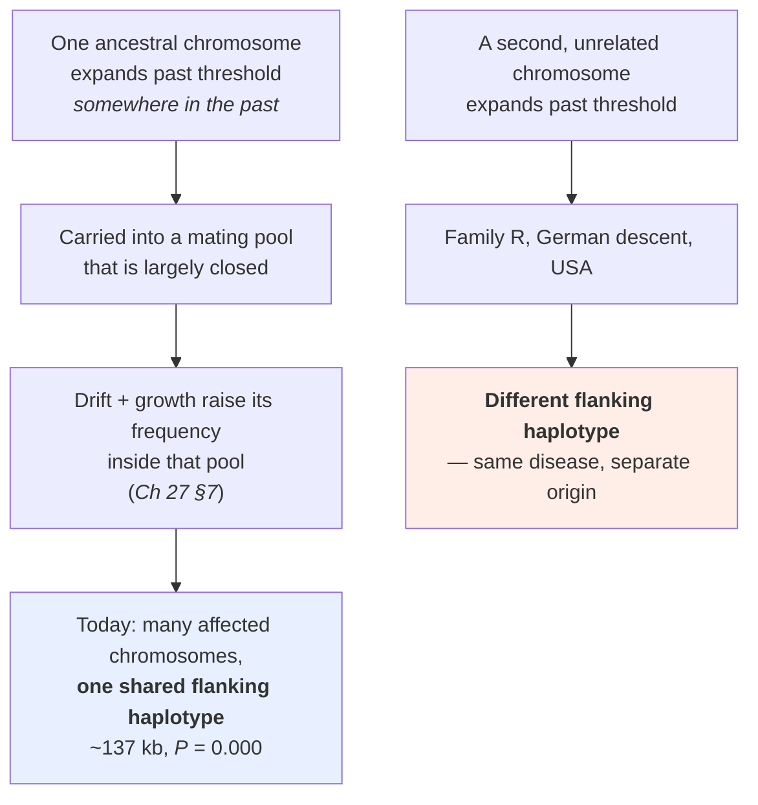
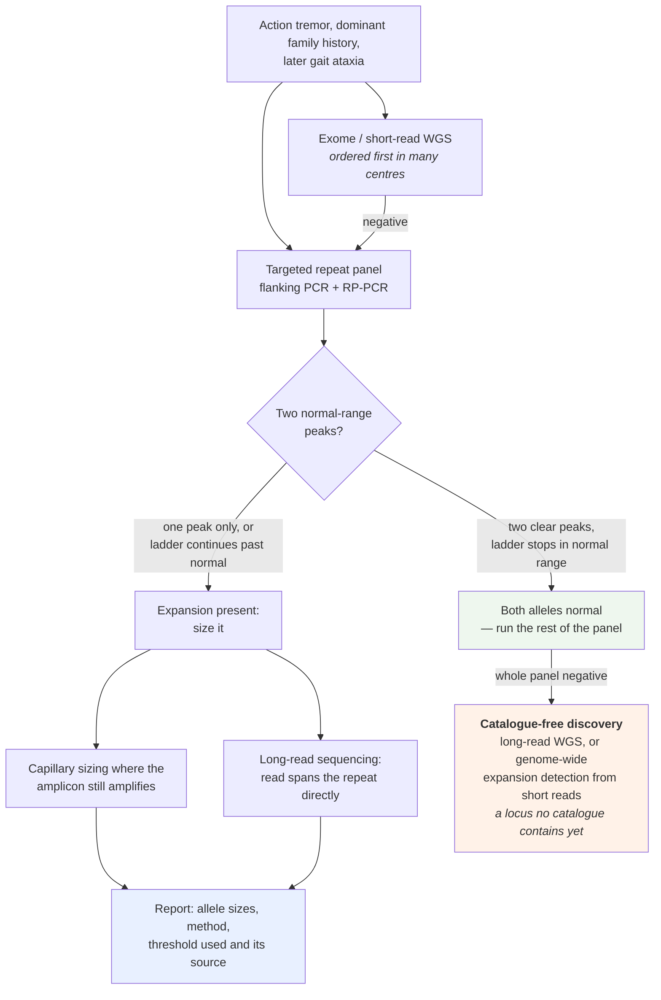

# D5 — SCA12 II: population, clinic, therapy

> **Before this:** [D4 — SCA12 I: from repeat to phenotype](D4-sca12-from-repeat-to-phenotype.md) · [Ch 15 Pedigrees](../part-02-transmission-genetics/15-pedigrees.md) · [Ch 26 Hardy–Weinberg](../part-05-population-genetics/26-hardy-weinberg.md) · [Ch 27 The four forces](../part-05-population-genetics/27-the-four-forces.md) · [Ch 28 Structure and inbreeding](../part-05-population-genetics/28-structure-and-inbreeding.md) · [Ch 55 Clinical variant interpretation](../part-11-human-and-statistical-genomics/55-clinical-variant-interpretation.md) · [Ch 57 Genomics in practice](../part-12-applications-and-ethics/57-genomics-in-practice.md) · [Ch 58 Ethics and society](../part-12-applications-and-ethics/58-ethics-and-society.md) · **Time:** ~60 min
>
> **Statistics needed:** [S1 Probability](../part-S-statistics/S1-probability.md) · [S3 Sampling and estimation](../part-S-statistics/S3-sampling-and-estimation.md) ·
> [S4 Hypothesis testing](../part-S-statistics/S4-hypothesis-testing.md) · [S5 Variance and regression](../part-S-statistics/S5-variance-and-regression.md) ·
> [S6 Likelihood and Bayes](../part-S-statistics/S6-likelihood-and-bayes.md)

## What you'll be able to do

- Explain why a disease that is a global rarity is one of the two commonest spinocerebellar ataxias in Indian referral cohorts, using founder effect, endogamy and drift — and say exactly which of those three does the work for a *dominant* allele.
- State what the SCA12 founder haplotype proves, what it does not prove, and why no honest per-100,000 prevalence figure for SCA12 exists anywhere.
- Design the diagnostic pathway for a suspected repeat expansion, derive from read length alone why exome and short-read genome sequencing miss it, and read a repeat-genotyping report critically — including the strand, the unit and the source of the threshold.
- Run a full Bayesian predictive-risk calculation for an asymptomatic person with an affected parent, propagate age-dependent penetrance and intermediate-allele uncertainty through it, and recognise when the calculation cannot be completed with published inputs.
- Lay out the antisense strategy space for a putative *over*expression disease, and show why the sign of the intervention flips depending on which unresolved mechanism is true.
- Convert each open question in SCA12 into a research question with a discriminating experiment attached — and then assemble the whole track into a dossier that argues for one of them.

## The core idea

D4 left you with a locus whose association with disease is beyond argument and whose mechanism is not. This chapter is about everything that has to happen anyway while the mechanism stays unresolved: people get diagnosed, families ask what their children's risk is, and somebody has to decide what a first therapeutic programme would even target.

Three things make SCA12 an unusually clean teaching case for that predicament. The **population** story is a textbook founder effect that you can work through with nothing more than [Ch 27](../part-05-population-genetics/27-the-four-forces.md) and a haplotype. The **diagnostic** story is a case where the standard modern test — sequence the exome, then the genome — is guaranteed to return nothing, for a reason you can derive from the read length in one line of arithmetic. And the **therapeutic** story is the sharpest possible demonstration that mechanism is not academic: the same molecule, an antisense oligonucleotide, is either the obvious drug or an actively harmful one depending on which way a single arrow points.

> **Diagnosis, risk and therapy are three different epistemic problems, and SCA12 fails them in three different places.** Diagnosis is solved: size the repeat, and if it is long enough in the right clinical context, you are done. Risk is *unsolved for a boring reason* — nobody has published the age-at-onset survival curve you would need, so the arithmetic runs but the inputs are missing. Therapy is unsolved for an interesting reason: the mechanism is contested in *direction*, not just in detail. Do not let the confidence of the first bleed into the other two.

---

## 1. The population story: a global rarity that is an Indian commonplace

SCA12 was found in a single four-generation family of German descent living in the United States — the pedigree usually called family "R" — and for a few years afterwards it looked like a curiosity. Screening series outside India kept coming back nearly empty. A French/European ataxia screen found **1 family among 247 index cases** (Fujigasaki et al. 2001). A survey of familial essential tremor found pathogenic short-tandem-repeat expansions in **6 of 515 probands**, of which **exactly one** was *PPP2R2B* (Zhou X et al. 2024). Italian, Thai and Turkish cohorts have been screened; the yield is sporadic.

Then look at India.

| SCA subtype | Share of ataxia referrals, pan-India, 10 years, ≈5,600 patients |
|---|---|
| **SCA12** | **8.6% (490)** |
| SCA2 | 8.5% (482) |
| SCA1 | 4.8% (272) |
| SCA3 | 2.0% (113) |

*(Sharma et al. 2022, Adv Genet 3(2):2100078.)* An earlier and much smaller series from AIIMS, North India, put SCA12 at **~16% (20/124)** of autosomal dominant ataxia (Bahl et al. 2005), which is where the familiar line "the second commonest SCA in India" comes from. In the larger series SCA12 is fractionally *ahead* of SCA2 — by 0.1 percentage points, which is well inside the noise of two counts near 485. The honest statement is that **SCA12 and SCA2 are jointly the commonest SCAs in Indian referral cohorts**, and anyone who ranks them is over-reading a margin of eight patients.

### 1.1 Read that table as a sample, not as a population

The single most common misuse of the numbers above is to convert them into a prevalence. They are **referral fractions**: the denominator is people who reached a tertiary ataxia genetics service and got tested, not people who exist. Every ascertainment pathology in [Ch 54 §11](../part-11-human-and-statistical-genomics/54-rare-variants-and-mendelian-disease.md) and [S3](../part-S-statistics/S3-sampling-and-estimation.md) applies at full strength: SCA12's presenting sign is tremor, which means an SCA12 patient may spend years in a movement-disorders clinic labelled essential tremor before anyone orders an ataxia panel, and one would expect the panel to be ordered more readily where the diagnosis is already famous — a mechanism that would inflate the fraction in exactly the communities the founder story names.

So: **no published prevalence estimate for SCA12 exists, in India or anywhere.** STRchive carries `prevalence: null`; neither GeneReviews nor Orphanet gives a rate. That gap is not an oversight in this chapter. It is the state of the literature, and a course that quoted a per-100,000 figure would be inventing one.

### 1.2 The founder result, and how it was actually proved

Bahl et al. 2005 typed **20 Indian SCA12 families** plus ethnically matched controls with **four novel SNPs and a dinucleotide marker spanning ~137 kb downstream of the CAG repeat**. One haplotype was significantly associated with the affected alleles at ***P* = 0.000** as reported — which is a printout rounding to three decimals, not a probability of zero. No *p*-value is zero; read it as ***P* < 0.001** ([S4](../part-S-statistics/S4-hypothesis-testing.md)). Expanded alleles in those families ran **51–69 CAG**.

The second half of the result is the half that makes it a mechanism rather than a description: **the same haplotype was not present on the American pedigree's expanded chromosome.** The expansion has therefore arisen **independently at least twice**.



This is the same logic as the Ashkenazi *BRCA1* and Tay–Sachs alleles and Ellis–van Creveld among the Old Order Amish, which [Ch 27 §7](../part-05-population-genetics/27-the-four-forces.md) works through; SCA12 simply supplies a South Asian instance, and one where the *negative* control — a second population with the same disease and a different haplotype — was available.

**What the founder haplotype proves.** That the expanded chromosomes in those 20 Indian families descend from a common ancestral chromosome. Recombination erodes shared haplotype around a variant every generation ([Ch 29](../part-05-population-genetics/29-linkage-disequilibrium.md)), so a block of shared haplotype spanning ~137 kb across 20 unrelated families is not something independent mutations produce.

**What it does not prove.** Four things, and they are all routinely asserted anyway:

1. **It does not date the founder.** Turning haplotype length into an age needs a local recombination rate and an explicit model; none of the sources this course is built on report such an estimate for SCA12, so this chapter does not give one.
2. **It does not identify where the expansion happened.** A founder haplotype says "one ancestor", not "one place". The affected families belong to an endogamous community originating in Haryana, usually named as **Agarwal** — but community membership today locates the *descendants*, not the mutational event.
3. **It does not make the locus a mutational hotspot.** See the misconceptions table; this is the single most common error made about founder diseases.
4. **It does not make the disease exclusive to that community.** Ganaraja et al. 2022, in 49 patients from 42 families, found **79.6% Agarwal, 10.2% explicitly non-Agarwal and 10.2% undisclosed or unclear**, with about 70% of patients from north and north-east India and **18% from southern India**. Their conclusion is explicit: SCA12 is not confined to a single ethnicity. Choudhury et al. 2018 found 20 of 21 patients Agarwal, which is the same picture from a smaller and more locally recruited sample. **Founder-enriched, not founder-restricted.**

### 1.3 Endogamy: which force is actually doing the work

Here is a trap worth spending a paragraph on, because the intuition most people import is wrong for this disease.

Endogamy raises the probability that two alleles at a locus are identical by descent, which raises homozygosity, which raises the incidence of **recessive** disease. That is the machinery of [Ch 15 §6](../part-02-transmission-genetics/15-pedigrees.md) and [Ch 28 §2](../part-05-population-genetics/28-structure-and-inbreeding.md) and [Ch 28 §4](../part-05-population-genetics/28-structure-and-inbreeding.md), and it is the reason communities with high mean *F* carry a raised burden of recessive conditions.

**SCA12 is dominant.** A carrier is affected — insofar as they are affected at all — with one copy. The inbreeding coefficient *F* has essentially nothing to do with its frequency. Srivastava et al. 2017 in fact identified two biallelic carriers, one homozygous **CAG-45/45** and one compound heterozygous **CAG-42/51**, and neither differed from heterozygous CAG-51 carriers in age at onset or severity — **no dosage effect detected**, in a sample of two. Homozygosity, when it happened, did nothing visible.

So what does endogamy contribute? **It closes the mating pool.** A closed pool is its own drift unit with its own effective size ([Ch 27 §4](../part-05-population-genetics/27-the-four-forces.md)), so a founder allele that would have been diluted into a large panmictic population instead stays concentrated where it started and rises or falls on drift alone. When you then pool that community with the rest of the country and compute a single allele frequency, you get the Wahlund situation of [Ch 26 §8](../part-05-population-genetics/26-hardy-weinberg.md): the pooled frequency describes nobody. The clinical face of Wahlund is that the pre-test probability of SCA12 for a patient with action tremor and a family history is **not one number for India**; it depends on the community the patient comes from, which is uncomfortable, informative, and a live group-harm question ([Ch 58 §5](../part-12-applications-and-ethics/58-ethics-and-society.md)).

### 1.4 The general lesson

Rare-disease geography is population history. A "rare" disease is rare *in the populations that have been looked at*, with the instruments that were used, in the referral systems that existed. SCA12's global rarity is partly a real founder story and partly an artefact of where ataxia genetics grew up: Dong, Wu & Wu 2015 concluded outright that SCA12 "may be underdiagnosed in Chinese populations", and the ancestry bias of genomic resources ([Ch 58 §6](../part-12-applications-and-ethics/58-ethics-and-society.md)) predicts exactly that pattern — a disease looks rare until somebody assays for it in the population that carries it.

---

## 2. Diagnosis: why a negative genome is not an answer

### 2.1 Derive the failure, do not memorise it

Short-read whole-genome sequencing of the 1000 Genomes 30× kind produces **150 bp paired-end reads**. To measure a repeat by sequence, a read must contain the whole repeat plus enough unique flanking sequence at both ends to anchor it. Count:

```
    150 bp read  /  3 bp per CAG unit  =  50 units, with ZERO flanking sequence
    minus anchor sequence at both ends  ->  fewer than 50 units, in practice well fewer
```

The SCA12 pathogenic threshold — **≥51 units** by the classical convention — sits almost exactly at the point where the read stops being able to see the allele. That coincidence is a gift to teaching and a disaster in the clinic.

What happens to the reads that come from inside a long repeat is worse than "missing". A read consisting entirely of CAG matches every position within the repeat equally well, and matches other CAG tracts genome-wide, so the aligner gives it low or zero mapping quality, places it at the wrong locus, or leaves it unaligned. The expansion does not show up as a variant with poor support; it shows up as **nothing at all**, in a region that looks adequately covered. [Ch 46 §10](../part-10-functional-genomics/46-variant-calling.md) makes the general case for tandem repeats, and [Ch 46 §13](../part-10-functional-genomics/46-variant-calling.md) notes that repeat expansions are excluded from benchmark confident regions — meaning a caller's published sensitivity figures were never measured on this class of variant.

Exome sequencing fails for an additional and even simpler reason on top of this one: the SCA12 repeat is annotated to the **5′ UTR**, and 5′ UTRs are captured unevenly by most exome bait designs, which target coding sequence ([Ch 40 §8](../part-09-genomics/40-sequencing-technologies.md)). [Ch 54 §9](../part-11-human-and-statistical-genomics/54-rare-variants-and-mendelian-disease.md) puts the whole class in one row of its where-the-answer-is-hiding table: repeat expansions are "invisible by construction — the read is shorter than the repeat", with targeted repeat genotypers and long reads as the remedy. D3 develops the class-wide version of this argument; [lab 11](../labs/lab-11-repeat-genotyping.md) makes you watch it happen on real data.

> **"Negative exome, negative genome" is a statement about the assay, not about the patient.** For a phenotype with action tremor, later ataxia and a dominant family history, a negative short-read result should *raise* your posterior on a repeat expansion, because it has eliminated the alternatives that short reads are good at. The correct next step is a test designed for repeats, not a bigger sequencing panel.

### 2.2 The pathway

What follows is the ordinary rare-disease diagnostic path ([Ch 57 §1](../part-12-applications-and-ethics/57-genomics-in-practice.md)), run for a variant class that path was not designed around.



**Flanking PCR plus capillary fragment sizing** puts primers in unique flank and reads the product size. For normal-range alleles it gives the repeat number exactly. Its failure mode is the classic trap in the whole field: large GC-rich amplicons amplify poorly or not at all, so **a homozygous-normal result and a normal-plus-unamplifiable-expansion result look identical — one peak.** A single peak is not a genotype. It is a question.

**Repeat-primed PCR** (Warner et al. 1996, *J Med Genet* 33:1022–1026) answers that question. One primer sits in unique flank; the other anneals *inside* the repeat at many offsets. Products ending at every possible position within the tract produce a **ladder of peaks at 3 bp intervals** on capillary electrophoresis. If the ladder stops inside the normal range, there is no expansion. If it continues past it, there is. What RP-PCR **cannot** tell you is the size of a large expansion — the ladder decays and merges before the true end of a long allele, so the result is "expanded, ≥ N", not a number.

**Southern blot** sizes alleles far beyond any PCR, at the cost of being slow, low-throughput and needing micrograms of DNA. For SCA12 it is rarely the deciding test, because clinically observed SCA12 alleles are short by the standards of *FMR1* or *DMPK* — the largest reported is 78 units, which is 234 bp of tract.

### The differential, in one page

Nothing above is a licence to test one locus. Late-onset action tremor that later acquires ataxia, in a dominant pedigree, is the presenting picture of a dozen repeat loci, and the assay that finds one finds the rest from the same sample. Order a panel, and know what has to be on it.

A defensible ataxia-plus-tremor repeat panel carries the coding CAG loci (*ATXN1*, *ATXN2*, *ATXN3*, *CACNA1A*, *ATXN7*, *TBP*, *ATN1*), the non-coding ataxia loci (*ATXN8OS*/*ATXN8*, *ATXN10*, *PPP2R2B*, *FGF14*, *RFC1*), and the two loci a movement-disorders clinic will otherwise never think to order because they arrive as tremor rather than as ataxia — *FMR1* and *NOTCH2NLC*. **Different motifs need different chemistry.** A CAG flanking PCR designed around *ATXN3* does not see a deep-intronic GAA; and *RFC1* is not a length change at all but a **motif substitution** — a benign (AAAAG) or (AAAGG) tract replaced by a pathogenic (AAGGG) one, biallelic — so a panel that reports lengths and nothing else will call it normal at exactly the locus it was asked about. [D3](D3-repeat-expansion-disorders.md) develops that class-wide argument.

Two of the loci on that list are the mimics D3 teaches by name, and each is separated from SCA12 by a single molecular fact.

| Mimic | The one fact that separates it |
|---|---|
| **FXTAS** (*FMR1*, CGG in the 5′ UTR) | The disease allele is the **premutation, 55–200**, and *not* an expansion of it — above ~200 the locus is methylated and silent, so the full mutation cannot cause FXTAS. It is **X-linked**, and therefore chiefly a male phenotype: penetrance in male premutation carriers runs **17% at 50–59, 38% at 60–69, 47% at 70–79 and 75% at ≥80**, against 16–20% in female carriers over 50. Late-onset tremor with ataxia in a man whose daughter's children have fragile X is *FMR1* until sized |
| **SCA27B** (*FGF14*, GAA in deep intron 1) | Different motif, different location, and a different order of magnitude: **≥250 units, ≥300 fully penetrant**, against SCA12's alleles, which reach only 78 and whose floor is argued about anywhere between 40 and 51 (§2.5). Dominant, and — on the 2023 discovery cohort, where it was found in **61% of French-Canadian index patients** — among the commonest causes of late-onset ataxia yet described |

Two lines each is deliberate. **This is a genetics course, not a neurology text.** The bedside discriminators a neurologist reaches for first are outside this course's fact base and are not reproduced here; what is taught is the molecular difference, because that is the part that decides which assay you order and how you read what comes back.

**And if the whole panel is negative, the answer is not a bigger panel.** A panel is a catalogue, and a catalogue contains only loci somebody has already found — which is precisely how *FGF14* and *RFC1* survived three decades of ataxia genetics and fifteen years of short-read sequencing of the right patients. The next step is **catalogue-free**: long reads across the genome, or genome-wide expansion detection from short reads by anchored in-repeat reads (ExpansionHunter Denovo, Dolzhenko et al. 2020, *Genome Biol* 21:102) or by *k*-mer counting (STRling, Dashnow et al. 2022, *Genome Biol* 23:257). Note what those tools return: they **detect** an expansion, they do not precisely genotype it, so a hit from them opens a workup rather than closing one. [Lab 11](../labs/lab-11-repeat-genotyping.md) runs the catalogued route and the long-read route on the same locus, which is where the limitation stops being an abstraction.

### 2.3 Computational sizing, and the coordinate discipline it demands

ExpansionHunter-class tools genotype known repeat loci from short-read alignments by classifying reads into three kinds:

| Read class | What it contains | What it tells you |
|---|---|---|
| **Spanning** | the whole repeat plus both unique flanks | the allele size, exactly — but only for alleles shorter than the read |
| **Flanking** | starts in unique flank, ends inside the repeat | a lower bound on the allele |
| **In-repeat (IRR)** | nothing but repeat sequence | that the allele exceeds the read length; counted, with anchoring mates, to estimate how far beyond |

*PPP2R2B* is one of the **31 loci** in the default Illumina hg38 variant catalog, and its entry is small enough to read whole:

```json
{"LocusId": "PPP2R2B", "LocusStructure": "(GCT)*", "ReferenceRegion": "chr5:146878727-146878757", "VariantType": "Repeat"}
```

Three things in that one line deserve your attention, and each of them is a bug waiting to happen.

**The coordinates are 0-based half-open.** The catalog documentation says so explicitly. In 1-based samtools/VCF convention the same interval is **chr5:146,878,728–146,878,757 (GRCh38)**. [Ch 41](../part-09-genomics/41-data-formats.md) owns this distinction; here it is the difference between a 30 bp interval and a 31 bp one, which is the difference between 10 and 10.33 repeat units. STRchive gives the interval as chr5:146878727–146878759 — two extra base pairs of locus definition, which is ordinary annotation fuzz rather than a disagreement about where the repeat is.

**The motif is `GCT`, not `CAG`.** *PPP2R2B* is transcribed from the **minus strand**. The same physical tract reads CAG on the mRNA and CTG on the plus strand of the reference, and a trinucleotide repeat has no canonical phase, so databases publish cyclic rotations of it: `(CAG)n` in the clinical literature, `(AGC)n` in STRchive's gene orientation, `(GCT)n` in the catalog, `(CTG)n` on a genome browser track. **Four spellings, one ~32 bp reference element** — 30 bp / 10 units as the ExpansionHunter catalog defines it, 32 bp / 10.7 units as STRchive defines it, which is exactly the locus-definition fuzz described above. Never infer a different locus from a different motif spelling.

**Even the region annotation is contested between authoritative databases.** STRchive annotates the repeat as **5′ UTR**; the gnomAD v4 API returns `region: "coding: polyserine"` for the identical interval. Both are correct against the transcript each one chose, at a gene with multiple alternative first exons and ten annotated RefSeq transcript variants. Teach the disagreement rather than picking a side; D4 works through why the gene's architecture makes the question genuinely ill-posed.

Long reads dissolve the whole problem. In GIAB HG002 PacBio HiFi data the mean read length over this locus is **14,552 bp**, and 53 reads individually span the repeat — a 14 kb read contains the longest clinically observed SCA12 allele about sixty times over, so the allele size is read off the alignment with no inference at all ([Ch 40 §3](../part-09-genomics/40-sequencing-technologies.md)). Tools such as TRGT additionally report methylation at the repeat from the same HiFi data. [Lab 11](../labs/lab-11-repeat-genotyping.md) runs both routes on the same locus and makes you compare them.

### 2.4 What a clinical report contains — and what to interrogate in it

A defensible SCA12 report names all of the following. Where one is missing, the number is uninterpretable.

| Element | Why it matters |
|---|---|
| Gene and reference transcript | ClinVar anchors the benign call as `NM_181675.3(PPP2R2B):c.27CAG[(7_28)]` (RCV000005966). A `c.` position is meaningless without its transcript, and this gene has ten |
| Assembly for any coordinate | GRCh38 chr5:146,878,728–146,878,759 and GRCh37 chr5:146,258,291–146,258,322 are the same repeat, both as STRchive publishes them — and note that other sources bound the locus slightly differently, per §2.3. A coordinate without a build is meaningless |
| Method, per allele | "Sized by capillary electrophoresis" and "expansion detected by RP-PCR, size estimated" are different epistemic objects. Only one is a measurement |
| **Both** allele sizes | A single reported number invites the one-peak trap of §2.2 |
| The unit counted | **Pure CAG units on the sense strand.** A laboratory reporting base pairs, or plus-strand CTG counts, or counts that include flanking sequence, will give a different number for the same allele. Always ask what was counted |
| The interpretation ranges used, **with their source** | See §2.5. There is no single field-wide threshold to cite |
| Measurement uncertainty | Computational genotypes beyond the read length come with a confidence interval — ExpansionHunter reports `REPCI` alongside `REPCN` for exactly this reason — and reporting the point estimate alone is a misrepresentation |

### 2.5 The threshold problem, laid out honestly

| Source | Normal | Intermediate / uncertain | Pathogenic |
|---|---|---|---|
| GeneReviews, retired SCA12 chapter (2011, retired 2018) | 4–32 | threshold "not clear"; 40–62 seen with variable, late or no onset | **≥51 diagnostic** in the right clinical context |
| STRchive (`SCA12_PPP2R2B`, 2026) | 6–32 | **40–49** | **51–78** |
| Srivastava et al. 2017, *Brain* 140(1):27–36 | 4–31 | reclassifies **43–50** as *intermediate pathogenic* | proposes **≥43** as the threshold |
| ClinVar RCV000005966 | benign call anchored at 7–28 | — | — |
| Holmes et al. 2001, *Brain Res Bull* 56(3–4):397–403 | 9–28 | — | 55–78 |
| National Ataxia Foundation patient page | 4–31 | 32–49, "uncertain, active research" | ≥50 |

What is actually agreed: **≥51 CAG in a person with a compatible phenotype is diagnostic, and ≤31 is normal.** Everything between 32 and 50 is disputed. The floor has moved downward repeatedly — a **CAG-46** allele described as "probably the shortest pathogenic allele" (Dong, Wu & Wu 2015), then **CAG-43** proposed as the threshold on 18 patients with 43–50 repeats from 16 unrelated families (Srivastava et al. 2017), then symptomatic patients reported at **40 and 42** with a consistent clinical phenotype (Ganaraja et al. 2022). Pushing the other way, within one family in the Srivastava series, **CAG-39 carriers were unaffected**.

Two consequences follow, and both are clinical rather than academic.

**A 44-repeat allele must be reported as "in a range where pathogenicity is reported but not established", never as "negative".** The report is describing the state of a literature, not the state of a patient.

**ACMG/AMP does not fit this variant class.** The framework of [Ch 55 §1–§3](../part-11-human-and-statistical-genomics/55-clinical-variant-interpretation.md) was built for SNVs and small indels: PS3 functional evidence, PM2 population rarity, PP1 segregation, all combining through the Bayesian points system of [Ch 55 §3](../part-11-human-and-statistical-genomics/55-clinical-variant-interpretation.md). A repeat length is a *continuous* variable with a disputed cut point and a reduced-penetrance band, so "the variant" is not a fixed object to be classified once. Population frequency, which [Ch 55 §4](../part-11-human-and-statistical-genomics/55-clinical-variant-interpretation.md) treats as a workhorse, is unavailable here for a mundane reason: STR calls in short-read population databases are unreliable at exactly the lengths that matter. And the reclassification obligation of [Ch 55 §9](../part-11-human-and-statistical-genomics/55-clinical-variant-interpretation.md) bites unusually hard, because every downward revision of the threshold retrospectively changes the meaning of every report issued at 43–50.

Finally, do not lean on imaging to break a tie. In a genetically confirmed cohort of 49, **6.1% had a normal MRI**; a second cohort had two patients of short disease duration with no atrophy at all. Imaging in SCA12 is supportive, never a rule-out.

---

## 3. Counselling: the calculation, and its missing input

The consultand is 30 years old, healthy, and has an affected parent. They want a number.

The number is a posterior, and the machinery is exactly the four-row table of [Ch 15 §5](../part-02-transmission-genetics/15-pedigrees.md): prior from the pedigree, conditional likelihoods from the evidence, joint, normalise. The **Worked example** below runs it in full. What §3 does is name the three layers of uncertainty that have to be pushed through the arithmetic, because two of them are not present in the DMD calculation of Ch 15 and one of them is genuinely unresolvable with today's literature.

**Layer 1 — transmission.** An autosomal dominant allele in a heterozygous affected parent goes to each child with probability 1/2. This layer is clean and is the whole of the prior.

**Layer 2 — age-dependent penetrance** ([Ch 11 §8](../part-02-transmission-genetics/11-beyond-mendel.md)). Being unaffected at 30 is evidence, and evidence has to enter as a likelihood: P(unaffected at 30 | carrier) versus P(unaffected at 30 | non-carrier). The second is 1. **The first requires a cumulative age-at-onset distribution for SCA12, and none has been published.** What exists is a scatter of cohort means and ranges that disagree with one another by two decades:

| Cohort | Mean age at onset | Range |
|---|---|---|
| Retired GeneReviews chapter (index family and early reports) | "fourth decade", 34–38 yr | 8–62 |
| STRchive typical onset window | 26–50 yr | 8–62 |
| Choudhury et al. 2018, India, n = 21 | **51.33 ± 8.98 yr** | 41–69 |
| Ganaraja et al. 2022, India, n = 49 | **46.38 ± 11.7 yr** | — |
| Srivastava et al. 2017, India, CAG 43–50 | 58.3 yr | 35–72 |
| Srivastava et al. 2017, India, CAG-51 group | 54.1 yr | — |

The German-American index family looks like a fourth-decade disease; the Indian cohorts look like a fifth-to-sixth-decade disease. No paper resolves it. Ascertainment (the index family was found *because* it was severe), repeat-length differences between founder populations and modifier background are all candidates; none is demonstrated. There is no SCA12 analogue of the parametric survival model that exists for Huntington disease, and this course will not manufacture one.

**Layer 3 — allele-size uncertainty.** If the parent's allele has been sized at, say, 57 repeats, that sits inside the band where non-penetrance and very-late onset have been observed — carriers of **45–62** repeats have been reported with very-late-onset disease or **no disease at all**, while complete penetrance was documented in the index family at **66–78**. That is a reduced-penetrance band in the sense of [Ch 11 §8](../part-02-transmission-genetics/11-beyond-mendel.md), and the *HTT* CAG thresholds worked through there are the comparison to hold beside it. If the parent's allele is 44, inheritance does not even settle whether the consultand has a disease allele, because 43–50 is the contested band of §2.5. And you cannot infer the consultand's allele size from the parent's: expanded SCA12 repeats are described as **modestly unstable, with length variations of a few triplets among sibship members**. A few triplets is small — but at a boundary as disputed as 43 versus 51, a few triplets can be the whole question.

> **Do not counsel anticipation in SCA12.** The current GeneReviews *Hereditary Ataxia Overview* (last revised 2026-07-09) states that there is **"insufficient evidence for anticipation"**. The retired SCA12 chapter said a moderate degree of anticipation had been observed; patient-facing material from the National Ataxia Foundation says repeats typically do not expand between generations. The current position supersedes the retired one, and the honest counselling statement is that we cannot predict the child's onset from the parent's. Similarly, there is no parent-of-origin bias to report: the only dataset is 21 patients, **7 maternal, 7 paternal, 1 biparental**, which is far too small to detect one. Families arrive carrying Huntington-disease and myotonic-dystrophy intuitions — earlier and worse each generation, worst from the father — and D3 explains where those intuitions come from. They do not transfer here.

### 3.1 Predictive testing: the protocol and why it exists

Predictive testing means testing a person who has no symptoms for a condition that may declare itself decades later. The professional practice around it was built by the Huntington disease community in the years after *HTT* was cloned, because HD posed the problem in its purest form: adult onset, dominant, then untreatable, and a test that gives a nearly categorical answer.

The shape of that protocol — as a set of commitments rather than a citable document, because this course's verified-fact base does not carry the guideline texts — is: counselling before the sample is taken, and more than one session; a neurological baseline examination, so that "asymptomatic" is a finding rather than an assumption; assessment of psychological support and risk; a named support person; results delivered in person, never by post or portal; and an unconditional right to stop at any point, including after the sample is in the freezer. Predictive testing of an asymptomatic minor for an adult-onset condition with no preventive intervention is deferred until the person can consent for themselves — that is the settled professional position, and its rationale is the child's own future autonomy ([Ch 58 §4](../part-12-applications-and-ethics/58-ethics-and-society.md)).

Three things make SCA12 differ from the HD template in ways that matter at the appointment.

**The result may be uninterpretable.** An HD result of 45 CAG is a fact with an agreed meaning. An SCA12 result of 44 is a fact whose meaning is under dispute (§2.5). A predictive-testing protocol designed around "positive or negative" has to be re-engineered around a third outcome that is neither, and the consultand must be told before testing that this outcome is possible and roughly how likely it is given the family's known allele.

**There is something to offer for the symptom, and nothing for the disease.** A randomised, double-blind, placebo-controlled trial of **extended-release propranolol escalated to 240 mg/day in 60 genetically confirmed SCA12 patients** produced a significant reduction in the TETRAS performance score — the tremor rating scale defined in [D1](D1-neurons-and-the-cerebellum.md), alongside SARA, in its clinical-measurement section — plus improved activities of daily living, and improvement on SARA and SF-36, with fatigue and headache the commonest adverse effects and no discontinuations for safety (Mohapatra et al. 2026, *Mov Disord* 41(2):373–383). That is symptomatic tremor control in people who already have symptoms. It changes nothing about what a presymptomatic result buys, and it should not be presented as though it did.

**The disease is named to a community.** An SCA12 diagnosis in India carries an implicit statement about ancestry in a way that a *BRCA1* result in a European-ancestry patient usually does not, because the founder story is well known and the community is small and named. Every group-harm consideration in [Ch 58 §5](../part-12-applications-and-ethics/58-ethics-and-society.md) is live: stigma attaching to a community rather than an individual, marriage prospects in an endogamous marriage market, and research consent that no individual can give on the group's behalf. The individual-level risks of [Ch 58 §3](../part-12-applications-and-ethics/58-ethics-and-society.md) — insurance, employment — sit on top of that, not instead of it. And because SCA12 has no survival study at all (lifespan is *believed* not to be shortened, on a patient-organisation statement and on the slow course seen in every cohort; **no survival study of SCA12 has been published**), even the actuarial questions cannot be answered from the literature.

### 3.2 What is offered today

The appointment goes better when you can say precisely what follows a positive result, so say it accurately: **there is symptomatic and supportive management, and there is nothing that touches the disease.** Naming the first honestly is what stops the second from sounding like abandonment.

**Tremor.** The propranolol trial above is the whole of the drug evidence in this disease — extended-release propranolol escalated to 240 mg/day against placebo, 60 genetically confirmed patients, eight weeks, with accelerometry confirming tremor reduction in most positions (Mohapatra et al. 2026). Read the limits alongside the result, because they are what a patient will actually meet. It is **eight weeks at a single centre**, in patients aged 18–65 selected for an upper-limb TETRAS component ≥ 2; it reports a group mean, not a promise to an individual; and a beta-blocker titrated to 240 mg/day carries the ordinary cardiovascular and respiratory contraindications, which put it out of reach for some patients entirely. It remains the only claim in this subsection demonstrated in SCA12 itself. Everything below is extrapolation, and is labelled as such.

**Gait, balance, speech and aids.** Physiotherapy, gait and balance training, speech therapy for dysarthria, occupational adaptation and timed introduction of aids are what an ataxia service offers, and they are offered here on the general ataxia evidence: **no rehabilitation study in SCA12 exists in the literature this track rests on.** The need is measurable even if the intervention is not: **18.2%** of a 49-patient cohort required a walking aid, **89.8%** had impaired tandem gait and **57.1%** dysarthria (Ganaraja et al. 2022), and gait variability — step length, stance time, step time — progressed in the three patients followed for five to six years and may precede clinically obvious gait abnormality (Siddique et al. 2021). That last finding is the argument for starting before the aid is needed rather than after.

**The cognitive and psychiatric burden is a management problem, not only a trial asset.** §4.5 lists cognitive impairment as an outcome domain because it is measurable; the clinic meets it as a symptom, and early. A dedicated non-motor study found cognitive impairment in **61.76% of 34 patients**, with depression and autonomic dysfunction present in the early stages (Basu et al. 2024). Routine neurological assessment in a larger cohort recorded cognitive dysfunction in **22.4%** and psychiatric disturbance in **8.1%** (Ganaraja 2022), while a 21-patient series reported psychiatric disorders in **67%** (Choudhury 2018). Cognition differs threefold between the two cohorts that measured it (22.4% against 61.76%) and the psychiatric figures by eightfold (8.1% against 67%). The likeliest explanation is the instrument — a dedicated battery finds what a review of systems does not — but the cohorts differ in size and ascertainment too, and no source adjudicates it. The management consequence is blunt — cognition and mood have to be **asked about at every visit**, not waited for, and the family told at the outset that they are part of this disease rather than a reaction to it.

**Devices.** Deep brain stimulation has been reported in SCA12 only as single patients (Sun 2024; Shen 2025). Two case reports keep a question open; they are not an option to offer.

> **There is no SCA12-specific management guideline.** The GeneReviews SCA12 chapter was retired in 2018 and has no successor, and none of the sources this track is built on carries a management protocol for the disease. Everything in this subsection except the propranolol result is extrapolated from the ataxias generally. That is not a reason to withhold any of it — supportive management is by a wide margin the largest thing medicine currently does for SCA12 — but it is a reason to describe it to the family in exactly those terms, rather than dressing extrapolation up as evidence and then being disbelieved later when the extrapolation shows.

Reproductive options — prenatal diagnosis, preimplantation testing, or neither — are a separate conversation with its own literature and its own objections, and [Ch 58 §8](../part-12-applications-and-ethics/58-ethics-and-society.md) is where this course argues them. The point to carry from [Ch 15 §7](../part-02-transmission-genetics/15-pedigrees.md) is the division of labour: **the clinic supplies the posterior; the family supplies the loss function.**

---

## 4. Therapy: you cannot design the drug until you know the arrow

### 4.1 Start from what is actually there

Two facts frame everything in this section.

**There is no published antisense oligonucleotide, siRNA or other RNA-targeting therapeutic against *PPP2R2B* in a neurological context.** A directed Europe PMC search on 2026-08-25 returned zero such studies. **There is no disease-modifying clinical trial in SCA12.** What exists is intent: Zhou et al. 2023 propose *PPP2R2B-AS1* as a therapeutic target, and Parthaje et al. 2025 propose **repeat-stabilising drugs**. Both are discussion-section proposals.

So this section is not a review of a programme. It is the design exercise that would precede one — which is exactly the exercise the capstone asks you to do properly.

### 4.2 Why a dosage disease is, in principle, the easy case

Antisense oligonucleotides do three broadly different jobs, and this course has already met all three. They can **redirect splicing** without changing transcript abundance — the nusinersen/ISS-N1 mechanism worked through in [Ch 06](../part-01-molecular-foundations/06-rna-processing.md). They can **degrade or block a transcript**, lowering the amount of product ([Ch 24 §7](../part-04-gene-regulation/24-rna-based-regulation.md), where the lncRNA knockdown logic sits, and [Ch 37 §9](../part-08-methods/37-model-organisms-and-screens.md), where morpholinos block translation and splicing in model organisms). And, less obviously, they can **raise** a gene's output by destroying a repressive antisense transcript that was holding it down — also [Ch 24 §7](../part-04-gene-regulation/24-rna-based-regulation.md).

Now put SCA12's leading hypothesis next to that menu. It is **Hypothesis A** of the evidence table in [D4](D4-sca12-from-repeat-to-phenotype.md) — this track grades mechanism claims with D4's labels (A, A′, A′′, B, C1, C2, C3, D) and D4's three-tier ladder throughout — and it says that the expanded CAG tract acts as a *cis* element which increases transcription from the repeat-containing promoter, raising Bβ1 output. Its support is real, and the ladder grades it in three pieces: that the repeat-containing region has promoter activity rising with repeat length is **Established as a reporter-assay result** — the one arrow in D4's chain that carries that label, and D4's evidence table is careful that no whole row does; that this changes Bβ1 level in a neuron is **Supported**, with the direction disputed; that a changed level is what damages the neuron is **Conjectured**. The repeat-containing region has **promoter activity that increases with repeat length** in reporter assays (O'Hearn et al. 2015). The repeat acts as a *cis* element up-regulating *PPP2R2B*, with CREB1 and SP1 binding upstream and up-regulating and TFAP4 binding downstream and down-regulating (Lin et al. 2010). Expanded CAG raises the 7B7D transcript and Bβ1 protein in cell models, and also produces a protein bearing a long polyserine tract that triggers apoptosis (Zhou et al. 2024).

If Hypothesis A is true, SCA12 is an unusually **direct** antisense target, and for a structural reason worth stating precisely:

- On the **pure-dosage reading** of Hypothesis A — setting aside the polyserine product Zhou 2024 also reports, translated from the expanded 7B7D transcript in an overexpression model, which D4 tables separately as **Hypothesis A′** and which §5 item 5 leaves unresolved — the pathogenic species is a **normal protein in the wrong amount**, not a misfolded or chemically novel one. There is no aggregate to clear, no poisoned reading frame to avoid. If instead the polyserine product is doing the damage, both of those problems come straight back, and this bullet's conclusion fails with them.
- The therapeutic goal is therefore **restoring a level**, not eliminating a species — and a level is exactly what a knockdown oligonucleotide titrates.
- **Allele selectivity may be unnecessary.** In a poisoned-protein disease you want to silence the mutant allele and spare the wild-type one, which is technically hard. If the disease is 150% of normal output and the drug takes total output back to 100%, whose allele the removed transcripts came from does not matter.

That is the strongest version of the argument. Now break it.

### 4.3 The three ways the argument fails

**Failure 1: the arrow may point the other way.** In patient-derived **mature** neurons, most *PPP2R2B* isoforms were found to be **down**-regulated relative to controls (Kumar et al. 2024, *iScience* 27(5):109768). That is a direct contradiction of the overexpression model, in the most disease-relevant human system anyone has built. It may be reconcilable — direction of change could be cell-type- and maturation-stage-dependent — but it is not currently reconciled. And an intervention whose sign depends on an unresolved sign is not a drug candidate; it is a coin flip with a manufacturing cost.

Notice how sharply this bites on the antisense-target proposal — Hypothesis C2's molecule, pressed into service as a drug. If *PPP2R2B-AS1* is repressing the sense gene, knocking the antisense down **raises** *PPP2R2B* — the [Ch 24 §7](../part-04-gene-regulation/24-rna-based-regulation.md) logic. Under Hypothesis A that is the wrong direction. Under the Kumar picture it might be the right one. **The same molecule is the treatment or the toxin depending on which paper is right.**

**Failure 2: there is a floor under the dose, and we know where it is.** *De novo* **missense** variants in *PPP2R2B* cause a neurodevelopmental syndrome, by impairing holoenzyme incorporation, mitochondrial localisation, fission induction and Drp1 dephosphorylation (Sandal et al. 2025, *Hum Mol Genet*). That is a loss-of-function allelic series at the same gene, and it says plainly that too little Bβ function is also a disease. D2 develops what a PP2A regulatory subunit is for; the therapeutic consequence is that the target is a **dial with damage at both ends**, and any programme needs a target-engagement assay that reports *how far* the dial moved, not merely that it moved. [Ch 08 §10](../part-01-molecular-foundations/08-proteins-and-gene-function.md) is the general frame: loss, gain and poison demand different therapeutic logics, and getting the class wrong wastes the programme.

**Failure 3: the lesson from huntingtin lowering.** The transcript-lowering programmes in Huntington disease are the precedent against which any SCA12 antisense proposal will be judged, and every reviewer will invoke them. This course's verified-fact base does not carry their trial data, so what follows is the **structural** lesson rather than a report of results, and you should go and read the primary trial reports before repeating any specific claim about them: lowering the transcript of a gene that has a normal job in the adult brain is not automatically safe merely because the expanded allele is called "toxic"; dose-response for such a drug need not be monotonic; and the assay that shows target engagement must be in place before efficacy is claimed, or a negative trial cannot be interpreted. Delivery is its own bottleneck for anything that has to reach cerebellum and cortex, which is the point [Ch 38 §10](../part-08-methods/38-genome-editing.md) makes for editing and which applies unchanged here.

### 4.4 A mechanism-agnostic alternative: stabilise the repeat

There is a second therapeutic logic that does not require knowing which downstream mechanism is right, because it acts upstream of all of them: **stop the repeat from growing in somatic tissue.**

Its evidence base in Huntington disease is strong, and D3 lays it out — the genome-wide onset modifiers are overwhelmingly DNA-repair genes (*FAN1*, *MSH3*/*DHFR*, *PMS1*, *MLH1*, *PMS2*, *LIG1*, *RRM2B*/*UBR5*), MutSβ (MSH2–MSH3) binds the CAG hairpin and protects rather than removes it, and single-cell work in postmortem striatum places the pathogenic length for striatal projection neurons at roughly 150 CAG. The mismatch-repair machinery itself is [Ch 17 §5](../part-03-genome-instability/17-dna-repair.md); the germline/somatic distinction that makes any of this coherent is [Ch 16 §1](../part-03-genome-instability/16-mutation.md). Lower MSH3 activity, expand more slowly, cross the threshold later — and it does not matter whether the toxicity at the far end is protein, RNA or a RAN product.

For SCA12 the premise is **untested and the one available datum points awkwardly**. A single SCA12 brain has been studied for repeat instability across regions (Parthaje et al. 2025, *Cerebellum* 24(3):60). Somatic mosaicism was detected across brain regions — and **the cerebellum showed the *least* somatic instability**, coupled with increased methylation and lower *PPP2R2B* expression, alongside increased expression of DNA-maintenance genes. In Huntington disease the tissue that degenerates is the tissue that expands most. Here, a target tissue expanded least. The authors nonetheless suggest that drugs improving repeat stability be explored.

**n = 1.** Do not build a programme on it, and do not dismiss it either: it is the only measurement of its kind that exists, which makes replicating it a higher-value experiment than most of the mechanism work being done. On D4's ladder, somatic expansion as a driver of onset is **Supported** in Huntington disease and **Conjectured** in SCA12 — not because it is implausible here, but because one brain is not a measurement of a mechanism. The attraction of the strategy is that it is agnostic between A, A′, A′′, B, C1, C2 and C3 alike; the cost is that its own premise sits at the bottom of the ladder in the disease you would be treating.

### 4.5 The ultra-rare-disease trial problem

Suppose the mechanism resolved tomorrow. Could a trial be run?

**What SCA12 already has**, and it is more than most ultra-rare diseases:

| Asset | Detail |
|---|---|
| Outcome measures validated in an actual RCT | TETRAS performance score, TETRAS ADL+PS, SARA, SF-36, accelerometry (Mohapatra et al. 2026, n = 60) |
| A demonstrated ability to recruit | 60 genetically confirmed patients, ages 18–65, recruited and randomised at a single centre |
| Longitudinal progression data | 3 patients over 5–6 years; gait variability of step length, stance time and step time progressed and may precede clinical gait abnormality (Siddique et al. 2021) |
| An objective motor biomarker | Machine learning on reaching kinematics separates SCA12 from essential tremor at **83.3%** accuracy (Bayen et al. 2026) |
| Candidate fluid biomarker | Plasma Aβ40 significantly decreased, Aβ42/Aβ40 ratio increased (Banerjee et al. 2026) |
| Candidate blood transcript biomarker | Five mitochondrial quality-control genes down in patient PBMCs (Ansari et al. 2026) |
| A non-motor outcome domain | Cognitive impairment in **61.76%** of 34 patients, with depression and autonomic dysfunction present early (Basu et al. 2024) |

**What it does not have**: a multi-site prospective natural-history cohort with annualised SARA progression rates — the SCA12 equivalent of the large European ataxia natural-history consortia; a fluid biomarker replicated in a second cohort; a published, characterised animal model with a progressive phenotype (humanised knock-in mice carrying 10 or 80 CAG are described in methods sections and grant records, but no peer-reviewed characterisation of their phenotype could be located); and any target-engagement assay at all.

Read that pair of lists together and the priority ordering falls out without argument. **A natural-history study is the rate-limiting asset, not a mechanism paper.** Without an annualised progression rate you cannot power a trial, cannot choose a duration, and cannot interpret stability in a treated arm.

And this is where the population story of §1 stops being background and becomes strategy. A pan-India referral series accumulated **490 genetically confirmed SCA12 patients in ten years**, referred from across India to a single tertiary genetics centre (Sharma et al. 2022), in a founder-enriched population whose expanded chromosomes share a haplotype. Every one of those properties is a trial-feasibility asset: recruitment density, an existing genotyped cohort, and — because the expanded alleles sit on a common haplotype — a plausible route to allele-selective targeting via a linked variant, if allele selectivity ever proves necessary. *(That last point is an inference from the Bahl 2005 haplotype result, not a published proposal; no allele-selective silencing work for* PPP2R2B *exists in the literature this course is built on.)*

The obligations that come with it are equally clear. A programme that recruits its cohort from one community in India and then prices or licenses the resulting therapy for elsewhere reproduces exactly the equity failure that [Ch 58 §6](../part-12-applications-and-ethics/58-ethics-and-society.md) documents. Benefit-sharing is not an afterthought to the trial design; for a founder-population disease it is part of it.

---

## 5. The open questions, as answerable research questions

Each item below is unresolved as of this writing, and each is paired with the kind of study that would settle it. This is the menu for the capstone in §6: pick one, and the mock grant aim writes itself.

1. **Where is the pathogenic threshold?** GeneReviews (retired) says ≥51 is diagnostic; Srivastava 2017 argues ≥43; Ganaraja 2022 reports symptomatic patients at 40 and 42. *What would settle it:* repeat-length distributions in large, **population-matched** control samples from the same communities as the cases, plus prospective follow-up of intermediate-allele carriers. The critical missing quantity is not the case distribution — it is the control distribution in the *same* population.

2. **Is Bβ1 up or down in SCA12 neurons?** (Hypothesis A.) Zhou 2024 shows expansion raising Bβ1; Kumar 2024 shows most *PPP2R2B* isoforms down in mature patient neurons. *What would settle it:* isoform-resolved quantification in matched patient and isogenic-control neurons at several maturation stages, in one laboratory, with the same assay — long-read or targeted isoform RNA-seq rather than gene-level counts ([Ch 47 §7](../part-10-functional-genomics/47-rna-seq.md)). The isogenic 73-CAG line already exists, which removes the usual excuse.

3. **Does the Bβ2 mitochondrial mechanism apply to SCA12 at all?** (Hypothesis B.) Every supporting experiment overexpresses Bβ2 artificially, and the repeat is not in the 5′ region of the Bβ2 transcript. *What would settle it:* measure Bβ2 specifically — transcript and protein — in patient neurons carrying the expansion, without overexpressing anything.

4. **Does any RAN product exist in SCA12 human brain?** (Hypothesis C3.) RAN translation is demonstrated in cells and iPSC neurons; it has never been shown in patient brain tissue. *What would settle it:* frame-specific antibodies or targeted mass spectrometry on autopsy tissue — which requires the tissue, which is the binding constraint.

5. **Which frame(s) matter?** (A′ against C3.) Both groups report a polyserine product. What is unreconciled is polyglutamine from the sense CAG frame (Delhi) versus polyalanine from the antisense ORF, with polyleucine and polycysteine explicitly absent (Hopkins). *What would settle it:* a blinded cross-laboratory comparison on shared constructs and shared lines.

6. **Does SCA12 show anticipation?** Current GeneReviews: insufficient evidence. *What would settle it:* parent–child pairs with **both** alleles sized by the same method and onset ages recorded prospectively — the retrospective designs that produced the original claims cannot escape ascertainment bias ([Ch 11 §11](../part-02-transmission-genetics/11-beyond-mendel.md), [Ch 16 §9](../part-03-genome-instability/16-mutation.md)).

7. **Is there a parent-of-origin effect?** One dataset, n = 21, 7 maternal versus 7 paternal. *What would settle it:* the same transmission dataset as (6), powered by pooling across the Indian centres — a study that is a matter of consortium logistics, not of technology.

8. **Why does the cerebellum show the *least* somatic instability while being a target tissue?** One brain. *What would settle it:* region-resolved, ideally single-cell repeat sizing in several more brains, alongside methylation and expression ([Ch 16 §1](../part-03-genome-instability/16-mutation.md), [Ch 17 §5](../part-03-genome-instability/17-dna-repair.md)).

9. **Why is onset around the fourth decade in the German-American index family and the fifth-to-sixth in Indian cohorts?** *What would settle it:* harmonised onset ascertainment plus repeat sizing across both populations, with modifier genotyping — the same design that answered the analogous question in Huntington disease.

10. **Does repeat length predict onset age?** *r* = −0.760 in one Indian cohort; no significant correlation in another; *r* = −0.65 across 124 unrelated patients in a third analysis. *What would settle it:* a single pooled analysis with per-cohort effects modelled explicitly rather than three separate correlations reported ([S5](../part-S-statistics/S5-variance-and-regression.md)).

11. **What is the true prevalence?** No per-100,000 estimate exists. *What would settle it:* population-based rather than referral-based ascertainment — the hard, unglamorous study that nobody funds.

12. **Is SCA12 confined to the Agarwal community?** No: 10.2% of one cohort were explicitly non-Agarwal and 18% came from southern India. *The remaining question* is what the allele frequency actually is outside the founder community, which requires unbiased population sampling rather than more case series.

13. **Is tau involved?** (Hypothesis D — still **Conjectured**, and never once measured.) Proposed in a 2001 review, never tested in any SCA12 system, and the one autopsy series found inclusions negative for tau. *What would settle it:* measure tau phosphorylation in an SCA12 system. Twenty-five years is a long time for a hypothesis to go untested.

14. **Do the humanised knock-in mice have a phenotype?** The model is described in methods and grant records; no peer-reviewed characterisation could be located. *What would settle it:* publish the characterisation, including the negative result if that is what it is.

---

## 6. The capstone: the SCA12 dossier

This is the closing project of the specialisation. It is deliberately not a lab: nothing here is executed, and the deliverable is an argument. It is also not part of the chapter's reading time — the capstone is a separate 10–15 hour project, and the header estimate covers §§1–5 only.

**The brief.** Assemble a **10–15 page dossier** on SCA12 that could be handed to a new postdoc joining a laboratory working on the disease, and that ends by proposing one experiment worth doing next. Budget roughly 10–15 hours. Work in the order below; the reading is front-loaded on purpose, because the database work is only interesting once you know what to be suspicious about.

### 6.1 Guided reading, in this order

Read only these. Every one of them is a paper this track's fact base actually rests on; the discipline of not adding a paper you found by search is part of the exercise, and you can lift the restriction once the dossier is drafted.

| # | Paper | Your guiding question |
|---|---|---|
| 1 | Holmes et al. 1999, *Nat Genet* 23:391–392 | The repeat was found *before* the gene. What does that ordering let the paper claim, and what does it forbid it from claiming? |
| 2 | Holmes, O'Hearn & Margolis 2003, *Cytogenet Genome Res* 100:189–197 | The title asks why SCA12 is different from other SCAs. Which of the differences it lists are consequences of the repeat being non-coding, and which are not? |
| 3 | Bahl et al. 2005, *Ann Hum Genet* 69:528–534 | Write down, in one sentence each, what the founder haplotype proves and what it does not. Then check your sentences against §1.2 |
| 4 | Srivastava et al. 2017, *Brain* 140(1):27–36 | This paper moved a clinical threshold. What evidence would have been needed to move it further, and does the paper have it? |
| 5 | Ganaraja et al. 2022, *Tremor Other Hyperkinet Mov* 12:13 | Two findings here contradict things "everyone knows" about SCA12. Identify both, and say what each one changes in the clinic |
| 6 | Sharma et al. 2022, *Adv Genet* 3(2):2100078 | Convert its frequencies into the most defensible statement you can make about how common SCA12 is. Notice how weak that statement has to be |
| 7 | O'Hearn et al. 2015, *Mov Disord* 30:1813–1824 | List every hypothesis closed off by the negative stains in this paper |
| 8 | Lin et al. 2010, *Hum Genet* 128:205–212 | What exactly was measured, in what system? Write the sentence that describes the result *without* the word "expression" |
| 9 | Zhou et al. 2024, *Mov Disord* 39:1886–1891 | — read back-to-back with #10 — |
| 10 | Kumar et al. 2024, *iScience* 27:109768 | Two results, opposite directions. Design the experiment that discriminates them. This is the heart of the dossier |
| 11 | Dagda et al. 2008, *J Biol Chem* 283:36241–36248 | Where is the SCA12 repeat relative to the Bβ2 transcript? What does the answer do to this paper's relevance? |
| 12 | Parthaje et al. 2025, *Cerebellum* 24:60 | One brain. Which of its findings would you most want replicated first, and why that one? |
| 13 | Mohapatra et al. 2026, *Mov Disord* 41(2):373–383 | What does a positive symptomatic trial tell you about trial-readiness for a disease-modifying trial? Be precise about the parts that transfer |
| 14 | Sandal et al. 2025, *Hum Mol Genet* | A loss-of-function allelic series at the same gene. What does it constrain about any knockdown therapy? |

### 6.2 Database work

For each resource, record what you queried, what came back, and the date — the last is not bureaucracy, since three of these change under you.

- **OMIM** — locate the SCA12 entry (#604326) and note its narrative claims about discovery and locus. Flag anything it asserts that you cannot trace to one of the papers above.
- **GeneReviews** — read the current *Hereditary Ataxia Overview* entry for SCA12 and, separately, find the **retired** SCA12 chapter. Tabulate every place they disagree. The retirement date matters: a retired chapter is still the source of most secondary claims in circulation.
- **ClinVar** — pull RCV000005966 and its variant record. Write down the transcript, the HGVS repeat notation, the assertion and the evidence behind it. Then ask what an "allele" even means for a variable-length repeat.
- **gnomAD** — find the *PPP2R2B* short-tandem-repeat entry and its allele-length distribution. Note the caveat before you note the numbers: STR calls in short-read population data are unreliable at exactly the lengths that decide this disease.
- **GTEx** — query *PPP2R2B* (ENSG00000156475) for tissue medians and for transcript-level medians. Note that expression is highest in frontal cortex (**29.71 TPM**, v10) and roughly three-fold lower in cerebellum (**10.02**) — then ask what that does to a cerebellum-first model of the disease, given that the autopsy series reports cortical atrophy exceeding cerebellar (D4). Expression level and vulnerability are not the same axis. [Lab 12](../labs/lab-12-expression-and-isoforms.md) does this properly; the dossier only needs the observation and your interpretation of it.
- **STRipy and STRchive** — record both databases' entries for *PPP2R2B* and for two other loci of your choice, and document where each disagrees with GeneReviews.

### 6.3 Build your own evidence table

One row per mechanistic claim. Suggested columns: **claim · system it was shown in · direction of effect · sample size · whether any human tissue was involved · what would falsify it**. Aim for 12–20 rows. The final column is the one that matters and the one people leave out.

Then add a short section titled **"What I could not verify"**, listing every claim you met in a review or database that you could not trace to a primary result. Length is a feature here, not an embarrassment.

### 6.4 The mock grant aim — one page

Choose one open question from §5. Write:

- **The gap**, in three sentences, ending with the specific thing that is not known.
- **The hypothesis**, stated so that it can be wrong.
- **The experiment**, with the system, the measurement, the comparison group, and the sample size you would argue for (with the reasoning, even if it is rough — [S3](../part-S-statistics/S3-sampling-and-estimation.md) and [S4](../part-S-statistics/S4-hypothesis-testing.md) are the tools).
- **The discriminating prediction**: what result supports the hypothesis, what result kills it, and — the question most proposals dodge — what result would leave you exactly where you started, and how you have designed to avoid it.
- **Feasibility**, honestly: which reagent, cohort, tissue or model does not currently exist.

### 6.5 What a strong dossier contains

| Criterion | A strong dossier | A weak one |
|---|---|---|
| **Provenance** | Every number carries its source and the system it was measured in | Numbers float free, or arrive via review articles |
| **Direction of evidence** | Distinguishes "shown in patient tissue" from "shown by overexpression in a cell line" everywhere | Treats all published results as equally load-bearing |
| **Contradictions** | Names them, keeps both sides live, and says what would resolve them | Picks whichever result the most recent paper reported |
| **Sample sizes** | Present for every claim; single-case findings labelled as such | Omitted, so *n* = 1 reads like consensus |
| **The population section** | Separates founder effect, endogamy and ascertainment as distinct explanations | Says "founder effect" and stops |
| **The threshold section** | Presents the disagreement as the finding | Quotes one threshold as though measured |
| **The grant aim** | Falsifiable, with the uninformative outcome designed out | Proposes to "characterise" or "investigate" something |
| **Honesty about gaps** | Has a "what I could not verify" section with real content | Has no gaps, which means the search was not serious |

> **The point of the capstone is not to summarise SCA12.** It is to practise holding a field in your head in the state it is actually in — a solid association, eight lettered hypotheses with not one row closed, one positive symptomatic trial, and a handful of brains — and still make a decision about what to do next. That is the ordinary condition of research. Confident textbook prose is the exception, not the norm, and by now you have read enough of this course to notice when it is unearned.

---

## Common misconceptions

| What people think | What's actually true |
|---|---|
| High prevalence in one community means the locus is a mutational hotspot there | It means one ancestral chromosome was carried into a restricted mating pool and drifted up. The evidence is a **shared flanking haplotype** across families ([Ch 27 §7](../part-05-population-genetics/27-the-four-forces.md)); a hotspot would produce recurrent expansions on **different** haplotypes. Bahl 2005 found one haplotype at *P* < 0.001 across 20 families — the opposite signature |
| Endogamy explains why SCA12 is common in the Agarwal community, because inbreeding causes genetic disease | Inbreeding raises homozygosity, which matters for **recessive** disease. SCA12 is dominant, and the two biallelic carriers reported were no worse than heterozygotes. Endogamy acts here by closing the mating pool — keeping a founder allele concentrated in its own drift unit ([Ch 27 §4](../part-05-population-genetics/27-the-four-forces.md)), which is why a single pooled national frequency describes nobody ([Ch 26 §8](../part-05-population-genetics/26-hardy-weinberg.md)) — not through *F* |
| SCA12 is an Agarwal disease | Founder-**enriched**, not founder-**restricted**. 10.2% of one 49-patient cohort were explicitly non-Agarwal and 18% came from southern India; independent expansions exist outside India entirely. Treating community membership as a diagnostic criterion produces both missed diagnoses and group harm ([Ch 58 §5](../part-12-applications-and-ethics/58-ethics-and-society.md)) |
| "8.6% of Indian ataxia patients" is a prevalence | It is a **referral fraction** — the denominator is people who reached a tertiary genetics service. No per-100,000 estimate for SCA12 exists in any source, and converting a referral fraction into one is inventing data ([Ch 54 §11](../part-11-human-and-statistical-genomics/54-rare-variants-and-mendelian-disease.md)) |
| A negative whole-genome sequence excludes SCA12 | A 150 bp read cannot span a 51-unit CAG tract plus flanks, and reads from inside the repeat map ambiguously or not at all. The expansion is invisible **by construction**, not by bad luck ([Ch 46 §10](../part-10-functional-genomics/46-variant-calling.md), [Ch 54 §9](../part-11-human-and-statistical-genomics/54-rare-variants-and-mendelian-disease.md)). A negative genome should raise, not lower, your suspicion of a repeat |
| One peak on fragment analysis means the patient is homozygous normal | It means one allele amplified. A large expansion that failed to amplify gives the identical trace. This is why repeat-primed PCR exists, and why a single reported allele size is a red flag on any report |
| Below the pathogenic threshold means negative | The threshold is a laboratory convention that has moved downward twice since 2015 — 46 (Dong 2015), then 43 (Srivastava 2017), with symptomatic patients since reported at 40 and 42 (Ganaraja 2022) — while unaffected CAG-39 carriers exist within an affected family. A 44-repeat allele is "in a range where pathogenicity is reported but not established" |
| Repeat diseases show anticipation, so warn the family that children will be affected earlier | Current GeneReviews states there is **insufficient evidence for anticipation** in SCA12, and the only parent-of-origin dataset is 7 maternal versus 7 paternal in 21 patients. The HD and DM1 rules do not transfer; counselling them as though they did is inventing a prognosis |
| Knockdown therapy is safe because the protein is toxic | The protein is a normal PP2A regulatory subunit present in the wrong amount at worst, and *de novo* missense variants in the same gene cause a neurodevelopmental syndrome by impairing its function — damage at **both** ends of the dial. Worse, the direction is contested: expansion raises Bβ1 in cell models while most isoforms are down in patient-derived mature neurons, so an antisense drug against the antisense transcript would raise sense output — helpful under one picture, harmful under the other |
| A positive randomised trial in SCA12 means the disease is trial-ready | The trial was of a beta-blocker for tremor: symptomatic control, not disease modification. It establishes that outcome measures work and that 60 patients can be recruited. What is missing is a multi-site natural-history cohort with annualised progression rates — without which no disease-modifying trial can be powered |

---

## Worked example: predictive risk for an asymptomatic 30-year-old

**The question.** The consultand is 30, neurologically normal on examination, and their father is affected with genetically confirmed SCA12. They ask: what is the chance I will develop this?

### Step 1 — the prior, from the pedigree alone

Autosomal dominant, father heterozygous, one meiosis:

```
    P(inherited the expanded allele) = 1/2
```

### Step 2 — the likelihood of the evidence "unaffected at 30"

Being unaffected at 30 is data. It enters as a ratio of two probabilities. Write *f* for the fraction of carriers who have manifested by age 30:

```
    P(unaffected at 30 | carrier)      = 1 - f
    P(unaffected at 30 | non-carrier)  = 1
```

**And now the calculation runs into the wall.** *f* is the value of a cumulative age-at-onset function at age 30, and **no such function has been published for SCA12**. What exists is the scatter of §3: typical onset 26–50 with a full range of 8–62; Indian cohort means of 46.4 ± 11.7 and 51.3 ± 8.98 with an observed onset range of 41–69 in the latter; an index family reported in the fourth decade.

What that scatter *does* license is a qualitative statement: onset before 30 is uncommon in every published cohort, and in the 21-patient series **no patient had onset before 41**. So *f* is small — plausibly a few per cent, possibly more given the wider ranges elsewhere. We will therefore do what should always be done when an input is unknown: **carry it as a parameter and show the answer's sensitivity to it.**

### Step 3 — the table, at one value of *f*

Take *f* = 0.05 as a **labelled teaching assumption, not a published figure**:

| | Carrier | Non-carrier |
|---|---|---|
| **Prior** | 1/2 | 1/2 |
| **Conditional**: unaffected at 30 | 0.95 | 1 |
| **Joint** | 0.475 | 0.500 |
| **Posterior** | 0.475 / 0.975 = **0.487** | **0.513** |

### Step 4 — sweep the unknown

The posterior has a closed form. With prior 1/2 on each side, the joints are (1 − *f*)/2 and 1/2, so:

```
    P(carrier | unaffected at age a)  =  (1 - f) / (2 - f)
```

```
    f = 0.02  ->  0.98 / 1.98  =  0.495
    f = 0.05  ->  0.95 / 1.95  =  0.487
    f = 0.10  ->  0.90 / 1.90  =  0.474
    f = 0.20  ->  0.80 / 1.80  =  0.444
    f = 0.50  ->  0.50 / 1.50  =  0.333     <- far outside anything the cohorts support
```

**Read the sweep, not the single number.** Across the whole plausible range of *f*, the posterior moves from 50% to somewhere between 44% and 49.5%, and for the values the cohorts actually support (*f* ≲ 0.10) it never leaves 47–49.5%. Thirty years of being unaffected has bought the consultand almost nothing. Even the deliberately extreme *f* = 0.50 — a value no SCA12 cohort supports — only takes it to 33%.

Compare this with the DMD calculation in [Ch 15](../part-02-transmission-genetics/15-pedigrees.md), where three unaffected sons — free observational data, no test — took a 50% prior down to 11%. **The arithmetic is identical; the onset distribution is what differs.** Free evidence is only worth something when the hypothesis predicts that the evidence should already have been contradicted. At 30, in a disease whose Indian cohorts have mean onset in the late forties, it does not.

### Step 5 — the second layer: the father's allele size

Now suppose the father has been sized. Two cases, and they are not variations on one answer:

**Case A — father is CAG-57.** That is unambiguously in the pathogenic range by every source in §2.5. But 57 falls inside the band **45–62**, where carriers have been reported with very-late onset or **no disease at all**; complete penetrance was documented in the index family only at **66–78**. So even a positive predictive test would not give the consultand a certainty. It would give them a high probability of an allele of uncertain lifetime penetrance, which is a genuinely harder thing to be told.

**Case B — father is CAG-44.** Inheriting the allele does not settle whether they carry a disease allele at all. 43–50 is called "intermediate pathogenic" by one group, plain "intermediate" by a database, and unaffected CAG-39 carriers exist within an affected family. The calculation cannot be completed, and **saying so is the correct clinical output.** The report should read that the allele lies in a range where pathogenicity has been reported but not established, and the counselling should state what would change that — a downward revision of the threshold based on population-matched control distributions — and that revisions in this locus's history have all gone in one direction.

### Step 6 — the third layer: do not infer the consultand's allele from the parent's

Expanded SCA12 alleles are **modestly unstable, varying by a few triplets among sibship members**. At a boundary as unsettled as 43-versus-51, a few triplets can be decisive. If the consultand chooses to test, size **their** allele; never report the parent's number as though it were theirs.

And do not add an anticipation correction. There is none to add.

### Step 7 — state the conditions

The figures above assume autosomal dominant inheritance with the father heterozygous, that the consultand's examination is genuinely normal rather than merely unremarkable to a non-specialist, that the age-at-onset distribution of published Indian cohorts applies to this family, and — the largest assumption of all — that a cumulative-onset function of the assumed shape exists at all. It is a teaching device. **Nothing in Steps 2–4 should be quoted to a patient as a risk figure**, and the reason is worth saying out loud in the appointment: for this disease, the number the clinic would like to give does not yet exist, and the honest posterior for an untested 30-year-old with an affected parent is "close to one half".

---

## Connections

**Back to:**
- [D4 — SCA12 I: from repeat to phenotype](D4-sca12-from-repeat-to-phenotype.md) — the locus, the isoforms and the eight lettered hypotheses — A, A′, A′′, B, C1, C2, C3, D — this chapter has to act in spite of
- [D3 — Repeat-expansion disorders](D3-repeat-expansion-disorders.md) — somatic instability, mismatch-repair modifiers and the class-wide diagnostic problem
- [D2 — Kinases, phosphatases and PP2A](D2-kinases-phosphatases-and-pp2a.md) — what Bβ actually does, and therefore what knocking it down costs
- [D1 — The neuron and the cerebellum](D1-neurons-and-the-cerebellum.md) — why cerebellum and cortex are the tissues in question
- [Ch 11 — Beyond Mendel](../part-02-transmission-genetics/11-beyond-mendel.md) — §8, age-dependent penetrance and reduced-penetrance bands, which is the whole of §3's Layer 2
- [Ch 15 — Pedigrees](../part-02-transmission-genetics/15-pedigrees.md) — §5–§7, the Bayesian table, and the gap between a posterior and a decision
- [Ch 16 — Mutation](../part-03-genome-instability/16-mutation.md) — §9, repeat expansion and the ascertainment history of anticipation
- [Ch 17 — DNA repair](../part-03-genome-instability/17-dna-repair.md) — §5, MutSβ, the machinery behind the repeat-stabilising strategy
- [Ch 26 — Hardy–Weinberg](../part-05-population-genetics/26-hardy-weinberg.md) — §8, Wahlund, and why a pooled allele frequency describes nobody
- [Ch 27 — The four forces](../part-05-population-genetics/27-the-four-forces.md) — §4 and §7, drift as variance, bottlenecks and founder effects
- [Ch 28 — Structure and inbreeding](../part-05-population-genetics/28-structure-and-inbreeding.md) — §2, *F* from a pedigree, and why it is the wrong tool for a dominant allele
- [Ch 29 — Linkage disequilibrium](../part-05-population-genetics/29-linkage-disequilibrium.md) — haplotype decay, which is what makes a founder haplotype evidence

**Forward to:**
- [Lab 11 — Genotyping repeat expansions](../labs/lab-11-repeat-genotyping.md) — run the failure of short reads and the success of long ones yourself
- [Lab 12 — *PPP2R2B* expression and isoforms](../labs/lab-12-expression-and-isoforms.md) — the expression data the mechanism argument turns on
- [Problem set 17 — Repeat disorders and SCA12](../problem-sets/ps-17-repeat-disorders-and-sca12.md) — the risk and threshold calculations, under exam conditions
- [Ch 40 — Sequencing technologies](../part-09-genomics/40-sequencing-technologies.md) — §3 and §10, choosing a platform by the question, of which this chapter is a worked instance
- [Ch 41 — Data formats](../part-09-genomics/41-data-formats.md) — the 0-based/1-based discipline the catalog entry demands
- [Ch 46 — Variant calling](../part-10-functional-genomics/46-variant-calling.md) — §10, tandem repeats as the dominant structural-variant class short reads cannot see
- [Ch 47 — RNA-seq](../part-10-functional-genomics/47-rna-seq.md) — §5 and §7, gene-level versus isoform-level expression, which is the whole of open question 2
- [Ch 54 — Rare variants and Mendelian disease](../part-11-human-and-statistical-genomics/54-rare-variants-and-mendelian-disease.md) — §9–§10, where undiagnosed cases hide, and matchmaking
- [Ch 55 — Clinical variant interpretation](../part-11-human-and-statistical-genomics/55-clinical-variant-interpretation.md) — ACMG, and where a repeat length breaks it
- [Ch 57 — Genomics in practice](../part-12-applications-and-ethics/57-genomics-in-practice.md) — §1, the diagnostic path a family actually walks
- [Ch 58 — Ethics and society](../part-12-applications-and-ethics/58-ethics-and-society.md) — §3–§6 and §8, discrimination, consent, group harms, equity and reproductive decisions, all of which this disease raises at once

## Check yourself

**1. A colleague argues that the high frequency of SCA12 in one Indian community shows that the *PPP2R2B* CAG tract is unusually prone to expansion on that population's genetic background. What single published observation refutes this, and what observation would have supported it?**

<details><summary>Answer</summary>

The refuting observation is the **founder haplotype**: Bahl et al. 2005 typed four novel SNPs and a dinucleotide marker across ~137 kb downstream of the repeat in 20 Indian SCA12 families and found **one haplotype significantly associated with the expanded alleles**, reported at *P* = 0.000.

Work through what each hypothesis predicts. If the locus expanded repeatedly on a permissive background, each expansion event would happen on whichever chromosome it happened on, and the expanded chromosomes in unrelated families would carry **different** flanking haplotypes — the shared segment would be short or absent, because there is no common ancestor to have supplied it. If instead one ancestral chromosome expanded and was then carried through a restricted mating pool, all of today's expanded chromosomes are copies of that one, and they still carry the ancestral flanking sequence out to wherever recombination has eroded it ([Ch 29](../part-05-population-genetics/29-linkage-disequilibrium.md)). A ~137 kb shared block across 20 unrelated families is the second picture, not the first.

The observation that *would* have supported the hotspot claim is exactly the converse: recurrent expansions on multiple distinct haplotypes within the same population. Note that the study contains a miniature version of this as a control — the American pedigree's expanded chromosome **does not carry** the Indian haplotype, which is how we know the expansion has arisen independently at least twice worldwide. Recurrence across populations is compatible with any moderately unstable repeat; recurrence *within* one population on many haplotypes would have been the hotspot signature, and it was not found.

The general lesson is that "why is this disease common here?" is a question about genealogy first and about chemistry second — and the discriminating data are haplotypes, not repeat counts.

</details>

**2. A 34-year-old with a five-year history of action tremor and a father with late-onset gait ataxia has had trio exome sequencing (negative) and then singleton short-read genome sequencing (negative, "no pathogenic or likely pathogenic variants identified; coverage adequate genome-wide"). The referring physician concludes that the family history is coincidental. Show, from read length alone, why that conclusion does not follow, and state the next test.**

<details><summary>Answer</summary>

The genome was sequenced with 150 bp reads. A CAG unit is 3 bp, so a read can contain at most 150/3 = 50 units — and only if it consists of **nothing but repeat**, which makes it useless, because a read must anchor in unique flanking sequence at both ends for its length to be interpretable as an allele size. Requiring even modest anchors drops the maximum measurable allele well below 50 units. The classical SCA12 pathogenic threshold is **≥51 units**. The assay's resolution limit and the disease's threshold coincide almost exactly.

Worse, the failure is silent. Reads originating inside a long CAG tract match every position within the tract equally well and match CAG tracts elsewhere in the genome, so they map with low or zero mapping quality, map to the wrong locus, or fail to align. The result is not a variant with weak support that a filter might rescue; it is an absence, in a region whose *coverage* statistics look fine because the flanking sequence is covered. The report's phrase "coverage adequate genome-wide" is true and irrelevant. Repeat expansions are also excluded from the confident regions of standard benchmarks ([Ch 46 §13](../part-10-functional-genomics/46-variant-calling.md)), so the pipeline's published sensitivity was never measured on this variant class at all.

The exome fails for an additional reason: the SCA12 repeat is annotated to the 5′ UTR, which exome bait designs — built around coding sequence — capture unevenly.

Consequently a negative short-read result in this phenotype should **raise** the posterior probability of a repeat expansion, because it has excluded the variant classes short reads are good at while leaving untouched the one class they cannot see ([Ch 54 §9](../part-11-human-and-statistical-genomics/54-rare-variants-and-mendelian-disease.md)).

The next test is a method designed for repeats: flanking PCR with **repeat-primed PCR** at the *PPP2R2B* locus — or, if available, targeted repeat genotyping from the existing alignment or long-read sequencing across the locus, where a 14 kb read spans any clinically observed SCA12 allele many times over and the size is read directly.

</details>

**3. A laboratory reports: "*PPP2R2B*: 44 repeats. Below the pathogenic threshold of 51. Result: negative for SCA12." Rewrite the interpretive section of that report, and say what each change is protecting against.**

<details><summary>Answer</summary>

Three defects, in increasing order of seriousness.

**Only one allele is reported.** A person has two. If the second was genuinely not detected, the report must say so and say why, because "one peak" is also what a normal allele plus an unamplifiable expansion looks like on flanking PCR. Fix: report both alleles, or state explicitly that repeat-primed PCR was performed and excluded a second, larger allele.

**The threshold is stated as though it were a measured constant.** It is a convention, and a disputed one. The 51 figure comes from long-standing practice reflected in a now-retired GeneReviews chapter and in STRchive's pathogenic band of 51–78; Srivastava et al. 2017 argue for ≥43 on 18 patients from 16 unrelated families with 43–50 repeats; symptomatic patients have been reported at 40 and 42. Pushing the other way, unaffected CAG-39 carriers were found within an affected family. Fix: name the threshold's source and date, and state that the field has not converged.

**"Negative" is wrong, and it is the dangerous one.** 44 sits squarely inside the contested band. The defensible wording is: *an allele of 44 CAG repeats, in a range where pathogenicity has been reported but is not established; this result neither confirms nor excludes SCA12, and the interpretation may change if the threshold is revised.* That phrasing protects against the two failure modes a "negative" invites — the clinician stopping the diagnostic workup, and the family being counselled that they are unaffected.

Two further additions belong in a good report. **The unit and strand**, because the count is pure CAG units on the sense strand and a laboratory reporting base pairs or plus-strand CTG counts would give a different number for the same allele. And **the reference transcript**, since ClinVar anchors this locus as `NM_181675.3(PPP2R2B):c.27CAG[(7_28)]` and *PPP2R2B* has ten annotated RefSeq transcript variants.

Finally, note the obligation this creates. Because the threshold has moved downward twice since 2015 — 46 (Dong 2015), then 43 (Srivastava 2017), with symptomatic patients since reported at 40 and 42 (Ganaraja 2022) — every 43–50 report already issued is a candidate for reclassification, and the duty to recontact is the one [Ch 55 §9](../part-11-human-and-statistical-genomics/55-clinical-variant-interpretation.md) describes.

</details>

**4. Someone proposes an antisense oligonucleotide against *PPP2R2B-AS1*, the antisense transcript at the SCA12 locus and the subject of D4's Hypothesis C2, on the grounds that it forms CUG RNA foci and induces apoptosis in cell models. Give the strongest case for the proposal and the strongest case against it, and name the single experiment that most changes which case is right.**

<details><summary>Answer</summary>

**For.** *PPP2R2B-AS1* is transcribed across the repeat on the opposite strand and therefore carries a CUG repeat; it forms CUG RNA foci in cell models and induces apoptosis, and the group reporting it proposes it explicitly as a therapeutic target. It is also the substrate for the polyalanine RAN product reported from the antisense frame. If antisense-strand RNA toxicity is what kills neurons, destroying that transcript removes the toxic species without touching the sense gene's protein output — an attractively surgical intervention.

**Against.** Two objections, and they are of different kinds.

The mechanistic one: an antisense transcript running across a promoter region is a plausible **repressor** of the sense gene, and knocking down a repressive antisense transcript raises sense-gene output — the general logic of [Ch 24 §7](../part-04-gene-regulation/24-rna-based-regulation.md). If SCA12 is a disease of *PPP2R2B* **over**expression, as Hypothesis A holds — the repeat region has promoter activity increasing with repeat length, which is **Established**, and acts as a *cis* element raising expression, which is **Supported** and directionally disputed — then this drug pushes the pathology in the wrong direction while removing the toxic RNA. The net effect is not predictable from either result alone.

The evidential one: the foci and the RAN products are demonstrated in cell lines and iPSC-derived neurons. In one formalin-fixed post-mortem brain the expanded transcript could not be reliably detected, and **no RAN product has ever been shown in SCA12 human brain tissue**. A target whose existence in the affected tissue is unconfirmed is a target for a discovery programme, not a therapeutic one.

**The experiment that decides most.** Measure *PPP2R2B* isoform output — Bβ1 specifically, at transcript and protein level — after knocking down *PPP2R2B-AS1* in patient-derived neurons, against the isogenic control line that already exists. That single experiment reports the **sign** of the intervention on the sense gene, which is the quantity that determines whether the drug is plausible at all. It also bears directly on the field's central contradiction, since one group reports expansion raising Bβ1 while another reports most isoforms down in mature patient neurons; whichever way the knockdown moves the dial, the result constrains that argument too.

The general lesson: for a dosage disease you must know the direction of the pathology before you can choose the direction of the drug. Mechanism is not a luxury that follows a therapeutic programme — it is the input to it.

</details>

**5. You have funding for exactly one SCA12 study and must choose between (a) a multi-site prospective natural-history cohort with annual SARA scoring, and (b) a well-powered mechanistic study resolving whether Bβ1 is up or down in patient neurons. Argue for one, and say what your choice costs.**

<details><summary>Answer</summary>

Either answer can be defended; what matters is the reasoning, and the reasoning turns on what is currently rate-limiting.

**The case for (a).** SCA12 already has validated outcome measures used in a real randomised trial — TETRAS performance score, TETRAS ADL+PS, SARA, SF-36 and accelerometry, in 60 genetically confirmed patients — plus candidate biomarkers in plasma and blood transcripts, an objective motor measure separating SCA12 from essential tremor at 83.3% accuracy, and longitudinal gait data in three patients over five to six years. What it does **not** have is a multi-site prospective cohort with annualised progression rates. Without that number you cannot power a disease-modifying trial, cannot choose its duration, and cannot interpret stability in a treated arm. Natural history is also mechanism-agnostic: it retains its value whichever of D4's lettered hypotheses eventually wins, which mechanistic work does not. And it is the study that no individual laboratory is incentivised to do, which is a reason for a funder to prefer it, not against.

**The case for (b).** The two strongest expression results point in opposite directions — expansion raising Bβ1 and the 7B7D transcript in cell models, versus most *PPP2R2B* isoforms down in patient-derived mature neurons — and the sign of that arrow determines the sign of any therapeutic intervention, as question 4 shows. Spending on a natural-history cohort while the target direction is unknown risks having a beautifully characterised disease trajectory and nothing to give it. The materials also exist: patient iPSC lines from several donors and an isogenic CRISPR-edited 73-CAG line, so the study is a matter of execution rather than of building a resource.

**What each choice costs.** Choose (a) and you defer resolving the contradiction, which means any therapeutic programme starting in that window is designed on an assumption. Choose (b) and you may resolve the arrow into a field that still cannot run a trial to act on it — and note that even a clean answer in iPSC neurons is an answer about a model system, since nothing has yet been demonstrated about direction of expression in human brain beyond a single-brain study whose findings run counter to expectation.

The strongest answers say which one they would fund **and** what they would do to mitigate its cost — for instance, choosing (a) but banking isoform-resolved samples prospectively so that the mechanistic question can be attacked in the same cohort. Recognising that a natural-history study is also a biobank is the move that gets you most of both.

</details>
