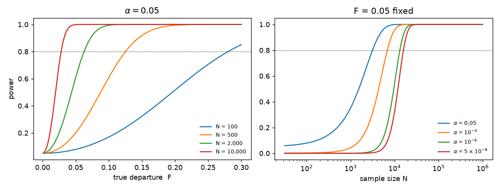
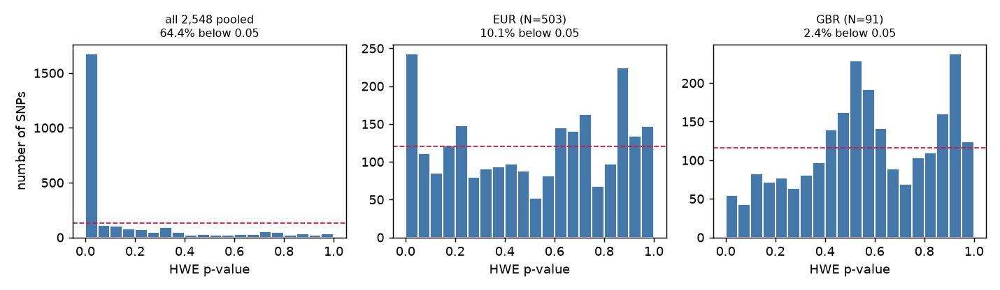

# S4 — Hypothesis testing, and what it doesn't tell you

> **Read before:** [Ch 12](../part-02-transmission-genetics/12-probability-and-testing.md) · **Time:** ~55 min

All code in this chapter runs from the repository root — the directory holding `README.md` and
`.venv` — with `source .venv/bin/activate`, and addresses data as `labs/data/…`.

A variant caller hands you three million sites. Some fraction of them are not real — the reads
mismapped, one allele failed to amplify, two paralogous genes collapsed into one locus. Nobody
is going to inspect them by eye. So you need a machine that takes genotype counts and returns a
number saying *how surprised should I be, if nothing is wrong?* That machine is the significance
test, and in genomics it is applied at industrial scale: Hardy–Weinberg filtering
([Ch 26](../part-05-population-genetics/26-hardy-weinberg.md)), variant QC
([Ch 46](../part-10-functional-genomics/46-variant-calling.md)), every locus in a GWAS
([Ch 51](../part-11-human-and-statistical-genomics/51-gwas.md)), every gene in an RNA-seq
experiment ([Ch 47](../part-10-functional-genomics/47-rna-seq.md)). Every one of those chapters is
still ahead of you. They are named as destinations, not prerequisites: nothing below assumes you
have read them, and the genetics this chapter needs is defined here as statistics before it is
used.

This chapter builds that machine and then spends most of its length on the far more useful
question of what the machine does **not** tell you. That imbalance is deliberate. The mechanics
take one section. The misreadings take the rest of your career.

## What you'll be able to do

- Name the four components of a significance test and say which one carries the modelling risk
- Compute a χ² goodness-of-fit test from a genetic hypothesis, get the degrees of freedom
  right — including when a parameter was estimated from the same data — and say where the
  asymptotic approximation fails and an exact test is required
- State five things a p-value is not, and compute the base-rate calculation that shows why
- Compute the power of a test from effect size, sample size and α, and refuse to interpret a
  non-significant result without it
- Read a p-value histogram from a genome-wide scan as a diagnostic instrument
- Predict how many false positives a scan of *m* loci will produce, and recognise the
  analysis choices that silently multiply *m*

## The core idea

A significance test is **proof by contradiction with a probability attached**, and it runs in
exactly one direction.

You assume something specific and boring — "this population is in Hardy–Weinberg proportions",
"this gene is not differentially expressed". That assumption, the **null hypothesis**, is
specific enough to generate data. You then compute a number from your real data, a **test
statistic**, chosen so that big values mean "unlike what the null produces". You work out the
distribution that statistic would have **if the null were true**. And you ask: what fraction of
that null distribution is at least as extreme as what I actually saw? That fraction is the
**p-value**.

Small p means: *the null makes my data look weird*. That is all it means. It says nothing about
how likely the null is, nothing about how big the effect is, and — this is the one that
repeatedly ruins studies — a **large** p says nothing at all, because "the null makes my data
look unremarkable" is also true of every null that is wrong in a way too small for your sample
size to notice.

> **The p-value is a property of the null hypothesis, not of your hypothesis.** It answers
> "how often would data like mine arise if nothing were going on?" — and never the question
> you actually care about, which is "given my data, what is going on?" Getting from the first
> to the second requires a prior, and that is [S6](./S6-likelihood-and-bayes.md).

---

## 1. The four moving parts

All of it, on real data. Load the 1000 Genomes chr22 window that ships with the labs — 2,548
people, every biallelic SNV in a 1 Mb region. Note the deliberate choice of file: `chr22_qc`
has already been Hardy–Weinberg-filtered at p < 10⁻⁶, so testing HWE on it would be circular.
The raw VCF has not, and it needs no external tools to read.

```bash
cd /path/to/learn-genomics   # the directory holding README.md and .venv
source .venv/bin/activate
```

```python
import gzip, numpy as np, pandas as pd

def load_vcf(path):
    """Biallelic SNVs from a 1000G VCF -> (variants x samples) ALT dosage 0/1/2."""
    pos, rows = [], []
    with gzip.open(path, "rt") as f:
        for line in f:
            if line.startswith("##"):
                continue
            fl = line.rstrip("\n").split("\t")
            if line.startswith("#CHROM"):
                samples = np.array(fl[9:]); continue
            if len(fl[3]) != 1 or len(fl[4]) != 1:
                continue                                   # skip indels
            pos.append(int(fl[1]))
            rows.append([(g[0] == "1") + (g[2] == "1") for g in fl[9:]])
    return np.array(pos), np.array(rows, dtype=np.int8), samples

pos, G, samples = load_vcf("labs/data/chr22_sub.vcf.gz")
panel = pd.read_csv("labs/data/panel.txt", sep="\t").set_index("sample").reindex(samples)
print(G.shape, "variants x samples")
print(panel["super_pop"].value_counts().to_dict())
```

```
(27895, 2548) variants x samples
{'AFR': 660, 'EAS': 504, 'EUR': 503, 'SAS': 489, 'AMR': 347}
```

(The population labels sum to 2,503, not 2,548: `panel.txt` covers only the unrelated subset,
and the remaining 45 samples get `NaN`, which `value_counts` drops. Worth noticing — a count
that doesn't add up is usually the first sign of a join you got wrong.)

Take the first common SNP, chr22:20,000,722 (G>A), in the 503 European-ancestry samples. The
genotype counts are 166 GG, 237 GA, 100 AA.

| Component | Here |
|---|---|
| **Null hypothesis** | Genotypes are a random pairing of alleles: *p*², 2*pq*, *q*² |
| **Test statistic** | χ² = Σ (observed − expected)² / expected |
| **Null distribution** | χ² with **1** degree of freedom |
| **p-value** | P(statistic ≥ observed) under that distribution |

```python
from scipy import stats

n_GG, n_GA, n_AA = 166, 237, 100
N = n_GG + n_GA + n_AA

p = (2*n_GG + n_GA) / (2*N)          # frequency of G, estimated FROM THESE DATA
q = 1 - p
exp = np.array([p**2, 2*p*q, q**2]) * N
obs = np.array([n_GG, n_GA, n_AA])

X2 = ((obs - exp)**2 / exp).sum()
print(f"N={N}  p(G)={p:.4f}")
print("observed", obs)
print("expected", exp.round(2))
print(f"X2 = {X2:.4f}")
print(f"p-value, df=1 (correct)   = {stats.chi2.sf(X2, 1):.4f}")
print(f"p-value, df=2 (the error) = {stats.chi2.sf(X2, 2):.4f}")

# scipy's one-liner. ddof is SUBTRACTED from k-1, so ddof=1 gives df = 3-1-1 = 1
print(stats.chisquare(obs, exp, ddof=1))
```

```
N=503  p(G)=0.5656
observed [166 237 100]
expected [160.92 247.17  94.92]
X2 = 0.8516
p-value, df=1 (correct)   = 0.3561
p-value, df=2 (the error) = 0.6533

Power_divergenceResult(statistic=np.float64(0.8515629301279481), pvalue=np.float64(0.3561105681398722))
```

Three parts of that are routine arithmetic. The part that carries all the risk is **the
expected counts**, because they encode the genetic hypothesis. Change the hypothesis and the
expectations change; the machinery does not care and will happily return a p-value for a null
nobody believes ([Ch 12](../part-02-transmission-genetics/12-probability-and-testing.md) is
the genetics-side treatment of exactly this).

Note `scipy.stats.chisquare`'s `ddof`: it is subtracted from *k* − 1, so `ddof=1` means df = 1.
Leave it at its default of 0 and you silently get df = 2 and the wrong answer.

## 2. Where the degrees of freedom come from

Three genotype classes, so the intuition says df = 3 − 1 = 2. That is wrong here, and the reason
is worth seeing rather than memorising: **the allele frequency *p* was estimated from the same
counts you are testing.** The expected values were bent toward the data before the comparison,
so the residuals have less room to move than they otherwise would.

The rule is df = (classes) − 1 − (parameters estimated from these data) = 3 − 1 − 1 = **1**.
You do not have to take that on faith — simulate the null and look:

```python
rng = np.random.default_rng(0)
N, p_true, B = 503, 0.5656, 200_000

# 200,000 populations that really ARE in Hardy-Weinberg
draws = rng.multinomial(N, [p_true**2, 2*p_true*(1-p_true), (1-p_true)**2], size=B)
n0, n1, n2 = draws.T

def X2_from(n0, n1, n2, p):
    e = np.stack([p**2, 2*p*(1-p), (1-p)**2], axis=-1) * N
    o = np.stack([n0, n1, n2], axis=-1)
    return ((o - e)**2 / e).sum(-1)

X2_refit = X2_from(n0, n1, n2, (2*n0 + n1) / (2*N))   # p re-estimated each time
X2_known = X2_from(n0, n1, n2, p_true)                # p handed to us for free

print(f"mean X2, p re-estimated from the data : {X2_refit.mean():.3f}   (df = 1)")
print(f"mean X2, p known in advance           : {X2_known.mean():.3f}   (df = 2)")
print(f"simulated p-value = P(X2 >= 0.8516)   = {(X2_refit >= 0.8516).mean():.4f}")
print(f"analytic  p-value, chi2 df=1          = {stats.chi2.sf(0.8516, 1):.4f}")
print(f"false-positive rate at alpha=0.05, df=1: {(stats.chi2.sf(X2_refit,1) < 0.05).mean():.4f}")
print(f"false-positive rate at alpha=0.05, df=2: {(stats.chi2.sf(X2_refit,2) < 0.05).mean():.4f}")
```

```
mean X2, p re-estimated from the data : 1.004   (df = 1)
mean X2, p known in advance           : 2.001   (df = 2)
simulated p-value = P(X2 >= 0.8516)   = 0.3572
analytic  p-value, chi2 df=1          = 0.3561
false-positive rate at alpha=0.05, df=1: 0.0502
false-positive rate at alpha=0.05, df=2: 0.0144
```

The mean of a χ² distribution equals its df, and the simulation reads it straight off: 1.004
when *p* is fitted, 2.001 when *p* is given. Estimating one parameter costs exactly one degree
of freedom. It also shows two things worth carrying:

- **You can always build a null distribution by brute force.** Simulate under the null, compute
  the statistic, count the tail. Every analytic null distribution is a shortcut for this, and
  when your situation has no textbook null — a weird statistic, a small sample, a bespoke model
  — the simulation *is* the test (this is the permutation/parametric-bootstrap idea, used
  throughout [Ch 33](../part-07-molecular-evolution/33-neutral-theory-and-selection-tests.md)).
- **The wrong df is not a harmless rounding error.** With df = 2 the test rejects 1.4% of the
  time instead of 5% — it is *conservative*, which sounds safe and is not: you have thrown away
  most of your power for nothing, and you will never see the real departures you missed.

## 3. What a p-value is not

| It is not | Why not |
|---|---|
| **P(null is true \| data)** | It is P(data this extreme \| null true). Reversing a conditional requires a prior. P(rain \| clouds) ≠ P(clouds \| rain) |
| **The probability the result is a fluke** | Same reversal. The fluke rate depends on how many nulls were true to begin with — see below |
| **A measure of effect size** | p depends on effect size *and* sample size. A trivial effect at *N* = 10⁶ gives p = 10⁻²⁰; a huge effect at *N* = 10 gives p = 0.3 |
| **Evidence for the null when large** | A large p is what you get both when the null is true and when your test is too weak to tell. §5 |
| **Repeatable** | Under a true alternative, the p-value is itself a random variable with a wide distribution. A study at 50% power replicates half the time by construction |

The first two are the same error, and it is quantifiable. Doing the arithmetic needs an effect
size, so name one now, because the rest of this chapter runs on it. For the HWE test the effect
size is *F*, the **standardised heterozygote deficit**: *F* = 1 − (observed heterozygotes) /
(heterozygotes the *p*², 2*pq*, *q*² proportions expect). *F* = 0 is exact agreement, *F* > 0 too
few heterozygotes, *F* < 0 too many. Take it as that statistic and nothing more for now — it is a
scaled residual, on a scale that does not depend on the allele frequency. What a nonzero *F*
*means* biologically is a Part 5 question, and [Ch 26](../part-05-population-genetics/26-hardy-weinberg.md)
and [Ch 28](../part-05-population-genetics/28-structure-and-inbreeding.md), both still ahead of
you, give it its three standard readings: inbreeding, population structure, and assay failure.

Suppose you are HWE-filtering a million variants; suppose 1% of them are genuinely broken by an
assay pathology strong enough to induce *F* = 0.15, and you have *N* = 2,000 samples. Of the
variants you flag, what fraction are actually broken?

```python
def power(N, F, alpha):
    """Power of the 1-df HWE test: noncentrality lambda = N*F^2."""
    return stats.ncx2.sf(stats.chi2.ppf(1-alpha, 1), 1, N*F**2)

m, prior_bad, N, F_bad = 1_000_000, 0.01, 2000, 0.15
print(f"{'alpha':>10} {'power':>7} {'true pos':>10} {'false pos':>11} {'PPV':>8}")
for a in [0.05, 1e-3, 1e-6, 1e-8]:
    pw = power(N, F_bad, a)
    tp, fp = m*prior_bad*pw, m*(1-prior_bad)*a
    print(f"{a:>10.0e} {pw:>7.3f} {tp:>10,.0f} {fp:>11,.0f} {tp/(tp+fp):>8.3f}")
```

```
     alpha   power   true pos   false pos      PPV
     5e-02   1.000     10,000      49,500    0.168
     1e-03   1.000      9,997         990    0.910
     1e-06   0.965      9,654           1    1.000
     1e-08   0.836      8,358           0    1.000
```

At α = 0.05, **83% of the variants you would throw away are fine**, even though every one of
them "failed at p < 0.05". Nothing about the arithmetic of the test changed; what changed is the
base rate. Move the threshold to 10⁻⁶ and the flagged set is essentially pure while still
catching 96.5% of the genuinely broken variants. That calculation *is* the reason
[Ch 26 §6](../part-05-population-genetics/26-hardy-weinberg.md), when you reach it, will set the
HWE filter at p < 10⁻⁶ rather than 0.05, and the reason a genome-wide association threshold is
5 × 10⁻⁸ rather than anything you would use on a single hypothesis.

## 4. Type I, Type II, and power

Two ways to be wrong, and they trade off against each other.

|  | Null actually true | Null actually false |
|---|---|---|
| **Reject** | **Type I error** — rate α | Correct — probability **1 − β** = *power* |
| **Fail to reject** | Correct | **Type II error** — rate β |

α is chosen by you. β is not: it falls out of the effect size, the sample size, and α. For the
HWE test the algebra is unusually clean. Write the three observed counts as their expectations
plus a deviation — *n*₀ − *Np̂*² = *Np̂q̂F̂*, *n*₁ − 2*Np̂q̂* = −2*Np̂q̂F̂*, *n*₂ − *Nq̂*² = *Np̂q̂F̂*,
which is just §3's definition of *F̂* rearranged — put them into Σ(observed − expected)²/expected,
and every *p̂* and *q̂* cancels: the statistic is exactly *N F̂*² on 1 df. So the
**non-centrality parameter is λ = *N F*²**, and power is a tail probability of a non-central χ².

That is the one-parameter case of a fact worth carrying whole. Take any goodness-of-fit test over
*k* classes: the null says the class proportions are π₁ … π<sub>k</sub>, the truth is some other
set p₁ … p<sub>k</sub> (subscripted, to keep them apart from the allele frequency *p*). Then the
**non-centrality is λ = *N* Σ (pᵢ − πᵢ)²/πᵢ** — the same sum the test statistic computes, with
*true* proportions substituted for observed counts, evaluated on the df the null distribution
already has. Put the Hardy–Weinberg alternative (*p*² + *Fpq*, 2*pq*(1 − *F*), *q*² + *Fpq*)
through it and the allele frequencies cancel exactly as they did above, returning λ = *N F*².
Reach for the general form whenever the null has more than two free classes — a 9:3:3:1 dihybrid
ratio, a 1:2:1 cross — which is how
[Ch 12](../part-02-transmission-genetics/12-probability-and-testing.md), the chapter you read
next, computes the power of a cross before running it.

```python
def power_sim(N, F, alpha, B=20000):
    """Simulate B populations with true inbreeding coefficient F, test HWE, count rejections."""
    p = 0.3
    probs = [p*p + F*p*(1-p), 2*p*(1-p)*(1-F), (1-p)**2 + F*p*(1-p)]
    n0, n1, n2 = rng.multinomial(N, probs, size=B).T
    ph = (2*n0 + n1) / (2*N)
    Fh = (n0/N - ph**2) / (ph*(1-ph))
    return (stats.chi2.sf(N*Fh**2, 1) < alpha).mean()

print(f"{'N':>7} {'F':>6} {'alpha':>8} {'simulated':>10} {'analytic':>9}")
for N, F, a in [(100,0.05,0.05), (1000,0.05,0.05), (10000,0.05,0.05),
                (1000,0.10,0.05), (1000,0.20,0.05),
                (1000,0.10,0.001), (1000,0.10,5e-8)]:
    print(f"{N:>7} {F:>6.2f} {a:>8.0e} {power_sim(N,F,a):>10.3f} {power(N,F,a):>9.3f}")
```

```
      N      F    alpha  simulated  analytic
    100   0.05    5e-02      0.079     0.079
   1000   0.05    5e-02      0.343     0.353
  10000   0.05    5e-02      0.999     0.999
   1000   0.10    5e-02      0.873     0.885
   1000   0.20    5e-02      1.000     1.000
   1000   0.10    1e-03      0.441     0.449
   1000   0.10    5e-08      0.012     0.011
```

Simulation and formula agree, which is the point of running both. Read the last three rows
together: the *same* study, the *same* real departure, tested at three different thresholds, has
power 0.885, 0.449 and 0.011. **Tightening α to control false positives buys that control with
power, and the exchange rate is brutal.**

```python
import matplotlib.pyplot as plt
fig, ax = plt.subplots(1, 2, figsize=(10, 3.8))
Fg = np.linspace(0.001, 0.30, 300)
for Nv in [100, 500, 2000, 10000]:
    ax[0].plot(Fg, power(Nv, Fg, 0.05), label=f"N = {Nv:,}")
ax[0].set_xlabel("true departure  F"); ax[0].set_ylabel("power"); ax[0].set_title(r"$\alpha = 0.05$")
Ng = np.logspace(1.5, 6, 300)
for a, lab in [(0.05, r"$\alpha=0.05$"), (1e-3, r"$\alpha=10^{-3}$"),
               (1e-6, r"$\alpha=10^{-6}$"), (5e-8, r"$\alpha=5\times10^{-8}$")]:
    ax[1].plot(Ng, power(Ng, 0.05, a), label=lab)
ax[1].set_xscale("log"); ax[1].set_xlabel("sample size N"); ax[1].set_title("F = 0.05 fixed")
for a_ in ax: a_.axhline(0.8, ls=":", c="k", lw=.8); a_.legend(frameon=False, fontsize=8)
fig.tight_layout(); fig.savefig("../../part-S-statistics/S4-power.png", dpi=130)
```



Inverting the relationship gives the design rule. Solving `ncx2.sf(crit, 1, λ) = 0.8` for λ:

| α | λ for 80% power | *N* needed at *F* = 0.05 | *N* needed at *F* = 0.20 |
|---|---|---|---|
| 0.05 | 7.85 | 3,140 | 196 |
| 10⁻³ | 17.07 | 6,830 | 427 |
| 10⁻⁶ | 32.87 | 13,148 | 822 |
| 5 × 10⁻⁸ | 39.60 | 15,840 | 990 |

Sample size scales as **1/effect²**. Halving the effect you want to detect quadruples the study.
This single fact explains the entire trajectory of human genetics from candidate-gene studies of
200 people to biobanks of 500,000 ([Ch 51](../part-11-human-and-statistical-genomics/51-gwas.md)).

## 5. Absence of evidence: compute the power of the test you just ran

Return to §1: χ² = 0.85, p = 0.36, not significant. It is nearly irresistible to write "the
population is in Hardy–Weinberg equilibrium at this locus". Do not. Ask instead what departures
that test could have detected. Run it in the 91 British (GBR) samples rather than all 503
Europeans and the question gets sharper:

```python
from scipy.optimize import brentq
for F in [0.05, 0.10, 0.20, 0.25]:
    print(f"  N=91, true F={F:.2f}: power = {power(91, F, 0.05):.3f}")
print(f"  N=91  detects F = {brentq(lambda F: power(91,F,0.05)-0.8, 0.01, 2):.3f} with 80% power")
print(f"  N=503 detects F = {brentq(lambda F: power(503,F,0.05)-0.8, 0.01, 2):.3f}")
```

```
  N=91, true F=0.05: power = 0.076
  N=91, true F=0.10: power = 0.159
  N=91, true F=0.20: power = 0.479
  N=91, true F=0.25: power = 0.665
  N=91  detects F = 0.294 with 80% power
  N=503 detects F = 0.125
```

At *N* = 91 the test rejects 5% of the time when nothing is happening and 7.6% of the time when
*F* = 0.05. It is not measuring anything. To be reliably caught, a departure would have to
exceed *F* ≈ 0.29 — larger than the heterozygote deficit produced by mating full sibs. So the
non-significant result excludes essentially nothing of biological interest.

**The fix is to report the effect size and its interval instead of the verdict.** From χ² = *N F̂*²
on 1 df it follows immediately that √*N* · *F̂* is standard normal under the null, so
SE(*F̂*) ≈ 1/√*N* and the interval is *F̂* ± 1.96/√*N*. Check it against a bootstrap, which
assumes nothing:

```python
g = np.repeat([0, 1, 2], [166, 237, 100])            # the 503 EUR genotypes
def Fhat(g):
    n0, n1, n = (g == 0).sum(), (g == 1).sum(), len(g)
    p = (2*n0 + n1) / (2*n)
    return (n0/n - p*p) / (p*(1-p))

bs = np.array([Fhat(rng.choice(g, len(g), replace=True)) for _ in range(20000)])
print(f"F_hat = {Fhat(g):+.4f}")
print(f"bootstrap SE = {bs.std():.4f}   (1/sqrt(N) = {1/np.sqrt(len(g)):.4f})")
print(f"bootstrap 95% CI = [{np.percentile(bs,2.5):+.3f}, {np.percentile(bs,97.5):+.3f}]")
```

```
F_hat = +0.0411
bootstrap SE = 0.0444   (1/sqrt(N) = 0.0446)
bootstrap 95% CI = [-0.047, +0.127]
```

"*F̂* = +0.041, 95% CI [−0.048, +0.127]" is a real statement: the data rule out a deficit above
about 0.13 and an excess below about −0.05, and are agnostic in between. "p = 0.36, not
significant" throws all of that away. **A confidence interval contains the test — anything
outside it would have been rejected — and adds the one thing the test omits, which is the
magnitude.** Reach for intervals by default; see [S3](./S3-sampling-and-estimation.md) for how
they are constructed.

## 6. Running the test for real: HWE across thousands of SNPs

One test tells you little. Thousands of tests tell you about the *machinery*. If a null is true
across a set of loci, the p-values must be **uniform on [0,1]** — that is what "p-value" means,
and it makes the histogram of p-values a diagnostic instrument.

```python
def hwe_scan(Gm, min_maf=0.05):
    """Vectorised HWE chi-square over every variant."""
    N = Gm.shape[1]
    n0 = (Gm == 0).sum(1); n1 = (Gm == 1).sum(1); n2 = (Gm == 2).sum(1)
    p = (2*n0 + n1) / (2*N); q = 1 - p
    keep = np.minimum(p, q) >= min_maf
    F = (n0[keep]/N - p[keep]**2) / (p[keep]*q[keep])
    return F, stats.chi2.sf(N*F**2, 1), keep.sum(), N

for label, mask in [("all 26 populations pooled", np.ones(len(samples), bool)),
                    ("EUR super-population",  (panel["super_pop"] == "EUR").to_numpy()),
                    ("GBR only (British)",    (panel["pop"] == "GBR").to_numpy())]:
    F, pv, m, N = hwe_scan(G[:, mask])
    print(f"{label:26s} N={N:5d}  {m:5d} SNPs   p<0.05: {(pv<0.05).mean():6.1%}   "
          f"p<1e-6: {(pv<1e-6).mean():6.2%}   median F = {np.median(F):+.4f}")
```

```
all 26 populations pooled  N= 2548   2603 SNPs   p<0.05:  64.4%   p<1e-6: 31.66%   median F = +0.0591
EUR super-population       N=  503   2412 SNPs   p<0.05:  10.1%   p<1e-6:  0.66%   median F = +0.0009
GBR only (British)         N=   91   2329 SNPs   p<0.05:   2.4%   p<1e-6:  0.04%   median F = +0.0010
```

```python
fig, axs = plt.subplots(1, 3, figsize=(11, 3.2))
for ax, (lab, mask) in zip(axs, [("all 2,548 pooled", np.ones(len(samples), bool)),
                                 ("EUR (N=503)", (panel["super_pop"] == "EUR").to_numpy()),
                                 ("GBR (N=91)",  (panel["pop"] == "GBR").to_numpy())]):
    _, pv, _, _ = hwe_scan(G[:, mask])
    ax.hist(pv, bins=20, range=(0, 1), color="#4477aa", edgecolor="w")
    ax.axhline(len(pv)/20, ls="--", c="crimson", lw=1)      # what uniform would look like
    ax.set_title(f"{lab}\n{(pv<0.05).mean():.1%} below 0.05", fontsize=9)
    ax.set_xlabel("HWE p-value")
axs[0].set_ylabel("number of SNPs")
fig.tight_layout(); fig.savefig("../../part-S-statistics/S4-pvalues.png", dpi=130)
```



**Pooled, 64% of common SNPs reject.** Not because 64% of chr22 is broken — because the null is
false. Pooling populations with different allele frequencies produces a heterozygote deficit at
every locus in the genome by pure arithmetic. The name for that is the **Wahlund effect**, and
the arithmetic above is all of it you need here;
[Ch 26 §8](../part-05-population-genetics/26-hardy-weinberg.md) and
[Ch 28](../part-05-population-genetics/28-structure-and-inbreeding.md), both ahead of you in
Part 5, derive it and say what it is good for. The median *F* of +0.059 is a genome-wide
*F*<sub>ST</sub> readout — the between-group variance ratio
[S3](./S3-sampling-and-estimation.md)'s worked example put an error bar on — not an assay report. This is why HWE QC must
be run **within an ancestry-homogeneous stratum**, and it is the same phenomenon that forces
principal-component covariates into every GWAS
([Ch 51](../part-11-human-and-statistical-genomics/51-gwas.md), [S7](./S7-high-dimensional-data.md)).

Within EUR the excess is far smaller but not gone — 10.1% against a nominal 5%, and the residual
is 1000 Genomes' EUR being itself five populations (GBR, CEU, TSI, IBS, FIN). Within GBR alone
the p-values are, if anything, **too conservative**: only 2.4% fall below 0.05 where 5% should,
the small-p end of the histogram is visibly thinned, and the mass has piled up in the middle —
31% of these SNPs land between 0.4 and 0.6, against the 22% a matched null produces. That is
not the χ² approximation misbehaving — simulating genotypes drawn exactly from HWE at these
allele frequencies and *N* = 91 gives a false-positive rate of 0.046 and a near-flat histogram.
It is a property of this dataset: the 1000 Genomes release was genotyped from low-coverage
sequencing and then refined using haplotype information shared across samples, a step that
pulls genotype calls toward population expectations. **A p-value histogram that sags at the
small-p end and bulges in the middle is itself a finding** — flat is what a true null looks
like, so a bulge says something upstream regularised your data.

A last caution on this test, and it is the most consequential one in practice. The χ²
approximation needs expected counts in every cell, and at low minor-allele frequency the
minor-homozygote expectation is tiny. Compare against `plink2 --hardy`, which runs the exact
conditional test instead:

```python
h = pd.read_csv("labs/data/chr22_hwe.hardy", sep="\t")     # plink2 --hardy, same 2,548 samples
N = G.shape[1]
n0 = (G == 0).sum(1); n1 = (G == 1).sum(1); n2 = (G == 2).sum(1)
p = (2*n0 + n1) / (2*N); q = 1 - p
with np.errstate(all="ignore"):
    F = (n0/N - p**2) / (p*q)
    mine = stats.chi2.sf(N*F**2, 1)
maf, exact = np.minimum(p, q), h["P"].to_numpy()
for lo, hi in [(0.0005, 0.005), (0.005, 0.05), (0.05, 0.5)]:
    m = (maf >= lo) & (maf < hi)
    print(f"MAF [{lo}, {hi}): n={m.sum():6d}  chi2 p<1e-6: {(mine[m]<1e-6).sum():5d}"
          f"   exact p<1e-6: {(exact[m]<1e-6).sum():5d}")
```

```
MAF [0.0005,0.005): n=  7312  chi2 p<1e-6:   292   exact p<1e-6:     1
MAF [0.005,0.05): n=  2994  chi2 p<1e-6:   341   exact p<1e-6:   114
MAF [0.05,0.5): n=  2603  chi2 p<1e-6:   824   exact p<1e-6:   793
```

At common frequencies the two agree (824 vs 793). Below MAF 0.5% the χ² test flags **292
variants that the exact test flags one of** — a 292-fold over-rejection, all of it in the
anti-conservative direction, all of it good rare variants. Use `plink2 --hardy` (or
`--hardy midp`) rather than a hand-rolled χ² whenever the minor allele is rare; SciPy has no
built-in Hardy–Weinberg exact test.

## 7. Multiple testing, introduced

Set α = 0.05 and you have declared a willingness to be wrong one time in twenty. Run the test
3,564 times and you have declared a willingness to be wrong about 178 times. The curriculum's
QC'd genotype set is exactly 3,564 SNPs in 2,503 unrelated samples, so we can watch it happen —
with a phenotype that is a coin flip, so every null is true by construction.

```python
qc = pd.read_csv("labs/data/chr22_qc.pvar", sep="\t", comment="#", header=None,
                 names=["chrom","pos","id","ref","alt","filter","info"])
psam = pd.read_csv("labs/data/chr22_qc.psam", sep="\t")
X = G[np.isin(pos, qc["pos"])][:, np.isin(samples, psam["#IID"])].astype(float)

Xc = X - X.mean(1, keepdims=True); ss = np.sqrt((Xc**2).sum(1))
n, m = X.shape[1], X.shape[0]
hits, mins = [], []
for _ in range(500):
    y = rng.integers(0, 2, n).astype(float); yc = y - y.mean()   # a coin flip
    r = (Xc @ yc) / (ss * np.sqrt((yc**2).sum()))
    pv = 2 * stats.t.sf(np.abs(r * np.sqrt((n-2)/(1-r**2))), n-2)
    hits.append((pv < 0.05).sum()); mins.append(pv.min())
hits, mins = np.array(hits), np.array(mins)

print(f"500 random phenotypes, {m} SNPs each")
print(f"  mean hits at p<0.05 = {hits.mean():.1f}   (expected {0.05*m:.1f})")
print(f"  range               = {hits.min()} to {hits.max()}")
print(f"  sd of hit count     = {hits.std():.1f}   (binomial sd if independent = {np.sqrt(m*0.05*0.95):.1f})")
print(f"  median smallest p   = {np.median(mins):.2e}")
print(f"  replicates with any p < 0.05/{m} = {(mins < 0.05/m).sum()}/500")
```

```
500 random phenotypes, 3564 SNPs each
  mean hits at p<0.05 = 177.8   (expected 178.2)
  range               = 39 to 507
  sd of hit count     = 82.5   (binomial sd if independent = 13.0)
  median smallest p   = 6.17e-04
  replicates with any p < 0.05/3564 = 6/500
```

Three things to take from this. First, the expectation is exact: 177.8 against a predicted
178.2, and every one of those "hits" is a phenotype that does not exist. Second, the *typical
best* p-value in a null scan is 6 × 10⁻⁴ — a number that would look publishable on its own and
means nothing here, which is why the **Bonferroni** threshold α/*m* = 1.4 × 10⁻⁵ exists and why
only 6 replicates in 500 produce anything beating it. Third, and least obvious: the spread of
the hit count is 83, not the 13 you would get from 3,564 independent tests. These SNPs sit
within 1 Mb of each other and are in strong linkage disequilibrium
([Ch 29](../part-05-population-genetics/29-linkage-disequilibrium.md)), so they are nowhere near
independent. **Expectation survives dependence; variance does not.** Correlated tests are the
reason Bonferroni over-corrects *in this 1 Mb window* — the effective *m* here is far below
3,564, so α/*m* is a stricter threshold than controlling the family-wise error rate actually
requires, and the honest fix is a smaller effective *m* (permutation thresholds,
effective-number-of-tests corrections).

Resist promoting that into a law about genotype data, because genome-wide the sign can flip. A
genotyping array is not the genome: it is a few hundred thousand chosen positions standing in for
about ten million common variants, so each marker also speaks for the neighbours it correlates
with and you never measured. Counting the rows in your file then *under*-states how many
questions you asked — by roughly two-fold on a typical array.
[S7 §2](./S7-high-dimensional-data.md) does this properly: it measures the effective number of
independent tests rather than assuming one, and shows the answer moving with the population you
measured it in.

Separately, insisting that the probability of *even one* false positive stay below 0.05 is a
brutal target once *m* is large, which is why false-discovery-rate methods — which control the
expected *proportion* of false positives among your discoveries instead — exist.
[S7](./S7-high-dimensional-data.md) takes both from here.

## 8. The garden of forking paths

Multiple testing does not require you to *report* many tests. It only requires you to have *had
the option* of many, because the effective *m* is the number of analyses you would have been
willing to run, not the number you did run. Every one of the choices below is defensible, and
each one is made after seeing data.

Same real genotypes, same coin-flip phenotype. Now allow three genetic codings (additive,
dominant, recessive) and five populations to analyse separately, and report the best p-value:

```python
codings = {"additive": X, "dominant": (X >= 1).astype(float), "recessive": (X == 2).astype(float)}
sp = panel["super_pop"].to_numpy()[np.isin(samples, psam["#IID"])]
POPS = ["EUR", "AFR", "EAS", "SAS", "AMR"]

def pvals(Xm, y):
    Xc = Xm - Xm.mean(1, keepdims=True); yc = y - y.mean(); n = len(y)
    den = np.sqrt((Xc**2).sum(1) * (yc**2).sum())
    r = np.clip(np.divide(Xc@yc, den, out=np.zeros(Xm.shape[0]), where=den>0), -.999999, .999999)
    return 2 * stats.t.sf(np.abs(r*np.sqrt((n-2)/(1-r**2))), n-2)

res = {k: [] for k in ["additive only", "best of 3 codings", "best of 5 populations", "best of all 15"]}
for _ in range(200):
    y = rng.integers(0, 2, X.shape[1]).astype(float)
    res["additive only"].append((pvals(X, y) < 0.05).mean())
    res["best of 3 codings"].append(
        (np.stack([pvals(v, y) for v in codings.values()]).min(0) < 0.05).mean())
    res["best of 5 populations"].append(
        (np.stack([pvals(X[:, sp==s], y[sp==s]) for s in POPS]).min(0) < 0.05).mean())
    res["best of all 15"].append(
        (np.stack([pvals(v[:, sp==s], y[sp==s]) for v in codings.values() for s in POPS]).min(0) < 0.05).mean())
for k, v in res.items():
    print(f"  {k:24s} type-I error at alpha=0.05 : {np.mean(v):.4f}")
```

```
  additive only            type-I error at alpha=0.05 : 0.0494
  best of 3 codings        type-I error at alpha=0.05 : 0.0903
  best of 5 populations    type-I error at alpha=0.05 : 0.1782
  best of all 15           type-I error at alpha=0.05 : 0.2676
```

A nominal 5% test now rejects **27% of the time** on data with no signal whatsoever, and nobody
lied, fabricated, or ran a test they did not believe in. "The effect is recessive." "It's
present in Europeans." Both are ordinary sentences in ordinary papers. The defences are
pre-registration, an explicit analysis plan, correcting for every path you *could* have taken,
and — the only one that always works — replication in data you had not seen.

## 9. Where the frequentist frame runs out

Everything above conditions on the null being true and asks about the data. That is a strange
direction to reason in, and it is why the misreadings in §3 are so persistent: people keep
translating p-values into the statement they wanted, which is about the hypothesis given the
data.

Getting that statement legitimately requires a prior over hypotheses, and then Bayes' theorem
turns the likelihood into a posterior. The PPV table in §3 was a Bayesian calculation wearing
frequentist clothes — "1% of variants are broken" was a prior, and 0.168 was a posterior
probability. Genomics uses the explicit machinery constantly: posterior genotype probabilities
in variant callers ([Ch 46](../part-10-functional-genomics/46-variant-calling.md)), posterior
probabilities on trees ([Ch 34](../part-07-molecular-evolution/34-phylogenetics.md)),
fine-mapping posteriors ([Ch 52](../part-11-human-and-statistical-genomics/52-association-to-mechanism.md)),
and the ACMG framework for clinical variant classification
([Ch 55](../part-11-human-and-statistical-genomics/55-clinical-variant-interpretation.md)).
That is [S6](./S6-likelihood-and-bayes.md).

---

## Common misconceptions

| What people think | What's actually true |
|---|---|
| p = 0.03 means a 3% chance the null is true | It means data this extreme arise 3% of the time *if* the null is true. The probability the null is true depends on the base rate — at a 1% prior and α = 0.05, 83% of your rejections are nulls (§3) |
| p = 0.03 means a 97% chance the effect is real | Same reversal, restated. It is the single most common error in the applied literature |
| A non-significant result means no effect | It means the test could not distinguish the data from the null. At *N* = 91 the HWE test has 7.6% power against *F* = 0.05 — it would miss almost every real departure (§5) |
| A smaller p means a bigger effect | p mixes effect size with sample size. Report *F̂*, or a fold change, or an odds ratio, with an interval |
| p = 0.049 and p = 0.051 are different findings | They are the same finding. The 0.05 threshold is a convention, not a discontinuity in nature |
| Three genotype classes means df = 2 | df = 1, because *p* was estimated from the same counts. Using df = 2 cuts the false-positive rate to 1.4% and throws away power (§2) |
| A conservative test is the safe choice | It is safe against Type I and reckless against Type II. Conservative tests hide real problems, which for a QC filter is the failure that matters |
| α = 0.05 is a law of nature | It is Fisher's arbitrary convenience. Genomics routinely uses 5 × 10⁻⁸, 10⁻⁶, or an FDR target instead, because *m* is not 1 |
| Chi-square works on any count table | It is an asymptotic approximation. Below MAF ~0.5% it over-rejects HWE by ~300× against the exact test (§6) |
| Testing many hypotheses is fine if you report them all | Reporting is not the issue; the effective *m* is the number of analyses you could have run. Choosing a genetic model and a subgroup after the fact takes a 5% test to 27% (§8) |
| Correcting for *m* independent tests is enough | Genotype tests are correlated by LD. The expected number of false positives is unchanged, but its standard deviation is six times larger (§7) |
| If it replicates at p < 0.05 it's confirmed | A replication at 50% power fails half the time when the effect is real, and succeeds 5% of the time when it isn't. Power the replication, or the exercise is theatre |

## Worked example: a variant fails HWE at p = 10⁻²⁵. Should you drop it?

chr22:20,711,357 (A>G) in the 503 European-ancestry samples: 306 AA, 109 AG, 88 GG.

**Step 1 — compute the statistic and the effect size, not just the p-value.**
*p̂*(A) = (612 + 109)/1006 = 0.717. Expected 258.4 / 204.3 / 40.4 against observed 306 / 109 / 88.
*F̂* = +0.466, χ² = *N F̂*² = 503 × 0.2175 = **109.4**, p = 1.3 × 10⁻²⁵ on 1 df.

**Step 2 — check the test is valid.** Smallest expected cell is 40.4, MAF is 0.283, *N* is 503.
The asymptotic χ² is fine here; no need for the exact test (§6).

**Step 3 — read the sign.** *F̂* > 0 is a heterozygote **deficit**: too few AG calls. The
candidate explanations are inbreeding, population structure, and allele dropout — a second
variant under a primer or probe site, a null allele, or an overlapping deletion.

**Step 4 — use the structure of the data to discriminate.** Population structure is a property
of *how you pooled*; an assay artefact is a property of the *assay*. So stratify:

| Group | *N* | AA / AG / GG | *F̂* | p |
|---|---|---|---|---|
| EUR | 503 | 306 / 109 / 88 | +0.466 | 1.3 × 10⁻²⁵ |
| AFR | 660 | 116 / 209 / 335 | +0.288 | 1.3 × 10⁻¹³ |
| EAS | 504 | 221 / 119 / 164 | +0.522 | 1.1 × 10⁻³¹ |
| SAS | 489 | 338 / 92 / 59 | +0.442 | 1.4 × 10⁻²² |
| AMR | 347 | 161 / 113 / 73 | +0.304 | 1.5 × 10⁻⁸ |
| GBR | 91 | 54 / 19 / 18 | +0.505 | 1.5 × 10⁻⁶ |
| CEU | 99 | 66 / 16 / 17 | +0.572 | 1.3 × 10⁻⁸ |

**Step 5 — conclude.** The deficit is the same sign and the same magnitude in every
super-population, and survives all the way down to single populations of ~100 people where
structure and consanguinity differ wildly. Structure cannot do that — Wahlund depends on which
groups you mixed, and here there is nothing left to mix. An *F̂* of +0.5 also has no plausible
biological source: [Ch 26 §5](../part-05-population-genetics/26-hardy-weinberg.md) will show, in
Part 5, that even a fully lethal recessive induces only *F* = −*q*. A systematic failure to call
heterozygotes does exactly this, and this 1 Mb window sits inside 22q11.2, a region unusually
rich in low-copy repeats where mismapping and copy-number variation are common. **Drop it, and
flag the region.**

**Step 6 — note what the p-value contributed.** Almost nothing. Every one of those p-values is
below 10⁻⁶; they are indistinguishable as evidence and none of them told you the direction, the
magnitude, or the cause. The diagnosis came from the **sign and stability of *F̂*** across
strata. The p-value's only job was to get the variant onto the list. Its counterpart at
chr22:20,833,663 has *F̂* between −0.18 and −0.43 in every population — a heterozygote *excess*,
the signature of two paralogues collapsed onto one locus, and a different repair.

## Where this is used

- [Ch 12](../part-02-transmission-genetics/12-probability-and-testing.md) — χ² on progeny
  counts, estimated-parameter df, and ascertainment as a modelling error
- [Ch 26](../part-05-population-genetics/26-hardy-weinberg.md) — the HWE test, the exact test
  for rare variants, and the power table this chapter derives
- [Ch 28](../part-05-population-genetics/28-structure-and-inbreeding.md) — *F* and
  *F*<sub>ST</sub>, the effect size behind the test in §6
- [Ch 33](../part-07-molecular-evolution/33-neutral-theory-and-selection-tests.md) — Tajima's
  *D*, HKA, MK: tests whose null distributions are built by coalescent simulation, exactly as
  in §2
- [Ch 46](../part-10-functional-genomics/46-variant-calling.md) — HWE and excess-heterozygosity
  annotations as variant filters
- [Ch 47](../part-10-functional-genomics/47-rna-seq.md) — tens of thousands of gene-level tests,
  and why the raw p-value column is never the answer column
- [Ch 51](../part-11-human-and-statistical-genomics/51-gwas.md) — 5 × 10⁻⁸, genomic control,
  QQ plots, and replication as the real threshold
- [Ch 57](../part-12-applications-and-ethics/57-genomics-in-practice.md) — why clinical
  reporting thresholds are not statistical thresholds
- [`lab-07`](../labs/lab-07-population-genetics.md) and
  [`lab-08`](../labs/lab-08-gwas.md) run these tests on the data used here

## Check yourself

**1. A paper reports "the SNP was in Hardy–Weinberg equilibrium (χ² = 2.1, df = 2, p = 0.35, N = 120)". Find two errors.**

<details><summary>Answer</summary>

**df is wrong.** The allele frequency was estimated from the same genotype counts, so
df = 3 − 1 − 1 = 1, not 2. The correct p-value is `chi2.sf(2.1, 1)` = 0.147, not 0.35. The
error is conservative — it makes departures harder to detect — which is why it survives review.

**"Was in Hardy–Weinberg equilibrium" is not a conclusion the data support.** At *N* = 120,
λ = *N F*² = 120 × 0.05² = 0.3 against *F* = 0.05, giving about 8% power. The test would have
missed almost any real departure (power = 0.085). The honest statement is "consistent with HWE
proportions", and the useful one reports *F̂* with an interval. Since χ² = *N F̂*², the reported
statistic implies |*F̂*| = √(2.1/120) = 0.132, and SE ≈ 1/√120 = 0.091, so the 95% interval is
about [−0.05, +0.31]. A dataset compatible with an *F* of 0.3 has not established equilibrium;
it has established that nobody looked hard enough to tell.

</details>

**2. You test 20,000 genes for differential expression at α = 0.05 and get 1,100 significant. A colleague says that proves something real is happening. Are they right?**

<details><summary>Answer</summary>

Partly, and the reasoning matters more than the verdict. Under a complete null you expect
20,000 × 0.05 = 1,000 hits, so 1,100 is only modestly more than nothing-happening produces —
and if the tests are correlated (genes in the same pathway, shared library-size effects) the
spread around 1,000 is much wider than the independent-binomial √(20000 × 0.05 × 0.95) ≈ 31, as
§7 showed for LD-correlated SNPs. So 1,100 is not evidence of anything on its own.

What *would* be evidence is the shape of the p-value histogram: a uniform background plus a
spike near zero, where the excess mass above uniform estimates the number of true effects.
That observation is the basis of FDR estimation ([S7](./S7-high-dimensional-data.md)). Report an
FDR-adjusted list, not a raw-p list.

</details>

**3. Two studies test the same association. Study A: N = 200, p = 0.04. Study B: N = 50,000, p = 0.04. Same evidence?**

<details><summary>Answer</summary>

The p-values are identical, so as *evidence against the null* they are comparable. As
*descriptions of the world* they are wildly different. p depends on effect size × √N, so the
same p at 250× the sample size implies an effect roughly √250 ≈ 16× smaller. Study A is
reporting something substantial and imprecisely estimated; study B is reporting something
minuscule and precisely estimated.

Two further asymmetries. Study B's estimate has a narrow confidence interval, so its effect
size is trustworthy; study A's is wide, and because only large estimates clear significance at
*N* = 200, whatever effect it reports is biased upward — the winner's curse. And a p of 0.04 at
*N* = 50,000 should prompt the question of whether the effect is large enough to care about at
all. Never compare studies by p-value; compare them by effect size and interval.

</details>

**4. Why does HWE QC get applied within ancestry groups rather than to a whole cohort, and what is the cost of getting this wrong?**

<details><summary>Answer</summary>

Pooling populations with different allele frequencies creates a heterozygote deficit at every
locus — the Wahlund effect — so the HWE null is false genome-wide for reasons that have nothing
to do with genotyping. §6 measured it: pooling all 26 populations of 1000 Genomes rejects 64.4%
of common SNPs at p < 0.05 with a median *F̂* of +0.059, against 10.1% within EUR and 2.4%
within GBR.

The cost of getting it wrong is that HWE QC stops being a genotyping-error detector and becomes
an ancestry-difference detector. You discard thousands of perfectly good variants — preferentially
the ones with the largest frequency differences between groups, which are exactly the ones most
informative about ancestry and often the most interesting biologically. It is also
asymmetric across cohorts: a homogeneous cohort loses nothing, an admixed one is gutted.

</details>

**5. You have 91 samples and want 80% power to detect F = 0.10 at α = 0.05. How many samples do you need, and what if you also need to survive Bonferroni correction over 3,564 SNPs?**

<details><summary>Answer</summary>

At α = 0.05 the non-centrality needed for 80% power on 1 df is λ₈₀ = 7.85. Since λ = *N F*²,
*N* = 7.85 / 0.01 = **785** — about 8.6× what you have.

Bonferroni over 3,564 tests gives α = 0.05/3564 = 1.4 × 10⁻⁵. Solving
`ncx2.sf(chi2.ppf(1-α,1), 1, λ) = 0.8` at that α gives λ₈₀ = 26.88, so
*N* = 26.88 / 0.01 ≈ **2,690** — 3.4× more again, purely to pay for the multiplicity. That ratio
is the quantitative content of "multiple testing is expensive": correcting for 3,564 tests costs
about as much sample size as tripling the study.

Sanity check the shape of the answer: *N* scales as 1/*F*², so wanting to detect *F* = 0.05
instead of 0.10 would multiply both numbers by four.

</details>
